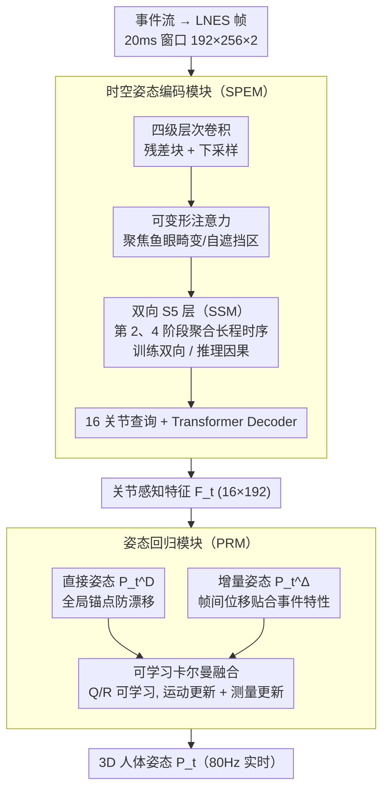

# E-3DPSM: A State Machine for Event-Based Egocentric 3D Human Pose Estimation

**会议**: CVPR 2026  
**arXiv**: [2604.08543](https://arxiv.org/abs/2604.08543)  
**代码**: [https://4dqv.mpi-inf.mpg.de/E-3DPSM/](https://4dqv.mpi-inf.mpg.de/E-3DPSM/)  
**领域**: Human Understanding  
**关键词**: 事件相机, 自我中心姿态估计, 状态空间模型, 3D人体姿态, 时间一致性

## 一句话总结

提出 E-3DPSM，一种基于事件相机的自我中心 3D 人体姿态状态机，将姿态估计建模为连续时间状态演化过程，通过双向 SSM 时序建模和可学习的卡尔曼式融合模块融合直接预测与增量预测，实现 80Hz 实时推理，MPJPE 降低 19%、时序稳定性提升 2.7 倍。

## 研究背景与动机

自我中心 3D 人体姿态估计是 VR/AR 的核心能力（实时化身控制、健身追踪、远程呈现等），但面临几个关键挑战：

**RGB 相机的固有局限**：低光环境下噪声大、快速头部运动导致运动模糊、高分辨率视频流对可穿戴设备的带宽/功耗压力大

**事件相机的优势**：毫秒级时间分辨率、高动态范围、几乎无运动模糊，天然适合快速运动和自遮挡场景

现有事件相机方法 EventEgo3D/EventEgo3D++ 存在以下问题：

- **架构未充分适配事件流特性**：仅通过帧缓冲区存储前一帧信息，未充分利用事件数据的异步、连续、变化驱动特性
- **依赖 2D 热力图**：引入量化误差
- **需要预测分割掩码**：增加额外的误差来源
- **时间抖动和漂移**：在自遮挡场景下 3D 精度不足

核心洞察有三个：
- 事件天然编码 2D 空间变化，应对应 3D 空间的变化（delta poses）
- 事件的连续性适合建模为连续过程（SSM）
- 可以去掉 2D 热力图和分割掩码等中间监督

## 方法详解

### 整体框架

E-3DPSM 把自我中心 3D 姿态估计当成一个连续时间的状态机，分三步走。先把原始事件流转成 LNES 帧 $\{\mathbf{L}_t\}_{t=1}^N$（20ms 窗口，192×256×2）；再由时空姿态编码模块（SPEM）提取带时序感知的关节特征；最后姿态回归模块（PRM）同时预测直接姿态 $\mathbf{P}_t^D$ 和增量姿态 $\mathbf{P}_t^\Delta$，经一个可学习的卡尔曼式融合得到最终 3D 姿态 $\mathbf{P}_t$。整条流水线刻意去掉了 2D 热力图和分割掩码这些中间监督。

### 关键设计

**1. 时空姿态编码模块（SPEM）：让事件流的时序被真正用起来**

之前的事件方法只靠帧缓冲区存上一帧，没吃透事件数据异步、连续、变化驱动的特性。SPEM 用四级层次卷积逐步提空间特征（每级两个残差块 + 下采样），在每级末端加可变形注意力自适应聚焦关键区域，以对付鱼眼畸变和自遮挡；关键是在第 2、第 4 阶段插入 event-specific 的双向 S5 层（SSM），在每个空间位置独立聚合长程时序——训练时双向跑用满上下文，推理时切因果模式支持实时。最后用 16 个可学习关节查询 $\mathbf{U}=\{\mathbf{u}_1,\ldots,\mathbf{u}_{16}\}$ 经 Transformer Decoder 与编码器末级特征交互，输出关节感知特征 $\mathbf{F}_t \in \mathbb{R}^{16 \times 192}$。

**2. 姿态回归模块（PRM）：用可学习卡尔曼融合把漂移和抖动一起压下去**

事件天然编码的是"变化量"，所以 PRM 不只回归绝对位置：直接姿态回归用 MLP 输出 $\mathbf{P}_t^D \in \mathbb{R}^{16 \times 3}$ 当全局锚点防漂移，增量姿态回归把当前特征与前一帧姿态嵌入拼接预测帧间位移 $\mathbf{P}_t^\Delta \in \mathbb{R}^{16 \times 3}$（这一项因为贴合事件特性而更好学）。难点在怎么融合：简单相加 $\mathbf{P}_t = \mathbf{P}_{t-1}^D + \mathbf{P}_t^\Delta$ 会累积漂移，事后接一个固定卡尔曼滤波又缺乏任务适应性。PRM 干脆把卡尔曼搬进网络——维护内部状态 $\mathbf{X}_t$ 和协方差 $\Sigma_t$，用 delta pose 做运动更新、用 direct pose 做测量更新，把过程噪声 $\mathbf{Q}$ 和观测噪声 $\mathbf{R}$ 设成可学习参数端到端训练后固定，让系统自己学会"该信增量更新多少、该信直接预测多少"。

### 损失函数 / 训练策略

多项损失联合监督，权重 $\lambda_{3D} = \lambda_\Delta = \lambda_{2D} = 0.01$、$\lambda_{BL} = \lambda_{BA} = 10^{-3}$：

$$\mathcal{L}_{total} = \lambda_{3D}\mathcal{L}_{3D} + \lambda_\Delta\mathcal{L}_\Delta + \lambda_{2D}\mathcal{L}_{2D} + \lambda_{BL}\mathcal{L}_{BL} + \lambda_{BA}\mathcal{L}_{BA}$$

其中 $\mathcal{L}_{3D}$ 是 3D 关节位置 MSE，$\mathcal{L}_\Delta$ 是增量姿态与 GT 帧间位移的 MSE，$\mathcal{L}_{2D}$ 是 2D 投影误差，$\mathcal{L}_{BL}$ 是骨骼长度 L1 损失（保人体比例），$\mathcal{L}_{BA}$ 是骨骼方向余弦损失（保解剖合理）。训练上不需要合成数据预训练：Adam、batch size 32，先在 EE3D-R 上训 15 epoch（$\eta=10^{-3}$）、再在 EE3D-W 上微调 10 epoch（$\eta=10^{-4}$），4 张 A40 共 34 小时。

## 实验关键数据

### 主实验

| 方法 | EE3D-R MPJPE↓ | EE3D-R PA-MPJPE↓ | EE3D-R $e_{smooth}$↓ | EE3D-W MPJPE↓ | EE3D-W PA-MPJPE↓ | EE3D-W $e_{smooth}$↓ |
|------|-------------|-----------------|---------------------|-------------|-----------------|---------------------|
| EgoPoseFormer | 151.66 | 96.99 | 66.50 | 220.40 | 130.45 | 79.23 |
| EventEgo3D | 110.39 | 84.52 | 27.06 | 195.50 | 108.20 | 45.29 |
| EventEgo3D++ | 103.28 | 77.06 | 22.93 | 172.43 | 98.41 | 40.87 |
| **Ours (Causal)** | **84.45** | **62.64** | **8.40** | **158.86** | **93.46** | **23.57** |
| **Ours (Non-Causal)** | **81.32** | **60.21** | **6.65** | **155.82** | **90.85** | **22.65** |

**关键提升**：MPJPE 降低 ~19%（EE3D-R），$e_{smooth}$ 提升 2.7×（从 22.93 到 8.40）

**遮挡关节专项评估**：

| 方法 | EE3D-R Occ MPJPE↓ | EE3D-R Occ PA-MPJPE↓ |
|------|-------------------|---------------------|
| EventEgo3D++ | 88.43 | 49.53 |
| **Ours (Causal)** | **67.49** | **41.85** |

### 消融实验

**SPEM 模块消融**：

| 配置 | MPJPE↓ | PA-MPJPE↓ | $e_{smooth}$↓ | 说明 |
|------|--------|----------|-------------|------|
| w/o SSM Blocks | 118.53 | 87.48 | 16.94 | 无时序建模，严重退化 |
| Single SSM (Stage 4) | 90.18 | 66.06 | 7.84 | 早期时序很重要 |
| w/o Deformable Attn | 88.27 | 64.98 | 7.71 | 空间自适应有帮助 |

**PRM 模块消融**：

| 配置 | MPJPE↓ | PA-MPJPE↓ | $e_{smooth}$↓ | 说明 |
|------|--------|----------|-------------|------|
| w/o Fusion (简单相加) | 141.22 | 84.17 | 10.14 | 漂移严重 |
| Direct Pose Only | 91.26 | 65.43 | 17.22 | 抖动大 |
| Static Fusion | 88.31 | 65.63 | 9.93 | 不如自适应 |
| **Full model** | **84.45** | **62.64** | **8.40** | 最优 |

### 关键发现

1. **因果模式接近非因果**：训练时非因果、推理时因果仍能取得竞争性能，说明模型泛化能力好
2. **实时性强**：A6000 上 80Hz，3050Ti 上也能 52Hz
3. **不需要合成数据预训练**：比之前方法更简洁
4. **骨骼/方向损失很重要**：保持解剖合理性避免非物理预测
5. 即使对 baseline 添加后处理卡尔曼平滑，仍然不如本文方法，说明改进来自架构设计而非平滑技巧

## 亮点与洞察

1. **事件流特性的深度利用**：将"事件编码变化"与"3D delta pose"自然对应，是非常优雅的模态-任务对齐
2. **SSM 用于事件相机**：首次将 S5 层引入自我中心 3D 姿态估计，SSM 的连续状态演化与事件流的异步特性天然契合
3. **可学习卡尔曼融合**：比简单相加或固定参数滤波都好，让模型自动学习信任哪个信号源
4. **去除中间监督**：不需要 2D 热力图和分割掩码，简化了流水线，也消除了潜在的误差源

## 局限与展望

1. **强遮挡+高动态仍有挑战**：论文承认在这些极端场景下精度仍有提升空间
2. **仅验证了鱼眼自我中心视角**：能否推广到第三人称视角未知
3. **EE3D 数据集较小**：实验室采集的真实数据有限，in-the-wild 数据更有难度
4. **16 关节体的局限**：手部和面部关节未覆盖，完整身体姿态需要更多关节
5. **可探索 Mamba 替代 S5**：更新的 SSM 架构可能带来进一步提升

## 相关工作与启发

- **EventEgo3D/EventEgo3D++**：直接前驱，本文的改进目标
- **S5 / Mamba**：SSM 在事件相机领域的成功应用
- **EgoPoseFormer**：RGB 方法适配事件输入的对比 baseline
- 启发：事件相机的"变化编码"特性在 3D 视觉中可以有更多应用（如场景流、深度估计），delta prediction + fusion 的范式值得推广

## 评分

- 新颖性: ⭐⭐⭐⭐⭐ — 将姿态估计建模为连续状态机，delta+direct 融合设计优雅
- 实验充分度: ⭐⭐⭐⭐ — 两个 benchmark 全面消融，但数据集偏小
- 写作质量: ⭐⭐⭐⭐ — 结构清晰，公式推导完整，图示直观
- 价值: ⭐⭐⭐⭐ — 为事件相机 3D 视觉提供了新范式，80Hz 实时性有实际应用价值

<!-- RELATED:START -->

## 相关论文

- [\[CVPR 2026\] Forecasting 3D Scanpaths in Egocentric Video](forecasting_3d_scanpaths_in_egocentric_video.md)
- [\[CVPR 2026\] EgoPoseFormer v2: Accurate Egocentric Human Motion Estimation for AR/VR](egoposeformer_v2_accurate_egocentric_human_motion_estimation_for_arvr.md)
- [\[CVPR 2026\] EventGait: Towards Robust Gait Recognition with Event Streams](eventgait_towards_robust_gait_recognition_with_event_streams.md)
- [\[CVPR 2026\] FMPose3D: monocular 3D pose estimation via flow matching](fmpose3d_monocular_3d_pose_estimation_via_flow_matching.md)
- [\[ECCV 2024\] Event-based Head Pose Estimation: Benchmark and Method](../../ECCV2024/human_understanding/event-based_head_pose_estimation_benchmark_and_method.md)

<!-- RELATED:END -->
