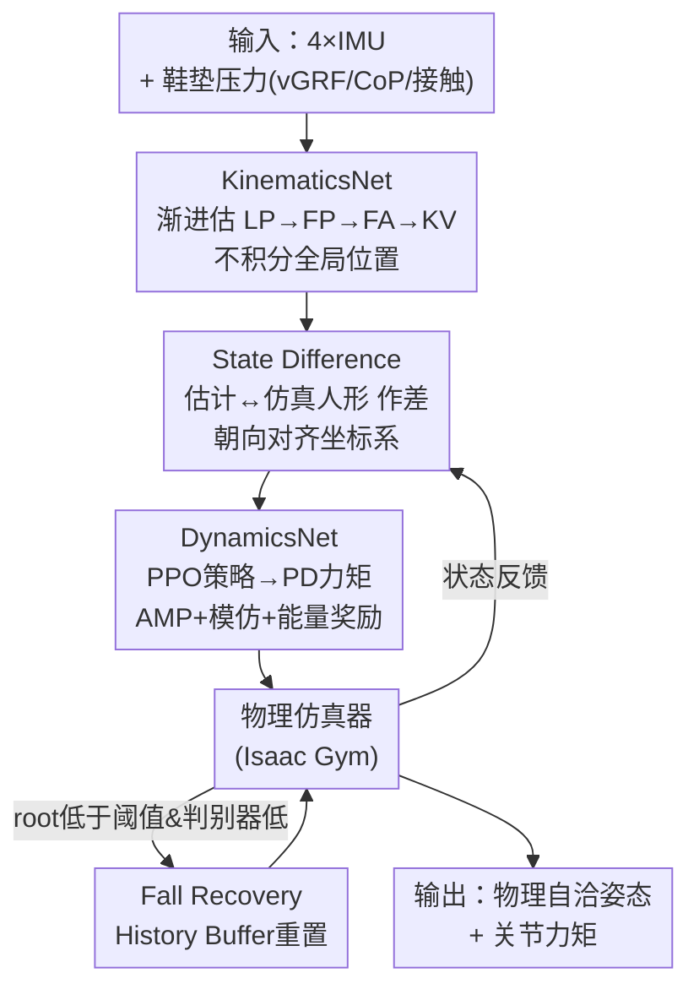

# Ground Reaction Inertial Poser: Physics-based Human Motion Capture from Sparse IMUs and Insole Pressure Sensors

**会议**: CVPR 2026  
**论文**: [CVF Open Access](https://openaccess.thecvf.com/content/CVPR2026/html/Hori_Ground_Reaction_Inertial_Poser_Physics-based_Human_Motion_Capture_from_Sparse_CVPR_2026_paper.html)  
**代码**: [项目页](https://ryosukehori.github.io/grip-project/)  
**领域**: 3D人体姿态 / 动作捕捉 / 物理仿真  
**关键词**: 稀疏IMU动捕、鞋垫压力传感、物理仿真、强化学习、人形机器人控制

## 一句话总结
GRIP 用 4 个可穿戴设备（双腕智能手表 + 双脚智能鞋垫）的 IMU 信号加足底压力，先用 KinematicsNet 估出运动学状态，再用 DynamicsNet 在物理仿真器里以力矩驱动一个"数字孪生"人形按 PPO 策略复现该运动，从而在极少传感器下输出全局轨迹准确、物理上自洽（无脚滑、无穿地、无漂浮）的全身动作。

## 研究背景与动机

**领域现状**：日常场景下的人体动捕希望传感器越少越好。光学 MoCap 精度高但要专用多相机环境；单目 RGB 受视场和自遮挡限制；商用可穿戴系统（如 Xsens）要 17 个 IMU 缝在紧身衣里，不适合日常。近年用 4~6 个稀疏 IMU 估全身姿态成为主流轻量方案。

**现有痛点**：纯 IMU 系统**无法直接测绝对位置**，只能积分加速度/速度得到全局轨迹，误差会随时间累积成漂移，并产生脚滑、穿地、悬浮这类物理上不可能的假象。事后做物理优化（post-hoc optimization）能缓解，但它仍依赖 IMU 估出来的身体—环境接触，对细粒度交互力不从心。后来有人加鞋垫式压力传感器提供地面反作用力（GRF）等动态线索，但这类工作往往**只用脚上传感器**，上半身重建差、缺全局轨迹、或没有物理建模仍会漂。

**核心矛盾**：传感器越少 → 越测不到绝对位置和复杂全身运动 → 要么靠积分（必漂），要么靠优化加硬接触约束（接触判断一错就把脚"锁死"在地上、反而引入轨迹误差）。漂移和物理合理性之间没有一个能在最小传感器配置下同时拿下的框架。

**本文目标**：用 4 个 IMU + 鞋垫压力，做到 (1) 全局轨迹准确、(2) 物理上自洽、(3) 上下半身都重建好。

**切入角度**：不把全局位置当输入去积分，而是改用"观测—控制"（observer–controller）结构——让一个跑在物理仿真器里的数字孪生人形去**复现**运动。仿真器天然满足重力、摩擦、地面反作用力，物理约束不靠后处理硬加，而是仿真本身就保证。

**核心 idea**：把"估姿态"换成"在物理仿真里控制人形复现姿态"，并用一个**State Difference** 中间表示把运动学估计和仿真人形状态的差异喂给控制策略，绕开全局位置积分这一漂移源头。

## 方法详解

### 整体框架

GRIP 的目标是在物理仿真器里用力矩驱动的人形模型复现真实人体运动。输入是双腕 + 双脚 4 个 IMU 的加速度/朝向，加上双脚鞋垫的压力（vGRF、压力中心 CoP、二值接触标签）。整条管线是"观测器 + 控制器"两段式：

- **KinematicsNet（观测器）**：从传感器数据渐进估出运动学状态（叶关节位置、全关节位置、全身关节角、关键关节速度），但**刻意不积分出全局位置**，只保留根相对姿态 + 关键关节全局速度。
- **State Difference（桥接表示）**：把 KinematicsNet 的估计和仿真器里人形的当前状态作差，转到人形朝向对齐坐标系，作为控制器的运动学观测——它告诉策略"现在仿真人形离目标姿态差多少"。
- **DynamicsNet（控制器）**：一个 MDP，策略网络（MLP）把观测映射成目标关节角，经 PD 控制转成力矩驱动人形；用 PPO 训练，奖励由 AMP 判别器奖励 + 模仿奖励 + 能量惩罚组成。
- **Fall Recovery（跌倒恢复）**：仿真不加任何残差外力，遇剧烈动作人形可能摔倒；用 History Buffer 缓存近 N 帧 KinematicsNet 输出，检测到摔倒就用缓存重置人形状态，保证推理连续。
- 训练好的人形最终输出物理自洽的全身姿态和关节力矩；PRISM 数据集为整个训练/评测提供多模态真值。

### 关键设计

**1. KinematicsNet：渐进式运动学估计，但全程不积分全局位置**

纯 IMU 方案的漂移祸根是"积分速度得全局位置"。GRIP 的第一段网络针对性地绕开它：以根关节（骨盆）为坐标原点，用单向 LSTM 分四阶段逐帧估计——先估腕/脚/头 5 个**叶关节位置**（LP），再结合传感器数据重建**全关节位置**（FP，24 个 SMPL 关节），再估**全身关节角**（FA，用连续 6D 旋转表示以稳定训练）和 6 个**关键关节速度**（KV，含 4 叶关节 + 根关节）。渐进式估计本身沿用前作，但关键差别是：GRIP 直接在**全局朝向**的 IMU 测量上操作，且根关节没有 IMU，所以根的全局旋转无法从测量里分离——网络输出是根中心坐标系，但仍保留身体全局旋转。整段输出**只给位置和速度，不给积分后的全局平移**，把"平移"这件事完全交给后面仿真器去解。四个子模块各自 MSE 监督：$L_{Kin}=\|p^{leaf}-\hat p^{leaf}\|^2+\|p-\hat p\|^2+\|\omega-\hat\omega\|^2+\|v^{key}-\hat v^{key}\|^2$。

**2. State Difference：用"估计与仿真之差"代替绝对位置，从根上掐断漂移传播**

如果把 KinematicsNet 积分出的全局位置直接喂给人形跟踪，漂移会原样传进控制。GRIP 不这么做：它用**关键关节的全局速度**表达平移、用**根相对关节位置**表达姿态，再构造一个中间量 State Difference $D_t=[D^{key}_t, D^{full}_t]$ 捕捉"估计状态"与"仿真人形状态"的差异，二者都转到人形朝向对齐坐标系。其中 $D^{key}_t=\{d^\omega_t, d^v_t, d^\varepsilon_t, \omega^{leaf}_t\}$ 含 4 个叶关节（对应 IMU）的旋转差、角速度差、朝向，以及 6 个关键关节基于 KinematicsNet 输出算的线速度差；$D^{full}_t=\{d^p_t, p_t\}$ 含全 24 关节在根对齐坐标下的位置差。这个表示之所以有效：它喂给策略的是"还差多少"的相对量，而非"在哪"的绝对量——绝对量必然带积分漂移，相对差量则让控制器追的是一个不漂的目标，全局平移由物理仿真自己收敛出来。

**3. DynamicsNet：把运动复现建成物理仿真里的 RL 控制问题**

第二段把"估姿态"彻底换成"控制人形复现姿态"。它是一个 MDP $M=\langle S,A,T,R,\gamma\rangle$，策略 $\pi(a_t|s_t)$ 用 PPO 训练。观测 $O_t=\{O^{sen}_t, O^{kin}_t, O^{self}_t, O^{env}_t\}$ 四部分：原始传感器（让策略能直接参考原始信号）、运动学观测（即上面的 State Difference $D_t$）、自身状态（仿真人形所有关节位姿及其速度/角速度）、环境观测（人形周围 1.5m×1.5m 区域采 25×25 高度图，适配非平地）。策略网络是 MLP，输出目标关节角 $\theta^*_t$，经 PD 控制转力矩 $\tau_t=k_p(\theta^*_t-\theta_t)-k_d\dot\theta_t$ 驱动人形。奖励沿用 Perpetual Humanoid Control（PHC）框架的三项：AMP 判别器奖励（训判别器区分生成动作与真实人动，逼真化）、模仿奖励（仿真与参考运动在关节位置/旋转/速度上的一致性）、能量惩罚（抑制过大力矩，让动作自然稳定）。这样物理约束（重力、摩擦、地面反作用力）由仿真器天然满足，不再像优化法那样靠硬加接触约束，从而避免"接触判错就锁脚"的轨迹误差。

**4. Fall Recovery：用 History Buffer 兜住摔倒，让强物理约束下的推理不崩**

GRIP 不引入任何残差外力（residual force），所以人形在剧烈/突变动作转换时可能真的失衡摔倒，导致仿真发散。恢复机制维护一个历史缓冲 $H=\{p_{t-N:t}, \omega_{t-N:t}, v_{t-N:t}\}$ 存 KinematicsNet 近 N 帧输出。当根关节高度 $p^{root}_{z,t}$ 低于阈值 $\beta_z$ 且 AMP 判别器概率 $\phi_t$ 低于阈值 $\beta_\phi$，判定为摔倒：用缓冲里积分得到的根位移 $\Delta p^{kin,root}_{t-N:t}$ 把仿真根位置重置为 $p^{sim,root}_t=p^{sim,root}_{t-N}+\Delta p^{kin,root}_{t-N:t}$，并用 FA 模块估的关节角重置人形姿态，再恢复仿真；摔倒期间这段输出直接用缓冲的 KinematicsNet 预测替换，保证运动学连续、不出现损坏的物理过渡。该机制只在推理用，不参与训练。它让"不加外力"的硬物理设定变得可部署——既保住物理真实性，又不会一摔就废。

### 损失函数 / 训练策略
两阶段训练：先**监督训练 KinematicsNet**（四个子模块各自独立优化后再整体联合微调）；再**冻结 KinematicsNet 权重**，用 PPO 在物理仿真器里强化训练 DynamicsNet 策略。仿真器为 Isaac Gym。跌倒恢复仅推理时启用。

## 实验关键数据

### 主实验
在三个动作特性不同的数据集上对比 IMU-only 与 IMU–压力融合基线（所有指标越低越好）。GRIP 在全局姿态精度 MPJPE 和脚穿地 FP 上几乎全面领先：

| 数据集 | 方法 | MPJPE↓ | PA-MPJPE↓ | FP↓ (mm) |
|--------|------|--------|-----------|----------|
| PRISM | PIP | 248.59 | 33.35 | 10.71 |
| PRISM | GlobalPose (6 IMU) | 198.30 | 31.29 | 9.72 |
| PRISM | **GRIP (4 IMU)** | **182.44** | 46.47 | **5.77** |
| UnderPressure | GlobalPose | 301.12 | 17.41 | 3.31 |
| UnderPressure | **GRIP** | **218.09** | 27.16 | **0.00** |
| PSU-TMM100 | FoRM | 126.60 | 82.45 | 4.51 |
| PSU-TMM100 | **GRIP** | **118.60** | 55.72 | **0.73** |

要点：GRIP 在**三个数据集 MPJPE 全部第一**、FP（脚穿地）全部最低（UnderPressure 上甚至为 0）。去全局平移的指标（PEL/PA-MPJPE、MPJRE）上 GlobalPose 更好，但它用了 6 个 IMU 且有骨盆 IMU 学重力—姿态关系的修正机制；GRIP 仅 4 IMU 靠压力信息补上缺失的骨盆/头部 IMU，达到与 PIP 相当的水平。vGRF 误差上 PIP/MobilePoser 在 PRISM、UnderPressure 更优（它们用浮动基座 + 残差力稳控制），但在慢动作 PSU-TMM100 上 GRIP 最好——慢动作里别的方法常漏掉细微足底接触事件。

### 消融实验

**传感器配置分析（PRISM）**：递增 IMU 数量、对比有无压力。

| #IMU | 压力 | MPJPE↓ | PA-MPJPE↓ | 成功率↑ (%) |
|------|------|--------|-----------|-------------|
| 4 | ✗ | 194.48 | 49.97 | 88.58 |
| 4 | ✓ | **182.44** | **46.47** | **94.49** |
| 6 | ✓ | 143.06 | 39.13 | 92.32 |
| 2 | ✓ | 247.12 | 82.36 | 93.90 |

IMU 越多越准；加足底压力**同时提升精度和稳定性**（成功率从 88.58% → 94.49%），是有效的互补模态。

**观测设计消融（State Difference 的成分，PRISM）**：

| 配置 | MPJPE↓ | PA-MPJPE↓ | 成功率↑ (%) | 说明 |
|------|--------|-----------|-------------|------|
| D(O,A) | 290.71 | 51.83 | 90.89 | 仅朝向+加速度差 |
| D(O,A,V) | 206.50 | 48.97 | 91.25 | 加叶关节速度差 |
| D(O,A,V,Jglo) | 187.86 | 48.87 | 93.31 | 加全局重建关节位置差 |
| D(O,A,V,Jrel) | **182.44** | **46.47** | **94.49** | 加根相对关节位置差（完整） |

### 关键发现
- **速度差 + 根相对关节位置差是关键**：从 D(O,A) 到完整配置，MPJPE 从 290.71 砍到 182.44，成功率从 90.89% 升到 94.49%——证明 State Difference 里"用根相对位置 + 全局速度"而非全局绝对位置的设计选择是对的。
- **足底压力是稳定性放大器**：4 IMU 加压力后成功率 +5.9 个百分点，说明压力提供的接触/重心线索直接帮助人形不摔。
- **物理仿真 vs 事后优化**：优化法在接触判错时会把脚锁死地面引入轨迹误差，GRIP 靠仿真自然的足—地交互避免这点，FP 指标全面碾压纯运动学的 FoRM。

## 亮点与洞察
- **把漂移问题"消解"而非"修正"**：不积分全局位置、只给相对差量、让物理仿真自己收敛出全局轨迹——这是比"先漂再优化"更根本的思路，值得迁移到任何稀疏惯性传感的全局定位任务。
- **State Difference 是 observer–controller 的优雅胶水**：用"估计与仿真之差"做策略观测，既利用了神经网络的运动学先验，又让物理仿真兜住合理性，两段职责清晰。
- **不加残差外力 + Fall Recovery**：很多物理动捕靠残差力"作弊"地把人形拉稳，GRIP 坚持纯物理、改用历史缓冲兜底，换来了更真实的足底压力模式（慢动作 vGRF 反而最好）。
- **PRISM 数据集**：1,275 条 10 秒序列、6 名受试者、约 3.5 小时，同步 IMU + 鞋垫压力 + 光学 MoCap + 环境模型，覆盖日常/慢动作/快速运动/人物交互，填补了"多模态 + 高保真姿态标注 + 含物理交互"数据集的空白。

## 局限与展望
- **vGRF 在高动量动作上偏弱**：无浮动基座/无残差力的人形在失衡或恢复时，足底压力模式会和真人不同，PRISM/UnderPressure 上 vGRF 误差不如优化法。
- **物理跌倒的边界情况仍出错**：绊倒、从高处迈下时估计脚位可能暂时穿到物体表面以下（作者承认）。
- **依赖合成 IMU**：UnderPressure/PSU-TMM100 无真实 IMU 录制，按前作做法用 SMPL 网格顶点朝向有限差分合成 IMU 信号，与真实 IMU 噪声特性存在 gap（自己发现的局限）。
- **作者展望**：设计更能在不稳/高动量下稳控的控制器、融合相机/定位传感进一步抑漂、扩展到多人和动态物体交互。

## 相关工作与启发
- **vs PIP / GlobalPose（事后物理优化）**: 它们先做运动学估计再用优化加物理约束，接触判错会锁死脚位引入轨迹误差；GRIP 把物理放进闭环仿真控制里，接触是仿真自然产生的，FP/轨迹更稳。GlobalPose 用 6 IMU + 骨盆修正在去平移指标上更优，GRIP 仅 4 IMU 靠压力补齐。
- **vs FoRM / SolePoser（仅鞋垫 IMU+压力）**: 只靠脚上传感器，上半身重建受限、全局轨迹难估；GRIP 加双腕 IMU + 物理仿真，全身精度和物理合理性都更好。
- **vs MobilePoser（少 IMU 日常设备）**: 同走轻量路线但无物理仿真闭环，穿地/脚滑更明显；GRIP 用仿真约束系统性压制非物理假象。
- **vs PHC / AMP（物理人形控制）**: GRIP 复用 PHC 奖励框架和 AMP 判别器，但解决的是"无绝对位置输入、只能用可穿戴相对运动线索"这一更难设定，这是它相对依赖相机/HMD 绝对位姿的物理控制方法的核心区别。

## 评分
- 新颖性: ⭐⭐⭐⭐⭐ observer–controller + State Difference 从根上绕开积分漂移，纯物理无残差力闭环复现，设计思路新颖且自洽
- 实验充分度: ⭐⭐⭐⭐ 三数据集对比 + 传感器配置与观测设计双消融充分，但部分指标依赖合成 IMU、vGRF 弱项未深挖
- 写作质量: ⭐⭐⭐⭐⭐ 动机—矛盾—方法链条清晰，图 2 框架和 State Difference 推导讲得透
- 价值: ⭐⭐⭐⭐⭐ 4 个日常可穿戴设备做物理自洽全身动捕，加开源 PRISM 数据集，对 VR/AR、机器人、生物力学落地价值大

<!-- RELATED:START -->

## 相关论文

- [\[CVPR 2026\] Pressure2Motion: Hierarchical Human Motion Reconstruction from Ground Pressure with Text Guidance](pressure2motion_hierarchical_human_motion_reconstruction_from_ground_pressure_wi.md)
- [\[CVPR 2026\] MGDHand: Multi-Granularity Prior-to-Inertial Distillation Framework for Sequential 3D Hand Pose Estimation from Sparse IMUs](mgdhand_multi-granularity_prior-to-inertial_distillation_framework_for_sequentia.md)
- [\[CVPR 2026\] IMU-HOI: A Symbiotic Framework for Coherent Human-Object Interaction and Motion Capture via Contact-Conscious Inertial Fusion](imu-hoi_a_symbiotic_framework_for_coherent_human-object_interaction_and_motion_c.md)
- [\[CVPR 2026\] InterPrior: Scaling Generative Control for Physics-Based Human-Object Interactions](interprior_scaling_generative_control_for_physics-based_human-object_interaction.md)
- [\[CVPR 2026\] InterPhys: Physics-aware Human Motion Synthesis in a Dynamic Scene](interphys_physics-aware_human_motion_synthesis_in_a_dynamic_scene.md)

<!-- RELATED:END -->
