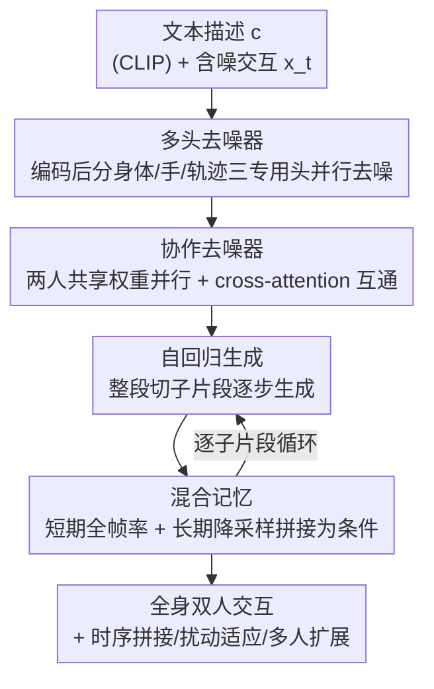

# Interact2Ar: Full-Body Human-Human Interaction Generation via Autoregressive Diffusion Models

**会议**: CVPR 2026  
**论文**: [CVF Open Access](https://openaccess.thecvf.com/content/CVPR2026/html/Ruiz-Ponce_Interact2Ar_Full-Body_Human-Human_Interaction_Generation_via_Autoregressive_Diffusion_Models_CVPR_2026_paper.html)  
**代码**: 项目页 https://pabloruizponce.com/papers/Interact2Ar （代码仓未明确公布）  
**领域**: 人体理解 / 人体动作生成 / 扩散模型  
**关键词**: 人人交互生成, 自回归扩散, 全身手部动作, 混合记忆, 文本驱动动作

## 一句话总结
Interact2Ar 是首个文本条件下、端到端的**自回归扩散**模型，用「协作去噪器 + 身体/手部/轨迹专用头」生成带细致手部动作的全身**双人交互**，再用一套「混合记忆」自回归管线把整段动作拆成子片段逐步生成，从而在 Inter-X 基准上刷新 SOTA，并解锁时序拼接、扰动适应、多人交互等下游能力。

## 研究背景与动机
**领域现状**：人体动作生成近年靠大规模数据集和扩散/量化两类生成范式快速发展，但**人-人交互**生成比单人难得多——模型不仅要生成两个人各自高质量的动作，还要让两人之间的时空协调一致。Inter-X 数据集首次提供了带细致手部的全身双人交互数据，成为这条线的训练基础。

**现有痛点**：① 多数方法**直接忽略手部**。手的维度比身体其余部分还高，强行塞进来往往噪声大于信号，复杂化生成，所以前人要么不建模手，要么用并行/条件网络单独建模手——前者缺身体上下文、后者效率低。② 现有扩散方法**一次性把整段序列去噪生成**。这对单人尚可，但交互本质是「你来我往、互相反应」的，每个人的动作都依赖对方的细微线索，整段一次生成抓不住这种反应性与时变性。③ **评测器不可靠**：Inter-X 原始评测器对轨迹严重退化、甚至左右两人轨迹互换都"无感"，分数几乎不变。

**核心矛盾**：手部高维信息「信号 vs 噪声」的取舍，与交互「整段静态生成 vs 逐步反应生成」的取舍，是两条互相叠加的难题；在多人场景下交互维度还随人数继续膨胀。

**本文目标**：(a) 把细致手部纳入全身交互生成且不被高维噪声拖垮；(b) 让生成具备逐步反应、可适应的能力；(c) 给出能真正分辨退化的评测器。

**切入角度**：作者观察到——身体不同部位本可**分头建模又共享同一份运动上下文**；而交互的反应性恰好可以借鉴单人领域已验证的**自回归扩散**（按时间窗逐段生成）来获得。

**核心 idea**：用「专用头并行生成身体/手/轨迹」解决手部高维问题，用「自回归 + 混合记忆」把整段生成换成逐子片段生成来获得反应性与适应性。

## 方法详解

### 整体框架
Interact2Ar 要解决的是：给一段文本描述 $c$，生成一段双人全身交互 $x=\{a_x, b_x\}$（每个人用 SMPL-X 参数表示）。整体分三步搭起来——先有一个**多头去噪器**把含噪动作编码后送进身体/手/轨迹三个专用头分别去噪；再用**协作去噪器**让两个人各跑一条共享权重的流、靠 cross-attention 互通信息；最后把「整段一次生成」升级成**自回归**：把整段动作切成不重叠的子片段，逐段生成，每段以前面生成帧的**混合记忆**为条件。训练阶段先训非自回归版（Interact2Ar*），再扩展成自回归版。

动作表示上，作者刻意**不用冗余表示**（如从位置再导出速度那种），只用纯 SMPL-X 参数 $(r, \varphi, \theta_{body}, \theta_{hands})$，旋转用连续 6D 表示——因为冗余表示在双人+手部时维度爆炸，且会给扩散评测引入负偏置。

### 关键设计

**1. 身体/手/轨迹专用头：让高维手部不再"噪声压过信号"**

前人把整套姿态当一个整体序列预测，高维手部一旦混进来就拖垮其余部分的建模。Interact2Ar 在协作去噪器前加一个编码模块，把含噪动作映射到一个潜在表示，再把这份**共同的运动表示**喂给三个**专用去噪头**——全局轨迹头、身体姿态头、手部姿态头，各自负责一块、且都能看到完整运动信息。这样既保留了「身体给手提供上下文」的好处（手不再是孤立的并行分支），又让三块可以并行计算、各自专注自己的维度。论文把它叫 Multi-Head Denoiser，并实验证明这种结构对全身表示的处理明显优于前人，身体、手部指标各自独立看都有提升。

**2. 协作去噪器 + 直接预测 $\hat{x}_0$：用共享权重的双流把"你来我往"建进网络**

双人交互的难点是两人动作要互相协调。作者沿用 InterGen 的协作去噪思路：两个人各走一条**共享权重**的 transformer-encoder 流，两条流之间通过 **cross-attention** 交换隐状态，从而在保持参数紧凑的同时让人际信息流动起来。扩散过程中模型不预测上一步噪声 $\hat{x}_{t-1}$，而是**直接预测干净动作 $\hat{x}_0$**，这样才能在每一步用前向运动学（FK）算各种运动学损失。

**3. 自回归交互生成：把"整段一次生成"换成"逐段反应生成"**

整段一次去噪抓不住交互的反应性。作者把总长 $N$ 的交互拆成连续不重叠的子片段：

$$x = \bigcup_{k=0}^{K-1} x_{kn:(k+1)n}, \quad K=\lceil N/n \rceil$$

其中 $n$ 是生成窗口（一次前向能输出的帧数）。第 $k$ 步生成时，去噪器以最近 $m_s$ 帧的**短期记忆** $\mathcal{M}_k^s = \{x^0_{kn-m_s:kn}\}$ 为条件，预测下一子片段：

$$\hat{x}^0_{kn:(k+1)n} = G(x^t_{kn:(k+1)n}, \mathcal{M}_k^s, c, t)$$

因为每一段都以「刚刚生成的真实历史」为条件，模型能根据交互的演化动态调整，比整段一次生成更贴合对方动作的变化——这也是后面所有"适应性下游能力"的来源。

**4. 混合记忆（Mixed Memory）：用降采样长期记忆消除长序列的动作重复**

纯短期记忆有个硬伤：窗口太短（前人常用 20–40 帧），长时交互里历史上下文不够，会出现**动作重复**伪影。作者在短期记忆外再加一份**长期记忆** $\mathcal{M}_k^l$——在一个远更长的窗口 $m_l \gg m_s$ 内**每隔 $\delta$ 帧采一帧**（时间降采样）：

$$\mathcal{M}_k^l = \{x^0_{kn-m_l+i\delta} \mid i=0,1,\ldots,\lfloor m_l/\delta\rfloor\}$$

把两者拼起来 $\mathcal{M}_k = \{\mathcal{M}_k^l, \mathcal{M}_k^s\}$ 作为条件：

$$\hat{x}^0_{kn:(k+1)n} = G(x^t_{kn:(k+1)n}, \mathcal{M}_k, c, t)$$

于是短期记忆用**全帧率**保证转场无缝、长期记忆用**降采样**以很低开销覆盖远距上下文。论文给出的直观例子是：常规记忆要 90 帧上下文就得存 90 帧，而混合记忆用 30 帧（15 短期 + 15 长期）就能覆盖 90 帧上下文，达到约 **×3 的记忆压缩**。$\delta$ 和 $m_l$ 是控制「覆盖范围 vs 计算效率」的超参。

**5. 适应性下游能力：自回归 + 记忆条件天然解锁三类交互应用**

正因为生成是逐段、且条件在记忆 $\mathcal{M}$ 上，三类能力是"免费"得到的：① **时序动作拼接**——切换文本提示时能无缝过渡，不需要离线后处理，也不会有 inpainting 那种全局定位错位；② **实时扰动适应**——子片段间若发生突然位移、意外接触等状态扰动，下一段能据最近历史反应过来，做到超出预设序列的反应式生成；③ **顺序多人交互**——把前两者结合，一个人和一个伙伴交互完后换上新伙伴+新提示，记忆条件保证段间平滑过渡，从而在**不做同时多人建模**的前提下扩展到多人场景。

### 损失函数 / 训练策略
非自回归阶段用一组扩散动作生成常用损失的组合：

$$\mathcal{L}_{total} = \lambda_{repr}\mathcal{L}_{repr}(x,\hat{x}) + \lambda_{orient}\mathcal{L}_{orient}(r,\hat{r}) + \lambda_{pos}\mathcal{L}_{pos}(p,\hat{p}) + \lambda_{vel}\mathcal{L}_{vel}(v,\hat{v}) + \lambda_{foot}\mathcal{L}_{foot}(f,\hat{f}) + \lambda_{dist}\mathcal{L}_{dist}(d,\hat{d})$$

其中 $\mathcal{L}_{repr}$ 是 SMPL-X 原始表示上的 $\ell_2$ 损失，$\mathcal{L}_{orient}$ 罚根朝向误差，后四项是**运动学损失**——把预测的 SMPL-X 参数过一个**可微 FK 层**得到关节位置 $p=FK(x), \hat{p}=FK(\hat{x})$，再算全局关节位置 $\mathcal{L}_{pos}$、速度 $\mathcal{L}_{vel}$、足部接触 $\mathcal{L}_{foot}$、两人之间成对关节距离图 $\mathcal{L}_{dist}$。权重 $\lambda_i$ 网格搜索得到。实现上：协作去噪器用 8 个 transformer 块、8 头（latent 512），轨迹头更轻（4 块 4 头，latent 256）；满版扩散 1000 步 + DDIM-50 采样，自回归版只用 **10 步**效果最好；选定超参 $m_s=15, m_l=45, \delta=5$，得到 60 帧上下文窗口而只用 24 帧记忆。

## 实验关键数据

数据集为 Inter-X（11K 段全身交互、40 类动作、带文本描述）。所有指标按"每段交互"而非"每个人"统计，每个实验跑 20 次取 95% 置信区间。

### 主实验：与 SOTA 对比（Full / Body / Hands 三套评测，节选 Full）

| 方法 | R-Prec.↑ Top3 | FID↓ | MM Dist↓ | Diversity→ | PJ↑ | AUJ↓ |
|------|------|------|----------|-----------|-----|------|
| Ground Truth | 0.740 | 0.002 | 3.318 | 8.973 | 0.021 | 3.944 |
| T2M | 0.434 | 9.079 | 5.766 | 7.994 | 1.889 | 124.9 |
| InterGen | 0.721 | 0.874 | 3.618 | 8.876 | 2.132 | 84.16 |
| InterMask（前 SOTA） | 0.722 | 0.671 | 3.487 | 8.654 | 2.328 | 61.74 |
| Interact2Ar*（非自回归） | 0.757 | 0.556 | 3.246 | 8.916 | 2.110 | 54.97 |
| **Interact2Ar（自回归）** | **0.773** | **0.277** | **3.095** | 9.305 | **0.136** | **8.837** |

非自回归版已超过 InterMask；自回归版在几乎所有指标上进一步领先，尤其平滑度指标 PJ（Peak Jerk）/ AUJ（Area Under Jerk）大幅下降（AUJ 54.97 → 8.837），说明转场远更顺滑。Body / Hands 单独评测也都拿下最好或次好，印证专用头对全身表示的优势。

### 评测器鲁棒性（Tab.1）

| 设置 | 旧评测器 FID↓ | 本文评测器 FID↓ |
|------|------|------|
| Ground Truth | 0.001 | 0.002 |
| Interact2Ar | 0.148 | 0.277 |
| +10% 全表示噪声 | 38.35 | 74.58 |
| +10% 仅轨迹噪声 | **0.122**（几乎无感） | **62.05**（强烈惩罚） |
| 两人轨迹互换 | **0.165**（几乎无感） | **8.65**（明显惩罚） |

旧评测器对"仅轨迹退化"和"轨迹互换"基本无感，本文评测器（改用**全局关节坐标**而非旋转表示重训、且按全身/身体/手部分别训三个评测器）能强烈识别这些退化。

### 消融：混合记忆 vs 常规记忆（Tab.3）

| $m_s$ | $m_l$ | 实占帧 $M$ | R-Prec.↑ | FID↓ |
|------|------|------|---------|------|
| 60 | - | 60 | 0.776 | 0.316 |
| 90 | - | 90 | 0.771 | 0.412 |
| 120 | - | 120 | 0.774 | 0.413 |
| 15 | 45 | **24** | 0.773 | **0.277** |
| 15 | 75 | 30 | 0.771 | 0.279 |
| 15 | 105 | 36 | 0.773 | 0.325 |

### 关键发现
- **无混合记忆时，记忆加越多反而越差**（FID 60→90→120 帧从 0.316 升到 0.413）：上下文越长，模型要学的复杂度也越高，纯堆记忆得不偿失。
- **混合记忆用更少的实占帧拿到更好结果**：$m_s=15,m_l=45$ 只占 24 帧就达到 FID 0.277，优于占满 60–120 帧的常规配置——验证"短期全帧率 + 长期降采样"的设计。
- **自回归是平滑度的关键来源**：AUJ 从非自回归的 54.97 直降到 8.837，对应下游任务里"无突兀转场"的体感。
- 用户研究（35 人对 10 段交互排序）中本文在「文本对齐」和「手部真实度」两项都明显优于 InterGen/InterMask、逼近真值。

## 亮点与洞察
- **"专用头共享一份运动表示"是处理手部高维的优雅折中**：既不像并行网络丢上下文、也不像条件网络低效，身体信息天然流向手部，还能并行算——这个套路可迁移到任何"某些部位维度远高于其余部分"的结构化生成。
- **把"记忆"拆成全帧率短期 + 降采样长期**，本质是给自回归扩散做了个"廉价长上下文"，思路和 LLM 长上下文相通，但用降采样换效率，值得借鉴到流式/长序列生成。
- **下游能力是架构的副产品而非额外模块**：时序拼接、扰动适应、多人扩展都直接从"逐段 + 记忆条件"涌现，不需要额外训练或后处理——这是自回归范式相对整段扩散最实在的红利。
- **顺便修了评测器**：指出旧评测器对轨迹退化/互换无感，改用全局坐标重训并拆成全身/身体/手三套，是这条线后续工作可直接复用的基础设施。

## 局限与展望
- 作者承认的局限：受数据集约束，Inter-X 把**体型归一化为中性**，缺乏体型多样性，这会**损害两人之间手部接触的精度**——真实交互需要建模不同体型。
- 自己发现的局限：① 多人能力是**顺序**实现的（一个接一个换伙伴），并非真正的同时多人联合建模，复杂的三人以上同时交互未必能覆盖；② 评测高度依赖 Inter-X 这一个数据集与其文本标注质量，跨数据集泛化未验证；③ 自回归版用 10 步采样效果最好，但逐段生成在很长序列上的累积误差/漂移没有专门分析。
- 改进思路：把体型作为条件纳入生成、引入接触感知损失以提升手部接触精度；探索真正的同时多人协作去噪（而非顺序拼接）。

## 相关工作与启发
- **vs InterGen**: 都用共享权重的协作去噪器，但 InterGen 不分身体部位、整段一次生成且不建模细致手部；本文加了身体/手/轨迹专用头并升级为自回归 + 混合记忆，质量和适应性都更强。
- **vs InterMask**: InterMask 用残差 VQ-VAE + masked transformer 拿到 Inter-X 上前 SOTA；本文是扩散路线，非自回归版已超过它，自回归版进一步在平滑度和文本对齐上拉开差距。
- **vs 单人自回归扩散（如基于时间窗的单人方法）**: 本文把自回归扩散首次端到端用到**文本条件的全身双人交互**，并针对长交互提出混合记忆解决动作重复，是从单人到交互的关键扩展。

## 评分
- 新颖性: ⭐⭐⭐⭐⭐ 首个文本条件端到端自回归扩散做全身双人交互，混合记忆 + 专用头组合新颖
- 实验充分度: ⭐⭐⭐⭐ Inter-X 上全身/身体/手三套评测 + 评测器鲁棒性 + 记忆消融 + 用户研究都齐，但只在单一数据集
- 写作质量: ⭐⭐⭐⭐ 动机与贡献清晰，图 2/3 把架构和混合记忆讲得直观
- 价值: ⭐⭐⭐⭐⭐ 刷新 SOTA 之外还附带可复用的评测器与"免费"的下游适应能力，对交互动作生成线推动明显

<!-- RELATED:START -->

## 相关论文

- [\[CVPR 2026\] Causal Motion Diffusion Models for Autoregressive Motion Generation](causal_motion_diffusion_models_for_autoregressive_motion_generation.md)
- [\[CVPR 2026\] PAMotion: Physics-Aware Motion Generation for Full-Body Interaction with Multiple Objects](pamotion_physics-aware_motion_generation_for_full-body_interaction_with_multiple.md)
- [\[CVPR 2026\] SAM 3D Body: Robust Full-Body Human Mesh Recovery](sam_3d_body_robust_full-body_human_mesh_recovery.md)
- [\[CVPR 2026\] Towards Decompositional Human Motion Generation with Energy-Based Diffusion Models](towards_decompositional_human_motion_generation_with_energy-based_diffusion_mode.md)
- [\[CVPR 2026\] Next-Scale Autoregressive Models for Text-to-Motion Generation](next-scale_autoregressive_models_for_text-to-motion_generation.md)

<!-- RELATED:END -->
