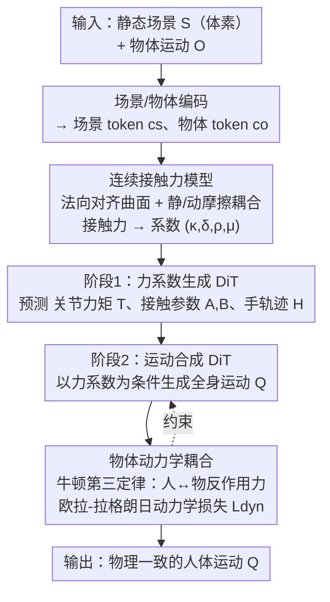

# InterPhys: Physics-aware Human Motion Synthesis in a Dynamic Scene

**会议**: CVPR 2026  
**论文**: [CVF Open Access](https://openaccess.thecvf.com/content/CVPR2026/html/Xing_InterPhys_Physics-aware_Human_Motion_Synthesis_in_a_Dynamic_Scene_CVPR_2026_paper.html)  
**代码**: 无  
**领域**: 人体理解 / 人体运动生成  
**关键词**: 人体运动合成, 人-物交互, 可微接触力建模, 物理一致性, 扩散模型

## 一句话总结
InterPhys 提出一种可微的连续接触力模型，把人-物、人-场景与体内动力学统一进欧拉-拉格朗日方程，并用两阶段扩散管线先预测物理参数、再生成人体运动，在动态场景（含运动物体）下显著提升了人体运动的物理合理性。

## 研究背景与动机
**领域现状**：人体运动合成已在 VR/AR、动画、具身智能里广泛应用，近年大量扩散模型方法把人体动作生成做得越来越流畅，也开始尝试让人和场景、物体发生交互。

**现有痛点**：主流方法生成的运动「看着动、却不符合物理」——脚在地上打滑、身体悬浮、和物体的接触不自然。根因是它们只用很弱的交互先验：要么是二值接触标签、距离阈值，要么是穿透惩罚，而且接触建模基本只盯着**手**，根本没建模真正的接触力。另一条路是物理仿真器 + 强化学习，物理是对了，但仿真器不可微、没法塞进端到端的生成管线，而且 RL 策略任务专用、难泛化。

**核心矛盾**：既要「物理真实」又要「端到端可微 + 可生成」，这两者历史上是对立的。唯一一个把连续接触模型塞进可微框架的工作 PhysPT，假设接触面是固定朝上的无限大平面、且把法向力和切向（摩擦）力当成两套互相独立的弹簧——这在「人站在水平地面上」时还行，但碰到任意曲面、运动物体、法向与摩擦耦合时就彻底失效。

**本文目标**：在一个端到端可微框架里，生成人和**动态场景**（带一个会移动的物体）交互的物理一致运动，需要解决三个子问题——(1) 接触力怎么建模才能泛化到任意曲面且法向/摩擦耦合；(2) 会动的物体的动力学怎么纳入约束；(3) 这套物理怎么和扩散生成管线衔接。

**核心 idea**：用一个**可微的连续接触力模型**替换「弱接触先验」和「不可微仿真器」——它按局部曲面法向对齐、显式分别建模静/动摩擦并让摩擦依赖法向力；再用牛顿第三定律把运动物体的动力学反馈进人体动力学，最后以欧拉-拉格朗日方程作为物理一致性损失，监督两阶段扩散生成。

## 方法详解

### 整体框架
输入是一段**物体运动** $O \in \mathbb{R}^{T\times B}$ 和一个用体素表示的**静态场景** $S \in \{0,1\}^{N_x\times N_y\times N_z}$，输出是一段与运动物体和场景都交互的**人体运动** $Q \in \mathbb{R}^{T\times D}$。整篇方法的转法是：先把「人 + 物体 + 场景」三者的物理用欧拉-拉格朗日方程写清楚，关键是定义一个能泛化到任意曲面的连续接触力模型；然后把这套物理拆成「可学的力系数」，用两阶段扩散——**第一阶段**从场景/物体 token 生成力系数（关节力矩、接触参数、手部轨迹），**第二阶段**以这些力系数为条件生成全身运动，并用一个由欧拉-拉格朗日方程导出的动力学损失把生成运动「拉」回物理一致。

### 关键设计

**1. 连续接触力模型：用可微的软门控 + 曲面法向，把接触力推广到任意 3D 表面**

这是全文的地基，针对的痛点是 PhysPT 那套「固定朝上平面 + 法向/切向解耦弹簧」根本无法处理曲面和运动物体。给定人体上一个可能接触点 $p$ 和它在物体/场景上最近的表面点 $x$，定义相对位置 $\tilde{p}=p-x$，再按局部曲面法向 $n(x)$ 分解为法向分量 $\tilde{p}_\perp=(\tilde{p}^\top n(x))n(x)$ 和切向分量 $\tilde{p}_\parallel=\tilde{p}-\tilde{p}_\perp$。接触力用两个 sigmoid 软门控 $h(x)=\frac{1}{1+e^{-x}}$ 控制激活：

$$\lambda(p)=h(-\alpha(\|\tilde{p}_\parallel\|-d_0))\,h(\beta(\tilde{p}^\top n(x)+d_1))\,f(p)$$

直觉是：只有当人体足够贴近表面（$\|\tilde{p}_\parallel\|$ 小）、又没有严重穿透（$\tilde{p}^\top n(x)$ 为正或微小负）时，接触力才被激活，$\alpha,\beta$ 控制过渡的陡峭度、$d_0,d_1$ 控制接触缓冲带。这个软门控让「接触/不接触」这个本来离散、不可微的判断变得连续可导，从而能塞进梯度优化。和 PhysPT 的本质区别在于它**用 $n(x)$ 随局部几何对齐法向**，不再假设法向永远朝上，所以同一套公式能算桌面、椅面、运动箱子任意曲面上的接触力。

**2. 法向弹簧 + 静/动摩擦显式建模：让切向摩擦真正依赖法向力**

接触力进一步拆成法向 $f_\perp$ 和切向 $f_\parallel$ 两部分。法向沿用阻尼弹簧（但带上曲面法向）：$f_\perp(p)=k(p)n(x)$，其中 $k(p)=-\kappa(\|\tilde{p}_\perp\|-d_0)-\delta(\dot{\tilde{p}}^\top n(x))$，$\kappa,\delta$ 是弹簧刚度和阻尼。真正的创新在切向：PhysPT 也用弹簧建摩擦，但那忽略了「摩擦力大小本该取决于法向力」这一真实物理。本文改成显式建模静摩擦 $f_s$ 和动摩擦 $f_k$：

$$f_k(p)=-\mu\|f_\perp(p)\|\frac{\dot{\tilde{p}}_\parallel}{\|\dot{\tilde{p}}_\parallel\|}$$

动摩擦正比于法向力大小 $\|f_\perp\|$、方向逆着相对切向速度，$\mu$ 是动摩擦系数——这就把法向力和摩擦耦合起来了。静摩擦 $f_s$ 由速度门控触发，且**静态场景和运动物体方向相反**：对静态场景，切向方向取接触点切向加速度方向 $d_\parallel=\ddot{p}_\parallel/\|\ddot{p}_\parallel\|$（地面摩擦在「支撑」人前进，如走路时地面推动支撑脚）；对运动物体，方向取与「物体所受外力（去掉重力）」的切向加速度相反 $d_\parallel=-(a-g)_\parallel/\|(a-g)_\parallel\|$（因为是人在推物体）。这个「方向取决于谁推谁」的区分，是让动态物体交互物理正确的关键细节。

**3. 物体动力学耦合：用牛顿第三定律把会动的物体反馈进人体约束**

以往工作哪怕建了人体动力学，也只把场景当固定地面、不显式建运动物体的动力学。本文把人体和物体都写成欧拉-拉格朗日方程。人体：

$$M_h(q)\ddot{q}+C_h(q,\dot{q})+G_h(q)=\tau+J_{hs}^\top\lambda_s+J_{ho}^\top\lambda_o$$

其中 $q=\{\theta,R,T\}\in\mathbb{R}^{75}$ 是 SMPL 位姿，$M_h$ 是质量矩阵，$C_h,G_h$ 是科氏/离心与重力项，$\tau$ 是肌肉内力矩，$\lambda_s,\lambda_o$ 分别是场景和物体施加的接触力，$J_{hs},J_{ho}$ 是接触雅可比。物体同样写一条 $M_o(q_o)\ddot{q}_o+C_o+G_o=-J_o^\top\lambda_o$——注意接触力 $\lambda_o$ **符号相反**，这正是牛顿第三定律：手作用于物体的力，等大反向于物体作用于手的力。这个互反关系把物体动力学紧紧耦合进人体动力学，既能刻画「物体如何响应人的操纵」，又能反推「物体施加给手的反作用力」，为物理一致的人-物交互提供了硬约束。

**4. 两阶段扩散管线 + 动力学一致性损失：把物理参数当中介，分离「估力」与「生成」**

接触力是「运动 + 几何 + 系数 $(\kappa,\delta,\rho,\mu)$」的函数，而系数对每帧、每个接触点都不同（人体 $C_s$ 点记为 $A\in\mathbb{R}^{T\times C_s\times 4}$、手部 $C_o$ 点记为 $B\in\mathbb{R}^{T\times C_o\times 4}$）。直接让一个网络同时学运动和物理太难，于是拆成两阶段。**阶段一** $\hat{Y}_0=f_\phi(Y_n,c_s,c_o,n)$ 用 transformer 扩散从场景 token $c_s$、物体 token $c_o$ 预测力系数 $\hat{Y}_0=\{\hat{H},\hat{T},\hat{A},\hat{B}\}$（含手轨迹 $H$，沿用前作证明对手-物交互有效），$\ell_1$ 监督。**阶段二** $\hat{Q}_0=f_\theta(Q_n,\hat{Y}_0,c_s,c_o,n)$ 以这些系数为条件生成全身运动，除重建损失 $L_{reco}$ 外，关键是引入由式 (2) 导出的**动力学一致性损失**：

$$L_{dyn}=\sum_{t=1}^{T}\big\|M_h(\hat{q}_t)\ddot{\hat{q}}_t+C_h+G_h-J_{hs}^\top\lambda_s-J_{ho}^\top\lambda_o-\tau_t\big\|_1$$

它度量生成运动算出来的「广义力残差」离零有多远——残差越小，说明运动越符合欧拉-拉格朗日方程，即越物理一致。总损失 $L=L_{reco}+\lambda_{dyn}L_{dyn}$。这一损失把第一阶段预测的力系数和第二阶段生成的运动「焊」在一起，是消融里掉点最狠的组件。

### 损失函数 / 训练策略
两阶段都用 $\ell_1$ 损失训练扩散模型。监督信号（关节力矩 $T$、接触系数 $A,B$）通过对真值人/物运动做**动态优化**得到——即用式 (2)(3) 最小化欧拉-拉格朗日方程残差，假设已知重力 $g$、由 $\beta$ 回归的 SMPL 各段质量/惯量、物体质量惯量、预定义候选接触点集，求解 $A,B,T$。训练用 Adam（初始学习率 0.002），单张 RTX 4090。

## 实验关键数据

### 主实验
在 OMOMO（约 10 小时、15 类日常物体、平面接触）和 TRUMANS（15 小时、约 160 万帧、20 类物体、含丰富室内几何）两个数据集上评测。误差类指标越低越好，接触精度/召回/F1 越高越好。

| 数据集 | 方法 | HandJPE↓ | MPJPE↓ | MPVPE↓ | Coll.(%)↓ | F1↑ |
|--------|------|----------|--------|--------|-----------|-----|
| OMOMO | OMOMO [21] | 24.01 | 12.42 | 16.67 | 0.50 | 0.72 |
| OMOMO | InterDiff [51] | 31.76 | 16.03 | 20.19 | 0.61 | 0.63 |
| OMOMO | CHOIS [22] | 28.50 | 14.96 | 18.73 | 0.56 | 0.67 |
| OMOMO | InterAct [53] | 24.62 | 12.59 | 16.71 | 0.47 | 0.73 |
| OMOMO | **Ours** | **20.09** | **10.02** | **13.60** | **0.40** | **0.80** |
| TRUMANS | Trumans [18] | 47.85 | 36.20 | 38.02 | 0.45 | 0.59 |
| TRUMANS | **Ours** | **38.00** | **31.28** | **34.20** | **0.41** | **0.69** |

在 OMOMO 上，本文相比次优的 OMOMO 在所有运动指标上至少好 12%，且与物体穿透更少、接触更精确完整。在 TRUMANS 上场景几何更复杂（不仅脚-地，还有臀-椅等），本文在全部指标上一致领先，场景穿透 Sc. Pen. 从 33.48 降到 21.03。

> 注：唯一例外是 foot sliding（FS），本文 FS 略高。作者解释 FS 定义有缺陷——把人悬浮在地面之上反而能刷出很低的 FS，所以低 FS 不等于更好（基线正是靠脚悬浮拿到低 FS）。

### 消融实验
在 OMOMO 上消融三个组件：

| 配置 | HandJPE↓ | MPJPE↓ | Coll.↓ | F1↑ | 说明 |
|------|----------|--------|--------|-----|------|
| Ours w/o PL | 21.63 | 11.18 | 0.45 | 0.73 | 去掉动力学一致性损失 |
| Ours w/o OBJ | 21.02 | 10.73 | 0.43 | 0.74 | 去掉物体动力学耦合 |
| Ours w PT | 21.47 | 10.74 | 0.43 | 0.76 | 换用 PhysPT 的接触模型 |
| **Ours (Full)** | **20.09** | **10.02** | **0.40** | **0.80** | 完整模型 |

### 关键发现
- **动力学一致性损失（PL）贡献最大**：去掉后 F1 从 0.80 掉到 0.73（约 7%），尤其物体接触质量明显变差——说明物理损失是把「力系数」和「运动」对齐的核心。
- **换成 PhysPT 接触模型（w PT）虽优于 w/o PL，但仍全面落后完整模型**：直接证明本文「曲面法向对齐 + 静/动摩擦耦合」的连续接触模型比 PhysPT 的平面解耦弹簧更准。
- **物体动力学耦合（OBJ）**去掉后各指标也一致下降，验证牛顿第三定律约束对人-物交互一致性有效。

## 亮点与洞察
- **把离散接触判断软门控化**：用两个 sigmoid 门控 + 缓冲带 $d_0,d_1$ 把「接触/穿透」这个本来不可微的逻辑变成连续可导，是让物理塞进扩散生成的关键工程巧思，可迁移到其他需要可微接触的生成/优化任务。
- **摩擦方向「谁推谁」的物理区分**：静态场景（地面推人）和运动物体（人推物体）切向方向相反，这种对物理因果的细致刻画，是多数纯数据驱动方法学不出来的——把领域物理知识编码进损失而非靠数据硬拟合。
- **牛顿第三定律当作免费约束**：物体动力学方程里接触力符号相反，等于白送一组耦合约束，既约束人也约束物，且不引入额外可学参数。
- **物理参数作中介解耦**：先生成「力系数」再生成「运动」的两阶段设计，把难学的物理和易学的运动分开，比端到端直接出运动更稳，是值得借鉴的范式。

## 局限与展望
- **依赖动态优化造监督**：力系数/力矩真值靠对真值运动做欧拉-拉格朗日残差优化得到，需要已知质量/惯量/候选接触点等大量假设，监督质量受这一离线优化精度限制。
- **场景仅含单个动态物体**：作者在 TRUMANS 上特意筛了「每段只有一个动态物体」的子集，多个运动物体、铰接工具、多人协作等更复杂场景尚未验证（作者将其列为未来方向）。
- **物体物理属性需已知**：质量、惯量等当作已知常数，真实场景里这些往往未知或需估计。
- **未开源**：暂无代码，复现「动态优化求监督 + 两阶段扩散」的全流程门槛较高。

## 相关工作与启发
- **vs PhysPT [58]**：两者都用连续接触模型做可微物理，但 PhysPT 假设固定朝上的无限平面、法向/切向解耦弹簧，只能建脚-地接触；本文按局部曲面法向对齐、显式耦合法向与静/动摩擦，泛化到任意曲面和运动物体。消融 w PT 直接证明本文接触模型更优。
- **vs OMOMO / InterDiff / CHOIS / InterAct [21,51,22,53]**：这些扩散方法靠接触/穿透先验「鼓励」交互，但不预测真实力，常出现悬浮、滑步；本文显式建模接触力并用动力学损失约束，物理合理性和接触质量全面更好。
- **vs RL + 物理仿真器 [14,29,49,54]**：仿真器物理正确但不可微、任务专用难泛化；本文用可微连续接触模型 + 扩散，既物理又能端到端学习、可生成。

## 评分
- 新颖性: ⭐⭐⭐⭐⭐ 把曲面法向对齐 + 法向/摩擦耦合的可微连续接触模型，与牛顿第三定律的物体动力学耦合，首次统一进扩散生成管线，物理建模深度明显超出同类。
- 实验充分度: ⭐⭐⭐⭐ 两个数据集、四个强基线、三组消融，结论一致且有定性图佐证；但场景限于单动态物体、缺多物体/多人验证。
- 写作质量: ⭐⭐⭐⭐ 物理推导清晰、公式自洽、动机层层递进；接触力各项公式偏密，对非物理背景读者门槛略高。
- 价值: ⭐⭐⭐⭐⭐ 为「物理一致的人-动态场景交互生成」立了新基准，可微接触建模思路对动画、具身仿真、人-物交互都有迁移价值。

<!-- RELATED:START -->

## 相关论文

- [\[CVPR 2026\] SceMoS: Scene-Aware 3D Human Motion Synthesis by Planning with Geometry-Grounded Tokens](scemos_scene-aware_3d_human_motion_synthesis_by_planning_with_geometry-grounded_.md)
- [\[CVPR 2026\] PAMotion: Physics-Aware Motion Generation for Full-Body Interaction with Multiple Objects](pamotion_physics-aware_motion_generation_for_full-body_interaction_with_multiple.md)
- [\[CVPR 2026\] 4DSurf: High-Fidelity Dynamic Scene Surface Reconstruction](textit4dsurf_high-fidelity_dynamic_scene_surface_reconstruction.md)
- [\[CVPR 2026\] SyncMos: Scalable Motion Synchronisation for Multi-Agent Scene Interaction](syncmos_scalable_motion_synchronisation_for_multi-agent_scene_interaction.md)
- [\[CVPR 2026\] InterPrior: Scaling Generative Control for Physics-Based Human-Object Interactions](interprior_scaling_generative_control_for_physics-based_human-object_interaction.md)

<!-- RELATED:END -->
