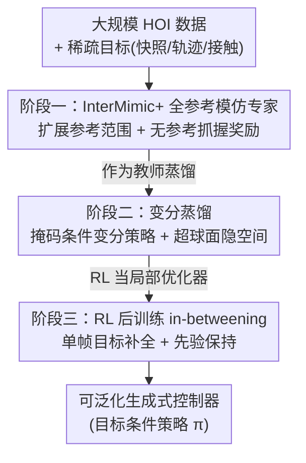

# InterPrior: Scaling Generative Control for Physics-Based Human-Object Interactions

**会议**: CVPR 2026  
**论文**: [CVF Open Access](https://openaccess.thecvf.com/content/CVPR2026/html/Xu_InterPrior_Scaling_Generative_Control_for_Physics-Based_Human-Object_Interactions_CVPR_2026_paper.html)  
**代码**: 项目页 https://sirui-xu.github.io/InterPrior  
**领域**: 人体理解 / 物理仿真人物交互 / 强化学习  
**关键词**: 人-物交互、物理仿真、生成式控制器、变分蒸馏、RL 微调

## 一句话总结
InterPrior 用「大规模模仿蒸馏 + RL 微调」的三阶段配方，把一个全参考模仿专家蒸馏成目标条件的变分策略，再用 RL 把它打磨成能从稀疏目标（快照/轨迹/接触）生成全身人-物交互、并在失败后自我纠正的可泛化生成式控制器。

## 研究背景与动机

**领域现状**：人-物交互（HOI）天然是分层的——人在高层只规划稀疏意图（比如「手要去够瓶子」），而平衡、接触、四肢协调这些细节是由底层运动先验自发涌现的。物理仿真里要让一个仿真人/人形机器人完成这类全身 loco-manipulation（边移动边操作），主流有两条路线：一是**对抗式生成控制器**（用判别器做分布匹配再加 RL），能超出演示扩展运动覆盖，但优化不稳定、判别器易模式坍缩、任务奖励要手工设计，难以规模化；二是**蒸馏参考模仿策略**（把一个模仿专家蒸成带目标条件的策略），能吸收大规模数据且不需要任务专属设计。

**现有痛点**：蒸馏路线在 loco-manipulation 上很脆。原因是**参考覆盖远远赶不上配置空间**——只要物体多几个自由度，接触模式和相对位姿就会随几何形状组合爆炸。蒸馏的本质是「回放数据集轨迹」，所以一旦目标或人-物状态漂出数据分布（比如技能之间的过渡段、随机初始化），策略就会失稳、抓不住薄/小物体、出错后只会越错越离谱。而纯 RL 又会朝「奖励作弊」的非自然动作漂移。

**核心矛盾**：蒸馏给得起「自然且广」的先验但**不鲁棒**（覆盖不全配置空间），纯 RL 鲁棒但**不自然**（容易 reward hacking）。两者单用都不行。

**本文目标**：学一个**单一策略**，沿四个轴同时可扩展——任务覆盖（一个策略支持多种稀疏目标及其组合）、技能覆盖（同一配方吃下大规模 HOI 数据）、运动覆盖（生成富有表现力的轨迹而非只复现演示）、动力学覆盖（在不同物理属性下仍能成功）。

**切入角度 / 核心 idea**：作者的关键判断是「**RL 微调是把蒸馏从『数据重建』变成『可泛化策略』的关键**」。所以用蒸馏提供强而自然的初始化，再把 RL 当作**锚定在预训练模型附近的局部优化器**——既扩张了能力边界（恢复失败、探索未见配置），又靠正则保住了预训练学到的自然性。

## 方法详解

### 整体框架

InterPrior 要解决的是：给定当前人-物状态 + 稀疏未来目标，采样出底层驱动指令，让物理仿真器里的人形角色完成自然、可行、且遵循目标的交互。整套方法是一个**三阶段范式**：先训一个只会「严格照抄参考」的全参考模仿专家（阶段一），把它**蒸馏**成一个能从稀疏多模态目标采样动作的变分策略（阶段二），最后用 **RL 微调**把这个变分策略从「只会回放数据」推到「能泛化、能从失败恢复」（阶段三）。三个阶段都建模成共享同一套输入/输出格式的 MDP：输入是观测 $x_t$（人体运动学、物体运动学、以及人-物之间的有符号距离 $D_t$ 与二值接触 $C_t$）加目标条件，输出是关节位置目标 $a_t$，再经 PD 控制转成关节力矩驱动仿真。

目标条件是这套方法的「任务统一」枢纽：参考帧 $y_t$ 与观测 $x_t$ 共享状态空间，配一个二值掩码 $m_t$ 指明哪些分量被提供给策略。作者用两类目标——短时程的 preview 序列和长时程的 snapshot，并对每个目标做**掩码残差编码** $\tilde{y}_{t+k} = m_{t+k} \odot \ominus(y_{t+k}, x_t)$（$\ominus$ 对旋转量取 log-map、对欧氏量取差）。推理时用户只需填入想约束的分量、把对应掩码置 1、其余清零，就能用一套接口表达快照目标、轨迹目标、接触目标及其组合。

### 关键设计

**1. InterMimic+ 全参考模仿专家：先把「严格照抄」的老师训得更耐扰**

阶段一的专家 $\pi_E$ 沿用 InterMimic 的大规模人-物共追踪范式：每步收到完整无掩码的未来参考，用 PPO 最大化 $r = r_{\text{track}} - r_{\text{energy}}$，逼策略严格贴合参考。但作者发现原版专家有两个硬伤：抓**薄/小物体**时精度退化（它只会僵硬地照搬参考轨迹、不利用细粒度的手-物关系），且一旦 rollout 偏离参考就更糟。为此 InterMimic+ 做两件事。其一是**扩展参考范围**：从带随机扰动的参考帧初始化，rollout 中对骨盆和物体施加稀疏冲量（随机速度扰动）逼策略偏离参考，并增广物体形状、随机化质量密度/质心偏移/惯量/摩擦——让策略见过多样动力学，但**不改参考本身**；同时加终止惩罚 $r_{\text{ter}} = -w_{\text{ter}} \cdot c_{\text{ter}}$（人摔倒或状态严重偏离参考时触发），避免扰动下直接进入失败态。其二是**无参考抓握奖励** $r_h$：在随机化和扰动下严格的参考追踪不再可靠，所以 $r_h$ 鼓励手依据**当前仿真状态**去对准、贴合、包住物体，而不是死跟参考轨迹——它充当一个纠偏项，把因扰动偏离参考的手重新引导到真实物体上。完整奖励为 $r_t = (r_{\text{track}} - r_{\text{energy}} - r_h) + r_{\text{ter}}$。

**2. 变分蒸馏：把专家蒸成「从稀疏目标采样动作」的多模态策略**

专家会照抄稠密参考，但最终策略要在**稀疏线索**下还保持自然和多样，这要靠从隐技能分布里采样。作者用一个隐变量 $z_t \in \mathbb{R}^{d_z}$ 建模策略 $\pi$，它含三部分：先验 $p_\psi(z_t \mid x_{t-\delta:t}, \mathcal{G}_t)$（一个四层 Transformer 编码近期历史 + 稀疏目标，出高斯 $\mathcal{N}(\mu_p, \Sigma_p)$）、编码器 $q_\phi(z_t \mid x_t, \mathcal{G}_t, y_{t:t+H}, y_{t+L})$（仅训练时用的 MLP，看完整未来参考出 $\mathcal{N}(\mu_q, \Sigma_q)$）、解码器 $f_\theta(a_t \mid x_{t-\delta:t}, z_t)$（把隐变量和观测映成动作）。训练时按残差后验 $\mathcal{N}(\mu_p + \mu_q, \Sigma_q)$ 重参数化采样 $z_t = (\mu_p + \mu_q) + \Sigma_q^{1/2}\epsilon$，并在一个 episode 内固定 $\epsilon$ 以保证时间一致性；推理时只用先验从 $\mathcal{N}(\mu_p, \Sigma_p)$ 采样。两个新设计是关键：一是**多模态条件**（把接触也纳入目标，支撑灵活的人-物条件）；二是**隐空间约束与有界化**——采样后把 $z_t \leftarrow z_t / \lVert z_t \rVert$ 投影到超球面，抑制罕见的离群隐变量诱发的非自然动作，同时保留方向上的多模态变化（KL 正则仍在投影前的高斯上算）。蒸馏走在线 DAgger 框架：学生从专家+自生成 rollout 的混合中学，专家驱动比例随训练逐步让位给学生。总损失 $L_{\text{total}} = L_{\text{ELBO}} + \lambda_{\text{scale}} L_{\text{scale}} + \lambda_{\text{tc}} L_{\text{tc}}$，其中 ELBO 含模仿损失（复现专家动作）+ 目标重建损失（补全被掩码的目标分量，逼隐空间学到「从上下文推断意图」）+ KL 正则；$L_{\text{scale}}$ 约束先验均值 $\mu_p$ 保持单位模长（配合超球面归一化防退化），$L_{\text{tc}}$ 鼓励相邻时刻先验分布相似。

**3. RL 后训练的 in-betweening 微调：把蒸馏策略推过参考覆盖不到的地方**

蒸馏出的 $\pi$ 会跟目标，但只要状态漂出数据分布（技能切换的过渡段最典型）就脆。作者的核心做法是把 RL 微调建模成一个 **in-betweening（补间）任务**：从随机采样的初始配置出发，去追一个**从数据集随机抽的单帧目标**——这样既绕开了「需要一个强大的多帧轨迹采样器」（在 loco-manipulation 规模上极难训），又能靠「组合单帧目标 + 随机初始化/偏移」系统性地拓宽 RL 见到的状态分布。奖励是 $r_t^{\text{PT}} = (r_{\text{energy}} - r_h) + r_{\text{goal}} + r_{\text{ter}}$，因为目标由随机掩码任意指定，所以**不用稠密距离奖励**，而用稀疏成功信号 $r_{\text{goal}}$：当当前状态与目标的掩码特征距离 $\lVert m_{t+L} \odot \ominus(\tilde{y}_{t+L}, x_t)\rVert_1 < \xi$ 时给常数奖励 $r_{\text{succ}}$，否则为 0。在此之上学两类新技能：**分布内扩展**（如重抓 regrasp，从多样初始化和扰动态去够目标会自然涌现「快失败时自我纠正」，无需额外监督）；**分布外技能**（如从摔倒爬起 getting-up，给策略追加一个可学习 token 标识新子任务，并加鼓励直立姿态与质心抬升的辅助奖励）。最关键的是**先验保持**：作者不像以往工作那样冻结网络去防遗忘，而是用一个简单的**多目标调度**——保留一部分环境继续优化原蒸馏目标，其余环境做 RL 微调，从而把策略锚定在预训练先验上、又不限制模型容量；多 GPU 上按 map-reduce 聚合梯度。

### 损失函数 / 训练策略
- 阶段一：PPO，$r_t = (r_{\text{track}} - r_{\text{energy}} - r_h) + r_{\text{ter}}$，30 Hz、IsaacGym 仿真。
- 阶段二：DAgger 在线蒸馏，$L_{\text{total}} = L_{\text{ELBO}} + \lambda_{\text{scale}} L_{\text{scale}} + \lambda_{\text{tc}} L_{\text{tc}}$；专家/解码器/编码器为 MLP (1024,1024,512)，先验为四层 Transformer。
- 阶段三：RL（PPO 类）微调 + 并行蒸馏的多目标环境混合调度；轨迹条件输入由并行蒸馏损失「保护」，不被微调破坏。

## 实验关键数据

数据集用 InterAct（含 OMOMO 子集，由教师 rollout 修复），泛化评测迁到 BEHAVE / HODome 子集（剔除软体主导的交互）。任务分两类：全参考追踪、稀疏目标跟随；后者覆盖快照/轨迹/接触及其组合，外加长时程多目标链（Chain）和随机初始化（Rand Init）两个压力测试。

### 主实验（目标条件任务，节选自 Table 1，Succ↑ / Eh↓ / Eo↓ / Fail↓）

| 配置 | 快照 Succ | 接触 Succ | Chain Succ | Rand Init Succ |
|------|-----------|-----------|------------|----------------|
| MaskedMimic（InterMimic 专家） | 64.2 | 52.2 | 29.1 | 31.7 |
| InterPrior（完整） | **90.0** | **90.7** | **68.8** | **88.6** |

完整 InterPrior 在快照成功率 64.2→90.0、接触 52.2→90.7，而提升最猛的恰是两个压力测试：多目标链 29.1→68.8、随机初始化 31.7→88.6。这印证了核心论点——蒸馏策略会拟合「演示诱导的状态分布」，长 rollout 一旦进入欠覆盖的中间态就漂移失败；RL 直接训「从多样初始化够稀疏目标」，显著改善了目标序列间的插值与离分布恢复。

### 全参考追踪与可复用先验（Table 2，SR↑）

| 方法 | OMOMO SR | BEHAVE SR | HODome SR |
|------|----------|-----------|-----------|
| InterMimic | 63.9 | 10.7 | 27.8 |
| InterMimic + 微调 | / | 38.9 | 55.5 |
| InterPrior | **83.2** | 27.4 | 40.1 |
| InterPrior + 微调 | / | **52.0** | **72.4** |

在含薄物体+初始化扰动的 OMOMO 上，InterPrior 成功率 63.9→83.2（代价是位置误差 Eh 略升 7.1→8.9，因为它会**主动小幅偏离参考**去重对齐接触，用「不严格追踪」换「完成交互」）。作为可复用先验适配新物体/新交互时，InterPrior 无论微调与否都比全参考 InterMimic 更稳（BEHAVE 微调后 38.9→52.0）。

### 消融实验（Table 1 累积消融，快照/接触/Chain/RandInit 的 Succ）

| 累积配置 | 快照 | 接触 | Chain | Rand Init |
|----------|------|------|-------|-----------|
| InterMimic+ 专家 | 71.4 | 69.3 | 33.9 | 30.1 |
| + 隐空间塑形损失 | 74.9 | 71.9 | 40.0 | 30.9 |
| + 有界隐空间&观测 | 89.1 | 88.5 | 45.1 | 41.1 |
| + RL 微调（=完整） | 90.0 | 90.7 | 68.8 | 88.6 |

### 关键发现
- **有界隐空间是单步精度的最大功臣**：加上超球面有界化后，快照 74.9→89.1、接触 71.9→88.5，说明把隐变量限制在合理流形上，对接触密集任务的漂移抑制至关重要。
- **RL 微调是压力测试的最大功臣**：它对标准任务精度几乎不动（快照仅 89.1→90.0），却把 Chain 45.1→68.8、Rand Init 41.1→88.6，证明它主要贡献是「鲁棒性 / 离分布恢复」而非「拟合得更准」。
- **轨迹跟随没被牺牲**：尽管 in-betweening 只在单帧快照目标上微调，轨迹成功率反而 93.6→94.6——因为轨迹条件输入被并行蒸馏损失显式保护，且偏离时会被重定义为快照目标，从而间接受益于快照微调。
- **失败模式**：极薄/极细的未见物体仍难抓；多目标链中 canonicalization 引入的大对齐误差会让策略「宁可保平衡也不强行达成精确目标」。

## 亮点与洞察
- **「蒸馏当初始化、RL 当局部优化器」的配方很可迁移**：它把「自然但不鲁棒」和「鲁棒但不自然」这对矛盾拆开，用预训练先验锚定 RL，避免 reward hacking——这套思路可直接搬到其它「先模仿、后强化」的具身控制任务。
- **用掩码残差编码统一多种稀疏目标**：快照/轨迹/接触/组合全靠「填哪些分量+置哪些掩码」表达，一套接口吃下整族任务形式，是「任务覆盖」可扩展的核心机巧。
- **in-betweening 绕开多帧轨迹采样器**：把微调建模成「从随机初始化够一个随机单帧目标」，既系统性地拓宽状态分布，又避开了在 loco-manipulation 规模上训一个强轨迹采样器的难题——重抓、自我纠正这些行为是**免监督涌现**的。
- **超球面隐空间 + 单位模长约束**：限制罕见隐变量诱发的非自然动作，同时保留方向上的多模态，是「既稳又多样」的小而关键的设计。

## 局限与展望
- 作者承认仍有失败模式：极薄/极细的未见物体、以及多目标链中 canonicalization 带来的对齐误差。
- 评测剔除了软体主导的交互（如背包肩带），方法假设物体均为刚体，对可形变物体的适用性未验证。
- 全参考追踪上 InterPrior 的位置误差略高于 InterMimic（它主动偏离参考换接触对齐），在「必须严格贴合参考」的场景里这是劣势。
- G1 机器人因没有灵巧手而排除了薄几何物体的单手抓握，real-robot 能力依赖另一篇工作 [17] 的部署；本文主体仍是仿真。⚠️ 真机细节以原文为准。
- 展望：整合感知、语言条件目标、更丰富的 affordance，推进到 sim-to-real 的辅助操作与遥操作。

## 相关工作与启发
- **vs 对抗式生成控制器（如 AMP / ASE 系）**：它们用判别器做分布匹配再加 RL，能扩展运动覆盖但优化不稳、判别器易模式坍缩、任务奖励要手工设计、难规模化；InterPrior 走蒸馏+RL，不需要任务专属判别器，能吸收大规模数据。
- **vs MaskedMimic**：MaskedMimic 也用掩码目标条件做物理控制，但它直接蒸 InterMimic 专家、缺少有界隐空间与 RL 微调，在压力测试上明显更弱（快照 64.2 vs 90.0、Rand Init 31.7 vs 88.6）；InterPrior 在其基础上加 InterMimic+ 专家、隐空间塑形/有界化、RL in-betweening。
- **vs InterMimic（本文专家的前身）**：InterMimic 是全参考模仿，照抄稠密参考、精度高但脆（薄物体抓不住、偏离参考即崩）；InterPrior 把它蒸成稀疏目标条件的生成策略并 RL 微调，换来泛化与失败恢复，代价是严格追踪精度略降。

## 评分
- 新颖性: ⭐⭐⭐⭐ 「蒸馏初始化 + RL 局部优化器」配方 + in-betweening 微调 + 统一掩码目标，组合扎实。
- 实验充分度: ⭐⭐⭐⭐ 多任务 + 压力测试 + 累积消融 + 跨数据集泛化 + sim-to-sim 都有，定量定性兼备。
- 写作质量: ⭐⭐⭐⭐ 三阶段逻辑清晰，核心论点（RL 是泛化关键）贯穿始终；个别公式记号在 CVF 文本里略乱。
- 价值: ⭐⭐⭐⭐ 给人形 loco-manipulation 提供了一套可扩展、可复用的先验配方，对具身交互生成有实际参考价值。

<!-- RELATED:START -->

## 相关论文

- [\[CVPR 2026\] Decoupled Generative Modeling for Human-Object Interaction Synthesis](decoupled_generative_modeling_for_human-object_interaction_synthesis.md)
- [\[CVPR 2026\] InterPhys: Physics-aware Human Motion Synthesis in a Dynamic Scene](interphys_physics-aware_human_motion_synthesis_in_a_dynamic_scene.md)
- [\[CVPR 2026\] Ground Reaction Inertial Poser: Physics-based Human Motion Capture from Sparse IMUs and Insole Pressure Sensors](ground_reaction_inertial_poser_physics-based_human_motion_capture_from_sparse_im.md)
- [\[ICCV 2025\] HUMOTO: A 4D Dataset of Mocap Human Object Interactions](../../ICCV2025/human_understanding/humoto_a_4d_dataset_of_mocap_human_object_interactions.md)
- [\[CVPR 2026\] HandX: Scaling Bimanual Motion and Interaction Generation](handx_scaling_bimanual_motion_and_interaction_generation.md)

<!-- RELATED:END -->
