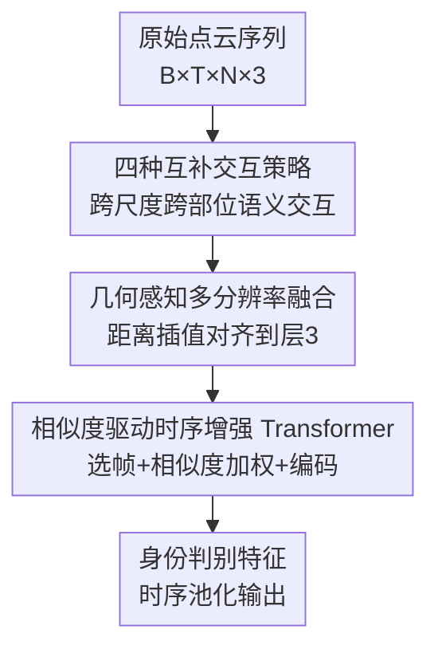

# MS^2Gait: A Multi-Scale Spatio-Temporal Fusion Network for LiDAR-based Gait Recognition

**会议**: CVPR 2026  
**论文**: [CVF Open Access](https://openaccess.thecvf.com/content/CVPR2026/html/Xu_MS2Gait_A_Multi-Scale_Spatio-Temporal_Fusion_Network_for_LiDAR-based_Gait_Recognition_CVPR_2026_paper.html)  
**代码**: 无  
**领域**: 人体理解 / 生物识别（步态识别）  
**关键词**: 步态识别, LiDAR 点云, 多尺度时空建模, 跨部位语义交互, 关键帧选择

## 一句话总结
MS²Gait 直接在原始 LiDAR 点云上做步态识别，用「四种互补交互策略」让空间上相隔很远但语义相关的身体部位（如对侧手臂—腿）相互通信，再用「相似度驱动的时序增强 Transformer」按运动一致性自适应加权帧，在 SUSTech1K 和 FreeGait 上分别拿到 93.5% / 83.1% 的 Rank-1，刷新原始点云步态识别 SOTA。

## 研究背景与动机
**领域现状**：步态识别因为不需要被试配合、能远距离工作、难以伪装，被视为有潜力的生物识别手段。传统方法依赖 2D RGB 视频提取轮廓（silhouette）或骨架序列；而 LiDAR 点云方法近年兴起，因为它对光照鲁棒、保留 3D 几何结构、还天然保护隐私（无纹理）。

**现有痛点**：2D 方法对光照、遮挡、视角极其敏感——文中提到光照差时识别精度会掉超过 60%，遮挡会把轮廓打碎。转到点云后，现有方法又暴露出两个新缺陷：（1）**空间多尺度建模不充分**——主流做法要么只取单尺度特征，要么做分层采样但各尺度特征彼此孤立地提取，无法建模「空间上隔得远、生物力学上却相关」的部位之间的关联（例如走路时手臂和腿的协同摆动），于是在背包、宽松衣物、打伞、拎东西等非步态干扰下性能骤降；（2）**时序建模过于简陋**——大多数原始点云方法只用 max/average pooling 把序列压成静态表示，丢掉了步态的周期性和细粒度动态，更没有处理「时序异质性」的设计：步频和采样率不同，会让相同长度的序列代表差异巨大的步态周期跨度，统一处理就会在密采样序列里冗余、在稀采样序列里覆盖不足。

**核心矛盾**：点云的无序、稀疏、非欧几里得结构，使得为 2D 规则网格设计的「部位划分 + 多分支聚合」范式失效；而真正区分身份的生物力学线索（躯干—四肢协调）恰恰要求建模相隔很远的部位之间的语义关联，这正是现有孤立提取范式做不到的。

**本文目标**：拆成两个子问题——空间上如何让跨尺度、跨部位的语义特征相互流动；时序上如何在没有显式监督（无需标注步态相位）的前提下，自适应地强调一致运动、抑制噪声帧。

**核心 idea**：空间侧用「目标—候选」对替代僵硬的「锚点—邻域」对，设计四种互补交互策略搭出一条从脚到髋的特征传播链；时序侧用「多样性选关键帧 + 多尺度余弦相似度聚合」按运动一致性动态加权，再交给 Transformer 编码长程周期性。

## 方法详解

### 整体框架
MS²Gait 接收一段原始点云序列 $P_o \in \mathbb{R}^{B \times T \times N \times 3}$（B 批、T 帧、每帧 N 个点、每点 xyz 三维坐标），输出身份判别用的特征表示。整条管线分三段串联：先用 **HSFE（分层空间特征提取器）** 通过四个带互补交互策略的 SGM-Block 提多尺度空间特征，让相隔很远的语义相关区域互通信息；再用 **GMFF（几何感知多分辨率特征融合）** 把四层不同密度的特征对齐到同一点分布、拼接融合成多尺度空间表示；最后用 **STET（相似度驱动时序增强 Transformer）** 做关键帧选择 + 多尺度相似度聚合 + Transformer 编码，得到最终时序鲁棒的特征。整体可写成：

$$F_{\text{final}} = \mathcal{T}\!\left(\mathcal{G}\!\left(\left[\mathcal{H}_i(P_o)\right]_{i=1}^{4}\right)\right)$$

其中 $\mathcal{H}_i$ 是第 $i$ 层的空间提取器，$\mathcal{G}$ 是融合模块，$\mathcal{T}$ 是时序模块。网络沿用改进的 PointNet++ baseline，四个 SGM-Block 输入通道 $(3, 4C, 8C, 16C)$、输出通道 $(4C, 8C, 16C, 256)$，逐层把人体点云按层级聚类、采样点数递减。

### 关键设计

**1. 四种互补交互策略：让相隔很远的身体部位互相通信**

针对「各尺度特征孤立提取、建模不了远距离部位关联」这个痛点，作者首先把传统 SGM（Sampling-Grouping-Mixing）里的「MLP + MaxPooling」局部聚合换成「MLP + Softmax 加权」。传统做法 $f_i' = \text{maxpool}(g(p_j - p_i, f_j))$ 有两个毛病：MaxPooling 丢掉语义分布、独立邻域阻断了远距离相关部位的连接。改进后，对每个目标点 $i$ 和候选点 $j$ 算得分 $s_j = g_2([g_1(f_i - f_j);\, \delta(p_i - p_j)])$（用相对特征 $f_i - f_j$ 显式建模语义对比，$\delta(\cdot)$ 捕捉几何关系），再加权 $f_i' = \sum_{j \in \mathcal{M}_i} \text{softmax}(s_j)\cdot g_3(f_j)$。这样就把聚合从僵硬的「锚点—邻域」泛化成灵活的「目标—候选」对。

在此基础上提出四种互补策略，分两个层次：**Set-level（前两个）**——(1) **Intra-Set Mixing** 让目标点从自己空间邻域的候选聚合信息，捕捉细粒度局部结构；(2) **Inter-Set Mixing** 反向传播，让目标点接收「所有把它包含进邻域的锚点」的信息，在遮挡/自遮挡下用扩大的感受野注入互补线索、恢复被挡区域特征。**Layer-level（后两个）**——(3) **Intra-Layer Mixing** 按特征相似度（而非空间邻近）选候选，因为生物力学相关部位（如对侧肢体）在空间上是分离的，这一步抓的是对称协调的步态模式；(4) **Inter-Layer Mixing** 让第 $l$ 层目标点从 $l\pm1$ 层中、邻域与自己空间重叠的候选里选，建模「局部运动受更大结构约束」（脚的运动依赖小腿和躯干），实现跨尺度的生物力学依赖传递。四者形成一条传播链：特征从局部（脚）逐步流到全局（髋），把分散的身体部位连成完整的下肢信息交换。消融显示 Inter-Set Mixing 增益最大，因为它的反向传播专治遮挡点。

**2. GMFF 几何感知多分辨率特征融合：把不同密度的层级特征对齐到同一坐标系**

四种交互策略产出的是不同密度的多层级表示，直接拼会因为点分布不一致而对不齐。GMFF 选第 3 层 $L_k$ 的点集作为目标分布（不用 1–2 层，因为太细粒度、局部噪声多），对目标层每个点 $i$ 用 3-NN 做基于距离倒数的插值对齐：

$$w_{ij} = \frac{1}{d_{ij}+\varepsilon}\Bigg/\sum_{l \in \mathcal{T}_i}\frac{1}{d_{il}+\varepsilon}$$

对齐特征 $f_i' = \sum_{j \in \mathcal{T}_i} w_{ij}\cdot f_j$ 就是邻居特征的距离加权和（$\mathcal{T}_i$ 是源层中 $i$ 的 3 个最近邻）。各层特征都插值到 $L_k$ 的点分布后拼接、过 MLP 融合，再用 UAP（Uniform Altitude Partition，沿用 LidarGait++）聚合成最终多尺度空间表示。这一步在保留 3D 几何关系的同时，让跨分辨率特征可融合，消融里它在 carrying 子集上贡献最大（+2.1%）。

**3. STET 相似度驱动时序增强 Transformer：按运动一致性自适应加权帧，治时序异质性**

即便序列定长，步频和采样率差异仍会带来冗余和噪声，而普通 self-attention 把所有帧一视同仁、还有二次复杂度。STET 分三步。**(a) 多样性驱动关键帧选择**：先自适应定关键帧数 $K = \max(K_{\min}, \min(K_{\max}, \lfloor \alpha\cdot T\rfloor))$（$\alpha \in [0.5, 0.8]$，$K_{\min}$ 保相位覆盖、$K_{\max}$ 控开销）；L2 归一化后从「最接近全局均值的帧」起步，用 max-min 贪心在特征空间迭代选「与已选集最不相似」的帧 $i_k = \arg\min_{i \in \mathcal{R}_{k-1}} \max_{j \in \mathcal{S}_{k-1}}\langle \bar f_i, \bar f_j\rangle$，且保持时间顺序 $i_1 < \cdots < i_K$。它无参、在特征空间而非固定时间间隔操作，高步频序列里滤冗余、低步频序列里保稀疏帧，无需任何步态相位标注。**(b) 多尺度余弦相似度聚合**：在局部（$k=3$）和中程（$k=5$）两个尺度上，让每个关键帧从原序列里的时间邻域 $\mathcal{N}_{i_m}^{(k)}$ 聚合信息，权重按余弦相似度 $\omega_{i_m,t}^{(s)} = \frac{\exp(\langle\bar f_{i_m},\bar f_t\rangle)}{\sum_{j}\exp(\langle\bar f_{i_m},\bar f_j\rangle)}$，聚合特征 $\phi_m^{(s)} = \sum_t \omega_{i_m,t}^{(s)} f_t$，再用可学习参数 $u_s$ 做 softmax 多尺度融合并残差门控 $\hat f_m = f_{i_m} + \sigma(\text{MLP}(f_{i_m}))\odot f_m^{\text{enhanced}}$——一致的步态帧得高权、离群噪声被压制。**(c) Transformer 编码**：加位置编码后用多头自注意力捕捉局部转移和长程周期性，时序池化得最终表示。这套设计让模型在 50% 随机丢帧下仍保持相对稳定（见鲁棒性实验），而 LidarGait++ 明显退化。

### 损失函数 / 训练策略
总损失结合 Triplet Loss 和 Cross-Entropy Loss。优化器 SGD（动量 0.9、权重衰减 $5\times10^{-4}$），学习率按余弦退火从 0.1 降到 $1\times10^{-4}$。SUSTech1K 训 40K 迭代、采样点 $[512,256,128,128]$、$C=16$、$n_{sample}=32$；FreeGait 训 80K 迭代、采样点 $[256,192,128,128]$、$C=32$、$n_{sample}=16$。STET 中 $\alpha=0.6$、$K_{\min}=4$、$K_{\max}=16$，Transformer 4 层 8 头、dropout 0.1。训练加随机旋转/缩放/抖动增强，四张 RTX 4090。

## 实验关键数据

### 主实验
在 SUSTech1K（最大 LiDAR 步态数据集，128 线 LiDAR，25,239 序列、1,050 人）上，MS²Gait 几乎全指标最优，仅用原始点云（PCs）就超过了用深度图（DIs）或 DIs+PCs 组合的方法。

| 数据集（输入） | 模型 | OA@R1 | Normal | Bag | Carrying | Umbrella | Uniform |
|----------------|------|-------|--------|-----|----------|----------|---------|
| SUSTech1K (PCs) | PointNet++ (Baseline) | 77.1 | 82.5 | 78.7 | 76.1 | 74.0 | 75.8 |
| SUSTech1K (PCs) | GaitCloud | 89.2 | 89.8 | 90.3 | 89.7 | 85.8 | 89.0 |
| SUSTech1K (PCs) | LidarGait++ | 92.7 | 94.2 | 93.9 | 92.4 | 91.5 | 91.9 |
| SUSTech1K (DIs+PCs) | HMRNet | 90.2 | 92.8 | 83.2 | 90.3 | 83.1 | 86.2 |
| **SUSTech1K (PCs)** | **MS²Gait (Ours)** | **93.5** | **96.6** | **94.7** | **93.3** | **92.5** | **92.4** |

相比次优的 LidarGait++，normal 子集领先 2.4%（94.2→96.6）；在 bag（94.7% vs baseline 78.7%）和 umbrella（92.5% vs baseline 74.0%）等非步态干扰子集上鲁棒性优势尤其明显。

FreeGait（11,921 序列、1,195 人，25m 长距离捕获）上 MS²Gait 同样最优，Rank-1 从 baseline 的 59.3% 提到 83.1%：

| 数据集（输入） | 模型 | Rank-1 | Rank-5 | mAP |
|----------------|------|--------|--------|-----|
| FreeGait (DIs) | LidarGait | 74.2 | 88.8 | 80.7 |
| FreeGait (PCs) | PointNet++ (Baseline) | 59.3 | 81.2 | 69.3 |
| FreeGait (PCs) | LidarGait++ | 82.0 | 93.6 | 87.2 |
| FreeGait (DIs+PCs) | HMRNet | 80.8 | 93.6 | 86.5 |
| **FreeGait (PCs)** | **MS²Gait (Ours)** | **83.1** | **93.8** | **87.7** |

效率方面（Tab. 3），MS²Gait 参数 4.94 MB、显存 205.7 MB/seq，与 LidarGait++（4.32 MB / 188.8 MB）相当，并未为性能付出过大代价（SGM-Block2&3 的 Intra-Set Mixing 复用了前序 Mixing 的 FPS/kNN 结果以省推理时间）。

### 消融实验
Tab. 4 从 PointNet++ baseline 起逐组件叠加（实验 9–11 基于全尺度 HSFE）：

| 配置 | OA-R1 | CL（衣物） | UB（伞） | 说明 |
|------|-------|-----------|---------|------|
| 仅 Intra-Set | 84.2 | 67.5 | 83.2 | 单一交互起点 |
| + Inter-Set + Intra-Layer + Inter-Layer（全四交互） | 90.6 | 78.2 | 90.9 | 四策略全开 |
| + GMFF | 92.0 | 78.1 | 91.7 | 多分辨率融合 |
| + Transformer | 92.2 | 78.7 | 92.0 | 仅时序编码 |
| + Transformer + STE（完整 STET） | 93.5 | 79.7 | 92.5 | 完整模型 |

### 关键发现
- **四种交互策略贡献最大**：从单一 Intra-Set（84.2）到四策略全开（90.6），在 clothing（+10.7%）和 umbrella（+7.7%）子集涨得最猛，说明跨部位信息交换确实补偿了遮挡。
- **Inter-Set Mixing 是四者中增益最高的单项**，其反向传播专门救遮挡点；Intra-/Inter-Layer 则负责建立远距离部位的语义关联和跨尺度传递。
- **时序鲁棒性**：随机丢帧到 50% 时，MS²Gait 各指标退化幅度都明显小于 LidarGait++，归功于多样性选帧 + 多尺度相似度聚合共同补偿缺失信息。
- **跨域泛化**：SUSTech1K 训、FreeGait 测（12m vs 25m 密度差异），直接处理点云的方法普遍掉点，而 MS²Gait 在原始点云上仍保持相对鲁棒的跨域性能。

## 亮点与洞察
- **「目标—候选」对取代「锚点—邻域」对**是个干净的抽象升级：一旦聚合不再被空间邻接绑死，就能自然地让特征相似（而非位置相邻）的对侧肢体互相通信，这正是步态生物力学需要的。
- **四种交互策略的「Set-level / Layer-level」分层切分**很有条理：前两个搭低层鲁棒编码、后两个做高层语义建模，最终串成一条「脚→髋」的传播链，可解释性强（可视化也证实了远距离候选选择）。
- **无监督处理时序异质性**很巧：max-min 多样性贪心选帧在特征空间自适应步频，完全不需要步态相位标注，丢帧鲁棒性是直接收益，这个「特征空间选关键帧」的思路可迁移到其它变长序列任务（如视频动作识别）。
- **只用原始点云就压过 DIs+PCs 组合方法**，说明把几何交互和相位感知时序建模做到位，能省掉深度图投影那一步信息损失。

## 局限与展望
- 论文未给出**显式监督缺失下选帧策略的失败边界**：α、$K_{\min}/K_{\max}$ 等超参在不同采样率分布下如何敏感，缺少系统分析。
- **GMFF 固定选第 3 层作目标分布**是经验设定（1–2 层太细噪声多），对点更稀疏的远距离场景是否仍最优未充分讨论。
- 评测仅限 SUSTech1K 和 FreeGait 两个户外 LiDAR 数据集，**跨传感器（不同线数/厂商）泛化**只做了两数据集间的迁移，更广的部署鲁棒性待验证。
- 四种交互策略叠加带来一定参数/显存增长（虽与 SOTA 相当），在边缘端实时部署上的代价未展开。

## 相关工作与启发
- **vs LidarGait / LidarGait++**：它们是投影法或直接处理法的代表，LidarGait++ 把点云转深度图绕过密度差异。MS²Gait 坚持在原始点云上做，靠跨部位交互和相位感知时序补回信息，normal 子集领先 2.4%，且省掉投影损失。
- **vs PointNet++（baseline）**：本文沿用其分层采样骨架，但把「MLP+MaxPooling」换成「MLP+Softmax 加权」并加四种交互，SUSTech1K Rank-1 从 77.1 提到 93.5。
- **vs 2D 多尺度步态法（GaitSet/GaitPart/GaitBase）**：2D 法依赖规则网格和像素邻接，对稀疏无序点云不适用，且都缺跨区域语义交互机制；本文针对点云结构重新设计了交互范式。

## 评分
- 新颖性: ⭐⭐⭐⭐ 四种互补交互 + 多样性选帧的组合在原始点云步态识别上是清晰的范式升级，但单项机制多有借鉴。
- 实验充分度: ⭐⭐⭐⭐⭐ 两大数据集 + 细致消融 + 跨域 + 丢帧鲁棒 + 效率对比 + 多种可视化，覆盖全面。
- 写作质量: ⭐⭐⭐⭐ 动机和方法讲得清楚，公式较多但脉络分明；部分模块（UAP、GMFF 层选择）依赖前作背景。
- 价值: ⭐⭐⭐⭐ 刷新原始点云步态识别 SOTA，且非步态干扰和丢帧鲁棒性强，对监控/身份认证场景实用价值明确。

<!-- RELATED:START -->

## 相关论文

- [\[CVPR 2026\] MMGait: Towards Multi-Modal Gait Recognition](mmgait_multi_modal_gait_recognition.md)
- [\[CVPR 2026\] EventGait: Towards Robust Gait Recognition with Event Streams](eventgait_towards_robust_gait_recognition_with_event_streams.md)
- [\[CVPR 2026\] Text-guided Feature Disentanglement for Cross-modal Gait Recognition](text-guided_feature_disentanglement_for_cross-modal_gait_recognition.md)
- [\[CVPR 2026\] HyperGait: Unleashing the Power of Parsing for Gait Recognition in the Wild via Hypergraph](hypergait_unleashing_the_power_of_parsing_for_gait_recognition_in_the_wild_via_h.md)
- [\[CVPR 2026\] Unlocking Motion from Large Vision Models with a Semantic and Kinematic Duality for Gait Recognition](unlocking_motion_from_large_vision_models_with_a_semantic_and_kinematic_duality_.md)

<!-- RELATED:END -->
