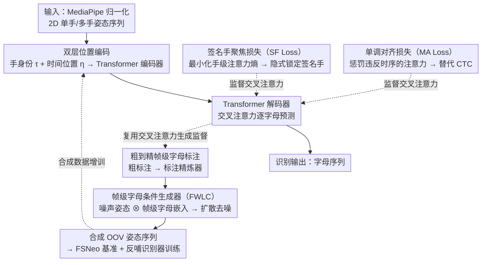

# OpenFS: Multi-Hand-Capable Fingerspelling Recognition with Implicit Signing-Hand Detection and Frame-Wise Letter-Conditioned Synthesis

**会议**: CVPR2026  
**arXiv**: [2602.22949](https://arxiv.org/abs/2602.22949)  
**代码**: [JunukCha/OpenFS](https://github.com/JunukCha/OpenFS)  
**领域**: 人体理解  
**关键词**: 指拼识别, 手语理解, 隐式签名手检测, 单调对齐损失, 扩散生成, OOV泛化

## 一句话总结

提出 OpenFS 框架，通过双层位置编码 + 签名手聚焦损失 + 单调对齐损失实现隐式签名手检测的多手指拼识别，并设计帧级字母条件扩散生成器合成 OOV 数据，在 ChicagoFSWild/ChicagoFSWildPlus/FSNeo 三个基准上取得 SOTA，推理速度比 PoseNet 快 100 倍以上。

## 研究背景与动机

**指拼是手语的关键补充**：手语难以为每个专有名词或新词创造独特手势，因此指拼（逐字母拼写）在表达技术术语、人名和新词中不可或缺，其准确识别是聋人与听人沟通的桥梁。

**签名手歧义问题**：现有方法依赖光流或手部运动幅度进行显式签名手检测，但非签名手有时运动幅度更大，导致检测错误并引发识别失败，训练过程也不稳定。

**CTC 损失的 peaky behavior**：现有方法普遍使用 CTC 损失，模型倾向于在少数帧上稀疏预测字母（peaky behavior），对编码器的监督不足，阻碍了判别性手部姿态表示的学习。

**OOV 问题被严重低估**：新词和网络新词不断涌现，模型能否泛化到未见过的词汇至关重要，但人工采集新词数据既昂贵又需要指拼专家。

**现有生成方法不适用于指拼**：基于 CLIP 的文本到动作模型捕获的是词级语义作为全局条件，无法建模字母级精细手指关节动作和字母间过渡。

**缺乏 OOV 评估基准**：此前没有专门针对新词/OOV 指拼识别的标准化评估基准，难以系统评估模型的泛化能力。

## 方法详解

### 整体框架

OpenFS 由三个核心组件构成：

- **多手指拼识别器**：基于 Transformer 编码器-解码器架构，编码器接收 MediaPipe 提取的归一化 2D 单手或多手姿态序列，经 MLP 嵌入后加上双层位置编码送入 Transformer 编码层；解码器接收字母序列（含 `<start>` 和 `<end>` token），通过交叉注意力预测下一个字母。
- **帧级字母条件生成器**：基于 Transformer 编码器 + 扩散机制，将噪声手部姿态与帧级字母嵌入逐帧拼接后送入编码器，迭代去噪生成逼真的指拼姿态序列。
- **FSNeo 基准**：利用生成器为新词（基于 NEO-BENCH 分类的词汇新词、构词新词、语义新词）合成 1,635 个独特词 × 5 序列 = 8,175 样本。

识别器与生成器并非各自独立：识别器解码器学到的交叉注意力被复用来生成帧级字母标注，标注又用于训练生成器，生成器再合成 OOV 数据反哺识别器训练，构成一条从识别到生成的闭环。

### 关键设计

**1. 双层位置编码（Dual-Level Positional Encoding）**

- **手部身份编码 $\tau$**：同一只手的所有 token 共享相同编码，区分不同手（左/右手及不同人）。
- **时间位置编码 $\eta$**：同一帧的不同手共享相同时间编码，不同帧使用不同值，保持时间对齐和顺序。
- 两者均采用正弦公式，加到姿态 token 嵌入上后送入编码器。

**2. 签名手聚焦损失（SF Loss）$\mathcal{L}_{SF}$**

- 从解码器的交叉注意力中提取各层平均注意力图，按手部身份聚合为手级注意力分布。
- 最小化该分布的熵 → 鼓励解码器集中关注主导签名手，实现隐式签名手检测。

**3. 单调对齐损失（MA Loss）$\mathcal{L}_{MA}$**

- 构建累积交叉注意力图，沿字母维度计算差分，正值表示后续字母对更早帧的注意力高于前一个字母（违反时间顺序）。
- 惩罚这些正偏差 → 强制注意力按时间单调递增，替代 CTC 损失。

**4. 粗到精帧级字母标注**

- **粗标注**：利用训练好的识别器交叉注意力矩阵，注意力权重超过阈值的帧被分配给对应字母，冲突帧标为空白 $\phi$。
- **精标注**：冻结识别器，训练帧级标注精炼器（以编码器特征为输入、逐帧预测字母），空白类权重设为 0.1 抑制其主导地位。

**5. 帧级字母条件生成器（Frame-Wise Letter-Conditioned, FWLC）**

- 已有文本到动作模型（如 MDM）用 CLIP 的词级语义作全局条件，只能建模整词语义、捕捉不到字母级的精细手指关节动作与字母间过渡，因此不适用于指拼合成。
- FWLC 生成器以 Transformer 编码器 + 扩散机制为骨架：把加噪的手部姿态序列与（由设计 4 产出的）帧级字母序列各自嵌入后**逐帧拼接**，加标准位置编码与扩散时间步，由编码器去噪预测干净姿态，用 MSE 损失训练。
- 推理时给定字母序列，迭代去噪约 50 步（每步从当前噪声样本预测干净姿态、再部分重新加噪，采样策略类似 MDM），直到时间步归零得到自然且字母级精确的姿态序列。
- 帧级条件是其有效性来源：实验中 FWLC 合成序列的字母准确率（82.3）远高于字母级条件 LC（40.2）和词级条件 WC（23.3）。

### 损失函数

$$\mathcal{L} = \mathcal{L}_{CE} + \lambda_{SF}\mathcal{L}_{SF} + \lambda_{MA}\mathcal{L}_{MA}$$

其中 $\lambda_{SF} = 0.8$，$\lambda_{MA} = 1.0$。生成器使用 MSE 损失训练。

## 实验

### 主实验结果

在 ChicagoFSWild (CFSW)、ChicagoFSWildPlus (CFSWP) 和 FSNeo 上的字母准确率对比：

| 方法 | CFSW | CFSWP | FSNeo |
|------|------|-------|-------|
| Shi et al. (2018) | 57.5 | 58.3 | - |
| Shi et al. (2019) | 61.2 | 62.3 | - |
| FSS-Net | 52.5 | 64.4 | - |
| PoseNet | 61.6 | 61.0 | 61.2 |
| **Ours** | **75.4** | **70.5** | **80.5** |
| PoseNet† | 69.2 | 69.4 | 94.9 |
| **Ours†** | **77.7** | **74.6** | **97.6** |

†表示使用额外合成训练数据。

推理速度对比（CFSW 868 样本，A40 GPU）：

| 方法 | 批大小 | 延迟(s)↓ | 吞吐量↑ | 字母/秒↑ | FPS↑ |
|------|--------|----------|---------|---------|------|
| PoseNet | 1 | 4,282 | 0.2 | 1 | 6 |
| **Ours** | 1 | 39 | 22.0 | 106 | 962 |
| **Ours** | 32 | 6 | 149.8 | 725 | 6,356 |

### 消融实验

位置编码与辅助损失的消融（CFSW 字母准确率）：

| 配置 | Acc. |
|------|------|
| 标准位置编码 + 无辅助损失 | 73.2 |
| 标准位置编码 + 辅助损失 | 73.1 |
| 双层位置编码 + 无辅助损失 | 74.8 |
| 双层位置编码 + 辅助损失（完整模型） | **75.4** |

生成器条件策略对比（生成序列的字母准确率）：

| 条件策略 | PoseNet 识别 | Ours 识别 |
|----------|-------------|----------|
| WC（词级，CLIP） | 19.9 | 23.3 |
| LC（字母级） | 26.4 | 40.2 |
| FWLC（帧级字母，Ours） | **63.5** | **82.3** |

### 关键发现

- 辅助损失（SF + MA）仅在搭配双层位置编码时才产生协同效果（从 73.2→73.1 vs. 74.8→75.4）。
- 隐式签名手检测准确率达 99.9%，仅 1 例失败（该例对人类也模糊），远超 PoseNet 的 90.4%。
- 合成数据不仅提升 OpenFS 性能，也显著提升 PoseNet（CFSW +7.6，FSNeo +33.7），验证了生成器的通用性。
- 帧级字母条件（FWLC）远优于词级（WC）和字母级（LC）条件，因为指拼需要逐帧精确的字母-姿态对应。

## 亮点

- **隐式签名手检测**替代显式检测，通过 SF 损失在交叉注意力中自然实现，准确率 99.9%，消除了检测错误引发的识别失败。
- **MA 损失替代 CTC 损失**，通过交叉注意力正则化解决 peaky behavior，学到语义更丰富的编码器表示。
- **端到端无需后处理**，推理速度 962 FPS（单样本）到 6,356 FPS（批处理），比 PoseNet 快 100+ 倍。
- **完整的识别-生成闭环**：识别器的交叉注意力用于生成帧级标注 → 训练生成器 → 合成数据反哺识别器，形成正向循环。
- 构建了首个 OOV 指拼评估基准 FSNeo，填补了该领域的空白。

## 局限性

- 仅在美国手语（ASL）指拼上验证，其他手语系统（如英国手语双手指拼）的适用性未知。
- 依赖 MediaPipe 提取手部姿态，姿态估计器的失败会传播到识别（端到端 RGB 方案可能在某些场景更鲁棒）。
- 扩散生成器需要 50 步迭代去噪，生成速度未报告，可能不适合实时数据增强。
- FSNeo 基准完全由合成数据构成，与真实 OOV 指拼场景可能存在分布差异。
- 消融实验仅在 CFSW 上进行，未在 CFSWP 和 FSNeo 上完整验证各组件贡献。

## 相关工作

- **指拼识别**：Shi et al. (2018/2019) 建立 ChicagoFSWild 系列数据集并使用 CNN+LSTM 和视觉注意力；PoseNet 采用 Transformer 编码器-解码器 + 重排序，使用单手姿态输入；FSS-Net 关注指拼检测用于搜索检索；HandReader 融合 RGB 和姿态的多模态框架。本文从隐式签名手检测和替代 CTC 损失两个角度改进。
- **指拼/动作生成**：MDM 等文本到动作模型使用 CLIP 全局条件，不适用于需要字母级精细控制的指拼；手语生成研究关注全身动作但强调手部关节语义表达力。本文提出帧级字母条件扩散生成器，专为指拼的字母-姿态逐帧对应设计。

## 评分

- 新颖性: ⭐⭐⭐⭐ （隐式签名手检测 + MA 损失替代 CTC + 帧级条件生成器，三个创新点互相耦合构成完整系统）
- 实验充分度: ⭐⭐⭐⭐ （三个数据集 + 速度对比 + 详尽消融 + 合成数据对其他方法也有效 + 定性分析）
- 写作质量: ⭐⭐⭐⭐⭐ （结构清晰，图示丰富直观，动机-方法-实验逻辑链完整）
- 价值: ⭐⭐⭐⭐ （开源代码和数据，构建新基准，实际部署友好的实时速度，对聋人社区有实际意义）

<!-- RELATED:START -->

## 相关论文

- [\[CVPR 2026\] OMG-Bench: A New Challenging Benchmark for Skeleton-based Online Micro Hand Gesture Recognition](omg-bench_a_new_challenging_benchmark_for_skeleton-based_online_micro_hand_gestu.md)
- [\[CVPR 2026\] MGDHand: Multi-Granularity Prior-to-Inertial Distillation Framework for Sequential 3D Hand Pose Estimation from Sparse IMUs](mgdhand_multi-granularity_prior-to-inertial_distillation_framework_for_sequentia.md)
- [\[CVPR 2026\] Sketch2Colab: Sketch-Conditioned Multi-Human Animation via Controllable Flow Distillation](sketch2colab_sketch-conditioned_multi-human_animation_via_controllable_flow_dist.md)
- [\[CVPR 2025\] UniHOPE: A Unified Approach for Hand-Only and Hand-Object Pose Estimation](../../CVPR2025/human_understanding/unihope_a_unified_approach_for_hand-only_and_hand-object_pose_estimation.md)
- [\[CVPR 2026\] MMGait: Towards Multi-Modal Gait Recognition](mmgait_multi_modal_gait_recognition.md)

<!-- RELATED:END -->
