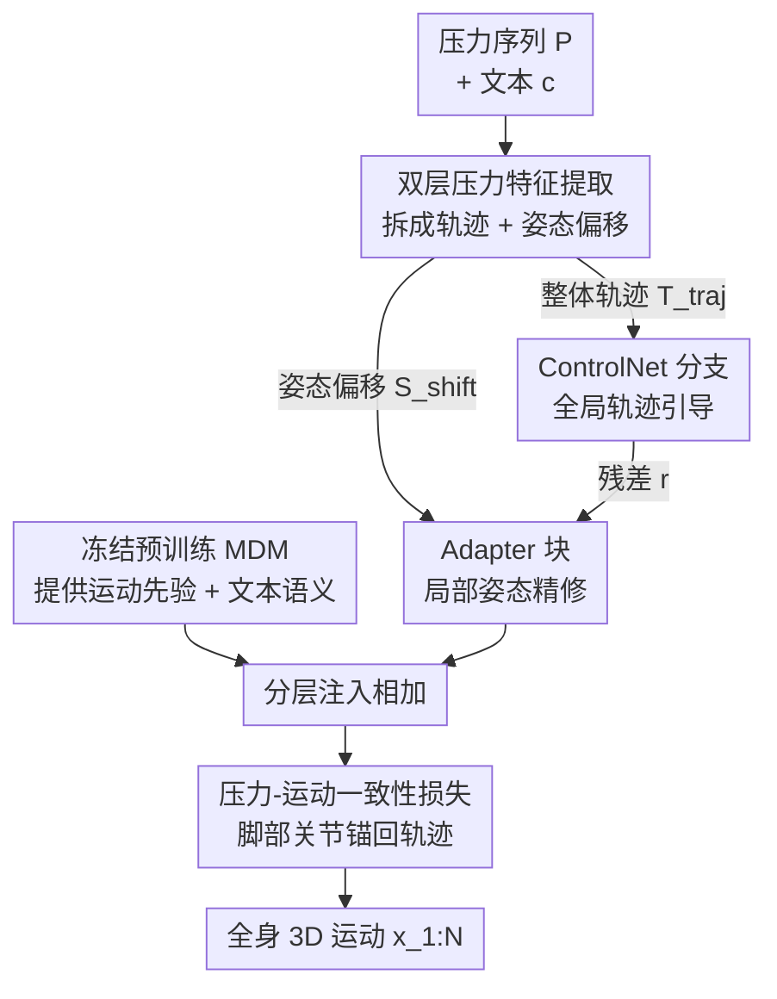

# Pressure2Motion: Hierarchical Human Motion Reconstruction from Ground Pressure with Text Guidance

**会议**: CVPR 2026  
**论文**: [CVF Open Access](https://openaccess.thecvf.com/content/CVPR2026/html/Li_Pressure2Motion_Hierarchical_Human_Motion_Reconstruction_from_Ground_Pressure_with_Text_CVPR_2026_paper.html)  
**代码**: 无（论文称发表后公开）  
**领域**: 人体理解 / 动作捕捉 / 扩散模型  
**关键词**: 地面压力、动作重建、文本引导、分层扩散、ControlNet

## 一句话总结
用一张地面压力垫的压力序列 + 一句文本描述，无需相机和可穿戴设备就重建出全身 3D 人体运动；通过"压力双层特征 + 分层压力调制扩散"把稀疏含噪的压力信号注入预训练运动扩散模型，在自建的 MPL 基准上达到这一全新任务的 SOTA。

## 研究背景与动机

**领域现状**：传统动作捕捉（MoCap）要么靠光学/惯性系统的可穿戴设备，要么靠 RGB 相机做视觉重建。这些方案在隐私敏感（医疗、居家照护）、低光、低成本场景里都不好用——要么贵、要么侵入、要么暴露画面。地面压力垫是个有吸引力的替代品：它便宜、不拍画面、天然带有脚-地接触的物理信息。

**现有痛点**：已有的压力-姿态方法只在"大接触面"场景成功，比如预测躺在床上的人的静态姿势（接触面大、约束足）。一旦人站起来走动，压力信号变得极度稀疏（只有脚底那点接触），从它反推全身姿态是**严重欠定**的——同一组脚底压力可以对应无数种上半身姿态。另一边，文本到动作（text-to-motion）虽然成熟，但纯文本作为控制信号太不受约束，给不出精确的 MoCap；而 OmniControl、MaskControl 这类可控合成方法依赖**干净、人工指定、有直接几何对应**的输入（关键点轨迹），它们的架构压根没法处理压力这种"物理接地但含噪、且和全身姿态没有简单运动学映射"的间接信号。

**核心矛盾**：压力信号提供的是**物理约束**（哪只脚着地、力多大、重心在哪），但它和全身姿态之间没有一一对应；文本提供的是**语义意图**，但缺乏物理精度。两者单用都不够，关键是怎么把"低层物理"和"高层语义"在一个生成框架里**分层耦合**起来去消解歧义。

**本文目标**：(1) 形式化并解决"地面压力 + 文本 → 全身运动"这个新任务；(2) 设计能从稀疏压力里抽多层特征、并分层注入扩散先验的网络；(3) 把预训练 text-to-motion 模型适配到这个 MoCap 任务上；(4) 建立首个配对 (文本, 压力, 运动) 基准 MPL。

**切入角度**：作者把这个欠定重建问题当成"用生成先验去找最物理合理解"的问题——MDM（运动扩散模型）不是拿来"创作"，而是拿来"重建"，用它作为强先验，在所有可能动作里挑出既满足压力又满足文本的那个。

**核心 idea**：把压力解码成"整体移动轨迹 + 细粒度姿态偏移"两个层级的控制信号，分别用 ControlNet（全局）和 Adapter（局部）注入冻结的预训练 MDM，再加一个压力-运动一致性损失强制脚部对齐。

## 方法详解

### 整体框架

输入是 N 帧地面压力图序列 $P=\{p_i\}_{i=1}^N$（每帧 $p_i\in\mathbb{R}^{H\times W}$）和一句文本描述 $c$，输出是时序连贯、物理合理的全身运动序列 $x_{1:N}$（采用 HumanML3D 表示：盆骨速度、关节局部位置/速度/旋转、二值脚接触）。整条管线分三步走：先用**双层压力特征提取**把压力序列拆成"整体移动轨迹 $T_{traj}$"和"压力诱导姿态偏移 $S_{shift}$"两路；再用**分层压力调制运动合成器**——一个 ControlNet 吃轨迹做全局引导、并行的 Adapter 块吃姿态偏移做局部精修——把这两路控制注入预训练 MDM；最后用**压力-运动一致性损失**把重建运动的脚部关节锚回压力推断的轨迹上。

### 关键设计

**1. 双层压力特征提取：把一坨压力图拆成"去哪"和"怎么动"两个层级**

直接拿原始压力图喂网络，模型既要学整体怎么走、又要学局部姿态怎么变，两个尺度纠缠在一起很难学好。作者的洞察是压力信号天然含两类信息：**整体移动轨迹**（身体往哪走、整体朝向）和**细粒度姿态偏移**（重心移动、平衡转换、细微姿态调整），于是用两个独立分支分别建模。轨迹分支 $F_{traj}$ 沿用 MotionPRO 的 ResNet+GRU 架构处理压力序列，经全连接层得到紧凑嵌入 $T_{traj}=F_{traj}(P)$；这个模块在多样压力-运动对上单独预训练，训合成器时**冻结**，保证轨迹估计稳定。姿态偏移分支 $F_{shift}$ 则同时吃原始压力图 $P$、其时间差分 $\Delta P$、和网格位置编码 $e$，过多尺度卷积 + 全连接投影得到 $S_{shift}=F_{shift}(P,\Delta P,e)$；时间差分专门用来捕捉帧间细微变化，这个模块和合成器**端到端联合训练**。一冻一联合的设计让全局引导稳、局部细节又能跟着下游目标自适应。

**2. 分层压力调制运动合成器：ControlNet 管全局、Adapter 管局部，分层注入冻结 MDM**

如果把两路特征拼成一个向量、走单一分支注入（论文的 w/o Hi 消融），全局和局部信号会互相干扰，效果显著变差。作者把它拆成"高层管全局、低层管局部"的分层结构。ControlNet $F_{Ctrl}$ 是预训练 MDM 的可训练副本，用原 backbone 参数初始化、每层加零初始化线性层 $Z$；轨迹嵌入 $T_{traj}$ 通过逐元素相加直接注入含噪运动 $x_t$，再过 ControlNet 产生残差特征 $r$：

$$x'_t = x_t + T_{traj}, \quad r = F_{Ctrl}(x'_t, t, c)$$

并行的 Adapter 块 $F_{Adapt}$ 接住 $r$，再融入姿态偏移 $S_{shift}$ 和文本嵌入 $c$ 做局部精修——每个 Adapter 块由自注意力 + 交叉注意力 + 前馈网络组成。冻结的 MDM 主干 $F_\theta$ 负责输出语义对齐文本的运动先验，最终干净运动由先验 + 控制残差相加得到：

$$\hat{x}'_0 = F_\theta(x_t,t,c) + r', \quad r' = F_{Adapt}(Z(r), S_{shift}, c)$$

这样 ControlNet 先把运动拉到正确的整体路径上，Adapter 再在此基础上补细微姿态——分层而非平铺，是消歧的关键。

**3. 压力-运动一致性损失：强制脚部关节对齐压力推断的接触轨迹**

光靠扩散损失，重建运动可能整体像样但脚和压力对不上（脚滑、悬空）。压力主要反映脚-地接触和整体轨迹，于是作者只对 5 个关键关节——盆骨根、左/右踝、左/右脚——施加一致性约束，把重建运动这些关节的全局位置 $R(\hat{x}'_0)$ 拉向压力推断轨迹 $E(T_{traj})$：

$$L_{cons}(T_{traj}, \hat{x}'_0) = \frac{\sum_n\sum_j \sigma_{nj}\odot\|E(T_{traj})-R(\hat{x}'_0)\|}{\sum_n\sum_j \sigma_{nj}}$$

其中 $\sigma_{nj}$ 是二值掩码，仅当关节 $j$ 是上述 5 个关键关节之一时为 1，否则为 0；$E(\cdot)$ 抽取控制关节位置，$R(\cdot)$ 把运动表示转成全局绝对关节位置。总损失为扩散损失与一致性损失的加权和 $L_{total}=\lambda_{diff}L_{diff}+\lambda_{cons}L_{cons}$。消融显示去掉它（w/o CL）CoP Error 从 0.426 涨到 0.532、Foot Skating 也变差，证明这条约束直接改善了物理对齐。

### 损失函数 / 训练策略
- 扩散损失 $L_{diff}=\mathbb{E}_{x_0,t}[\|x_0-\hat{x}_0\|_2^2]$（标准 MDM/DDPM 目标，预测干净运动 $\hat{x}_0$）。
- 一致性损失 $L_{cons}$（式 7），与扩散损失加权求和。
- 轨迹提取模块 $F_{traj}$ 单独预训练后冻结；姿态偏移模块 $F_{shift}$ + 合成器端到端联合训练；MDM 主干保持冻结、只训 ControlNet 副本和 Adapter。
- 数据增强：随机空间平移和旋转，提升泛化。MPL 按 80%/15%/5% 划分训练/验证/测试。

## 实验关键数据

数据来自自建 **MPL 数据集**（基于 MotionPRO 扩展）：25 个不同身材受试者、20,944 条动作序列、约 230 万帧、400 类动作、每条序列 5 级递减详细度的文本描述（共 104,720 条，用 Qwen2.5-VL 标注），重采样到 20 FPS。评测沿用 OmniControl 协议，并新引入 MPJPE、Lower-body MPJPE（LMPJPE）两个对齐指标，以及自定义的 **CoP Error**（Center of Pressure Error）——测量输入压力图算出的压力中心与重建下肢关节反推出的压力中心之间的平均 L2 距离，越低说明与输入压力的物理对齐越好。

### 主实验

| 方法 | FID ↓ | Foot Skating ↓ | CoP Error ↓ | LMPJPE ↓ | MPJPE ↓ | R-precision Top-3 ↑ |
|------|-------|----------------|-------------|----------|---------|---------------------|
| MDM | 4.819 | 0.1029 | 0.9238 | 0.2550 | 0.2996 | 0.458 |
| MotionDiffuse | 3.812 | 0.1138 | 0.8765 | 0.2305 | 0.2884 | 0.486 |
| OmniControl | 0.315 | 0.0629 | 0.5862 | 0.1362 | 0.1719 | 0.523 |
| MaskControl | 0.388 | 0.0617 | 0.5644 | 0.1335 | 0.1695 | 0.534 |
| Text-Only | 0.872 | 0.1560 | 1.0810 | 0.2320 | 0.2838 | 0.2866 |
| Regression | 40.015 | 0.7338 | 1.4832 | 0.4322 | 0.4896 | 0.127 |
| **Ours** | **0.262** | **0.0553** | **0.4260** | **0.1273** | **0.1622** | **0.545** |

本文在重建精度（MPJPE/LMPJPE）、真实感（FID/Foot Skating）、语义对齐（R-precision）全面领先；CoP Error 从次优的 0.564 大幅降到 0.426，证明分层模型独特地学会了把运动对齐到物理输入。Text-Only（屏蔽压力分支）的物理指标（CoP Error 1.081、Foot Skating 0.156）直接崩盘，反证压力分支不可或缺；Regression（扩散退化成单步）几乎全面失败（FID 40），验证了"欠定问题需要生成先验"的核心假设。

### 消融实验

| 配置 | FID ↓ | FS ↓ | CoP Err ↓ | LMPJPE ↓ | MPJPE ↓ | 说明 |
|------|-------|------|-----------|----------|---------|------|
| w/o MT | 0.543 | 0.0665 | 0.8840 | 0.1943 | 0.2357 | 去掉移动轨迹，CoP Error 暴涨 |
| w/o PS | 0.847 | 0.0629 | 0.5864 | 0.1555 | 0.2025 | 去掉姿态偏移，FID 最差 |
| w/o CL | 0.282 | 0.0721 | 0.5320 | 0.1550 | 0.1896 | 去掉一致性损失，脚滑+物理对齐变差 |
| w/o Hi | 0.345 | 0.0615 | 0.5610 | 0.1311 | 0.1692 | 拼成单分支，整体显著退化 |
| Full | **0.262** | **0.0553** | **0.4260** | **0.1273** | **0.1622** | 完整模型 |

### 关键发现
- **移动轨迹（MT）对物理对齐贡献最大**：去掉它 CoP Error 从 0.426 飙到 0.884（几乎翻倍），说明全局轨迹是把运动锚在压力上的主力。
- **姿态偏移（PS）对真实感贡献最大**：去掉它 FID 从 0.262 涨到 0.847（最差的一档），细粒度局部信号决定动作看起来真不真。
- **分层注入 vs 平铺拼接**：w/o Hi 把两路特征拼成单一表示走单分支，各项都明显变差，证明"高层轨迹 + 低层姿态分开、分层注入"是准确重建的关键，而非简单堆特征。
- **文本主要影响上半身**：消融文本输入发现，文本对上半身动作影响明显，下半身则紧贴压力数据——两种模态各管各的、互补而不冲突。
- 模型在走廊等非受控、OOD 真实环境也能保持高保真和物理真实感，展示了非视觉动作感知在居家/临床/公共空间的落地潜力。

## 亮点与洞察
- **把"欠定重建"重新框定为"生成先验下找最合理解"**：不把 MDM 当创作工具而当重建先验，这个视角让稀疏压力 → 全身运动的病态问题变得可解，Regression baseline 的崩溃（FID 40）有力佐证了这一点。
- **压力的"双层分解"是核心巧思**：把同一组压力图拆成"整体轨迹（稳、冻结、ControlNet 注入）"和"姿态偏移（细、联合训练、Adapter 注入）"，一冻一活、一全局一局部，正好对上 ControlNet/Adapter 的分工，可迁移到任何"含噪间接信号 → 结构化输出"的控制任务。
- **CoP Error 这个自定义指标很到位**：现有动作指标测不出"重建运动和输入压力到底对不对得上"，作者用压力中心的 L2 距离直接量化物理一致性，给这个新任务补上了关键的评测维度。
- **压力作为隐私友好的密集物理控制信号**：相比轨迹/关键点这类运动学抽象，压力直接测量每帧的真实接触、力分布、压力中心动态，天然保证物理合理性——这是对可控运动合成"控制模态"的一次有价值拓展。

## 局限与展望
- **依赖配对的 (压力, 运动, 文本) 训练数据**：MPL 虽大但建立在 MotionPRO 的传感器采集上，扩展到新场景/新动作类别仍需重新采集多模态数据，成本不低。
- **无脚-地接触的动作是软肋**：跳跃等腾空动作几乎没有压力信号，作者把这类"复杂 case"放到补充材料讨论，正文未给定量结果，说明这是当前框架的边界。
- **文本对下半身约束弱**：实验显示文本主要影响上半身，下半身几乎完全由压力决定——当压力本身歧义大时（如对称站姿），上半身细节可能更多靠先验"猜"而非真正重建。
- **可改进方向**：引入更细的足底压力分辨率或多模态轻量补充（如单 IMU）来覆盖腾空/低接触动作；或探索无需配对监督的自/弱监督适配，降低新场景部署成本。

## 相关工作与启发
- **vs 压力姿态估计（PIMesh / BodyPressure / MotionPRO）**：早期方法局限于床上等大接触面静态姿势，PIMesh 扩到短压力序列但搞不定走路这类动态；MotionPRO 虽大但把压力当辅助信号、低估其物理语义。本文首次把压力当**主控制信号**并联合文本，专攻站立动态动作。
- **vs 可控运动合成（OmniControl / MaskControl / Sketch2Anim）**：它们都基于 ControlNet 用关键点/轨迹这类**有直接几何对应**的干净信号控制；本文要处理的是稀疏、含噪、无运动学映射的物理信号，架构上用"双层特征 + 分层 ControlNet/Adapter"专门适配，在同样的协议下 CoP Error 等物理指标明显更优。
- **vs 纯 text-to-motion（MDM / MotionDiffuse）**：纯文本太不受约束，给不出 MoCap 精度（MDM/MotionDiffuse 的 FID、CoP Error 都很差）；本文在其上叠压力分支，把语义意图和物理约束分层耦合。

## 评分
- 新颖性: ⭐⭐⭐⭐⭐ 首次形式化"压力+文本→全身运动"任务，双层压力分解 + 分层注入 + 新基准 MPL，开辟非视觉隐私 MoCap 新范式
- 实验充分度: ⭐⭐⭐⭐ 主结果含 6 个 baseline、消融覆盖 4 个组件、文本影响和 OOD 都有验证；腾空/低接触动作只在补充材料定性讨论略可惜
- 写作质量: ⭐⭐⭐⭐⭐ 动机推导清晰、pipeline 图文对照、CoP Error 等指标定义明确
- 价值: ⭐⭐⭐⭐⭐ 隐私敏感/低光/低成本场景的落地价值高，双层分解思路可迁移到其他含噪间接信号的控制生成任务

<!-- RELATED:START -->

## 相关论文

- [\[CVPR 2026\] Ground Reaction Inertial Poser: Physics-based Human Motion Capture from Sparse IMUs and Insole Pressure Sensors](ground_reaction_inertial_poser_physics-based_human_motion_capture_from_sparse_im.md)
- [\[CVPR 2026\] ParTY: Part-Guidance for Expressive Text-to-Motion Synthesis](party_part-guidance_for_expressive_text-to-motion_synthesis.md)
- [\[CVPR 2026\] MotionHiFlow: Text-to-Motion via Hierarchical Flow Matching](motionhiflow_text-to-motion_via_hierarchical_flow_matching.md)
- [\[CVPR 2026\] Hierarchical Enhancement of Semantic Priors for Disentangled Text-Driven Motion Generation](hierarchical_enhancement_of_semantic_priors_for_disentangled_text-driven_motion_.md)
- [\[CVPR 2026\] MoLingo: Motion-Language Alignment for Text-to-Human Motion Generation](molingo_motion-language_alignment_for_text-to-motion_generation.md)

<!-- RELATED:END -->
