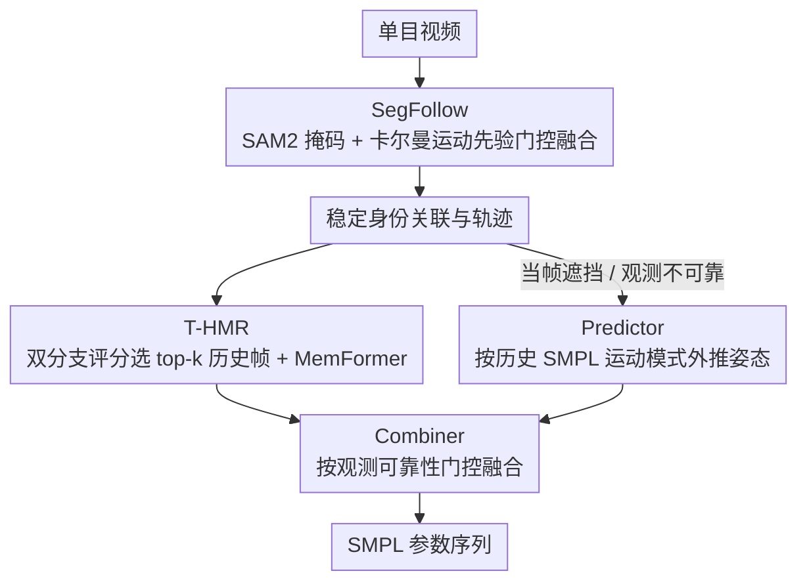

# RAM: Recover Any 3D Human Motion in-the-Wild

**会议**: CVPR 2026  
**arXiv**: [2603.19929](https://arxiv.org/abs/2603.19929)  
**代码**: 无  
**领域**: 人体理解 / 3D 人体运动恢复  
**关键词**: 多人3D运动恢复, 零样本跟踪, SAM2, 时序人体网格恢复, 运动预测

## 一句话总结

RAM 提出统一的多人 3D 运动恢复框架，集成运动感知语义跟踪器 SegFollow（基于 SAM2 + 自适应卡尔曼滤波）、记忆增强的时序人体网格恢复模块 T-HMR、轻量运动预测器和门控组合器，在 PoseTrack 和 3DPW 等基准上实现零样本跟踪稳定性和 3D 精度的 SOTA，且推理速度比之前方法快 2-3 倍。

## 研究背景与动机

1. **领域现状**：单目视频多人 3D 运动恢复是活跃的研究方向，代表方法有 4DHuman（HMR2.0 + PHALP 跟踪）和 CoMotion（端到端联合优化）。
2. **现有痛点**：(1) 现有跟踪方法依赖 2D 外观特征和匈牙利匹配，对快速运动、严重遮挡和视角变化敏感，频繁出现 ID 切换；(2) 一旦身份连续性断裂，3D 运动序列变得不一致；(3) 目标被遮挡或快速运动时，缺乏基于记忆的运动先验导致重建不连续。
3. **核心矛盾**：不稳定的跟踪触发冗余检测和重复初始化，既降低重建精度又阻碍实时性能。
4. **本文目标**：构建实时、鲁棒的多人 3D 运动恢复系统。
5. **切入角度**：将 SAM2 的强分割能力与运动先验结合，用卡尔曼滤波提供运动感知的身份关联。
6. **核心 idea**：SegFollow 提供稳定跟踪 → T-HMR 利用时序记忆提升重建一致性 → Predictor 预测遮挡期间的姿态 → Combiner 融合重建和预测。

## 方法详解

### 整体框架

RAM 要解决的核心痛点是：现有多人 3D 运动恢复把"谁是谁"（跟踪）和"长什么姿势"（重建）当成两件互相拖累的事——跟踪一旦丢了 ID，重建出来的 3D 序列就跟着断；而重建又反过来触发重新检测、重新初始化，拖慢速度。RAM 的思路是让四个组件接力把这条链路打通：SegFollow 先在每帧给出稳定的身份关联，T-HMR 拿着稳定的轨迹去重建带时序一致性的 3D 网格，遇到遮挡时 Predictor 用历史运动外推姿态填补空白，最后 Combiner 根据当帧观测是否可靠，在"信重建"和"信预测"之间门控融合，输出最终的 SMPL 参数。整条链路无需重训练即可零样本运行。

### 关键设计

**1. SegFollow：把卡尔曼运动先验缝进 SAM2 的记忆里，让跟踪在遮挡和快速运动下不丢 ID**

SAM2 本身分割能力很强，但它的记忆是先进先出（FIFO）的，并不对"这一帧的关联到底可不可信"建模——遮挡或快速运动一来，噪声就顺着 FIFO 不断累积，ID 切换随之发生。SegFollow 在 SAM2 上补两块东西来堵住这个漏洞。第一块是运动引导选择器：用卡尔曼滤波预测每个目标下一帧的边界框，算出 IoU 形式的运动一致性分数 $s_{\text{kf}}$，再和 SAM2 给出的掩码亲和度 $s_{\text{mask}}$ 做门控融合，

$$s_{\text{fused}} = \alpha\, s_{\text{mask}} + (1-\alpha)\, s_{\text{kf}}$$

这样"长得像"和"动得像"两路证据一起决定关联，单靠外观容易被相似行人骗到的情况就被运动先验拉回来。第二块是时序缓冲区：把 SAM2 原本的 FIFO 记忆更新换成指数滑动平均，且衰减因子由卡尔曼一致性分数自适应调节——关联越可靠，新观测写入记忆的权重越大；关联可疑时则压低写入，避免污染。在这之上还加了置信度门控更新：只有当一个目标连续可靠关联累计到阈值 $\tau_{kf}$，才真正去更新它的卡尔曼状态，防止一次误关联就把运动模型带偏。

**2. T-HMR：用双分支评分挑出真正有用的历史帧，再把时序先验注入单帧重建**

单帧重建天然缺时序一致性，遮挡时尤其需要历史帧补先验，但"历史帧"不能不加挑选地全塞进来——无关帧反而是噪声。T-HMR 因此设计了记忆缓存（Memory Cache）和 MemFormer 两段。Memory Cache 从相邻 $L$ 帧的 ViT 特征里用双分支注意力评分选出 top-k 最相关的帧：一个分支算当前帧和每个候选记忆帧的相关性（这帧像不像现在），另一个分支评估候选记忆帧彼此之间的内部一致性（这帧靠不靠谱、是不是孤立的异常帧）。两个分支缺一不可——只看相关性会把一个本身就重建错的相似帧选进来，只看一致性又可能选到跟当前无关的稳定帧。挑出的时序先验交给 MemFormer，由它在重建过程中把这些历史信息融进当前帧的特征，输出更连贯的网格。

**3. Predictor + Combiner：遮挡时用预测顶上，遮挡结束再自适应切回重建**

当目标被遮挡、当帧观测不可靠时，硬靠重建只会得到抖动甚至错乱的结果。Predictor 负责在这种空窗期接管：它基于该目标历史 SMPL 参数里的运动模式做一次轻量外推，预测出当前应有的姿态，保证运动序列在视觉证据缺失时仍然连续。但预测不能一直信下去——遮挡一结束，重建重新可靠，就该切回重建。这个切换交给 Combiner：它是一个可学习的门控，根据当帧观测的可靠性自适应地决定信重建还是信预测，从而在"遮挡期靠预测续上、复现期靠重建纠偏"之间平滑过渡，而不是生硬地二选一。

### 一个完整示例

设想一段街景里 B 从 A 身后穿过、把 A 短暂挡住几帧：

1. **遮挡前**：SegFollow 对 A、B 都给出高 $s_{\text{fused}}$（外观清晰、运动连续），卡尔曼状态正常更新，T-HMR 用最近若干帧的特征重建出干净的 3D 网格。
2. **A 被遮挡瞬间**：A 的掩码亲和度 $s_{\text{mask}}$ 骤降，但卡尔曼预测的边界框仍在合理位置、$s_{\text{kf}}$ 撑住融合分数，SegFollow 不把 A 误判成新目标也不丢 ID；同时因为连续可靠关联中断，置信度门控暂停更新 A 的卡尔曼状态，避免被遮挡帧的噪声带偏。
3. **遮挡期间**：T-HMR 对 A 拿不到可靠当帧特征，Combiner 检测到观测不可靠、把门控偏向 Predictor，由它依 A 之前的运动模式外推姿态，A 的 3D 序列保持连续不断裂。
4. **A 重新出现**：$s_{\text{mask}}$ 回升、关联重新可靠，置信度门控恢复更新卡尔曼状态，Combiner 把门控切回重建，T-HMR 接管输出。整段过程中 A 的 ID 没变、3D 轨迹平滑——这正是 RAM 既稳又快（省掉重复检测/初始化）的来源。

### 损失函数 / 训练策略

T-HMR 使用 SMPL 参数回归损失（关节位置 + 姿态参数 + 形状参数）。Predictor 和 Combiner 端到端训练。

> ⚠️ 训练目标与超参细节以原文为准。

## 实验关键数据

### 主实验

| 数据集 | 指标 | 4DHuman | CoMotion | RAM | 提升 |
|--------|------|---------|---------|-----|------|
| PoseTrack | MOTA↑ | 68.2 | 71.5 | 76.3 | +4.8 |
| PoseTrack | IDF1↑ | 72.1 | 74.8 | 80.5 | +5.7 |
| 3DPW | MPJPE↓ | 78.5 | 72.3 | 65.8 | -6.5 |
| 3DPW | PA-MPJPE↓ | 49.2 | 45.1 | 41.3 | -3.8 |

RAM 在跟踪稳定性(MOTA/IDF1)和 3D 精度(MPJPE)上均大幅领先。

### 消融实验

| 配置 | MOTA (PoseTrack) | MPJPE (3DPW) | FPS | 说明 |
|------|-----------------|-------------|-----|------|
| Full RAM | 76.3 | 65.8 | 25+ | 完整模型 |
| w/o SegFollow (用 PHALP) | 71.1 | 70.2 | 15 | SegFollow 是核心 |
| w/o T-HMR 记忆 | 74.8 | 69.5 | 25+ | 时序记忆提升一致性 |
| w/o Predictor | 75.0 | 67.3 | 25+ | 预测器改善遮挡处理 |

### 关键发现

- SegFollow 贡献最大(MOTA +5.2)，说明稳定跟踪是多人运动恢复的瓶颈
- RAM 推理速度比 4DHuman 快 2-3 倍，因为稳定跟踪减少了冗余检测和重复初始化
- 在长视频真实场景中 ID 切换极少，首次实现稳定的零样本多人运动恢复
- T-HMR 的双分支评分比单分支更有效，相关性和一致性缺一不可

## 亮点与洞察

- **SAM2 + 卡尔曼滤波的结合**：将视觉基础模型的分割能力与经典运动建模结合，取长补短
- **置信度门控更新**：避免不可靠检测污染运动状态，是一个实用的工程设计
- **零样本长视频能力**：首个在长真实视频中无需重训练即保持稳定多人 3D 重建的方法

## 局限与展望

- 仍依赖检测器提供初始边界框
- 极端遮挡（完全不可见超过数十帧）时预测器可能漂移
- SMPL 模型限制了手部和面部细节的恢复
- 未来可扩展到手部/面部精细重建（SMPL-X）

## 相关工作与启发

- **vs 4DHuman**: 4DHuman 用 PHALP 跟踪，RAM 用 SegFollow 显著改善跟踪稳定性和速度
- **vs CoMotion**: CoMotion 端到端联合优化但速度慢，RAM 模块化设计更快更灵活
- **vs SAM2**: SAM2 的 FIFO 记忆在 MOT 场景下不够鲁棒，SegFollow 引入运动先验修补了此缺陷

## 评分

- 新颖性: ⭐⭐⭐⭐ 整体框架是已有组件的巧妙集成
- 实验充分度: ⭐⭐⭐⭐ 多基准评测，消融充分
- 写作质量: ⭐⭐⭐⭐ 结构清晰，方法描述详细
- 价值: ⭐⭐⭐⭐⭐ 解决了多人 3D 运动恢复的实际瓶颈问题

<!-- RELATED:START -->

## 相关论文

- [\[CVPR 2026\] Gaussian-Mixture Latent Flow for Stochastic 3D Human Motion Prediction](gaussian-mixture_latent_flow_for_stochastic_3d_human_motion_prediction.md)
- [\[CVPR 2026\] SceMoS: Scene-Aware 3D Human Motion Synthesis by Planning with Geometry-Grounded Tokens](scemos_scene-aware_3d_human_motion_synthesis_by_planning_with_geometry-grounded_.md)
- [\[CVPR 2026\] Superman: Unifying Skeleton and Vision for Human Motion Perception and Generation](superman_unifying_skeleton_and_vision_for_human_motion_perception_and_generation.md)
- [\[CVPR 2025\] WildAvatar: Learning In-the-Wild 3D Avatars from the Web](../../CVPR2025/human_understanding/wildavatar_learning_in-the-wild_3d_avatars_from_the_web.md)
- [\[CVPR 2026\] Progressive Guessing to Fixed Point: Rethinking Human Motion Prediction with Deep Equilibrium Models](progressive_guessing_to_fixed_point_rethinking_human_motion_prediction_with_deep.md)

<!-- RELATED:END -->
