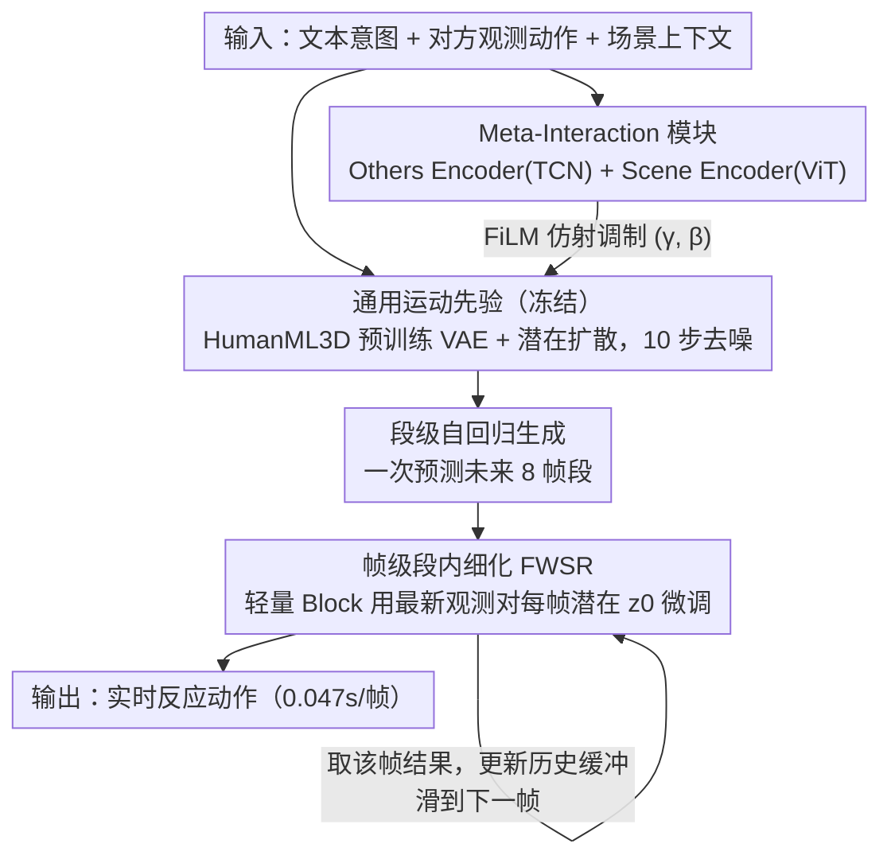

# ReMoGen: Real-time Human Interaction-to-Reaction Generation via Modular Learning from Diverse Data

**会议**: CVPR 2026  
**arXiv**: [2604.01082](https://arxiv.org/abs/2604.01082)  
**代码**: 无  
**领域**: 人体运动生成 / 人体理解 / 交互动作生成  
**关键词**: 交互反应生成, 模块化学习, 运动先验, 实时生成, 人人/人场景交互

## 一句话总结

提出 ReMoGen，一个模块化框架用于实时人体交互-到-反应的动作生成：利用大规模单人运动数据学习通用运动先验（冻结），通过独立训练的 Meta-Interaction 模块适配不同交互域（人-人/人-场景），并引入 Frame-wise Segment Refinement 实现逐帧低延迟在线更新（0.047s/帧），在 Inter-X 和 LINGO 数据集上全面超越 SOTA。

## 研究背景与动机

1. **领域现状**：人体动作生成已从文本驱动单人动作发展到多智能体交互场景。现有方法包括：文本到动作（T2M、MotionDiffuse）只生成孤立动作；人-场景交互（TRUMANS、LINGO）引入空间感知但限于单人；人-人交互（ReGenNet、FreeMotion）尝试联合生成但多为离线模式。
2. **现有痛点**：
    - **数据稀缺且异构**：单人运动数据丰富（HumanML3D），但人-人交互（Inter-X）和人-场景交互（LINGO）数据稀少且分布差异大，端到端训练在单一域上过拟合
    - **实时响应性**：扩散模型质量高但延迟大无法实时；自回归模型速度快但误差累积导致漂移
    - 现有方法大多假设完全观测到对方的完整轨迹，在实际在线交互中不可行
3. **核心矛盾**：如何在数据稀缺条件下同时实现高保真度和低延迟的交互反应生成
4. **本文目标**：(1) 跨异构交互域的高效知识迁移；(2) 在不牺牲动作质量的前提下实现实时响应
5. **切入角度**：将通用运动先验学习与交互特定适配解耦——冻结在大量单人数据上预训练的 backbone，通过轻量模块注入交互感知
6. **核心 idea**：先验引导的模块化学习 + 帧级段内细化，前者解决数据异构性，后者解决实时性

## 方法详解

### 整体框架

输入为文本意图、其他智能体的观测动作和场景上下文。ReMoGen 包含三个组件：(1) 冻结的文本条件单人运动先验（在 HumanML3D 上预训练的 VAE + 潜在扩散模型）；(2) Meta-Interaction 模块（分别为 HHI 和 HSI 独立训练的适配器）；(3) 帧级段内细化（Frame-wise Segment Refinement，FWSR，轻量逐帧修正模块）。生成方式为段级自回归：在历史窗口 $M_h^i \in \mathbb{R}^{H \times D}$ 和文本 $W$ 条件下预测未来段 $\hat{M}_f^i \in \mathbb{R}^{F \times D}$（H=2帧历史，F=8帧未来）。

### 关键设计

**1. 通用运动先验：冻结大规模单人数据学到的运动底座，别让交互训练把它毁了**

交互数据（Inter-X 的人-人、LINGO 的人-场景）又少又分布各异，如果端到端在单一域上训练，模型很快就在那个小域上过拟合、丢掉通用的运动学常识。ReMoGen 的对策是先在海量单人数据 HumanML3D 上把一个强先验训出来再冻住：沿用 DART 架构，用 Transformer VAE 把一个动作段压成潜在表示 $z$，再让条件扩散去噪器 $G_\psi$ 在文本嵌入 $w$ 和历史窗口条件下迭代去噪、解码回动作（10 步扩散，10 FPS）：

$$\hat{z}_0 = G_\psi(z_t, t, M_h^i, w)$$

冻结这一点是整篇方法的支点——消融里把先验一起联合微调（Joint-Finetune）反而把 FID 从 0.181 拖到 0.298，说明交互训练会侵蚀预训练学到的运动学知识，宁可不动它、只在外面加东西。

**2. Meta-Interaction 模块：把"对方在做什么、场景长什么样"注入冻结的先验**

先验本身只会生成单人动作，对交互一无所知，所以需要一条旁路把交互线索喂进去而不改先验参数。模块用两个独立编码器分头读交互上下文：Others Encoder（TCN）从对方轨迹里提相对速度、接近方向和空间关系，Scene Encoder（ViT）总结周围几何与可用的功能空间。注入发生在 Meta-Interaction Block 里——先对 ego 特征做 self-attention 得到 $h'$，再让它对交互线索做 cross-attention 抽出交互信号，最后把信号转成 FiLM 式的仿射参数 $(\gamma, \beta)$ 去调制特征：

$$h_{mod} = (1 + \tanh\gamma) \odot h' + \tanh\beta$$

这种"只做特征级仿射、不碰原模型权重"的注入方式，让每个域的模块可以各自独立训练（HHI 在 Inter-X、HSI 在 LINGO，各 65k 迭代），绕开了异构数据放一起联合训练的难题；推理时再用 $\Delta_{total} = \sum_i \alpha_i \Delta_i$（带 L2-norm clamp）把多个模块的效果加权混合，于是同一框架天然能处理混合交互场景。

**3. 帧级段内细化（FWSR）：在段级生成之上再叠一层逐帧微调，把延迟压到实时**

段级自回归有个固有的延迟-质量取舍：一次预测的段越长动力学越稳但响应越慢，段越短反应越快却容易抖动。FWSR 的做法是保留段级生成的长段质量，但在段内的每一帧再用一个轻量版 Meta-Interaction Block 对该段的初始潜在 $z_0$ 做一次微调，把刚观测到的最新交互线索结合进来：

$$\hat{z}^f = \text{Modulate}(z_0, \text{concat}(M_h^{(f-1)}, X_{dyn}^{(f)}))$$

每帧只取对应位置的预测结果、更新历史缓冲后再处理下一帧。这样大 backbone 负责稳定的长期动力学，轻量适配器负责快速的细粒度反应，分工明确；FWSR 训练时把先验和 Meta-Interaction 都冻住，保证它只做局部修正、不会反过来扰动已经学好的全局运动结构。

### 一个完整示例：在线生成第 f 帧反应

设两人正在交互，ego 角色要根据对方的实时动作做出反应。系统先按段级自回归走主干：在 H=2 帧历史 $M_h^i$ 和文本意图 $W$ 条件下，冻结的运动先验经 10 步扩散预测出未来 F=8 帧的段 $\hat{M}_f^i$，Meta-Interaction 模块在这一步通过 FiLM 调制把"对方靠近的方向/速度"注入进来——于是先验生成的不再是凭空的单人动作，而是带着交互倾向的反应段。

接着到了实时细化：当真正播放到段内第 f 帧时，对方又往前走了一点，新的观测 $X_{dyn}^{(f)}$ 到手。FWSR 不重跑整段扩散，只用轻量 Block 对初始潜在 $z_0$ 做一次 $\hat{z}^f = \text{Modulate}(z_0, \text{concat}(M_h^{(f-1)}, X_{dyn}^{(f)}))$，取出第 f 帧的细化结果、写回历史缓冲，再滑到第 f+1 帧。整条链路单帧只花 0.047s（远低于 0.1s 实时阈值），却把 FID 从纯段级的 0.181 降到 0.166——既享受了大 backbone 的长期稳定，又拿到了逐帧观测带来的响应性。

### 损失函数 / 训练策略

- 分阶段训练：先验在 HumanML3D 上预训练 → Meta-Interaction 模块各自独立训练 65k 迭代（冻结先验） → FWSR 再训练 65k 步（冻结先验和 Meta-Interaction）
- 训练目标：重建损失 $L_{rec}$、潜在空间损失 $L_{latent}$、辅助时间增量损失 $L_{aux}$
- 优化器：AdamW (lr=1e-4)，batch size 1024，梯度裁剪 1.0，EMA 0.999
- 单卡 NVIDIA RTX 3090 即可训练

## 实验关键数据

### 主实验

**人-人交互 (Inter-X)**

| 方法 | FID ↓ | R-Prec.(Top3) ↑ | MM Dist. ↓ | Latency (s/frame) ↓ |
|------|-------|-----------------|-----------|---------------------|
| ReGenNet | 11.622 | 0.269 | 6.092 | 0.210 |
| FreeMotion | 3.383 | 0.284 | 5.438 | 0.221 |
| SymBridge | 2.569 | 0.355 | 4.955 | 0.040 |
| **Ours** | **0.181** | **0.464** | **4.076** | 0.042 |
| **Ours+FWSR** | **0.166** | 0.462 | **4.076** | 0.047 |

**人-场景交互 (LINGO)**

| 方法 | FID ↓ | R-Prec.(Top3) ↑ | MM Dist. ↓ | Latency ↓ |
|------|-------|-----------------|-----------|-----------|
| TRUMANS | 4.731 | 0.178 | 10.822 | 0.074 |
| LINGO | 3.633 | 0.218 | 9.597 | 0.189 |
| **Ours** | **1.201** | **0.530** | **3.408** | **0.042** |

### 消融实验

**运动先验使用方式消融 (Inter-X)**

| 配置 | FID ↓ | R-Prec. ↑ | MM Dist. ↓ |
|------|-------|-----------|-----------|
| 仅先验 (Prior Only) | 3.735 | 0.231 | 5.736 |
| 从零训练 (No Prior) | 0.270 | 0.412 | 4.385 |
| 联合微调 (Joint-Finetune) | 0.298 | 0.439 | 4.188 |
| **本方法 (冻结先验+模块)** | **0.181** | **0.464** | **4.076** |

**FWSR 消融**

| 配置 | FID ↓ | Latency ↓ |
|------|-------|-----------|
| 段级自回归 (Seg.) | 0.181 | 0.042 |
| 逐帧滑动 (Slide) | 4.136 | 0.305 |
| **段级 + FWSR** | **0.166** | 0.047 |

### 关键发现

- **冻结先验 + 模块化适配远优于联合微调**：FID 0.181 vs 0.298，联合微调会侵蚀预训练的运动学知识
- **FWSR 以极低的额外延迟（0.042→0.047）换取了显著的质量提升**（FID 0.181→0.166）
- **零样本组合泛化**：在 EgoBody 上直接组合 HHI 和 HSI 模块（$\alpha_{HHI}=\alpha_{HSI}=0.5$），虽然不如微调但已优于零样本单模块
- **用先验初始化后仅 2k-10k 步微调就超过从零训练 500k 步**（EgoBody），证明先验迁移的强大效率
- 实时阈值 0.1s/帧轻松满足（0.042-0.047s/帧），ReGenNet 和 FreeMotion 均不达标

## 亮点与洞察

- **模块化解耦的设计哲学非常优雅**：先验提供基础运动能力，Meta-Interaction 提供交互感知，FWSR 提供实时响应性，三者正交可分别优化。这种设计可以迁移到任何需要在数据稀缺条件下适配的生成任务。
- **FiLM 调制的 Meta-Interaction Block** 为运动生成领域的 adapter 设计提供了良好范式——不修改原模型参数，仅通过特征级仿射变换注入条件信号。
- **组合推理**（多模块加权混合）的设计让框架天然支持混合交互场景，无需重新训练。

## 局限与展望

- 目前仅支持两人交互和简单场景交互，未涉及多人群体交互
- Meta-Interaction 模块的组合权重 $\alpha_i$ 需要手动设定，可以探索自适应学习
- 场景编码用体素化 3D 占据表示，对精细物体交互（如操作桌上物品）可能不够精确
- 未处理手部精细交互（如握手、递物品）
- FWSR 的逐帧修正可能在剧烈动作变化时反应不足

## 相关工作与启发

- **vs SymBridge**: 同为实时交互方法，SymBridge 专注人-机器人交互但 FID 较高（2.569 vs 0.181），ReMoGen 通过更强的运动先验大幅提升质量
- **vs FreeMotion**: FreeMotion 的非实时版本（offline）FID 仅 0.492，但延迟不可接受；ReMoGen 在实时条件下达到更优 FID（0.166）
- **vs ControlNet/LoRA 范式**: ReMoGen 将图像生成中的 adapter 设计模式成功迁移到运动生成，FiLM 调制替代了 ControlNet 的加法注入

## 评分

- 新颖性: ⭐⭐⭐⭐ 先验冻结+模块适配+帧级细化的三层设计清晰创新，但单个组件（FiLM、段级自回归）是已有技术
- 实验充分度: ⭐⭐⭐⭐⭐ HHI/HSI/混合三场景、详细消融（先验使用方式、FWSR效果）、EgoBody 迁移实验全面
- 写作质量: ⭐⭐⭐⭐ 问题定义清晰，四个研究问题的设置很好地组织了实验
- 价值: ⭐⭐⭐⭐ 实时交互反应生成是一个重要但被忽视的问题，本框架提供了可扩展的解决方案

<!-- RELATED:START -->

## 相关论文

- [\[CVPR 2026\] Real-Time Multimodal Fingertip Contact Detection via Depth and Motion Fusion for Vision-Based Human-Computer Interaction](real-time_multimodal_fingertip_contact_detection_via_depth_and_motion_fusion_for.md)
- [\[CVPR 2026\] PolySLGen: Online Multimodal Speaking-Listening Reaction Generation in Polyadic Interaction](polyslgen_online_multimodal_speaking-listening_reaction_generation_in_polyadic_i.md)
- [\[CVPR 2026\] Avatar Forcing: Real-Time Interactive Head Avatar Generation for Natural Conversation](avatar_forcing_real-time_interactive_head_avatar_generation_for_natural_conversa.md)
- [\[CVPR 2026\] MimicTalker: A Multimodal Interactive and Memory-Enhanced Framework for Real-Time Dyadic 3D Head Generation](mimictalker_a_multimodal_interactive_and_memory-enhanced_framework_for_real-time.md)
- [\[CVPR 2026\] Interact2Ar: Full-Body Human-Human Interaction Generation via Autoregressive Diffusion Models](interact2ar_full-body_human-human_interaction_generation_via_autoregressive_diff.md)

<!-- RELATED:END -->
