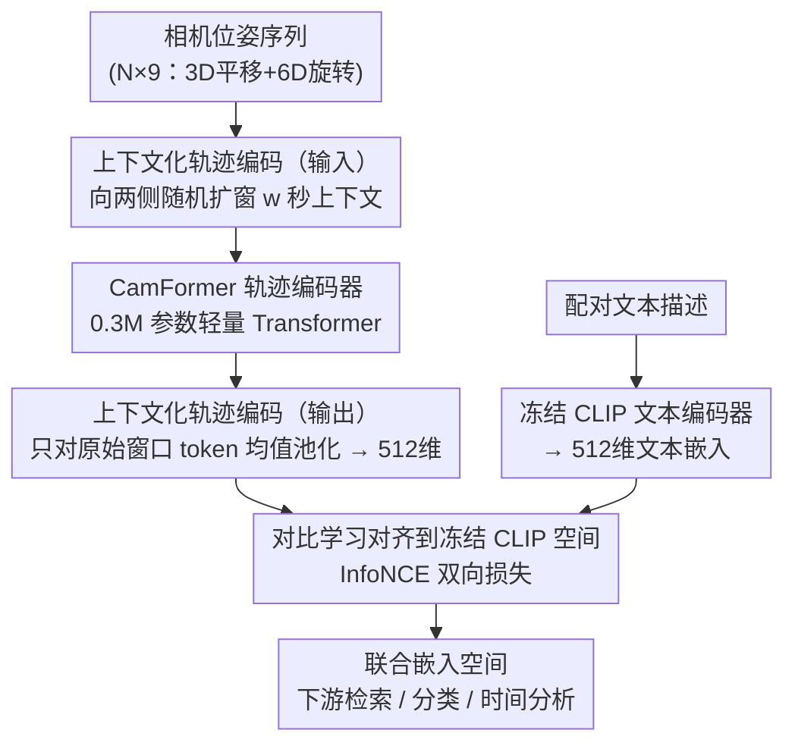

# Seeing without Pixels: Perception from Camera Trajectories

**会议**: CVPR 2026  
**arXiv**: [2511.21681](https://arxiv.org/abs/2511.21681)  
**代码**: [https://sites.google.com/view/seeing-without-pixels](https://sites.google.com/view/seeing-without-pixels)  
**领域**: 人体理解 / 多模态学习  
**关键词**: 相机轨迹、对比学习、视频感知、模态融合、动作理解

## 一句话总结

本文首次系统性地将相机位姿轨迹（6DoF pose sequence）提升为一种独立的视频感知模态，通过对比学习框架训练轻量级 Transformer 编码器 CamFormer，将相机轨迹映射到与文本对齐的联合嵌入空间，在 5 个数据集的 10 个下游任务上证明相机轨迹是既轻量又鲁棒的视频内容信号——在物理活动上甚至可以超越计算量大数千倍的视频模型。

## 研究背景与动机

1. **领域现状**：视频理解领域已经探索了大量模态——视觉、音频、IMU、热成像、深度、触觉——通过对比学习与文本对齐。但相机位姿轨迹（camera trajectory）始终被忽视为语义感知信号，仅被用于几何任务如 3D 重建和视觉里程计。
2. **现有痛点**：视觉编码器计算量极大（如 EgoVLPv2 约 89.5 GMACs），在视觉遮挡或不可见动作场景下表现受限。IMU 等传感器需要专用硬件且无法从已有视频回溯获取。
3. **核心矛盾**：相机轨迹是任何视频固有的属性，可以直接从视频估计，但一直被认为信息密度太低（每帧仅 9D 向量）、语义模糊，不足以理解视频内容。
4. **本文目标** 验证一个看似不可能的假设——仅从相机的运动轨迹（无任何像素信息）就能理解视频内容。
5. **切入角度**：人类感知是主动的——我们移动以观看，相机轨迹是拍摄者意图的物理指纹。篮球上篮伴随向上倾斜、搬轮胎伴随自上而下的横扫、走路伴随有节奏的前后摆动——这些都是语义的运动签名。
6. **核心 idea**：用对比学习将低维相机轨迹映射到文本语义空间，证明"你怎么动"确实能揭示"你在做什么"。

## 方法详解

### 整体框架

输入是视频片段对应的相机位姿序列 $\mathbf{p} \in \mathbb{R}^{N \times 9}$（3D 平移 + 6D 连续旋转表示，相对于序列中点），以及配对的文本描述（动作叙述或视频标题）。通过对比学习训练 CamFormer 编码器 $f$，使轨迹嵌入与冻结 CLIP 文本编码器 $g$ 的输出对齐。学到的嵌入可直接用于检索、分类、时间分析等多种下游任务。

### 关键设计

**1. CamFormer 轨迹编码器：用三个数量级更轻的模型吃下稀疏的位姿信号**

相机轨迹每帧只有 9 维（3D 平移 + 6D 连续旋转），信息密度远低于一帧 RGB 图像，所以这里的编码器不需要也不应该堆参数。CamFormer 是一个仅 0.3M 参数的轻量 Transformer（4 层、4 头、256 维 FFN、dropout 0.1）：9D 位姿序列先线性投影到 $d_{in}=128$ 维，加上位置编码后过 Transformer 块融合时序信息，再做时间均值池化，最后线性投影到 $d_{out}=512$ 维以匹配 CLIP 文本编码器的输出维度。整条前向只要 0.02 GMACs，比常用视频编码器（150M 参数、89.5 GMACs）轻了三个数量级——这正是"低维模态配小模型"的合理选择，也是本文敢声称"既轻又强"的底气。

**2. 上下文化轨迹编码：扩窗输入、只池目标窗，给短轨迹消歧义**

短窗口轨迹的语义天然模糊：一段 1 秒的"伸手"既可能是取杯子也可能是开门，单看这一秒的运动很难判断。直接把窗口拉长又会引入相邻无关动作，把目标表示稀释掉。本文的做法是把基础时间窗口 $[t_1, t_2]$ 向两侧随机扩展总共 $w$ 秒上下文（$w \sim \mathcal{U}(0, w_{max})$，$w_{max}=8s$），让整段扩展序列都进入 CamFormer，但最终嵌入**只对原始窗口的 $N$ 个输出 token 做均值池化**。这样目标窗口的局部表示通过自注意力吸收了前后文的全局信息（"伸手前在靠近橱柜"暗示开门），输出却不被相邻动作污染。这种"扩输入、窄输出"的写法是低信息密度模态的通用消歧技巧，可直接迁移到 IMU、音频等稀疏信号上。

**3. 对比学习对齐到冻结 CLIP 空间：让 CamFormer 只学"搬运"而非重建语义**

要让"你怎么动"对应上"你在做什么"，需要一个现成的语义参照系。本文不另起炉灶，而是借用冻结的 CLIP 文本编码器 $g$ 作为固定语义锚点，用经典 InfoNCE 双向对比损失把轨迹嵌入拉向对应文本：batch 内匹配的 (轨迹, 文本) 对为正样本、其余为负样本，损失为

$$\mathcal{L} = \mathcal{L}_{P \to T} + \mathcal{L}_{T \to P}$$

由于文本端完全冻结，CamFormer 不必从零学一套语义空间，只需学会把轨迹"搬运"到 CLIP 已经组织好的语义坐标上。这既复用了 CLIP 强大的文本表示，也让 0.3M 参数的小编码器有了明确而简单的优化目标。

### 损失函数 / 训练策略

训练损失为 InfoNCE 对比损失（含温度超参数 $\tau$），文本端完全冻结。第一人称域在 Ego-Exo4D (221.3h) 上预训练，第三人称域在 DynPose-100K (157.5h) 上预训练。位姿采样率 5-30Hz，视数据集而定。

## 实验关键数据

### 主实验

**第一人称文本检索（5-way MCQ，Ego-Exo4D）**

| 方法 | 模态 | GMACs | 参数量 | 物理活动 iv/oov | 程序活动 iv/oov | 整体 |
|------|------|-------|--------|----------------|----------------|------|
| CLIP | 图像 | 2.95 | 59M | 25.2/18.2 | 26.8/21.9 | 22.9 |
| EgoVLPv2 (Ego-Exo4D) | 视频 | 89.49 | 150.7M | 39.1/25.6 | 50.5/45.4 | 38.4 |
| CamFormer | 轨迹 | **0.02** | **0.3M** | **56.1/46.4** | 34.3/32.7 | 44.8 |
| CamFormer⋆ | 视频+轨迹 | 89.51 | 151M | 56.0/45.8 | **51.4/45.9** | **46.0** |

**活动分类准确率（Ego-Exo4D）**

| 活动 | CamFormer 准确率 |
|------|-----------------|
| 篮球 | >90% |
| 攀岩 | >90% |
| 烹饪 | 较低（程序性活动） |

### 消融实验

| 位姿来源 | 活动分类（从头） | 活动分类（预训练） | 提升 |
|---------|----------------|------------------|------|
| MegaSaM | 53.67 | 60.83 | +7.16 |
| ViPE | 60.83 | 66.15 | +5.32 |
| π³ | 61.47 | 66.15 | +4.68 |
| Aria (硬件) | 61.83 | 71.28 | +9.45 |

### 关键发现
- **物理活动 vs 程序活动**：CamFormer 在篮球、攀岩等大幅度身体运动活动上准确率 >90%，显著超越视频模型；但在烹饪、维修等精细程序活动上运动签名微弱，此时轨迹作为互补信号效果更佳
- **视野外动作**：当动作在第一人称画面中不可见时（oov），CamFormer 优势尤为显著——如判断"落地"时视频帧难以区分，但轨迹明确显示下降
- **跨数据集零样本泛化**：在 Ego-Exo4D 上预训练的 CamFormer 直接应用于 Nymeria，准确率 31.6%（chance=20%），在 legs、focus attention 等非可见类别上远超视频基线
- **估计位姿也能用**：虽然 Aria 硬件位姿最好，但 RGB-only 估计器（MegaSaM/ViPE/π³）也能有效工作，证明实用性
- **第三人称也有效**：在 DynPose-100K 的第三人称文本检索中，CamFormer (36.2%) 超越 ShotVL (33.1%) 等 LMM 基线

## 亮点与洞察
- **"不用像素也能感知"**这个设定本身就极具启发性。0.3M 参数、0.02 GMACs 的微型模型在物理活动上打败了 150M 参数、89.5 GMACs 的视频模型，说明运动意图信号被严重低估了。
- **上下文化编码**是解决低信息密度模态的通用技巧——扩展输入窗口但只池化目标窗口的输出，可以直接迁移到 IMU、音频等稀疏模态的编码中。
- **轨迹作为互补模态**的融合方式极简——直接对特征向量取平均——就能带来一致增益，说明轨迹与视觉特征高度互补且几乎没有冗余。
- 相机轨迹作为模态有独特优势：可从任何视频回溯估计、不需要专用硬件、隐私友好（无像素）、极低计算成本。

## 局限与展望
- 程序活动（烹饪/维修）上轨迹信号弱，需要结合视觉才能达到好效果
- 当前仅探索了 Transformer 编码器架构和 InfoNCE 损失，其他架构和训练目标（如 MAE 自监督）值得探索
- 位姿估计误差会影响下游性能，高质量位姿 (Aria) 比估计位姿提升 5-10 个点
- 尚未探索与 LLM/VLM 的深度融合，如将轨迹嵌入作为 VLM 的额外输入 token

## 相关工作与启发
- **vs PRIMUS (IMU-text 对比学习)**: PRIMUS 在 Ego-Exo4D 检索上仅 23.2%，CamFormer 44.8%；IMU 虽也捕捉运动但采样率更高、噪声更大且需要专用硬件
- **vs CLIP/EgoVLPv2 (视觉-文本)**: 在物理活动上 CamFormer 以 0.02 GMACs 超越 89.5 GMACs 的视频模型，但在程序活动上视频仍占优，两者融合最佳
- **vs CameraBench/ShotVL (相机运动描述生成)**: 这些 LMM 方法将相机运动作为视频属性来描述（如"zoom"/"pan"），而 CamFormer 直接将轨迹作为语义信号来解读，后者效果更好

## 评分
- 新颖性: ⭐⭐⭐⭐⭐ 首次将相机轨迹作为独立感知模态进行系统研究，视角全新
- 实验充分度: ⭐⭐⭐⭐⭐ 5 个数据集、10 个任务、多种位姿来源对比、第一/第三人称全覆盖
- 写作质量: ⭐⭐⭐⭐⭐ 以问答形式组织实验节，引人入胜，图表设计精美
- 价值: ⭐⭐⭐⭐⭐ 为视频理解引入了一种轻量、鲁棒、隐私友好的新模态，实用价值极高

<!-- RELATED:START -->

## 相关论文

- [\[CVPR 2026\] Superman: Unifying Skeleton and Vision for Human Motion Perception and Generation](superman_unifying_skeleton_and_vision_for_human_motion_perception_and_generation.md)
- [\[CVPR 2026\] Pose-guided Enriched Feature Learning for Federated-by-camera Person Re-identification](pose-guided_enriched_feature_learning_for_federated-by-camera_person_re-identifi.md)
- [\[CVPR 2026\] Learning Effective Sign Features without Text for Gloss-free Sign Language Translation](learning_effective_sign_features_without_text_for_gloss-free_sign_language_trans.md)
- [\[CVPR 2026\] Towards Storytelling Animations: Joint Synthesis of Human and Camera Motions](towards_storytelling_animations_joint_synthesis_of_human_and_camera_motions.md)
- [\[CVPR 2026\] LAMP: Localization Aware Multi-camera People Tracking in Metric 3D World](lamp_localization_aware_multi-camera_people_tracking_in_metric_3d_world.md)

<!-- RELATED:END -->
