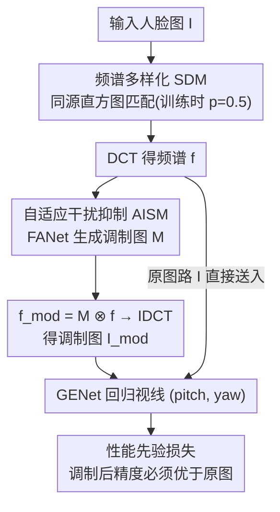

# Through the Frequency Lens: Cross-Domain Generalisable Gaze Estimation with Adaptive Modulation

**会议**: CVPR 2026  
**论文**: [CVF Open Access](https://openaccess.thecvf.com/content/CVPR2026/html/Xu_Through_the_Frequency_Lens_Cross-Domain_Generalisable_Gaze_Estimation_with_Adaptive_CVPR_2026_paper.html)  
**代码**: 无  
**领域**: 视线估计 / 域泛化  
**关键词**: 视线估计, 域泛化, 频域分析, 自适应调制, 直方图匹配

## 一句话总结
本文从频域视角剖析视线估计的跨域退化，发现人脸图像里既有助泛化的「视线相关频段」也有害泛化的「干扰频段」、且二者分布随数据集漂移，据此提出 FGAL 框架——用一个轻量注意力网络给每张图生成可学习的频域调制图来自适应抑制干扰频段（AISM），再用同源直方图匹配扩充训练时见过的频谱分布（SDM），在四个跨域设置上比 baseline 最高降误差 28.2%、比 SOTA 最高降 19.5%。

## 研究背景与动机
**领域现状**：基于表观（appearance-based）的视线估计已成主流——直接用 CNN/Transformer 从整张人脸图回归出 pitch/yaw 两个角度，配合 ETH-XGaze、Gaze360、MPIIFaceGaze 等大数据集能在「同数据集内」拿到很好的精度。

**现有痛点**：一旦换到训练时没见过的目标域（不同光照、采集设备、人种、压缩协议），这些模型精度会断崖式下跌。现有两条路线都有硬伤：UDA（无监督域适应）要在训练时访问目标域的无标注数据，实际部署时常常拿不到；DG（域泛化）虽然不碰目标域，但现有做法（对抗特征净化 PureGaze、对抗扰动、CLIP 语言正则）都在**空间域**做文章，效果仍不稳。

**核心矛盾**：作者把跨域退化的根因落到了**频域**上。一张人脸图的不同频段对「跨域泛化」贡献并不一样——低频承载着眼睛结构这类视线相关、跨数据集稳定的信息（有益），高频更多是光照、传感器噪声、压缩伪影这类数据集特有的外观干扰（有害）；更麻烦的是，哪些频段是干扰、能量怎么分布，**随数据集而变**，这正是域间隙（domain gap）的一大来源。

**本文目标**：在不访问任何目标域数据的前提下，让模型（1）自适应识别并抑制每张图各自的干扰频段，（2）对多样的频谱分布具备鲁棒性。

**切入角度**：作者做了一组系统的频段消融实验——用 DCT 把测试图变到频域、均匀切成 10 个频段、逐个把某频段系数置零再 IDCT 重建，看跨域精度怎么变（图 2）。结果很干净：抑制 7-10 高频段反而**涨点**（说明它们是干扰），抑制 1-3 低频段精度**暴跌**（说明它们是视线结构信息）；而且最优抑制频段在不同源/目标域组合下不一致（DE→DM 是 band 7、DG→DM 是 band 8）。

**核心 idea**：与其在空间域净化特征，不如在频域「逐样本」抑制干扰频段（自适应），再主动「扩充」训练见过的频谱分布（多样化），用这两步互补操作把跨域 gap 在频域层面抹平。

## 方法详解

### 整体框架
FGAL（Frequency-Guided Adaptive Learning）由两个互补模块组成：**AISM**（自适应干扰抑制）负责在频域逐样本压掉干扰频段、留住视线相关频段；**SDM**（频谱多样化）在训练时把每张图的频谱直方图匹配到同源另一张图上，制造出更丰富的频谱分布让模型见多识广。训练阶段两者串联在一条「双路前向」上：原图走一路、调制后的图走另一路，用一个「performance-prior」损失逼着调制网络学会「调制后精度必须更好」。推理时只保留 AISM 这条调制路。

### 关键设计

**1. 频域泛化分析：把域间隙拆成「有益频段」与「干扰频段」**

这是全文的立论根基，也是后面两个模块的依据。作者用 DCT 将图像变到频域、参照已有工作把频谱均匀分成 10 个频段，然后逐段消融（置零该段 DCT 系数后 IDCT 重建）观察跨域精度变化。两条关键观察：**观察一**——人脸图的频段贡献分两类：低频（band 1-3）编码眼睛结构等视线相关、跨域稳定的信息，抑制它精度暴跌；高频（band 7-10）多是光照/噪声/压缩伪影等数据集特有干扰，抑制它反而涨点。**观察二**——这两类频段的能量分布**随数据集漂移**：最优抑制频段在不同源域评测同一目标域时都不一样（DE→DM 用 band 7、DG→DM 用 band 8）。这两条观察直接推出两个设计原则：必须**逐样本自适应**地找干扰频段（对应 AISM），以及必须对**多样频谱分布**鲁棒（对应 SDM）。

**2. AISM：用 0.5K 参数的注意力网络逐样本生成频域调制图**

观察二说明「固定抑制某个频段」行不通——不同样本、不同域的干扰频段不一样。AISM 因此让一个轻量网络 FANet 给每张图算一张专属的频域调制图。具体地，对输入图 $I\in\mathbb{R}^{3\times H\times W}$ 先逐通道做 DCT 得频谱 $f=\mathrm{DCT}(I)$，送入 FANet（三个深度可分离卷积块，膨胀率 1/2/4 逐步扩大感受野以捕捉多尺度频域依赖，末尾 1×1 卷积 + Sigmoid）输出调制图：

$$M=\sigma(F(f))\in[0,1]^{H\times W}$$

$M$ 中越小的值代表越强的抑制。随后做逐元素相乘 $f_{mod}=M\otimes f$（通道广播、共享通道调制以保住颜色相关性、避免伪影），再 IDCT 重建出调制图 $I_{mod}=\mathrm{IDCT}(f_{mod})$ 送进视线网络 GENet。FANet 仅 0.5K 参数（10KB，不到 ResNet-18 的 0.01%），开销几乎可忽略——它和 GENet（标准 backbone + MLP 回归头）联合训练，让网络学会「压干扰、留视线」。相比「对所有图固定抑制某频段」，逐样本调制在所有跨域设置上都更优且更稳。

**3. 性能先验损失：用「调制后必须更准」这条物理先验逼 FANet 学对**

光有调制网络还不够——怎么保证 FANet 压掉的是干扰、而不是误伤视线信息？作者把观察一翻译成一条可训练的约束：既然抑制干扰会涨点、抑制视线信息会掉点，那么「正确的调制」必然让调制图上的视线误差**不高于**原图。定义性能差 $\Delta=L_{mod\text{-}gaze}-L_{ori\text{-}gaze}$，损失为：

$$L_{prior}=\exp(\max(0,\Delta))-1$$

其中 $\max(0,\Delta)$ 只在调制后变差（$\Delta>0$，意味着误伤了视线频段或没压住干扰）时才激活惩罚；指数形式比线性/二次提供更陡的梯度、对错误调制施以更重的罚。由于视线角度物理有界，$\Delta$ 取值范围受限，训练稳定。整体训练目标是四项之和：

$$L_{total}=L_{ori\text{-}gaze}+L_{mod\text{-}gaze}+\lambda_1 L_{prior}+\lambda_2 L_{sparse}$$

两个视线损失（原图路 + 调制路，均为 L1）保证 GENet 估计能力、且 $L_{mod\text{-}gaze}$ 顺带防止 FANet 压掉视线频段；稀疏正则 $L_{sparse}=\frac{1}{HW}\sum_{h,w}M(h,w)$ 防止调制图退化成全 1 的恒等变换（即不做任何抑制）。

**4. SDM：同源直方图匹配，主动把训练频谱「摊开」**

AISM 学到的调制策略仍可能过拟合源域那一种频谱分布，遇到分布不同的目标域就失灵。SDM 的思路是在训练时主动制造更多样的频谱分布让模型见过。对每张训练图 $I_s$，从**同一源域**随机取另一张 $I_t$，两者各做 DCT 得 $f_s,f_t$，借鉴 FSDR 在整个频谱上做直方图匹配（逆累积分布映射）：

$$f_d=\mathrm{HistMatch}(f_s,f_t)$$

得到的 $f_d$ 把 $I_s$ 的空间结构（因而视线标签不变）和 $I_t$ 的频谱分布拼在一起，IDCT 回 $I_d$ 后送入 AISM。用同源图当参考有三个好处：保留自然图像统计、利用源域内部固有差异（肤色/光照/压缩伪影）来模拟真实跨域频谱变化；不访问目标域、维持 DG 设定；避免合成频谱带来的不真实伪影。训练时以概率 0.5 施加 SDM。

### 损失函数 / 训练策略
总损失见上式四项。关键超参用**分阶段加权**：先验损失权重 $\lambda_1$ 前 5 个 epoch 设 1.0（让模型先稳住学到视线语义）、后 5 个 epoch 提到 10.0（给足先验引导）；稀疏权重 $\lambda_2=0.01$（太大过度抑制视线特征、太小不足以去干扰）。Adam，学习率 $10^{-4}$，10 epoch，batch 256，像素归一到 [0,1]，不做额外空间域增广。推理时因 DCT/IDCT 略有开销（ResNet-18 244.2 FPS vs baseline 342.0 FPS），但仍超实时。

## 实验关键数据

四个数据集：ETH-XGaze (DE)、Gaze360 (DG)、MPIIFaceGaze (DM)、EyeDiap (DD)；用 DE、DG 作源域（视线分布范围大），组成 DE→DM / DE→DD / DG→DM / DG→DD 四个跨域设置，指标为角度误差（度，越低越好）。

### 主实验

| 方法 | DE→DM | DE→DD | DG→DM | DG→DD | Avg |
|------|------|------|------|------|------|
| ResNet-18 (baseline) | 7.29 | 9.77 | 8.05 | 9.03 | 8.54 |
| ResNet-50 (baseline) | 6.84 | 9.06 | 7.31 | 9.09 | 8.08 |
| PureGaze | 7.08 | 7.48 | 9.28 | 9.32 | 8.29 |
| CDG | 6.73 | 7.95 | 7.03 | 7.27 | 7.25 |
| Xu et al. | 6.50 | 7.44 | 7.55 | 9.03 | 7.63 |
| FSCI | 5.79 | 6.96 | 7.06 | 7.99 | 6.95 |
| GFAL | 5.72 | 6.97 | 7.18 | 7.38 | 6.81 |
| CLIP-Gaze | 6.41 | 7.51 | 6.89 | 7.06 | 6.97 |
| **ResNet18 + FGAL** | **5.47** | 7.28 | **5.78** | 7.67 | **6.55** |
| **ResNet50 + FGAL** | **5.29** | 7.18 | 5.85 | **6.94** | **6.32** |

ResNet-18 + FGAL 平均误差 6.55°，比 ResNet-18 baseline（8.54°）提升约 23%、在 DG→DM 上最高降误差 28.2%，并在 DE→DM、DG→DM 及平均误差上超过所有 SOTA（DG→DM 比最好的 SOTA 还低 19.5%）。换 ResNet-50 后平均进一步降到 6.32°。

### 消融实验

| 配置 | DE→DM | DE→DD | DG→DM | DG→DD | Avg | 说明 |
|------|------|------|------|------|------|------|
| Rs18 | 7.29 | 9.77 | 8.05 | 9.03 | 8.54 | baseline |
| Rs18 + SDM | 6.28 | 7.55 | 6.21 | 7.81 | 6.96 | 只加频谱多样化 |
| Rs18 + AISM | 5.73 | 7.31 | 5.80 | 7.91 | 6.69 | 只加自适应抑制 |
| **Rs18 + FGAL** | 5.47 | 7.28 | 5.78 | 7.67 | **6.55** | 完整模型 |
| Rs50 + FGAL | 5.29 | 7.18 | 5.85 | 6.94 | **6.32** | 换大 backbone |

### 关键发现
- **AISM 是主力**：单加 AISM 平均从 8.54→6.69，单加 SDM 到 6.96，AISM 提升更大——说明「逐样本自适应抑制干扰频段」是泛化提升的主要来源；两者叠加再有增益（6.55），证明 SDM 的频谱多样化提供了正交的鲁棒性。
- **自适应 vs 固定抑制**（表 3）：对所有图固定抑制某个频段虽能涨点（如 band 8 在 DE→DM 拿到 6.83°），但最优频段随设置而变、没有放之四海皆准的固定频段；AISM 逐样本抑制在所有设置上都更优更稳，直接验证了观察二「干扰频段随样本/域漂移」。
- **学到的抑制模式可解释**：统计各频段平均抑制比例，最高频段被抑制得最重，与频域分析结论一致——FANet 确实学会了压高频干扰、留低频视线结构。

## 亮点与洞察
- **把抽象的「域 gap」落到可量化的频段消融上**：用 DCT 逐段置零 + IDCT 重建这一招，把「高频是干扰、低频是信号、且分布随域漂移」这件事用涨点/掉点的曲线直接量出来，立论扎实，是整篇方法的灵魂。
- **性能先验损失把物理直觉变成可训练约束**：$\exp(\max(0,\Delta))-1$ 这个形式很巧——只在「调制后反而更差」时惩罚、用指数放大错误调制的梯度，且利用视线角度物理有界保证稳定，避免了让网络自由乱调制。这种「用已验证的先验单向约束辅助网络」的写法可迁移到其他有明确物理/统计先验的任务。
- **极致轻量**：0.5K 参数（10KB）的 FANet 就撬动了主要泛化增益，几乎零开销，部署友好。
- **SDM 用同源参考做频域 augmentation**：不碰目标域、不造合成伪影，只靠源域内部的肤色/光照/压缩差异就模拟出跨域频谱变化，是 DG 设定下很干净的数据扩充思路。

## 局限与展望
- 实验只覆盖四个跨域 gaze 数据集，源域固定为 DE/DG；方法虽宣称有更广域泛化潜力，但未在 gaze 之外的任务（如人脸/医学图像）上验证。
- DCT/IDCT 带来约 30% 推理吞吐下降（342→244 FPS），对极端实时/边缘场景仍是成本。
- 频段消融分析用 ResNet-18 + 均匀 10 段划分，结论可能受划分粒度和 backbone 影响；「高频=干扰、低频=信号」是统计趋势，个别样本/域上未必严格成立。
- 改进方向：把固定 10 段的频域分析换成可学习的频段划分；探索 AISM 调制图与具体干扰类型（光照 vs 压缩）的对应关系，提升可解释性。

## 相关工作与启发
- **vs PureGaze / Xu et al.（空间域 DG）**：它们在空间域做对抗特征净化或对抗扰动来去除视线无关因素；本文转到频域、逐样本抑制干扰频段，在多数跨域设置上误差更低（如 DG→DM 5.78 vs PureGaze 9.28）。
- **vs CLIP-Gaze（语言正则 DG）**：CLIP-Gaze 借语言特征正则化视线学习；本文不依赖额外模态，仅靠频域操作就在平均误差上超过它（6.55 vs 6.97）。
- **vs Liu et al.（高频域泛化）**：已有工作发现高频对跨域有害、做固定的高频处理；本文进一步指出干扰频段**随样本/域漂移**、必须自适应，AISM 在所有设置上稳超固定频段抑制。
- **vs FSDR（频域直方图匹配）**：SDM 借鉴了 FSDR 的频谱直方图匹配，但限定在**同源**图之间做、用于扩充训练频谱分布以服务 DG，而非跨域风格迁移。

## 评分
- 新颖性: ⭐⭐⭐⭐ 频域逐样本调制 + 性能先验损失的组合在 gaze DG 里少见，立论分析扎实
- 实验充分度: ⭐⭐⭐⭐ 四跨域设置 + 双 backbone + 固定/自适应对比 + 抑制模式可视化，较完整
- 写作质量: ⭐⭐⭐⭐ 从分析到方法到验证逻辑闭环，观察→原则→模块对应清晰
- 价值: ⭐⭐⭐⭐ 几乎零参数开销拿到 SOTA、不访问目标域，方法可迁移到其他频域敏感的 DG 任务

<!-- RELATED:START -->

## 相关论文

- [\[CVPR 2026\] See Through the Noise: Improving Domain Generalization in Gaze Estimation](see_through_the_noise_improving_domain_generalization_in_gaze_estimation.md)
- [\[CVPR 2026\] HamiPose: Hamiltonian Optimization for Unsupervised Domain Adaptive Pose Estimation](hamipose_hamiltonian_optimization_for_unsupervised_domain_adaptive_pose_estimati.md)
- [\[CVPR 2026\] Occluded Human Body Capture with Frequency Domain Denoising Prior](occluded_human_body_capture_with_frequency_domain_denoising_prior.md)
- [\[CVPR 2026\] Render-to-Adapt: Unsupervised Personal Adaptation for Gaze Estimation](render-to-adapt_unsupervised_personal_adaptation_for_gaze_estimation.md)
- [\[NeurIPS 2025\] A Generalized Label Shift Perspective for Cross-Domain Gaze Estimation](../../NeurIPS2025/human_understanding/a_generalized_label_shift_perspective_for_crossdomain_gaze_e.md)

<!-- RELATED:END -->
