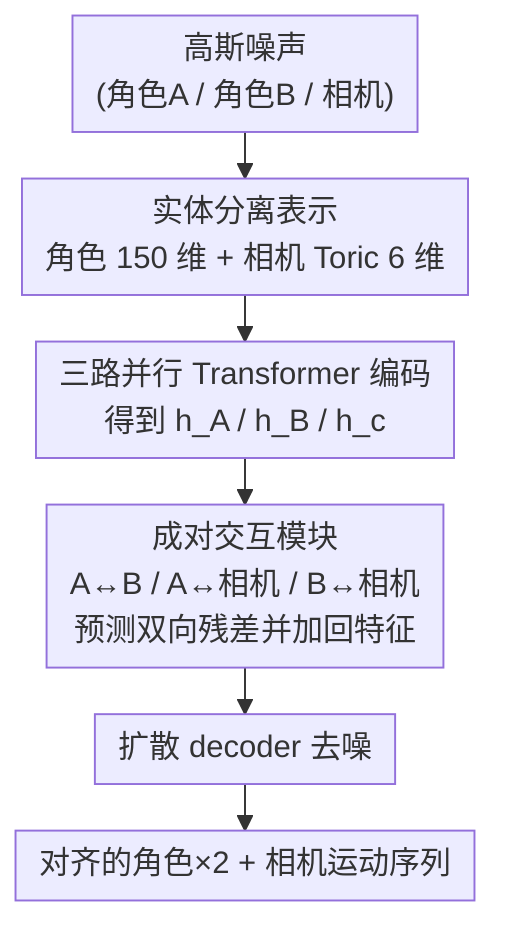

# Towards Storytelling Animations: Joint Synthesis of Human and Camera Motions

**会议**: CVPR 2026  
**论文**: [CVF Open Access](https://openaccess.thecvf.com/content/CVPR2026/html/Cheng_Towards_Storytelling_Animations_Joint_Synthesis_of_Human_and_Camera_Motions_CVPR_2026_paper.html)  
**代码**: 无  
**领域**: 人体理解 / 运动生成  
**关键词**: 角色运动生成, 虚拟摄影, 联合扩散模型, 交互建模, Toric 空间  

## 一句话总结
本文提出首个把"两个交互角色的 3D 运动"和"摄像机运动"放进同一个扩散模型里联合生成的框架，用三路并行 backbone + 三个成对交互模块显式建模角色—角色、角色—摄像机之间的相互影响，并自建一个真实电影片段 + 合成数据混合的 7,228 段角色—摄像机数据集，在角色运动、摄像机运动、两者协调三个维度上都超过各自的专用方法。

## 研究背景与动机
**领域现状**：要讲好一个故事，3D 动画既需要高保真、符合剧本的角色动作，也需要精心设计的摄像机调度——"推、拉、摇、移"决定了角色在画面里的大小、构图和观众的注意力（比如一个"push in"推镜能升级紧张感）。近年角色运动合成（单人、文本驱动、双人交互）和虚拟摄影（从给定 3D 人体运动生成相机轨迹）各自都取得了很大进展。

**现有痛点**：所有已有方法都只解决"角色运动生成"**或**"摄像机运动生成"中的一个，没有能在单一框架里同时处理两者的。即便是从已有角色运动反推相机轨迹的工作（如 AutoVisNarr、DanceCamera3D），相机也是"事后"挂到固定的人体运动上，二者不是平等、双向耦合的关系。

**核心矛盾**：讲故事动画的本质是角色与相机的**强相关、双向协同**——角色怎么动会影响该怎么拍，怎么拍又反过来约束角色该如何被呈现。把两个任务拆开做、串行做，必然丢掉这种耦合，生成出来的镜头要么构图崩坏要么呆板静止。

**本文目标**：把"两个角色的运动 + 一台相机的运动"建模成一个**联合分布**，从中直接采样出彼此对齐、和谐的角色—相机运动对。

**切入角度**：作者把每个角色和相机都当作 3D 场景里**独立且同等重要**的实体，在生成过程中显式地学习"角色—角色"和"角色—相机"两类成对交互，而不是把它们塞进一个大序列里靠 self-attention 隐式纠缠。

**核心 idea**：用一个"三实体并行 backbone + 成对交互残差"的扩散模型，把角色与相机当平等实体联合去噪，让任意两实体之间的相互影响以残差形式显式注入特征。

## 方法详解

### 整体框架
方法的输入是一段纯高斯噪声，输出是三条对齐的运动序列：角色 A、角色 B、相机各自的 6 秒（120 帧 @ 20fps）运动。整体是在 MDM（单人运动扩散模型）基础上扩展到"三实例运动空间"：去噪网络由三条**并行的运动生成 backbone**组成（角色 A 一条、角色 B 一条、相机一条），每条先用各自的 Transformer encoder 把含噪运动 token 编成高层特征 $h_t^A, h_t^B, h_t^c$；然后三个**成对交互模块**分别建模 A↔B、A↔相机、B↔相机的关系，预测出残差校正量加回各自特征；精炼后的特征送进扩散 decoder，预测出去噪后的三条运动 $(\hat{x}_0^{A}, \hat{x}_0^{B}, \hat{x}_0^{c})$。整个训练是**无条件**的——模型直接从数据分布里采样多实体运动，不需要成对的文本/输入条件。

### 关键设计

**1. 实体分离 + 成对交互的去噪架构：把角色和相机当平等实体而非一锅炖**

这是全文最核心的设计，直接针对"拆开做丢耦合、揉一起做又纠缠不清"的矛盾。作者没有把三个实体拼成一条长序列丢给统一 encoder（消融里的 w/o Separation），而是给每个实体独立的 backbone 和 encoder 保持其"实体独立性"，再用三个交互模块显式地在实体之间传递信息。每个交互模块吃一对特征、吐**双向残差**：角色—角色模块从 $(h_t^A, h_t^B)$ 预测 $\Delta h_t^{B\to A}$ 和 $\Delta h_t^{A\to B}$，编码两人之间的相互依赖和空间约束；两个角色—相机模块各自产出"角色影响相机"和"相机影响角色"两个方向的残差。最后每个实体的状态按对应残差求和更新：

$$\hat{h}_t^A = h_t^A + \Delta h_t^{B\to A} + \Delta h_t^{c\to A}$$
$$\hat{h}_t^B = h_t^B + \Delta h_t^{A\to B} + \Delta h_t^{c\to B}$$
$$\hat{h}_t^c = h_t^c + \Delta h_t^{A\to c} + \Delta h_t^{B\to c}$$

之所以有效：残差形式既保留了每个实体自身 backbone 学到的强先验（比如单人运动的真实性来自在 HumanML3D 上预训练的 backbone），又让"角色怎么动"和"相机怎么拍"通过显式通道互相纠正——相机能感知到两人正在交互从而调整构图，角色表示也会被相机视角反过来塑造。消融显示去掉交互（w/o Interaction）会让协调性变差，而把实体混成一条序列（w/o Separation）则全面崩坏，证明"既分离又交互"缺一不可。

**2. 角色运动的双人对齐表示：把全局站位塞进每帧 pose**

单个角色的每帧 pose 用 22 个 SMPL 关节（不含手）的相对旋转 + 全局根平移表示，旋转用连续 6D 表示保证数值稳定，根平移补零成 6 维，拼成 138 维（23×6）。难点在双人：两条序列各自定义在自己的局部坐标系（首帧根在原点），直接放进共享 3D 空间会撞在一起。作者为每个角色算一个偏移向量 $D \in \mathbb{R}^9$，前 6 维表朝向（由两肩连线在 xz 平面上与 x 轴的夹角确定初始朝向）、后 3 维表首帧全局位置；$D$ 虽只从首帧算一次，却被**追加到每一帧** pose 上，并补零成 12 维（对应两个虚拟关节）。于是每帧变成 25×6 矩阵展平的 150 维向量，整段双人运动表示为 $(x^{1:N}_A, x^{1:N}_B)$，每帧同时携带局部运动特征和全局站位。把站位信息显式编进每帧，是后续相机能正确"对准"两人头部位置的前提。

**3. Toric 空间的相机表示：让相机参数天然挂在角色身上**

相机姿态不用裸的 3D 外参，而用 Toric 空间坐标系，4 个参数：两位主角头部的归一化屏幕坐标 $p_A=(p_{Ax}, p_{Ay})$、$p_B=(p_{Bx}, p_{By})$，以及相机相对这两个参考点的偏航角 $\theta$ 和俯仰角 $\phi$。N 帧相机特征写作：

$$x^{1:N}_c = \{p^i_A, p^i_B, \theta^i, \phi^i\}_{i=1}^{N} \in \mathbb{R}^{6N}$$

这个表示的巧妙之处在于：Toric 空间本身就是**以角色位置为基准**定义的，所以"两人头部在画面里的构图"和"相机朝向"被直接编码进特征，相机—角色的空间关系天然内建，不需要模型从绝对坐标里费劲学。这让相机—角色交互模块更容易学到"角色怎么动 → 构图怎么变"的语义对应。

### 损失函数 / 训练策略
沿用 MDM 的简化扩散目标，直接预测干净样本而非噪声：

$$\mathcal{L}_{simple} = \mathbb{E}_{x_0 \sim q(x_0),\, t\sim[1,T]}\left[\|x_0 - f_\theta(x_t, t)\|_2^2\right]$$

训练分两步：先用 HumanML3D（17,684 段运动）**预训练单人运动 backbone**，再把整个三实体模型在自建的角色—相机数据集上训练。共 180,000 步，扩散步数 T=1000，batch size 64，学习率 1e-3。整个过程无条件，模型学的是数据分布本身。

## 实验关键数据

数据集自建：整合真实电影/电视/舞台片段（3,008 段，角色交互丰富但相机多为静止）与 Cine Tracer 软件合成数据（4,220 段，相机运动多样但动作变化少），互补成 7,228 段、每段 6 秒。真实片段的人体运动用 MeTRAbs 估 2D 关键点 + 透视几何优化恢复绝对 3D 根位置。85% 训练 / 15% 测试。

### 主实验

角色运动（vs 双人运动生成方法）：

| 指标 | ComMDM | InterGen | RIG | 本文 |
|------|--------|----------|-----|------|
| FID ↓ | 0.156 | 0.354 | 0.495 | **0.113** |
| InterFID ↓ | 0.746 | 0.897 | 1.790 | **0.651** |
| Coverage ↑ | 0.160 | 0.018 | 0.011 | **0.264** |
| Density ↑ | 0.627 | 0.226 | 0.176 | **0.990** |

相机运动（vs 相机生成方法）：

| 指标 | CDM | DC3D | 本文 |
|------|-----|------|------|
| SeqFID ↓ | 0.629 | 0.417 | **0.256** |
| FrameFID ↓ | 0.638 | 0.605 | **0.268** |
| Density ↑ | 0.538 | 0.227 | **1.937** |

角色—相机协调（Character-Camera Alignment，CLIP 式对齐损失 ↓）：M2C-T 6.136 / AutoVisNarr 6.019 / **本文 5.885**，即便对手是专门做协调的方法仍取得更低对齐损失。

### 消融实验

| 配置 | 角色 FID ↓ | 角色 InterFID ↓ | 相机 FrameFID ↓ | 协调 Alignment ↓ |
|------|-----------|----------------|----------------|-----------------|
| w/o Interaction | 0.168 | 0.147 | 0.335 | 2.298 |
| w/o Separation | 0.214 | 0.628 | 0.430 | 2.310 |
| **Ours (Full)** | **0.143** | **0.083** | **0.268** | **2.284** |

> ⚠️ 消融表里的 InterFID / Alignment 数值与主表（Table 1/3）量纲不同，应来自不同评测子集或不同 encoder 设置，不可直接和主表数字对比大小。

### 关键发现
- **"分离"比"交互"更关键**：w/o Separation（把三实体揉成一条序列）在所有维度上都最差，说明保持实体独立性是地基；w/o Interaction（保留分离但去掉交互模块）次优。两者都不如完整模型，证明"既分离又显式交互"缺一不可。
- **协调性是本文真正的杀手锏**：相比专门做相机协调的 AutoVisNarr/M2C-T，本文在 Alignment 上仍更低，定性上也表现为构图稳定、有叙事流动感，而 M2C-T（确定性回归）常出现过度变焦、跟丢主角，AutoVisNarr 视角偏静止。
- **Density 大幅领先**：角色 0.990 vs 次优 0.627、相机 1.937 vs 次优 0.538，说明联合建模显著提升了生成样本贴合真实分布高密度区的能力。

## 亮点与洞察
- **"实体平等 + 成对残差"是个可迁移的多智能体生成范式**：把每个实体给独立 backbone、用成对模块吐双向残差再相加，既保住单实体强先验又显式建模耦合。这套路子可以推广到任何"多个互相影响的实体需要联合生成"的场景（多人交互、人物+物体、多机器人协同）。
- **Toric 空间把相机—角色关系写进表示而非交给模型硬学**：用屏幕坐标 + 相对角度表示相机，让"构图"这件最讲究的事天然内建进特征，是个把领域先验（电影构图规则）编码进表示的漂亮例子。
- **真实 + 合成数据互补**：真实片段有丰富交互但相机静止、合成数据相机花哨但动作单一，两者拼起来正好覆盖"角色多样 × 相机多样"的联合空间，是数据侧的巧思。
- **无条件生成也能讲故事**：不依赖文本条件，纯从分布采样就能得到协调的角色—相机对，说明耦合关系本身已被分布充分编码。

## 局限与展望
- **无条件、不可控**：模型是无条件采样，无法按给定剧本/文本/情绪精确控制生成哪种镜头语言，离"按需创作"还有距离——这对实际动画生产是硬伤。
- **只支持两个角色**：框架固定为两个角色 + 一台相机，交互模块是为成对设计的，扩展到任意人数/多机位需要重新设计交互拓扑。
- **6 秒短片段**：每段固定 120 帧/6 秒，长镜头、多镜头切换的叙事连贯性未涉及。
- **真实数据相机标注质量**：真实片段相机运动多静止、且由视频反推，合成数据相机多样性可能主导了学到的相机先验，真实电影的复杂运镜覆盖度存疑。
- **改进方向**：加文本/剧本条件做可控生成；把交互模块改成图结构以支持可变实体数；引入镜头切换（cut）建模长叙事。

## 相关工作与启发
- **vs DanceCamera3D [45]**: 都做"运动 + 相机"联合扩散，但 DC3D 是音乐条件下的舞蹈—相机联合、且难以兼顾平滑长镜与突变切换、依赖后处理平滑；本文做的是双人交互叙事 + 相机，且把角色也当生成对象（DC3D 的舞蹈是已知输入）。
- **vs AutoVisNarr [6] / Cheng et al.**: 他们从已有 3D 人体交互**反推**相机轨迹，相机是事后挂载；本文把角色和相机当平等实体**同时**生成，显式建模双向影响，故协调性更好。
- **vs InterGen / ComMDM [1,30]**: 都做双人交互运动生成，但完全不涉及相机；本文证明在它们之上联合建模相机反而能进一步提升角色运动质量（FID/InterFID 全面更优），说明相机信息对角色生成也有正反馈。

## 评分
- 新颖性: ⭐⭐⭐⭐⭐ 首个把双人角色运动与相机运动放进单一扩散模型联合生成的工作，问题定义本身就是新的
- 实验充分度: ⭐⭐⭐⭐ 角色/相机/协调三维度都有对比 + 消融，但全是无条件分布度量，缺可控性与用户研究
- 写作质量: ⭐⭐⭐⭐ 表示、架构、数据集讲得清楚，但部分公式排版混乱、消融与主表量纲不一致未说明
- 价值: ⭐⭐⭐⭐ 为故事化 3D 动画自动生成开了新方向，范式和数据集对后续可控镜头生成有较强价值

<!-- RELATED:START -->

## 相关论文

- [\[CVPR 2026\] Decoupled Generative Modeling for Human-Object Interaction Synthesis](decoupled_generative_modeling_for_human-object_interaction_synthesis.md)
- [\[CVPR 2026\] InterPhys: Physics-aware Human Motion Synthesis in a Dynamic Scene](interphys_physics-aware_human_motion_synthesis_in_a_dynamic_scene.md)
- [\[CVPR 2026\] Seeing without Pixels: Perception from Camera Trajectories](seeing_without_pixels_perception_from_camera_trajectories.md)
- [\[CVPR 2025\] Shape My Moves: Text-Driven Shape-Aware Synthesis of Human Motions](../../CVPR2025/human_understanding/shape_my_moves_text-driven_shape-aware_synthesis_of_human_motions.md)
- [\[CVPR 2026\] SceMoS: Scene-Aware 3D Human Motion Synthesis by Planning with Geometry-Grounded Tokens](scemos_scene-aware_3d_human_motion_synthesis_by_planning_with_geometry-grounded_.md)

<!-- RELATED:END -->
