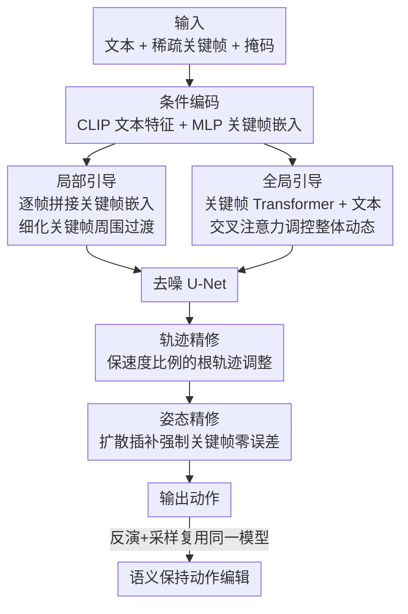

# Unifying Precise Keyframes and Semantic Control via Multi-level Diffusion

**会议**: CVPR 2026  
**论文**: [CVF Open Access](https://openaccess.thecvf.com/content/CVPR2026/html/Wu_Unifying_Precise_Keyframes_and_Semantic_Control_via_Multi-level_Diffusion_CVPR_2026_paper.html)  
**代码**: 无  
**领域**: 人体动作生成 / 扩散模型  
**关键词**: 文本驱动动作补全, 关键帧约束, 多层级扩散引导, 轨迹精修, 语义保持编辑

## 一句话总结
针对"文本只能给高层语义、关键帧能给精确时空约束但二者难以协调"的痛点，本文提出一个多层级扩散框架：局部引导用单个关键帧细化其周围的局部过渡，全局引导把文本与整段关键帧序列的隐式时序线索融成统一表示来调控整体动态；推理时再用一套保速度比例的轨迹精修 + 扩散插补的姿态精修，把关键帧硬约束从"软逼近"变成"零误差严格满足"，并顺带支持免训练的语义保持动作编辑，在 HumanML3D 上把 Keyframe Error 压到 0 cm。

## 研究背景与动机
**领域现状**：文本驱动的人体动作生成（text-to-motion）靠自然语言提供直观的语义控制，但文本无法指定"在第几帧、摆成什么精确姿态"这种时空细节。关键帧动作补全（motion in-betweening）则相反——关键帧能给出精确的时空约束，却需要画大量关键帧才能表达完整语义，是费时费力的手工活。于是近期可控动作生成（如 CondMDI、OmniControl、MaskControl）开始把空间约束注入文本条件生成，想"两者兼得"。

**现有痛点**：这些方法有两个硬伤。其一，它们只吃到文本的**高层语义**（动作类别、动作之间的先后顺序），却没能对齐关键帧里隐含的**低层语义**（精确时机、微妙的姿态特征），结果生成的过渡常常"约束不足"——比如关键帧已经规定了"举着物体走"，模型却在关键帧时机之后又冗余地做一遍"捡起"，或者走路时没保持"举物"姿态。其二，它们把关键帧当**软约束**而非硬约束，生成动作在受约束帧上仍有明显偏移；可关键帧往往定义了脚-地接触、手-物抓握这类关键空间关系，哪怕几厘米偏差都会造成物理不合理的视觉穿帮。

**核心矛盾**：严格满足关键帧硬约束与保持文本语义多样性之间存在张力——过度强调关键帧会把过渡退化成确定性插值、丢掉文本语义；过度强调文本又会偏离关键帧。同时文本（显式、高层）与关键帧（稀疏姿态、隐式低层时机）是两种互补但异构的引导信号，协调不好就产生控制歧义。

**本文目标 / 切入角度**：作者把问题拆成两层——(1) 怎样在严格贴合关键帧的同时生成多样的文本引导过渡；(2) 怎样把文本与关键帧两路引导融合成精确的"多层级语义控制"。关键观察是：文本管全局、关键帧既影响局部动态又影响全局时序结构，因此引导也该分"全局/局部"两个层级；而关键帧硬约束不该靠训练时硬学，而应在推理阶段用一套精修策略来强制保证。

**核心 idea**：一个多层级扩散框架——**局部引导**用单个关键帧细化其周围帧、**全局引导**把文本与整段关键帧序列的隐式线索融成统一表示调控整体动态；再加**推理期轨迹精修 + 姿态精修**把关键帧误差归零，并复用同一个扩散模型做免训练的语义保持编辑。

## 方法详解

### 整体框架
给定一段文本提示和一组稀疏关键帧（含掩码，标明哪些帧的哪些关节被约束），目标是生成既严格满足时空约束、又同时贴合"文本 + 关键帧"双重语义的动作序列。整条流水线分两段：训练时学一个**多层级扩散模型**（局部引导 + 全局引导联合调制全局动态与局部模式），推理时在去噪末段插入**轨迹精修 → 姿态精修**两步强制关键帧零误差。扩散主干是 Conv1D U-Net，预测干净动作 $\hat{\mathbf{x}}_0 = p_\theta(\mathbf{x}_t, t, c)$，$c$ 为文本与关键帧条件。此外，训练好的模型天然支持**语义保持编辑**：用免训练的 invert-and-sample 在满足新关键帧的同时保住原动作语义。

### 关键设计

**1. 多层级引导机制：局部管关键帧周围、全局管整体动态**

这是为了解决"文本只给高层语义、关键帧的低层时机线索被忽略"的痛点。作者把条件分成两路注入。**局部引导**：先把每帧的时空约束写成特征矩阵 $\mathbf{K}\in\mathbb{R}^{N\times D}$（未约束项置零）和二值掩码 $\mathbf{m_K}\in\{0,1\}^{N\times D}$，拼接后过 MLP 得到逐帧的关键帧嵌入 $\mathbf{e}_k\in\mathbb{R}^{N\times D_k}$；推理时把噪声特征 $\mathbf{x}_t$ 过 MLP 后与对应帧的 $\mathbf{e}_k$ 逐帧拼接，喂进 U-Net，让卷积在每个关键帧附近自适应调节局部变化、实现精确空间对齐。**全局引导**：关键帧是稀疏序列、有长程时序依赖，单帧拼接抓不到整体结构，于是引入一个 **Keyframe Transformer Encoder**——把 $\mathbf{e}_k$ 与一个可学习 token 拼接、加位置编码标明时序，再用关键帧掩码 $\mathbf{m_K}$ 滤掉被 mask 的嵌入，过 Transformer 后取**可学习 token 对应的输出**作为定长的紧凑关键帧特征；它与文本特征拼成统一全局特征，通过交叉注意力（噪声动作做 query，全局特征做 key/value）注入 U-Net，让主干选择性地融合"文本意图 + 关键帧序列线索"来驱动全局动态。两路互补：全局引导基于文本语义与关键帧时空分布塑造整体动态，局部引导锚定每个关键帧附近的过渡——消融里 LocG 单用 FID 好但空间不准、GloG 单用语义还行但空间最差，二者合用全面胜出。

**2. 轨迹精修：按根速度比例分摊误差，对齐关键帧又不引脚滑**

扩散的随机性让生成动作在关键帧上仍有空间偏移。由于所有关节都相对根关节定义，作者选择只校根轨迹来一并消除偏移。直接做法（如 OmniControl 用梯度迭代最小化根位置误差）有个坑：在速度表示下，单帧误差的梯度会**均匀地**传到之前所有根速度上，导致根速度与非均匀的动作动态错配（比如"走到坐下"序列里身体已坐定、根却还在漂），还会因调整后轨迹与原脚-地接触模式错位而产生脚滑。作者借用一个发现——**根速度趋势（其相对比例）是接触模式的主要决定因素**——于是按速度比例而非均匀来分摊修正。对相邻关键帧 $K_{i-1}$（帧 $n_{i-1}$）、$K_i$（帧 $n_i$）之间的第 $i$ 段，先算末端根位置误差 $\Delta \mathbf{r} = \mathrm{R}(\mathbf{K}_i) - \mathrm{R}(\hat{\mathbf{x}}_0^{n_i})$（$\mathrm{R}(\cdot)$ 取 3D 根位置）；再按预测根速度 $\hat{\mathbf{v}}_n$ 的幅值给每帧每维 $d\in\{x,y,z\}$ 算修正权重：

$$w_{n,d} = \frac{|\hat{\mathbf{v}}_{n,d}|}{\sum_{s=n_{i-1}}^{n_i-1}|\hat{\mathbf{v}}_{s,d}|}, \quad n_{i-1}\le n < n_i$$

调整后速度 $\tilde{\mathbf{v}}_{n,d} = \hat{\mathbf{v}}_{n,d} + w_{n,d}\cdot\Delta\mathbf{r}_d$，再从 $K_{i-1}$ 积分回根位置 $\tilde{\mathbf{r}}_n$、用 $\mathrm{ReplaceRoot}$ 替换。这样静止帧（根位移近零）几乎不被调整、避免脚滑，而高速帧承担主要修正。该策略只在去噪最后几步、$\hat{\mathbf{x}}_0$ 已接近目标时按段自回归地施加。

**3. 姿态精修：扩散插补把关键帧姿态钉成零误差硬约束**

轨迹精修只校了全局根位置，并不保证生成姿态与用户指定关键帧逐关节相符。作者再叠一层扩散插补（diffusion imputation）：在轨迹精修后，用关键帧矩阵 $\mathbf{K}$ 和掩码 $\mathbf{m_K}$ 覆盖被约束的项——

$$\bar{\mathbf{x}}_0 = \mathbf{K}\odot\mathbf{m_K} + \tilde{\mathbf{x}}_0\odot(1-\mathbf{m_K})$$

（$\odot$ 为 Hadamard 积），再由 $\bar{\mathbf{x}}_0$ 推出下一步 $\mathbf{x}_{t-1}$。在整个去噪过程里反复施加，最终 $\mathbf{x}_0$ 在被约束位置严格等于关键帧（Keyframe Error / KPE / KRE 全部到 0）、未约束部分仍由模型自然合成保持真实感。轨迹精修负责"先把全局根挪对位、保住接触模式不脚滑"，姿态精修负责"再把局部姿态精确钉死"，二者顺序互补。

**4. 语义保持动作编辑：免训练的 invert-and-sample 复用同一模型**

统一了语义与时空控制后，训练好的扩散模型天然能做交互式编辑：给定原动作 $\mathbf{x}_0$ 和指定修改某些帧的关键帧约束 $\mathbf{K}$，要在严格满足新约束的同时保住原语义。难点是缺成对数据无法监督学习，作者用免训练流程绕开：先用 DDIM inversion 把原动作反演成潜噪声序列 $\mathbf{x}_T$，再以 $\mathbf{x}_T$ 为起点、在关键帧目标引导下去噪。因为 DDIM 在小步长下近似可逆、去噪路径会贴着反演轨迹走，潜变量保留了动作、时机、姿态特征等关键语义；并借用定点迭代（fixed-point iteration）进一步加强语义保持。配合前面的关键帧严格满足能力，艺术家想锁住某段不动，只需把该段所有帧设成关键帧，模型就会严格保留它、同时合理重合成被修改部分。

## 实验关键数据

数据集为 HumanML3D（按 [25] 重抽成 SMPL-X 格式、30 FPS、2–10 秒 / 60–300 帧、22 关节）。评测分空间精度（Keyframe Error，生成关键帧与输入的逐关节欧氏距离 cm）、语义对齐、动作质量（FID / Skating Ratio / Jitter）、多样性四类。作者另提出 **SS Similarity（Segment-level Semantic Similarity）**衡量低层语义：用预训练 TMR 模型把"生成的相邻关键帧间过渡段"与对应 GT 段嵌入语义空间算余弦相似度，分越高说明生成动作越贴合关键帧规定的低层时机（R-Precision / MM Dist 只能反映动作类别这类高层语义）。

### 主实验

关键帧补全（HumanML3D，首尾帧 + 5 个随机中间帧作约束）：

| 方法 | Keyframe Error ↓ | SS Similarity ↑ | R-Precision(Top3) ↑ | FID ↓ | Skating ↓ | Jitter ↓ |
|------|------|------|------|------|------|------|
| Real（参考） | 0.000 | 1.000 | 0.800 | 0.041 | — | 6.885 |
| OmniControl | 12.883 | 0.449 | 0.566 | 7.115 | 0.080 | 61.715 |
| CondMDI | 10.128 | 0.726 | 0.723 | 0.667 | 0.072 | 67.203 |
| MaskControl | 3.255 | 0.567 | 0.801 | 0.155 | 0.046 | 18.037 |
| **本文** | **0.000** | **0.804** | **0.803** | **0.023** | **0.043** | **16.172** |

本文在空间精度上做到 0 cm 严格满足，低层语义（SS Similarity 0.804，远超次优 CondMDI 0.726）与动作质量（FID 0.023、Jitter 16.172）同时最优。优化引导类方法（OmniControl/MaskControl）把关键帧只当空间目标、忽略其语义线索，故 SS Similarity 很低。

部分关节控制（约束根关节 + 随机末端关节子集，5 帧）：本文 Keyframe Error 0.000、R-Precision 0.813、MM Dist 2.426 全面领先，Skating 0.043 与 SOTA 持平。

### 消融实验

| 配置 | Keyframe Error ↓ | KPE ↓ | KRE ↓ | FID ↓ | SS Sim ↑ |
|------|------|------|------|------|------|
| LocG（仅局部引导） | 3.709 | 0.861 | 3.482 | 0.037 | 0.751 |
| GloG（仅全局引导） | 9.464 | 2.005 | 9.016 | 0.083 | 0.765 |
| LocG + GloG | 2.933 | 0.668 | 2.759 | 0.037 | 0.806 |
| LocG + GloG + TraR | 0.667 | 0.699 | 0.000 | 0.032 | 0.807 |
| Full（+ 姿态精修） | **0.000** | **0.000** | **0.000** | **0.023** | 0.804 |

（KPE = 对齐根坐标后的关节误差；KRE = 世界系下根位置误差。）

### 关键发现
- **两路引导互补不可偏废**：单用 GloG 空间最差（KRE 9.016）、单用 LocG 空间也不够（Keyframe Error 3.709），合用后各项全面改善（KRE 降到 2.759、SS Similarity 升到 0.806）。
- **轨迹精修先把根校到位**：加 TraR 后 KRE 直接归零（世界系根对齐）、FID 也降到 0.032；图 6 显示它优于"纯插补（过渡处抖动）"和"均匀分摊误差（漂移）"。
- **姿态精修补最后一公里**：完整模型把 KPE 也压到 0，关键帧严格满足，FID 进一步降到 0.023（生成分布与 GT 最贴）。
- **对关键帧稀疏鲁棒**：$K\in\{0,5,10,20\}$ 个中间关键帧时 R-Precision 稳定在 0.80 左右；$K=0$（最大间隔达 298 帧 ≈ 9.93 秒）仍可用，关键帧越密 SS Similarity 越高、FID 越低。
- **编辑同样精确且保语义**：在 122 对语义相近动作上，姿态编辑 / 轨迹编辑两种场景下本文 Keyframe Error 均为 0，Source Similarity（0.756 / 0.886）与 FID（0.284 / 0.418）均优于 DNO。

## 亮点与洞察
- **把"硬约束"从训练目标挪到推理精修**：很多方法试图让网络在训练时学会满足关键帧（软约束、学不准），本文转而在去噪末段用确定性精修强制满足，干净利落地把误差打到 0——这是"该算的别学、该学的别硬算"的好例子。
- **保速度比例分摊误差**这一招很巧：抓住"根速度趋势决定接触模式"的先验，按速度幅值加权分摊根位置修正，使静止帧几乎不动、避免脚滑，比均匀分摊（会漂移）和纯插补（会抖）都干净，思路可迁到任何"调根轨迹又怕破坏接触"的动作编辑场景。
- **全局/局部双层引导**对应"文本管全局语义、关键帧管局部时机"的物理直觉，且用 Transformer 的可学习 token 把稀疏长程关键帧序列压成定长全局特征，是处理稀疏时序条件的实用范式。
- **训练好的生成模型免训练复用做编辑**：DDIM 反演 + 定点迭代 + "锁帧即设关键帧"的组合，无需成对编辑数据就实现语义保持编辑，对缺监督的编辑任务有借鉴价值。

## 局限与展望
- 作者承认：当文本语义与时空约束冲突时（如文本要求的动作与关键帧位姿矛盾），生成动作可能略微偏离文本描述——本质上关键帧硬约束优先级更高，语义会让步。
- 自己观察：轨迹精修依赖"根速度趋势决定接触模式"这一经验先验，在快速复杂、接触模式与根速度弱相关的动作（如翻滚、空中动作）上是否仍成立存疑；精修只在去噪末几步施加，若早期预测偏差大可能修不回。
- 方法绑定 HumanML3D / SMPL-X 22 关节表示与 Conv1D U-Net 主干，未验证手部精细、多人交互或与场景物体接触的更复杂约束；SS Similarity 依赖预训练 TMR，其语义空间的覆盖度会影响该指标的可信度。
- 改进方向：把文本-关键帧冲突显式建模成可调优先级、引入物理/接触感知的精修、扩展到全身+手部+物体的联合约束。

## 相关工作与启发
- **vs CondMDI [9]**：同为关键帧 + 文本的补全方法，但 CondMDI 把关键帧当软约束、Keyframe Error 高达 10.128，且会在关键帧时机后冗余重复动作；本文用推理精修做到 0 cm 严格满足、并用全局/局部双引导对齐低层时机（SS Similarity 0.726→0.804）。
- **vs OmniControl / MaskControl [52, 35]**：优化引导类方法把关键帧仅当空间目标、忽略其语义线索，SS Similarity 很低（0.449 / 0.567）；本文显式融合关键帧的隐式语义线索，空间与语义双赢。
- **vs DNO [21]（编辑）**：DNO 在扩散潜空间优化做编辑，Keyframe Error 仍有 3–7 cm 且语义保持弱；本文用免训练 invert-and-sample，编辑场景 Keyframe Error 为 0、Source Similarity 更高。
- **启发**：在"精确空间约束 + 高层语义"双控任务里，与其让一个网络端到端学满足硬约束，不如"软语义靠条件、硬约束靠推理期确定性精修"地分工——这一范式对图像/视频/3D 等带精确控制点的生成任务都有参考价值。

## 评分
- 新颖性: ⭐⭐⭐⭐ 多层级引导 + 保速度比例轨迹精修 + 免训练语义保持编辑组合新颖，但各组件多基于已有技术拼装
- 实验充分度: ⭐⭐⭐⭐ 补全/部分关节/稀疏鲁棒性/编辑 + 完整逐组件消融，且自定义 SS Similarity 补足低层语义评测
- 写作质量: ⭐⭐⭐⭐ 痛点-挑战-方法链路清晰，图 3/4/6 配合好；个别公式细节需查补充材料
- 价值: ⭐⭐⭐⭐ 关键帧零误差 + 语义对齐对动画创作流程实用性强，精修思路可迁移

<!-- RELATED:START -->

## 相关论文

- [\[CVPR 2026\] ActAvatar: Temporally-Aware Precise Action Control for Talking Avatars](actavatar_temporally-aware_precise_action_control_for_talking_avatars.md)
- [\[CVPR 2026\] PC-Talk: Precise Facial Animation Control for Audio-Driven Talking Face Generation](pc-talk_precise_facial_animation_control_for_audio-driven_talking_face_generatio.md)
- [\[CVPR 2026\] BoostSLT: Boosting Sign Language Translation via a Plug-and-Play Diffusion-Based Semantic Enhancer](boostslt_boosting_sign_language_translation_via_a_plug-and-play_diffusion-based_.md)
- [\[CVPR 2026\] Focal–General Diffusion Model with Semantic Consistent Guidance for Sign Language Production](focal-general_diffusion_model_with_semantic_consistent_guidance_for_sign_languag.md)
- [\[CVPR 2026\] Multi-level Causal LLM-based Text-to-Motion Generation with Human Alignment (MoTiGA)](multi-level_causal_llm-based_text-to-motion_generation_with_human_alignment.md)

<!-- RELATED:END -->
