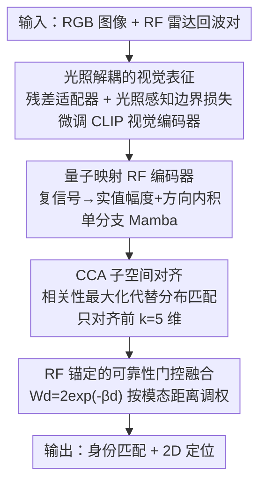

# VRCLIP: Multimodal Canonical Correlation Alignment for CLIP-Driven Vision-Radio Person Re-Identification

**会议**: CVPR 2026  
**论文**: [CVF Open Access](https://openaccess.thecvf.com/content/CVPR2026/html/Zhang_VRCLIP_Multimodal_Canonical_Correlation_Alignment_for_CLIP-Driven_Vision-Radio_Person_Re-Identification_CVPR_2026_paper.html)  
**代码**: 无（作者承诺开源 VRR 数据集）  
**领域**: 人体理解 / 行人重识别 / 视觉-无线电多模态融合  
**关键词**: 行人重识别, 视觉-射频融合, 典型相关分析(CCA), CLIP, 自适应门控

## 一句话总结
VRCLIP 把 RGB 图像和低频射频(RF)信号融合做行人重识别，核心是用典型相关分析(CCA)把"分布对齐"换成"相关性最大化"，在保留各模态独有特征的前提下对齐共享语义，配合 CLIP 视觉编码器的光照解耦微调和 RF 锚定的自适应门控融合，在自建的 65 万对 VRR 数据集上拿到 93.9% mAP。

## 研究背景与动机
**领域现状**：行人重识别(ReID)主流靠 RGB 图像匹配同一个人。为了应对夜间、烟雾、遮挡等情况，一些工作引入近红外(NIR)、热红外(TIR)、深度等额外模态。

**现有痛点**：可见光及其红外变体在被墙体、家具等非金属障碍物完全遮挡时仍然失效——光学传感器看不到就是看不到。低频 RF 信号能穿透非金属障碍、不受光照影响，是理想的互补模态，但 RGB 和 RF 异质性极大：RGB 富含结构纹理，RF 只编码幅度-相位、分辨率低且稀疏，二者对同一个人呈现完全不同的特征分布与几何形态。

**核心矛盾**：传统跨模态融合普遍依赖"分布对齐"（point-to-point 或分布级匹配，如 triplet loss）。但当两模态结构相似性很低（RGB-RF 正是如此）时，强行把两个本就不同的分布拉到一起会**过度正则化**，抹掉每个模态各自的判别性信息——RGB 的细粒度纹理和 RF 的穿透性频谱动态都被压平。此外 RGB-RF 配对数据极度稀缺，小数据集容易让模型记住模态噪声或场景相关的偏置。

**本文目标**：(1) 在不损伤模态独有特征的前提下对齐 RGB-RF 的共享语义；(2) 用大规模预训练知识弥补配对数据稀缺；(3) 在 RGB 间歇性失效（遮挡/暗光）时自适应地切换对 RF 的依赖。

**切入角度**：作者的关键观察是——把两模态特征投影到 CCA 学到的**典型相关子空间**后，即便原始分布天差地别，同一身份的样本在该子空间里展现出**高度一致的判别模式**（同身份对的 CCA 相关系数远高于不同身份对）。也就是说，"对齐相关性，而不是对齐分布"。

**核心 idea**：把跨模态对齐重新表述为**典型相关最大化**问题，用 CCA 子空间投影代替硬分布匹配，让模型在"语义类别可分"和"保留模态特异性"之间自适应平衡；并用 CLIP 视觉编码器作为语义锚点，把大规模视觉预训练知识迁移到 RF 域。

## 方法详解

### 整体框架
VRCLIP 是一个三阶段串行训练的框架，输入是同步采集的 RGB 图像 + RF（雷达回波）信号对，输出是行人身份匹配结果（外加 2D 位置）。三个阶段层层递进：**第一阶段**先把 CLIP 视觉编码器微调成"光照鲁棒"的——通过残差适配器和光照感知边界损失，让不同光照下同一个人的特征也能区分开；**第二阶段**冻结这个视觉编码器，训练一个轻量 Mamba RF 编码器，用 CCA 损失把 RF 特征对齐到视觉语义子空间；**第三阶段**用 RF 特征作为稳定锚点，根据 RGB 和 RF 的距离动态分配融合权重。三个阶段对应论文三个核心贡献组件，再加上 RF 编码器里的量子映射模块。

### 关键设计

**1. 光照解耦的视觉表征：让 CLIP 在暗光下也认得出同一个人**

直接拿 CLIP 视觉编码器抽 RGB 特征对光照极其敏感——t-SNE 显示不同光照下的特征质心彼此挨得很近（跨光照可分性弱），而同一光照内的特征又过度分散，导致类内距离超过类间阈值、在视觉模糊区域特征混淆。作者在 ViT-B/16 的浅层（前 $K$ 层）插入轻量残差适配器做定向适配，同时保留 CLIP 预训练知识：对第 $i$ 层特征 $x_i$，先算残差表示 $x_i^{res}=\text{Norm}(\text{Act}(x_iW^i))$，再加权融合 $x_i^{enh}=\lambda x_i+(1-\lambda)x_i^{res}$，$\lambda$ 平衡泛化性与任务适配。目标层面引入 **Lighting-Aware Margin Loss**，显式拉开不同光照域质心之间的距离：

$$L_{corr}=1-\frac{\sum_{i=1}^{B}(\delta_i-\bar{\delta})(r_i-\bar{r})}{\sqrt{\sum_i(\delta_i-\bar{\delta})^2}\sqrt{\sum_i(r_i-\bar{r})^2}}$$

其中 $\delta_i=\|f_\theta(x_i^{(d_i)})-f_\theta(x_i^{(1)})\|_2$ 是退化图与原图特征的距离，$r_i=1/d_i$，$d_i$ 是光照退化系数（越小退化越重）。这个损失本质上是在度量"光照退化程度"与"特征质心位移"之间的相关性并促使二者解耦。训练时 $d_i$ 从 $[0,1]$ 随机采样，测试时在 $\{0.1,0.3,0.5,0.8,1.0\}$ 五个固定系数上评估并选平均最优的 checkpoint，外加一个线性分类头算 ID 的交叉熵。消融显示去掉这一阶段（LoRA 适配 + margin loss）mAP 掉 5.3%。

**2. CCA 子空间对齐：对齐相关性而非分布，保住模态特异性**

这是全文的灵魂。传统融合强行做分布匹配会抹掉 RF/RGB 各自独有的判别信息。作者先用实验证明了一个洞察：用 ResNet50/VGG-16 抽两模态特征做 CCA，同身份对的相关系数 $\rho_i$ 显著高于不同身份对 $\rho_j$（$\rho_j\ll\rho_i$），说明 CCA 子空间捕获的是**模态不变的语义特征**；且前 $k=5$ 个典型相关系数的累计贡献率超过 99%（$\frac{\sum_{i=1}^{5}\rho_i^2}{\sum_j\rho_j^2}>0.99$），意味着跨模态语义高度集中在前几维，只对齐前 $k$ 维就够，还能顺带抑制低信噪比 RF 信号里的高频噪声。基于此，对齐目标定为**最大化典型相关的平方和**（等价于最小化其负值）：

$$L_{CCA}(X,Y)=-\sum_{i=1}^{k}\rho_i^2$$

其中 $X\in\mathbb{R}^{B\times d_{rf}}$ 是 RF 特征、$Y\in\mathbb{R}^{B\times d_{clip}}$ 是 CLIP 视觉特征。$\rho_i$ 是矩阵 $T=\Sigma_{XX}^{-1/2}\Sigma_{XY}\Sigma_{YY}^{-1/2}$ 的奇异值，$\Sigma_{XX},\Sigma_{YY}$ 是模态内协方差、$\Sigma_{XY}$ 是模态间协方差，均在中心化特征上计算并加正则项 $\lambda I$ 保证可逆、防过拟合。与硬对齐相比，它只对齐相关性最大的方向，既缓解优化难度，又让 RGB 保留细粒度纹理、RF 保留穿透性频谱动态。消融把 CCAL 换成常用的 InfoNCE，mAP 掉 7.8%，更关键的是定位误差从 0.205m 涨到 0.236m（+15.1%），说明 CCAL 在对齐语义的同时更好地保住了 RF 的空间定位信息。

**3. 量子映射 RF 编码器：单分支搞定幅度+相位**

RF 信号是复值且序列很长。已有的 RFMamba 用幅度/相位双分支，计算量翻倍。作者受量子力学中波函数实值测量的启发设计**量子映射模块**：先把复信号 $c_i$ 转成实值幅度 $|c_i|=\sqrt{(\text{Re}(c_i))^2+(\text{Im}(c_i))^2}$，再通过与可学习向量 $v$ 的内积 $\langle c_i,v\rangle=\text{Re}(c_i)v_{Re}+\text{Im}(c_i)v_{Im}$ 保留方向（相位）信息。这样一个**单分支** RF 编码器就能同时捕获幅度和相位，参数仅 4.94M、1.34 GFLOPs。主干用线性复杂度的 SSM(Mamba) 处理长序列，再接一个轻量 MLP 用 MSE 监督回归行人位置坐标，把 RF 天然的空间线索利用起来。

**4. RF 锚定的可靠性门控融合：RGB 不可靠时就多信 RF**

现实中 RGB 在遮挡/暗光下会间歇性失效。作者利用 RF 信号的固有鲁棒性，把 RF 特征当作**稳定锚点**来评估 RGB 的可靠性：当 RGB 和 RF 的嵌入分布靠得近，说明 RGB 可信、给高权重；分布发散则降低 RGB 权重、更依赖 RF。门控权重为

$$W_d=2\exp(-\beta d)\in(0,2)$$

$\beta$ 是常数（经验取 5），$d=\|\mu_{rgb}-\mu_{rf}\|_2$ 是当前 mini-batch 内两模态质心的欧氏距离，质心 $\mu_{rgb},\mu_{rf}$ 在 batch 和时间维上对特征取平均。这个自适应门控随跨模态相似度动态调节 RGB 贡献。消融把它换成朴素直接拼接，mAP 暴跌 11.9%——是所有组件里掉点最多的，说明在间歇性模态缺失场景下，自适应门控是稳健融合的关键。

### 损失函数 / 训练策略
三阶段分别优化：阶段一光照感知边界损失 $L_{corr}$ + ID 交叉熵；阶段二冻结视觉编码器、训练 RF 编码器，用 $L_{CCA}$ 对齐 + 位置回归 MSE；阶段三训练门控融合。整体用 PyTorch、AdamW（初始 lr $3\times10^{-4}$、weight decay $1\times10^{-4}$）+ 余弦退火，batch size 50，训练 50 epoch。

## 实验关键数据

### 主实验
VRR 数据集上对比单模态基线 CAL(RGB-only)、RFMamba(RF-only) 与多模态融合基线 DeMo、MambaPro，覆盖室内（全可见/遮挡/动态遮挡/曝光）和室外（晨/午/夜）多种场景。

| 场景(平均) | 指标 | VRCLIP | RFMamba | DeMo | MambaPro | CAL |
|--------|------|------|------|------|------|------|
| 全场景平均 | mAP | **93.9** | 93.0 | 78.8 | 75.9 | 70.9 |
| 全场景平均 | F1 | **81.5** | 77.7 | 68.8 | 66.5 | 55.3 |
| 室内遮挡 | mAP | **94.1** | 92.8 | 24.3 | 19.1 | 8.4 |
| 室外夜间 | mAP | **94.1** | 93.6 | 74.9 | 68.5 | 76.5 |

最能说明问题的是室内遮挡场景：RGB-only 的 CAL 直接崩到 8.4% mAP，DeMo/MambaPro 这类为 RGB+红外设计的融合模型也只有 24.3/19.1，而 VRCLIP 靠 RF 撑到 94.1%。相比 DeMo 和 MambaPro，平均 mAP 分别高 19.1% 和 23.7%，F1 高 18.4% 和 22.5%。

THP 跨数据集泛化（9 人重采样子集）也验证了优势：

| 方法 | mAP | Prec | F1 | CMC-1 |
|------|------|------|------|------|
| VRCLIP | **98.7** | 94.1 | 92.3 | 91.9 |
| RFMamba | 97.6 | 95.6 | 95.3 | 95.3 |
| DeMo | 95.4 | 88.8 | 80.7 | 81.3 |
| MambaPro | 87.1 | 78.7 | 70.8 | 71.3 |
| CAL | 65.1 | 66.4 | 27.6 | 32.5 |

### 消融实验

| 配置 | mAP | 说明 |
|------|------|------|
| VRCLIP (Full) | 94.1 | 完整模型 |
| w/o Radio | 78.0 | 去掉 RF 模态，掉 16.1% |
| w/o Vision | 76.4 | 去掉视觉模态，掉 17.7% |
| w/o LoRA(光照解耦) | 88.8 | 去掉残差适配+margin loss，掉 5.3% |
| w/o CCAL | 87.3 | CCA 对齐换 InfoNCE，掉 7.8%、定位误差 +15.1% |
| w/o AFM(门控) | 84.1 | 自适应融合换直接拼接，掉 11.9% |

### 关键发现
- **门控融合(AFM)贡献最大**：去掉后掉 11.9%，远超去掉光照解耦(5.3%)和 CCAL(7.8%)，说明间歇性模态缺失场景下，"什么时候信谁"比"怎么对齐"更要命。
- **CCAL 不只为对齐**：换成 InfoNCE 不仅 mAP 掉 7.8%，定位误差还从 0.205m 涨到 0.236m，证明相关性对齐确实保住了 RF 的空间信息（硬对齐会把它一起抹掉）。
- **RF 是遮挡场景的救命稻草**：去掉 Radio（78.0）和去掉 Vision（76.4）掉点都很大，但极端遮挡下纯 RF 仍稳在 90%+，而纯 RGB 崩到个位数。
- RF 定位平均绝对误差仅 0.205m，室内遮挡和室外夜间仍保持亚米级精度。

## 亮点与洞察
- **"对齐相关性而非分布"是个可迁移的范式**：当两模态结构相似性极低（RGB-RF、文本-蛋白序列、音频-脑信号等）时，硬分布对齐必然损伤特异性；CCA 子空间对齐提供了一条"只对齐共享语义方向、保留各自独有信息"的通用路子，且前 $k$ 维就够（99% 能量集中）这一发现让它计算可控。
- **量子映射模块巧在用一个内积保住相位**：复信号实值化通常会丢相位，作者用幅度+可学习方向内积把相位信息编码进实值表示，从而把双分支砍成单分支、参数降到 4.94M，是个轻量化的实用 trick。
- **RF 当锚点而非平等融合**：传统多模态默认各模态对等，这里反过来——承认 RF 更鲁棒、把它当"裁判"去评判 RGB 可不可信，这种非对称设计在主导模态明确的场景里值得借鉴。
- 数据集贡献实打实：VRR 是首个大规模视觉-射频 ReID 数据集，65 万对同步样本、31 人、含室内外/多光照/多遮挡，对推动这个冷门方向价值很大。

## 局限与展望
- **参与者规模小**：VRR 仅 31 人、THP 仅 9 人。ReID 真实部署动辄成千上万身份，31 人的闭集很难说明开放世界下 RF 特征的判别力是否够用。
- **依赖同步的雷达硬件**：方法假设 RGB 和 RF 帧严格时间同步且共视场，部署需要专门的雷达-相机标定与同步系统，迁移成本高，论文未讨论同步误差的鲁棒性。
- **"量子映射"名不副实**：该模块本质是复数取模+可学习投影，借用量子力学只是类比，并无真正的量子计算成分，命名容易误导。
- **门控只用 batch 质心距离**：$W_d$ 基于 mini-batch 内两模态质心的欧氏距离，是个粗粒度的全局信号，无法对单个样本的可靠性做细粒度判断；遮挡/暗光往往是局部、瞬时的，逐样本或逐区域门控可能更准。
- 三阶段串行训练略繁琐，且第二阶段冻结视觉编码器，视觉与 RF 无法端到端联合优化，可能限制上限。

## 相关工作与启发
- **vs RFMamba**：RFMamba 是 RF-only、用幅度/相位双分支（计算翻倍）。本文借鉴其 Mamba 思路但用量子映射砍成单分支，并把 RF 与视觉融合；纯 RF 鲁棒但缺语义，VRCLIP 用 CLIP 补上语义、整体 mAP 更高。
- **vs DeMo / MambaPro**：这两个多模态融合模型原本为 RGB+近红外/热红外设计，依赖结构纹理线索；直接套到无纹理的 RF 上做细粒度融合失效，遮挡场景下掉到 20% 左右。VRCLIP 的 CCA 对齐不假设结构相似性，因而在 RGB-RF 这种极端异质组合上大幅领先（+19~24% mAP）。
- **vs CAL (RGB-only)**：CAL 在光照充足场景已具竞争力，但遮挡/夜间彻底失效；VRCLIP 既在良好条件下进一步提升，又在恶劣条件下靠 RF 兜底，体现互补融合的价值。
- **启发**：CCA-as-alignment 这一思路可推广到任何"主导模态明确 + 辅助模态结构差异大"的融合任务；RF 锚定门控的非对称可靠性评估也适用于传感器质量波动大的多传感融合（自动驾驶里 LiDAR/相机/雷达的动态权重分配）。

## 评分
- 新颖性: ⭐⭐⭐⭐⭐ 把跨模态对齐重构成 CCA 相关性最大化、并首做视觉-射频 ReID，角度新颖且有实验洞察支撑
- 实验充分度: ⭐⭐⭐⭐ 多场景主对比 + 跨数据集泛化 + 充分消融，但参与者规模偏小（31/9 人）
- 写作质量: ⭐⭐⭐⭐ 逻辑清晰、动机层层推进，唯"量子映射"命名稍夸张
- 价值: ⭐⭐⭐⭐⭐ 开源首个大规模 VRR 数据集 + 可迁移的相关性对齐范式，对冷门但实用的视觉-射频方向推动明显

<!-- RELATED:START -->

## 相关论文

- [\[CVPR 2026\] Prompt-Anchored Vision–Text Distillation for Lifelong Person Re-identification](prompt-anchored_vision-text_distillation_for_lifelong_person_re-identification.md)
- [\[CVPR 2026\] View-Aware Semantic Alignment for Aerial-Ground Person Re-Identification](view-aware_semantic_alignment_for_aerial-ground_person_re-identification.md)
- [\[CVPR 2026\] Vision-Language Attribute Disentanglement and Reinforcement for Lifelong Person Re-Identification](vision-language_attribute_disentanglement_and_reinforcement_for_lifelong_person_.md)
- [\[CVPR 2026\] Composite-Attribute Person Re-Identification via Pose-Guided Disentanglement](composite-attribute_person_re-identification_via_pose-guided_disentanglement.md)
- [\[CVPR 2026\] Towards Cross-Modal Preservation, Consistency and Alignment for Privacy-Preserving Visible-Infrared Person Re-Identification](towards_cross-modal_preservation_consistency_and_alignment_for_privacy-preservin.md)

<!-- RELATED:END -->
