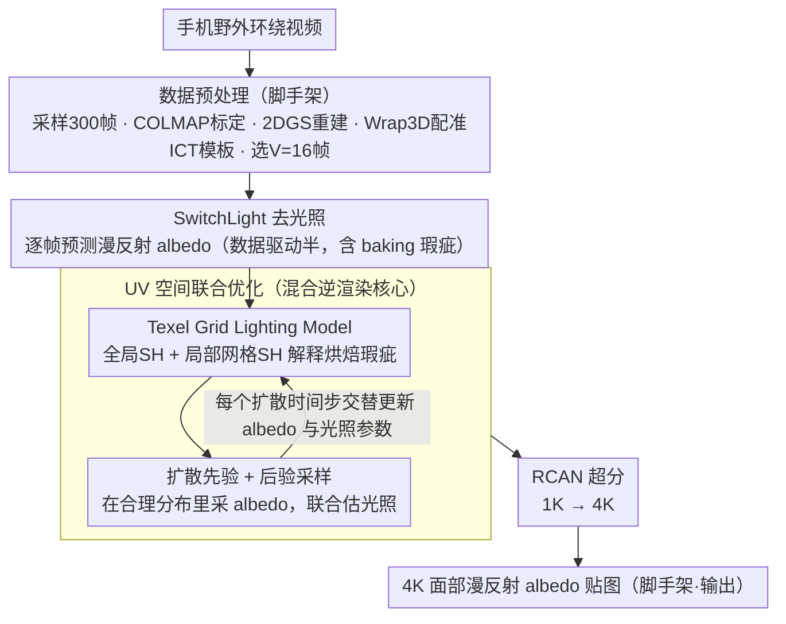

# WildCap: Facial Albedo Capture in the Wild via Hybrid Inverse Rendering

**会议**: CVPR2026  
**arXiv**: [2512.11237](https://arxiv.org/abs/2512.11237)  
**代码**: [已开源](https://arxiv.org/abs/2512.11237)（论文中声明 code released）  
**领域**: 人体理解  
**关键词**: facial albedo capture, inverse rendering, diffusion prior, texel grid lighting, in-the-wild

## 一句话总结

提出 WildCap，通过混合逆渲染框架（数据驱动 SwitchLight 去光照 + 基于模型的 texel grid lighting 优化 + 扩散先验采样），从手机野外视频中重建高质量 4K 面部漫反射 albedo 贴图，大幅缩小野外捕捉与受控光照方法之间的质量差距。

## 背景与动机

1. **面部 albedo 捕捉是数字人核心步骤**：将真人克隆到数字世界需要高质量面部反射率贴图，此问题已被研究超过二十年
2. **现有高质量方法依赖受控光照**：从 Light Stage 专业设备到手机闪光灯，都需要对场景光照做假设，增加捕捉成本、限制可用性
3. **基于模型的逆渲染方法在复杂光照下不稳定**：优化光照和反射率贴图以匹配观测图像，在存在阴影等复杂光传输效应时优化不稳定且高度病态
4. **数据驱动方法鲁棒但存在 baking 瑕疵**：如 SwitchLight 等网络虽能直接预测反射率分量，但不可避免地将部分光照效应（如阴影）烘焙到预测结果中
5. **两类方法各有优缺需互补**：基于模型方法可产生物理合理的分解但不鲁棒，数据驱动方法鲁棒但不完美，二者结合是自然思路
6. **野外捕捉的实用价值巨大**：如果能从手机随手拍的视频中完成高质量面部捕捉，将极大降低数字人制作门槛

## 方法详解

### 整体框架

WildCap 想做的事是：只用手机随手拍的环绕视频，就重建出过去要靠 Light Stage 专业光照才能拿到的高质量 4K 面部漫反射 albedo。它的思路是把两类各有短板的方法拼起来——数据驱动方法（如 SwitchLight）鲁棒但会把阴影等光照「烘焙」进预测，基于模型的逆渲染物理上合理但在复杂光照下高度病态。整条流水线分三步：先做数据预处理，从手机环绕视频均匀采样 300 帧（960×720），用 COLMAP 标定相机、2DGS 重建网格、Wrap3D 配准 ICT 模板，最后选 V=16 帧用于反射率估计；再用 SwitchLight 对每帧预测漫反射 albedo $\{I^i\}$，把杂乱的野外光照压缩成更受约束的条件；最后在 UV 空间里把 SwitchLight 残留的 baking 瑕疵当成「光照效应」来解释，联合优化 texel grid lighting 和扩散先验采样，得到干净的 albedo 贴图 $A$。最终再用 RCAN 把 1K 贴图超分到 4K——相比 DoRA 直接采样 4K 要 508 分钟，WildCap 只需 8 分钟（24GB RTX 4090）。

### 关键设计

**1. Texel Grid Lighting Model：用非物理的局部光照解释烘焙瑕疵**

SwitchLight 的预测图并不是真实光源照出来的，传统的球谐（SH）环境光模型解释不了它那些非物理的阴影 baking 瑕疵。TGL 的办法是给有瑕疵的面部区域额外分配局部 SH 光照，让瑕疵被重新解释成「干净 albedo + 一块暗色局部光照」的组合。具体是一个全局 SH 光照 $\gamma^g \in \mathbb{R}^{N_c}$ 建模整脸基础光照，再叠加一个 UV 空间 2D 网格 $V \in \mathbb{R}^{\frac{H}{g} \times \frac{W}{g} \times N_c}$ 存局部 SH 参数，通过二值 mask $M$ 调制：$\gamma = \gamma^g + \gamma^V \cdot M[u][v]$。网格大小 $g=96$、采用 2 阶 SH（$N_c=27$）、双线性插值查询；mask 既可手动（Photoshop 多边形套索）也可自动（DiFaReli 阴影检测 + UV 空间提升）。消融显示只用全局 SH 会留下明显阴影残留，加上网格后才解释得了这些瑕疵。

**2. 扩散先验 + 后验采样：把病态优化拉回良定**

光照模型表达力一强，光照与 albedo 的 scale ambiguity 就让优化更病态，必须加先验约束。WildCap 在 48 个 Light Stage 扫描上训练一个 64×64 的 patch 级扩散模型，建模 7 通道信号（3ch diffuse albedo + 3ch normal + 1ch specular albedo）；采样时不从纯噪声起步，而是先从训练集里挑肤色最接近的扫描 $x_0^{ref}$，加 $T_{init}=0.6T$ 步噪声再开始，省采样步数。每个扩散时间步里同时更新反射率贴图 $x_t$（扩散去噪 + 光度梯度引导）和光照参数 $\theta_t$（梯度下降 + 正则化），把「在合理分布里采 albedo」和「联合估光照」绑在一起，原本的病态问题就被拉回良定。

### 损失函数 / 训练策略

- **光度损失**：$\mathcal{L}_{pho} = \|I_{UV} - \Gamma_\theta(A, N_c)\|_2^2$
- **光照正则化**：$\mathcal{L}_{reg} = 0.1 \cdot \mathcal{L}_{TV} + \mathcal{L}_{neg}$
    - TV 正则化保证光照空间平滑
    - 负着色正则化 $\mathcal{L}_{neg}$ 确保局部光照产生暗色着色（解释阴影 baking）
- **纹理图构建**：最小化 LPIPS + 梯度空间 L1 损失

## 实验关键数据

### 定量对比（面部重建，6 个被试平均）

| 方法 | PSNR ↑ | SSIM ↑ | LPIPS ↓ |
|------|--------|--------|---------|
| DeFace* | 22.20 | 0.9279 | 0.1192 |
| FLARE* | 27.81 | 0.9411 | 0.0929 |
| **WildCap (Ours)** | **28.79** | **0.9520** | **0.0610** |

### 定量对比（合成数据 Digital Emily，albedo 重建）

| 方法 | PSNR ↑ | SSIM ↑ | LPIPS ↓ |
|------|--------|--------|---------|
| DeFace* | 28.43 | 0.9791 | 0.0826 |
| FLARE* | 22.48 | 0.9742 | 0.0571 |
| **WildCap (Ours)** | **28.71** | **0.9802** | **0.0388** |

### 消融实验

- **w/o Hybrid**（直接对原始图像优化）：无法有效分离复杂光照下的高光和阴影
- **w/o TGL**（仅全局 SH 光照）：无法解释非物理 baking 瑕疵，阴影残留明显
- **w/o Prior**（无扩散先验，直接 Adam 优化每个 texel）：产生严重伪影，无法保证收敛到合理反射率贴图
- **Grid size 消融**：$g=1/24$ 表达力不足，$g=384$ 过于平滑丢失细节，$g=96$ 取得最佳平衡

## 亮点

1. **巧妙的混合逆渲染框架**：将数据驱动方法的鲁棒性与基于模型方法的物理合理性有机结合，思路简洁优雅
2. **Texel Grid Lighting Model 新颖且有效**：突破物理光照模型的局限，用非物理但更具表达力的局部 SH 网格解释网络预测中的 baking 瑕疵
3. **扩散先验优雅解决 scale ambiguity**：在合理分布中采样 albedo，同时联合优化光照，将病态问题转化为良定问题
4. **效率高**：仅需 8 分钟（vs DoRA 508 分钟），同时质量与受控光照方法（DoRA）可比
5. **实验充分**：包含多种消融、合成数据定量评估、与 DoRA 的跨设置对比、多样化场景展示、失败案例分析

## 局限与展望

1. **依赖 SwitchLight 预处理**：SwitchLight 是闭源商业模型仅提供 API，限制了方法的可复现性和扩展性
2. **自动阴影检测依赖 DiFaReli**：迭代扩散采样速度慢，且可能遗漏环境遮挡等效应
3. **光照表示连续性限制**：当 SwitchLight 预测中存在尖锐阴影边界时（如正午阳光），连续网格表示难以完全去除
4. **训练数据规模有限**：扩散先验仅训练于 48 个 Light Stage 扫描，种族/肤色多样性欠佳（33 白人 / 9 非裔 / 6 亚裔）
5. **需提供目标肤色**：虽可手动或自动获取，但增加了额外步骤

## 与相关工作的对比

- **vs DeFace**：DeFace 将面部分割为有限区域（5-10 个），每区域对应一个可训练网络，表达力有限；WildCap 的 texel grid 更细粒度
- **vs FLARE**：FLARE 使用 split-sum 近似建模光照，物理模型无法解释非物理 baking 瑕疵
- **vs DoRA**（受控光照方法）：WildCap 在更具挑战性的野外设置下达到与 DoRA 可比的质量，且能更好保留个人特征（如痣），同时效率提升约 63 倍
- **vs Rainer et al.**：使用小型 MLP 建模着色，在扩散后验采样框架内优化困难；WildCap 的网格表示更易优化
- **vs Xu et al. / Rainer et al. 的测试场景**：先前方法仅在轻度阴影场景测试，WildCap 处理了更具挑战性的强投射阴影

## 评分

- 新颖性: ⭐⭐⭐⭐ — 混合逆渲染框架和 texel grid lighting model 思路新颖，扩散先验联合优化有技巧性
- 实验充分度: ⭐⭐⭐⭐⭐ — 消融全面、定量/定性对比充分、含合成数据评估和失败案例分析
- 写作质量: ⭐⭐⭐⭐ — 整体清晰，动机铺陈合理，补充材料详实
- 价值: ⭐⭐⭐⭐ — 显著降低面部外观捕捉门槛，对数字人制作有实际意义

<!-- RELATED:START -->

## 相关论文

- [\[ICCV 2025\] Monocular Facial Appearance Capture in the Wild](../../ICCV2025/human_understanding/monocular_facial_appearance_capture_in_the_wild.md)
- [\[CVPR 2026\] Occluded Human Body Capture with Frequency Domain Denoising Prior](occluded_human_body_capture_with_frequency_domain_denoising_prior.md)
- [\[CVPR 2026\] RAM: Recover Any 3D Human Motion in-the-Wild](ram_recover_any_3d_human_motion_in-the-wild.md)
- [\[CVPR 2026\] HyperGait: Unleashing the Power of Parsing for Gait Recognition in the Wild via Hypergraph](hypergait_unleashing_the_power_of_parsing_for_gait_recognition_in_the_wild_via_h.md)
- [\[CVPR 2026\] Bridging Facial Understanding and Animation via Language Models](bridging_facial_understanding_and_animation_via_language_models.md)

<!-- RELATED:END -->
