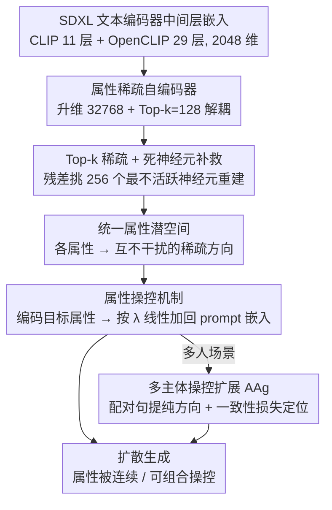

# All-in-One Slider for Attribute Manipulation in Diffusion Models

**会议**: CVPR 2026  
**arXiv**: [2508.19195](https://arxiv.org/abs/2508.19195)  
**代码**: [https://github.com/ywxsuperstar/ksaedit](https://github.com/ywxsuperstar/ksaedit)  
**领域**: 图像生成 / 扩散模型  
**关键词**: 属性操控, 稀疏自编码器, 文本嵌入解耦, 连续控制, 零样本泛化  

## 一句话总结
提出 All-in-One Slider 框架，通过在文本嵌入空间上训练一个属性稀疏自编码器（Attribute Sparse Autoencoder），将多种人脸属性解耦为稀疏的语义方向，实现单一轻量模块对 52+ 种属性的细粒度连续控制，并支持多属性组合和未见属性的零样本操控。

## 背景与动机
T2I 扩散模型生成质量已很高，但用户对生成图像属性的精细控制仍是难题。传统方法要么通过 prompt 修改导致粗粒度且不可控的变化（如加"with a big smile"会连带改变发型、姿态、身份），要么采用"One-for-One"范式——每个属性训练一个独立的 slider 模块（如 ConceptSlider 用 LoRA、AttributeControl 用属性向量）。后者导致：(1) 参数冗余随属性数线性增长；(2) 新属性需重新训练；(3) 多属性组合困难。

## 核心问题
如何用一个统一的轻量模块实现对多种视觉属性的解耦、连续、可组合控制？关键挑战在于属性的解耦——让不同属性对应不同的、相互独立的表示方向，使得调整一个属性不影响其他属性。

## 方法详解

### 整体框架

All-in-One Slider 想用一个轻量模块取代「一个属性一个 slider」的旧范式，关键是把人脸属性在**文本嵌入空间**里解耦成互不干扰的稀疏方向。整个流程分两步走：先在大量文本嵌入上无监督训练一个属性稀疏自编码器（Attribute Sparse Autoencoder），把 SDXL 文本编码器的中间层嵌入分解到一个高维稀疏空间，得到统一的属性潜空间；推理时给定目标属性文本（如 "smile"）和控制强度 λ，编码出它对应的稀疏方向，直接加回原始 prompt 嵌入即可操控生成。整套操作只发生在文本编码器中间层，不碰扩散 UNet。在多人场景下，再用一个注意力池化聚合器（Attention Pooling Aggregator, AAg）把属性方向精确落到指定主体上，避免「改一个人误伤旁人」。

### 关键设计

**1. 属性稀疏自编码器：用高维稀疏分解换来属性解耦**

传统 One-for-One 范式每个属性都要单独训一个 LoRA/向量，参数随属性数线性膨胀且无法组合。这里借鉴 LLM 可解释性里的稀疏自编码器思路：从 SDXL 双文本编码器（CLIP 第 11 层 + OpenCLIP 第 29 层）取出 2048 维嵌入，线性编码升到 32768 维（扩展因子 16×），再用 Top-k（$k=128$）只保留最活跃的维度，最后线性解码回原维度。升维加稀疏激活会自然把不同语义概念分配到不同的基向量上——这正是「调一个属性不动其他属性」所需要的解耦结构。

**2. Top-k 稀疏与死神经元补救：让稀疏空间真正学满**

稀疏自编码的形式很简洁：编码 $z_{ALS} = \text{Top-k}(\text{ReLU}(W_{enc}(x - b_{pre}) + b_{enc}))$，解码 $\hat{x} = W_{dec} z_{ALS} + b_{pre}$。但稀疏训练有个老毛病——大量神经元从不被激活（死神经元），白白浪费容量。为此每步都算残差 $r = x - \hat{x}$，挑出 $k_{aux}=256$ 个最不活跃的神经元专门去重建这个残差，用辅助损失 $\mathcal{L}_{aux} = \|r - \hat{r}\|_2^2$ 逼它们学到有意义的方向，把空间利用率撑起来。

**3. 属性操控机制：在稀疏方向上做一次线性加法**

有了解耦的稀疏空间，操控就退化成一次线性叠加。给定目标属性文本 $A$，编码得到稀疏方向 $\text{ENC}(x_A)$，按 $x_{manipulated} = x + W_{dec}(\lambda \times \text{ENC}(x_A))$ 把它加回嵌入，λ 越大属性越强、越小越弱。因为不同属性激活的是不同的神经元子集，多属性组合只要把各自的方向相加就行、彼此不冲突——这正是旧范式很难做到的可组合性。

**4. 多主体属性操控扩展：把方向精确落到指定的人身上**

单纯加方向在多人场景会「误伤」——想改女人的妆容却连男人一起改了。为此引入 Attention Pooling Aggregator（AAg），用含/不含目标属性的配对句子提取纯净的属性方向 $\Delta z = \text{AAg}(z^+) - \text{AAg}(z^-)$，再配合一致性损失 $\mathcal{L}_{cons}$ 锁住非目标区域，从而把操控精确定位到指定主体（如「女人」或「男人」）上。

### 损失函数 / 训练策略
- 总损失：$\mathcal{L} = \mathcal{L}_{mse} + \alpha \mathcal{L}_{aux}$，其中 $\alpha = 0.1$
- 训练数据：52 种人脸属性 × 1000 样本/属性 = 52,000 文本样本
- 训练量：4 亿 token，约 97,656 步
- 优化器：Adam，学习率 $4 \times 10^{-4}$，批大小 4096
- 硬件：单卡 RTX 4090

## 实验关键数据

### 单属性 / 多属性操控定量对比

| 设置 | 方法 | Old QS/IS | Smile QS/IS | Makeup QS/IS |
|------|------|-----------|-------------|--------------|
| 单属性 | CSlider | 3.79/0.43 | 4.14/0.50 | 4.54/0.65 |
| 单属性 | AttControl | 4.04/0.60 | 4.40/0.70 | 4.27/0.60 |
| 单属性 | **Ours** | **4.05/0.72** | 4.26/0.64 | **4.29/0.74** |
| 多属性 | CSlider | 4.15/0.50 | 3.80/0.52 | 4.06/0.48 |
| 多属性 | AttControl | 3.67/0.38 | 4.06/0.63 | 4.25/0.51 |
| 多属性 | **Ours** | **4.21/0.69** | **4.43/0.63** | **4.30/0.64** |

多属性场景优势明显——Old+Makeup 的 QS 4.43 vs 次优 4.06，大幅领先。

### vs 原始嵌入对比

| 方法 | 平均 QS | 平均 IS |
|------|---------|---------|
| 原始嵌入 | 3.990 | 0.502 |
| SAE方向 | **4.202** | **0.698** |

SAE 方向比直接用原始文本嵌入分别提升 0.212 QS 和 0.196 IS。

### 消融实验要点
- **层选择**：10/28 组合最优，过深层语义更强但身份保持下降
- **控制强度 λ**：0.15 欠编辑，0.30 强属性表达但身份保持降低；age 属性对 λ 最敏感（与身份特征高度纠缠）
- **连续性**：编辑区域几何变化的线性度 $R^2 = 0.973$，优于 CSlider (0.966) 和 AttControl (0.962)
- **模型泛化**：同一 SAE 可迁移到 SD v1.4、SDXL-Turbo、FLUX（用 T5 编码器第23层）

## 亮点
- **设计洞察**：将 LLM 可解释性中的稀疏自编码器思想迁移到 T2I 属性控制——高维稀疏空间自然实现语义解耦，这是一个非常有创意的跨领域迁移
- **一次训练、全属性控制**：打破 One-for-One 范式，52 种属性 + 零样本泛化到种族、名人等未见属性
- **极轻量**：SAE 参数远小于为每个属性训练一个 LoRA 的总参数量
- **可组合性优秀**：多属性叠加无冲突，因稀疏表示中不同属性激活不同的维度子集
- **通用性**：可扩展到摄影风格控制（40 种风格）和多主体场景

## 局限与展望
- **属性纠缠残余**：age 属性与身份特征高度纠缠，大 λ 下身份保持显著下降
- **训练数据依赖**：虽支持零样本泛化，但初始 52 种属性仍需精心设计文本模板
- **仅在文本嵌入空间操作**：不涉及视觉特征层的操控，可能限制对空间局部属性的精细控制
- **评估指标主观**：主要依赖 VLM（Qwen2.5-VL）评分和 ArcFace 身份一致性，缺乏更多人类评估
- 未探索与 ControlNet 等空间条件方法的结合

## 与相关工作的对比
- **vs ConceptSlider (ECCV 2024)**: ConceptSlider 每个属性需训练一个 LoRA adapter，是 One-for-One 范式的典型代表；All-in-One Slider 单模块覆盖所有属性，多属性 QS 显著更高
- **vs AttributeControl (CVPR 2025)**: AttControl 也实现连续控制但需属性级监督和配对数据；本文通过无监督稀疏自编码器实现类似效果且支持零样本泛化
- **vs SAeUron (CVPR 2025)**: SAeUron 用 SAE 做概念遗忘(unlearning)，侧重模型可解释性；本文将 SAE 用于主动可控的属性操控，方向不同但技术基础相近

## 启发与关联
- 稀疏自编码器在 T2I 文本嵌入空间的成功应用，提示了类似方法可用于 VLM 的视觉嵌入解耦——例如用 SAE 发现 VLM 视觉特征中的可解释语义方向
- 无监督属性发现 + 零样本泛化的能力，可以考虑与 VLM agent 结合——让 agent 自动发现和操控视觉属性
- Top-k 稀疏 + 死神经元补救的训练策略可复用到其他需要解耦表示的任务

## 评分
- 新颖性: ⭐⭐⭐⭐ 将 LLM 稀疏自编码器思想迁移到 T2I 属性控制，打破 One-for-One 范式
- 实验充分度: ⭐⭐⭐⭐ 覆盖单属性/多属性/零样本/多模型/多主体/风格等场景，消融完整
- 写作质量: ⭐⭐⭐⭐ 动机清晰，框架描述详细，但部分技术细节散布在附录中
- 价值: ⭐⭐⭐⭐ 提供了一种更高效、更灵活的属性控制范式，有实际应用价值

<!-- RELATED:START -->

## 相关论文

- [\[CVPR 2026\] One Algorithm to Align Them All](one_algorithm_to_align_them_all.md)
- [\[CVPR 2026\] Omni-Attribute: Open-vocabulary Attribute Encoder for Visual Concept Personalization](omni-attribute_open-vocabulary_attribute_encoder_for_visual_concept_personalizat.md)
- [\[ICCV 2025\] CompSlider: Compositional Slider for Disentangled Multiple-Attribute Image Generation](../../ICCV2025/image_generation/compslider_compositional_slider_for_disentangled_multiple-attribute_image_genera.md)
- [\[CVPR 2026\] Attribute-Preserving Pseudo-Labeling for Diffusion-Based Face Swapping](attribute-preserving_pseudo-labeling_for_diffusion-based_face_swapping.md)
- [\[ICLR 2026\] When One Modality Rules Them All: Backdoor Modality Collapse in Multimodal Diffusion Models](../../ICLR2026/image_generation/when_one_modality_rules_them_all_backdoor_modality_collapse_in_multimodal_diffus.md)

<!-- RELATED:END -->
