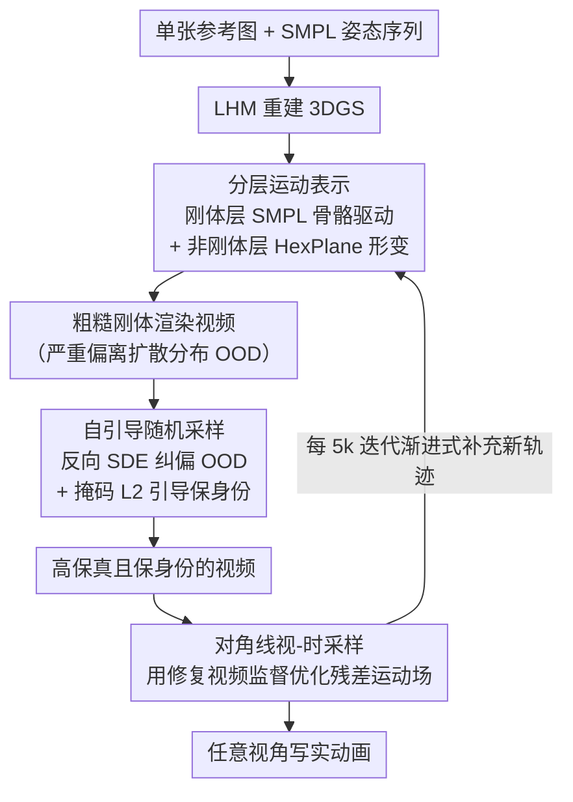

# Ani3DHuman: Photorealistic 3D Human Animation with Self-guided Stochastic Sampling

**会议**: CVPR2026  
**arXiv**: [2602.19089](https://arxiv.org/abs/2602.19089)  
**代码**: [qiisun/ani3dhuman](https://github.com/qiisun/ani3dhuman)  
**领域**: 图像生成  
**关键词**: 3D人体动画, 视频扩散先验, 随机采样, 非刚体运动, 3D高斯溅射

## 一句话总结

提出 Ani3DHuman 框架，将运动学驱动的网格动画与视频扩散先验相结合，通过自引导随机采样（Self-guided Stochastic Sampling）将低质量的刚体渲染恢复为高保真视频，从而实现逼真的非刚体服装动态建模。

## 研究背景与动机

**运动学方法的局限**：基于骨骼/SMPL 的方法可精确控制刚体运动，但无法建模衣物褶皱飘动等非刚体动态，生成结果缺乏真实感。

**物理仿真的高成本**：物理方法（如 PhysAvatar）虽能模拟衣物-人体交互，但需单独建模衣物网格、设定大量物理参数，计算和预处理成本极高。

**多视角扩散的数据瓶颈**：基于多视角视频扩散（SV4D 2.0、CharacterShot）的方法受限于 4D 训练数据稀缺，生成质量远逊于 2D 视频模型。

**姿态驱动方法的身份丢失**：PERSONA 等方法从姿态驱动 2D 视频直接重建 3D 动画，每段视频产生不同外观幻觉，导致严重的身份不一致。

**SDS 蒸馏的质量缺陷**：Score Distillation Sampling（SDS）方法（如 Disco4D）存在过饱和、过平滑等典型优化伪影，视觉效果差。

**OOD 渲染的采样难题**：初始网格渲染严重偏离扩散模型训练分布（out-of-distribution），标准确定性 ODE 采样器无法修正轨迹偏差，是核心技术瓶颈。

## 方法详解

### 整体框架

Ani3DHuman 要解决的是：怎样在不依赖稀缺 4D 数据、也不做昂贵物理仿真的前提下，让 3D 人体动画里的衣物褶皱等非刚体动态变得逼真。它的思路是把「可控但僵硬」的运动学网格动画和「写实但难控」的视频扩散先验拼起来。输入是单张参考图（经 LHM 重建出 3DGS）和一段 SMPL 姿态序列，先用分层运动表示渲染出一段姿态正确但粗糙的视频，再用自引导随机采样把它「修复」成高保真、保身份的视频，最后拿这段修复视频当监督信号去优化残差运动场，迭代得到任意视角的写实动画。

### 关键设计

**1. 分层运动表示：刚体享受运动先验，非刚体专心学细节**

把人体运动硬塞进单个运动场，既学不好骨架大动作又学不好衣物微动。这里拆成两层：刚体层通过 SMPL 骨骼参数驱动 3D 高斯，建立高斯与 SMPL-X 标准网格点的双射对应后施加骨骼变换；非刚体层用 HexPlane 参数化的隐式函数，在标准空间查询特征后经 MLP 解码出高斯属性偏移（位置、旋转），专门捕获衣物动态等非刚体形变。分层让刚体部分直接吃到强运动先验，非刚体部分只需学细微形变，比单层运动场稳得多。

**2. 自引导随机采样：给严重 OOD 的粗渲染做纠偏又不丢身份**

初始刚体渲染 $\bm{y}$ 严重偏离扩散模型的训练分布（OOD），确定性 Flow-ODE 采样只会沿错误轨迹越积越偏。对策分两半：**随机采样保质量**——对 Flow Matching 构造反向 SDE，每步向后验噪声预测 $\hat{\bm{x}}_{1|t}$ 注入随机噪声 $\hat{\bm{x}}_{1|t} \leftarrow \sqrt{\gamma(t)}\epsilon + \sqrt{1-\gamma(t)}\hat{\bm{x}}_{1|t}$（$\gamma(t)=\sigma_t$），随机项主动把样本推回边际分布 $p_t(\bm{x})$ 纠正 OOD 偏差；**自引导保身份**——高噪声在修 OOD 的同时会破坏身份，于是借 DPS 后验采样思想，每步对后验均值施加带掩码的 L2 引导 $\hat{\bm{x}}_{0|t} \leftarrow \hat{\bm{x}}_{0|t} - \lambda \nabla_{x_t}\|\mathcal{M} \odot (\bm{y} - \hat{\bm{x}}_{0|t})\|^2$，掩码 $\mathcal{M}$（由 SAM2 得到）只盖住脸、手等需保身份的区域，梯度有闭式解、算起来很轻。先验本身基于 Wan2.1-1.3B 微调，加了参考图分支和 2D 姿态序列条件，专门服务人体动画场景。

**3. 对角线视-时采样：用最少轨迹把多视角时序的不一致压到最低**

多条独立生成的轨迹彼此不一致，重建出来就会糊。这里让相机视角和时间步沿对角线一起变，用最少的轨迹数覆盖时空信息，把不一致的暴露面降到最小；并配合渐进式数据更新，每 5k 次迭代按当前模型状态生成新轨迹补进训练集。

### 损失函数

$$\mathcal{L} = \mathcal{L}_{\text{L1}} + \lambda_1 \mathcal{L}_{\text{LPIPS}} + \lambda_2 \mathcal{L}_{\text{dssim}} + \lambda_3 \mathcal{L}_{\text{mask}} + \lambda_4 \mathcal{L}_{\text{reg}}$$

其中 $\mathcal{L}_{\text{reg}}$ 为刚体区域深度差异正则化，保持刚体部分几何不变。

## 实验

### 主要对比（ActorsHQ 数据集，10 个案例）

| 方法 | PSNR↑ | SSIM↑ | LPIPS↓ | CLIP-I↑ | FID↓ | FVD↓ |
|------|-------|-------|--------|---------|------|------|
| Disco4D | 12.05 | 0.559 | 0.502 | 0.644 | 613.9 | 622.1 |
| SV4D 2.0 | 15.25 | 0.771 | 0.377 | 0.764 | 364.9 | 478.7 |
| PERSONA | 17.01 | 0.822 | 0.260 | 0.878 | 199.1 | 367.0 |
| LHM | 19.51 | 0.838 | 0.217 | 0.901 | 124.1 | 339.9 |
| **Ours** | **20.08** | 0.831 | **0.213** | **0.916** | **105.3** | **295.2** |

- 相比 LHM（次优），FID 降低 18.8，FVD 降低 44.7，CLIP-I 提升 0.015
- 重建指标（PSNR/LPIPS）全面最优，同时保持视频质量（FID/FVD）大幅领先

### 用户研究（新运动，无 GT）

| 方法 | 身份保持 | 帧质量 | 运动真实感 | 非刚体物理合理性 | 整体偏好 |
|------|---------|--------|-----------|----------------|---------|
| Disco4D | 0% | 1.5% | 4.4% | 0% | 0% |
| SV4D 2.0 | 0% | 2.9% | 16.2% | 4.3% | 5.9% |
| PERSONA | 20.6% | 30.9% | 14.7% | 19.1% | 22.1% |
| LHM | 39.2% | 29.4% | 29.4% | 14.7% | 17.6% |
| **Ours** | **40.1%** | **35.3%** | **35.3%** | **61.8%** | **54.4%** |

非刚体物理合理性以 61.8% 绝对领先，整体偏好 54.4%。

### 消融实验关键发现

1. **随机采样 vs 确定性 ODE**：去掉随机项后质量显著下降，验证了随机采样对 OOD 输入的纠偏能力是不可替代的
2. **自引导 vs 无引导**：去掉自引导后视频质量高但身份完全丢失，证明引导机制对保真度至关重要
3. **个性化先验 vs 通用先验**：替换为通用扩散模型后出现轻微退化和伪影
4. **分层运动 vs 单层运动**：单层运动场无法建模手部等精细变换，分层设计显著改善
5. **对角线采样 vs 固定时间/独立视角**：基线方法产生明显浮动体和尖刺，对角线采样重建更清晰

## 亮点

- 将运动学动画的可控性与视频扩散模型的写实非刚体生成能力优雅结合，且不依赖多视角 4D 数据
- 提出的自引导随机采样算法是为 OOD 修复场景量身设计的，在质量-保真度之间取得平衡，理论分析清晰
- 对角线视-时采样以最少轨迹数量解决多轨迹不一致问题，方案简洁有效
- 实验设计全面：定量指标 + 用户研究 + 多维度消融 + 与 6 种采样方法对比

## 局限性

- 视频扩散先验的采样时间较长，限制了实际应用效率；作者指出未来可引入少步生成技术加速
- 保留区域掩码依赖 SAM2，掩码质量会影响自引导效果
- 目前仅在 Wan2.1-1.3B 上微调，模型规模受限可能约束生成多样性
- 残差运动场基于 HexPlane，对极端非刚体变形（如宽松长裙大幅飘动）的建模能力待验证
- 渐进式训练需 25k 迭代且每 5k 更新数据集，总训练成本不低

## 相关工作

- **运动学动画**: SMPL/LBS 系列 → LHM 用 3DGS 实现单图重建+网格动画，但缺非刚体
- **物理仿真**: PhysAvatar (C-IPC solver) 可模拟衣物，代价是复杂建模+高算力
- **SDS 蒸馏**: MAV3D → DG4D/Disco4D，受制于过饱和/过平滑
- **多视角视频重建**: SV4D 2.0/CharacterShot，受限于 4D 数据稀缺
- **姿态视频重建**: PERSONA 用 2D 视频扩散但身份丢失严重
- **视频编辑采样**: SDEdit/FlowEdit/MCS/HFS-SDEdit 均基于确定性 ODE，对 OOD 渲染效果差

## 评分

- 新颖性: ⭐⭐⭐⭐ — 自引导随机采样在 Flow Matching 框架下首次提出，将随机纠偏与后验引导结合解决 OOD 修复问题
- 实验充分度: ⭐⭐⭐⭐⭐ — 6 种采样方法对比 + 5 组消融 + 用户研究 + 5 个定量指标，覆盖全面
- 写作质量: ⭐⭐⭐⭐ — 结构清晰，问题动机-方法-实验逻辑完整，图示直观
- 价值: ⭐⭐⭐⭐ — 为 OOD 条件下的扩散修复提供了通用范式，非刚体人体动画显著推进 SOTA

<!-- RELATED:START -->

## 相关论文

- [\[CVPR 2026\] FG-Portrait: 3D Flow Guided Editable Portrait Animation](fg-portrait_3d_flow_guided_editable_portrait_animation.md)
- [\[ICLR 2026\] Stochastic Self-Guidance for Training-Free Enhancement of Diffusion Models](../../ICLR2026/image_generation/stochastic_self-guidance_for_training-free_enhancement_of_diffusion_models.md)
- [\[CVPR 2026\] BiMotion: B-spline Motion for Text-guided Dynamic 3D Character Generation](bimotion_b-spline_motion_for_text-guided_dynamic_3d_character_generation.md)
- [\[CVPR 2026\] Vinedresser3D: Agentic Text-guided 3D Editing](vinedresser3d_agentic_text-guided_3d_editing.md)
- [\[CVPR 2026\] Stability-Driven Motion Generation for Object-Guided Human-Human Co-Manipulation](stability-driven_motion_generation_for_object-guided_human-human_co-manipulation.md)

<!-- RELATED:END -->
