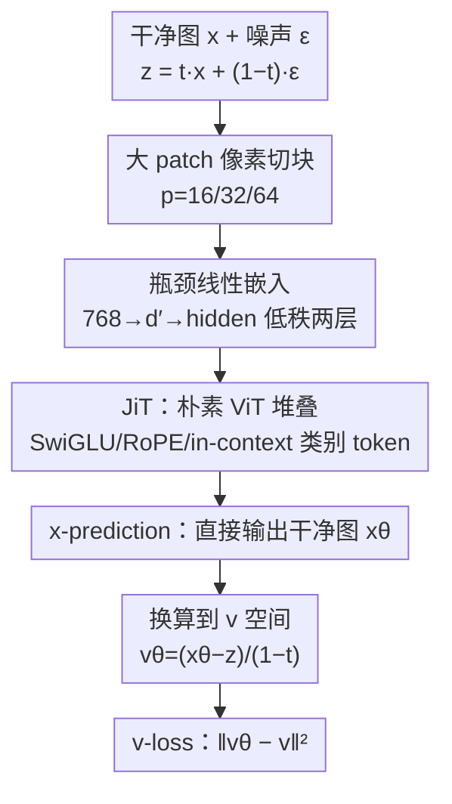

# Back to Basics: Let Denoising Generative Models Denoise

**会议**: CVPR 2026  
**论文**: [CVF Open Access](https://openaccess.thecvf.com/content/CVPR2026/html/Li_Back_to_Basics_Let_Denoising_Generative_Models_Denoise_CVPR_2026_paper.html)  
**代码**: 无  
**领域**: 扩散模型 / 图像生成  
**关键词**: x-prediction, 流形假设, 像素空间扩散, Vision Transformer, 高维去噪  

## 一句话总结
作者（Tianhong Li、Kaiming He）指出今天的扩散模型其实不"去噪"——它们预测的是噪声 $\epsilon$ 或速度 $v$ 这些"离流形"的量；本文回到第一性原理，让网络直接预测干净图像 $x$，于是一个朴素的 ViT 直接吃大 patch 像素（无 tokenizer、无预训练、无额外 loss）就能在 ImageNet 256/512/1024 上做出有竞争力的生成（JiT-G/16 256 分辨率 FID 1.82），而同样网络用 $\epsilon$/$v$-prediction 会灾难性崩溃。

## 研究背景与动机

**领域现状**：扩散模型最初的核心想法本是"去噪"——从被污染的图像里直接预测干净图像。但演化路上两个里程碑偏离了这个目标：DDPM 发现预测噪声本身（$\epsilon$-prediction）能大幅提升生成质量并由此流行；后来扩散又和 flow matching 打通，改成预测流速 $v$（$v$-prediction，$v=x-\epsilon$ 是数据和噪声的混合物）。今天主流扩散模型在实践中几乎都预测噪声或带噪量。同时为了回避高维难题，大家普遍把扩散搬进预训练的 latent 空间（LDM），或在像素空间靠稠密卷积、小 patch、加宽通道、长跳连来"绕开信息瓶颈"。

**现有痛点**：理论上 $x$-、$\epsilon$-、$v$-prediction 通过 loss 重加权可以互相转化，所以长期以来大家几乎不关心"网络到底该直接输出什么"，默认网络有能力胜任被指派的任务。但作者发现：当用 ViT 直接吃大 patch（如 $16\times16\times3=768$ 维、$32\times32\times3=3072$ 维）的高维像素时，$\epsilon$/$v$-prediction 会**灾难性失败**，FID 从个位数飙到三四百。Latent 空间只是把这个困难"藏起来"而非"解决",并且依赖预训练 VAE/tokenizer 让扩散无法自包含。

**核心矛盾**：根子在"网络要直接预测的目标到底在不在低维流形上"。按**流形假设**（manifold assumption）：高维自然数据大致躺在一个低维流形上，干净图像 $x$ 是"在流形上"的；而噪声 $\epsilon$ 和速度 $v$ 充满整个高维空间、是"离流形"的。要在高维空间里精确预测噪声，网络必须保留关于噪声的全部信息——这需要高容量；而预测干净数据只需保留低维信息、把噪声滤掉，欠容量网络也能干。三种预测目标数学上能互转，但对**有限容量的网络**而言根本不等价。

**本文目标 / 核心 idea**：回到去噪的本意，让网络**直接预测干净图像 $x$**。由此一个朴素 ViT 在大 patch 原始像素上就能成为强生成模型，无需 tokenizer / 预训练 / 额外 loss——作者把它叫做 "Just image Transformers"（JiT）。

## 方法详解

### 整体框架
方法本身极简：JiT 就是把 DiT（Diffusion Transformer）直接套在像素 patch 上的一个普通 ViT——图像切成 $p\times p$ 不重叠 patch，线性嵌入 + 位置编码，过若干 Transformer block，再线性投影回 $p\times p\times3$ 的 patch。真正的"方法"不在架构，而在**让网络的直接输出是 $x$**（$x$-prediction），并把 loss 定义在 $v$ 空间（$v$-loss）。整篇论文的贡献是一套"该预测什么"的分析框架（$x/\epsilon/v$ × loss 空间共 9 种组合）+ 由流形假设导出的"直接预测干净数据"原则 + 一系列反直觉的经验发现（瓶颈嵌入反而更好、加宽隐藏层不必要、噪声调度救不了 $\epsilon/v$）。

下面这张图把"训练时一个样本怎么流过 JiT、最终落到 $v$-loss"串起来：

### 关键设计

**1. x-prediction：让网络直接吐干净图，而不是吐噪声**

这是全文的灵魂。痛点是高维大 patch 下 $\epsilon$/$v$-prediction 灾难崩溃。机制上，作者先把三种目标的关系讲透：训练样本是插值 $z_t = t\,x + (1-t)\,\epsilon$（线性 schedule，$a_t=t,\ b_t=1-t$），速度 $v = x - \epsilon$。给定网络一个直接输出，再加上这两条约束，就能把 $x,\epsilon,v$ 三者互相解出来（Tab.1 的 9 宫格）。例如网络直接出 $x_\theta$ 时，$\epsilon_\theta=(z_t-t x_\theta)/(1-t)$、$v_\theta=(x_\theta-z_t)/(1-t)$。

为什么直接预测 $x$ 有效：按流形假设，$x$ 在低维流形上，理想输出"本质是低维的"，所以哪怕网络宽度小于观测维度（under-complete），它丢掉高维信息也无所谓——反正真信息只占低维。反过来预测 $\epsilon$/$v$ 需要把整个高维噪声原样保留，欠容量网络做不到。作者用一个玩具实验坐实：把 2 维数据用固定随机正交矩阵 $P$（$P^\top P=I$）"埋"进 $D$ 维（$D\in\{2,8,16,512\}$），只用一个 256 维隐层的 5 层 ReLU MLP 当生成器。结果 $D$ 增大时只有 $x$-prediction 还能生成合理结果，$\epsilon$/$v$-prediction 在 $D=16$ 就吃力、$D=512$（MLP 欠完备）彻底失败。ImageNet 上同理：JiT-B/16（patch 768 维 = 隐藏层 768 维）下只有 $x$-prediction 三种 loss 都能 work（FID ~8.6–10.5），$\epsilon$/$v$-prediction 全线崩到 90–390 的 FID。

**2. loss 空间与 prediction 空间解耦，且重加权救不了崩溃**

关键概念：loss 定义在哪个空间和网络直接输出在哪个空间**不必相同**。把任意 prediction 换算到任意 loss 空间，等价于对 loss 做了一次重加权。例如 $x$-prediction 配 $v$-loss，$L=\mathbb{E}\|v_\theta-v\|^2=\mathbb{E}\frac{1}{(1-t)^2}\|x_\theta-x\|^2$，就是加权版的 $x$-loss。这样 $\{x,\epsilon,v\}$ 三种输出 × 三种 loss 共 9 种组合，每种都是合法 generator，且没有两种数学等价。

但本文最重要的反驳是：**仅靠 loss 重加权解释不了高维崩溃**。前人（Salimans & Ho 的 $v$-prediction 工作）在低维 CIFAR-10 + U-Net 上做过类似 9 宫格，9 种里 8 种都还行——那是因为低维下问题没暴露。而本文在 ImageNet 256 的 Tab.2(a) 显示：$\epsilon$/$v$-prediction 不管放在哪个 loss 空间都崩，$x$-prediction 不管哪个 loss 空间都行（$v$-loss 诱导的加权略优但非决定性）。结论：决定成败的是**网络直接输出在不在流形上**，而非 loss 怎么加权。

**3. 噪声调度 / 加宽隐藏层都不是解药，瓶颈嵌入反而有益**

这一组发现进一步排除"靠工程 trick 绕过去"的可能，并给出反直觉结论。(a) **噪声调度不够**：用 logit-normal 采样 $t$、把 $\mu$ 往负移可加大噪声；当模型本来就行（$x$-pred）时适当高噪声有益（$\mu=-0.8$ 最好，FID 8.62），但对 $\epsilon$/$v$-prediction 调噪声完全救不回崩溃，因为它们的失败源于无法传递高维信息。(b) **加宽不必要**：JiT/32（patch 3072 维）、JiT/64（patch 12288 维）远超 B/L/H 模型的隐藏维，$x$-prediction 仍然 work，只需按分辨率把噪声成比例放大（512 放 2×、1024 放 4×）——说明网络设计可与观测维度**解耦**。(c) **瓶颈反而更好**：把 patch 线性嵌入换成"先降到 $d'$ 再升到隐藏维"的两层低秩线性层，$d'$ 从 768 一路降到 16 都不崩，且 $d'$ 在 32–512 区间能把 FID 再降约 1.3。这呼应经典流形学习——瓶颈结构鼓励只让有用的低维信息通过。

### 损失函数 / 训练策略
最终算法采用 $x$-prediction + $v$-loss（Tab.1 第 (3) 行 (a) 列）：

$$L = \mathbb{E}_{t,x,\epsilon}\,\big\|v_\theta(z_t,t) - v\big\|^2,\quad v_\theta(z_t,t)=\frac{\mathrm{net}_\theta(z_t,t)-z_t}{1-t}.$$

训练一步：采样 $t$（logit-normal）、$\epsilon\sim\mathcal{N}(0,I)$，构造 $z=tx+(1-t)\epsilon$，目标 $v=(x-z)/(1-t)$，网络出 `x_pred`，换算 $v_\theta=(x_\text{pred}-z)/(1-t)$，算 L2。采样用 50 步 Heun（默认）的 ODE 求解，$\frac{dz_t}{dt}=v_\theta$，从 $z_0\sim p_\text{noise}$ 积到 $t=1$。为防 $1/(1-t)$ 除零，分母裁剪到下限 0.05。conditioning 用 adaLN-Zero，并叠加通用改进 SwiGLU、RMSNorm、RoPE、qk-norm，以及 in-context 类别 token（默认 32 个，比原 ViT 单个 class token 更好）。

## 实验关键数据

数据集 ImageNet，分辨率 256/512/1024，指标 FID-50K（越低越好）。

### 主实验：朴素 ViT 在像素上做强生成

| 设置 | 模型 | per-patch 维度 | epochs | FID-50K |
|------|------|----------|--------|---------|
| 256×256 | JiT-B/16 | 768 | 600 | 3.66 |
| 256×256 | JiT-L/16 | 768 | 600 | 2.36 |
| 256×256 | JiT-H/16 | 768 | 600 | 1.86 |
| 256×256 | JiT-G/16 | 768 | 600 | **1.82** |
| 512×512 | JiT-H/32 | 3072 | 600 | 1.94 |
| 512×512 | JiT-G/32 | 3072 | 600 | **1.78** |
| 1024×1024 | JiT-B/64 | 12288 | — | 4.82 |

亮点：所有模型序列长度同为 $16\times16$，512 分辨率模型与 256 计算量几乎相同；高分辨率不带来 FLOPs 的二次膨胀。且全程**无 tokenizer、无 VGG 感知 loss、无 DINOv2 表征对齐、无任何自监督预训练**——对照表里 REPA/LightningDiT/DDT/RAE 等强 latent 方法都依赖这些预训练组件。

### 消融：到底是哪一项在起作用（JiT-B/16, ImageNet 256, 200ep, FID-50K）

| 配置 | x-pred | ε-pred | v-pred | 说明 |
|------|--------|--------|--------|------|
| x-loss | 10.14 | 379.21 | 107.55 | ε/v 直接崩 |
| ε-loss | 10.45 | 394.58 | 126.88 | 换 loss 空间也救不回 |
| v-loss | **8.62** | 372.38 | 96.53 | x-pred 最佳、v-loss 略优 |

对照低维 JiT-B/4 @ 64×64（patch 仅 48 维），9 种组合 FID 都在 3.4–6.2、差距很小——说明崩溃只在"patch 维度 ≳ 隐藏维"的高维场景出现。

| 消融维度 | 关键结果 | 结论 |
|------|---------|------|
| 噪声 shift $\mu$ | x-pred: −0.0→14.44, −0.8→8.62；ε/v 始终 >90 | 调噪声对 x-pred 有益，但救不了 ε/v |
| 瓶颈维 $d'$ | 无瓶颈 8.62；$d'$=128 → 7.35（最佳）；$d'$=16 仍 9.40 不崩 | 瓶颈普遍有益，可降 ~1.3 FID |
| 通用改进 | baseline 7.48 → +RoPE/qk-norm 6.69 → +in-context token 5.49 | 语言模型那套改进直接迁移有效 |

### 关键发现
- **决定成败的是预测目标在不在流形上**：$x$-prediction 是唯一在高维大 patch 下不崩的选择，loss 重加权、噪声调度都只是次要旋钮。
- **欠容量反而是优势**：瓶颈嵌入（甚至降到 16 维）不仅不崩还能提分，印证"理想输出本质低维"——这是与"高维必须大隐藏层"主流认知最反直觉的一点。
- **网络设计与观测维度解耦**：JiT-B 同一套隐藏维，patch 从 768 撑到 12288 都能 work，只需按比例缩放噪声。
- **越大模型越不受分辨率拖累**：JiT-G 在 512 的 FID（1.78）甚至低于 256（1.82），因为高分辨率去噪更难、更不易过拟合。

## 亮点与洞察
- **把"扩散到底该预测什么"从被忽视的细节重新拎成第一性问题**：用流形假设给出"$x$ 在流形上、$\epsilon/v$ 离流形"的清晰判据，解释了一个长期被 latent 空间"藏起来"的高维崩溃现象。
- **玩具实验设计极干净**：用固定随机正交矩阵把低维数据埋进高维，一个小 MLP 就复现了 ImageNet 上的崩溃 vs 不崩，可复用为"诊断高维生成是否健康"的最小实验。
- **自包含范式的价值**：去掉 tokenizer/预训练/额外 loss 后，"Diffusion + Transformer" 可直接迁移到难设计 tokenizer 的领域（蛋白质、分子、天气），这是比刷 ImageNet FID 更大的图景。
- **瓶颈嵌入是可即插的 trick**：把 patch 嵌入换成低秩两层线性，几乎零成本提分约 1.3 FID。

## 局限与展望
- 作者承认未用额外 loss / 预训练，叠加它们可能进一步提升——也就是说当前数字不是该范式的上限。
- 实验集中在 ImageNet 类条件生成，未验证文本到图像、大规模开放域等更复杂条件；跨域（蛋白质/分子）仍是"愿景"未做实测。
- 采样默认 50 步 Heun ODE，像素空间直接生成的推理成本与采样效率未与 latent 方法系统对比。
- $x$-prediction 在极低噪声 $t\to1$ 处需裁剪 $1/(1-t)$ 分母（下限 0.05），数值稳定性依赖这个工程裁剪。

## 相关工作与启发
- **vs DDPM / ε-prediction**：DDPM 发现预测噪声远好于预测 $x$ 并成为默认，但那是低维场景的结论；本文指出高维大 patch 下恰恰相反，$\epsilon$-prediction 灾难崩溃。
- **vs Salimans & Ho（v-prediction）**：他们在低维 CIFAR-10 + U-Net 上把问题归因为 loss 重加权，9 种组合多数能 work；本文在高维 ImageNet 上证明重加权解释不充分，真正变量是输出空间是否在流形上。
- **vs LDM / latent 扩散（DiT, SiT, REPA, LightningDiT, RAE）**：它们靠预训练 VAE/tokenizer + 感知 loss + DINOv2 对齐把高维困难"藏进 latent"；JiT 直接在像素上自包含求解，无任何预训练组件即达竞争性 FID。
- **vs 像素空间扩散（ADM, RIN, SiD/SiD2, PixNerd, PixelFlow）**：这些方法靠稠密卷积、层级小 patch、NeRF head 或表征对齐绕开瓶颈，FLOP-heavy 且丢了标准 Transformer 的通用性；JiT 是纯朴素 ViT，计算友好且分辨率翻倍不带来二次开销。
- 启发：在任何"低维信号埋在高维观测"的生成/重建任务里，应优先让网络直接预测干净信号而非残差/噪声，并尝试低秩瓶颈嵌入。

## 评分
- 新颖性: ⭐⭐⭐⭐⭐ 用流形假设把"扩散该预测什么"重新问成第一性问题，颠覆"高维必须大隐藏层"的直觉。
- 实验充分度: ⭐⭐⭐⭐ 玩具→ImageNet 256/512/1024、9 宫格消融、瓶颈/噪声/scaling 都覆盖，但仅限类条件 ImageNet。
- 写作质量: ⭐⭐⭐⭐⭐ 论证链条干净，玩具实验+9 宫格把核心主张讲得无可辩驳。
- 价值: ⭐⭐⭐⭐⭐ 自包含的 Diffusion+Transformer 范式，对跨域（无 tokenizer 的科学数据）潜在影响很大。

<!-- RELATED:START -->

## 相关论文

- [\[ICML 2026\] Let EEG Models Learn EEG](../../ICML2026/image_generation/let_eeg_models_learn_eeg.md)
- [\[CVPR 2026\] Bidirectional Normalizing Flow: From Data to Noise and Back](bidirectional_normalizing_flow_from_data_to_noise_and_back.md)
- [\[CVPR 2026\] Denoising as Path Planning: Training-Free Acceleration of Diffusion Models with DPCache](dpcache_denoising_path_planning_diffusion_accel.md)
- [\[CVPR 2026\] Decoupled Residual Denoising Diffusion Models for Unified and Data Efficient Image-to-Image Translation](decoupled_residual_denoising_diffusion_models_for_unified_and_data_efficient_ima.md)
- [\[CVPR 2026\] Transition Models: Rethinking the Generative Learning Objective](transition_models_rethinking_the_generative_learning_objective.md)

<!-- RELATED:END -->
