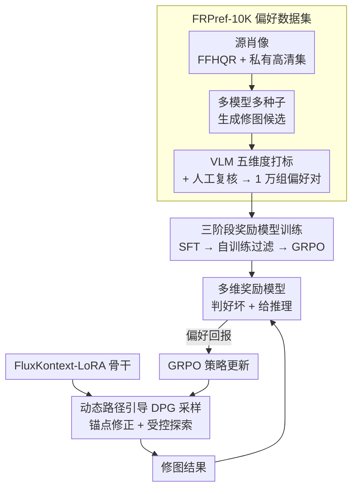

# BeautyGRPO: Aesthetic Alignment for Face Retouching via Dynamic Path Guidance and Fine-Grained Preference Modeling

**会议**: CVPR2026  
**arXiv**: [2603.01163](https://arxiv.org/abs/2603.01163)  
**代码**: 待确认（有Project Page）  
**领域**: 图像生成/人脸修复  
**关键词**: 人脸修图, 强化学习, 美学对齐, 流匹配, 偏好建模, GRPO, 动态路径引导

## 一句话总结

提出 BeautyGRPO，一个基于强化学习的人脸修图框架，通过构建细粒度偏好数据集 FRPref-10K 训练专用奖励模型，并设计动态路径引导（DPG）机制在随机探索与高保真之间取得平衡，实现与人类美学偏好对齐的自然修图效果。

## 研究背景与动机

**人脸修图需求旺盛**：社交媒体和拍照设备普及驱动高质量人脸修图的需求持续增长，任务要求去除痘痘、瑕疵等缺陷的同时保留痣、毛孔等身份特征

**监督学习的根本局限**：现有方法（CNN-based、Transformer-based）依赖像素级监督训练，只能模仿标注图像而无法捕获复杂的主观美学偏好，产出结果视觉僵硬、不自然

**监督学习天花板问题**：像素级重建目标导致模型过拟合特定修图风格，无法发现超越训练数据美学质量的解决方案

**通用图像编辑模型的不足**：NanoBanana、SeedDream 等大模型虽能执行修图操作，但常产生身份改变、油腻塑料质感皮肤和伪影等不自然效果

**在线 RL 的保真度冲突**：FlowGRPO 等 T2I-RL 框架通过注入随机噪声（SDE）实现探索，但累积随机漂移严重破坏人脸修图所需的高保真度，引入明显噪声伪影

**奖励模型粒度不足**：现有 T2I 奖励模型（ImageReward、HPSv2）主要关注全局美学或文本-图像一致性，缺乏评估皮肤光滑度、瑕疵去除、纹理保留等细粒度感知维度的能力

## 方法详解

### 整体框架

BeautyGRPO 想突破「监督学习只会模仿标注、产出僵硬塑料脸」的天花板，用强化学习让人脸修图对齐人类美学偏好。它由三块拼成：一个细粒度偏好数据集 FRPref-10K 提供训练信号，一个多维奖励模型把「好不好看」量化成可优化的回报，一个动态路径引导（DPG）算法在 RL 探索时把轨迹拉回高保真流形。骨干是 FluxKontext-LoRA，先 LoRA 微调再做 RL 训练。

### 关键设计

**1. FRPref-10K 偏好数据集：给「美学好坏」造出细粒度标注**

通用奖励模型只懂全局美学或图文一致，测不出皮肤光滑度、瑕疵去除、纹理保留这些修图真正在意的维度。FRPref-10K 从 FFHQR 和私有高分辨率集采源肖像（保证人口统计与拍摄条件多样），对每张图用 NanoBanana、FluxKontext、RetouchFormer 等多模型在不同随机种子下生成修图候选，再通过模型间（output vs output）和输出-标签比较构造 1 万组偏好对。标注走混合流程：多个 VLM（GPT-4o、Qwen2.5-VL-72B、Gemini 2.5 Pro）按皮肤光滑、瑕疵去除、纹理质量、清晰度、身份保持五个维度给出结构化推理，人工审核员在同一标准下复核，分歧再交高级专家裁决。

**2. 三阶段奖励模型训练：从结构化推理到 GRPO 鲁棒化**

奖励模型基于 Qwen2.5-VL-7B、采用 UnifiedReward-Thinking 范式分三步打磨：Stage 1 在 2K 子集上 SFT，让模型在 `<think>` 块里写五维度结构化推理、在 `<answer>` 块里给偏好决策；Stage 2 用 Stage 1 模型对剩余 8K 样本生成多条推理轨迹，按偏好正确性 + 推理连贯性双标准过滤一致轨迹再 SFT；Stage 3 对仍不一致的样本上 GRPO，鼓励探索多样推理路径，由结果奖励（偏好准确率）和过程奖励（DeBERTa-V3 评推理连贯性）联合监督。这样得到的奖励模型既会判好坏、又给得出理由。

**3. 动态路径引导（DPG）：让 RL 探索不破坏人脸保真**

FlowGRPO 把 ODE 转成 SDE、靠注入噪声 $\sigma_t d\omega$ 来探索，但累积随机漂移会把轨迹甩离高保真流形，给人脸引入明显伪影。DPG 的办法是每个采样步都重新规划引导轨迹，把当前状态往锚点附近的高保真流形上拉、同时保留受控探索：先从 FRPref-10K 里取高偏好样本作稳定锚点 $x_0^{\text{anchor}}$（只在采样时引入、不作监督目标）；在当前状态 $x_t$ 与锚点间重规划直线 ODE 轨迹，算出下一步目标 $x_{t-\Delta t}^* = (\Delta t/t) x_0^{\text{anchor}} + (1 - \Delta t/t) x_t$，进而得到把轨迹拉回锚点的修正向量 $z_t^{\text{anchor}} = (x_{t-\Delta t}^* - \mu_t) / \sigma_{\text{step}}$；再把它和标准噪声混合 $z_t^{\text{mix}} = \lambda(t) z_t^{\text{anchor}} + (1-\lambda(t)) z_t^{\text{std}}$，其中 $\lambda(t) = t / \max(1, T-1)$ 让早期步多用锚点引导修正结构、后期步多用随机噪声做细粒度探索。为省算力，把完整轨迹分成 $K=3$ 段，每段只随机挑一个时间步做 DPG 更新、其余走 ODE。

### 损失函数

采用 GRPO 目标函数（clipped surrogate objective），配合归一化优势 $\hat{A}^i$。在 DPG 下，转移概率满足高斯分布 $\mathcal{N}(\mu_{\text{new}}, \sigma_{\text{new}}^2 I)$，其中 $\mu_{\text{new}} = (1-\lambda)\mu_t + \lambda x_{t-\Delta t}^*$，$\sigma_{\text{new}} = (1-\lambda)\sigma_{\text{step}}$，用于计算逐步似然比 $r_t(\theta)$ 进行策略更新。

## 实验

### 实验设置

- **骨干**：FluxKontext + LoRA 微调
- **数据**：FFHQR 测试集 1000 张 + In-the-wild 互联网肖像 1000 张
- **评估指标**：无参考感知/美学指标（NIQE↓、NIMA↑、MUSIQ↑、MANIQA↑、NRQM↑、TOPIQ↑）+ ArcFace 身份保持 + FID
- **硬件**：8×H20 GPU

### 主要结果

| 方法 | 类别 | NIQE↓ | NIMA↑ | MUSIQ↑ | MANIQA↑ | TOPIQ↑ | ArcFace↑ |
|------|------|-------|-------|--------|---------|--------|----------|
| RetouchFormer | 专用模型 | 11.153 | 4.723 | 4.465 | 1.036 | 0.605 | 0.986 |
| NanoBanana | 通用编辑 | 11.301 | 4.919 | 4.681 | 1.009 | 0.621 | 0.889 |
| FluxKontext+LoRA | 基线 | 12.913 | 4.694 | 4.459 | 1.035 | 0.601 | 0.973 |
| FlowGRPO | RL基线 | 15.024 | 4.573 | 4.271 | 0.935 | 0.571 | 0.882 |
| **BeautyGRPO (Ours)** | **RL** | **10.831** | **5.123** | **4.906** | **1.079** | **0.676** | 0.952 |

### 用户研究

| 方法 | VRetouchEr | RetouchFormer | NanoBanana | Kontext LoRA | **Ours** |
|------|-----------|---------------|------------|-------------|---------|
| Win Rate | 6.50% | 8.50% | 9.75% | 12.00% | **63.25%** |

100名参与者对20组测试样本进行偏好投票，BeautyGRPO 以 63.25% 的胜率大幅领先所有基线。

### 消融实验

**奖励模型对比**：替换不同编辑奖励模型，本文奖励模型在 NIMA(5.123) / MUSIQ(4.906) / MANIQA(1.079) / TOPIQ(0.676) 上全面超越 EditReward、EditScore、UnifiedReward-Edit。

**骨干泛化性**：将 BeautyGRPO 应用于 Qwen-Image-Edit，NIMA 从 4.571（原始）/4.824（+LoRA）提升至 5.351（+BeautyGRPO），TOPIQ 从 0.563 提升至 0.664。

**DPG 步数 K 的影响**：K=3 与 K=5 效果接近但采样更快，选 K=3 为默认。

### 关键发现

- FlowGRPO 直接应用于人脸修图会导致严重退化（NIQE 15.024 vs BeautyGRPO 10.831），验证了 DPG 的必要性
- 虽然 BeautyGRPO 的 FID 略高于最佳监督基线（4.054 vs 2.229），但这是因为模型探索了超越训练标签分布的更优美学解
- ArcFace 分数保持高位（0.952/0.944），表明美学增强的同时身份保持稳健

## 亮点

- 首次将基于人类美学偏好的 RL 对齐引入人脸修图任务，突破监督学习的天花板
- DPG 机制设计精巧：锚点引导 + 时间依赖混合系数，在保真与探索间取得优雅平衡
- 三阶段奖励模型训练流程（SFT → 自训练 → GRPO）结合五维度评估体系，构建了面向修图的细粒度反馈信号
- 用户研究 63.25% 胜率远超次优的 12%，定性效果令人信服

## 局限性

- FRPref-10K 数据集虽大但依赖特定 VLM 集合标注，标注偏差可能传播到奖励模型
- 锚点选择策略对结果质量影响未充分分析；锚点与输入图像的匹配方式不明确
- 主要在 FFHQR 和互联网肖像上评估，对极端光照、大角度侧脸、严重遮挡等困难场景的鲁棒性未探讨
- ArcFace 评分略低于部分监督方法（0.952 vs 0.986），身份保持与美学增强的权衡可进一步优化
- 计算成本未充分讨论（8×H20 GPU 训练，推理时 DPG 引入额外开销）

## 相关工作

- **专用修图模型**：ABPN、RestoreFormer(++)、VRetouchEr、RetouchFormer — 依赖监督学习，受限于像素级目标
- **通用编辑模型**：NanoBanana、ICEdit、SeedDream4.0、FluxKontext — 能力强但修图不够精细自然
- **扩散模型 RL 对齐**：DDPO、DPOK（策略梯度）、DiffusionDPO（离线）、FlowGRPO（在线 SDE 探索）— BeautyGRPO 在 FlowGRPO 基础上加入 DPG 解决保真问题
- **奖励建模**：ImageReward、HPSv2、EditScore、EditReward、UnifiedReward — 缺乏修图细粒度维度

## 评分

- 新颖性: ⭐⭐⭐⭐ — DPG 机制和面向修图的偏好对齐是新颖的组合，但核心 GRPO 框架借鉴自 FlowGRPO
- 实验充分度: ⭐⭐⭐⭐ — 定量+定性+用户研究+多消融+跨骨干验证，指标覆盖全面
- 写作质量: ⭐⭐⭐⭐ — 结构清晰，动机论证充分，公式推导完整
- 价值: ⭐⭐⭐⭐ — 首个将 RL 偏好对齐系统性引入人脸修图的工作，开辟新方向

<!-- RELATED:START -->

## 相关论文

- [\[CVPR 2026\] Fine-Grained GRPO for Precise Preference Alignment in Flow Models](fine-grained_grpo_for_precise_preference_alignment_in_flow_models.md)
- [\[CVPR 2026\] SpatialReward: Verifiable Spatial Reward Modeling for Fine-Grained Spatial Consistency in Text-to-Image Generation](spatialreward_verifiable_spatial_reward_modeling_for_fine-grained_spatial_consis.md)
- [\[CVPR 2026\] Towards Fine-Grained Attribution: Instance-Aware Preference Optimization for Aligning Diffusion Models](towards_fine-grained_attribution_instance-aware_preference_optimization_for_alig.md)
- [\[CVPR 2026\] CogniEdit: Dense Gradient Flow Optimization for Fine-Grained Image Editing](cogniedit_dense_gradient_flow_optimization_for_fine-grained_image_editing.md)
- [\[CVPR 2026\] PromptEnhancer: Taming Your Rewriter for Text-to-Image Generation via Fine-Grained Reward](promptenhancer_taming_your_rewriter_for_text-to-image_generation_via_fine-graine.md)

<!-- RELATED:END -->
