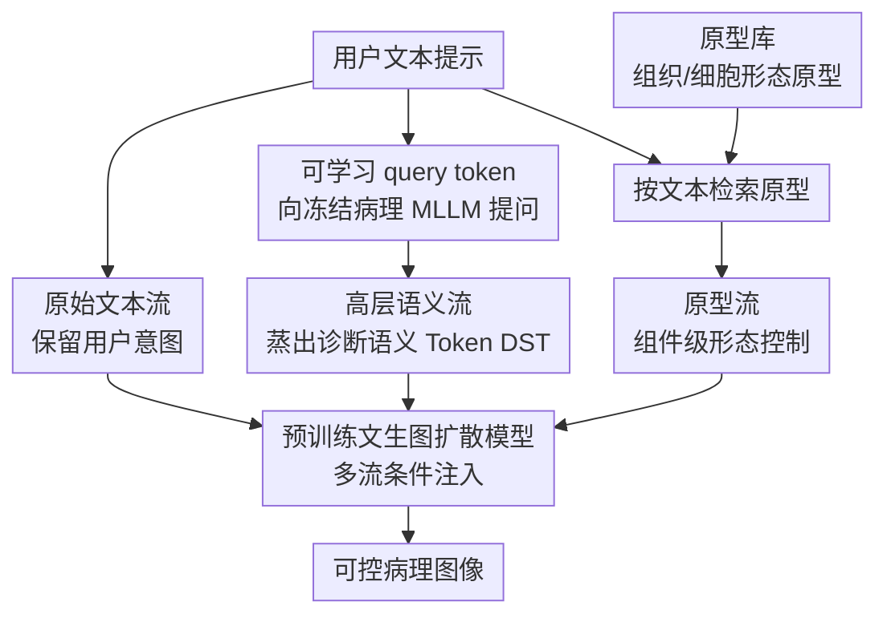

# Beyond Pixel Simulation: Pathology Image Generation via Diagnostic Semantic Tokens and Prototype Control

**会议**: CVPR2026  
**arXiv**: [2512.21058](https://arxiv.org/abs/2512.21058)  
**代码**: [Hanminghao/UniPath](https://github.com/Hanminghao/UniPath)  
**领域**:图像生成  
**关键词**: 病理图像生成, 语义控制, 诊断语义Token, 原型控制, 多流条件注入, MLLM蒸馏

## 一句话总结

UniPath提出语义驱动的病理图像生成框架，通过多流控制（原始文本 + 从冻结病理MLLM蒸馏的诊断语义Token + 原型库形态控制）实现诊断级可控生成，Patho-FID达80.9，比第二名优51%。

## 研究背景与动机

计算病理学中，"理解"和"生成"两条线走了完全不同的发展路径。理解模型（如病理多模态大模型MLLM）已经具备诊断级别的能力，但生成模型大多还停留在像素模拟阶段，缺乏对诊断语义的把握。

作者识别出三个相互耦合的瓶颈：

**数据稀缺**：缺乏大规模、高质量的病理图文配对语料，限制了模型训练

**语义控制不足**：现有方法无法进行精细的语义控制，只能依赖非语义线索（如风格、颜色），无法指定"腺体形态异常"或"核分裂象增多"等诊断相关属性

**术语异质性**：同一诊断概念在不同医生、不同报告中有多种不同表述，导致基于原始文本的条件控制不可靠

核心洞察：既然理解模型已经很成熟了，为什么不利用它们的诊断能力来指导生成？这是本文"以理解驱动生成"的核心思路。

## 方法详解

### 整体框架

UniPath 的出发点是一个反差：计算病理里「理解」模型（病理 MLLM）已经有诊断级能力，「生成」模型却还停在像素模拟、读不懂诊断语义。它的解法是「以理解驱动生成」——把成熟理解模型的诊断知识蒸馏出来去指导扩散生成。核心是多流控制（Multi-Stream Control）：在预训练文生图扩散模型之上，把条件信号拆成三个互补的流——原始文本保留用户意图、诊断语义 Token 提供诊断级语义、原型库提供形态级控制——从粗到细协同引导生成。

### 关键设计

**1. 高层语义流与诊断语义 Token：从冻结 MLLM 蒸馏出抗术语异质的语义**

同一诊断概念在不同医生笔下表述各异，直接拿原始文本做条件很不稳。这一流（本文最核心的贡献）从冻结的病理 MLLM（如 PathChat）里蒸馏抗同义异构的高层语义：设计一组可学习 query token，通过交叉注意力向冻结 MLLM「提问」，蒸出诊断语义 Token（Diagnostic Semantic Tokens, DST）。因为 DST 取自 MLLM 的深层语义空间而非表面文本，"poorly differentiated adenocarcinoma"和"low-grade differentiated glandular cancer"这类不同说法会映射到同一语义表征；同时它把用户的简短提示扩展成覆盖细胞形态、组织结构、染色特征的属性束。DST 经适配层注入扩散模型的交叉注意力，提供高层语义引导。

**2. 原型流与原型库：补上组件级的形态控制**

仅有全局语义还不够——医生常要指定「含某种形态细胞」的图像。原型流（Prototype Stream）从高质量病理图里提取代表性的组织/细胞形态原型（每个原型对应一种形态模式，如特定腺体排列、核形态），构成原型库；生成时按文本描述检索最相关的原型特征，经额外条件通道注入，从而对图像里的具体组成成分做精细形态调控，与高层语义形成互补。

**3. 大规模数据构建：用数量保覆盖、用质量保上界**

语义控制要落地离不开数据。UniPath 收集清洗约 265 万张病理图文对构成 UniPath-1M 大语料保覆盖度，再从中筛出 68K 张带详细诊断属性标注的高质量样本（UniPath-68K）保训练质量上界，两者缺一不可。数据集已在 HuggingFace 开源（minghaofdu/UniPath-1M、UniPath-68K）。

**4. 四层评估体系：单一 FID 测不出病理生成的真实质量**

病理图像生成的好坏不能只看像素相似度。为此建立四级评估框架：像素保真度（FID、Patho-FID）、语义一致性（生成图与文本描述的语义对齐）、诊断可用性（能否支撑下游诊断任务）、细粒度可控性（属性级控制精度）。这套分层比单一 FID 更能反映诊断价值，有望成为领域评测标准。

## 实验关键数据

### 表1：图像生成质量对比（Patho-FID等指标）

| 方法 | Patho-FID ↓ | FID ↓ | IS ↑ | CLIP-Score ↑ |
|---|---|---|---|---|
| SD v1.5 | ~200+ | - | - | - |
| PathLDM | ~170+ | - | - | - |
| PixCell-256 | ~165 | - | - | - |
| **UniPath** | **80.9** | **最优** | **最优** | **最优** |

UniPath的Patho-FID为80.9，比第二名提升约51%，表明生成图像在病理特征空间中与真实图像分布更为接近。

### 表2：细粒度语义控制与下游诊断任务

| 评估维度 | UniPath | 对比方法最优 | 真实图像 |
|---|---|---|---|
| 细粒度语义控制 | 真实图像的98.7% | ~65-80% | 100% |
| 分类支持（Aug后准确率） | 显著提升 | 一般提升 | 基线 |
| 属性一致性 | 高 | 中等 | 参考值 |

UniPath在细粒度语义控制上达到真实图像的98.7%，说明生成图像几乎完全保留了指定的诊断属性。

### 消融实验

论文共包含6张表格、17张图表（32页），消融实验验证了：
- 三个控制流各自的贡献：移除任一流都导致性能下降
- DST相比直接用CLIP text embedding的优势：对术语异构更鲁棒
- 原型库大小对形态控制精度的影响
- 68K高质量子集对训练的关键作用

## 关键发现

1. **理解能力可以反哺生成**：冻结的病理MLLM提供的诊断语义token显著优于传统文本编码，验证了"以理解驱动生成"的路线
2. **术语异质性是病理文本条件生成的核心障碍**：传统方法在不同医生使用不同术语描述同一病变时表现不稳定，DST有效解决了这一问题
3. **组件级形态控制是病理图像生成的刚需**：仅靠全局语义不够，医生往往需要指定具体的细胞/组织形态特征
4. **数据质量与数量的平衡**：265万大规模语料提供覆盖度，68K精标子集提供质量保证，两者缺一不可

## 亮点与洞察

- **范式转换意义**：从"模拟像素"到"理解诊断语义再生成"，提出了病理图像生成的新范式，将理解模型的成熟能力迁移到生成任务
- **多流控制设计精巧**：三个流从不同抽象层次提供控制——原始文本保留用户意图、DST提供诊断级语义、原型提供形态级控制——形成了完整的控制层次
- **MLLM蒸馏思路有普适性**：用可学习query从冻结大模型中蒸馏任务相关token的思路，可推广到其他领域的条件生成任务
- **评估体系贡献**：四层评估机制比单一FID更能反映病理图像生成的真正质量，有望成为领域标准
- **完整开源**：代码、模型权重（UniPath-7B, 9B参数）、两个数据集均已公开，对领域推动价值大

## 局限性

1. **计算成本较高**：基于9B参数的MLLM蒸馏 + 扩散模型生成，推理需要至少24GB显存，限制了实际部署
2. **原型库依赖专家构建**：原型的选取和标注仍需病理学专家参与，自动化程度有限
3. **分辨率限制**：当前生成图像的分辨率可能无法满足高倍率（如40x）下的精细诊断需求，全切片图像（WSI）级别的生成尚未覆盖
4. **领域泛化未验证**：主要在常见病理类型上验证，罕见病种和特殊染色（如免疫组化）的泛化能力不明
5. **临床验证缺失**：Patho-FID等自动指标的提升是否真正对应临床价值，仍需病理医生的盲评验证

## 相关工作与启发

- **PathLDM / PixCell-256**：此前的病理图像生成方法主要基于潜空间扩散，缺乏诊断语义控制，UniPath在此基础上引入多流语义引导
- **Patho-R1**：病理推理大模型，UniPath借鉴其代码框架并利用类似MLLM提供语义理解
- **BLIP3o**：多模态生成框架，UniPath参考其架构设计
- **IP-Adapter / ControlNet**：图像生成领域的条件控制方法，UniPath的多流控制思路与之类似但专门针对病理语义定制
- **启发**：这种"利用成熟理解模型蒸馏语义token来引导生成"的方法论，有望推广到放射影像、皮肤镜、眼底图等其他医学影像领域

## 评分

- 新颖性: ⭐⭐⭐⭐⭐ — "以理解驱动生成"的范式转换 + 多流控制 + DST蒸馏，创新层次丰富
- 实验充分度: ⭐⭐⭐⭐⭐ — 32页论文，6表17图，四层评估体系全面
- 写作质量: ⭐⭐⭐⭐ — 问题分析透彻，方法描述清晰，篇幅较长但结构合理
- 价值: ⭐⭐⭐⭐⭐ — 数据集+代码+权重完整开源，对病理图像生成领域有标杆意义

<!-- RELATED:START -->

## 相关论文

- [\[CVPR 2026\] Camera Control for Text-to-Image Generation via Learning Viewpoint Tokens](camera_control_for_text-to-image_generation_via_learning_viewpoint_tokens.md)
- [\[CVPR 2026\] LacTokGen: Latent Consistency Tokenizer for 1024-pixel Image Generation by 256 Tokens](lactokgen_latent_consistency_tokenizer_for_1024-pixel_image_generation_by_256_to.md)
- [\[AAAI 2026\] Beyond Semantic Features: Pixel-Level Mapping for Generalized AI-Generated Image Detection](../../AAAI2026/image_generation/beyond_semantic_features_pixel-level_mapping_for_generalized_ai-generated_image_.md)
- [\[CVPR 2026\] TokenLight: Precise Lighting Control in Images using Attribute Tokens](tokenlight_precise_lighting_control_in_images_using_attribute_tokens.md)
- [\[CVPR 2026\] Pixel Motion Diffusion Is What We Need for Robot Control](pixel_motion_diffusion_is_what_we_need_for_robot_control.md)

<!-- RELATED:END -->
