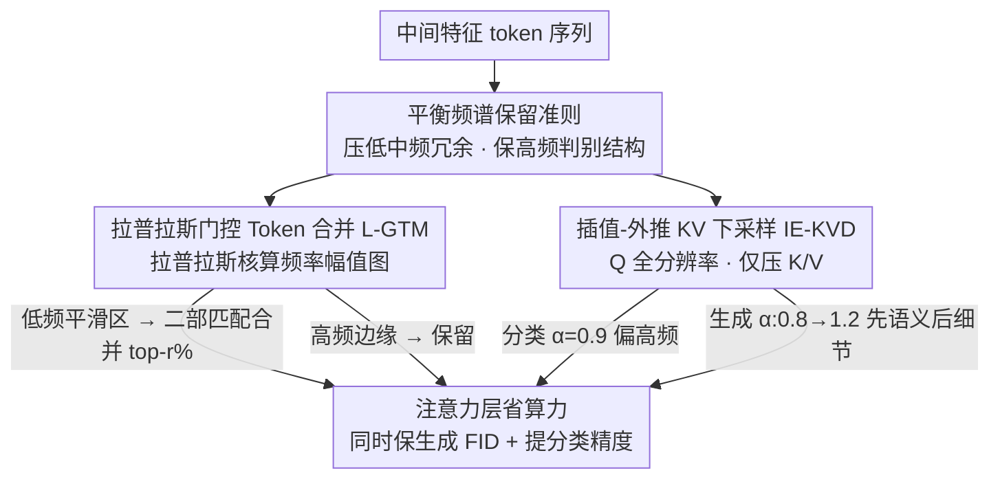

# BiGain: Unified Token Compression for Joint Generation and Classification

**会议**: CVPR2026  
**arXiv**: [2603.12240](https://arxiv.org/abs/2603.12240)  
**代码**: [Greenoso/BiGain](https://github.com/Greenoso/BiGain)  
**领域**: 图像生成  
**关键词**: 扩散模型加速, token压缩, 频率感知, 生成-分类联合优化, 训练无关

## 一句话总结

BiGain 提出频率感知的 token 压缩框架，通过拉普拉斯门控 token 合并和插值-外推 KV 下采样两个无训练算子，首次在扩散模型加速中同时保持生成质量并显著提升判别分类性能。

## 研究背景与动机

**扩散模型计算瓶颈**：扩散模型采样阶段计算量巨大，现有 token 合并/下采样等加速方法（如 ToMe、ToDo）主要关注生成质量，忽略了模型潜在的判别能力。

**双用途需求日益增长**：同一扩散模型骨干可同时用于图像生成和基于去噪似然的分类（扩散分类器），在医学影像、安全感知、工业检测、遥感等领域有广泛应用。

**加速对分类的伤害远大于生成**：实验观察到，naive 的 token 压缩对分类精度的损害远早于、也远大于对生成质量的影响——在极端稀疏度下分类甚至崩溃，而生成仍可接受。

**压缩移除了分类关键结构**：传统压缩倾向于移除边缘、纹理、高对比度边界等分类依赖的高频信息，即使全局外观完整，分类性能也大幅下降。

**缺乏双目标优化视角**：此前没有框架从生成+分类的联合角度设计 token 压缩策略，存在"看起来好"但"分类不准"的鸿沟。

**频率分离的关键洞察**：将中间特征映射到频率感知表示后，高频（边缘/纹理）和低中频（形状/语义）可以解耦，为同时服务两种能力提供了设计准则。

## 方法详解

### 整体框架

BiGain 想解决的是：扩散模型既能生成又能当分类器，但现有 token 压缩只盯着生成质量，一压缩就把分类需要的高频细节（边缘、纹理）抹掉了。它的做法是用两个**训练无关、即插即用**的频率感知算子替换原有的 token 合并 / KV 下采样，直接嵌进 DiT 或 U-Net 的注意力层，不动任何权重。整条流程的统一准则是**平衡频谱保留**——压掉冗余的低中频平滑区域来省算力，同时刻意保住支撑判别的高频结构，让同一次加速既不伤生成 FID、又把分类精度顶上去。

### 关键设计

**1. 拉普拉斯门控 Token 合并 L-GTM：让平滑区域去合并、高频边缘留下来**

普通 ToMe 不分青红皂白地合并相似 token，最先牺牲的恰恰是分类依赖的边缘和纹理。L-GTM 先把 token 序列重塑回空间形式 $H \times W \times C$，用拉普拉斯核 $\mathbf{L}$（二阶导数的离散近似）卷积出每个位置的局部频率幅值 $\mathbf{F} = \text{Reduce}_c(|\mathbf{X} * \mathbf{L}|)$，高值即高频/边缘、低值即平滑区。每个网格里频率幅值最低的 token 被选为目标集 $\mathcal{A}$（低频锚点），其余作为源集 $\mathcal{B}$，再做全局二部匹配、对相似度最高的前 $r\%$ 源-目标对等权平均合并。这样合并只发生在平滑区、高频 token 被保护下来，注意力代价从 $\mathcal{O}(N^2 d)$ 降到 $\mathcal{O}(N'^2 d)$。高分辨率阶段还有个变体 ABM（分块自适应合并），只对最大频率幅值低于阈值 $\tau$ 的块做池化。

**2. 插值-外推 KV 下采样 IE-KVD：压 K/V 省算力，留 Q 保画质**

注意力里另一笔大开销是 K、V 的长度。IE-KVD 对 K、V 做可控下采样、却让 Q 保持全分辨率：

$$\mathcal{D}_{\alpha,s}(\mathbf{Z})[i] = \alpha \cdot \mathbf{Z}[\text{nearest}(i)] + (1-\alpha) \cdot \frac{1}{|\mathcal{N}_s(i)|} \sum_{j \in \mathcal{N}_s(i)} \mathbf{Z}[j]$$

其中 $\alpha$ 在「最近邻（保高频）」和「均值池化（保低频）」之间滑动。Q 之所以不压，是要保住每个输出 token 的细粒度感受野，既稳住生成质量、又留下判别所需的注意力精度，代价从 $\mathcal{O}(N^2 d)$ 降到 $\mathcal{O}(N \tilde{N} d)$。$\alpha$ 按任务调度：分类固定 $\alpha=0.9$ 偏最近邻保高频，生成则让 $\alpha$ 从 0.8 线性走到 1.2（早期偏低频铺语义、后期偏高频补细节）。

两个算子都是时间步局部、确定性的操作，不依赖跨步缓存，因此和扩散分类器的 Monte Carlo 配对差估计天然兼容——所有类别共享同一批噪声样本和同一套压缩策略，加速后判别范式依然成立。

## 实验

### 实验设置

- **骨干**：Stable Diffusion v2.0（U-Net）和 DiT-XL/2（Transformer）
- **数据集**：ImageNet-1K、ImageNet-100、Oxford-IIIT Pets、COCO-2017
- **指标**：分类 Top-1 Acc / mAP；生成 FID

### 主要结果 1：Token 合并（SD-2.0，Table 4）

| 数据集 | 方法 | 合并比例 70% Acc ↑ | 合并比例 70% FID ↓ |
|---|---|---|---|
| Pets | ToMe | 65.76 | 38.35 |
| Pets | **BiGain-TM** | **74.63 (+8.87)** | **37.73 (-0.62)** |
| ImageNet-1K | ToMe | 37.35 | 18.42 |
| ImageNet-1K | **BiGain-TM** | **44.50 (+7.15)** | **18.08 (-0.34)** |
| COCO Acc@1 | ToMe | 57.32 | 29.00 |
| COCO Acc@1 | **BiGain-TM** | **61.44 (+4.12)** | **28.57 (-0.43)** |

在 70% token 合并比例下，BiGain-TM 在 ImageNet-1K 上分类精度提升 7.15%，FID 同时改善 0.34。

### 主要结果 2：KV 下采样（SD-2.0，Table 2）

| 数据集 | 方法 | 下采样 4× Acc ↑ | 下采样 4× FID ↓ |
|---|---|---|---|
| Pets | ToDo | 77.46 | 31.48 |
| Pets | **BiGain-TD** | **78.03 (+0.57)** | **29.21 (-2.27)** |
| ImageNet-100 | ToDo | 48.70 | 15.63 |
| ImageNet-100 | **BiGain-TD** | **54.48 (+5.78)** | **15.46 (-0.17)** |

### DiT-XL/2 上的表现（Table 3 & 5）

- KV 下采样 2× 时，BiGain-TD 在 ImageNet-100 上比 ToDo 分类准确率高出 **9.08%**（78.42 vs 69.34），FID 同时改善 0.35
- ToDo 在 DiT 上 3× 及更高因子时几乎崩溃（Acc 降到个位数，FID >190），而 BiGain-TD 仍保持合理性能
- Token 合并方面，BiGain-TM 在 70% 合并比例时比 ToMe 高出 **7.88%** 分类精度

### 消融实验与关键发现

1. **频率感知的必要性**：移除拉普拉斯门控后分类精度大幅下降，验证了高频保护对判别能力的关键作用
2. **KV 下采样的频率平衡**：生成任务受益于从低频到高频的线性调度（$\alpha$: 0.8→1.2），分类则偏好固定 $\alpha=0.9$（偏高频保留）
3. **与竞争方法对比**（Pets 数据集，Table 1）：在 ~10% FLOPs 削减下，BiGain-TM 仅降 2.65% Acc（vs ToMe -8.07, SiTo -12.19, DiP-GO -4.50, MosaicDiff -3.65）
4. **平衡频谱保留**是可靠设计准则：同时保留高频细节和低中频语义内容，对两种任务均有益

## 亮点

- **首个双目标 token 压缩框架**：将扩散模型加速从单一生成质量优化扩展为生成+分类联合优化
- **频率分离洞察优雅实用**：拉普拉斯核计算简单高效，无需学习，即插即用
- **跨架构通用**：在 U-Net（SD-2.0）和 DiT（DiT-XL/2）上均有效
- **训练无关**：无需微调或重新训练，直接在推理时嵌入
- **设计准则可推广**：平衡频谱保留的原则可指导未来更多压缩方法的设计

## 局限性

- 拉普拉斯核为固定 3×3 核，对不同尺度的高频信息可能不是最优的频率探测器
- $\alpha$ 参数和合并比例仍需为不同模型/数据集调优，缺乏自适应机制
- 仅在扩散分类器范式下验证分类能力，未扩展到 linear probe 或 feature distillation 等其他判别协议
- DiT 上 ToDo 基线表现异常差（3× 即崩溃），对比增益可能被高估
- 未测试视频扩散模型或 3D 生成等更复杂场景

## 相关工作

- **ToMe/ToMeSD**：贪心 token 合并用于 Transformer 和扩散模型加速，仅优化生成质量
- **ToDo**：token 下采样通过平均池化降低注意力开销，不考虑判别性能
- **DiP-GO / Diff-Pruning**：结构化剪枝方法，通过梯度或子网搜索减少计算
- **MosaicDiff / SiTo**：其他 token 缩减/剪枝策略，同样仅关注生成保真度
- **Diffusion Classifier**：利用扩散模型的逐类去噪似然进行分类，BiGain 的压缩首次让此范式在加速下仍可用

## 评分

- 新颖性: ⭐⭐⭐⭐ — 首次提出双目标视角和频率感知压缩原则，洞察清晰
- 实验充分度: ⭐⭐⭐⭐ — 4个数据集×2种骨干×2种算子×多级压缩比，消融完整
- 写作质量: ⭐⭐⭐⭐ — 动机-方法-实验逻辑链清晰，公式规范
- 价值: ⭐⭐⭐⭐ — 填补了扩散模型加速中判别能力被忽视的空白，设计准则有推广价值

<!-- RELATED:START -->

## 相关论文

- [\[CVPR 2026\] Mixture of States: Routing Token-Level Dynamics for Multimodal Generation](mixture_of_states_routing_token-level_dynamics_for_multimodal_generation.md)
- [\[CVPR 2026\] SeaCache: Spectral-Evolution-Aware Cache for Accelerating Diffusion Models](seacache_spectral-evolution-aware_cache_for_accelerating_diffusion_models.md)
- [\[CVPR 2026\] DA-VAE: Plug-in Latent Compression for Diffusion via Detail Alignment](da-vae_plug-in_latent_compression_for_diffusion_via_detail_alignment.md)
- [\[CVPR 2026\] GeoRelight: Learning Joint Geometrical Relighting and Reconstruction with Flexible Multi-Modal Diffusion Transformers](georelight_learning_joint_geometrical_relighting_and_reconstruction_with_flexibl.md)
- [\[CVPR 2026\] TAP: A Token-Adaptive Predictor Framework for Training-Free Diffusion Acceleration](tap_a_token-adaptive_predictor_framework_for_training-free_diffusion_acceleratio.md)

<!-- RELATED:END -->
