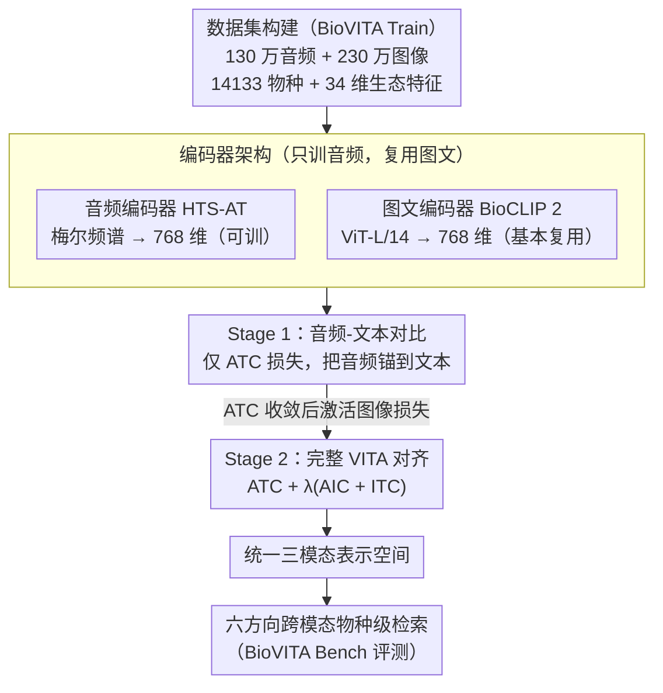

# BioVITA: Biological Dataset, Model, and Benchmark for Visual-Textual-Acoustic Alignment

**会议**: CVPR 2026  
**arXiv**: [2603.23883](https://arxiv.org/abs/2603.23883)  
**代码**: [项目页面](https://dahlian00.github.io/BioVITA_Page/)  
**领域**: 图像生成  
**关键词**: 视觉-文本-声音对齐, 跨模态检索, 生物声学, 物种识别, 多模态表示学习

## 一句话总结
提出 BioVITA 框架，包含百万级三模态（图像-文本-音频）生物数据集、两阶段对齐模型和六方向跨模态物种级检索基准，首次实现生物领域视觉-文本-声音统一表示学习。

## 研究背景与动机
**领域现状**: 生物多样性研究依赖多种感官模态（图像识别外观、音频识别叫声、文本描述分类），BioCLIP 等模型在图像-文本对齐上取得了成功，CLAP 在音频-文本上也有进展。

**现有痛点**: 当前多模态数据集只聚焦成对模态（图像-文本或音频-文本），缺乏三模态统一的训练和评测框架。SSW60 等先驱工作仅覆盖 60 个物种，规模严重不足。

**核心矛盾**: 生物多样性研究需要全面感知物种，但视觉-文本-声音（VITA）对齐仍是开放挑战——不同数据集分类体系不一致、规模差异大。

**本文要解决**: 构建完整的 VITA 对齐框架，让模型能在图像、音频、文本之间自由进行物种级跨模态检索。

**切入角度**: 从数据集构建出发，收集百万级三模态数据并标注生态特征；通过两阶段训练策略将音频表示对齐到已有的视觉-文本表示空间。

**核心idea**: 利用 BioCLIP 2 预训练的强大图文表示，通过先音频-文本对比再三模态联合对比的两阶段策略，高效实现三模态统一表示。

## 方法详解

### 整体框架
BioVITA 要补的是生物多模态里一直缺的一环：图像-文本、音频-文本各自都有成熟模型（BioCLIP 2、CLAP），却没人把视觉-文本-声音（VITA）三模态对齐到同一空间。它给出的是一整套「数据集 + 模型 + 基准」：BioVITA Train 提供百万级三模态训练数据，BioVITA Model 用音频/图像/文本三个编码器学统一表示，BioVITA Bench 用六方向跨模态检索来评测。模型的关键不是从零训三模态，而是借 BioCLIP 2 已经对齐好的图文空间，只把音频「挂」进去。

### 关键设计

**1. BioVITA Train 数据集构建：先有三模态配对数据，才谈得上三模态对齐**

现有数据集要么只有音频、要么只有图像，根本撑不起三模态联合训练。BioVITA 走「音频整理 → 细粒度标注 → 视觉整合」三步：从 iNaturalist、Xeno-Canto、Animal Sound Archive 收 130 万条音频，配上 ToL-200M 子集的 230 万张图像，覆盖 14,133 个物种，并标注 34 种生态特征（饮食、活动模式、栖息地等）。这套规模和 34 维特征标签让细粒度生态分析与三模态联合训练第一次成为可能。

**2. 两阶段训练策略：先对齐音频-文本，再逐步引入图像**

如果一上来就三模态联合训练，视觉和声学的细粒度区分都很难、训练会不稳。BioVITA 把它拆成两步。Stage 1 只训音频-文本对比损失（ATC, audio-text contrastive），把音频编码器对齐到文本：

$$\mathcal{L}_{\text{ATC}} = \frac{1}{2}\left(\ell(\mathbf{S}_{\text{AT}}) + \ell(\mathbf{S}_{\text{AT}}^\top)\right)$$

跑 30 epochs，学习率 $10^{-4}$、batch size 64。待 ATC 收敛后，Stage 2 再激活图像相关的音频-图像对比损失（AIC）和图像-文本对比损失（ITC），做完整 VITA 对齐：

$$\mathcal{L} = \mathcal{L}_{\text{ATC}} + \lambda(\mathcal{L}_{\text{AIC}} + \mathcal{L}_{\text{ITC}})$$

跑 10 epochs，$\lambda$ 在前 2 epochs 从 0 线性升到 0.1。先把音频锚到文本、再借预训练 BioCLIP 2 的强图文空间慢慢引入图像，比一步到位稳得多。

**3. 编码器架构：只训音频，复用成熟图文编码器**

音频编码器用 HTS-AT（4 组 SwinT 的层级化 Transformer），从梅尔频谱图提取 768 维表示；图像-文本编码器直接用预训练 BioCLIP 2（ViT-L/14 + 12 层 Transformer），同为 768 维。既然 BioCLIP 2 的图文表示已经很强，就只需训练音频编码器去对齐它，省下大量算力。

### 损失函数 / 训练策略
- 对比学习用标准 InfoNCE 风格的交叉熵损失，温度超参 $\tau$ 控制相似度分布的尖锐程度
- Stage 2 中 $\lambda$ 采用线性调度，防止 ATC loss 回升
- 每 epoch 每物种最多 20 条录音，音频随机裁剪为 10 秒片段以增加多样性

## 实验关键数据

### 主实验

| 检索方向 | 指标 | BioVITA | ImageBind | CLAP | 提升 |
|----------|------|---------|-----------|------|------|
| Audio→Text (Top-1) | Species | **最优** | - | 次优 | 显著领先 |
| Text→Audio (Top-1) | Species | **最优** | - | 次优 | 显著领先 |
| Audio→Image (Top-1) | Species | **最优** | 次优 | - | 首次实现 |
| Image→Audio (Top-1) | Species | **最优** | 次优 | - | 首次实现 |
| Image→Text (Top-1) | Species | **最优** | - | - | 保持 BioCLIP 2 水平 |
| Text→Image (Top-1) | Species | **最优** | - | - | 保持 BioCLIP 2 水平 |

### 消融实验

| 配置 | Audio→Text | Text→Audio | 说明 |
|------|-----------|-----------|------|
| Stage 1 only | 较高 | 较高 | 音频-文本对齐有效 |
| Stage 1+2 (完整) | **最优** | **最优** | 三模态联合训练进一步提升 |
| 单阶段联合训练 | 较低 | 较低 | 验证两阶段策略必要性 |

### 关键发现
- BioVITA 首次实现跨所有六个方向的物种级检索，在音频相关方向大幅领先
- 两阶段训练比单阶段联合训练更有效，因为音频-文本对齐是三模态对齐的基础
- 生态特征标签揭示了声学与视觉特征之间的有趣关联（如夜行性动物的叫声更具辨识度）
- 在 unseen 物种（325 种）上仍有不错的泛化表现

## 亮点与洞察
- 数据集规模和覆盖度远超前人（130 万音频 + 230 万图像 + 14K 物种 + 34 种生态特征）
- 两阶段训练策略巧妙利用预训练模型，避免从零开始三模态对齐
- 系统性的六方向检索基准为生物多模态研究提供了标准化评测
- 生态特征标注为跨模态生物理解增加了全新维度

## 局限与展望
- 音频和图像并非严格配对（同一物种不同个体），无法学习个体级对应
- 未考虑视频模态（动物行为的时序信息）
- 鸟类数据占绝大多数，其他纲的物种覆盖可能不均衡
- 可探索端到端微调图像-文本编码器而非冻结

## 相关工作与启发
- BioCLIP/BioCLIP 2 证明了结构化分类文本提示对生物图文对齐的有效性
- CLAP 在通用音频-语言预训练上的成功为生物声学对齐提供了基础
- ImageBind 的跨模态对齐思路（通过共享嵌入空间）是重要参考，但其在生物领域数据不足
- 该工作启示：对于新模态对齐，两阶段"先对齐再联合"比一步到位更稳健

## 评分
- 新颖性: ⭐⭐⭐⭐ 首个百万级生物三模态数据集和基准，但方法本身是成熟的对比学习
- 实验充分度: ⭐⭐⭐⭐ 六方向检索、多粒度分析、生态视角全面，但缺少下游任务评测
- 写作质量: ⭐⭐⭐⭐ 结构清晰，数据集构建过程详实
- 价值: ⭐⭐⭐⭐⭐ 对生物多样性研究和多模态学习都有重要推动，数据集本身就是重大贡献

<!-- RELATED:START -->

## 相关论文

- [\[CVPR 2026\] Prompt Yourself: Awakening Textual Semantics in 1D Visual Tokenizers](prompt_yourself_awakening_textual_semantics_in_1d_visual_tokenizers.md)
- [\[CVPR 2026\] Thinking-while-Generating: Interleaving Textual Reasoning throughout Visual Generation](thinking-while-generating_interleaving_textual_reasoning_throughout_visual_gener.md)
- [\[CVPR 2026\] UnicEdit-10M: A Dataset and Benchmark Breaking the Scale-Quality Barrier via Unified Verification for Reasoning-Enriched Edits](unicedit-10m_a_dataset_and_benchmark_breaking_the_scale-quality_barrier_via_unif.md)
- [\[CVPR 2026\] POCA: Pareto-Optimal Curriculum Alignment for Visual Text Generation](poca_pareto-optimal_curriculum_alignment_for_visual_text_generation.md)
- [\[CVPR 2026\] UniPercept: A Unified Diffusion Model for Generalizable Visual Perception](unipercept_a_unified_diffusion_model_for_generalizable_visual_perception.md)

<!-- RELATED:END -->
