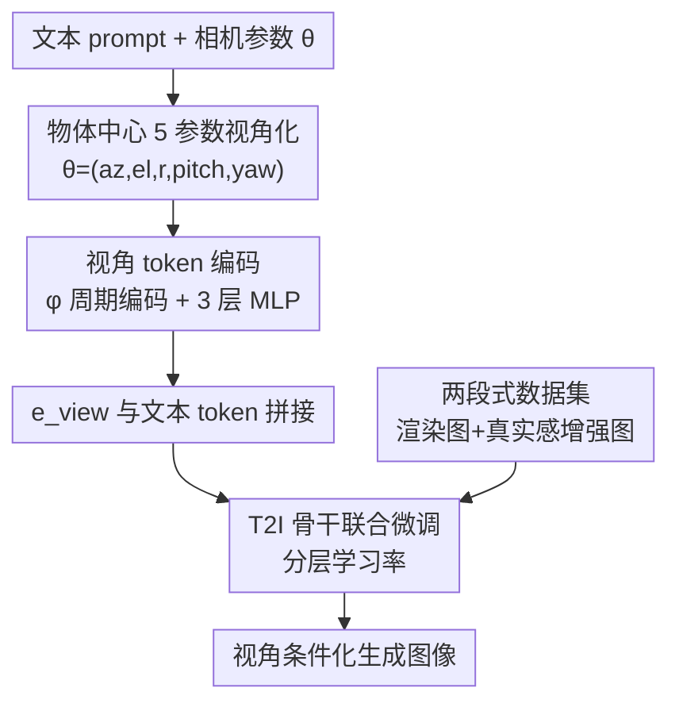

# Camera Control for Text-to-Image Generation via Learning Viewpoint Tokens

**会议**: CVPR 2026  
**论文**: [CVF Open Access](https://openaccess.thecvf.com/content/CVPR2026/html/Lu_Camera_Control_for_Text-to-Image_Generation_via_Learning_Viewpoint_Tokens_CVPR_2026_paper.html)  
**代码**: [项目页](https://randdl.github.io/viewtoken_control/)  
**领域**: 图像生成 / 可控生成 / 文生图  
**关键词**: 相机视角控制, 视角 token, 文生图, 几何解耦, 数据集设计

## 一句话总结
本文给文生图模型加了一个把 5 维相机参数编码成 token 的轻量 MLP，并和文本 token 拼在一起联合微调，配合"3D 渲染图（几何监督）+ 真实感增强图（外观多样）"的两段式数据集，让模型能按 azimuth/elevation/距离/俯仰/偏航精确生成指定视角的图，且能泛化到训练时没见过的物体类别。

## 研究背景与动机
**领域现状**：扩散类文生图模型（SD、SD3、统一多模态模型如 Harmon）在语义保真和视觉真实感上已经很强，但要它们听懂"后视图""左侧 30°""俯拍 45°"这类**几何指令**却很困难。

**现有痛点**：自然语言描述视角天然是离散、模糊的，模型常常幻觉出错误姿态、坍缩到训练数据偏好的"正脸/平视"角度，或者同一 prompt 多次生成几何不一致。作者实测 GPT-5、Nano Banana 这类强模型，给"左 45°/右 30°"这类明确描述，生成结果几乎是同一个朝向，根本分不开。

**核心矛盾**：现有可控生成要么需要额外的几何输入（depth/edge/参考图，如 ControlNet、novel-view synthesis），牺牲了"纯文本即可用"的灵活性；要么像 View-NeTI 那样需要每个物体的多视图监督；要么像 Compass Control 那样**只能控 azimuth 单轴**，且它把 viewpoint 的 cross-attention 用 attention mask 限制在物体局部区域，导致丢失全局场景理解、严重过拟合到训练物体外观——换个没见过的物体（圣诞老人、海豚）就把它画成了别的动物。

**本文目标**：在不引入任何额外几何参考输入的前提下，让文生图模型支持**多参数、精确、可泛化**的相机视角控制。

**切入角度**：作者假设——文本-视觉的潜空间里其实可以被注入显式的 3D 相机结构。与其用 attention mask 把视角信息困在物体局部，不如把相机参数编码成一个**与物体身份解耦的几何 token**，放进文本输入空间里和整张图（前景+背景）一起学。

**核心 idea**：用一个轻量 MLP 把"物体中心坐标系下的 5 维相机参数"编码成 viewpoint token，拼到文本 token 旁边联合微调；并用两段式数据集（大量 3D 渲染图供几何监督 + 少量真实感增强图防坍缩）保住生成质量和泛化性。

## 方法详解

### 整体框架
方法可以套在任何"以文本 embedding 为输入"的文生图骨干上。给定文本 prompt 和一组显式相机参数 $\theta$，先在**物体中心坐标系**里把视角参数化为 5 维向量，再经过一个参数编码函数 $\phi$ 和一个 3 层 MLP，把它映射成一个和文本 token 同维度的 viewpoint token $\mathbf{e}_\text{view}$；这个 token 被插在物体描述旁边，和文本 token 一起送进骨干（主用 Harmon），联合微调后骨干就能同时按语义内容和相机视角生成图像。训练数据是关键一环：用海量规范对齐的 3D 渲染图提供几何监督，再掺入少量真实感增强图维持外观多样和场景复杂度。

### 关键设计

**1. 物体中心的 5 参数因子化视角表示：给"左右前后"一个跨物体一致的定义**

直接用世界坐标或相机矩阵当条件，会让"左""右"这种语言概念依赖具体物体朝向，模型学不出统一规律。作者把物体固定在原点、规定物体正面永远朝世界坐标 $+x$ 轴，于是所有物体的"左/右、前/后"在语言上是一致的，相机则自由移动。视角被因子化为
$$\boldsymbol{\theta} = (\theta_\text{az}, \theta_\text{el}, r, \theta_\text{pitch}, \theta_\text{yaw}) \in \mathbb{R}^5$$
其中 $(\theta_\text{az}, \theta_\text{el}, r)$ 是相机的球坐标位置（半径 $r$ 以物体直径为单位），$(\theta_\text{pitch}, \theta_\text{yaw})$ 是相机相对"指向原点方向"的旋转（俯仰下为正、偏航左为正），假设 roll=0、FoV≈55°。这种**位置与旋转分离**的因子化表示，是后面消融里它远胜 Plücker rays / 12D 矩阵 / 正弦编码的根本原因——单视图 T2I 场景更受益于"语义上可解耦的朝向信号"，而不是为多视图密集对应设计的高频表示。

**2. 视角 token 编码：用周期感知的轻量 MLP 把相机参数翻译进文本空间**

把 5 维参数直接喂网络会有两个坑：azimuth 是周期量（0° 和 360° 应相同），各参数量纲不一。作者先做参数编码
$$\phi(\boldsymbol{\theta}) = [\sin(\theta_\text{az}), \cos(\theta_\text{az}), \theta_\text{el}, r, \theta_\text{pitch}, \theta_\text{yaw}] \in \mathbb{R}^{6}$$
azimuth 用 sin/cos 处理周期性，半径归一化到 $[0,1]$，仰角/俯仰/偏航直接用弧度。再过一个 ReLU 激活的 3 层 MLP 映射到 token：
$$\mathbf{e}_\text{view} = \text{MLP}_\text{view}(\phi(\boldsymbol{\theta})) \in \mathbb{R}^{d}$$
这个 token 被**插在物体描述相邻位置**，让几何信息顺着模型自身的 attention 机制和文本一起流动——这点和 Compass Control 用 attention mask 把视角信息圈死在局部区域形成鲜明对比，后者牺牲了全局场景理解，本文则让前景背景一起被视角条件化。

**3. 两段式数据集：用大量渲染图喂几何、少量真实感图防坍缩**

只用 3D 渲染图训练会让模型"忘记"怎么画复杂场景、跟随细致 prompt（坍缩）。作者把数据集拆成两部分互补：**大渲染集**从 TexVerse 选 3,111 个物体（动物/车辆/人/家具四类），规范对齐到正面（$\theta_\text{az}=\theta_\text{el}=0$），每个物体随机采 120 个视角，约 37.3 万张透明背景图，提供强几何监督；**真实感增强集**从中选 800 个高质量物体、各渲 20 个视角，用 Nano Banana 在保持原始姿态的前提下编辑出多样背景和外观（如"金身淡鬃的马""白色赛车条纹的跑车"），人工过滤后约 6.6K 张，维持真实感和外观多样性。训练时两部分**等比例采样**。正是这一掺入，让模型既学到精确几何又没丢掉骨干的文本对齐能力（消融里去掉渲染集 azimuth 误差从 18.11° 暴涨到 22.98°）。

### 损失函数 / 训练策略
没有引入新损失，直接用骨干自身的标准图像生成损失，把骨干和 viewpoint MLP 联合微调。主骨干是 Harmon（LLM backbone + MAR 解码器）。从预训练 checkpoint 初始化，微调 7,500 步、batch size 192、AdamW。关键是**分层学习率**：新引入的 ViewpointMLP 用较高的 $2\times10^{-4}$，预训练的 Harmon LLM 和 MAR 解码器用较低的 $2\times10^{-5}$；单卡 A100(80GB) 约 28 小时。消融显示**冻结骨干**会让 azimuth 误差飙到 40.19°，说明骨干文本输入空间原本不具备 3D 几何感知能力，必须微调进去。

## 实验关键数据

### 主实验
在 11 个"easy"测试物体 + 26 个"diverse"物体（含 11 个训练未见类别）上评测，共 5,550 个测试样本，用 azimuth/elevation/radius/yaw/pitch 角误差和 CLIP 相似度衡量。

| 方法 | 输入类型 | Azimuth↓(Mean) | Elevation↓ | Yaw↓ | Pitch↓ | CLIP↑ |
|------|---------|------|------|------|------|------|
| ControlNet | 图像+Oracle 深度 | 25.65 | 5.77 | 0.80 | 0.94 | 0.3307 |
| SV-Camera | 图像+相机 | 54.89 | 9.05 | 2.89 | 2.29 | 0.2596 |
| Compass | 文本+Azimuth token | 31.07 | 14.49 | 2.03 | 2.61 | 0.3433 |
| **Ours (Harmon)** | 文本+相机 token | **18.11** | 7.62 | **1.25** | **1.38** | **0.3555** |

在不使用 oracle 几何信息的方法里全面最优；ControlNet 因为有 oracle 深度在个别参数上略好。Azimuth 误差按子集拆分更能看出泛化：Compass 在 easy 集 18.62° 但 diverse 集暴涨到 37.29°，本文 easy 16.22°/diverse 19.06° 几乎不掉。

GenEval 文本对齐（Single Obj. / Colors）：本文相对骨干仅降 -5.52 / -16.00，而 Compass 相对 SD2.1 暴降 -14.28 / -33.82，说明本文保住了骨干的 prompt 保真度。

### 消融实验

| 配置 | Azimuth↓ | Elevation↓ | Yaw↓ | Pitch↓ | 说明 |
|------|---------|-----------|------|------|------|
| Ours (Harmon) 完整 | 18.11 | 7.62 | 1.25 | 1.38 | 主模型 |
| Ours (SD3.5) | 12.85 | 8.09 | 2.75 | 1.97 | 换骨干仍可比，证明增益来自方法 |
| Plücker rays | 21.61 | 8.43 | 1.29 | 1.51 | 换视角编码，变差 |
| 12D 矩阵 | 24.44 | 8.74 | 4.89 | 4.66 | 纠缠表示难学 |
| 正弦编码 | 60.90 | 9.05 | 1.69 | 1.78 | 高频成分带来训练不稳定 |
| 去掉渲染子集 | 22.98 | 9.34 | 4.84 | 4.93 | 几何监督缺失 |
| 冻结骨干 | 40.19 | 8.47 | 1.83 | 2.07 | 骨干本身无 3D 几何表示 |
| 更多 token | 18.03 | 7.45 | 1.80 | 1.87 | 无明显收益 |

### 关键发现
- **因子化编码 vs 其它编码**：Plücker rays、12D 矩阵、正弦编码全部更差，尤其正弦编码 azimuth 误差到 60.90°。作者解释单视图 T2I 受益于"语义上可解耦的朝向信号"，而高频/纠缠表示会引入训练不稳定、难以把相机位置与相机旋转分开。
- **渲染子集和微调骨干都不可省**：去掉渲染集或冻结骨干都让 azimuth 误差翻倍，说明几何监督和"把 3D 感知微调进文本空间"缺一不可。
- **泛化与防过拟合**：在"圣诞老人/海豚/兔子"三个测试物体上，Compass 有 94.2% 的时候把它们过拟合画成狮子、鸵鸟、鞋、沙发、泰迪熊等训练类别；本文无明显过拟合，证明视角 token 和物体身份成功解耦。
- **极端视角**：在后视图和高仰角的额外 2,220 样本上，本文 azimuth 仅 +5.16° 退化，Compass +8.00° 且整体掉得更狠。

## 亮点与洞察
- **把 3D 相机结构注入文本潜空间**：核心洞见是文本-视觉潜空间可以被赋予显式 3D 相机结构，从而把"几何感知 prompt"变成可能——这条路比 attention mask 局部圈定优雅得多，因为它让视角同时作用在前景和背景上，得到全局一致的构图（仰角变化时地平线会跟着动）。
- **物体中心坐标系是被低估的设计**：固定物体正面朝 $+x$，让"左/右/前/后"在所有物体上有一致语义，这是 token 能跨类别泛化的隐性前提，比堆数据更根本。
- **两段式数据"几何 vs 真实感"配比**：用合成渲染喂几何、少量真实感增强防坍缩，这个"主菜+调味"的数据配方思路可迁移到任何"想注入精确条件但怕破坏骨干能力"的微调任务。
- **方法对骨干无关**：在 SD2.1/SD3.5/Harmon 上都成立，说明增益来自编码+数据而非某个骨干，复用性强。

## 局限与展望
- 作者承认 T2I 骨干对"平视、水平居中"有强先验，尤其对著名地标（如泰姬陵），会拉偏视角控制效果。
- 偶尔在人脸和精细结构上出现退化生成。
- Nano Banana 做数据增强时在极端仰角（75°）和 roll（30°）下会失败，限制了增强集能覆盖的视角范围。
- 自己发现：5 参数假设了 roll=0、固定 FoV，未覆盖滚转和焦距变化；真实感增强集仅 6.6K 张，规模与渲染集（37.3 万）悬殊，外观多样性可能仍是瓶颈。

## 相关工作与启发
- **vs Compass Control**：都做"文本+视角 token"且不需多视图，但 Compass 只控 azimuth 单轴、用 attention mask 圈死物体局部、严重过拟合训练物体（换类别就画错）；本文控 5 参数、token 全局参与、与物体身份解耦，泛化显著更好。
- **vs View-NeTI**：View-NeTI 学解耦的物体+视角 token，但需要每个物体的多视图监督，没有这种数据就生成不出几何一致的新视角；本文只需相机参数+两段式数据，无需逐物体多视图。
- **vs ControlNet-Depth / Novel-View Synthesis (SV-Camera 等)**：它们需要 depth/edge/参考图等额外几何输入，本文从纯文本+相机 token 即可控制，无需任何推理期参考。

## 评分
- 新颖性: ⭐⭐⭐⭐ 把因子化相机参数编码成 token 注入文本空间、配两段式数据保泛化，角度清晰且有效
- 实验充分度: ⭐⭐⭐⭐ 多骨干、多编码方式、极端视角、过拟合量化都有覆盖，消融扎实
- 写作质量: ⭐⭐⭐⭐ 动机和方法叙述清楚，对比表和定性失败案例都给得到位
- 价值: ⭐⭐⭐⭐ 为文生图提供了实用、可复用、无需额外几何输入的精确视角控制方案

<!-- RELATED:START -->

## 相关论文

- [\[CVPR 2026\] Taming Video Models for 3D and 4D Generation via Zero-Shot Camera Control](taming_video_models_for_3d_and_4d_generation_via_zero-shot_camera_control.md)
- [\[CVPR 2026\] TokenLight: Precise Lighting Control in Images using Attribute Tokens](tokenlight_precise_lighting_control_in_images_using_attribute_tokens.md)
- [\[CVPR 2025\] PreciseCam: Precise Camera Control for Text-to-Image Generation](../../CVPR2025/image_generation/precisecam_precise_camera_control_for_text-to-image_generation.md)
- [\[CVPR 2026\] The Image as Its Own Reward: Reinforcement Learning with Adversarial Reward for Image Generation](the_image_as_its_own_reward_reinforcement_learning_with_adversarial_reward_for_i.md)
- [\[CVPR 2026\] Beyond Pixel Simulation: Pathology Image Generation via Diagnostic Semantic Tokens and Prototype Control](beyond_pixel_simulation_pathology_image_generation_via_diagnostic_semantic_token.md)

<!-- RELATED:END -->
