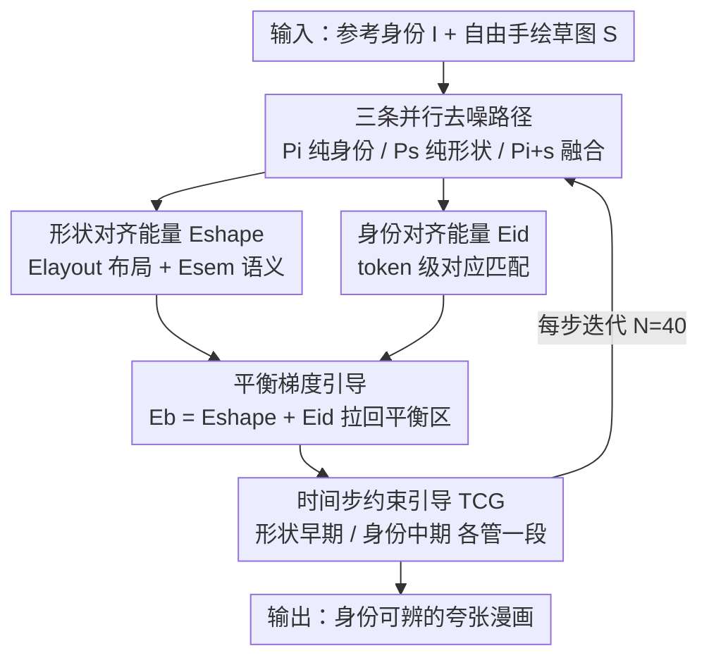

# CaricHarmony: Contrastive Diffusion Paths for Identity-Preserving Caricature Synthesis

**会议**: CVPR 2026  
**论文**: [CVF Open Access](https://openaccess.thecvf.com/content/CVPR2026/html/Wang_CaricHarmony_Contrastive_Diffusion_Paths_for_Identity-Preserving_Caricature_Synthesis_CVPR_2026_paper.html)  
**代码**: https://dongyuuw.github.io/CaricHarmony/ （项目页）  
**领域**: 扩散模型 / 图像生成  
**关键词**: 漫画合成, 身份保持, 草图引导, 能量函数引导, 免训练扩散

## 一句话总结
CaricHarmony 把"既要夸张变形又要保住身份"这个老大难问题重新诊断为扩散去噪轨迹里的**条件信号污染**，提出一个**免训练**框架：推理时并行跑三条去噪路径（纯身份、纯草图、融合输出），用作用在 cross-attention 特征上的能量函数把融合路径拉回身份与形状之间的平衡区，在不微调任何参数、16 秒出图的前提下把 shape CLIP 提到 0.8615（DemoCaricature 0.8450），用户总体偏好 7.81（vs 6.06）。

## 研究背景与动机

**领域现状**：漫画（caricature）合成要的是一个悖论——脸要被极度夸张地扭曲（鼻子拉长、眼睛缩小），但又要一眼能认出是谁。早期 GAN 方法（CariGANs、WarpGAN、AutoToon、StyleCariGAN）做的是"自动夸张"，用户完全无法控制变形成什么样；近期可控方法里，DemoCaricature 用自由手绘草图引导形状，但需要对每个身份做约 70 秒的逐样本微调；CaricatureBooth 则把草图限制成固定数量的贝塞尔曲线，还得在合成数据上大规模预训练。

**现有痛点**：当身份条件 $C_{id}$ 和形状条件 $C_s$ 同时塞进扩散模型时，结果几乎必然塌向两个极端之一——要么忽略草图的夸张创意去保身份，生成平淡的写实肖像；要么忠实跟随草图、把脸扭得认不出来。没有方法能稳定地"两头都顾上"。

**核心矛盾**：作者把根因点出来——**条件信号污染（condition signal contamination）**。从 score-based 扩散的连续视角看，纯身份保持区域和纯形状跟随区域在去噪轨迹上的概率密度都比中间的"平衡区"更高，于是轨迹会被吸向密度高的一侧，中间那个理想平衡点反而是个低密度的不稳定区。两个条件不是简单地"加权融合"就能调和，它们在去噪轨迹里**相互破坏性干涉**。先前方法（DemoCaricature、CaricatureBooth）从没碰这个底层污染问题，只是把 ID-shape 冲突挪了个位置出现。

**本文目标**：在不训练、不微调、不限制草图格式的前提下，让生成轨迹稳定停在身份与形状的平衡区。

**切入角度**：既然"混合被污染的信号"是病根，那就**不要去混合**——保留两条"未被污染"的参考路径作为锚点，用它们去校正第三条融合路径。

**核心 idea**：推理时维护三条并行扩散路径 $P_i$（纯身份）、$P_s$（纯形状）、$P_{i+s}$（融合输出），用专门设计的 cross-attention 能量函数在每一步去噪时给 $P_{i+s}$ 提供梯度引导，把它从任一极端拉回平衡区。

## 方法详解

### 整体框架
CaricHarmony 建立在 SDXL（Juggernaut-XL-v9 权重）之上，身份条件用 PuLID 的 ID Encoder 注入，形状条件用 T2I-Sketch-Adapter 注入，整个方法**零训练、零微调**，全部发生在推理阶段。它的核心是同时跑三条去噪轨迹：

- $P_i$：只喂身份条件 $I$，天然把轨迹引向忠实的身份保持；
- $P_s$：只喂二值草图 $S$ 作为形状条件，天然把轨迹引向精确的漫画几何；
- $P_{i+s}$：两个条件都喂，是最终输出路径，但天生会塌向某一极端。

$P_i$ 和 $P_s$ 是"未污染"的参考锚点。每一步去噪时，把 $P_{i+s}$ 的 cross-attention 中间特征分别和 $P_s$、$P_i$ 对齐：形状侧用 $E_{shape}$（含 $E_{layout}$ 和 $E_{sem}$）保证草图保真，身份侧用 $E_{id}$ 通过 token 级对应匹配保证身份保真。两个能量天然对立——一旦轨迹偏向某侧，另一侧的引导强度就增大，把 latent 拉回来。复合能量 $E_b = E_{shape} + E_{id}$ 作为额外的"平衡条件" $C_b$，在去噪过程中持续提供梯度引导，阻止轨迹塌缩。最后还用时间步约束（TCG）让两类引导只在各自合适的去噪阶段生效（形状早期、身份中期）。

### 关键设计

**1. 三条并行未污染去噪路径：把"混合污染信号"换成"用纯净锚点校正"**

这是全文的根基设计，直接对应"条件信号污染"这个诊断。先前方法都在试图把 $C_{id}$ 和 $C_s$ 直接融合，结果两个条件在去噪轨迹里破坏性干涉，轨迹被高密度的两极吸走。CaricHarmony 的做法是**不混合**：额外跑两条只带单一条件的路径 $P_i$（只有身份）和 $P_s$（只有形状），它们各自处在"未被污染"的状态，分别精确编码了身份保持能力和形状夸张能力。融合路径 $P_{i+s}$ 不再独自摸索平衡点，而是以这两条纯净路径作为参考目标，每一步被它们"拉"向中间。为了记号清晰，论文用上标 $i$、$s$ 标记来自 $P_i$、$P_s$ 的中间特征，$P_{i+s}$ 的特征不带上标。这样把一个"如何混合两个冲突条件"的难题，转化成"如何让一条路径分别向两条纯净路径靠拢"的可控对齐问题。

**2. 形状对齐能量 $E_{shape}$：用 query 特征对齐保住草图的夸张几何**

只跟随融合很容易丢掉草图的夸张，所以要让 $P_{i+s}$ 的 cross-attention 特征对齐 $P_s$。受 PuLID 启发，作者取每个 cross-attention block 的 query 特征 $Q^s$ 作为形状布局目标（query 反映了文本/草图条件如何在空间上落位）。布局能量 $E_{layout}$ 在逐 token 上对齐 $Q$ 与 $Q^s$：

$$E_{layout} = \sqrt{\sum_{j=1}^{n} \|q_j - q_j^s\|_2^2 \cdot c_j^s}$$

其中 $c_j^s \in [0,1]$ 是置信权重，表示每个 token 与草图笔画的关联强度：把草图 $S$ 栅格化成二值笔画图（笔画像素为 1、背景为 0），再 resize 到 query 特征的空间分辨率得到。这样只在与笔画相关的 token 上施加形状引导，抑制无关区域。此外还有语义一致性项 $E_{sem}$：如果两张漫画脸形接近，它们对文本 key 的注意力定位也该一致，于是用 query 对文本 key $K_{txt}$ 的注意力图作为额外信号：

$$E_{sem} = \|\text{Attn}(K_{txt}, Q, Q) - \text{Attn}(K_{txt}, Q^s, Q^s)\|_2$$

合起来 $E_{shape} = E_{layout} + E_{sem}$。

**3. 身份对齐能量 $E_{id}$：用 token 级对应匹配跨越漫画的域间隙**

只跟形状会严重掉身份。传统做法用人脸识别特征提取器算 ID loss，但这些模型只在真实照片上训练，漫画的极端夸张造成巨大域间隙，让常规 ID loss 失效；而且 ID 引导得在中间时间步施加，那时预测图还很糙。作者改用 $P_i$ 的 ID-conditioned cross-attention 输出 $O^i$ 来引导 $P_{i+s}$ 的输出 $O$。难点是：当 $P_{i+s}$ 被夸张形状 $C_s$ 影响后，$O$ 和 $O^i$ 的布局分布可能完全不同，硬对齐会造成布局错位、把模型搞糊涂。解法是**基于 query 相关性建立对应**——把 $P_i$ 的 query-output 对当成一本"字典"，query token 是"键"、output token 是"值"。对融合路径的每个 $o_j$，先用 query 的余弦相似度找出最匹配的 $k$：

$$k = \arg\max_l \Phi(q_j, q_l^i)$$

然后检索字典里对应的 $o_k^i$ 作为引导目标，能量为：

$$E_{id} = \sqrt{\sum_{j=1}^{n} \|o_j - o_k^i\|_2^2 \cdot c_j^i}$$

置信权重 $c_j^i = \frac{\Phi(q_j, q_k^i) - \phi}{1 - \phi}$（$\phi = \min_l \Phi(q_j, q_l^i)$）会在匹配度不够"突出"（和其他 query token 区分不开）时削弱引导强度，避免错误匹配带来的误导。这套机制利用了扩散中间特征本身就保留布局信息这一点来定位人脸部件，正是常规 ID loss 做不到的。

**4. 平衡梯度引导 + 时间步约束：让两股对立的力找到甜点并各管一段**

$E_{shape}$ 和 $E_{id}$ 天然对立：latent 偏向哪一侧，另一侧的引导就增强、把它拽回来。把两者合成复合能量 $E_b = E_{shape} + E_{id}$ 作为额外平衡条件 $C_b$。在 score 函数上，第一项用 classifier-free guidance、第二项用 $E_b$ 的梯度：

$$\hat{\epsilon}_t \leftarrow (1+\gamma)\epsilon_\theta(\hat{z}_t, t, C_e) - \gamma\epsilon_\theta(\hat{z}_t, t, \varnothing)$$
$$\tilde{\epsilon}_t \leftarrow \hat{\epsilon}_t + \eta \nabla_{\hat{z}_t} E_b(\hat{z}_t, t, C_b, C_e)$$

$\gamma$ 控制 CFG 强度、$\eta$ 控制平衡强度。再叠加**时间步约束引导（TCG）**：$E_{shape}$ 管粗尺度的布局，$E_{id}$ 管细粒度的身份细节，为契合去噪的 coarse-to-fine 特性，让 $E_{shape}$ 在早期 $t \in [1000, 700]$ 生效、$E_{id}$ 稍晚在 $t \in [900, 400]$ 生效（结束得早是为了不破坏最终细节质量）。

### 损失函数 / 训练策略
本方法**没有任何训练或微调**，所有"损失"都是推理期的能量函数梯度。关键超参：基于 SDXL + Juggernaut-XL-v9，DPM++ 2M 采样器，推理步数 $N=40$，CFG scale $\gamma=7$，平衡引导率 $\eta=0.4$，输出分辨率 $768\times768$，单张 RTX 4090 约 16 秒出图。文本提示固定为 "A highly exaggerated and detailed caricature of a man/woman."

## 实验关键数据

数据集为 WebCaricature（每个身份取序号最小的照片作参考 ID，从对应漫画提边缘图作草图，共 1216 个样本）。S-CLIP 比生成结果与真值漫画的边缘图、衡量形状一致性；I-CLIP 比生成漫画与身份图、衡量身份一致性；再用 ImageReward、PickScore 评整体质量。

### 主实验

| 方法 | I-CLIP ↑ | S-CLIP ↑ | ImageReward ↑ | PickScore ↑ |
|------|---------|---------|---------------|-------------|
| StyleCariGAN | 0.5228 | - | 0.4340 | 0.0637 |
| WarpGAN | 0.6634 | - | -0.2588 | 0.1033 |
| AutoToon | 0.7628 | - | -0.4978 | 0.1094 |
| DemoCaricature | 0.7591 | 0.8450 | 0.2871 | 0.0949 |
| **Ours (full)** | 0.7512 | **0.8615** | **0.8509** | **0.2049** |

本文在 S-CLIP（0.8615 vs 0.8450）、ImageReward（0.8509 vs 0.2871）、PickScore（0.2049 vs 0.0949）上全面领先 DemoCaricature；I-CLIP 略低于 DemoCaricature（0.7512 vs 0.7591），作者解释这是因为 CLIP 这类评估模型在漫画域有域间隙、I-CLIP 对形状夸张程度高度敏感，定量上略低但定性与用户研究都显示身份保持充分。速度上 16 秒出图、约比 DemoCaricature（70 秒/身份微调）快 4×，且接受任意草图格式、无需预处理。

### 用户研究

| 方法 | ID ↑ | Shape ↑ | Overall ↑ |
|------|------|---------|-----------|
| StyleCariGAN | 4.59 | - | 4.91 |
| WarpGAN | 4.81 | - | 4.62 |
| AutoToon | 6.73 | - | 5.50 |
| DemoCaricature | 6.03 | 5.51 | 6.06 |
| **Ours** | **6.83** | **8.08** | **7.81** |

20 个身份 × 20 张夸张手绘草图共 200 个样本，16 名志愿者按 1–10 打分。本文在身份、形状、总体三项都拿到最高分，尤其 Shape（8.08 vs 5.51）拉开明显差距——印证了人类在形状扭曲下仍能抓住人脸特征，而本文恰好把"既扭得够、又认得出"这件事做到位。

### 消融实验

| 配置 | I-CLIP | S-CLIP | 说明 |
|------|--------|--------|------|
| Full model | 0.7512 | 0.8615 | 完整模型，平衡身份与形状 |
| w/o $E_{shape}$ | 0.7747 | 0.8296 | 偏向身份：脸结构保得好但夸张不够，像普通肖像 |
| w/o $E_{id}$ | 0.7381 | 0.8698 | 偏向形状：跟草图但身份可辨识度下降、细节变糙 |

### 关键发现
- **两股能量的对立性是设计核心**：去掉 $E_{shape}$ 时 I-CLIP 升到最高（0.7747）、S-CLIP 掉到 0.8296；去掉 $E_{id}$ 时 S-CLIP 升到最高（0.8698）、I-CLIP 掉到 0.7381——正好把模型推向两个极端，完整模型才落在平衡点上。
- **TCG 确有用**：消融图显示去掉时间步约束后细节变差、出现破坏整体质量的伪影。
- **可调的平衡旋钮**：线性调节 $E_{id}$（2→0）与 $E_{shape}$（0→2）的缩放系数，输出在"身份主导↔形状主导"之间平滑过渡，用户可按偏好调档。
- **极端夸张鲁棒**：脸结构剧烈变形时本文仍能保住可辨身份，而 DemoCaricature 在高度夸张草图下会因条件信号干涉而读不懂空间信息。

## 亮点与洞察
- **重新定义问题比堆方法更值钱**：把"ID-shape 冲突"诊断成"条件信号污染 / 去噪轨迹被高密度两极吸走"，这个 score-based 视角的重构是全文最"啊哈"的地方——一旦这么看，"保留未污染参考路径"就成了自然解，而不是又一个加权平衡 trick。
- **三路对比路径思路可迁移**：任何"两个条件相互冲突、直接融合会塌"的可控生成任务（如风格 vs 内容、布局 vs 纹理），都能借鉴"维护纯净单条件锚点路径 + 能量梯度校正融合路径"的范式。
- **token 级对应匹配绕开域间隙**：用 query 相似度建"字典"去检索目标 output token，而非硬对齐布局，巧妙解决了漫画夸张导致的布局错位，也躲开了在真实照片上训练的 ID loss 在漫画域失效的问题。
- **彻底免训练**：无预训练、无逐样本微调、无草图格式限制，把专业漫画创作的门槛降到"有张草图就行"，工程上很有吸引力。

## 局限与展望
- **I-CLIP 仍略低于 DemoCaricature**：作者归因于 CLIP 在漫画域的域间隙让 I-CLIP 对形状夸张过度敏感，但这也说明缺一个真正适配漫画域的身份一致性度量，当前定量身份评估并不完全可信。
- **依赖底座生成能力**：所有变体的 ImageReward/PickScore 都高，作者明确归功于 SDXL 的强生成力——方法的上限受底座扩散模型约束，换弱底座效果存疑。⚠️ 以原文为准。
- **多条路径的推理开销**：同时跑三条去噪轨迹并每步算能量梯度，相比单路径推理有额外算力成本（虽仍比逐样本微调快），论文未给出与单路径的显存/吞吐对比。
- **时间步窗口为手工设定**：$E_{shape}$、$E_{id}$ 的生效区间（[1000,700]、[900,400]）是经验值，是否对所有身份/草图都最优、能否自适应，值得进一步探索。

## 相关工作与启发
- **vs DemoCaricature**: 同样用自由手绘草图控形状，但它把身份信息编进文本 embedding 和 cross-attention 的 key-value 通路、需逐样本微调约 70 秒，且没考虑身份与形状的冲突，极端草图下表现受限；本文免训练、16 秒出图、显式解冲突。
- **vs CaricatureBooth**: 它把草图限制成固定数量贝塞尔曲线并用 TPS 形变造合成数据预训练，严重约束草图自由度与创意；本文接受任意草图格式、无需预处理。
- **vs 早期 warping GAN（StyleCariGAN / WarpGAN / AutoToon）**: 它们做自动夸张、完全不可控；本文给出显式可控、可调平衡的草图引导。
- **vs PuLID**: 借鉴了其用 query 特征做对齐、用对比对齐避免污染原模型行为的思路，但 PuLID 是通用免微调个性化、不处理形状夸张冲突；本文在其 ID Encoder 之上插 T2I-Sketch-Adapter 并专门设计能量函数解 ID-shape 冲突。

## 评分
- 新颖性: ⭐⭐⭐⭐⭐ 把 ID-shape 冲突重诊断为去噪轨迹的条件信号污染，并用三条未污染并行路径求解，视角与方法都新。
- 实验充分度: ⭐⭐⭐⭐ 主实验+用户研究+消融+缩放/极端夸张分析较全，但缺漫画域专用身份度量与多路径开销对比。
- 写作质量: ⭐⭐⭐⭐⭐ 问题诊断清晰、公式与设计动机对应紧密，故事讲得有说服力。
- 价值: ⭐⭐⭐⭐ 免训练、快、不限草图格式，显著降低漫画创作门槛，范式可迁移到其他冲突条件可控生成任务。

<!-- RELATED:START -->

## 相关论文

- [\[CVPR 2026\] Semantic Alignment for Pose-Invariant Identity Preserving Diffusion](semantic_alignment_for_pose-invariant_identity_preserving_diffusion.md)
- [\[CVPR 2026\] Identity-Preserving Image-to-Video Generation via Reward-Guided Optimization](identity-preserving_image-to-video_generation_via_reward-guided_optimization.md)
- [\[CVPR 2026\] Not All Birds Look The Same: Identity-Preserving Generation For Birds](not_all_birds_look_the_same_identity-preserving_generation_for_birds.md)
- [\[CVPR 2025\] StableAnimator: High-Quality Identity-Preserving Human Image Animation](../../CVPR2025/image_generation/stableanimator_high-quality_identity-preserving_human_image_animation.md)
- [\[CVPR 2026\] Attribute-Preserving Pseudo-Labeling for Diffusion-Based Face Swapping](attribute-preserving_pseudo-labeling_for_diffusion-based_face_swapping.md)

<!-- RELATED:END -->
