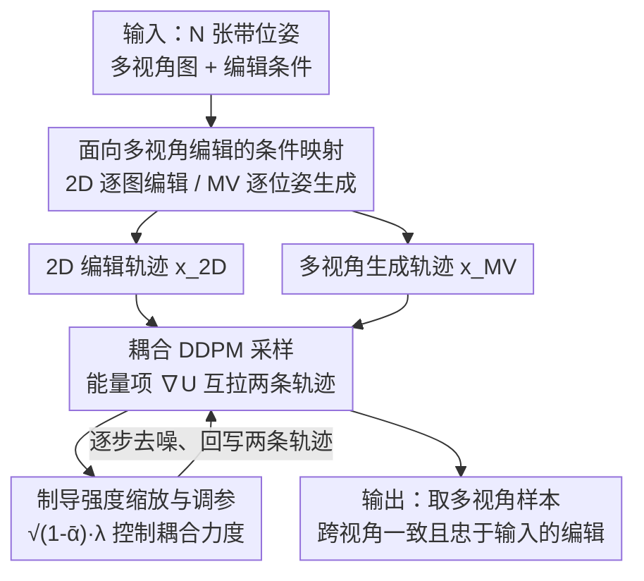

# Coupled Diffusion Sampling for Training-Free Multi-View Image Editing

**会议**: CVPR 2026  
**论文**: [CVF Open Access](https://openaccess.thecvf.com/content/CVPR2026/html/Alzayer_Coupled_Diffusion_Sampling_for_Training-Free_Multi-View_Image_Editing_CVPR_2026_paper.html)  
**代码**: [项目页 coupled-diffusion.github.io](https://coupled-diffusion.github.io)  
**领域**: 扩散模型 / 图像生成与编辑  
**关键词**: 多视角编辑, 免训练, 扩散采样, 耦合制导, 三维一致性

## 一句话总结
针对「2D 编辑模型逐张改图会跨视角不一致、而走 NeRF/3DGS 显式三维又慢又糊」的痛点，本文提出**耦合扩散采样（coupled diffusion sampling）**：让一个现成 2D 编辑模型和一个多视角生成模型在去噪过程中并行各跑一条采样轨迹，再用一个耦合能量项把两条轨迹互相拉近，从而**不训练任何新模型**就得到既满足编辑目标、又跨视角一致的结果，在空间编辑、风格化、重光照三个任务上用户偏好率（80%/47%/46%）大幅领先。

## 研究背景与动机
**领域现状**：基于扩散的 2D 图像编辑（重光照、空间结构编辑、风格化）通过端到端训练 + 配对数据已经做得非常逼真。当人们想把这种编辑能力搬到「一组同场景多视角照片」上时，自然的做法是用 2D 模型逐张编辑，或者用 2D 模型去监督一个显式三维表示（NeRF / 3D Gaussian Splatting）。

**现有痛点**：逐张独立编辑会让每张图各编辑各的，跨视角根本对不齐（同一辆车在不同视角下颜色、阴影都不一样）；而依赖显式三维表示「平均掉」不一致的方法，需要耗时的逐场景优化、要求输入视角足够稠密，在稀疏视角下不稳定、还会产生模糊或 Janus（多头）伪影。另一类直接为每个编辑任务训练一个多视角扩散模型的路线，算力昂贵且合适的多视角/4D 训练数据极度稀缺。

**核心矛盾**：根本问题在于 **2D 扩散模型天然缺乏三维一致性意识**，而获取三维一致性的传统手段（显式重建）又把「免训练、前馈、稀疏视角可用」这些优点都丢了。同时，如果只拿单张编辑图去喂多视角生成模型合成其余视角，这个问题是欠约束的——存在大量解，输出会丢失输入的身份信息。

**本文目标**：在**不训练任何新模型、不做显式三维优化**的前提下，把现成 2D 编辑模型的编辑能力提升到多视角一致。

**切入角度**：作者的关键观察是——**任何由预训练多视角扩散模型生成的图像序列，本身就内蕴多视角一致性**。于是与其用 2D 模型去监督训练一个三维表示，不如把多视角扩散模型当作一个「隐式三维正则器」，在采样阶段直接借它的分数（score）来约束 2D 编辑结果。

**核心 idea**：让 2D 编辑模型和多视角生成模型在采样时**各跑一条扩散轨迹并互相制导**——多视角模型把「跨视角一致」灌给 2D 编辑，2D 模型把「编辑内容/输入身份」灌给多视角生成，最终取多视角那条轨迹的样本作为输出。

## 方法详解

### 整体框架
方法要解决的是：给定一组带位姿的多视角图 $\{I_k, P_k\}_{k=1}^N$ 和一个编辑条件（如重光照的环境贴图、风格化的文本提示、空间编辑的粗略变换），输出一组**跨视角一致**的编辑结果。整体思路是「两条轨迹 + 一个耦合项」：一条轨迹由 2D 编辑模型 $\epsilon_{\theta,\text{2D}}$ 驱动、负责把编辑做对；另一条由多视角生成模型 $\epsilon_{\theta,\text{MV}}$ 驱动、负责保证跨视角一致；在每个去噪时间步，用一个耦合能量项 $\nabla U$ 把两条轨迹互相拉近，使它们在保持各自分布的同时趋于对齐。最终取多视角轨迹的样本作为输出（因为我们希望结果落在多视角分布里，天然一致）。

具体串接是：先用 2D 模型编辑出一张参考图 $I_{1,\text{edited}}$，把它连同其余视角的位姿 $\{P_k\}_{k=2}^N$ 一起喂给多视角模型做新视角合成；为了让结果忠于其余输入视角（而不是只忠于那一张参考），再把两个模型耦合起来联合采样。耦合发生在潜空间（latent space），本节实验里 2D 模型和多视角模型都跑在 Stable Diffusion 2.1 的潜空间中。

### 关键设计

**1. 面向多视角编辑的条件映射：把 2D 编辑和多视角生成接到同一组位姿上**

要让「耦合」这件事对多视角编辑有意义，先得把两个模型挂到同一套坐标上。作者对 2D 编辑模型，**逐张独立**地条件在每个输入图 $I_k$ 上（它只管把这一张编辑好）；对多视角模型，则条件在一张已编辑的参考图 $I_{1,\text{edited}}$ 和其余视角位姿 $\{P_k\}_{k=2}^N$ 上做新视角合成。耦合则在「条件于 $I_k$ 的 2D 潜变量」与「对应位姿 $P_k$ 的多视角潜变量」之间逐视角进行。这样设计的好处是：2D 那一侧贴着每个真实输入视角（保住身份/内容），多视角那一侧贴着位姿（保住几何一致），耦合就把这两类约束在每个视角上对齐。若只把单张编辑图喂多视角模型，问题欠约束、会丢身份；逐视角耦合正是补上这个约束的关键。

**2. 耦合 DDPM 采样：用一个能量项让两条扩散轨迹互相制导**

这是全文核心。给定共享数据域、共享 DDPM 噪声表的两个扩散模型 $\epsilon_{\theta_A}$、$\epsilon_{\theta_B}$，目标是采出两个样本 $x^A, x^B$，既各自服从预训练分布 $p^A_\text{data}$、$p^B_\text{data}$，又彼此靠近。作者引入耦合函数度量两样本的接近程度，取欧氏距离形式 $U(x,x')=-\frac{\lambda}{2}\lVert x-x'\rVert_2^2$，并把目标写成

$$\max_{x^A,x^B}\ \mathcal{J}^A(x^A,x^B)+\mathcal{J}^B(x^A,x^B),\quad \mathcal{J}^A(x;x'):=p^A_\text{data}(x)\,\exp U(x,\text{sg}(x')),$$

其中 $\text{sg}$ 表示 stop-grad。对其求梯度得 $\nabla_x \mathcal{J}^i = \nabla_x \log p^i(x) + \nabla_x U(x,x')$——前一项就是标准扩散的分数，**后一项 $\nabla_x U(x,x')=-\lambda(x-x')$ 把轨迹从「各自独立去噪」偏置到「互相靠拢」**。落到采样算法上（Algorithm 1）：每个时间步先各自算出 clean 估计 $\hat{x}_{0,\text{MV}}$、$\hat{x}_{0,\text{2D}}$ 并各做一步 DDPM，得到 $\hat{x}_{t-1}$；再加一个耦合制导步

$$x_{t-1}^A = \hat{x}_{t-1}^A + \sqrt{1-\bar\alpha_{t-1}}\,\nabla_{\hat{x}_0^A}U(\hat{x}_0^A,\hat{x}_0^B),$$

对 $B$ 对称。固定 $\hat{x}_0^B$ 时，$\exp U(\hat{x}_0^A,\hat{x}_0^B)\propto \mathcal{N}(\hat{x}_0^B, \tfrac{1}{\sqrt{\lambda}}I)$，即把另一条轨迹的 clean 估计当作一个高斯先验，对「$\hat{x}_0^A$ 离 $\hat{x}_0^B$ 太远」赋予高能量——本质是一个**软正则**，鼓励两个样本靠近但不强迫相等。它和「分数平均 / product-of-experts」那类组合采样的根本区别在于：后者要求样本落在两个模型支撑集的**交集**里、没有公共支撑就失败，并会把样本推离各自流形（导致闪烁）；耦合采样则让每个样本**始终留在自己模型的先验分布内**，只是被另一方「轻推」着满足跨模型约束。

**3. 制导强度的 $\sqrt{1-\bar\alpha}$ 缩放与 $\lambda$ 调参区间**

耦合能不能用得好，强度调控是关键。系数 $\lambda$ 直接决定耦合力度：$\lambda=0$ 退化为标准 DDPM（两条轨迹各跑各的），增大 $\lambda$ 则加强耦合；但与其他基于制导的方法一样，**制导过强会让采样塌缩、产出分布外（OOD）结果**。为缓解这一点，作者把耦合制导项按 $\sqrt{1-\bar\alpha_{t-1}}$ 缩放，作用是限制训练分布与推理分布在各时间步上的 KL 散度，使注入的制导随去噪进程自适应衰减（细节见附录）。实验（指南强度分析，对应正文图 9）证实存在一个**甜区**：$\lambda$ 太小时输出接近 image-to-MV、重建质量低；增大 $\lambda$ 重建变好；但 $\lambda$ 过大跨帧一致性下降直至崩溃——存在一段让重建与一致性同时最优的区间，这正是耦合采样价值的体现。

### 一个完整示例
以多视角空间编辑为例走一遍：输入是同一辆车的若干带位姿照片，编辑条件是「把车平移并旋转一个角度」。① 先在每张图上用深度图把目标物体反投影到三维、施加 3D 变换、再投影回图像，得到逐图的粗略编辑作为 2D 模型（Magic Fixup）的条件；② 取其中一张编辑结果作参考、连同其余位姿喂多视角模型合成新视角；③ 进入耦合 DDPM 采样循环：每步两条轨迹各去噪一步，再用 $\nabla U$ 互拉——2D 轨迹把「车被正确平移旋转、阴影/反射合理」推给多视角轨迹，多视角轨迹把「各视角几何一致、背面视角不乱」推回给 2D 轨迹；④ 收敛后取多视角样本作为输出。结果是车被正确变换、且各视角阴影平滑、背面视角不再像基线那样闪烁或丢身份。

## 实验关键数据

三个任务分别用三个现成 2D 模型耦合同一个多视角模型 [63]：空间编辑用 Magic Fixup、风格化用 ControlNet（边缘控制）、重光照用 Neural-Gaffer（输入环境贴图）。统一基线包括 Liu et al.[31]、Du et al.[13]（通用扩散组合方法）、逐图 2D 编辑、以及「单图编辑 + image-to-MV」。一致性用 MEt3r 衡量，并用 Prolific 每任务 25 名参与者做用户研究（best-of-n 偏好）。

### 主实验（空间编辑，对 GT 3D 变换渲染评测）

| 方法 | PSNR ↑ | SSIM ↑ | LPIPS ↓ | MEt3r ↓ | 用户偏好 ↑ |
|------|--------|--------|---------|---------|-----------|
| Per-image [2] | 16.5 | 0.550 | 0.253 | 0.353 | - |
| Image-to-MV [63] | 12.84 | 0.400 | 0.556 | 0.417 | - |
| Liu et al. [31] | 16.5 | 0.530 | 0.354 | 0.368 | 9% |
| Du et al. [13] | 16.7 | 0.548 | 0.411 | 0.344 | 1% |
| SDEdit [36] | 15.4 | 0.458 | 0.468 | 0.393 | 11% |
| **Coupled Sampling (Ours)** | **17.0** | **0.550** | 0.421 | **0.335** | **80%** |

本文在 PSNR/SSIM 和多视角一致性 MEt3r 上均最优，用户偏好 80% 远超所有基线。注意逐图 Per-image 的 LPIPS 更低（0.253），但它跨视角不一致（MEt3r 0.353 差）、且不可用作多视角输出。

### 风格化（VBench 评时序/主体一致性，MEt3r 评几何一致，CLIP 对编辑提示）

| 方法 | CLIP ↑ | Temporal ↑ | Subject ↑ | MEt3r ↓ | 用户 ↑ | 免网格 |
|------|--------|-----------|-----------|---------|--------|--------|
| Per-image [60] | 30.0 | 0.922 | 0.740 | 0.546 | - | ✓ |
| Image-to-MV [63] | 29.5 | 0.927 | 0.787 | 0.382 | - | ✓ |
| TEXTure [43] | 28.4 | 0.967 | 0.748 | 0.426 | 14% | ✗ |
| Hunyuan3D [47] | 29.9 | 0.952 | 0.754 | 0.391 | 8% | ✗ |
| Liu et al. [31] | 30.1 | 0.934 | 0.759 | 0.461 | 19% | ✓ |
| Du et al. [13] | 30.2 | 0.926 | 0.762 | 0.461 | 12% | ✓ |
| **Coupled Sampling (Ours)** | 29.68 | 0.946 | **0.807** | 0.392 | **47%** | ✓ |

本文在主体一致性（Subject 0.807）上最高、几何一致性 MEt3r（0.392）逼近 image-to-MV，用户偏好 47% 领先。注意 TEXTure / Hunyuan3D 是**用到 GT 网格的特权基线**（带 ✗ 表示需网格），其时序一致性天然高（基于网格渲染），但本文在不访问网格的前提下取得了更高的用户偏好。

### 重光照（对 GT 重光照评测，7 物体 × 5 光照 = 35 组）

| 方法 | PSNR ↑ | SSIM ↑ | LPIPS ↓ | MEt3r ↓ | 用户 ↑ |
|------|--------|--------|---------|---------|--------|
| Per-image [20] | 22.7 | 0.862 | 0.159 | 0.243 | - |
| Image-to-MV [63] | 19.3 | 0.815 | 0.193 | 0.229 | - |
| Liu et al. [31] | 23.2 | 0.871 | 0.152 | 0.220 | 10% |
| Du et al. [13] | 22.1 | 0.863 | 0.158 | 0.217 | 19% |
| GT NeRF + Neural Gaffer [20] | 22.4 | 0.865 | 0.162 | 0.217 | 25% |
| **Coupled Sampling (Ours)** | **23.2** | 0.868 | 0.157 | **0.217** | **46%** |

重光照下逐图 Per-image 因分布方差小、可视为粗略上界；本文耦合后**重建无退化**、一致性与最优持平，用户偏好 46% 高于含特权 GT NeRF 的基线（25%）。

### 关键发现
- **耦合强度存在甜区**：随 $\lambda$ 增大重建变好但一致性下降，太大则崩溃；存在让重建与一致性同时最优的区间（图 9），印证「软正则、留在各自先验内」的设计价值。
- **超越多视角的泛化**：把方法用到纯文生图流模型 Flux（flow-based）上做双提示耦合采样，两张图在空间上对齐却仍各自忠于提示；用到视频模型 Wan2.1 上，逐帧高度对齐——说明耦合机制不限于多视角/DDPM，对 flow 模型与视频生成同样有效。
- **分数平均类组合（Liu/Du）为何输**：它们靠平均两个模型的分数，会把样本推离多视角流形导致跨帧闪烁；耦合采样让样本始终留在多视角分布内，故一致性显著更好。

## 亮点与洞察
- **「互相制导」而非「分数平均」**：最巧妙的一点是把两个模型当成两条耦合轨迹、用一个简单的高斯软正则 $\nabla U=-\lambda(x-x')$ 互拉，既保证各自样本不离开自己的先验流形，又满足跨模型约束——一举绕开了 product-of-experts 必须有公共支撑、否则失败的硬约束。
- **隐式三维正则**：用「多视角扩散模型生成的序列天然一致」这一观察，把多视角模型当隐式三维正则器，完全免去 NeRF/3DGS 的逐场景优化和稠密视角要求，前馈采样即得结果。
- **极强的通用性**：同一套采样框架不改一行训练代码，就能套到空间编辑/风格化/重光照三种任务、不同骨干（SD2.1、Flux、Wan2.1）、不同潜空间，甚至图像↔视频——这种「即插即用的采样级耦合」思路很容易迁移到其他需要跨实例对齐的生成任务（如多视角/多帧编辑、风格统一）。
- **$\sqrt{1-\bar\alpha}$ 缩放的小心思**：用一个随去噪进程衰减的缩放限制训练/推理分布的 KL 散度，是把「制导别太猛」这件事做对的工程关键，值得复用到其他制导式采样里。

## 局限与展望
- 作者明确指出：方法**继承底层模型的优劣**——耦合只是引导采样，2D 编辑模型和多视角模型本身的缺陷（编辑能力上限、生成伪影）都会原样保留。
- 制导强度 $\lambda$ 是需要调的超参，过强会塌缩为 OOD，意味着不同任务/场景可能需要重新找甜区，缺乏自适应选择机制。
- 评测规模偏小（空间编辑 10 个编辑、重光照 35 组对比），且部分指标（如 MEt3r、重建分数）对微妙的光照闪烁不敏感，主要靠用户研究支撑结论。⚠️ 以原文为准。
- 展望：作者认为该耦合范式可延伸到视频编辑——把图像编辑模型与视频扩散模型耦合，从而在不增计算开销下获得视频编辑能力。

## 相关工作与启发
- **vs 显式三维方法（NeRF/3DGS + 2D 监督，如 Instruct-NeRF2NeRF [16]）**：它们靠显式重建「平均掉」不一致，需逐场景优化、要求稠密视角、稀疏时不稳定且糊；本文用隐式三维（多视角扩散先验）做正则，纯前馈采样、免优化、免训练。
- **vs 直接训练多视角编辑模型**：那条路对每个编辑任务都要专门训练、数据稀缺且昂贵；本文复用现成多视角生成模型 + 现成 2D 编辑模型，零额外训练。
- **vs 组合采样（product-of-experts [17,62] / MultiDiffusion [5] / SyncTweedies [23] / Liu et al.[31] / Du et al.[13]）**：这些方法多在**同一模态**内组合、靠分数平均或要求样本落在支撑集交集，会推离流形产生闪烁；本文跨 2D↔3D 模态、强调「留在各自先验分布内只做软对齐」，正是为解决三维数据稀缺这一实际问题而设计。
- **vs 测试时制导（classifier guidance [12]、可微目标 [4,15]、逆问题 [11,21,51]）**：这些通常面向**固定**目标做制导；本文的制导目标是**另一条轨迹的当前样本**（动态目标），从而能捕捉无法用可微函数刻画的复杂编辑，并在无配对数据下实现多视角编辑。

## 评分
- 新颖性: ⭐⭐⭐⭐⭐ 「两条轨迹软耦合互相制导」的采样范式简洁而通用，跨模态桥接 2D↔3D，明显区别于分数平均类组合。
- 实验充分度: ⭐⭐⭐⭐ 三任务 + 多骨干 + 图像/视频泛化 + 强度分析覆盖全面，但每任务样本量偏小、部分指标对闪烁不敏感、较依赖用户研究。
- 写作质量: ⭐⭐⭐⭐⭐ 动机—观察—方法—公式—算法链条清晰，图 3 的轨迹示意把核心机制讲得很直观。
- 价值: ⭐⭐⭐⭐⭐ 免训练、即插即用、可迁移到视频编辑等更广生成任务，实用价值高。

<!-- RELATED:START -->

## 相关论文

- [\[CVPR 2026\] InstructMix2Mix: Consistent Sparse-View Editing Through Multi-View Model Personalization](instructmix2mix_consistent_sparse-view_editing_through_multi-view_model_personal.md)
- [\[CVPR 2026\] Dynamic-eDiTor: Training-Free Text-Driven 4D Scene Editing with Multimodal Diffusion Transformer](dynamic-editor_training-free_text-driven_4d_scene_editing_with_multimodal_diffus.md)
- [\[CVPR 2026\] UniEdit-I: Training-free Image Editing for Unified VLM via Iterative Understanding, Editing and Verifying](uniedit-i_training-free_image_editing_for_unified_vlm_via_iterative_understandin.md)
- [\[CVPR 2026\] Correspondence-Attention Alignment for Multi-View Diffusion Models](correspondence-attention_alignment_for_multi-view_diffusion_models.md)
- [\[CVPR 2026\] Efficient and Training-Free Single-Image Diffusion Models](efficient_and_training-free_single-image_diffusion_models.md)

<!-- RELATED:END -->
