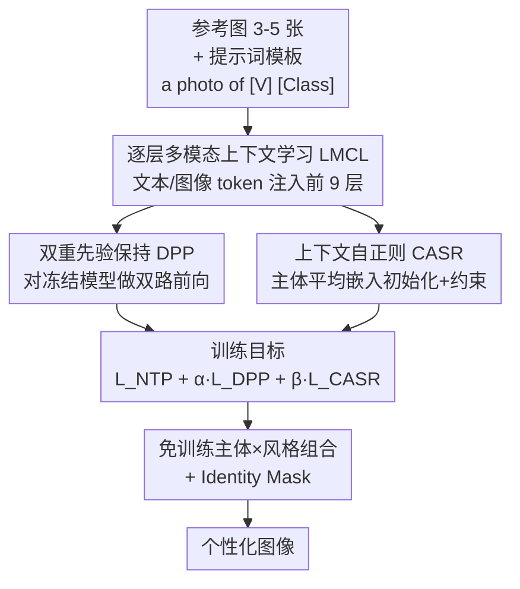

# DCoAR: Deep Concept Injection into Unified Autoregressive Models for Personalized Text-to-Image Generation

**会议**: CVPR 2026  
**论文**: [CVF Open Access](https://openaccess.thecvf.com/content/CVPR2026/html/Wu_DCoAR_Deep_Concept_Injection_into_Unified_Autoregressive_Models_for_Personalized_CVPR_2026_paper.html)  
**代码**: 待确认  
**领域**: 图像生成 / 个性化定制  
**关键词**: 个性化生成、统一自回归模型、概念注入、风格定制、参数高效

## 一句话总结
DCoAR 把"概念注入"从只在输入层插一次 token，升级成在统一自回归模型的多层 Transformer 中逐层注入可学习的多模态 token，并配上双重先验保持（DPP）与上下文自正则（CASR）两个正则项；在完全冻结骨干、可训练参数不到 0.1M 的前提下，主体保真度逼近需要训上百兆参数的微调类方法，还能免训练地把任意主体渲染成任意风格。

## 研究背景与动机
**领域现状**：统一多模态自回归（AR）模型（如 Chameleon、Lumina-mGPT）把文本和图像统一成一串离散 token，用 next-token prediction 同时做理解和生成，已经在文生图、图像描述、补全等任务上展现出很强的通用性。但把它用到"个性化生成"（给几张参考图，让模型在新场景里画出这个特定主体/风格）上的研究还很少，潜力远未挖掘。

**现有痛点**：现有给 AR 模型做个性化的两条路都有硬伤。一条是**适配类（adaptation-based）**，借鉴 DreamBooth 用 LoRA 等 PEFT 改写权重——但 AR 模型比扩散模型脆弱得多，用 3–5 张图去调几百万参数几乎必然过拟合、灾难性遗忘、破坏预训练先验；而且每个新概念都要单独存一套权重，存储成本无上限，根本无法规模化部署。另一条是**概念注入类（concept-injection）**，冻结骨干、只学几个 token（如 Yo'Chameleon、UniCTokens），可扩展性好——但它们只在**输入层**注入概念，信号要穿过几十层 Transformer 却得不到任何强化。

**核心矛盾**：浅层注入存在"语义衰减瓶颈"——细粒度身份线索随着层数加深而逐渐消失，模型无法把概念绑定到复杂提示词上。结果就是注入类方法在视觉保真度、上下文适应性、语义一致性上全面落后于微调类，被困在"可扩展但画不像"的尴尬位置。

**本文目标**：在保住"冻结骨干、可扩展"这个优点的同时，把保真度拉到微调类的水平，并顺带实现免训练的主体×风格自由组合。

**切入角度**：作者的核心观察是——既然信号穿过深层会衰减，那就别只在入口喂一次，而是**沿途多次补给**。把概念 token 注入到多个 Transformer 层，让身份信息在深层传播中持续被强化。

**核心 idea**：用"深层概念注入（Deep Concept Injection）"代替"浅层输入注入"，即 Layer-wise Multimodal Context Learning（LMCL），并用两个正则项稳住这个深注入过程不要漂移、不要过拟合。

## 方法详解

### 整体框架
DCoAR 要解决的是：在一个**完全冻结**的统一 AR 模型上，只额外训练极少量的 token，就让它学会一个新主体，并能在任意新场景/风格下高保真地复现这个主体。整套流程围绕一组"多模态上下文 token"展开——训练阶段把它们逐层插进 Transformer，用 next-token prediction 把主体概念"压进"这些 token，同时用 DPP 防止模型语言能力漂移、用 CASR 防止 token 过拟合到训练提示词；推理阶段直接拼接不同主体和风格的 token，配合 Identity Mask 就能免训练地做主体×风格组合。

整个框架由四块组成：**LMCL**（逐层注入可学习多模态 token，是概念的载体）、**DPP**（拿冻结模型当锚点，约束定制后的分布别偏离原生分布）、**CASR**（用主体平均嵌入初始化并约束图像 token，防过拟合、增强再上下文化）、以及推理期的**免训练主体×风格组合 + Identity Mask**。前三块都作用在同一组 token 上、共同构成训练目标，最后一块在推理期复用学好的 token。

### 关键设计

**1. 逐层多模态上下文学习（LMCL）：把概念信号沿 Transformer 深度反复补给，治"浅注入衰减"**

这是 DCoAR 的核心，直接针对"输入层注入一次、信号穿深层就衰减"这个痛点。作者为同一个主体定义一组共享的多模态可学习 token $P = \{p_{[v]}, p_I\}$，其中文本模态 token $p_{[v]} \in \mathbb{R}^{1\times N\times D}$、图像模态 token $p_I$ 形状相同，$N$ 是插入层数、$D$ 是嵌入维度。训练时为每张参考图构造模板 `a photo of [V] [Class]`，$[V]$ 是代表主体身份的占位符。在第 $i$ 层，原始 token 序列 $U_i=\{y_1,\dots,y_L,x_1,\dots,x_T\}$ 被改写为

$$U'_i = \{y_1, \dots, p^{(i)}_{[v]}, \dots, y_L, p^{(i)}_I, x_1, \dots, x_T\}$$

即用 $p^{(i)}_{[v]}$ 替换文本序列里的 $[V]$、把 $p^{(i)}_I$ 插在第一个图像 token 之前——**每一层都插一份**，而不是只在入口插。然后用标准的 next-token prediction 损失 $L_{NTP}=-\sum_t \log p_\theta(x_t\mid x_{<t}, y)$ 把主体概念逐步"灌"进这些 token。骨干一个参数都不动，只学 $\{p_{[v]}, p_I\}$，所以可训练参数极小（实测 0.073M）。与旧注入法的本质区别就在于：身份线索在深层传播中被持续强化，而不是一路衰减到消失，这才让保真度能追上微调类方法。

**2. 双重先验保持（DPP）：拿冻结模型当锚，防止定制后语言能力漂移**

只学 token 也会有副作用——模型可能因为反复拟合那几张参考图而发生"语言漂移"，丢掉原有的泛化与多样性。DPP 把 DreamBooth 的先验保持思想从扩散的连续 latent 迁移到 AR 的离散 token 上。具体做法：先用预训练模型以 `a photo of a [Class]` 生成一小批（6–8 张）类别图，连同文本一起 tokenize 成序列 $U_{cls}$，然后对它做**双路前向**——一路是原始 $U_{cls}$ 过冻结模型得到零样本分布 $\text{logits}_{zs}$，另一路是插入了逐层图像上下文 token 的 $U'_{cls}$ 过当前模型得到 $\text{logits}_{prior}$。损失为

$$L_{DPP} = \lambda_1 \cdot L_{NTP_{cls}}(\text{logits}_{prior}, \text{labels}_{cls}) + \lambda_2 \cdot D_{KL}(\text{logits}_{zs} \,\|\, \text{logits}_{prior})$$

其中第一项是类别图上的 NTP 损失（保证类别图本身还能正确重建），第二项是 KL 散度 $D_{KL}=\sum_{v\in V}\text{logits}_{zs}(v)\log\frac{\text{logits}_{zs}(v)}{\text{logits}_{prior}(v)}$，把定制后的输出分布拉回到冻结模型的原生分布附近。这个双路设计正是把"先验保持"从扩散搬到离散 token AR 的关键适配。

**3. 上下文自正则（CASR）：用主体嵌入初始化并约束 token，防过拟合、强化再上下文化**

LMCL 学到的 token 还有个问题：容易"死记"那几张训练图的外观细节，导致换到新场景就崩（再上下文化差）。CASR 的思路是让 token 别离主体的真实表示太远。具体地，把所有参考图喂进冻结模型，在第 $i$ 层取所有图像 token 的平均嵌入 $E^{(i)}_{subject}$，**用它来初始化**可学习图像上下文 token $p^{(i)}_I$，让训练从一个贴近主体分布的起点出发、加速收敛；并加一个约束损失

$$L_{CASR} = \frac{1}{N}\sum_{i=1}^{N} \left\| p^{(i)}_I - E^{(i)}_{subject} \right\|_2$$

把 $p^{(i)}_I$ 持续往主体嵌入空间里拉。这样 token 既保留了身份判别性、又不至于过特化到训练提示词，从而显著提升在新场景下的再上下文化表现。三个损失合成总目标 $L_{obj} = L_{NTP} + \alpha L_{DPP} + \beta L_{CASR}$（$\alpha=10^{-2}$，$\beta=5\times10^{-4}$）。

**4. 免训练主体×风格组合 + Identity Mask：冻结骨干换来即插即用的零样本组合**

因为骨干完全没动，AR 模型原生的多模态理解/生成能力得以保留，这就自然支持零样本的主体×风格组合。推理时只需**直接拼接**某主体学好的上下文 token 和某风格学好的上下文 token（风格用单张参考图、只插前 3 层训练），就能免训练地把任意主体画成任意风格。为了避免拼接后两类 token 互相污染（如主体的颜色错误地"渗"到场景其他元素上），作者引入 **Identity Mask**，在注意力层显式限制主体 token 与风格 token 之间的注意力流动，强制二者解耦、各自独立地贡献到最终生成。消融显示，去掉这个 mask 会出现严重的概念污染。

### 损失函数 / 训练策略
总目标为 $L_{obj} = L_{NTP} + \alpha L_{DPP} + \beta L_{CASR}$。骨干用 Lumina-mGPT-7B FP-SFT，全程冻结，单张 H800 训练。主体定制：每层插 1 个文本 + 1 个图像 token，插入**前 9 层**，训练 1000 步；风格定制：同样配置但只插**前 3 层**，单张参考图训练 600 步。学习率 1e-2、batch size 1，$\alpha=10^{-2}$、$\beta=5\times10^{-4}$、$\lambda_1=\lambda_2=0.5$，其余沿用 Lumina-mGPT 默认超参。

## 实验关键数据

### 主实验
**主体定制（DreamBench，30 个主体）**：评测主体保真度用 CLIP-I / DINO，提示词保真度用 CLIP-T，并报告可训练参数量。

| 方法 | 类型 | DINO | CLIP-I | CLIP-T | 可训练参数 |
|------|------|------|--------|--------|-----------|
| Real Images | — | 0.774 | 0.885 | — | — |
| Textual Inversion | 扩散 | 0.569 | 0.780 | 0.255 | — |
| DreamBooth (Imagen) | 扩散 | 0.696 | 0.812 | 0.306 | — |
| Kosmos-G | 扩散 | 0.694 | 0.847 | 0.287 | — |
| Yo'Chameleon | 统一AR(注入) | 0.542 | 0.795 | 0.225 | 0.13M |
| UniCTokens | 统一AR(注入) | 0.599 | 0.782 | 0.304 | 0.13M |
| PersonalAR | 统一AR(微调) | 0.671 | 0.805 | 0.302 | 1610.6M |
| Proxy-Tuning | 统一AR(微调) | 0.752 | 0.809 | 0.312 | 142.6M |
| **DCoAR (Ours)** | 统一AR(注入) | 0.723 | **0.815** | **0.318** | **0.073M** |

DCoAR 在 CLIP-I 上拿到 0.8151，超过第二名 DreamBooth(Imagen) 0.4%；CLIP-T 0.3184 刷新最佳，比第二名 Proxy-Tuning 高 0.29%。DINO 排第二（0.723 vs Proxy-Tuning 0.752），但 DCoAR 只用 0.073M 参数，而 Proxy-Tuning 要额外训一个扩散模型、每个主体生成上百到上千张增强图，效率与易用性完全不在一个量级。相比同为注入类的 Yo'Chameleon / UniCTokens，三项指标全面领先。

**风格定制（StyleDrop，单张参考图，免训练）**：

| 方法 | 主体对齐 | 风格对齐 | 文本对齐 |
|------|---------|---------|---------|
| ZipLoRA (SDXL) | **0.655** | 0.597 | 0.272 |
| B-LoRA | 0.579 | 0.505 | 0.258 |
| **DCoAR (Ours)** | 0.604 | **0.605** | **0.308** |

DCoAR 在三项上全面超过 B-LoRA；与 ZipLoRA 相比，主体对齐略低（0.604 vs 0.655），但风格保持相当（0.605 vs 0.597）、文本对齐更高（0.308 vs 0.272），关键是**完全免训练**就拿到这个结果。

### 消融实验
**三个损失的逐项叠加（DreamBench）**：

| LMCL | DPP | CASR | DINO | CLIP-I | CLIP-T |
|------|-----|------|------|--------|--------|
| ✓ | | | 0.6610 | 0.7647 | 0.3096 |
| ✓ | ✓ | | 0.7142 | 0.8019 | 0.2968 |
| ✓ | | ✓ | 0.7194 | 0.7905 | 0.3192 |
| ✓ | ✓ | ✓ | **0.7226** | **0.8151** | 0.3184 |

只用 LMCL 时 DINO/CLIP-I/CLIP-T 为 0.6610/0.7647/0.3096。加 DPP 后主体保真度大涨（DINO→0.7142、CLIP-I→0.8019），但 CLIP-T 略降到 0.2968（先验约束牺牲了一点提示词灵活性）。加 CASR 则三项都升、尤其 CLIP-T 升到 0.3192（再上下文化变好）。三者全开拿到最佳综合（DINO 0.7226、CLIP-I 0.8151，CLIP-T 0.3184 仍很强），说明 DPP 主补保真、CASR 主补再上下文化，二者互补。

### 关键发现
- **注入深度有"先升后降"的甜区**：在第 1/3/9/24 层分别只插 token 做对比，CLIP-T 基本平稳，而 CLIP-I 和 DINO 随深度先升后降；插到很深的第 24 层反而掉保真度。作者归因于参考数据太少，当 token 影响转移到更高层语义层时更容易过拟合——这也解释了为什么主体定制选"前 9 层"而非全注入。
- **DPP 与 CASR 分工明确**：DPP 主要补主体保真（但略压提示词对齐），CASR 主要补再上下文化与提示词对齐；从消融表能清楚看到二者作用方向不同、合在一起才最优。
- **Identity Mask 对组合生成是刚需**：去掉它会出现严重的概念污染，主体颜色会错误渗到场景其他元素；加上后主体/风格 token 干净解耦，组合生成才语义连贯。

## 亮点与洞察
- **"浅注入→深注入"的诊断很对症**：作者把注入类方法落后的根因精准定位到"信号穿深层衰减"，再用逐层补给直接修复，思路清晰、改动小但收益大——这种"沿深度反复注入"的思想可迁移到任何冻结骨干 + token 个性化的场景（如视频、3D 生成）。
- **参数效率反差极大**：0.073M 可训练参数追平甚至超过 142.6M（Proxy-Tuning）、1610.6M（PersonalAR）的微调类方法，是注入范式"可扩展"优势的有力背书——每个新概念只存一组极小 token，存储成本几乎可忽略。
- **免训练主体×风格组合很优雅**：冻结骨干保留了原生多模态能力，于是"拼 token + Identity Mask"就能零样本组合，不需要为每个组合再训一遍，这是相对 LoRA 类方法的结构性便利。
- **把 DreamBooth 先验保持迁到离散 AR**：DPP 用"双路前向 + KL 对齐输出分布"的方式，把原本针对扩散连续 latent 的先验保持改造成对 token 分布有效，是一个可复用的迁移技巧。

## 局限与展望
- **DINO 仍略逊于最强微调法**：DCoAR 的 DINO（0.723）低于 Proxy-Tuning（0.752），说明在最细粒度的主体一致性上，注入类离重度微调还有一点差距，"完全弥合保真鸿沟"更多体现在 CLIP-I/CLIP-T 上。
- **深度注入的甜区依赖少样本约束**：插太深会过拟合，"前 9 层"是在 3–5 张参考图下的经验最优；当参考数据更多或更少时，最优插入深度/层数是否要重调、是否能自适应，论文未深入。⚠️ 以原文为准。
- **风格主体对齐弱于 ZipLoRA**：免训练组合的代价是主体对齐略低（0.604 vs 0.655），在对主体细节（如颜色）要求极高的场景可能不够。
- **依赖特定骨干**：实验只在 Lumina-mGPT-7B 上验证，方法对其他统一 AR 骨干（Chameleon、Lumina-mGPT 2.0 等）的可迁移性与最优层数配置尚待验证。

## 相关工作与启发
- **vs Yo'Chameleon / UniCTokens（注入类）**: 它们只在输入层注入 token，DCoAR 改为逐层注入并加 DPP/CASR 正则；区别在"注入深度 + 稳定性"，DCoAR 在相近甚至更少参数下三项指标全面领先（如 DINO 0.723 vs 0.599/0.542）。
- **vs PersonalAR / Proxy-Tuning（微调类）**: 它们改写大量权重（142.6M–1610.6M），保真度高但不可规模化；DCoAR 冻结骨干、仅 0.073M 参数就逼近其保真度，且无需额外训扩散模型/海量数据增强，效率与可扩展性碾压。
- **vs DreamBooth**: DCoAR 借用其先验保持思想，但通过"双路前向 + KL"把它从扩散连续 latent 适配到离散 token AR（即 DPP），解决了直接套用不兼容的问题。
- **vs ZipLoRA / B-LoRA（风格 LoRA）**: 它们需为风格训练 LoRA，DCoAR 靠拼接 token 免训练组合；主体对齐稍弱于 ZipLoRA，但文本对齐更高、且零训练成本。

## 评分
- 新颖性: ⭐⭐⭐⭐ 把"浅注入"升级为"逐层深注入"并配两个对症正则，思路清晰、定位精准，虽非颠覆性但很扎实
- 实验充分度: ⭐⭐⭐⭐ 主体/风格/组合三类任务 + 损失消融 + 注入深度分析 + Identity Mask 消融，覆盖完整
- 写作质量: ⭐⭐⭐⭐ 动机—方法—实验逻辑顺畅，图表清晰，公式完整
- 价值: ⭐⭐⭐⭐⭐ 0.073M 参数追平百兆级微调法，注入范式可扩展优势的有力证明，对 AR 个性化落地很实用

<!-- RELATED:START -->

## 相关论文

- [\[CVPR 2026\] Design Your Ad: Personalized Advertising Image and Text Generation with Unified Autoregressive Models](design_your_ad_personalized_advertising_image_and_text_generation_with_unified_a.md)
- [\[CVPR 2026\] CoLoGen: Progressive Learning of Concept-Localization Duality for Unified Image Generation](cologen_progressive_learning_of_concept-localization_duality_for_unified_image_g.md)
- [\[CVPR 2026\] Premier: Personalized Preference Modulation with Learnable User Embedding in Text-to-Image Generation](premier_personalized_preference_modulation_with_learnable_user_embedding_in_text.md)
- [\[CVPR 2026\] Neighbor-Aware Localized Concept Erasure in Text-to-Image Diffusion Models](neighbor-aware_localized_concept_erasure_in_text-to-image_diffusion_models.md)
- [\[CVPR 2026\] LoFA: Learning to Predict Personalized Prior for Fast Adaptation of Visual Generative Models](lofa_learning_to_predict_personalized_prior_for_fast_adaptation_of_visual_genera.md)

<!-- RELATED:END -->
