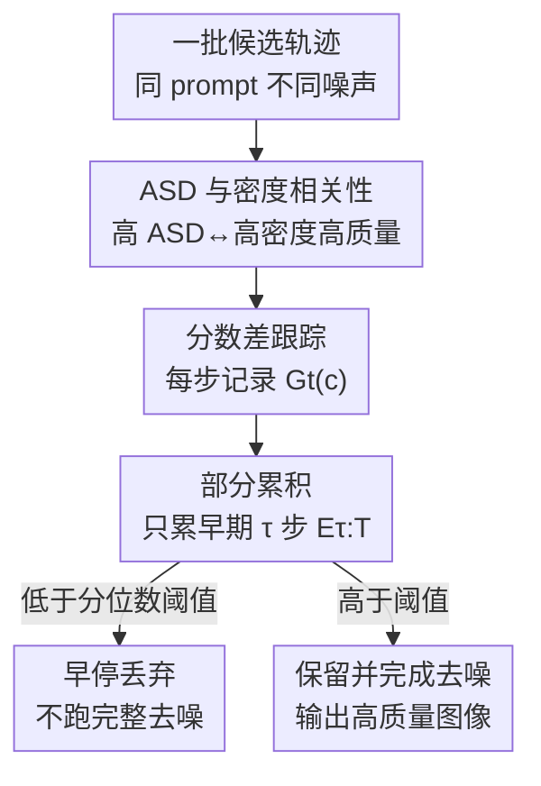

# Diffusion Sampling Path Tells More: An Efficient Plug-and-Play Strategy for Sample Filtering

**会议**: CVPR 2026  
**论文**: [CVF Open Access](https://openaccess.thecvf.com/content/CVPR2026/html/Wang_Diffusion_Sampling_Path_Tells_More_An_Efficient_Plug-and-Play_Strategy_for_CVPR_2026_paper.html)  
**代码**: 无  
**领域**: 图像生成 / 扩散模型 / 推理时对齐  
**关键词**: 扩散采样, 样本筛选, Classifier-Free Guidance, 推理时对齐, 无奖励评估

## 一句话总结
本文发现扩散去噪轨迹中「条件分数与无条件分数的累积差异（ASD）」强相关于样本质量，据此提出 CFG-Rejection——一个无需外部奖励模型、不改架构、在去噪早期就能剪掉低质量轨迹的即插即用筛选策略，在 HPSv2/PickScore/GenEval/DPG-Bench 上一致提升生成质量。

## 研究背景与动机
**领域现状**：扩散模型采样具有随机性，同一 prompt 换个随机种子可能生成天差地别的结果。用户实际使用时往往是「碰运气」——反复 regenerate 直到满意，既费时又费算力。为了缓解这种质量波动，主流有两条路：一是训练侧微调（用 RL 或隐式奖励 fine-tune 模型），二是推理时对齐（在采样阶段操纵噪声向量挑出更好的样本，如 Best-of-N、DNO）。

**现有痛点**：这两类方法都很贵。训练侧要构建奖励模型、重标数据、大规模微调；推理时对齐则普遍依赖**外部奖励模型**（如 PickScore），而这些奖励模型有两个硬伤——（1）它们是在有限数据和老架构（SD1.5/SDXL）上训出来的，对新模型或文字渲染这类精细任务泛化差；（2）它们是 **post-hoc 在像素空间评估**的，必须等图像完全去噪生成后才能给出质量信号，这意味着 Best-of-N 要把所有候选都跑完整个去噪流程才能比较，浪费巨大。

**核心矛盾**：质量信号来得太晚（要等完整去噪）+ 信号来自外部（要训练奖励模型并面临域不匹配）。能不能在采样**进行中**、用模型**自己内部**就有的信号，提前判断这条轨迹有没有前途？

**切入角度**：作者从一个对 CFG 的几何解读出发——CFG 会把样本推向数据流形的高密度、语义连贯区域。如果是这样，那么「条件引导对轨迹的影响有多大」本身就携带了「这条轨迹是否朝高质量区收敛」的信息，而这个影响在 CFG 公式里是现成可读的（条件分数减无条件分数）。

**核心 idea**：用去噪轨迹中条件分数与无条件分数的**累积差异 ASD** 作为零成本的内禀质量代理，在去噪早期就筛掉低 ASD 的轨迹，从而绕开外部奖励模型、绕开完整去噪。

## 方法详解

### 整体框架
方法分两步走：先用受控实验**揭示** ASD 与样本密度（即质量）的强相关性，再据此**设计**一个早停筛选器 CFG-Rejection。核心量是每个去噪步上条件分数与无条件分数的差异 $G_t(c)=\|S_\theta(x_t;\sigma_t,c)-S_\theta(x_t;\sigma_t,\emptyset)\|_2$，它衡量「条件信号把去噪预测改动了多少」。把它沿轨迹累加即得 ASD。关键观察是 $G_t(c)$ 在**去噪早期**最具区分度，因此不必等完整轨迹，只用早期若干步的部分累积就能判断好坏——这正是「早停」省钱的来源。整条流程：跟踪每步分数差 → 早期部分累积 → 按阈值（分位数）丢弃低潜力轨迹。

### 关键设计

**1. ASD：把「条件影响的累积」当作内禀质量信号**

痛点是质量信号一直依赖外部奖励模型且要等图生成完。作者的突破口在于：CFG 的得分公式 $S_w(x;\sigma,c)=wS_\theta(x;\sigma,c)+(1-w)S_\theta(x;\sigma,\emptyset)$ 里，条件分数和无条件分数之差本就反映了「条件把轨迹往哪推、推多狠」。于是定义单步分数差 $G_t(c)=\|S_\theta(x_t;\sigma_t,c)-S_\theta(x_t;\sigma_t,\emptyset)\|_2$，再沿全部去噪步求平方和得到累积分数差（Accumulated Score Difference）：

$$E_T(c)=\sum_{t=1}^{T} G_t(c)^2.$$

取平方 $\ell_2$ 形式是有意为之：它得到一个**能量式**的量，会放大那些大的条件偏离，而这些大偏离恰恰集中在早期去噪阶段、信息量最足。作者在一个二维分形 toy 分布（带高密度中央主干和稀疏外围分支）上验证：高 ASD 样本聚集在稠密中心、类别一致性强；低 ASD 样本落在稀疏外围、语义对齐弱；那些几乎零 ASD 的退化样本对应实际文生图里「画崩」的破图。更进一步，局部样本密度与 ASD 呈 **log-linear 正相关**（Fig. 3），并在 ImageNet 上用 Avg-kNN 和 LOF 两个流形密度指标复现了这一趋势——ASD 越大，样本越落在高似然区，生成-条件对齐越好。这就把「质量」转化成了一个采样过程中现成可读、无需任何外部模型的标量。

**2. CFG-Rejection：用早期部分累积实现早停剪枝**

光有 $E_T(c)$ 还不够——若 post-hoc 算完整 ASD 再取 top-k，等于每个候选都得跑完整去噪，省不下钱。作者注意到 $G_t(c)$ 在早期步最具区分度，于是改用**部分累积**：给定截断步 $\tau\in[1,T]$，只累积去噪后期/早期的 $\tau$ 个步（按公式从 $T-\tau$ 累到 $T$）：

$$E_{\tau:T}(c)=\sum_{t=T-\tau}^{T} G_t(c)^2,$$

当 $E_{\tau:T}(c)<\gamma$ 时直接丢弃该轨迹、不再完成剩余去噪。这样 Best-of-N 那种「全部跑完再挑」的浪费被换成了「跑几步就能淘汰大部分坏苗子」。实验显示 $\tau=10$ 就已拿到绝大部分质量增益，$\tau=20$ 后基本饱和，说明早期分数差确实是足够强的筛选信号，这是该方法效率优势的根本来源。Fig. 4 对比清楚：Best-of-N 跑完全程 + 外部奖励模型选图；CFG-Rejection 靠采样路径里的内禀信息提前掐掉低质量生成。

**3. 逐步归一化 + 分位数阈值：让筛选稳健且跨 prompt 通用**

直接累加各步分数差会有两个工程隐患。其一，不同去噪步的噪声尺度差异巨大，若不处理，高噪声步会主导累积、造成时间步不公平；作者按各步噪声水平做归一化，消除 timestep imbalance，让各步贡献被公平对待。其二，ASD 的绝对量级在不同 prompt 之间差别很大（复杂 prompt 与简单 prompt 不可比），因此**不用固定阈值 $\gamma$**，改用**基于分位数的筛选**（如保留每个 prompt 内 ASD 排名前若干百分比的样本）。这两点让 CFG-Rejection 无需逐 prompt 调参就能即插即用地嵌进现有生成 pipeline，且不改模型架构、不改采样调度。

## 实验关键数据

### 主实验
在 ImageNet（EDM2-S，Heun 采样 32 步）上，按 ASD 选出 top 10% 样本，人类偏好分一致提升；不同 $\tau$ 下 $\tau=10$ 即接近上限：

| 数据集/指标 | Full set | Top 10% (τ=10) | τ=15 | τ=20 |
|------|------|------|------|------|
| ImageNet PickScore↑ | 20.38 | 20.52 | 20.60 | 20.61 |
| ImageNet HPSv2↑ | 26.13 | 26.31 | 26.48 | 26.55 |

GenEval（SDv1.5，guidance=9）上 ASD 筛选在多数组合类别上超过 random，整体分从 0.4322（random）提到 0.4785（τ=20），其中两物体关系类提升尤为显著（论文称 +46% 量级提升）：

| 方法(ω=9) | Two Obj. | Counting | Color Attri. | Overall↑ |
|------|------|------|------|------|
| random | 0.3725 | 0.3578 | 0.0688 | 0.4322 |
| 4 from 50 | 0.5455 | 0.3375 | 0.11 | 0.4728 |
| τ=20 | 0.50 | 0.4094 | 0.1175 | **0.4785** |

等算力时间预算对比（ImageNet，PickScore）：在 5s 极紧预算下 CFG-Rejection（21.04）优于 Best-of-N（20.92），DNO 因每步优化约 15s 在小预算下不可用；预算放宽到 10–15s 后 Best-of-N 略反超，差距很小：

| 时间预算(s) | CFG-Rejection | Best-of-N | DNO |
|------|------|------|------|
| 5 | **21.04** | 20.92 | – |
| 10 | 21.09 | 21.15 | – |
| 15 | 21.12 | 21.23 | 20.79 |

### 消融实验

| 配置 | 关键指标 | 说明 |
|------|---------|------|
| τ=10 | HPSv2 26.31 / GenEval 接近上限 | 早期 10 步信号已足够，省算力 |
| τ=20 | HPSv2 26.55 / DPG 性能饱和 | 后续步贡献边际递减 |
| 4-from-20 vs 4-from-50 | DPG overall 64.48 vs 65.15 | 候选池更大略有提升但差距小 |
| 记忆化检查（vs random） | Similarity 0.3805→0.3912 | 相似度仅微升，无记忆化证据 |

### 关键发现
- **早期信号最值钱**：$\tau=10$ 就拿到绝大部分增益，$\tau\ge20$ 饱和——意味着可以在去噪早期就剪枝，这是效率优势的核心。
- **不是靠记忆训练样本**：在 SDv2.1（10k LAION 子集 + 记忆抑制）上，CFG-Rejection 相比 random 的 SSCD 相似度仅从 0.3805 微升到 0.3912（仍在合理范围），但 CLIP Score（0.2581→0.2615）和 HPSv2（22.84→22.98）一致提升，证明增益来自质量筛选而非选中被记忆的高频样本。
- **复杂 prompt 收益更大**：组合推理类（两物体关系）提升最明显，说明高密度轨迹筛选在难场景里更管用；而 SDXL 因默认对齐已较强、样本分布更紧，可改进空间小、增益较温和。

## 亮点与洞察
- **把 CFG 的「副产物」变成免费质量探针**：条件分数差本是 CFG 计算中现成就有的量，作者第一个揭示并量化了它与样本密度/质量的 log-linear 相关，等于发现了一个零成本、无需训练任何奖励模型的内禀 verifier。
- **「早停」而非「事后选」**：传统 Best-of-N 必须全部跑完再挑，浪费全在被淘汰的样本上；CFG-Rejection 把判断点前移到去噪早期，省的正是这部分算力，思路可迁移到任何带 CFG 的生成模态（视频/3D）。
- **工程细节决定能不能即插即用**：逐步噪声归一化解决时间步不公平、分位数阈值解决跨 prompt 量级差异——这两个看似不起眼的处理，是它「不调参直接用」的关键。

## 局限与展望
- **内禀信号只是粗代理**：作者坦承 ASD 对质量的刻画比基于人类偏好的奖励（PickScore）粗，因此在算力充足、时间预算放宽时会被 Best-of-N 略微反超；它的定位是「奖励模型不可用或部署昂贵时的稳健轻量默认项」。
- **理论解释偏经验**：ASD 与密度相关性主要靠 toy 分布几何 + ImageNet 密度指标支撑，形式化讨论放在附录，相关性机制的严格刻画仍有余地（⚠️ 公式 5–7 的具体定义以原文附录为准）。
- **仅在图像验证**：论文声称可推广到视频、3D 等模态，但实验只覆盖图像生成，跨模态有效性待验证。
- **依赖 CFG**：方法本质构建在 classifier-free guidance 之上，对不使用 CFG 或引导很弱的采样流程不直接适用。

## 相关工作与启发
- **vs Best-of-N**：两者都做样本筛选，但 Best-of-N 依赖外部奖励模型且要等所有候选完整去噪后才能评估；本文用 CFG 内禀的 ASD 信号在去噪早期就筛，无需奖励模型、无需跑完，省算力，但质量代理较粗。
- **vs DNO / RENO（直接噪声优化）**：它们在 latent 空间做梯度优化反复正反向采样，每步约 15s，极贵；本文不做优化、只做前向筛选，在紧预算下可用性碾压。
- **vs LGD（reward-guided generation）**：LGD 把奖励梯度注入去噪过程实现在线引导，但引入不稳定且仍依赖外部监督；本文完全无奖励、无额外监督。

## 评分
- 新颖性: ⭐⭐⭐⭐⭐ 首次揭示并利用 CFG 内禀的 ASD 信号做无奖励早停筛选，视角新颖
- 实验充分度: ⭐⭐⭐⭐ 覆盖 ImageNet/GenEval/DPG 多模型多基准 + 记忆化专项检查，但跨模态未验证
- 写作质量: ⭐⭐⭐⭐ 现象发现→机制→方法的叙事清晰，公式与直觉解释到位
- 价值: ⭐⭐⭐⭐ 即插即用、零额外成本，适合作为无奖励场景的默认筛选项

<!-- RELATED:START -->

## 相关论文

- [\[CVPR 2026\] PromptLoop: Plug-and-Play Prompt Refinement via Latent Feedback for Diffusion Model Alignment](promptloop_plug-and-play_prompt_refinement_via_latent_feedback_for_diffusion_mod.md)
- [\[ICLR 2026\] RNE: plug-and-play diffusion inference-time control and energy-based training](../../ICLR2026/image_generation/rne_plug-and-play_diffusion_inference-time_control_and_energy-based_training.md)
- [\[CVPR 2026\] Efficient Weighted Sampling via Score-based Generative Models](efficient_weighted_sampling_via_score-based_generative_models.md)
- [\[ICCV 2025\] Trans-Adapter: A Plug-and-Play Framework for Transparent Image Inpainting](../../ICCV2025/image_generation/trans-adapter_a_plug-and-play_framework_for_transparent_image_inpainting.md)
- [\[CVPR 2026\] Memory-Efficient Fine-Tuning Diffusion Transformers via Dynamic Patch Sampling and Block Skipping](memory-efficient_fine-tuning_diffusion_transformers_via_dynamic_patch_sampling_a.md)

<!-- RELATED:END -->
