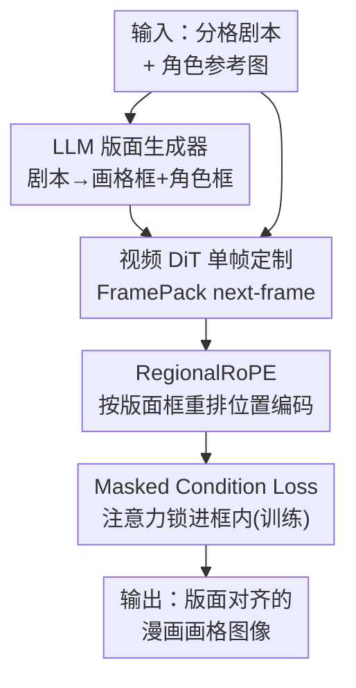

# DreamingComics: A Story Visualization Pipeline via Subject and Layout Customized Generation using Video Models

**会议**: CVPR 2026  
**论文**: [CVF Open Access](https://openaccess.thecvf.com/content/CVPR2026/html/Kwon_DreamingComics_A_Story_Visualization_Pipeline_via_Subject_and_Layout_Customized_CVPR_2026_paper.html)  
**代码**: 项目页 https://yj7082126.github.io/dreamingcomics/  
**领域**: 图像生成 / 故事可视化  
**关键词**: 故事可视化, 漫画生成, 版面控制, 多主体定制, 视频扩散模型

## 一句话总结
DreamingComics 把一个预训练的**视频 DiT**（HunyuanVideo-I2V + FramePack）改造成单帧图像定制器，用 RegionalRoPE 和 masked condition loss 让多个角色参考图各自落到指定版面框里，再配一个微调过的 VLM 自动从剧本生成漫画版面，从而在保持角色身份和艺术风格一致的前提下做可控的故事/漫画可视化，角色一致性比此前最好方法提升 29.2%、风格相似度提升 36.2%。

## 研究背景与动机
**领域现状**：故事可视化（story visualization）要从一段文字叙事 + 角色身份，生成一串连贯的图像。随着 DiT 扩散模型和各种图像定制（image customization）方法的进步，这个方向进展很快，尤其在漫画这种连续画格场景下需求强烈。

**现有痛点**：现有方法在"讲故事"所需的视觉控制上仍然不够。一是**空间定位**——纯文本 prompt 没有像素级精度，无法同时指定"谁出现"和"出现在哪里"；现有 DiT 定制方法要么只能控制 who（UNO、DreamO），要么只能控制 where（Eligen、Regional Prompting），两者兼顾时容易出现角色重叠或外观错乱。二是**风格一致性**——图像生成模型天然偏向写实渲染，对卡通、平涂插画这类风格会"纠偏"，覆盖掉用户想要的画风。三是**数据缺口**——几乎没有同时带"主体身份 + 位置信号"的成对数据集，限制了版面感知定制的发展。

**核心矛盾**：身份控制（who）和空间控制（where）在 DiT 的统一注意力空间里相互纠缠——所有参考图默认共享同一套位置坐标，模型会把不同主体当成"同一个地方来的"，导致空间纠缠和身份塌缩；而要兼顾画风一致，又得有一个不那么偏写实的视觉先验。

**本文目标**：在**单个生成模型**内同时支持多主体身份/风格保持 + 显式版面控制，并尽量减少用户手动指定版面的负担。

**切入角度**：作者的关键观察是——视频生成模型虽然单帧感知质量弱于图像专用模型，但它在训练时见过大量"语义连续的帧序列"，因此带有很强的**时空先验**，天然利于跨帧的身份/风格一致性。于是把视频模型"借用"来做图像定制。

**核心 idea**：用视频 DiT 当 next-frame 预测器做单帧图像定制，再用 RegionalRoPE 把每个参考主体的位置编码"重映射"到目标版面框、用 masked condition loss 把它的注意力锁在框内，最后用一个微调 VLM 自动产出漫画版面。

## 方法详解

### 整体框架
DreamingComics 的运行管线是：给定一段分格剧本 $T=\{T_1,...,T_n\}$ 和若干角色参考图 —— 先由**微调过的 LLM 版面生成器**预测每一格的漫画版面（页内画格框 $D_i$ + 格内每个角色的框 $\text{BOX}_{i,j}$）；这些框作为空间条件送进核心生成模型 **Dream-Illustrator**；Dream-Illustrator 建在视频 DiT（HunyuanVideo-I2V + FramePack）之上，把参考图编码成 token、用 **RegionalRoPE** 按版面框重排它们的位置坐标、并在训练时用 **masked condition loss** 把每个主体的交叉注意力压在指定框内，最终一次只生成一张目标帧（即一格漫画），既继承视频模型的时空先验保证风格/身份一致，又保持图像级的计算开销。

论文用一个漫画专属的表示来统一这两层定位：第 $i$ 格表示为元组 $(T_i, D_i, \{\text{BOX}_{i,1},...,\text{BOX}_{i,n}\})$，其中 $D_i\in\mathbb{R}^4$ 是画格在页面里的框，$\text{BOX}_{i,j}\in\mathbb{R}^4$ 是格内角色框——这样既能推理"画格在页面里怎么排"，也能推理"角色在画格里怎么放"。

### 关键设计

**1. LLM 版面生成器：让模型替用户画出"像样的漫画版面"**

痛点是漫画版面很难用文字描述，让用户手动指定每格、每个角色的框既繁琐又不专业；而现有用 LLM 预测版面的工作（如 TheaterGen）只针对单张图、不会预测**多画格**的页面级版面，不足以生成漫画。作者用监督微调（SFT）在自建的漫画版面数据集上微调一个 LLM（Qwen2.5-VL 7B），输入剧本 $T$，输出结构化的页面版面——解析成画格框和角色框 $(D_i,(\text{BOX}_{i,1},...,\text{BOX}_{i,n}))$，再作为后续生成阶段的空间条件。论文强调它学到了漫画特有的稀疏视觉规律：版面铺满整个画格区域、按"自上而下、从右到左"的正确阅读顺序排列画格、画出合理的角色框——比直接拿同样 prompt 让 GPT-4 生成的版面更像"好的漫画版面"。这把版面当成**一等设计信号**，而不是事后补的辅助约束，同时把用户负担降到只需提供剧本。

**2. 用视频 DiT 做单帧图像定制：借时空先验，又不付视频的计算账**

针对"图像模型偏写实、风格难保持"的痛点，作者不直接用图像生成器，而是建在视频 DiT 主干 HunyuanVideo-I2V 上、并接入 FramePack。HunyuanVideo-I2V 由因果 3D-VAE、MLLM 文本编码器和跨时空统一全注意力的 DiT 组成，用 flow matching 损失 $\mathcal{L}=\|v_\theta(\mathbf{y}_t,t,C_I,T_P)-(\epsilon-\mathbf{y})\|^2$ 训练。关键在于把生成"重述"成 **next-frame 预测**：把参考图当作 $t=0$ 的首帧，去生成一个**时间上较远**的目标帧 $X$。直接当成两帧视频（在 $t=1$ 生成）会产生僵硬的"复制粘贴"伪影、变化少且不跟 prompt；而 FramePack 本就能"从 $t=0$ 的参考产出 $t=9$ 这种远距离帧"，作者借这一性质：给定目标时间步 $t'$ 和 $N$ 张参考图 $F_1,...,F_n$，把每张参考用 VAE 编码成 $c_i=E(F_i)$，再和噪声潜变量 $z_t$、文本潜变量 $z_p$ 拼成输入序列，**一次只出一帧**。这样既吃到视频模型的时空先验（风格/身份更一致），又把计算压在图像级——能在 17 秒内出一张 $1280\times720$ 图，比同样用视频模型的 DRA-Ctrl 快 3 倍以上。论文还特意去掉了原始的 image projection 模块，以支持多主体并减少 copy-paste 伪影。

**3. RegionalRoPE：把每个参考的位置编码重映射到它该去的框**

默认 3D RoPE 给所有参考帧分配相同的起始坐标 $(0,0)$，模型于是觉得所有主体都"从同一个区域来"，导致空间纠缠和身份塌缩（参考内容被挤到左上角）。RegionalRoPE 是一个**确定性映射**：把每个参考的 RoPE 索引对齐到它的目标版面框。对框 $\text{BOX}_i=[w_\text{start},h_\text{start},w_\text{end},h_\text{end}]$ 和参考潜变量 $c_i\in\mathbb{R}^{h_i\times w_i\times d}$，先按框尺寸 $(W_\text{box},H_\text{box})$ 算缩放因子 $s=\min(W_\text{box}/w_i,\,H_\text{box}/h_i)$ 以保持参考长宽比并装进框内，得到调整后的网格 $(W',H')=(s\,w_i,\,s\,h_i)$；再把网格摆进框里（水平居中、竖直方向由 $a\in[0,1]$ 控制对齐，$a{=}0$ 顶对齐、$a{=}0.5$ 居中），最后把每个潜像素 $(i,j)$ 映射到坐标 $(t',i',j')=\big(0,\;w'_\text{start}+\tfrac{W'}{w_i}i,\;h'_\text{start}+\tfrac{H'}{h_i}j\big)$。每个参考用各自坐标独立编码后拼进输入流。和 UNO、OminiControl 等"改 RoPE 是为了**去相关**、减少参考复制"不同，这里是用 RoPE 做**显式空间锚定**；而且它在原生分辨率裁剪的潜变量上操作（不像 DRA-Ctrl/RealGeneral 把输入缩到固定帧尺寸），更好地保住主体细节也更高效。这一步**无需额外训练**。

**4. Masked condition loss：训练时把每个主体的注意力"锁"进它的框**

RegionalRoPE 不训练就能对齐位置，但单独用仍可能出现身份畸变和复制粘贴伪影。作者引入一个监督每个主体空间注意力的 masked condition loss。先从扩散过程里取出参考 $c_i$ 与生成结果的交叉注意力图 $\text{CAM}_{c_i,t,\text{block}_j}=\tfrac{Q_{c_i,t,\text{block}_j}K_{t,\text{block}_j}^T}{\sqrt{d}}$（$Q$ 是第 $i$ 张参考的 token、$K$ 是噪声潜变量 token），跨时间步平均并归一化到 $[0,1]$ 得到每个主体的注意力区域。再用框 $\text{BOX}_i$ 生成二值掩码 $\text{MASK}_i$（框内为 1、框外为 0），定义基于 ReLU 的损失（取 DiT 第 2 层）：$\mathcal{L}_\text{mask}=\tfrac{1}{n_c}\sum_{i=1}^{n_c}\text{ReLU}(\text{CAM}_{c_i,\text{block}_2}-\text{MASK}_i)$。ReLU 只惩罚**越界**的注意力泄漏，而不会压制框内正常的聚焦。最终目标 $\mathcal{L}=\mathcal{L}_\text{diff}+\lambda_\text{mask}\mathcal{L}_\text{mask}$。这比 Eligen/Regional Prompting 那种"硬性区域注意力遮挡"更柔和：它在训练时引导模型尊重边界、保住每个主体专属的注意力，从而缓解身份串味（identity bleeding）。论文另外对多主体还加了一层 attention masking，让各参考潜变量彼此不可见以防信息泄漏（细节在补充材料）。

### 损失函数 / 训练策略
两个模块分开训练。**版面生成器**：在 25K 条标注的漫画版面上微调 Qwen2.5-VL(7B)，版面表示成固定画格数下的归一化框字典；用 LoRA（rank 8、$\alpha{=}16$、dropout 0.05）+ AdamW（lr 5e-4）。**Dream-Illustrator**：在 HunyuanVideo-I2V 上挂 FramePack 的 LoRA 权重，去掉原 image projection，用 LoRA（rank 32）+ AdamW（lr 2e-4）、batch 8、混合精度、2×H100；$\lambda_\text{mask}{=}0.05$；先在单主体样本上训 6K 步，再在多主体样本上训 3K 步。

**数据生成管线**也是一项贡献。漫画版面数据集：汇集并标注 COMICS、Manga109、PopManga 三个漫画集，缺标注的用 MagiV2 检测器抽画格/角色框，并用 Qwen2.5-VL 生成画格和页面描述。成对主体数据集：公开数据几乎没有"参考 + 版面"成对样本，作者从带结构化标注的视频数据集 OpenS2V-Nexus 采样——选有稳定取景人物的视频，用首帧分割图取人物框当目标版面，再从较远时间戳取源帧（靠人脸保证主体连续），只保留目标(TopIQ)和源人脸(TopIQ-Face)质量都过阈值的样本；又对动画数据集 Anime-Shooter 做类似处理覆盖多种画风，并按 DreamO 的做法处理 Subject200K 高质量子集（用 LISA 预测掩码）。最终得到 55K 单主体 + 20K 多主体成对样本。

## 实验关键数据

### 主实验
在 ViStoryBench 上评测，主指标是角色相似度 CIDS 和风格相似度 CSD（cross 指参考↔生成、self 指生成帧之间），并报告 OCCM（在场角色数匹配）、版面精度、Inception 和 Aesthetic 分。

| 方法 | 基座 | CIDS-Cross↑ | CSD-Cross↑ | OCCM↑ | 版面精度↑ |
|------|------|------|------|------|------|
| DiffSensei | SDXL | 47.5 | 31.5 | 85.9 | 42.0 |
| Eligen | FLUX | 35.9 | 29.7 | 78.5 | 39.7 |
| UNO | FLUX | 46.2 | 39.3 | 83.8 | - |
| DreamO | FLUX | 51.6 | 38.3 | 85.7 | - |
| DRA-Ctrl | HunyuanVid | 36.2 | 39.0 | 74.9 | - |
| **Ours** | FramePack | **66.6** | **53.6** | **86.7** | **61.6** |

CIDS-cross 66.6 比次优 DreamO(51.6) 高 29.2%，CSD-cross 53.6 大幅领先（风格相似度提升约 36.2%），版面精度 61.6 验证了按版面正确放角色。Aesthetic/Inception 只与 copy-paste 基线相当，作者解释这是因为他们刻意保留非写实的风格化外观，而美学评分本身偏向惩罚"不够写实"的图，并非画质差。在 DreamBench++ 单主体生成上，本文 DINO(60.50) 和 CLIP-I(79.50) 也最高，CLIP-T 与其他方法相当。

### 消融实验
RegionalRoPE 与 masked condition loss 的贡献（注：此消融表为不依赖额外区域注意力遮挡的设置，数值与主表 66.6 略有差异）：

| 配置 | CIDS(Cross/Self) | CSD(Cross/Self) | 说明 |
|------|------|------|------|
| w/o RegionalRoPE（仅 masked loss） | 38.7 / 50.3 | 41.0 / 52.9 | 掉点最严重 |
| w/o masked loss（仅 RegionalRoPE） | 56.6 / 61.2 | 50.5 / 56.3 | 版面保真下降 |
| Full（两者都用） | **58.5 / 63.0** | **52.9 / 62.4** | 完整模型 |

去掉 RegionalRoPE 性能跌得最狠，说明它是空间解纠缠的主力；去掉 masked loss 也会损失版面保真，验证了"用版面条件软约束"优于"硬性注意力遮挡"。目标时间步 $t$ 的消融（Table 6）显示 $t{=}3$ 最优（58.5/63.0），太小结果僵硬、太大会引入漂移。

版面生成器对比 GPT-4（Table 4）：

| 方法 | 页面覆盖 | 画格合法 | 角色数比 | 阅读顺序 | 角色数 |
|------|------|------|------|------|------|
| **Ours** | **100.0** | **79.14** | **99.00** | **100.0** | **86.30** |
| GPT-4 | 87.67 | 29.25 | 66.67 | 57.67 | 76.47 |

本文版面生成器在画格合法性和阅读顺序上远超 GPT-4。另有 26 人用户研究（Table 7），在角色身份/风格/故事一致性/版面合理性四项上，分别有 80.0%/83.8%/86.2%/69.2% 的参与者更偏好本文结果。

### 关键发现
- **RegionalRoPE 贡献最大**：去掉它 CIDS-cross 从 58.5 跌到 38.7，是空间解纠缠的核心，因为默认 RoPE 共享 $(0,0)$ 起点会让多主体注意力塌到一起。
- **软约束 > 硬遮挡**：masked condition loss 用 ReLU 只罚越界泄漏，比 Eligen/Regional Prompting 的硬性区域注意力遮挡更利于身份和风格保持。
- **视频先验适合风格化场景**：在卡通/平涂等非写实画风上，视频模型虽然单帧锐度低，但风格一致性强；美学分偏写实导致它"看起来分不高"，但实际更忠于参考画风。

## 亮点与洞察
- **把"视频模型"重新定位成图像定制器**：用 FramePack 的"远距离帧生成"能力，把多参考图当首帧、一次只出一帧目标，既吃时空先验又只付图像级算力（17s 出图，比 DRA-Ctrl 快 3×）——这个"借视频先验、不付视频账"的思路很可迁移到其他需要一致性的图像生成任务。
- **用 RoPE 做"显式空间锚定"而非"去相关"**：同样是改 RoPE，UNO/OminiControl 是为减少复制而去相关，本文反过来用它做确定性的区域映射，思路上是把位置编码当成可控的空间寻址工具。
- **版面是一等公民**：先用微调 VLM 把抽象剧本变成结构化的画格/角色框，再交给生成模型——把"who + where"解耦成两个清晰阶段，比纯文本 prompt 更可控，也比多 agent plan-and-render 流水线更轻。
- **从视频里"挖"成对训练数据**：用同一视频里时间相距较远的两帧自动构造"参考↔目标 + 版面框"成对样本，巧妙绕开了缺乏配对数据集的难题。

## 局限与展望
- 作者承认：版面**指定不当**时（错误的框）会导致输出不连贯、保真度下降；由于同时条件于文本/图像/版面，三者**冲突**时会影响 prompt 跟随度。改进方向是提升版面生成鲁棒性和扩大模型容量。
- 自己看：消融表的完整模型 CIDS-cross 是 58.5，但主表是 66.6（两套设置不同，前者不带额外区域注意力遮挡）——读者要小心别把两组数字直接横比。⚠️ 以原文为准。
- 大量关键细节（多主体 attention masking、推理时间/显存对比、$\lambda_\text{mask}$ 选取、评测细节）都放在补充材料，正文不完整；数据集虽公开但限研究用途。
- 单帧策略让它本质是"逐格独立生成 + 共享参考"，跨格的长程叙事连贯性主要靠版面和参考保证，未直接建模格间的时序动作。

## 相关工作与启发
- **vs DiffSensei**：同样做漫画、也接了 MLLM，但 DiffSensei 的 MLLM 只当身份适配器、不生成版面，且基本局限于黑白漫画；本文 VLM 直接生成页面级版面，并支持多种艺术风格。
- **vs TheaterGen**：TheaterGen 也支持多主体版面控制，但它**逐个**生成主体再用 ControlNet 合并，丢掉了主体间的交互；本文在单个生成模型内统一处理多主体 + 版面。
- **vs UNO / DreamO**：它们是强身份定制但只控 who、不控 where（隐式空间线索）；本文用 RegionalRoPE 显式控位置，避免角色重叠/多生成。
- **vs Eligen / Regional Prompting**：它们用区域注意力硬遮挡控位置但不保身份/风格；本文用 masked condition loss 软约束 + 视频先验，兼顾位置与风格。
- **vs MovieAgent（plan-and-render）**：多 agent 显式规划版面+叙事再渲染；本文把叙事/版面一致性**内化**进单个生成模型，只用一次可选的 VLM 推版面，更轻量。
- **vs DRA-Ctrl / RealGeneral**：同样用视频模型做可控图像生成，但它们需生成多帧、且缩放到固定帧尺寸；本文单帧 + 原生分辨率裁剪，更快也更保真，且首次面向"多主体 + 空间版面"。

## 评分
- 新颖性: ⭐⭐⭐⭐⭐ 把视频 DiT 当单帧定制器 + RegionalRoPE 显式空间锚定 + VLM 版面生成，组合很新
- 实验充分度: ⭐⭐⭐⭐ 两个 benchmark + 多组消融 + 用户研究都有，但关键细节大量塞进补充材料，主表/消融表设置不一致需小心
- 写作质量: ⭐⭐⭐⭐ 动机和方法链条清晰，公式完整，图示直观
- 价值: ⭐⭐⭐⭐⭐ 故事/漫画可视化里少有的同时解决 who+where+风格的统一框架，工程可用性强

<!-- RELATED:START -->

## 相关论文

- [\[CVPR 2026\] ViStoryBench: Comprehensive Benchmark Suite for Story Visualization](vistorybench_comprehensive_benchmark_suite_for_story_visualization.md)
- [\[CVPR 2026\] Unified Customized Generation by Disentangled Reward Modeling](unified_customized_generation_by_disentangled_reward_modeling.md)
- [\[CVPR 2026\] Taming Video Models for 3D and 4D Generation via Zero-Shot Camera Control](taming_video_models_for_3d_and_4d_generation_via_zero-shot_camera_control.md)
- [\[CVPR 2026\] Goal-Driven Reward by Video Diffusion Models for Reinforcement Learning](goal-driven_reward_by_video_diffusion_models_for_reinforcement_learning.md)
- [\[CVPR 2026\] PSR: Scaling Multi-Subject Personalized Image Generation with Pairwise Subject-Consistency Rewards](psr_scaling_multi-subject_personalized_image_generation_with_pairwise_subject-co.md)

<!-- RELATED:END -->
