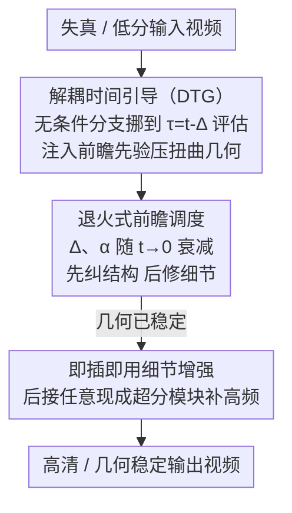

# DTG-Restore: Training-Free Diffusion Refinement for Generative Video Super-Resolution

**会议**: CVPR 2026  
**论文**: [CVF Open Access](https://openaccess.thecvf.com/content/CVPR2026/html/Yesiltepe_DTG-Restore_Training-Free_Diffusion_Refinement_for_Generative_Video_Super-Resolution_CVPR_2026_paper.html)  
**代码**: 待确认  
**领域**: 图像/视频恢复  
**关键词**: 视频超分, 扩散先验, 免训练, 无分类器引导, 时间解耦

## 一句话总结
DTG-Restore 提出一种**免训练、模型无关**的视频超分框架：在扩散采样时把无条件分支挪到一个更干净（噪声更小）的时间步去评估，给当前步注入一个"前瞻先验"，从而在修复低分/失真视频时既能抑制对扭曲几何的复制、又能保留外观细节，并可后接任意现成超分模块补高频，在感知质量与几何稳定性上显著优于近期扩散式视频恢复方法。

## 研究背景与动机

**领域现状**：大规模视频扩散 Transformer（DiT）已经能从文本生成时空一致、纹理细腻的视频，这些预训练先验也被自然地拿来做恢复 / 超分（VSR）。常见做法要么是传统 CNN/Transformer 走合成退化 + 确定性重建损失，要么是扩散式 VSR（Upscale-A-Video、VEnhancer、STAR、SeedVR2 等）把生成先验接进恢复管线。

**现有痛点**：当生成先验被用于恢复时，模型有一个致命倾向——**复制输入里的失真证据，而不是重建底层结构**。在退化或 AI 生成的视频里，这表现为扭曲的脸、错位的身体、被拉伸的运动和帧间抖动的细节。传统 VSR 又只在合成退化上有效，遇到真实/生成内容里复杂非平稳的退化时，往往是把伪影"锐化"得更清楚，逐帧看很脆但时序上不一致。

**核心矛盾**：标准的无分类器引导（CFG）把**条件分支与无条件分支锁在同一个时间步 $t$ 上**评估。这种"同时刻耦合"逼着模型过度忠实于被污染的低分输入——想要它去幻想合理结构，它却被拽回去复刻输入里的扭曲。于是"生成合理结构"与"维持时序稳定"两个目标无法兼得，且要解耦这两路信号，已有方法基本都得对大扩散骨干做大量微调，绑死在特定训练配置上，对任意退化/未见内容缺乏弹性。

**本文目标**：不重训、不改架构，只在推理时动手，让扩散骨干在修复时能"先纠几何、再补细节"，同时跨帧稳定。

**切入角度**：作者的关键观察是——**条件路与无条件路不必在同一时刻评估**。如果把无条件分支放到一个离数据流形更近、更干净的时间步 $\tau = t-\Delta$ 去算，它就提供了一个"高信噪比状态下的几何先验"（lookahead，前瞻），既不复刻当前步里的虚假几何，又仍锚定在观测内容上。

**核心 idea**：用"时间上解耦"代替"同时刻耦合"——把无条件评估提前一个时间偏移 $\Delta$，得到 **Decoupled Time Guidance（DTG）**，并随采样把这个偏移退火衰减，让去噪过程从结构校正平滑过渡到细节精修；之后即插即用接任意现成超分模块补高频。

## 方法详解

### 整体框架
DTG-Restore 解决的是"给定一段失真/低分视频，输出几何稳定、细节合理的高清视频"，整体只在**推理时**运转、不碰任何训练。流程分两段：第一段是 **DTG 精修**——在预训练 T2V 扩散骨干（基于 Rectified Flow 噪声调度）的每一个采样步里，不再像标准 CFG 那样把条件/无条件都放在当前时间步 $t$，而是把无条件（cleaner）那一路挪到更干净的锚定时间 $\tau=t-\Delta$ 上评估，按一个外推规则把两路输出组合成更新方向，从而注入"前瞻先验"压住扭曲几何；偏移 $\Delta$ 与外推系数 $\alpha$ 随时间退火，早期重结构、后期重细节。第二段是**即插即用细节增强**——DTG 修好几何后，把任意现成恢复/超分模块挂在后面，专心补高频纹理。两段串起来，就把"生成式推理"与"恢复保真"统一进一条免训练、模型无关的管线。

### 关键设计

**1. 解耦时间引导（DTG）：在时间上拆开条件/无条件分支，用前瞻先验压住扭曲几何**

这一步直击"标准 CFG 把两路锁在同一时刻、逼模型复刻输入失真"的痛点。记 $F(x,t)$ 为预训练去噪器（或 flow 速度场）在扩散时间 $t$ 的输出。DTG 在当前时间 $t$ 之外，额外定义一个更干净的锚定时间 $\tau := t-\Delta$（$0\le\Delta\le t$）与外推系数 $\alpha$，更新规则是把"干净锚点的预测"与"当前步的预测"做锚定外推：

$$x_{\text{new}} = F(x,\tau) + \alpha\big[F(x,t) - F(x,\tau)\big]$$

这个式子很有解释性：$\alpha=0$ 时直接吸附到更干净的预测 $F(x,\tau)$；$\alpha=1$ 时退化为 $t$ 处的标准步；$\alpha>1$ 则沿着"由干净先验锚定的方向"向 $t$ 之外外推。直觉上，$F(x,\tau)$ 来自一个离数据流形更近、信噪比更高的状态，它给出的是"该往哪个几何走"的前瞻方向，于是模型不再被当前步里的虚假几何带偏，但又始终锚定在观测内容上。

作者进一步用 Tweedie 近似 $F(x,t)\approx x+\sigma_t^2\nabla_x\log p_t(x)$ 代入更新式，证明 DTG 等价于在一个**隐式的有效噪声水平**上去噪：

$$\sigma_{\text{eff}}^2 = \sigma_\tau^2 + \alpha\big(\sigma_t^2 - \sigma_\tau^2\big),\qquad \mathrm{SNR}_{\text{eff}} = \frac{\alpha_\tau^2}{\sigma_{\text{eff}}^2}$$

也就是说，由于信号分量被锚定在 $\tau$，DTG 表现得像在 $\tau$ 与 $t$ 之间某个"隐式时间"上去噪：当 $\alpha>1$ 时提高有效 SNR、得到更干净更稳的扩散轨迹，$0<\alpha<1$ 时则保守插值。这就是论文反复强调的"隐式提升有效信噪比"的来源。⚠️ 公式中的 $\alpha_\tau$/$\sigma_\tau$ 等下标符号取自原文 OCR，细节以原文为准。

**2. 退火式前瞻调度：从结构校正平滑过渡到细节精修**

只用一个固定的时间偏移 $\Delta$ 是不够的：偏移太大会过度依赖前瞻、丢掉与观测的对齐，偏移固定又无法兼顾"早期要纠几何、后期要抠细节"。DTG 因此让 $\Delta$ 和 $\alpha$ 随采样退火：

$$\Delta_t \to 0 \ \text{as}\ t\to 0,\qquad \alpha_t \to 1 \ \text{as}\ t\to 0$$

含义是——采样早期（$t$ 大、噪声重）保持较大的前瞻偏移，从更干净的锚点拉取结构，把扭曲几何先掰正；随着 $t\to0$，偏移收敛到 0、$\alpha$ 收敛到 1，过程平滑切回标准去噪、专注与观测一致的细节精修。这条"强前瞻起步 + 渐进衰减"的调度是 DTG 真正生效的关键：消融显示固定 $\Delta$（哪怕 $\Delta=0$ 退化成标准 CFG）都明显更差，而指数退火比线性/余弦退火更好（见实验）。它与 CFG 的根本区别也在这里：CFG 在同一时刻 $t$ 组合条件/无条件，DTG 则把其中一路锚到 $\tau=t-\Delta$，在更高 SNR 状态供给几何保持先验，同时让当前时间方向去修细节。

**3. 即插即用细节增强：DTG 之后接任意现成超分模块补高频**

DTG 负责"纠几何、压失真"，但并不专门抠高频纹理。作者干脆把细节恢复解耦出去：DTG 修完之后，挂任意现成恢复/超分模块 $R_\phi$。记 DTG 为 $T_\tau$，整条管线写作

$$\hat{x} = R_\phi(x_{\text{new}}\,;\,y_{1:T})$$

其中 $R_\phi$ 可选地用外部条件 $y_{1:T}$ 作旁路信息。这种组合是 drop-in、免训练、模型无关的：DTG 引入的结构性修正被保留，而专用网络只需专注高频细节恢复。论文里把 DTG 分别和 SeedVR、SeedVR2、RealViFormer 等组合都能稳定提升，验证了它"先做好几何、再交给现成超分补纹理"这种分工的通用性。

## 实验关键数据

评测分两条线：① 标准 VSR 基准（SPMCS、UDM10、REDS30）用全参考指标 PSNR/SSIM/LPIPS/DISTS；② 作者自建的 **GenWarp480** 基准——4,400 段 480p、3–5 秒、16fps 的 AI 生成失真视频，覆盖人物动作 / 自然环境 / 动物 / 交通工具 / 城市建筑 / 物体日用六大类，专门针对扭曲脸、身体错位、空间伪影等"生成式退化"，由于没有 GT，用 LAION 美学预测器、MUSIQ、MANIQA、NIQE、CLIP-IQA 等无参考感知指标评估。

### 主实验

GenWarp480 感知指标对比（Table 2，越高越好除 NIQE）：本文在 LAION AP、MANIQA、CLIP-IQA 三项均第一，MUSIQ 第二。

| 方法 | LAION AP ↑ | MUSIQ ↑ | MANIQA ↑ | NIQE ↓ | CLIP-IQA ↑ |
|------|-----------|---------|----------|--------|-----------|
| RealViformer | 3.998 | 50.47 | 0.293 | 4.014 | 0.482 |
| SeedVR | 4.120 | 46.85 | 0.278 | 4.128 | 0.496 |
| SeedVR2 | 4.423 | 37.28 | 0.242 | **3.915** | 0.527 |
| VEnhancer | 4.218 | 44.12 | 0.267 | 4.206 | 0.508 |
| Upscale-A-Video | 4.371 | 45.67 | 0.273 | 4.198 | 0.517 |
| STAR | 4.457 | 41.96 | 0.261 | 4.263 | 0.418 |
| **本文** | **4.642** | 48.83 | **0.314** | 4.337 | **0.541** |

SeedVR2 的 NIQE 最低，但作者指出那是因为它"重度平滑"，在其余感知指标上都垫底；STAR 的 LAION AP 不错但 CLIP-IQA 明显落后。

标准 VSR 基准（Table 1，节选 SPMCS / UDM10 / REDS30 的 PSNR 与 SSIM）：本文**不以超越像素保真为目标**，所以 PSNR/SSIM 不刻意刷高，但仍保持竞争力。

| 数据集 / 指标 | RealViformer | UAV | VEnhancer | STAR | SeedVR2-7B | 本文 |
|--------------|-------------|------|-----------|------|-----------|------|
| SPMCS PSNR ↑ | **24.18** | 21.68 | 18.52 | 22.59 | 20.66 | 22.76 |
| SPMCS SSIM ↑ | **0.658** | 0.523 | 0.514 | 0.609 | 0.603 | 0.613 |
| UDM10 PSNR ↑ | 26.78 | 24.53 | 21.57 | 24.69 | 25.74 | 25.61 |
| REDS30 PSNR ↑ | **23.36** | 21.42 | 19.91 | 22.14 | 22.20 | 23.12 |

像 RealViformer、MGLD-VSR 这类强重建目标的方法在 PSNR/SSIM 上领先属预期；本文在 SPMCS 上拿到 0.613 的 SSIM、UDM10 上 0.271 的 LPIPS，在不为像素保真优化的前提下仍然全程竞争，且不像 VEnhancer/UAV 那样放大失真。

### 消融实验

**$\Delta$ 调度（Table 3，GenWarp480 上按轻/中/重失真，Quality/Sharp）**：固定 $\Delta$ 一律差且随 $\Delta$ 增大更糟，退火显著更好，指数退火最优。

| 调度 | 轻 Quality | 轻 Sharp | 重 Quality | 重 Sharp |
|------|-----------|----------|-----------|----------|
| $\Delta=0$（标准 CFG） | 4.12 | 0.768 | 3.91 | 0.739 |
| $\Delta=0.2$（常数） | 4.08 | 0.751 | 3.87 | 0.721 |
| $\Delta=0.3$（常数） | 4.03 | 0.724 | 3.82 | 0.694 |
| 线性退火 | 4.51 | 0.812 | 4.41 | 0.791 |
| 余弦退火 | 4.56 | 0.824 | 4.47 | 0.806 |
| **本文（指数）** | **4.64** | **0.839** | **4.58** | **0.821** |

**对比 SDEdit（Table 4）**：DTG 的"逐步解耦"全面胜过 SDEdit 的"单点重采样"，且几何 warp 误差最低。

| 方法 | LAION ↑ | MANIQA ↑ | CLIP-IQA ↑ | Warp ↓ |
|------|---------|----------|-----------|--------|
| SDEdit ($t_{\text{start}}=0.3$) | 4.21 | 0.267 | 0.489 | 0.142 |
| SDEdit ($t_{\text{start}}=0.5$) | 4.38 | 0.281 | 0.512 | 0.118 |
| SDEdit ($t_{\text{start}}=0.7$) | 4.29 | 0.258 | 0.478 | 0.097 |
| **DTG（本文）** | **4.64** | **0.314** | **0.541** | **0.071** |

SDEdit 存在典型权衡：浅重采样（0.3）保结构差（warp 0.142），深重采样（0.7）warp 降到 0.097 却伤感知（LAION 4.29 / CLIP-IQA 0.478）；DTG 的逐步解耦则同时把感知与几何稳定性都拉高。

**用户研究（Table 5，50 人 / 60 视频 / 1–5 分）**：DTG-Restore 在清晰度、运动平滑、整体美感三项均第一（4.40 / 4.52 / 4.36），VEnhancer 第二但差距明显（尤其运动质量）。

### 关键发现
- **退火是命门**：固定/无偏移（含 $\Delta=0$ 即标准 CFG）全面落后，"强前瞻起步 + 渐进衰减"是平衡几何校正与细节恢复的关键，指数退火 > 余弦 > 线性。
- **逐步解耦 > 单点重采样**：相比 SDEdit 在某个 $t_{\text{start}}$ 一次性重采样，DTG 在每一步都做时间解耦，能同时改善感知质量和 warp 几何稳定，绕开了 SDEdit 的保结构 vs 保感知权衡。
- **指标取向要看任务**：像素重建型指标（PSNR/SSIM）偏爱强一致性偏置的模型，而无参考感知指标才能体现本文"创意上采样"的优势——本文有意不追 PSNR。

## 亮点与洞察
- **"把无条件分支提前到更干净时间步"这一刀很巧**：仅靠一个时间偏移 $\tau=t-\Delta$ 就把 CFG 的同时刻耦合拆开，无需任何训练或架构改动，却能注入几何前瞻——这是典型的"改采样、不改模型"的免训练干预。
- **理论解释清爽**：用 Tweedie 近似推出 DTG 等价于在隐式有效噪声 $\sigma_{\text{eff}}^2$ 下去噪、$\alpha>1$ 时隐式提升 SNR，把一个工程技巧落到"有效信噪比"的语言上，可复用到其他扩散采样改造。
- **解耦"纠几何"与"补细节"的工程分工**：DTG 只管结构、现成超分只管高频，这种 drop-in 组合让它能蹭任意预训练视频扩散骨干 + 任意超分模块，部署弹性高。
- **GenWarp480 填了真空**：现有 VSR 基准多是合成退化，这个 4,400 段、专攻"生成式退化（扭曲脸/身体错位/空间伪影）"的基准对评测扩散式恢复的鲁棒性很有针对性。

## 局限与展望
- **像素保真不是强项**：本文显式承认在 PSNR/SSIM 等重建型指标上不追求超越强一致性方法，对需要精确像素还原的场景（如取证、测量）未必适用。
- **依赖现成超分模块的质量**：第二段细节增强直接外接 $R_\phi$，最终高频质量受所选模块上限约束；论文未深入分析不同 $R_\phi$ 的失败模式。
- **骨干分辨率受限**：所用 T2V 扩散骨干因全注意力只支持固定 token 数（约 $512\times512$/$480$p），把预训练扩散扩到更高分辨率仍是开放问题，DTG 本身不解决这一点。
- **调度需调参**：$\Delta_t$、$\alpha_t$ 的退火形状（指数最优）属超参，跨骨干/退化是否仍以指数为最优、$\alpha>1$ 的外推稳定边界，原文未给出完整敏感性分析。⚠️ 以原文为准。

## 相关工作与启发
- **vs Upscale-A-Video / VEnhancer**：它们通过潜空间时序传播或统一时空上采样来增强一致性，但仍把生成先验绑在重训练上、且常放大输入失真；本文免训练、模型无关，靠时间解耦从源头抑制失真复制。
- **vs STAR / SeedVR2**：STAR 用频域损失 + 局部增强提升真实场景保真，SeedVR2 用对抗后训练把恢复压到单步——两者都要对大扩散骨干做大量微调；DTG 完全在推理时运转，不微调骨干。
- **vs SDEdit**：SDEdit 在某个 $t_{\text{start}}$ 加噪后一次性重采样，是"单点"干预，存在保结构 vs 保感知的权衡；DTG 是"逐步"在每个采样步做条件/无条件的时间解耦，感知与几何稳定性可同时改善。
- **vs 标准 CFG**：CFG 把条件/无条件锁在同一时刻组合；DTG 把无条件锚到更高 SNR 的 $\tau$，提供几何保持先验——这一"时间维度上的解耦"思路也可启发其他需要"既忠于观测又敢于幻想结构"的条件扩散任务。

## 评分
- 新颖性: ⭐⭐⭐⭐⭐ "把 CFG 的条件/无条件在时间维度上解耦 + 前瞻先验"是简洁而新的免训练采样改造，且有 SNR 层面的理论解释。
- 实验充分度: ⭐⭐⭐⭐ 标准 VSR + 自建 GenWarp480 + 多组消融（调度/SDEdit）+ 用户研究覆盖较全，但缺对不同 $R_\phi$ 与退火超参的系统敏感性分析。
- 写作质量: ⭐⭐⭐⭐ 动机—方法—理论链条清楚，公式符号偏密（部分 OCR 下标需对照原文）。
- 价值: ⭐⭐⭐⭐⭐ 免训练、模型无关、即插即用，能直接复用到任意视频扩散骨干 + 超分模块，落地性强。

<!-- RELATED:START -->

## 相关论文

- [\[CVPR 2026\] Training-free Motion Factorization for Compositional Video Generation](training-free_motion_factorization_for_compositional_video_generation.md)
- [\[CVPR 2026\] Training-free Mixed-Resolution Latent Upsampling for Spatially Accelerated Diffusion Transformers](training-free_mixed-resolution_latent_upsampling_for_spatially_accelerated_diffu.md)
- [\[CVPR 2026\] STCDiT: Spatio-Temporally Consistent Diffusion Transformer for High-Quality Video Super-Resolution](stcdit_spatio-temporally_consistent_diffusion_transformer_for_high-quality_video.md)
- [\[CVPR 2026\] VOSR: A Vision-Only Generative Model for Image Super-Resolution](vosr_a_vision_only_generative_model_for_image_super_resolution.md)
- [\[CVPR 2026\] RAISE: Requirement-Adaptive Evolutionary Refinement for Training-Free Text-to-Image Alignment](raise_requirement-adaptive_evolutionary_refinement_for_training-free_text-to-ima.md)

<!-- RELATED:END -->
