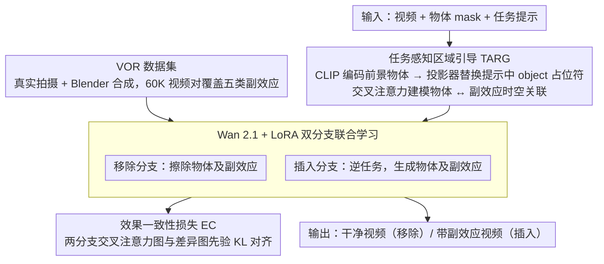

# EffectErase: Joint Video Object Removal and Insertion for High-Quality Effect Erasing

**会议**: CVPR 2026  
**arXiv**: [2603.19224](https://arxiv.org/abs/2603.19224)  
**代码**: [项目页面](https://henghuiding.com/EffectErase/)  
**领域**: 图像生成  
**关键词**: 视频物体移除, 视觉副效应, 扩散模型, 对偶学习, 数据集

## 一句话总结

提出 EffectErase 框架，将视频物体插入作为移除的逆辅助任务进行联合学习，并构建包含 60K 视频对的大规模 VOR 数据集，实现对物体及其遮挡、阴影、反射、光照、变形等视觉副效应的高质量擦除。

## 研究背景与动机

视频物体移除不仅需要去除目标物体本身，还需要擦除物体引入的各种**视觉副效应**（如阴影、反射、光照变化、遮挡、变形）。现有方法面临两大困境：

**方法层面**：现有视频修复方法过度依赖输入 mask 进行引导，忽略 mask 区域外的副效应；即使如 ROSE 那样预测差异 mask，仍缺乏物体与副效应之间时空关联的显式建模

**数据层面**：缺乏大规模公开数据集系统性地捕捉多种物体效应。SVOR 未考虑副效应，ROSE 仅靠相机运动的合成数据，规模和多样性有限

## 方法详解

### 整体框架

EffectErase 要解决的是视频物体移除后残留的各种视觉副效应（阴影、反射、光照、遮挡、变形）。它在 Wan 2.1 视频生成模型上用 LoRA 微调，核心思路是把"移除"和它的逆任务"插入"放在一起联合学习——插入分支天然知道一个物体会带来哪些副效应，从而反过来监督移除分支把这些副效应也一并擦干净。整条流水线由三部分支撑：大规模 VOR 数据集提供真实的"有物体/无物体"配对监督，任务感知区域引导（TARG）建模物体与副效应的时空关联，效果一致性损失（EC）让移除与插入两个分支对齐到同一受影响区域。

### 关键设计

**1. VOR 数据集：用真实+合成配对系统覆盖五类副效应**

副效应擦除最缺的是合适的监督信号——SVOR 根本没考虑副效应，ROSE 只靠相机运动合成、规模和多样性都有限。VOR 用固定摄像机拍摄"有物体/无物体"配对视频拿到真实数据，再用 Blender 渲染 150+ 个 3D 场景补合成数据，系统性覆盖五类副效应：遮挡（不透明/半透明/透明三种子类型）、阴影（不同光照下的投影）、光照（移除光源后的亮度与色彩变化）、反射（镜面/水面/瓷砖等反射面）、变形（窗帘、草地、网等物理形变）。最终规模达到 60K 视频对、366 个物体类别、443 个场景、145+ 小时，远超先前数据集，这也是模型能学会"擦副效应"而不只是"抠物体"的前提。

**2. 任务感知区域引导 TARG：用交叉注意力建模物体与副效应的时空关联**

现有视频修复过度依赖输入 mask，只盯着 mask 区域、看不到 mask 外的副效应。TARG 先把前景物体用 CLIP 图像编码器编成嵌入 $\boldsymbol{e}^f$，再经投影器替换任务提示中的 "object" 占位符：$\boldsymbol{e}^{\text{prompt}} = \boldsymbol{e}^{\text{task}}[\text{object}] \leftarrow \mathcal{P}_\psi(\boldsymbol{e}^f)$，让交叉注意力显式建模"这个物体"和它在时空上引发的副效应之间的关联。配合任务 token，同一套机制还能在移除/插入之间灵活切换。

**3. 效果一致性损失 EC：让移除与插入对齐到同一受影响区域**

移除和插入是互逆任务，它们触及的本是同一片受影响区域，这正好可以拿来互相约束。EC 从两个分支各 DiT block 收集交叉注意力图，经最大池化和映射器得到软区域估计 $f^{\text{rm}}, f^{\text{in}}$，再与差异图先验 $f^{\text{diff}}$ 对齐：$\mathcal{L}_{\text{EC}} = \mathrm{KL}(f^{\text{diff}} \| f^{\text{rm}}) + \mathrm{KL}(f^{\text{diff}} \| f^{\text{in}})$。其中 $f^{\text{diff}}$ 来自有/无物体视频帧差异的归一化分布，比二值 mask 多保留了光照和阴影的强度信息，因此监督更"软"、也更贴近真实副效应。

### 损失函数 / 训练策略

$$\mathcal{L}_{\text{total}} = \mathcal{L}_{\text{denoise}}^{\text{remove}} + \mathcal{L}_{\text{denoise}}^{\text{insert}} + \lambda \mathcal{L}_{\text{EC}}$$

- 基础模型：Wan 2.1 + LoRA（rank=256）
- 输入分辨率 $832 \times 480$，随机采样 81 连续帧
- 训练 120K 迭代，batch size 8，8×H100 GPU，学习率 $1 \times 10^{-5}$
- 推理 50 步去噪

## 实验关键数据

### 主实验

| 数据集 | 指标 | EffectErase | ROSE | MinMax-Remover | 提升(vs ROSE) |
|--------|------|-------------|------|----------------|--------------|
| ROSE-Benchmark | PSNR↑ | **32.161** | 31.122 | 26.770 | +1.04 |
| ROSE-Benchmark | SSIM↑ | **0.948** | 0.917 | 0.905 | +0.031 |
| ROSE-Benchmark | LPIPS↓ | **0.039** | 0.077 | 0.099 | -0.038 |
| ROSE-Benchmark | FVD↓ | **55.578** | 72.177 | 137.840 | -16.6 |
| VOR-Eval | PSNR↑ | **23.750** | 22.966 | 21.963 | +0.784 |
| VOR-Eval | SSIM↑ | **0.806** | 0.792 | 0.802 | +0.014 |
| VOR-Wild | QScore↑ | **9.280** | 9.240 | 8.984 | +0.040 |
| VOR-Wild | User↑ | **7.20** | 6.38 | 5.90 | +0.82 |

### 消融实验

| 配置 | PSNR↑ | SSIM↑ | LPIPS↓ | FVD↓ | 说明 |
|------|-------|-------|--------|------|------|
| Real only | 20.409 | 0.720 | 0.243 | 368.664 | 基线 |
| +EC loss | 21.020 | 0.737 | 0.224 | 354.545 | 一致性损失 |
| +EC+TARG | 23.101 | 0.780 | 0.193 | 349.094 | 区域引导 |
| +EC+TARG+Syn | **23.750** | **0.806** | **0.170** | **342.871** | 完整方案 |

### 关键发现

- TARG 贡献最大（SSIM 从 0.737 跳升至 0.780），证明时空关联建模对副效应定位至关重要
- 合成数据增加多样性后 LPIPS 从 0.193 降至 0.170，泛化显著提升
- 模型无需额外训练即可切换为物体插入任务，能生成逼真阴影和反射

## 亮点与洞察

- **问题定义创新**：将视频物体移除问题重新定义为"效应擦除"，系统性地归纳五类副效应
- **对偶学习设计精巧**：移除与插入互为逆操作，共享受影响区域，天然构成互补监督
- **VOR 数据集价值巨大**：60K 配对视频、145小时、真实+合成混合，是该领域迄今最大规模数据集
- 软差异图先验比二值 mask 保留更多强度信息

## 局限与展望

- 对极端遮挡（如大面积前景遮挡背景）的恢复质量仍有待提升
- 真实拍摄数据的采集成本高，难以覆盖所有场景
- LoRA 微调可能限制对全新效应类型的泛化

## 相关工作与启发

- 与 ROSE 的差异主要在三点：(1) 联合学习 vs 单任务，(2) 注意力机制建模时空关联 vs 差异 mask 预测，(3) 数据规模和多样性差距巨大
- 启发：对偶学习思想可推广到其他逆任务对（如超分/降采样、着色/灰度化等）

## 评分

- 新颖性: ⭐⭐⭐⭐ 对偶学习+效果一致性设计新颖，VOR数据集填补空白
- 实验充分度: ⭐⭐⭐⭐ 三个数据集、用户研究、消融完整、插入任务展示
- 写作质量: ⭐⭐⭐⭐ 问题动机清晰，图示丰富
- 价值: ⭐⭐⭐⭐⭐ VOR数据集和效应感知移除框架对该领域有重要推动价值

<!-- RELATED:START -->

## 相关论文

- [\[CVPR 2026\] Object-WIPER: Training-Free Object and Associated Effect Removal in Videos](object-wiper_training-free_object_and_associated_effect_removal_in_videos.md)
- [\[CVPR 2026\] Precise Object and Effect Removal with Adaptive Target-Aware Attention](precise_object_and_effect_removal_with_adaptive_target-aware_attention.md)
- [\[CVPR 2026\] Preserving Source Video Realism: High-Fidelity Face Swapping for Cinematic Quality](preserving_source_video_realism_high-fidelity_face_swapping_for_cinematic_qualit.md)
- [\[CVPR 2026\] STCDiT: Spatio-Temporally Consistent Diffusion Transformer for High-Quality Video Super-Resolution](stcdit_spatio-temporally_consistent_diffusion_transformer_for_high-quality_video.md)
- [\[ICCV 2025\] OmniPaint: Mastering Object-Oriented Editing via Disentangled Insertion-Removal Inpainting](../../ICCV2025/image_generation/omnipaint_mastering_object-oriented_editing_via_disentangled_insertion-removal_i.md)

<!-- RELATED:END -->
