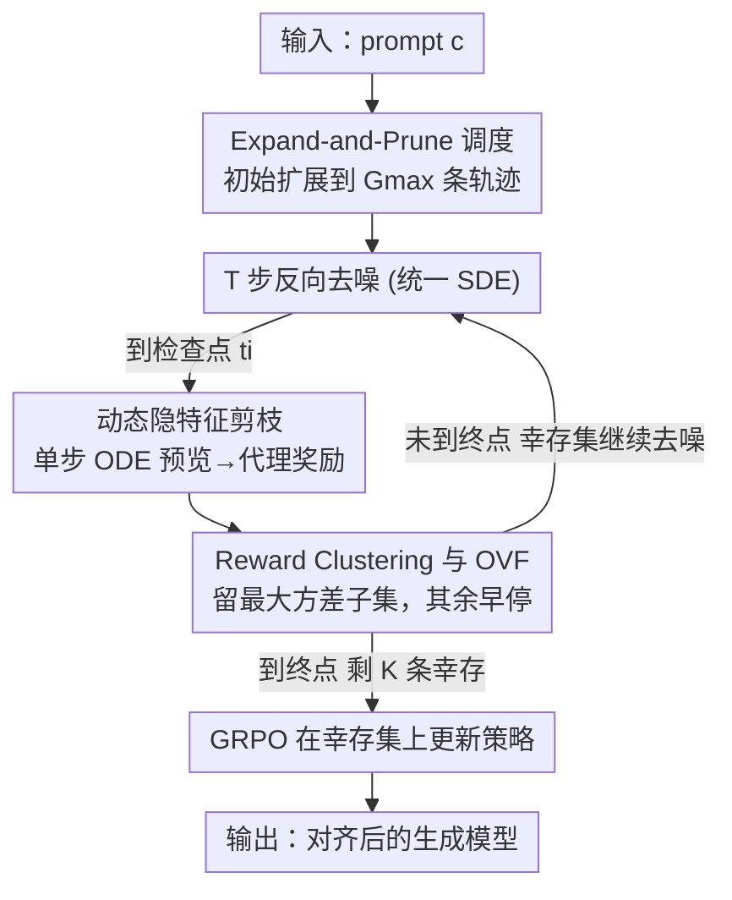

# Expand and Prune: Maximizing Trajectory Diversity for Effective GRPO in Generative Models

**会议**: CVPR 2026  
**论文**: [CVF Open Access](https://openaccess.thecvf.com/content/CVPR2026/html/Ge_Expand_and_Prune_Maximizing_Trajectory_Diversity_for_Effective_GRPO_in_CVPR_2026_paper.html)  
**代码**: 待确认  
**领域**: 图像生成 / 扩散模型 / 对齐RLHF  
**关键词**: GRPO, 文本生成图像, 轨迹剪枝, 奖励方差, RL 对齐

## 一句话总结
针对 GRPO 对齐生成模型时"大 group 才有效、但大 group 算不起"的两难，本文发现采样轨迹普遍向组均值奖励塌缩（reward clustering）导致优势信号失效，提出 Pro-GRPO：在去噪过程中用单步 ODE 预览提前估出每条轨迹的代理奖励，按"最大方差"准则动态剪枝早停，配合"先扩展再修剪"（Expand-and-Prune）的调度，在不付出大 group 计算代价的前提下最大化轨迹多样性，于扩散与流匹配两类 T2I 模型上同时取得更好的对齐效果和 1.26~1.41× 加速。

## 研究背景与动机

**领域现状**：把视觉生成模型对齐到人类偏好，目前主流走强化学习路线（PPO / DPO / GRPO）。其中 GRPO 因其"组内采样"机制最受青睐——对同一个 prompt 采一组 $G$ 条轨迹，用组内奖励的均值与方差直接做归一化优势估计，不需要训练单独的 value 网络。Flow-GRPO、DanceGRPO 等把扩散/流模型的生成过程改写成等价 SDE，使得 GRPO 能接进这些 T2I 模型的后训练阶段。

**现有痛点**：GRPO 的效果强依赖一个**足够大的 group size**——只有 group 够大，组内奖励的均值和方差才稳，优势估计才可靠、探索才充分。但 group size 一大，显存和算力开销就线性膨胀到难以承受；group size 一小，优势估计又会失稳、探索受限。这个 trade-off 直接卡住了模型的性能上限。

**核心矛盾**：作者通过两个实证研究，把矛盾的根源定位到一个被忽视的现象——**奖励塌缩（Reward Clustering）**。对单个 prompt 采一组轨迹时，大量轨迹的奖励都挤在组均值 $\mu_G$ 附近，组内方差 $\sigma_G^2$ 很小。由优势定义 $A_i = (R_i - \mu_G)/(\sigma_G + \epsilon)$ 可知，这些挤在均值附近的样本优势趋近于 0，对梯度几乎没贡献，却照样吃满了采样和去噪的算力。换句话说，大 group 的算力里有相当一部分是"白烧"在没有优化价值的轨迹上。而简单的随机下采样并不能解决——随机抽 $k<G$ 条在期望上不增加方差，塌缩照旧。

**本文目标**：在固定算力预算下，既要保住"大 group 才有的探索多样性"，又要把算力从无效轨迹上省下来——即把"探索广度"与"优化成本"解耦。

**切入角度**：既然真正有用的是奖励分布两端的高/低极值样本，那就别让所有轨迹都跑完整条去噪再筛——而是**在采样过程中提前判断**哪些轨迹注定塌缩、把它们早停掉，省下的算力反过来去"扩展"初始 group。

**核心 idea**：用"先扩展再修剪"代替"固定小 group"——先把初始采样组扩大到 $G_{\max}$ 以最大化轨迹多样性，再在去噪途中用基于隐特征的代理奖励做多步"最大方差筛选"，逐步把组收缩到 $K$ 条幸存轨迹，最终只在这 $K$ 条上做 GRPO 更新。

## 方法详解

### 整体框架
Pro-GRPO（Proactive GRPO）把"筛选"从"采样后"提前到"采样中"。给定 prompt $c$，它先采 $G_{\max}$ 条初始隐变量并启动 $T$ 步反向去噪（扩散与流匹配都统一成同一个反向 SDE 形式）；在若干预设检查点 $t_i$ 上，对每条仍存活的轨迹做一次**单步 ODE 预览**，廉价地预测它的终点图像并算出一个代理奖励 $\hat R_i$；随后用 **OVF（最大方差筛选）** 留下高方差子集、把其余轨迹**早停**（不再继续去噪），使存活数沿着一个单调漏斗 $K_1=G_{\max} > K_2 > \cdots > K_{I+1}=K$ 逐步收缩；到终点 $T$ 时只剩 $K$ 条幸存轨迹，在这个被剪枝过的小集合上算组归一化优势并做 GRPO 更新。最终优化成本只与 $K$（而非 $G_{\max}$）挂钩，从而"用小 group 的算力，享大 group 的多样性"。

### 关键设计

**1. Reward Clustering 现象与 OVF：用"最大方差"挑出真正有用的轨迹**

这一设计回答的是"为什么大 group 浪费、该留哪些轨迹"。作者先把塌缩区形式化为 $\mathcal{C}_\delta = \{ i : |R_i - \mu_G| \le \delta\sigma_G \}$，并推出落在该区内样本的优势上界 $|A_i| = \frac{|R_i-\mu_G|}{\sigma_G+\epsilon} \le \frac{\delta\sigma_G}{\sigma_G+\epsilon} \le \delta$——当组内方差 $\sigma_G^2$ 收缩时，这些样本的归一化优势随之消失；而每条轨迹的梯度贡献 $g_i \propto A_i \nabla_\theta \log\pi_\theta(\tau_i)$ 又正比于优势，于是大量塌缩轨迹对 mini-batch 梯度 $g = \frac{1}{G}\sum_i g_i$ 几乎零贡献，却照吃算力。基于此，作者提出 **OVF（Optimal Variance Filtering）**：给定奖励 $\{R_g\}_{g=1}^G$ 和目标规模 $k<G$，选取使组内方差最大的子集 $\mathcal{K}^\star = \arg\max_{|\mathcal{K}|=k} \sigma^2(\mathcal{K})$。这个准则天然偏好同时覆盖奖励高/低两端的样本，从而"去塌缩"。实验证实，在这个更小、更高方差的子集（$k<G$）上训练，不仅不掉点，反而**超过**在完整未筛 group 上训练的基线——这就是作者反复强调的"少即是多（Less is More）"。OVF 本身是个事后启发式筛选器，它的意义在于先用最简单的方式验证"高方差子集更优"这个假设成立，为后面的动态剪枝奠基。

**2. 动态隐特征剪枝：用单步 ODE 预览把筛选提前到采样途中**

OVF 虽然有效，但它是**事后**筛选——塌缩轨迹必须完整生成完才能被丢掉，那段去噪算力照样浪费了。本设计要把"筛"提前到"采样进行中"。难点在于：去噪还没走完，怎么知道一条轨迹最终的奖励高不高？作者的做法是在检查点 $t_i$ 上对每条存活轨迹做一次**单步确定性 ODE 投影**来"偷看"终点：用概率流 ODE 的漂移项 $b^{\mathrm{ODE}}_\theta$，由当前状态一步外推到终点 $\mathbf{x}^{(g)}_{T,\mathrm{ODE}} \approx \mathbf{x}^{(g)}_{t_i} + (T-t_i)\, b^{\mathrm{ODE}}_\theta(\mathbf{x}^{(g)}_{t_i}, t_i)$，再把这个预览隐变量过 VAE 解码器和奖励模型，得到代理奖励 $\hat R_i^{(g)} = R(\mathbf{x}^{(g)}_{T,\mathrm{ODE}}, c)$。然后在每个检查点用 OVF 选出最大方差的幸存子集 $\mathcal{K}_{i+1}\subseteq\mathcal{K}_i$（$|\mathcal{K}_{i+1}|<|\mathcal{K}_i|$，公式同 OVF 准则），**只有幸存轨迹继续往后去噪，其余直接早停、不再产生任何 SDE 步**。多个检查点重复这一操作，存活数就单调递减。它有效的关键在于：单步 ODE 预览代价极低（一次噪声预测 + 一次 VAE 解码 + 一次奖励计算），却足以提前识别出注定塌缩的低价值轨迹——把这些轨迹剩下的几十步去噪算力直接省掉，且因为只有 $K$ 条幸存集进入反向传播，优化成本随 $K$ 而非 $G_{\max}$ 缩放。

**3. Expand-and-Prune 调度：先把池子撑大，再一路漏斗式收缩**

有了"剪枝近乎免费"这个底气，本设计回答"那初始 group 该开多大"。常规做法受预算所限只能从一个小 group 起步，多样性天花板很低。Pro-GRPO 反其道而行：**先临时把初始轨迹池扩张到 $G_{\max} > K$** 以最大化对奖励地形的覆盖（探索广度），**再在生成途中分步剪枝**——在检查点序列 $0<t_1<\cdots<t_I<T$ 上反复用 OVF 收缩，形成单调漏斗 $K_1=G_{\max} > K_2 > \cdots > K_{I+1}=K$。这样一来，探索受益于大初始组，而有效积分与优化成本却贴近最终幸存数 $K$，于是在固定算力预算下交付更强的学习信号。论文给出的具体调度示例很直观：对标 Flow-GRPO（$G=24$）时，标准版 Pro-GRPO 用 $G_{\max}=48$、在 $t=\{5,7\}$ 剪枝（路径 $48\to24\to12$）；轻量的 Flash 版用 $G_{\max}=24$（路径 $24\to16\to12$）；对标 DanceGRPO（$G=16$，$T=50$）时则 $G_{\max}=48$、$t=\{30,40\}$ 剪枝（路径 $48\to32\to8$）。这套"扩展—修剪"正是把"探索广度"与"优化成本"解耦的核心机制。

### 损失函数 / 训练策略
最终只在幸存集 $\mathcal{K}_{I+1}$（$K=|\mathcal{K}_{I+1}|$ 条）上计算组归一化优势 $\widehat A^{(g)} = \frac{R(\mathbf{x}^{(g)}_T,c) - \mu_{\mathcal{K}_{I+1}}}{\sigma_{\mathcal{K}_{I+1}}+\epsilon}$，其中均值/方差都只在幸存集上统计。目标函数是限制在幸存轨迹上的 PPO 式裁剪目标加 KL 正则：

$$\mathcal{J}_{\mathrm{Pro\text{-}GRPO}}(\theta) = \mathbb{E}_c\Big[\tfrac{1}{K}\sum_{g\in\mathcal{K}_{I+1}}\tfrac{1}{T}\sum_{t=0}^{T-1}\min\big(r^{(g)}_t \widehat A^{(g)},\ \mathrm{clip}(r^{(g)}_t,1-\varepsilon,1+\varepsilon)\widehat A^{(g)}\big)\Big] - \beta\, D_{\mathrm{KL}}(\pi_\theta \| \pi_{\mathrm{ref}})$$

其中 $r^{(g)}_t$ 是由 Euler–Maruyama 离散得到的高斯策略下、当前策略对旧策略的逐步重要性比。整体在扩散与流匹配两类骨干上统一成同一个反向 SDE 形式实现，便于通用。⚠️ 公式细节以原文为准。

## 实验关键数据

实验在两类生成范式上做：扩散类 Stable Diffusion v1.4（8×A100）和流匹配类 SD 3.5-Medium（24×A100），分别对标 DanceGRPO 与 Flow-GRPO，奖励统一用 HPSv2.1 / CLIP Score / PickScore，在 DrawBench 与 HPSv2 两个 benchmark 上评估。

### 主实验

流匹配模型（SD 3.5-M，DrawBench，PickScore 训练）：

| 模型 | 加速比 | PickScore↑(域内) | Aesthetic↑ | ImageReward↑ | PickScore↑(域外) | HPSv2.1↑ |
|------|--------|------|------|------|------|------|
| SD 3.5-M (Base) | - | - | 5.408 | 0.852 | 22.425 | 0.280 |
| Flow-GRPO | 1.00× | 23.322 | 5.912 | 1.298 | 23.599 | 0.316 |
| Pro-GRPO-Flash | 1.41× | 23.722 | 6.030 | 1.381 | 23.868 | 0.319 |
| **Pro-GRPO (Ours)** | 1.26× | **24.008** | **6.046** | **1.397** | **24.108** | **0.322** |

标准版 Pro-GRPO 在 PickScore 上 +0.686、Aesthetic +0.134，同时省了 26% 算力（1.26× 加速）；轻量 Flash 版在 1.41× 加速下仍超过 Flow-GRPO 基线（DrawBench PickScore 23.722 vs 23.322），单独印证了"采样途中剪枝"的收益。

扩散模型（SD-v1.4，DrawBench，对标 DanceGRPO）：单目标（HPSv2.1）下 Pro-GRPO 域内 0.391 vs DanceGRPO 0.369，域外 ImageReward（HPSv2）1.114 vs 1.079；多目标（HPSv2.1+CLIP）下 Pro-GRPO 在两个数据集上的域外指标全面占优。

语义对齐（GenEval，全部仅用 PickScore 微调、GenEval 不参与训练）：

| 模型 | Overall↑ | Two Obj.↑ | Colors↑ | Position↑ |
|------|------|------|------|------|
| SD 3.5-M (Base) | 0.696 | 0.869 | 0.817 | 0.248 |
| Flow-GRPO | 0.719 | 0.942 | 0.851 | 0.288 |
| **Pro-GRPO** | **0.726** | **0.947** | **0.867** | **0.323** |

Position 提升最显著（+0.035），说明方差感知的剪枝能产出语义信号更清晰、空间推理/组合绑定更强的轨迹，且在未见 benchmark 上的一致提升说明它不是对奖励过拟合。

算力分析（calflops 全 epoch FLOPs）：

| 方法 | FLOPs (T)↓ | 加速比↑ |
|------|------|------|
| Flow-GRPO (Baseline) | 453474.18 | 1.00× |
| Pro-GRPO (Standard) | 335626.82 | 1.26× |
| Pro-GRPO (Flash) | 267365.79 | 1.41× |

由于只有幸存集 $K$ 进入反向传播，优化成本随 $K$ 而非 $G_{\max}$ 缩放，FLOPs 分别降 26% / 41%。

### 消融实验

| 配置 | 关键指标 | 说明 |
|------|---------|------|
| 初始组 $G_{\max}=32\to8$ | 域内 HPSv2.1 0.386 | 池子偏小 |
| 初始组 $G_{\max}=48\to8$ | 域内 HPSv2.1 0.391 | 标准设置 |
| 初始组 $G_{\max}=64\to8$ | 域内 HPSv2.1 0.393 | 收益递减（域外 HPSv2.1 饱和在 0.383） |
| 剪枝步 $(t_1,t_2)=(10,20)$ | 域内 HPSv2.1 0.373 | 太早剪 |
| 剪枝步 $(20,30)$ | 域内 HPSv2.1 0.382 | 居中 |
| 剪枝步 $(30,40)$（Ours） | 域内 HPSv2.1 0.391 | 最佳 trade-off |

### 关键发现
- **初始组越大越好但收益递减**：固定幸存 $K=8$，$G_{\max}$ 从 32→48→64，多数指标持续涨，但 48→64 边际收益明显变小，域外 HPSv2.1 在 0.383 饱和——说明扩展到"充分阈值"之后再加轨迹意义不大；好在剪枝让优化成本只绑 $K$，因此可以"放心扩大初始组而不付出成比例算力"。
- **剪枝检查点宜晚不宜早**（$T=50$，路径 $32\to8$）：把检查点往后挪（$(30,40)$ 优于 $(10,20)$，域内 HPSv2.1 0.391 vs 0.373，域外 PickScore 22.075 vs 21.711）。作者解释：早检查点能先剔除明显的低价值样本省算力，晚检查点则在隐变量携带更丰富语义后再精修幸存集——两段配合最好。
- **"少即是多"被多处验证**：更小高方差子集的学习信号强于完整未筛 group，这在主表、训练曲线（收敛更快、平台更高）和 GenEval 未见 benchmark 上都成立。

## 亮点与洞察
- **把 GRPO 的"算力浪费"精确定位到 reward clustering，并给出可证明的优势衰减界**：$|A_i|\le\delta$ 这个上界把"塌缩→优势消失→梯度无贡献"的因果链讲得很硬，动机不是空泛的"提升多样性"，而是有数学支撑的。
- **单步 ODE 预览当"廉价奖励探针"非常巧妙**：在去噪中途用一步确定性外推 + 解码 + 打分就能提前估出终点奖励，把昂贵的事后筛选变成几乎免费的途中筛选，这个 trick 可迁移到任何"轨迹式生成 + RL 对齐"的场景（如视频生成、长序列采样）。
- **"探索广度与优化成本解耦"是核心洞察**：传统认知里"想多样就得付大 group 的算力"，本文用 Expand-and-Prune 把两者拆开——扩展只在前几步存在、优化只在幸存集发生，于是"既要又要"成立。
- **方法对扩散和流匹配统一**：用统一反向 SDE 形式把两类骨干装进同一框架，通用性强。

## 局限与展望
- **依赖单步 ODE 预览的代理奖励准不准是关键假设**：检查点太早时隐变量语义还不足，预览奖励可能误判（消融里早剪枝掉点就是佐证）；论文靠"晚剪枝"缓解，但没给出预览奖励与真实终点奖励的相关性分析，⚠️ 该假设的可靠性以原文及附录为准。
- **多了几个需要调的超参**：$G_{\max}$、检查点位置 $\{t_i\}$、漏斗收缩路径都需针对不同骨干/采样步数 $T$ 重新设定（论文对 Flow-GRPO 和 DanceGRPO 用了不同 schedule），实际迁移时有调参成本。
- **每个检查点都要额外跑 VAE 解码 + 奖励模型**：这部分预览开销虽小（单次 VAE 2.49 T、奖励 0.34 T FLOPs），但若检查点很多或轨迹很长，预览本身的累积开销值得权衡。
- **只在 T2I 上验证**：方法本身和模态无关，但视频、3D 等更长/更贵的生成轨迹上是否同样划算，尚待验证。

## 相关工作与启发
- **vs Flow-GRPO**：Flow-GRPO 把流模型生成改写成 SDE 以接入 GRPO，但仍用固定大 group、对所有轨迹一视同仁地训练。Pro-GRPO 在其上做"途中剪枝 + 先扩展再修剪"，同奖励信号下既更准（PickScore 24.008 vs 23.322）又更快（1.26×），优势来自训练策略而非奖励。
- **vs DanceGRPO**：DanceGRPO 同样是流/扩散的 GRPO 对齐基线，Pro-GRPO 在单目标与多目标设置下域内域外都更优，且多目标（HPS+CLIP）下边际更稳。
- **vs 随机下采样**：随机抽 $k<G$ 在期望上不增方差、保留塌缩，Pro-GRPO 用最大方差准则定向挑两端极值，是"有的放矢"的下采样。
- **启发**："在生成途中用廉价探针提前评估、按方差/价值剪枝"是个可推广的范式——任何"组内采样 + 优势归一化"的 RL 对齐（不限于图像），只要存在样本价值不均，都可借鉴 Expand-and-Prune 把算力从无效样本搬到探索上。

## 评分
- 新颖性: ⭐⭐⭐⭐⭐ 从"reward clustering"现象出发，把事后筛选改造成"途中剪枝 + 先扩展再修剪"，视角与机制都新。
- 实验充分度: ⭐⭐⭐⭐ 覆盖扩散/流两类骨干、多 benchmark、算力分析与两组关键消融，较扎实；预览奖励的可靠性分析略缺。
- 写作质量: ⭐⭐⭐⭐⭐ 从实证观察→假设验证（OVF）→动态化（Pro-GRPO）的逻辑链清晰，公式与图配合到位。
- 价值: ⭐⭐⭐⭐⭐ 直击 GRPO 对齐生成模型的算力瓶颈，方法通用且即插即用，对 RLHF 类后训练有实用价值。

<!-- RELATED:START -->

## 相关论文

- [\[CVPR 2026\] DiverseGRPO: Mitigating Mode Collapse in Image Generation via Diversity-Aware GRPO](diversegrpo_mitigating_mode_collapse_in_image_generation_via_diversity-aware_grp.md)
- [\[CVPR 2026\] Fine-Grained GRPO for Precise Preference Alignment in Flow Models](fine-grained_grpo_for_precise_preference_alignment_in_flow_models.md)
- [\[CVPR 2026\] Neighbor GRPO: Contrastive ODE Policy Optimization Aligns Flow Models](neighbor_grpo_contrastive_ode_policy_optimization_aligns_flow_models.md)
- [\[CVPR 2026\] Stepwise-Flow-GRPO：给流匹配模型的去噪步逐步分配信用](stepwise_credit_assignment_for_grpo_on_flow-matching_models.md)
- [\[CVPR 2026\] GRPO-Guard: Mitigating Implicit Over-Optimization in Flow Matching via Regulated Clipping](grpo-guard_mitigating_implicit_over-optimization_in_flow_matching_via_regulated_.md)

<!-- RELATED:END -->
