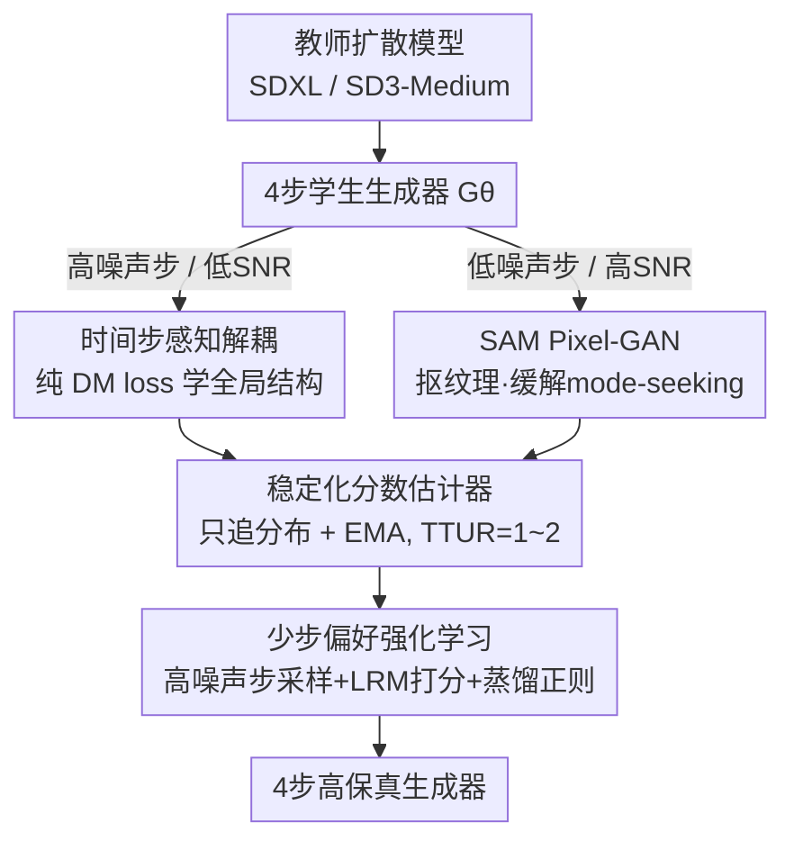

# Flash-DMD: Towards High-Fidelity Few-Step Image Generation with Efficient Distillation and Joint Reinforcement Learning

**会议**: CVPR 2026  
**论文**: [CVF Open Access](https://openaccess.thecvf.com/content/CVPR2026/html/Chen_Flash-DMD_Towards_High-Fidelity_Few-Step_Image_Generation_with_Efficient_Distillation_and_CVPR_2026_paper.html)  
**代码**: 无（原文称"Codes are coming soon"）  
**领域**: 图像生成 / 扩散模型蒸馏  
**关键词**: 时间步蒸馏, 分布匹配蒸馏(DMD), 少步生成, 对抗训练, 强化学习对齐

## 一句话总结
Flash-DMD 把分布匹配蒸馏（DMD）的两个损失按时间步解耦——高噪声步用 DM loss 学全局结构、低噪声步用基于 SAM 的 Pixel-GAN 抠真实感纹理，再把一套专为少步模型设计的偏好强化学习**和蒸馏同时进行**，结果只用 DMD2 约 2.1% 的训练成本就把 SDXL 蒸成 4 步生成器，人类偏好分还反超教师模型。

## 研究背景与动机

**领域现状**：扩散模型生成质量很强，但要迭代几十步去噪，部署慢。时间步蒸馏（timestep distillation）把多步教师压成 1~4 步学生，其中 DMD 系列（DMD、DMD2、ADM、SenseFlow）靠"变分分数蒸馏 / 分布匹配"目标对齐师生输出分布，质量最好。

**现有痛点**：DMD 系列训练成本极高——原始 DMD 蒸 SD1.5 要 20000 次迭代、batch 2304；DMD2 蒸 SDXL 到 4 步要 24000 次迭代。成本主要来自两处：
- **梯度冲突**：DMD2 在**每一个时间步**都把分布匹配梯度（$\nabla_\theta\mathcal{L}_{DMD}$）和对抗梯度（$\nabla_\theta\mathcal{L}_{AdvGen}$）直接相加，两个目标方向打架，既损伤分布匹配精度又拖慢收敛。
- **分数估计器一人干两份活**：生成器的分数估计器 $\mu_{gen}^\psi$ 既要用 diffusion loss 追踪学生分布、又被复用去当判别器区分真假图，互相牵制。为压住这种不稳定，DMD2 用 TTUR=5（分数估计器更新 5 次才更新生成器 1 次），进一步抬高成本。

此外，把蒸好的少步模型再用 RL 对齐人类偏好时，PSO、HyperSD 这类方法严重 **reward hacking**——过拟合到"油画感""过曝平滑"少细节的图。

**核心矛盾**：去噪过程不同阶段的目标本质不同（高噪声步管全局结构、低噪声步管细节纹理），但 DMD2 用一套无差别叠加的损失硬套全程；同时 RL 单独成阶段又容易崩。

**本文目标**：(Q1) 早期阶段怎样协调"分布匹配"与"感知真实感增强"来加速收敛？(Q2) 后期阶段怎样直接、稳定地把细节和人类偏好再往上提一截而不 reward hacking？

**核心 idea**：早期——**按时间步把 DM loss 和对抗 loss 解耦**到各自擅长的噪声区间；后期——把**为少步模型量身定做的偏好 RL** 与蒸馏损失**联合训练**，让一直在跑的稳定蒸馏 loss 当正则项，稳住 RL、防策略崩塌。

## 方法详解

### 整体框架
Flash-DMD 把"从教师扩散模型蒸出 4 步学生生成器 $G_\theta$"分成两个阶段。**第一阶段（高效蒸馏）**：在高噪声（低 SNR）时间步只用 DM loss 让学生快速对齐教师的全局分布与 ODE 轨迹；在低噪声（高 SNR）时间步换成基于 SAM 的 Pixel-GAN 对真实图做对抗，专抠纹理和真实感；同时把分数估计器 $\mu_{gen}^\psi$ 从"兼职判别器"里解放出来、只做分布追踪，再配 EMA 让它用极少更新（TTUR=1 或 2）就能跟上生成器。**第二阶段（联合 RL）**：用一个能给"任意时间步含噪 latent"打分的 Latent Reward Model（LRM），只在高噪声步采样多个候选构造 win-lose 对做偏好优化，并把这个 RL loss 和第一阶段的蒸馏 loss **同时交替更新**，蒸馏损失充当正则器把 RL 摁稳。

### 关键设计

**1. 时间步感知的损失解耦：让 DM loss 和对抗 loss 各管各的噪声区间**

DMD2 的低效根源是把分布匹配梯度和对抗梯度在**每个时间步**无差别相加，方向冲突。作者先做了个观察实验：完全去掉对抗教师、只用纯 DM loss 监督，生成器会迅速收敛到一个"高对比度、缺细腻纹理"的次优域——这是反向 KL 散度的 **mode-seeking** 本性导致的，说明对抗损失对感知真实感不可或缺。于是作者按去噪阶段的目标差异分工：高噪声步（low SNR）主要建立全局构图和结构，DM loss 在含噪 latent 上最有效，就**只**用 DM loss $\nabla_\theta\mathcal{L}_{DMD}^{AT}$ 对齐教师；低噪声步（high SNR）专注细节纹理与色调真实感，就改用**像素级对抗 loss**。具体每次生成器更新只采一个高噪声步 $t$ 算 DM loss，再用 DMD2 的回模拟前向过程 $B$ 把去噪结果推到干净图：

$$x_{t1}=G_\theta(x_t,t);\quad x_0=\text{Detach}(B(x_{t1},0))$$

然后在低噪声步 $\hat t$ 对 $x_0$ 做扩散前向得到 $\hat x$，算对抗梯度：

$$\nabla_\theta\mathcal{L}_{AdvGen}^{TA}=\mathbb{E}_{\hat t,\hat x}\Big[\log D\big(V(G_\theta(\hat x,\hat t))\big)\frac{dG_\theta(\cdot)}{d\theta}\Big]$$

其中 $V$ 是 VAE 解码、$D$ 是像素级判别器。这样两个目标不再在同一步互相拉扯，训练效率显著提升。

**2. 基于 SAM 的 Pixel-GAN：用通用视觉表征摁住 mode-seeking**

纯 DM loss 的 mode-seeking 会让模型早早收敛到模糊、简化的解。和常规的 latent-space GAN 不同，本文把判别器直接建在**像素空间**，且骨干用 **SAM（Segment Anything Model）冻结的视觉编码器**抽多层级特征，再挂多个可训练判别头，参数 $\omega$ 按下式更新：

$$\mathcal{L}_{AdvDisc}^{PG}=\mathbb{E}_{x_{real}}[-\log D_\omega(\cdot)]+\mathbb{E}_z[\log D_\omega(V(\cdot))]$$

SAM 的通用强表征让判别器对局部几何结构和细粒度纹理极其敏感，从训练最早期就施加严格的真实感约束，逼生成器尽快锚定数据分布里多样、高保真的模式，从源头上抑制"过早收敛到模糊解"的 mode-seeking。

**3. 稳定化分数估计器：把判别职能剥离 + EMA 轻量耦合**

DMD2 里分数估计器要同时追踪学生分布（diffusion loss）又当判别器（区分真假），目标冲突才被迫上 TTUR=5。Flash-DMD 让 $\mu_{gen}^\psi$ **只**通过 diffusion loss $\mathcal{L}_{Diffusion}=\mathbb{E}\|\mu_{gen}^\psi(x_t,t)-\epsilon\|_2^2$ 训练，专心做分布追踪，判别交给上面的 Pixel-GAN。这样每次生成器更新只需更新分数估计器 1~2 次（TTUR=1,2）就够稳。此外借鉴隐式分布对齐，用 EMA 把最新生成器参数注入分数估计器：

$$\psi\leftarrow\lambda_{ema}\psi+(1-\lambda_{ema})\theta$$

让 $\mu_{gen}^\psi$ 用极少额外更新就紧跟生成器轨迹，既稳又省算力——这是把训练成本压到 DMD2 的 2.1% 的关键之一。

**4. 为少步模型定做的联合偏好强化学习：高噪声步采样 + 蒸馏正则防 reward hacking**

PSO/HyperSD 在干净图上做偏好优化，梯度只回传到低噪声步，模型就过拟合 reward 的表面偏置（特定色调、油画感）。作者的诊断是"必须覆盖采样轨迹，尤其是高噪声步"。两点改造：① 换用能给**任意时间步含噪 latent** 打分的 LRM；并发现不是所有时间步都需要——同一初始噪声下，高噪声步采样的图在布局和细节上**多样性更好**，所以**只在高噪声阶段**做随机采样。给定初始 latent $z_t$，在高噪声步采 $k$ 个候选 $\{z^1_{t-1},...,z^k_{t-1}\}$，LRM 打分后取最高/最低分构成 win-lose 对 $(z_t,z^w_{t-1},z^l_{t-1})$，最小化：

$$\mathcal{L}_{rl}=-\mathbb{E}[\log\sigma(\beta H(w,l))]$$
$$H(w,l)=\log\frac{p_\theta(z^w_{t-1}|z_t,c)}{p_{ref}(z^w_{t-1}|z_t,c)}-\log\frac{p_\theta(z^l_{t-1}|z_t,c)}{p_{ref}(z^l_{t-1}|z_t,c)}$$

② 把 $\mathcal{L}_{rl}$ 和 Flash-DMD 第一阶段的蒸馏 loss **联合交替训练**，而非单独跑 RL 阶段。一直在跑的、定义良好的蒸馏 loss 充当强正则，再叠加分布匹配和 Pixel-GAN 的约束，把 RL 稳稳摁住、防止策略崩塌和 reward hacking，同时省掉"先蒸馏后 RL"两段式的额外开销。

## 实验关键数据

评测在 COCO-2014 的 10K prompts 上，沿用 DMD2 协议，指标含 CLIP（文图相似）、ImageReward(ImgRwd)、PickScore、HPSv2、MPS 等偏好类指标。Cost = batch size × 迭代步数。

### 主实验（阶段 1：SDXL 蒸馏，COCO-10k）

| 方法 | #NFE | ImgRwd↑ | Pick↑ | HPSv2↑ | MPS↑ | Cost↓ |
|------|------|---------|-------|--------|------|-------|
| SDXL（教师） | 100 | 0.7143 | 0.2265 | 0.2865 | 11.87 | - |
| SDXL-Turbo | 4 | 0.8338 | 0.2286 | 0.2899 | 12.25 | - |
| DMD2-SDXL | 4 | 0.8748 | 0.2309 | 0.2937 | 12.41 | 128×24k |
| **Flash-DMD TTUR1-1k** | 4 | 0.9509 | 0.2322 | 0.2968 | 12.67 | **64k (2.1%)** |
| **Flash-DMD TTUR2-8k** | 4 | **0.9740** | **0.2327** | **0.2981** | **12.71** | 64×8k |

仅用 DMD2 **2.1%** 的训练成本（TTUR1 跑 1000 步）就在人类偏好分上反超 DMD2，并且全设置下都超过教师 SDXL。在 Flow Matching 的 SD3-Medium 上（用 LoRA、TTUR=2、4k 步）也超过教师（NFE=28）和 SD3-Flash，验证了对 score-based 与 flow-matching 两类模型的通用性。

### 阶段 2：联合 RL 对比（COCO-10k）

| 方法 | #NFE | Pick↑ | MPS↑ | GPU Hours |
|------|------|-------|------|-----------|
| Hyper-SDXL | 4 | 0.2324 | 12.45 | 400 A100 |
| PSO-DMD2 | 4 | 0.2338 | 12.53 | 160 A100 |
| LPO-SDXL | 40 | 0.2342 | 12.58 | 92 A100 |
| **Flash-DMD** | 4 | **0.2346** | **12.84** | **12 H20** |

PickScore 和 MPS 双双最高，且只花 12 H20 GPU-hours（对手要上百张 A100）。Hyper-SDXL 的 ImgRwd/HPSv2 虽高，但实际生成过曝、油画感（典型 reward hacking）；LPO 的 CLIP 最高但图过度平滑。

### 消融实验（DMD2 base，A=Pixel-GAN，B=激进 TTUR，C=时间步感知优化，RL=联合强化）

| 配置 | 训练步 | ImgRwd↑ | Pick↑ | MPS↑ |
|------|--------|---------|-------|------|
| Base (DMD2) | 24k | 0.8748 | 0.2309 | 12.41 |
| +A | 8k | 0.8918 | 0.2314 | 12.50 |
| +B | 8k | 0.8871 | 0.2310 | 12.47 |
| +ABC | 1k | 0.9509 | 0.2322 | 12.67 |
| +ABC | 8k | 0.9740 | 0.2327 | 12.71 |
| +ABC+RL | 1k+2k | 1.0035 | **0.2346** | **12.84** |

### 关键发现
- **三件套缺一不可、合起来才质变**：单加 Pixel-GAN(A) 或激进 TTUR(B) 只小涨；只有配合时间步感知解耦(C) 把目标拆开，才把 ImgRwd 从 0.88 抬到 0.95、同时把迭代从 24k 砍到 1k。
- **RL 频率有最优点**：阶段 2 用交替更新而非加权叠加，RL loss 与 DM loss 频率比测了 1:1/2:1/5:1/10:1，**5:1** 综合分最高；消融还显示"只在高噪声步采样 + 配 Pixel-GAN"比"all noise"更好，印证高噪声步采样多样性更高的判断。
- **稳定性**：TTUR=2 下 Flash-DMD 全程稳定上升，而 DMD2 初期小涨后迅速退化，验证解耦带来的训练稳定性。

## 亮点与洞察
- **"按噪声分工"是核心洞察**：高噪声步管结构、低噪声步管纹理，这个朴素观察被用来把两个互相打架的损失干净地解耦，比"无脑加权求和"高明很多，也是省 50× 成本的根本原因。
- **拿 SAM 当判别器骨干**：用一个通用分割大模型的冻结视觉编码器做像素级判别器，借它对局部几何/纹理的敏感性来抑制 mode-seeking，是个可迁移到其它 GAN/对抗蒸馏的好 trick。
- **蒸馏 loss 当 RL 的正则器**：让"一直在跑的、定义良好的蒸馏损失"稳住容易崩的 RL，把"先蒸馏后 RL"两段式合成一段联合训练，既省算力又天然防 reward hacking——这个"用稳定辅助损失当正则稳住强化学习"的思路可迁移到其它 RLHF 场景。
- **只在高噪声步做偏好采样**：发现高噪声步采样多样性更高，于是把 RL 的探索集中在那里而非全轨迹，省算力又避开低噪声步的 reward 偏置。

## 局限与展望
- **代码未放出**（"coming soon"），多个关键实现细节（回模拟过程 $B$、LRM 具体形态、判别头结构）依赖引用，复现门槛较高。
- 仅在 SDXL / SD3-Medium 两个模型、COCO 10k prompts 上验证，未涉及更大分辨率或视频/3D 生成等场景的泛化。
- RL 频率比 5:1 是网格搜出来的经验最优，跨模型/数据集是否仍最优、对超参 $\beta,\lambda_{ema}$ 的敏感性论文给得不充分。
- 评测高度依赖偏好类指标（ImgRwd/HPSv2/MPS），这些 reward model 本身可能有偏置；作者也承认对手的 reward hacking 部分是因为偏好指标好刷——Flash-DMD 自己用 LRM 做训练信号，是否也吃同样的红利值得 caveat。

## 相关工作与启发
- **vs DMD2**：DMD2 在每个时间步把 DM loss 与对抗 loss 朴素相加、分数估计器兼职判别、TTUR=5。Flash-DMD 把损失按时间步解耦、判别交给 SAM Pixel-GAN、分数估计器只追分布 + EMA，因而 TTUR 降到 1~2，训练成本降到 2.1%、质量还更高。
- **vs ADM / SenseFlow**：同属 DMD/对抗蒸馏家族，ADM 引入 Hinge loss 的 GAN、SenseFlow 优化打分器与判别器；Flash-DMD 的差异在"时间步感知解耦 + 像素级 SAM 判别 + 联合 RL"三合一。
- **vs PSO / HyperSD（少步 RL）**：它们在干净图/低噪声步做偏好优化，梯度只到低噪声步导致过拟合 reward 偏置、出油画过曝。Flash-DMD 改在高噪声步采样、换 LRM 给含噪 latent 打分、并与蒸馏联合训练，显著缓解 reward hacking。

## 评分
- 新颖性: ⭐⭐⭐⭐ "按时间步解耦损失 + SAM 像素判别 + 蒸馏正则 RL"的组合思路清晰且有效，单点创新中等但工程洞察扎实
- 实验充分度: ⭐⭐⭐⭐ 覆盖 score-based 与 flow-matching 两类模型、主表+多张消融、RL 频率/采样区间都做了 ablation
- 写作质量: ⭐⭐⭐⭐ 动机（Q1/Q2）和两阶段逻辑讲得清楚，公式有少量笔误但整体可读
- 价值: ⭐⭐⭐⭐⭐ 把 DMD 蒸馏成本砍到 ~2%、人类偏好反超教师，对资源受限场景的少步高保真生成有很强实用价值

<!-- RELATED:START -->

## 相关论文

- [\[CVPR 2026\] LogCD: Local-to-global Consistency Distillation for Few-step Image Generation](logcd_local-to-global_consistency_distillation_for_few-step_image_generation.md)
- [\[CVPR 2026\] Uni-DAD: Unified Distillation and Adaptation of Diffusion Models for Few-step Few-shot Image Generation](uni-dad_unified_distillation_and_adaptation_of_diffusion_models_for_few-step_few.md)
- [\[CVPR 2026\] Refining Few-Step Text-to-Multiview Diffusion via Reinforcement Learning](refining_few-step_text-to-multiview_diffusion_via_reinforcement_learning.md)
- [\[CVPR 2026\] PROMO: Promptable Outfitting for Efficient High-Fidelity Virtual Try-On](promo_promptable_virtual_tryon_efficient.md)
- [\[CVPR 2026\] DiT360: High-Fidelity Panoramic Image Generation via Hybrid Training](dit360_high-fidelity_panoramic_image_generation_via_hybrid_training.md)

<!-- RELATED:END -->
