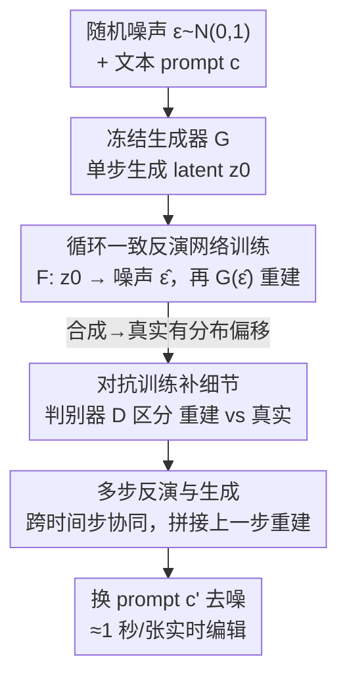

# FlashIn: Fast and Accurate Image Inversion for Real-time Image Editing

**会议**: CVPR 2026  
**论文**: [CVF Open Access](https://openaccess.thecvf.com/content/CVPR2026/html/Wang_FlashIn_Fast_and_Accurate_Image_Inversion_for_Real-time_Image_Editing_CVPR_2026_paper.html)  
**代码**: 待确认  
**领域**: 扩散模型 / 图像编辑  
**关键词**: 图像反演、实时编辑、循环一致、对抗训练、Flux

## 一句话总结
FlashIn 用一个可学习的神经网络把图像**直接一步映射回它的种子噪声**，配合"生成数据 + 循环一致损失"提供显式监督、再用对抗训练补回细节，从而把扩散图像反演从 30~50 步压到 1~4 步，在 PIE-Bench 上以约 1 秒/张的代价拿到 SOTA 的背景保持与编辑保真度。

## 研究背景与动机

**领域现状**：基于文生图扩散模型做图像编辑的主流路线是"先反演、再编辑"——给定一张图和它的描述 prompt，先反推出能重建该图的初始噪声，然后把 prompt 改成编辑后的版本再去噪，就能在保留原图未编辑部分的前提下完成编辑。最常用的反演工具是 DDIM Inversion，把 DDIM 调度反向跑一遍来近似初始噪声。

**现有痛点**：DDIM 反演通常要 30~50 步，而且反演轨迹上误差会逐步累积，导致重建/编辑结果出现伪影和畸变。后续改进各有代价：优化型方法（如 null-text inversion）和改网络结构的 EDICT、定点迭代的 ReNoise 都能提精度，但都带来明显的额外计算开销；近期基于 rectified flow 的反演方法（RF-solver 等）虽然准，却需要很长的反演轨迹，而且往往绑定某一种特定 scheduler，换个扩散模型就不适用。

**核心矛盾**：反演本质上是**不可解的（intractable）**——现代神经网络非可逆，没有任何一张真实图像存在已知的"真值噪声"。这逼得已有的"训一个编码器直接出噪声"的方法（TurboEdit、SwiftEdit）只能靠 KL 散度、重建损失这类**弱约束 / 隐式目标**来训，优化困难、训练不稳、结果不准。

**本文目标**：要同时做到（1）反演**快**——压到单步/几步；（2）反演**准**——重建保真、能保住细节；（3）**通用**——不绑死某一种 scheduler。

**切入角度**：既然真实图像没有真值噪声，那就**反过来造数据**——先用噪声生成图像，把"噪声 → 图像"这对配对存下来，于是每张（合成）图像都自带一个已知的种子噪声当显式监督目标，把原本隐式、难优化的问题变成有明确 target 的回归问题。

**核心 idea**：用一个可学习网络一步把图像映射回种子噪声（替代多步迭代反演），并用"循环一致损失提供显式监督 + 对抗训练补真实图像细节"把单步反演做准。

## 方法详解

### 整体框架
FlashIn 把"反演"重新参数化成一个前馈网络 $F$：给定干净 latent $z_0$、文本条件 $c$、时间步 $T$，直接输出种子噪声 $\hat\epsilon = F(z_0, c, T)$；再把 $\hat\epsilon$ 喂回冻结的少步生成器 $G$（基于 Flux-Schnell），换个新 prompt $c'$ 就能编辑：$z'_0 = G(F(z_0, c, T), c', T)$。整套方法围绕一个问题展开——**没有真值噪声怎么训 $F$**——并给出三层递进的解法：先用"生成数据 + 循环一致损失"造出显式监督，再用对抗训练把合成域学到的网络迁移到真实图像并补回细节，最后把单步扩展成多步协同以进一步提精度。训练时 $G$ 全程冻结，只优化 $F$ 和判别器 $D$。

### 关键设计

**1. 循环一致的反演网络训练：用合成噪声-图像对造出显式监督目标**

这一步直接打的是"反演无真值、只能弱约束训练"这个根本痛点。已有工作（TurboEdit、SwiftEdit）只能用重建损失 $L_{recon} = \|z_0 - G(F(z_0, c, T), c, T)\|_2^2$ 加一个让输出贴近高斯分布的正则项 $L_{reg} = \mathrm{KL}(F(z_0, c, T), N(0,1))$ 来训。问题在于：$L_{reg}$ 对 $F$ 的输出只有很弱的约束，而 $L_{recon}$ 是把梯度从 $G$ 一路反传回 $F$，等于一个**隐式优化目标**，没有给每个样本一个明确的目标噪声，因此优化很难、训练不稳。

FlashIn 的破局点是**主动制造配对数据**：随机采一个 $\epsilon \sim N(0,1)$ 和文本 $c$，用冻结的单步生成器算出 $z_0 = G(\epsilon, c, T)$，于是这个 $z_0$ 天然带着一个**已知的真值噪声 $\epsilon$**。把 $z_0$ 喂给 $F$ 得到 $\hat\epsilon = F(z_0, c, T)$，再用 $\hat\epsilon$ 重建 $\hat z_0 = G(\hat\epsilon, c, T)$，作者定义循环一致损失同时约束"噪声对齐"和"latent 对齐"：

$$L_{cycle} = L^1_{cycle} + L^2_{cycle} = \|\epsilon - \hat\epsilon\|_2^2 + \lambda \|z_0 - \hat z_0\|_2^2$$

其中 $\lambda$ 平衡两项（实现里取 1）。$L^1_{cycle}$ 直接拿真值噪声做监督，把原来隐式的目标变成显式回归，这正是训练得以稳定、精度得以提升的关键；$L^2_{cycle}$ 再从图像空间兜一层一致性。和旧方法相比，区别就在于"有没有 ground-truth $\epsilon$"——FlashIn 通过生成数据把它造了出来。

**2. 对抗训练补回真实图像的细节：跨越合成域与真实域的分布偏移**

只用合成数据训出来的 $F$ 有个隐患：合成图像和真实图像之间存在分布偏移，导致 $F$ 处理真实图时容易出现**过度平滑、细节丢失**。FlashIn 借鉴少步扩散蒸馏里常用的对抗学习思路，把反演网络 $F$ 和生成器 $G$ 看成一个统一的生成器，额外训一个判别器 $D$ 去区分"重建出来的 latent $\hat z_0$"和"真实图像 latent $\tilde z_0$"。生成侧要骗过判别器、让重建结果逼近真实图：

$$L^F_{adv} = -\mathbb{E}_{\hat z_0 \sim G(F(\cdot))}[D(G(F(\hat z_0, c, T)))]$$

判别侧则拉开二者：

$$L^D_{adv} = \mathbb{E}_{\hat z_0 \sim G(F(\cdot))}[D(G(F(\hat z_0, c, T)))] - \mathbb{E}_{\tilde z_0}[D(\tilde z_0)]$$

对抗压力会逼着 $F$ 输出**信息量更足的噪声**，使重建 latent 尽量保留和真实图一样多的精细纹理（消融图里草地纹理、岩石质感的恢复就是这个机制的功劳）。总训练目标把四项等权相加（作者称对各 loss 权重不敏感）：

$$L_{full} = L_{cycle} + L_{reg} + L^D_{adv} + L^F_{adv}$$

**3. 多步反演与生成：让各时间步协同，单步不够再花一点时间换精度**

单步已经能反演，但若愿意多花一点时间，作者把框架扩成多步（如 4 步）以进一步提精度。核心做法是让每一步反演**参考上一步的重建结果**：在第 $t$ 步，先用上一步预测的噪声 $\hat\epsilon_{t-1}$ 重建并按调度重新加噪得到 $\hat z^{t-1}_0 = G(\mathrm{AddNoise}(z_0, \hat\epsilon_{t-1}, t-1), c, t-1)$（第一步 $t=1$ 时把它初始化为全零 latent）。然后把真实 latent $z_0$ 和上一步重建 latent 沿通道维拼接，一起喂进反演网络（为此把 $F$ 的输入通道数翻倍）：

$$\hat\epsilon_t = F([z_0; \hat z^{t-1}_0], c, t)$$

这样 $F$ 每一步都"看着上一步结果"逐步修正，精度随步数提升（消融图 6 显示 1→4 步细节明显变清晰）。生成编辑图时有两种用噪声的策略：用最后一步迭代精炼后的噪声，或从第一步噪声生成、再用后续步的反演噪声 renoise；作者实测**第二种略好**并在实验中采用。⚠️ 公式与符号细节以原文为准。

### 损失函数 / 训练策略
基于少步生成模型 Flux-Schnell 训练。反演网络 $F$ 用 MMDiT 的 10 个 double block + 20 个 single block 初始化；判别器约为 $F$ 的一半大小。训练数据是 LAION 经 Qwen-VL 重新生成 caption 的版本，分辨率 512×512。$F$ 和 $D$ 都训 100K 步、学习率 $1\times10^{-5}$，$\lambda=1$，反演网络按 4 步版本训练（$T$ 从 $\{1.0, 0.75, 0.5, 0.25\}$ 随机取）。推理统一用 4 步（与 Flux-Schnell 对齐）。

## 实验关键数据

数据集为 PIE-Bench（700 张图、10 种编辑类型）。评测分两组：背景保持（PSNR / LPIPS / MSE / SSIM，比对源图与编辑图）和编辑保真（CLIP 相似度，分整图与编辑区两档），并报告反演 / 前向两段的耗时（单卡 A100）。

### 主实验

| 方法 | PSNR↑ | LPIPS(×10³)↓ | MSE(×10⁴)↓ | SSIM(×10²)↑ | CLIP整图↑ | CLIP编辑区↑ | 反演(s)↓ | 前向(s)↓ |
|------|-------|--------------|------------|-------------|-----------|-------------|----------|----------|
| DirectInv | 27.22 | 54.55 | 32.86 | 84.76 | 25.02 | 22.10 | 10.14 | 4.3 |
| MasaCtrl | 22.17 | 106.62 | 86.97 | 79.67 | 23.96 | 21.16 | 4.14 | 4.83 |
| ReNoise | 27.11 | 49.25 | 31.23 | 72.30 | 23.98 | 21.26 | 5.41 | 0.445 |
| ExactDPM | 24.54 | 59.88 | 36.49 | 69.18 | 23.77 | 21.23 | 15.11 | 0.445 |
| TurboEdit-Deutch | 27.64 | 52.31 | 37.89 | 24.33⚠️ | 78.52⚠️ | 22.17 | 0.671 | 0.621 |
| TurboEdit-Wu | 29.52 | 44.74 | 26.08 | 91.59 | 25.05 | 22.34 | 0.668 | 0.508 |
| **FlashIn（本文）** | **31.91** | **32.11** | **15.51** | 88.76 | **25.67** | **23.94** | 0.666 | **0.382** |

注：TurboEdit-Deutch 行的 SSIM/CLIP整图两列在原表中数值疑似错位（⚠️ 以原文为准）。FlashIn 在 4 项背景保持指标里拿下 3 项最佳（仅 SSIM 88.76 次于 TurboEdit-Wu 的 91.59），PSNR 31.91 比第二名高约 8%；CLIP 整图 / 编辑区双第一；前向耗时 0.382s 最快，反演耗时与 TurboEdit 持平，仅略慢于 DDIM-4 步，总时间成本最低。

### 消融实验

| cycle | adversarial | PSNR↑ | SSIM(×10²)↑ | CLIP整图↑ | CLIP编辑区↑ |
|-------|-------------|-------|-------------|-----------|-------------|
| ✗ | ✗ | 26.19 | 81.47 | 24.88 | 22.43 |
| ✓ | ✗ | 28.40 | 85.39 | 25.32 | 23.01 |
| ✓ | ✓ | 31.91 | 88.76 | 25.67 | 23.94 |

加入循环一致训练后 PSNR 从 26.19 → 28.40、SSIM 从 81.47 → 85.39，背景保持和编辑保真同时提升，印证"给反演网络一个明确目标"很关键；再叠加对抗学习继续涨到 PSNR 31.91 / SSIM 88.76，对背景保持（细节保留）增益尤其明显。

### 即插即用增益

| 噪声 | 编辑模型 | PSNR↑ | LPIPS(×10³)↓ | CLIP↑ | Time(s)↓ |
|------|----------|-------|--------------|-------|----------|
| 本文 | Flux-Schnell | 31.91 | 32.11 | 23.94 | 1.04 |
| 随机 | Flux-Kontext | 33.45 | 38.44 | 28.43 | 16.42 |
| 本文 | Flux-Kontext | 33.48 | 31.44 | 28.56 | 17.02 |
| 随机 | Qwen-Image-Edit | 34.52 | 36.14 | 29.67 | 34.01 |
| 本文 | Qwen-Image-Edit | 34.67 | 31.22 | 29.85 | 34.67 |

把 FlashIn 的反演噪声当"锚点"插进指令式编辑模型（Flux-Kontext / Qwen-Image-Edit），相对随机噪声一致地改善背景保持（如 Flux-Kontext 上 LPIPS 38.44 → 31.44），说明该反演噪声对通用编辑器也有用。

### 关键发现
- 两个训练策略中，**对抗学习对背景保持的增量更大**：从 cycle-only 到 cycle+adv，PSNR 再涨 3.51（28.40 → 31.91），主要靠它补回纹理细节。
- 推理步数是质量-速度旋钮：1 步偏糊、细节缺失，2/3/4 步逐步变清晰（图 6）。
- FlashIn 慢在反演段、快在前向段，整体总耗时最低，配合 Flux-Schnell 做到约 1 秒/张的交互式编辑。

## 亮点与洞察
- **"造数据来制造监督信号"这一招很巧**：反演问题本身没有真值噪声，作者反向利用生成器"噪声→图像"可控这一点，把每个合成样本的种子噪声留作 ground-truth，直接把隐式难题变成显式回归——这是整个方法稳定可训的根。
- **把反演从"迭代求解"改成"前馈预测"**：一次网络前向就出噪声，天然摆脱了 DDIM 多步反演的误差累积和对特定 scheduler 的依赖，可迁移到其他编辑器当锚点。
- **对抗训练用来"补真实域细节"而非"提生成质量"**：同一个工具换了目标——专治合成数据训练带来的过平滑，思路可迁移到任何"合成数据训、真实数据用"的反演/编码任务。
- **多步设计是优雅的精度-时间旋钮**：通道拼接上一步重建结果让各步协同，需要更高保真时加步数即可，不必重训。

## 局限与展望
- 训练强依赖"生成器可控产噪声-图像对"，因此**与所选少步生成模型（Flux-Schnell）强绑定**；换底座生成器大概率要重训反演网络。
- 主表里 TurboEdit-Deutch 行的 SSIM / CLIP 数值疑似排版错位，横向比较时需谨慎（⚠️ 以原文为准）。
- 单步结果仍偏糊，要好质量需 2~4 步；细粒度纹理的保真很大程度依赖对抗训练，作者未深入分析其训练稳定性与失败模式。
- 评测集中在 PIE-Bench（512×512），更高分辨率、更复杂多目标编辑场景下的表现未充分验证。
- 作者展望把方法扩展到**视频反演与编辑**。

## 相关工作与启发
- **vs TurboEdit / SwiftEdit**: 同样训编码器直接出噪声，但它们缺显式优化目标（KL+重建的隐式监督），训练难、重建质量受限；FlashIn 用生成数据造真值噪声 + 循环一致损失提供显式 target，并加对抗训练补细节，精度更高。
- **vs DDIM Inversion / DirectInv**: 后者靠反向调度多步近似（30~50 步），误差累积导致伪影；FlashIn 用前馈网络 1~4 步完成，更快更准且不依赖特定 scheduler。
- **vs RF-solver / ReNoise 等精化型反演**: 它们靠高阶近似或定点迭代提精度但轨迹长、开销大、常绑定某类 scheduler；FlashIn 把开销前置到训练、推理只需少步。
- **vs ADD / LADD / SDXL-Lightning（少步扩散蒸馏）**: 借用了它们的对抗学习思想，但目标从"提升生成质量"换成"提升反演的细节保真"，用途不同。

## 评分
- 新颖性: ⭐⭐⭐⭐ 把反演重参数化为前馈网络并用"生成数据造真值噪声+循环一致"提供显式监督，思路清晰且解决了根本痛点。
- 实验充分度: ⭐⭐⭐⭐ PIE-Bench 主表+消融+多步+即插即用四组实验较完整，但仅一个 benchmark、单分辨率，主表疑有排版瑕疵。
- 写作质量: ⭐⭐⭐⭐ 动机-方法-实验逻辑顺畅，公式表述清楚（个别符号/表格有小瑕疵）。
- 价值: ⭐⭐⭐⭐ 1 秒级实时编辑 + 可当通用编辑器锚点，实用价值高。

<!-- RELATED:START -->

## 相关论文

- [\[ICML 2026\] DirectEdit: Step-Level Accurate Inversion for Flow-Based Image Editing](../../ICML2026/image_generation/directedit_step-level_accurate_inversion_for_flow-based_image_editing.md)
- [\[CVPR 2026\] From Scale to Speed: Adaptive Test-Time Scaling for Image Editing](from_scale_to_speed_adaptive_test-time_scaling_for_image_editing.md)
- [\[CVPR 2026\] NEAF: Natural Image Editing with Attention Fusion for Generalizable Test-time Optimization in Text-Guided Image Editing](neaf_natural_image_editing_with_attention_fusion_for_generalizable_test-time_opt.md)
- [\[CVPR 2026\] DreamStereo: Towards Real-Time Stereo Inpainting for HD Videos](dreamstereo_towards_real-time_stereo_inpainting_for_hd_videos.md)
- [\[CVPR 2026\] StreamDiT: Real-Time Streaming Text-to-Video Generation](streamdit_real-time_streaming_text-to-video_generation.md)

<!-- RELATED:END -->
