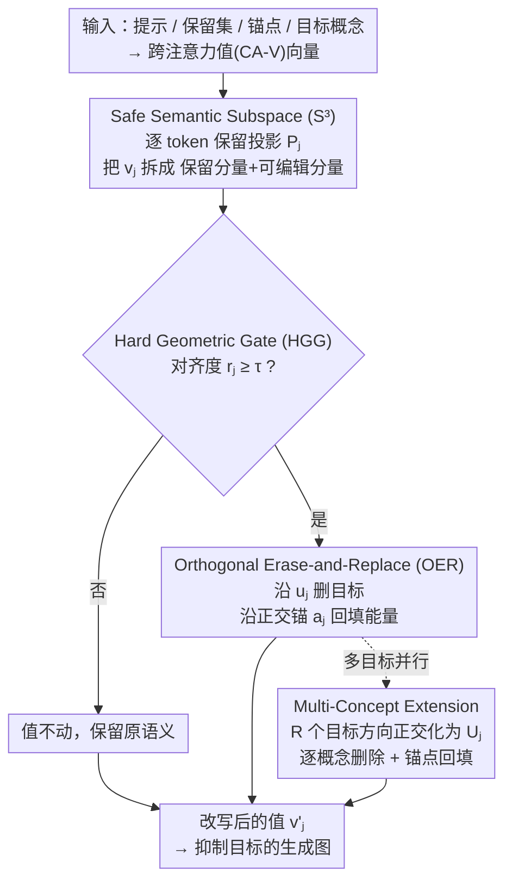

# GenErase: Generalizable and Semantically-Aware Concept Erasure in Diffusion Models

**会议**: CVPR 2026  
**论文**: [CVF Open Access](https://openaccess.thecvf.com/content/CVPR2026/html/Vardhana_GenErase_Generalizable_and_Semantically-Aware_Concept_Erasure_in_Diffusion_Models_CVPR_2026_paper.html)  
**代码**: 待确认  
**领域**: 扩散模型 / 概念擦除 / 生成安全  
**关键词**: 概念擦除、训练无关、跨注意力值空间、几何门控、释义泛化

## 一句话总结
GenErase 是一种**训练无关、纯推理期**的扩散模型概念擦除框架，它在跨注意力值（CA-V）空间里用「逐 token 保留投影 + 硬几何门控 + 正交擦除-回填」三件套，把目标概念（名人、版权角色、NSFW 等）从生成结果里精准抹掉，同时不伤无关内容，且对释义/别名/上下文变化的提示也能稳定生效。

## 研究背景与动机

**领域现状**：文本到图像（T2I）扩散模型（Stable Diffusion 等）训练在 LAION-5B 这类网络数据上，不可避免会内化不安全、受版权保护或涉隐私的内容。为了让模型「安全可部署」，研究界发展出两条概念擦除路线：一是**权重编辑**（UCE、MACE、CURE、ESD 等），直接改模型参数造一个「净化版」checkpoint；二是**推理期护栏（guard-railing）**（NP、SLD、AdaVD、SAFREE 等），不动权重，只在采样时调整中间表征。

**现有痛点**：权重编辑虽适合中心化审核，但**改的是共享权重**——无法支持「用户/部署各自定制、可临时开关、可逆、可调」的过滤需求，每加一个概念还要重新微调一次。推理期方法更灵活，但现有做法陷入一个核心权衡：要么**太死板**（NP/SLD 用负向引导，控制粗糙，常引入伪影、损伤无关内容），要么**太脆**（AdaVD/SAFREE 用投影/软门控提升了选择性，但只在「把目标的所有释义都显式列出来」时才扛得住释义攻击）。

**核心矛盾**：真实部署里不可能穷举一个概念的所有别名——比如「Donald Trump」可以被说成「President of the United States」，「Batman」可以被说成「Dark Knight / Gotham superhero」。靠 LLM 实时扩展释义又会带来明显延迟。于是现有推理期方法对**未见过的释义**很脆，并且不同扩散层之间的抑制强度也不一致，在「过度擦除」和「抑制不足」之间反复摇摆。

**本文目标**：做一个推理期护栏，同时满足三点——（1）精准擦除目标；（2）显式保护与目标相邻的关键语义；（3）跨层、跨释义、跨多概念都稳定。

**切入角度**：作者把擦除重新理解为 CA-V 空间里的**几何操作**。跨注意力值空间是「文本概念如何落到图像特征」的地方，目标、保留概念、锚点都可以表示成这个空间里的方向向量，于是「删目标但留邻居」就变成了「在向量子空间里做正交分解」。

**核心 idea**：用「显式保留子空间 + 硬几何门控 + 正交擦除-回填」在 CA-V 空间里强制语义正交性——只在 token 与目标方向强对齐时触发编辑，删掉目标方向的能量后再沿一个与保留/擦除都正交的中性锚点把能量补回去，从而既抹得干净又不塌陷。

## 方法详解

### 整体框架

GenErase 全程在跨注意力值（CA-V）空间工作，对**每个 prompt token、每个 CA 层**做一次干预，不改任何模型参数、不调采样超参。给定目标概念 $t$、保留集 $P=\{p_1,\dots,p_K\}$ 和中性锚点 $a$，先在预处理阶段把 prompt、保留、锚点、目标都过一遍值投影矩阵 $W_V$，变成 token 对齐的值向量；推理时对当前 prompt 的每个 token 值 $v_j$ 依次做三步：① **Safe Semantic Subspace（S³）** 用保留集建一个逐 token 的保留投影 $P_j$，把 $v_j$ 拆成「受保护分量」和「可编辑分量」；② **Hard Geometric Gate（HGG）** 在可编辑分量里量化它与目标方向的对齐度 $r_j$，只有超过阈值 $\tau$ 才触发编辑；③ **Orthogonal Erase-and-Replace（OER）** 删掉目标方向的能量、再沿一个与保留/擦除都正交的中性锚点把能量回填。三步串完，输出改写后的值 $v'_j$ 喂回扩散采样，得到「目标被抹掉、无关内容完好」的图像。最后还有一个**多概念扩展**，把三步推广到同时擦 $R$ 个目标。

### 关键设计

**1. Safe Semantic Subspace（S³）：先圈出「绝对不能动」的语义再下刀**

擦除最常见的副作用是「连坐」——想删「Donald Trump」却把长得像的身份一起搞糊了。S³ 的思路是：与其只靠门控被动地不去碰邻居，不如**显式地把邻居所在的子空间投影掉**。对每个 token $j$，取保留集里 $K$ 个保留概念的 CA-V 向量 $\tilde v_{p_k,j}$，正交化成一组基 $B_j=\mathrm{orth}([\tilde v_{p_1,j},\dots,\tilde v_{p_K,j}])$，得到投影矩阵 $P_j=B_jB_j^\top$。于是每个 prompt token 值都能分解为 $v_j = P_j v_j + (I-P_j)v_j$，其中 $P_j v_j$ 是受保护的语义、$(I-P_j)v_j$ 落在可编辑的补空间 $S^{\perp}_j$。GenErase **只动后者**，从机制上保证编辑永远碰不到被保护概念。$P_j$ 是逐 token、逐层算的，所以能自适应扩散特征里的空间与语义变化；论文的消融图（Fig. 3）显示去掉这个投影后，非目标生成会出现可见伪影和语义溢出。这是它和 AdaVD/SAFREE「只靠门控」的本质区别——把「保护」从被动变成了显式约束。

**2. Hard Geometric Gate（HGG）：用归一化方向几何决定「这个 token 到底是不是目标」**

光圈出保留子空间还不够，还得保证编辑**只在 token 真正强对齐目标时**才发生，否则会误伤。HGG 是一个纯几何的阈值规则。先在可编辑补空间里算目标的归一化擦除方向：$\tilde u_j=(I-P_j)\tilde v_{t,j}$，$u_j=\tilde u_j/\lVert\tilde u_j\rVert_2$（目标向量先被投影掉保留语义，得到「纯目标方向」）。再看当前 token 的可编辑分量 $v_{\text{free},j}=(I-P_j)v_j$ 与之的对齐度 $t_j=u_j^\top v_{\text{free},j}$，并归一化成 $r_j=\dfrac{\lvert t_j\rvert}{\lVert v_{\text{free},j}\rVert_2+\varepsilon}$——$r_j$ 衡量的是「这个 token 有多大比例的语义能量指向目标」，且**与幅值无关**。当且仅当 $r_j\ge\tau$ 才编辑，低于阈值的 token 原样保留，产生稀疏、可解释的编辑。和 AdaVD 的软加权/自适应缩放不同，HGG 做的是**离散、可解释的二元判定**，只依赖方向几何，因此对各层幅值变化天然不变、对释义提示更鲁棒——论文把它形容成一个「语义开关」，正是这种「按方向而非按幅值/按字面」的判定，让它能识别出 trump、america 这类与目标绑定的 token 而放过 lemon、crow 等无关 token（Fig. 4）。

**3. Orthogonal Erase-and-Replace（OER）：删掉目标方向后，把能量回填到中性锚点而不是直接清零**

直接把目标分量「抹零」会让特征塌陷、扰乱扩散轨迹，导致画面崩坏。OER 的关键是**删完再补**：删掉沿目标方向的分量，再把这部分能量沿一个中性锚点方向重新分配，从而维持整体幅值、保持扩散轨迹连续。锚点 $a_j$ 被构造成**同时正交于保留子空间和擦除方向**：$\tilde a_j=(I-P_j)\tilde v_{a,j}$，$a_j=\dfrac{\tilde a_j-(u_j^\top\tilde a_j)u_j}{\lVert a_{\perp,j}\rVert_2}$，满足 $P_j u_j=P_j a_j=0$ 且 $u_j^\top a_j=0$。对每个被门控选中的 token，定义 $\text{erase}_j=t_j u_j$、$\text{rep}_j=\beta\,t_j a_j$（$\beta\in[0,1]$），更新为 $v'_j=P_j v_j+\big(v_{\text{free},j}-\text{erase}_j+\text{rep}_j\big)$，并令首 token $v'_1=v_1$。其中 $\beta=0$ 是完全移除，$\beta\approx0.5$ 在「擦得干净」和「保真度」之间取平衡。保留、擦除、回填三个子空间严格正交，保证目标**不会通过残差耦合或扩散噪声重新冒出来**。几何上看，OER 是把被选中的 token 在补空间里从目标轴「旋转」到中性锚点轴，因此即便强擦除也能得到平滑、高保真的重建——这正是 GenErase 稳定性与泛化性的来源。

**4. Multi-Concept Extension：把三步推广到同时擦 R 个目标的并行正交更新**

真实安全场景常常要一次擦掉好几个概念。GenErase 自然地推广到多目标：S³ 的保留投影照旧，HGG 把 $R$ 个目标方向 $(I-P_j)\tilde v_{t^{(r)},j}$ 正交化成矩阵 $U_j=\mathrm{orth}([\dots])\in\mathbb{R}^{D\times R_j}$，token 对齐度改成 $t_j=U_j^\top v_{\text{free},j}$、$r_j=\dfrac{\lVert t_j\rVert_\infty}{\lVert v_{\text{free},j}\rVert_2+\varepsilon}$——即**任一目标方向占主导**就触发编辑。OER 的锚点也推广成一个矩阵 $A_j=(I-U_jU_j^\top)(I-P_j)[\tilde v_{a^{(1)},j},\dots]$（逐列归一化），联合更新 $v'_j=v_{\text{pres},j}+\big(v_{\text{free},j}-U_jt_j+A_j(\beta\odot t_j)\big)$，并保证 $P_jU_j=0$、$P_jA_j=0$、$U_j^\top A_j=0$ 三方互相正交。靠这套「并行、互相正交」的更新，GenErase 能稳定扩到 50 个同时擦除的身份，而 AdaVD/SAFREE 等基线在 24GB GPU 上常常超过 5 个就因显存爆掉而失败。

### 损失函数 / 训练策略
GenErase **完全训练无关**，没有任何损失函数或梯度更新——所有投影、门控、回填都是闭式几何运算，直接在采样时插进 CA-V 空间。全程只有两个超参且全任务固定：门控阈值 $\tau=0.1$、回填系数 $\beta=0.5$（裸露内容抑制实验把 $\tau$ 降到 0.05 以覆盖更宽的线索）。实现基于 Stable Diffusion v1.4，单张 RTX A5000、batch 10、30 步采样、文本引导尺度 7.5。

## 实验关键数据

### 主实验

评估遵循概念擦除惯例，从两面看：对含目标的 prompt 看擦除成功率 **ESR↑**，对非目标 prompt 看保留成功率 **PSR↑**，再用调和平均 **HM↑** 综合，另用非目标图像的 **FID↓** 衡量分布稳定性。CLIP 相似度为主信号。下表为三个名人（Trump / Zuckerberg / Johnson）单概念擦除的**平均**结果：

| 方法 | ESR↑ | PSR↑ | HM↑ | 非目标 FID↓ |
|------|------|------|-----|------|
| NP | 80.56 | 26.27 | 39.61 | 67.92 |
| SLD | 77.62 | 26.54 | 39.55 | 41.80 |
| AdaVD | 78.33 | 26.67 | 39.79 | **8.09** |
| SAFREE | 79.81 | 26.62 | 39.92 | 68.13 |
| **GenErase** | **81.83** | **26.67** | **40.22** | 11.85 |

GenErase 在 HM 上全面领先，ESR 相对 AdaVD 约 +2 且 PSR 基本不变（说明是「更强抑制而不伤无关内容」）；FID 略高于 AdaVD 但远低于 NP/SLD/SAFREE，作者解释这点差异在低 FID 区间多为光照/纹理等低层扰动而非语义漂移。

多概念与跨基准结果同样领先：

| 设置 / 基准 | 指标 | NP | SLD | AdaVD | SAFREE | GenErase |
|------|------|------|------|------|------|------|
| 5 名人同时擦除 | HM↑ | 40.46 | 40.84 | 40.88 | 40.78 | **41.04** |
| 5 名人同时擦除 | 非目标 FID↓ | 89.96 | 47.98 | **10.32** | 63.35 | 12.36 |
| 物体擦除(狗/茄子/眼镜均值) | HM↑ | 36.07 | 35.86 | 36.31 | 36.37 | **36.49** |
| GenBench-40 失败率↓ | 人脸 | 33.10 | 32.90 | 36.50 | 32.85 | **27.80** |
| GenBench-40 失败率↓ | IP 角色 | 21.25 | 24.00 | 23.25 | 22.25 | **17.60** |
| GenBench-40 失败率↓ | 平均 | 27.17 | 28.45 | 29.88 | 27.55 | **22.70** |

GenBench-40 是作者新提的释义泛化基准：40 个目标实体（名人 + IP 角色），每个配 2–3 个变体（直呼名、释义、上下文描述），嵌进 30 个模板共约 3000 个确定性生成案例，并用**概念归一化**的失败判定（每个实体按自己的基线 CLIP 均值定阈，避免简单平均被个体尺度带偏）。GenErase 在人脸和 IP 两类上失败率都最低，平均 22.70% 比次优 NP 的 27.17% 低近 5 个点，验证了对释义/上下文偏移提示的鲁棒泛化。

### 消融与扩展分析

| 配置 / 分析 | 关键指标 | 说明 |
|------|---------|------|
| 去掉 S³ 保留投影 | 定性(Fig. 3) | 非目标生成出现伪影与语义溢出，邻近身份被波及 |
| HGG 阈值 τ=0.1 | 定性(Fig. 4) | trump/america 等目标相关 token 权重高，lemon/crow 等被放过 |
| 概念数 1→50 | ESR 77.95→77.71 | 扩到 50 个目标，ESR 仅微降 |
| 概念数 1→50 | PSR 29.02→28.43 | 保留成功率同步仅微降，扩展性稳定 |
| 概念数 1→50 | HM 42.29→41.63 | 调和平均几乎不掉，基线常 >5 个就显存爆 |
| 裸露内容抑制(τ=0.05) | 成功率 87.35% | 用 NudeNet(阈 0.3)判定，超过前 SOTA 的约 83% |
| 推理开销 | +∼1.8 s/批 | 30 步采样下相对原生采样仅多约 1.8 秒，峰值显存更小 |

### 关键发现
- **S³ 是「保真」的关键、HGG 是「精准」的关键**：去掉保留投影会直接伤无关内容（连坐），而硬几何门控让编辑只发生在真·目标 token 上，二者一个负责「别碰邻居」、一个负责「别碰路人」。
- **「删了再回填」比「抹零」更稳**：OER 沿正交锚点回填能量，避免特征塌陷，是它在强擦除下仍保持低 FID、轨迹平滑的原因——也是相对 AdaVD「投影抹除」最实质的改进。
- **扩展性是亮点**：从 1 扩到 50 个并行目标 ESR/PSR/HM 几乎不掉，而多数基线在 24GB GPU 上 >5 个目标就跑不动，这对平台级多概念审核很实用。
- **释义泛化是最强卖点**：在专门测释义的 GenBench-40 上拉开最大差距，且**没有把释义当作擦除目标**（模拟真实未知释义场景），说明泛化来自几何方向判定而非穷举别名。

## 亮点与洞察
- **把「擦除」翻译成 CA-V 空间里的正交几何**：保留、擦除、回填三个子空间严格正交，这个统一视角让「删目标 / 留邻居 / 不塌陷」三件事各自对应一条几何约束，干净且可解释——比起靠调引导强度或软门控的「调参式」方法，更像一套原理性框架。
- **硬门控的「方向不变性」很巧**：$r_j$ 用归一化对齐度而非绝对幅值，天然抵消了不同扩散层的幅值差异，这正是它能跨层稳定、跨释义鲁棒的根因；可迁移到任何需要「按语义方向而非按字面 token」做判定的干预任务。
- **回填思想可复用**：「删掉一个方向后把能量沿正交中性轴补回去以保持流形一致」这个 trick，对其他「想精准抹掉某语义又怕画面崩」的编辑任务（风格迁移、属性编辑）都有借鉴价值。
- **训练无关 + 可临时开关 + 可调（τ、β）**：天然契合「用户/平台各自定制、可逆、实时」的部署诉求，是权重编辑路线给不了的。

## 局限与展望
- **作者承认**：需要在每一层做逐 token 的值投影，相对原生采样有小而非零的运行开销（约 +1.8 s/批）；未来计划把方法扩展到视频扩散模型。
- **锚点选择依赖补充材料**：正文用 $\beta=0.5$ 固定，锚点概念的选取策略只在附录给出（正文里两处 Sec/Tab 引用为「??」），复现时锚点怎么选可能影响效果，⚠️ 以原文（含补充材料）为准。
- **只测释义鲁棒、不测对抗鲁棒**：作者明确说 GenBench-40 测的是 paraphrase robustness 而非 adversarial robustness，面对刻意构造的对抗/混淆提示是否扛得住未知。
- **保留集需要预先指定**：S³ 的保护效果取决于保留集 $P$ 是否覆盖了真正会被连坐的邻近概念，没列进去的邻居仍可能受影响。
- **评估限于 SD v1.4 与 CLIP 信号**：ESR/PSR 都基于 CLIP 相似度，主干也只在 SD v1.4 上验证，迁到更新/更大的扩散主干上的表现仍待观察。

## 相关工作与启发
- **vs 权重编辑（UCE / MACE / CURE / ESD）**：它们改参数造净化 checkpoint，精度高但**不可临时、不可逆、每概念要微调**，不适合动态/实时审核；GenErase 不动权重、可开关可调。
- **vs AdaVD**：同样在 CA-V 空间投影抹除，但 AdaVD 用自适应软缩放、对释义脆且把目标「抹零」易塌陷；GenErase 用**硬几何门控 + 正交锚点回填**，更稳更能泛化，且能扩到 50 个目标（AdaVD >5 个常爆显存）。
- **vs SAFREE**：SAFREE 在文本嵌入空间做正交化、计算更轻，但语义精度低、对非目标内容保护更弱；GenErase 在值空间操作，保真与擦除两头都更强。
- **vs NP / SLD**：早期靠负向引导/改 classifier-free guidance，控制粗糙、常引入伪影损伤无关内容（FID 高到 40~90）；GenErase 的非目标 FID 低一个数量级。

## 评分
- 新颖性: ⭐⭐⭐⭐ 「保留-门控-回填」三正交子空间的几何框架统一且可解释，硬门控+正交回填相对同空间方法是实质改进
- 实验充分度: ⭐⭐⭐⭐ 覆盖身份/物体/风格/裸露多任务，新建 GenBench-40 测释义泛化，扩到 50 概念；但只在 SD v1.4、CLIP 信号上验证
- 写作质量: ⭐⭐⭐⭐ 动机—矛盾—方法逻辑清晰，公式完整；个别正文交叉引用为「??」需查补充材料
- 价值: ⭐⭐⭐⭐ 训练无关、可临时/可逆/可调且能多概念扩展，对真实生成安全护栏部署很实用

<!-- RELATED:START -->

## 相关论文

- [\[CVPR 2026\] Neighbor-Aware Localized Concept Erasure in Text-to-Image Diffusion Models](neighbor-aware_localized_concept_erasure_in_text-to-image_diffusion_models.md)
- [\[CVPR 2026\] Prototype-Guided Concept Erasure in Diffusion Models](prototype-guided_concept_erasure_in_diffusion_models.md)
- [\[CVPR 2026\] Closed-Form Concept Erasure via Double Projections](closed-form_concept_erasure_via_double_projections.md)
- [\[CVPR 2026\] Erasing Thousands of Concepts: Towards Scalable and Practical Concept Erasure for Text-to-Image Diffusion Models](erasing_thousands_of_concepts_towards_scalable_and_practical_concept_erasure_for.md)
- [\[AAAI 2026\] Mass Concept Erasure in Diffusion Models with Concept Hierarchy](../../AAAI2026/image_generation/mass_concept_erasure_in_diffusion_models_with_concept_hierarchy.md)

<!-- RELATED:END -->
