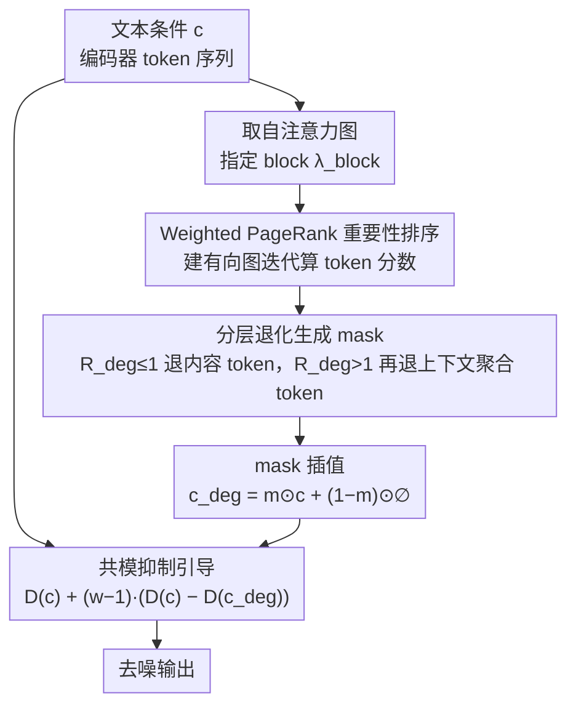

# Guiding Diffusion Models with Semantically Degraded Conditions

**会议**: CVPR2026  
**arXiv**: [2603.10780](https://arxiv.org/abs/2603.10780)  
**代码**: [Ming-321/Classifier-Degradation-Guidance](https://github.com/Ming-321/Classifier-Degradation-Guidance)  
**领域**: 图像生成  
**关键词**: Classifier-Free Guidance, 条件退化引导, 文本到图像, 扩散模型, 组合生成

## 一句话总结

提出 Condition-Degradation Guidance (CDG)，用语义退化的条件 $\boldsymbol{c}_{\text{deg}}$ 替代 CFG 中的空提示 $\emptyset$，将引导从粗粒度"好 vs. 空"转变为细粒度"好 vs. 差一点"的对比，通过分层退化策略（先退化内容 token 再退化上下文聚合 token）构建自适应负样本，在 SD3/FLUX/Qwen-Image 等模型上即插即用地提升组合生成精度，几乎零额外开销。

## 研究背景与动机

**CFG 的核心地位与局限**：Classifier-Free Guidance (CFG) 是现代文本到图像模型的基石，但其依赖语义空洞的空提示 $\emptyset$，在复杂组合任务（文字渲染、属性绑定、空间关系）中表现不佳。

**引导信号的几何纠缠**：$\boldsymbol{c}$ 与 $\emptyset$ 之间语义差距过大，导致引导信号在去噪主方向上产生干扰分量，混合了内容生成与风格/结构信息。

**现有改进的局限**：过程纠正类方法（APG、TCFG）保留 $\boldsymbol{c}$ vs. $\emptyset$ 做事后修正，治标不治本；负样本改造类方法（弱模型、随机扰动、VLM 生成负样本）要么语义盲目，要么需要额外模型。

**关键直觉**：语义相近的对比 $\boldsymbol{c}$ vs. $\boldsymbol{c}_{\text{deg}}$ 可实现"共模抑制"——消去共享的去噪分量，留下纯语义修正信号。

**Token 的功能二分性**：Transformer 文本编码器中的 token 自然分为**内容 token**（编码对象语义）和**上下文聚合 token**（padding/特殊 token，通过注意力吸收全局上下文），这一结构可指导退化策略设计。

**轻量即插即用需求**：实际应用需要无需训练、无需外部模型、计算开销可忽略的引导改进方案。

## 方法详解

### 整体框架

CDG 将 CFG 公式中的空提示 $\emptyset$ 替换为语义退化的条件 $\boldsymbol{c}_{\text{deg}}$：

$$D_\theta^{\text{CDG}}(\boldsymbol{x}_\sigma;\sigma,\boldsymbol{c}) = D_\theta(\boldsymbol{x}_\sigma;\sigma,\boldsymbol{c}) + (w-1)\big(D_\theta(\boldsymbol{x}_\sigma;\sigma,\boldsymbol{c}) - D_\theta(\boldsymbol{x}_\sigma;\sigma,\boldsymbol{c}_{\text{deg}})\big)$$

构建 $\boldsymbol{c}_{\text{deg}}$ 的流程：① 从指定 Transformer block $\lambda_{\text{block}}$ 提取自注意力图 → ② 建图并用 Weighted PageRank (WPR) 计算 token 重要性 → ③ 按分层退化策略生成二值 mask → ④ 对原条件与空条件做 mask 插值（masked interpolation）得到 $\boldsymbol{c}_{\text{deg}}$，再代回上式做引导。

### 关键设计

**1. 分层退化：先退内容 token、再退上下文聚合 token**

要造一个「差一点」而非「完全空白」的负样本，得知道退化哪些 token、退多少。作者发现 Transformer 文本编码器里的 token 天然二分：内容 token（如 "minecraft"、"cooking"）编码对象语义，上下文聚合 token（padding、特殊 token）通过注意力吸收全局上下文——WPR 分析证实前者的重要性得分远高于后者。基于此，CDG 用一个统一退化比 $R_{\text{deg}} \in [0,2]$ 控制：$r_{\text{content}} = \min(R_{\text{deg}}, 1.0)$、$r_{\text{CtxAgg}} = \max(R_{\text{deg}}-1.0, 0)$，即 $R_{\text{deg}} \le 1$ 时只退化内容 token（细粒度语义），$R_{\text{deg}} > 1$ 时才继续退化上下文聚合 token（粗粒度语义）。退化通过 mask 插值实现 $\boldsymbol{c}_{\text{deg}} = \boldsymbol{m} \odot \boldsymbol{c} + (1-\boldsymbol{m}) \odot \emptyset$，且 mask 只在第一步去噪计算一次、后续复用，开销可忽略。

**2. Weighted PageRank 重要性排序：给 token 退化提供确定性依据**

要按重要性挑选退化哪些 token，需要一个可复现的排序。CDG 把自注意力图建成有向图（token 为节点、注意力权重为边权），用 WPR 迭代 $\boldsymbol{s}^{(k+1)} = \frac{A^T\boldsymbol{s}^{(k)}}{\|A^T\boldsymbol{s}^{(k)}\|_1}$ 收敛得到 token 重要性排序。值得一提的是默认配置 $R_{\text{deg}}=1.0$ 时所有内容 token 都被退化、无需真正跑 WPR，从而实现近零额外开销——WPR 主要是为非默认退化比例提供确定性、并解释 $R_{\text{deg}}=1.0$ 这个边界。

**3. 共模抑制的几何解释：为什么「好 vs. 差一点」干扰更小**

CDG 凭直觉说更好，但需要可量化的依据。作者基于流形假设，用 SVD 从 MS-COCO 提示的条件预测中近似去噪主子空间 $\mathcal{S}_{\boldsymbol{c}}(t)$，并定义两个度量：Geometric Decoupling $\text{Decoupling}(\mathcal{S}_g, \mathcal{S}_c) = \frac{1}{k}\sum_{i=1}^k \sin^2(\theta_i)$ 衡量引导信号与去噪主子空间的正交性（趋近 1 即近乎正交），Interference Energy Ratio $\text{Interference}(\Delta\boldsymbol{\varepsilon}) = \frac{\|P_{\mathcal{S}_c(t)}\Delta\boldsymbol{\varepsilon}\|_F^2}{\|\Delta\boldsymbol{\varepsilon}\|_F^2}$ 衡量引导信号落在去噪子空间里的能量占比（越低干扰越小）。测下来 CDG 全程保持近乎完美的正交、干扰能量极低，而 CFG 在早期严重纠缠、大量能量浪费在错位方向。根因在于 $\boldsymbol{c}$ 与 $\boldsymbol{c}_{\text{deg}}$ 是语义邻居、共享相似法方向分量，差分 $\Delta\boldsymbol{\varepsilon}_{\text{CDG}} \propto \nabla_{z_t}\log\frac{p_t(z_t|\boldsymbol{c})}{p_t(z_t|\boldsymbol{c}_{\text{deg}})}$ 自然消去共享分量、只留纯语义修正信号——这正是 $\boldsymbol{c}$ 与语义过远的 $\emptyset$ 做不到的「共模抑制」。

## 实验

### 主实验（MS-COCO 2017 验证集）

| 模型 | 方法 | FID ↓ | CLIP Score ↑ | Aesthetic ↑ | VQA Score ↑ |
|------|------|-------|-------------|------------|------------|
| SD3 | CFG | 35.69 | 31.73 | 5.66 | 91.44 |
| SD3 | CDG | **34.05** | **32.00** | **5.70** | **92.40** |
| SD3 | CADS | 36.16 | 31.72 | 5.65 | 91.44 |
| SD3 | PAG | 50.60 | 30.15 | 5.52 | 81.27 |
| SD3.5 | CFG | 34.56 | 31.85 | 6.21 | 91.94 |
| SD3.5 | **CDG** | **33.07** | **31.96** | **6.26** | **92.61** |
| FLUX.1 | CFG | 38.55 | 31.20 | 6.06 | 90.31 |
| FLUX.1 | **CDG** | **37.11** | **31.21** | **6.15** | **90.62** |
| Qwen | CFG | 42.45 | 32.11 | 2.57 | 93.66 |
| Qwen | **CDG** | **39.02** | **32.31** | 2.54 | **93.93** |

### GenAI-Bench 组合推理

| 模型 | 方法 | Spatial ↑ | Comp ↑ | Differ ↑ | Univ ↑ |
|------|------|----------|--------|---------|--------|
| SD3.5 | CFG | 79.66 | 73.70 | 75.10 | 72.21 |
| SD3.5 | **CDG** | **80.69** | **76.06** | **78.74** | **73.13** |

CDG 在 Differentiation (+3.64) 和 Comparison (+2.36) 上提升最为显著，说明"好 vs. 差一点"范式在需要精细语义区分的任务上优势最大。FLUX.1 上提升较温和，与其使用 Guidance Distillation 一致。

### 消融实验

- **分层退化是核心驱动**：分层变体 VQA 比非分层高 5.9–12.2 分、FID 低 0.9–16.8 分。
- **WPR 非必要但提供理论支撑**：分层框架内 WPR 排序与随机排序性能相当（FID 33.89 vs. 34.17），WPR 主要提供确定性和 $R_{\text{deg}}=1.0$ 边界的解释。
- **$R_{\text{deg}}$ 的不对称响应**：[0,1] 区间指标急剧变化（内容 token 退化），[1,2] 区间较平缓（上下文聚合 token 退化），印证功能二分假设。
- **消融实验设计**：WPR 排序 vs. 随机排序 vs. 反向排序 vs. 分层 vs. 非分层，系统性对比各组件贡献。
- **计算效率**：逐步 WPR 开销 +47.2%，一次性计算 +3.6%，默认 $R_{\text{deg}}=1.0$ 时近零开销（跳过 WPR）。

### 关键发现

- FLUX.1 上提升较小，因为其使用了 Guidance Distillation，降低了推理时引导的依赖度，进一步说明 CDG 的收益与模型对引导信号的依赖程度正相关。
- Qwen-Image 用 `<|im_end|>` 而非 padding 作为上下文聚合器，CDG 仍然有效，验证了分层退化策略对不同 token 类型架构的泛化性。
- CDG 在 Differentiation 和 Comparison 等需要精细语义区分的任务上提升最大，与"好 vs. 差一点"对比范式的设计初衷一致。
- CDG 可与 PAG 等正交方法组合使用，也兼容 image-to-image 和 ControlNet 等下游应用。

## 亮点

- 揭示 Transformer 文本编码器中 content token 与 context-aggregating token 的功能二分性，为引导信号设计提供理论基础
- 通过几何分析（Decoupling、Interference Energy）给出了 CDG 优于 CFG 的直观且可量化的解释
- 即插即用、无需训练、无需外部模型，默认配置下几乎零开销，实际部署友好
- 跨四种不同架构（SD3、SD3.5、FLUX.1、Qwen-Image）一致提升，验证方法的通用性
- $R_{\text{deg}}$ 提供了可解释的连续控制空间：[0,1] 控制细粒度语义，[1,2] 控制粗粒度上下文
- 消融实验设计巧妙，CFG* 实验直接可视化了退化条件的语义残留，增强了方法的可解释性
- 与 PAG 等方法正交可组合，支持 img2img 和 ControlNet 等扩展场景

## 局限性

- 在已使用 Guidance Distillation 的模型（如 FLUX.1）上提升有限，说明方法对推理时引导依赖度低的模型效果受限
- $R_{\text{deg}}$ 的最优值在不同模型间可能需要微调，虽然默认 1.0 在多数情况下表现良好
- 方法假设文本编码器内存在清晰的 content/context-aggregating 二分性，对于特殊编码器架构的适用性待验证
- 缺少对超长/超复杂提示的系统性评估
- CFG* 验证实验主要为定性分析，缺少更严格的理论证明来阐明共模抑制的充分条件
- 仅在 Transformer-based 扩散模型上验证，对 UNet 架构的适用性未讨论

## 相关工作

- **CFG 框架改进**：APG（几何校正，将引导信号投影到与去噪方向正交的子空间）、TCFG（SVD 分解去噪信号），均保留空提示但做事后修正，不解决根本语义贫乏问题
- **模型级负样本**：Autoguidance 使用弱模型提供负信号、Weak-to-Strong Diffusion 利用反射机制，均需维护额外模型，部署成本高
- **内部机制级**：PAG（扰动自注意力矩阵）、SEG（平滑能量曲率），操作模型计算流而非输入，与 CDG 正交可组合使用
- **输入级退化**：ICG（随机提示替换）、CADS（非结构化高斯噪声）、SFG（空间变化负样本）、DNP（VLM 生成负样本），这些方法要么语义盲目要么需昂贵外部模型，均未利用提示自身 token 嵌入的内在语义结构
- **CDG 的独特定位**：首次利用文本编码器中 content/context-aggregating token 的功能二分性，在输入级实现自适应语义退化，兼具理论解释力与实用轻量性

## 评分

- 新颖性: ⭐⭐⭐⭐ — 从 token 功能二分性出发设计语义退化策略，视角新颖；"好 vs. 差一点"的引导范式转变具有启发性
- 实验充分度: ⭐⭐⭐⭐⭐ — 四种模型、多指标、GenAI-Bench 组合推理、详尽消融与几何分析，CFG* 验证实验设计精巧
- 写作质量: ⭐⭐⭐⭐ — 结构清晰，几何直觉解释到位，公式推导与实验呼应良好
- 价值: ⭐⭐⭐⭐ — 即插即用的实用方案，对 CFG 的原理性改进，对社区有直接应用价值

<!-- RELATED:START -->

## 相关论文

- [\[CVPR 2026\] Exploring Conditions for Diffusion Models in Robotic Control](exploring_conditions_for_diffusion_models_in_robotic_control.md)
- [\[CVPR 2026\] Guiding Diffusion Models with Fine-Grained Conditions and Semantics-Preserving Sampling for One-Shot Federated Learning](guiding_diffusion_models_with_fine-grained_conditions_and_semantics-preserving_s.md)
- [\[CVPR 2026\] Guiding Token-Sparse Diffusion Models](guiding_token-sparse_diffusion_models.md)
- [\[CVPR 2026\] GenErase: Generalizable and Semantically-Aware Concept Erasure in Diffusion Models](generase_generalizable_and_semantically-aware_concept_erasure_in_diffusion_model.md)
- [\[CVPR 2026\] Guiding a Diffusion Transformer with the Internal Dynamics of Itself](guiding_a_diffusion_transformer_with_the_internal_dynamics_of_itself.md)

<!-- RELATED:END -->
