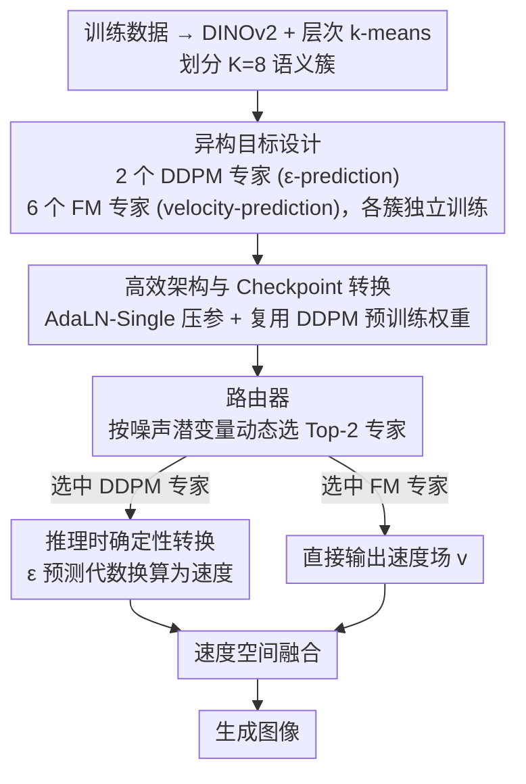

# Heterogeneous Decentralized Diffusion Models

**会议**: CVPR2026  
**arXiv**: [2603.06741](https://arxiv.org/abs/2603.06741)  
**代码**: 待确认  
**领域**: 图像生成  
**关键词**: 去中心化扩散模型, 异构训练目标, DDPM, Flow Matching, 专家混合, DiT, PixArt-α

## 一句话总结

提出异构去中心化扩散框架，允许不同专家使用不同扩散目标（DDPM ε-prediction 与 Flow Matching velocity-prediction）完全独立训练，在推理时通过确定性 schedule-aware 转换统一到速度空间进行融合，相比同构基线同时提升 FID 和生成多样性，并将计算量压缩 16 倍。

## 背景与动机

1. **计算门槛高**：前沿扩散模型训练需要大规模紧耦合集群（如数百 GPU-days），将参与权限限制在资源充足的机构
2. **先前去中心化方案的局限**：DDM (McAllister et al.) 证明了独立训练专家再组合的可行性，但要求所有专家使用同构训练目标，且需 1176 GPU-days + 158M 图像
3. **真实去中心化场景的异构性**：不同贡献者拥有不同资源、偏好与技术约束，强制统一训练目标不切实际
4. **不同目标的互补特性**：ε-prediction 在低噪声时步隐式加权更强（擅长细节保持），velocity-prediction 在高噪声时步加权更强（擅长全局结构），二者天然互补
5. **预训练权重利用不足**：大量已有 DDPM 预训练 checkpoint 未能被直接复用于 Flow Matching 训练
6. **架构冗余**：标准 DiT 的逐层 AdaLN 引入大量参数，PixArt-α 的 AdaLN-Single 可在保持质量的同时减少 30% 参数

## 方法详解

### 整体框架

这篇论文要解决的是「去中心化训练前沿扩散模型」时贡献者资源与偏好各异、被迫统一训练目标不现实的问题。它先用 DINOv2 特征 + 层次化 k-means 把数据集划成 K=8 个语义簇（如人像、风景、建筑），每个专家在各自簇上完全独立训练、无需任何梯度/参数/激活同步；推理时由一个路由器网络 $p_\phi(k|x_t,t)$ 动态选择并融合专家预测。关键突破是允许不同专家用不同扩散目标（DDPM 的 ε-prediction 与 Flow Matching 的 velocity-prediction），再在推理时确定性地统一到速度空间融合。

### 关键设计

**1. 异构目标设计：让 DDPM 与 Flow Matching 专家各训各的**

强制所有专家用同一目标不符合真实去中心化场景，且白白浪费已有的 DDPM 预训练 checkpoint。作者放开这一约束：2 个 DDPM 专家预测噪声 $\epsilon$、用 cosine 噪声调度，损失 $\mathcal{L}_{\text{DDPM}}^{(k)} = \mathbb{E}[\|\epsilon_{\theta_k}(\alpha_t x_0 + \sigma_t \epsilon, t) - \epsilon\|^2]$；6 个 Flow Matching 专家预测速度场 $v$、用线性插值 $x_t = (1-t)x_0 + t\epsilon$，损失 $\mathcal{L}_{\text{FM}}^{(k)} = \mathbb{E}[\|v_{\theta_k}(x_t, t) - (\epsilon - x_0)\|^2]$。分配上把 DDPM 给了包含高保真主体（如汽车、花卉）的簇 0 和簇 3，让擅长细节保持的目标对上最需要细节的数据。

**2. 推理时确定性转换：把 ε 预测代数地换算成速度、零重训练融合**

DDPM 专家输出的是 $\epsilon_\theta$，要和 FM 专家在速度空间融合就得换算。作者先由 $\epsilon_\theta$ 估计干净样本 $\hat{x}_0 = (x_t - \sigma_t \epsilon_\theta) / \alpha_t$，对线性插值 schedule（$\alpha_t=1-t, \sigma_t=t$）转换公式简化为 $v(x_t,t) = \epsilon_\theta(x_t,t) - \hat{x}_0$。为数值稳定，$\hat{x}_0$ 钳位到 $[-20, 20]$、$\alpha_{\text{safe}} = \max(\alpha_t, 0.01)$，高噪声 $t>0.85$ 时再加自适应速度缩放。整个转换是纯代数操作，无需任何重训练就能把异构专家拉到同一空间融合。

**3. 隐式时步加权互补性：从理论解释异构为何更好**

异构不只是工程妥协，作者证明它有互补性的理论根。把两种目标的损失都写成干净样本估计误差的加权形式后，ε-prediction 权重为 $w_\epsilon(t) = \alpha_t^2 / \sigma_t^2$、v-prediction 权重为 $w_v(t) = 1 / \sigma_t^2$，比值 $w_v / w_\epsilon = 1/\alpha_t^2 \geq 1$ 在高噪声时步趋于无穷。这意味着 velocity-prediction 在高噪声时步获得更强梯度、关注全局结构，ε-prediction 在低噪声时步相对更强、关注局部细节，二者天然互补——这正是异构方案能同时提升 FID 和多样性的根因。

**4. 高效架构与 Checkpoint 转换：压参数、复用已有预训练权重**

标准 DiT 的逐层 AdaLN 参数冗余，且大量已有 DDPM checkpoint 没被复用。作者采用 PixArt-α 的 AdaLN-Single：用一个全局 MLP 一次性算出所有层的调制参数 $\mathbf{c} \in \mathbb{R}^{6Ld}$，再加 per-block 可学习嵌入 $\mathbf{E}_b$，把 DiT-XL/2 参数从 891M 降到 605M。同时支持从 ImageNet DDPM DiT 权重出发做 checkpoint 转换：保留 patch / positional embedding 和 transformer blocks，只重初始化 final layer 和 text projection，运行时把 FM 的连续时步 $t \in [0,1]$ 映射为 $t_{\text{DiT}} = \text{round}(999t)$，收敛加速 1.2×。

**5. 路由器：按噪声潜变量在推理时动态挑专家**

异构专家训练好后，推理时得有人决定用谁、怎么融合。路由器是一个 DiT-B/2（129M 参数、12 层 Transformer），输入噪声潜变量 $x_t$ 和时步 $t$（不使用文本条件），在全数据集 + 真实簇标签上用交叉熵训练 25 个 epoch，推理时支持 Top-1 / Top-K / Full Ensemble 三种模式——实验中以 Top-2 最优。

## 实验关键数据

### 去中心化 vs 单体训练（DiT-B/2, LAION-Art 3.9M）

| 推理策略 | FID-50K ↓ |
|---------|-----------|
| 单体模型 | 29.64 |
| Top-1 | 30.60 |
| **Top-2** | **22.60** |
| Full Ensemble | 47.89 |

Top-2 专家选择比单体模型 FID 提升 23.7%，Full Ensemble 反而退化。

### 资源效率对比（DiT-XL/2）

| 方法 | 数据量 | 计算量 | FID-50K ↓ |
|------|-------|--------|-----------|
| DDM (先前工作) | 158M | 1176 A100-days | 5.5–10.5 |
| Ours 同构 (8FM) | 11M | 72 A100-days | 12.45 |
| **Ours 异构 (2DDPM:6FM)** | **11M** | **72 A100-days** | **11.88** |

计算量减少 **16×**，数据量减少 **14×**。

### 同构 vs 异构对比（对齐推理设置 CFG=7.5, 50 steps）

| 模型 | FID-50K ↓ | Intra-prompt LPIPS ↑ |
|------|-----------|---------------------|
| 同构 8FM | 12.45 | 0.617 (±0.074) |
| **异构 2DDPM:6FM** | **11.88** | **0.631 (±0.078)** |

异构方案同时提升质量（FID）和多样性（LPIPS）。

### 消融：DDPM→FM 转换与混合采样

| 采样方式 | LPIPS ↑ | FID ↓ | CLIP ↑ |
|---------|---------|-------|--------|
| 原生 DDPM | 0.787 | 27.04 | 0.316 |
| 原生 FM | 0.752 | 20.23 | 0.324 |
| DDPM→FM 转换 | 0.761 | 25.61 | 0.319 |
| 混合（同 schedule） | 0.782 | 32.67 | 0.312 |

DDPM→FM 转换在不重训练的情况下有效提升 DDPM 质量（FID 27.04→25.61）；混合采样显著提升多样性但牺牲部分 FID。

### 消融：路由阈值

阈值 0.2 达到最优 FID（38.28），阈值 0.5 达到最高多样性（LPIPS），呈现质量-多样性权衡。

## 亮点

1. **真正的异构去中心化**：首次支持不同专家使用不同扩散目标独立训练，突破了先前 DDM 要求同构目标的限制
2. **优雅的推理时统一**：基于 schedule-aware 代数转换将 ε-prediction 确定性地映射到 velocity space，无需重训练
3. **理论基础扎实**：通过 Proposition 1 严格证明了 ε/v-prediction 在时步加权上的互补性，为异构设计提供理论支撑
4. **极大幅度降低资源门槛**：16× 计算压缩 + 14× 数据压缩，单专家仅需 20-48GB VRAM
5. **同时提升质量和多样性**：异构方案相比同构基线在 FID 和 LPIPS 上均有改善

## 局限与展望

1. **目标比例未充分探索**：仅评估了少数 DDPM:FM 比例（如 2:6），最优分配依赖数据分布和下游需求
2. **转换数值稳定性依赖手工调参**：高噪声时步的 clamping、safe denominator、adaptive scaling 均为手动设计
3. **仅限两种目标族**：未涉及 $x_0$-prediction、consistency objectives 等其他参数化形式
4. **路由器不支持动态专家增减**：添加/移除专家需重训练路由器
5. **分辨率限制**：实验仅在 256×256 上进行，未验证高分辨率场景
6. **绝对 FID 与先前工作不可直接比较**：DDM 在大 10 倍以上的训练规模下达到 5.5-10.5 FID

## 与相关工作的对比

| 方法 | 核心差异 |
|------|---------|
| DDM (McAllister 2025) | 要求同构目标 + 1176 GPU-days；本文支持异构 + 72 GPU-days |
| Diff2Flow (Schusterbauer 2025) | 单模型 DDPM→FM 微调转换；本文为多专家无训练推理时转换 |
| PixArt-α (Chen 2024) | 提出 AdaLN-Single 用于单体高效训练；本文将其应用于去中心化多专家场景 |
| DiT (Peebles 2023) | 基础 Transformer 扩散架构；本文在其上加入异构目标 + checkpoint 转换 |
| DistriFusion (Li 2024) | 分布式并行推理（patch 并行）；本文聚焦去中心化训练 |
| VDM (Kingma 2021) | 统一变分框架分析不同预测目标的隐式加权；本文利用其理论支撑异构互补性 |

## 评分

- 新颖性: ⭐⭐⭐⭐ — 异构目标的去中心化扩散训练是新颖的方向，推理时代数转换简洁优雅
- 实验充分度: ⭐⭐⭐⭐ — 包含多尺度模型对比、消融分析、路由阈值分析和大量定性结果，但缺少高分辨率和更多目标比例的探索
- 写作质量: ⭐⭐⭐⭐ — 结构清晰，理论推导完整，符号一致
- 价值: ⭐⭐⭐⭐ — 大幅降低去中心化扩散训练门槛，为社区驱动的模型开发提供可行路径

<!-- RELATED:START -->

## 相关论文

- [\[CVPR 2025\] Decentralized Diffusion Models](../../CVPR2025/image_generation/decentralized_diffusion_models.md)
- [\[ICLR 2026\] Bridging Generalization Gap of Heterogeneous Federated Clients Using Generative Models](../../ICLR2026/image_generation/bridging_generalization_gap_of_heterogeneous_federated_clients_using_generative_.md)
- [\[CVPR 2026\] Fusion in Your Way: Aligning Image Fusion with Heterogeneous Demands via Direct Preference Optimization](fusion_in_your_way_aligning_image_fusion_with_heterogeneous_demands_via_direct_p.md)
- [\[ICML 2026\] Compositional Generative Modeling from Decentralized Data](../../ICML2026/image_generation/compositional_generative_modeling_from_decentralized_data.md)
- [\[CVPR 2026\] Guiding Diffusion Models with Semantically Degraded Conditions](guiding_diffusion_models_with_semantically_degraded_conditions.md)

<!-- RELATED:END -->
