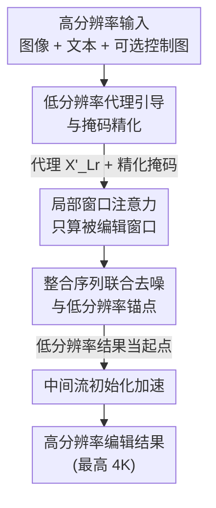

# HierEdit: Region-Aware Hierarchical Diffusion for Efficient High-Resolution Editing

**会议**: CVPR 2026  
**论文**: [CVF Open Access](https://openaccess.thecvf.com/content/CVPR2026/html/Zhang_HierEdit_Region-Aware_Hierarchical_Diffusion_for_Efficient_High-Resolution_Editing_CVPR_2026_paper.html)  
**代码**: 待确认（论文提供 Project Page）  
**领域**: 扩散模型 / 图像编辑  
**关键词**: 高分辨率编辑, 局部窗口注意力, 层级扩散, 低分辨率代理, 推理加速

## 一句话总结
HierEdit 用"低分辨率先编辑、再把改动搬回高分辨率"的层级思路，只对被编辑的局部窗口做稀疏注意力，从而在 **不需要任何 4K 训练数据** 的情况下实现 4K 局部编辑，并在 1K 分辨率上比现有方法快 6 倍以上。

## 研究背景与动机
**领域现状**：基于扩散 Transformer（DiT / MMDiT）的图文编辑器（FLUX、GPT-Image-1、Gemini 等）已能在 1K×1K 附近做出高保真编辑，是当前可控生成的主力骨干。

**现有痛点**：这些模型的自注意力计算量随分辨率 **二次增长**（$O(N^2)$，$N=H\cdot W$ 为 token 数），导致它们大多被卡在 1K 以下，无法满足数字广告、影视、高保真可视化等需要 4K 输出的专业场景。更糟的是，多数实际需求是 **局部编辑**（"删掉最右边的人""把苹果换成橙子"），可现有做法要么把整张图重渲染、把算力浪费在没动过的区域，要么走 inpainting、忽略与外部区域的交互而产生边界伪影。

**核心矛盾**：真正的难点不只是"把分辨率撑上去"，而是 **如何让局部编辑既高效又保持全局一致**——既不想为一处小改动付整张图 dense attention 的代价，也不想因为切块独立处理而丢掉全局语义连贯性；同时还被"高分辨率训练数据稀缺"卡着脖子。

**本文目标**：在不采集 4K 训练数据、不做全分辨率注意力的前提下，实现快速、高保真、可一直放大到 4K 的局部编辑。

**切入角度**：作者观察到——既然要改的只是局部，那就先在一张廉价的低分辨率代理图上完成"语义层面的编辑"，由它同时充当 ①语义参考、②精确定位改动区域的掩码、③可跳过早期去噪步的中间初始化；高分辨率分支则只对被掩码命中的局部窗口做稀疏注意力。

**核心 idea**：用"低分辨率代理引导 + 仅对编辑窗口做局部稀疏注意力"把计算量与图像分辨率解耦，让 4K 编辑变得可行。

## 方法详解

### 整体框架
HierEdit 接收一张高分辨率图像 $X_{Hr}$、一段文本提示，以及可选的控制图 $X_{Control}$。它先把 $X_{Hr}$ 下采样成低分辨率代理 $X_{Lr}$（如 1K→256），用一个现成的 SOTA 编辑模型（FLUX）在代理上完成编辑，得到 $X'_{Lr}$；把 $X'_{Lr}$ 与 $X_{Lr}$ 逐像素对比，得到一张精化掩码 $\tilde{M}$ 精确圈出真正被改动的区域。随后进入核心的 **Local-Window MMDiT**：它只对掩码命中的局部窗口做稀疏注意力，把未改动区域当作"条件 token"复用、把编辑过的低分辨率图当作"全局锚点"维持语义连贯。最后通过 **中间流初始化** 把低分辨率结果当作高分辨率采样的起点，跳过早期去噪步进一步提速。整条管线最关键的特性是：**计算量正比于被编辑窗口数，而非整图分辨率**，所以从 1K 到 4K 几乎线性放大。

### 关键设计

**1. 低分辨率代理引导与掩码精化：先在廉价小图上"想好怎么改"**

直接在高分辨率上编辑既贵又难定位改动区域，而用户给的框选掩码 $M$ 对反射、阴影、遮挡这类复杂效果往往不准。HierEdit 把高分辨率输入下采样到很小的代理 $X_{Lr}$（如 256×256），让现成编辑模型在代理上完成文本/多模态条件编辑，得到 $X'_{Lr}$。这张代理图一举三用：提供 **语义指导**、提供 **精化掩码**、以及后续 **跳过早期去噪步的中间初始化**。精化掩码的得到方式是逐像素比较 $X'_{Lr}$ 与 $X_{Lr}$，把真正发生变化的像素（包括阴影、反射等用户难以手动框出的连带区域）自动纳入 $\tilde{M}$。这一步把"该改哪里、改成什么样"的语义决策放在算力极低的小图上完成，为高分辨率分支铺好了精确的作业范围，也是后续一切加速的前提。

**2. 局部窗口注意力：把二次注意力压成正比于编辑面积的稀疏注意力**

DiT 的全局自注意力是 $O(N^2)$，分辨率一上去就不可承受。HierEdit 把高分辨率隐空间 $X\in\mathbb{R}^{H\times W}$ 切成不重叠的窗口 $x_i$，窗口边长 $l$ 受预训练分辨率（如 1024）约束，共 $\frac{H}{l}\times\frac{W}{l}$ 个窗口，注意力只在每个窗口内部计算，复杂度降到 $O\!\left(\frac{H}{l}\cdot\frac{W}{l}\cdot (l^2)^2\right)=O(N\cdot l^2)$。论文给的直观数字是：从 1024×1024 放大到 4096×4096，计算量减少 256×。实践中取 $l=16$（对应原图 256 像素），窗口太小虽快但会让 GPU kernel 利用率不足。更关键的是——**实际只对被掩码命中的窗口算注意力**，所以运行时随"待编辑窗口数"线性增长，这正是计算量与分辨率解耦的来源。为避免不重叠切块带来的块状伪影，每个窗口被允许额外注意相邻窗口的边界 token，在不破坏线性复杂度的前提下让窗口间有信息流动。又因为每个局部窗口都落在预训练支持的固定位置编码范围内，模型能可靠地在块内生成内容，从而天然支持超高分辨率合成。

**3. 整合序列联合去噪与低分辨率锚点：复用未改区域 + 用小图守住全局语义**

切块独立去噪会双双带来两个问题：序列拼接撑爆显存、以及局部窗口各自为政破坏全局连贯。HierEdit 用两招同时化解。其一是 **整合 token 序列**：把未被掩码的源图区域 $C_{mask=0}$ 当作 **静态条件 token**（不参与去噪），把被掩码区域 $X_{noise}^{mask=1}$ 当作噪声 token，拼成单一序列 $X_{integrated}=[\,C_{mask=0};\,X_{noise}^{mask=1}\,]$，长度被压回单张图的量级，避免了"源图+噪声"朴素拼接导致的序列翻倍、显存翻四倍。由于条件 token 在各扩散步保持不变，它们的 Key/Value 投影只需前向一次即可缓存复用（**Feature Caching**），显著加速；为防噪声污染，条件 token 只对条件 token 做注意力，不与噪声 token 或文本 token 交互。整套机制不改架构、直接复用预训练 DiT 权重，**只微调轻量 LoRA** 适配新的条件方式。其二是 **低分辨率锚点**：把已编辑的低分辨率图 $X'_{Lr}\in\mathbb{R}^{h\times w}$ 作为承载整体上下文与空间布局的全局锚点，用缩放比 $\rho=\frac{H}{h}$（经验取 4）把低分辨率坐标映射到高分辨率空间 $(\tilde m,\tilde n)=(\rho m,\rho n)$，再把锚点、控制图等拼进统一序列 $[C_T, X_{integrated}, X'_{Lr}, X_{control}, \dots]$ 一起处理。作者的观察是：长程依赖主要决定全局结构与布局，细粒度细节则靠局部交互——所以用低分辨率锚点补上局部窗口缺失的全局语义恰到好处。训练用标准 flow-matching loss，只是教模型适应这套新注意力模式，因而 ①只更新少量 LoRA 参数、②只用 1K 商用分辨率数据、③因局部窗口注意力聚焦在预训练尺寸的块上而 **天然分辨率无关**，可无缝外推到 4K。

**4. 中间流初始化：用低分辨率结果当起点，跳过早期去噪步**

高分辨率生成若从纯高斯噪声从头去噪，前面若干步其实只是在重建低频结构——而低频结构低分辨率代理已经有了，两者只差高频细节。于是 HierEdit 把低分辨率参考放大到目标尺寸、锐化、并加噪到中间时间步 $t$ 得到 $X^t_{ref}$，让高分辨率采样直接从它的带噪变体出发：$X^t_{hr}=\alpha X^1_{hr}+(1-\alpha)X^t_{ref}$，其中 $X^1_{hr}$ 是高斯噪声、$\alpha\in(0,1)$ 是加噪比例。这样早期去噪步被跳过、由代理提供的低频成分接管，去噪步数从 $T{=}28$ 降到 $T'{=}10$，进一步减少冗余计算。

### 损失函数 / 训练策略
训练使用标准的 flow-matching（rectified flow）损失，目标只是让模型学会新的注意力模式，而非重训生成能力。整体只微调注意力投影层上的轻量 LoRA 模块，骨干 DiT 权重冻结；适配数据仅为 1K 商用分辨率，无需任何 4K 高分辨率训练数据。

## 实验关键数据

### 主实验
指令编辑对比（Table 1）：HierEdit 在四个 benchmark 上全面追平 FLUX.1 Kontext 等强基线，同时换来后文的大幅提速。

| 任务 | 方法 | CompBench CLIP↑ | CompBench SSIM↑ | EmuEdit CLIPdir↑ | EmuEdit DINO↑ | ImgEdit Composite↑ | I2EBench SSIM↑ |
|------|------|------|------|------|------|------|------|
| 文本引导编辑 | SDEdit | 18.5 | 0.351 | 0.053 | 0.159 | 1.46 | 0.355 |
| | FLUX.1 Kontext | 20.8 | 0.954 | 0.116 | 0.840 | 3.45 | 0.501 |
| | GPT-Image-1 | 18.9 | 0.191 | 0.132 | 0.697 | 4.45 | 0.478 |
| | **Ours** | 20.6 | 0.949 | 0.117 | 0.833 | 3.51 | **0.508** |

inpainting 编辑对比（Table 2，1K×1K）：在保真度（FID/PSNR/CLIP）持平或更好的同时，HierEdit 的延迟与每步耗时均最低。

| 任务 | 方法 | FID↓ | PSNR↑ | CLIP-T↑ | CLIP-I↑ | Latency↓ | Time/iter↓ |
|------|------|------|------|------|------|------|------|
| 文本引导 inpainting | FLUX-Fill | 56.1 | 19.23 | 0.338 | 0.923 | 21.4s | 0.42s |
| | OminiControl2* | 39.2 | 19.11 | 0.339 | 0.921 | 8.25s | 0.29s |
| | ACE++ | 37.2 | 18.81 | 0.342 | 0.929 | 22.5s | 0.80s |
| | EasyControl | 108.6 | 15.38 | 0.331 | 0.887 | 14.5s | 0.55s |
| | **Ours** | 39.5 | **19.31** | 0.340 | 0.926 | **6.97s** | **0.24s** |

不同编辑比例 / 分辨率下的速度（Table 3，单位秒；"—"为 96GB 显存跑不动）：HierEdit 全配置最快，且因只算改动区域，速度随编辑比例增长而上升，而对手几乎是恒定耗时。

| 编辑比例 | 方法 | 1K | 2K | 3K | 4K |
|------|------|------|------|------|------|
| 25% | OminiControl2 | 5.98 | 21.5 | 63.3 | 155 |
| | FLUX-Fill | 21.4 | 113 | 383 | 1064 |
| | **Ours** | **4.51** | **15.6** | **35.6** | **91.4** |
| 50% | OminiControl2 | 8.47 | 35.8 | 113 | 286 |
| | **Ours** | **6.74** | **19.2** | **55.7** | **173** |
| 75% | OminiControl2 | 11.0 | 53.8 | 164 | 408 |
| | **Ours** | **8.32** | **23.0** | **84.1** | **227** |

### 消融实验
加速组件逐一去除（Table 4，1K、50% 编辑区域；Speed 为相对耗时，越低越快，括号内为相对完整管线的减速倍数）：

| 配置 | Speed↓ | PSNR↑ | CLIP-T↑ | CLIP-I↑ | 说明 |
|------|------|------|------|------|------|
| Ours（完整） | 2.34 | 19.01 | 0.339 | 0.931 | 局部窗口注意力 + 特征缓存 + token 整合全开 |
| −LWA | 4.98（×2.13） | 18.84 | 0.336 | 0.922 | 去掉局部窗口注意力（Flash Sparse Attention kernel），慢 2.13× |
| −LWA−FC | 9.32（×3.98） | 18.96 | 0.338 | 0.923 | 再去掉特征缓存，慢 3.98× |
| −LWA−FC−TI | 29.12（×12.4） | 19.03 | 0.339 | 0.923 | 再去掉条件/噪声 token 整合，慢 12.4× |

### 关键发现
- **局部窗口注意力（LWA）是提速第一引擎**：仅它一项去掉就慢 2.13×，且它正是把 $O(N^2)$ 压成 $O(N\cdot l^2)$ 的关键；三者全去掉则慢到 12.4×，说明特征缓存（FC）与 token 整合（TI）是叠加在 LWA 之上的二、三级加速。
- **保真度几乎不随加速波动**：四个配置的 PSNR/CLIP 都在很窄区间内，说明这套加速是"近乎免费"的——速度大降而质量基本不掉。
- **优势随分辨率与编辑面积放大**：1K 上比对手快约 6×，到 4K 差距进一步拉大（4K/25% 时 91.4s vs FLUX-Fill 1064s）；而且只有 HierEdit 能在 4K 下稳定出图，多数对手要么 OOM（96GB 显存）要么在掩码内生不出内容。
- **掩码精化不可省**：直接用给定 bounding box 会导致 EasyControl 那样的错误阴影等伪影，精化掩码把阴影/反射等连带区域纳入后才能正确编辑。

## 亮点与洞察
- **"先低分辨率想清楚、再高分辨率落地"是个很省的范式**：把语义级编辑决策放在 256 的小图上完成，高分辨率分支退化为"按图施工"，既省算力又自动得到精确掩码和去噪起点，一举三得。
- **计算量与分辨率解耦**：通过"只算被编辑窗口"，运行时正比于改动面积而非整图大小——这让局部小改动在 4K 上几乎和 1K 一样便宜，是真正解锁专业 UHR 工作流的关键。
- **不改架构、只加 LoRA**：所有条件（未改区域、低分辨率锚点、控制图）都以额外 token 进入预训练 DiT 的自注意力，复用原权重，只微调注意力投影上的 LoRA，工程上极易落地、且能借力现成 FLUX 生态。
- **条件 token 的 KV 缓存（Feature Caching）**：未改区域在各扩散步恒定，KV 只算一次后全程复用，是一个可迁移到其它"局部编辑/部分重绘"任务的通用加速 trick。

## 局限与展望
- **强依赖现成低分辨率编辑模型的质量**：整条管线的语义正确性由代理上的 FLUX 编辑决定，若代理编辑本身出错（对象放错、语义偏离），高分辨率分支只会忠实放大这个错误。
- **掩码精化基于像素差**：逐像素比较 $X'_{Lr}$ 与 $X_{Lr}$ 在低对比度或全局风格类编辑下可能定位不准；论文主打局部编辑，对需要处理整图的全局编辑（如换风格）适配性有限。
- **窗口边长与缩放比是经验值**：$l=16$、$\rho=4$ 等为经验设定，在极端长宽比或非常细碎的多区域编辑下是否仍最优，原文未充分讨论 ⚠️ 以原文为准。
- **评测细节在补充材料**：正文未给出 benchmark 的完整指标定义与实现细节（注明见 supplementary），主结果的可复现性需结合补充材料判断。

## 相关工作与启发
- **vs FLUX.1 Kontext / GPT-Image-1（指令编辑）**：它们做整图 dense attention 的强力编辑，HierEdit 在保真度持平的同时把局部编辑提速 6×+，区别在于把"改哪里"交给低分辨率代理、把"算哪里"限制到局部窗口。
- **vs OminiControl2 / ACE++ / FLUX-Fill（inpainting）**：这些方法也试图把计算限制到掩码区域，但依赖用户提供的掩码与预设编辑范围；HierEdit 用低分辨率代理 **自动定位** 可编辑区域并用内容感知的稀疏注意力，无需手工掩码或重训。
- **vs Swin/Longformer 等局部窗口注意力**：它们虽用局部窗口但仍对整图做静态注意力；HierEdit 只对被编辑窗口动态计算，并用低分辨率锚点补回全局语义——把局部窗口架构第一次有效用到了"编辑"而非纯生成上。
- **vs PixArt-Σ / SANA（高分辨率合成）**：它们靠大规模高分辨率预训练或微调撑到近 4K，HierEdit 则 **完全不需要 4K 训练数据**，靠分辨率无关的局部窗口设计外推到 4K。

## 评分
- 新颖性: ⭐⭐⭐⭐ "低分辨率代理三用 + 仅编辑窗口稀疏注意力"的组合很巧，把局部窗口架构成功迁移到编辑场景。
- 实验充分度: ⭐⭐⭐⭐ 四个 benchmark + 多分辨率/编辑比例速度表 + 组件消融较完整，但部分指标定义放在补充材料。
- 写作质量: ⭐⭐⭐⭐ 动机与方法叙述清晰，公式与复杂度推导到位，图示充分。
- 价值: ⭐⭐⭐⭐⭐ 无需 4K 数据即可做 4K 局部编辑且大幅提速，对专业 UHR 工作流有很强实用价值。

<!-- RELATED:START -->

## 相关论文

- [\[CVPR 2026\] Low-Resolution Editing is All You Need for High-Resolution Editing](low-resolution_editing_is_all_you_need_for_high-resolution_editing.md)
- [\[CVPR 2026\] Training-free, Perceptually Consistent Low-Resolution Previews with High-Resolution Image for Efficient Workflows of Diffusion Models](training-free_perceptually_consistent_low-resolution_previews.md)
- [\[CVPR 2026\] SpotEdit: Selective Region Editing in Diffusion Transformers](spotedit_selective_region_editing_in_diffusion_transformers.md)
- [\[CVPR 2026\] Diffusion-Based Makeup Transfer with Facial Region-Aware Makeup Features](diffusion-based_makeup_transfer_with_facial_region-aware_makeup_features.md)
- [\[CVPR 2026\] VINS-120K: Ultra High-Resolution Image Editing with A Large-Scale Dataset](vins-120k_ultra_high-resolution_image_editing_with_a_large-scale_dataset.md)

<!-- RELATED:END -->
