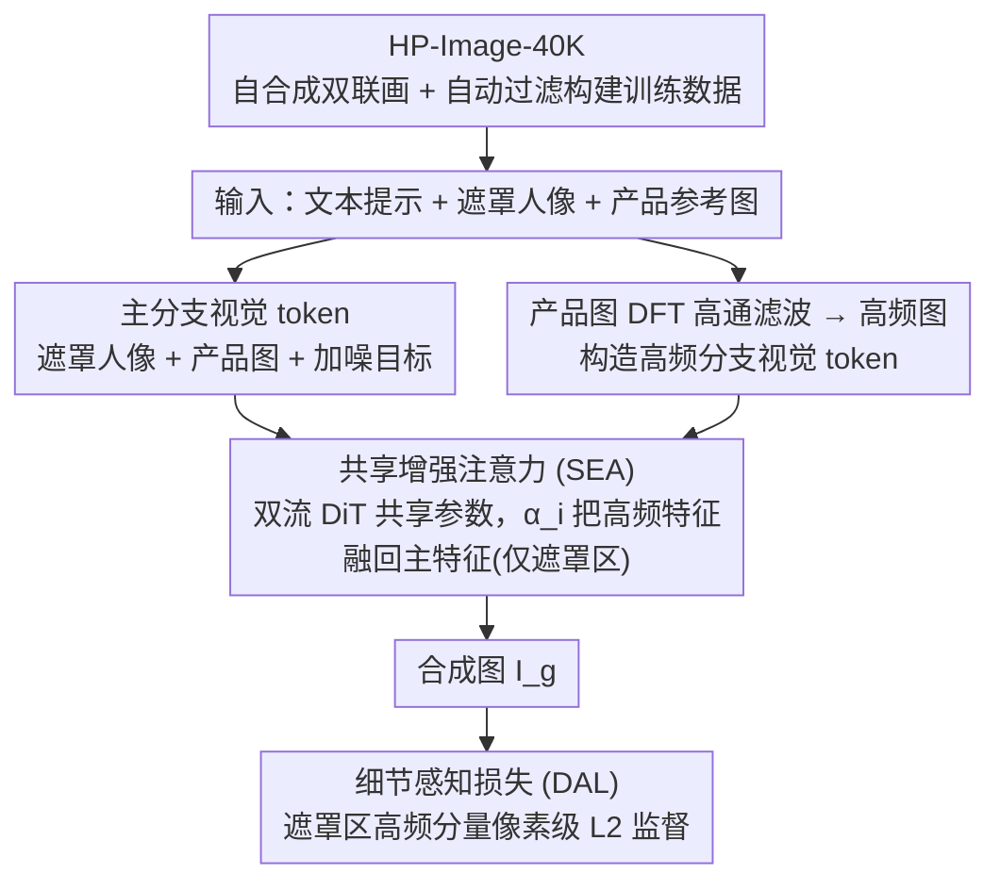

# HiFi-Inpaint: Towards High-Fidelity Reference-Based Inpainting for Generating Detail-Preserving Human-Product Images

**会议**: CVPR 2026  
**arXiv**: [2603.02210](https://arxiv.org/abs/2603.02210)  
**代码**: [项目页面](https://correr-zhou.github.io/HiFi-Inpaint)  
**领域**: 扩散模型/图像生成  
**关键词**: 参考图像修复, 高保真细节保持, 人-产品图像生成, 高频信息引导, DiT

## 一句话总结

提出 HiFi-Inpaint 框架，通过共享增强注意力（SEA）利用高频信息增强产品细节特征，结合细节感知损失（DAL）实现像素级高频监督，在人-产品图像生成中达到 SOTA 的细节保真度。

## 研究背景与动机

人-产品图像（展示人与产品交互的图像）在广告、电商和数字营销中至关重要。生成此类图像的核心挑战是**高保真保持产品细节**——形状、颜色、花纹、文字等必须精准还原，微小偏差会影响消费者信任。

现有方法存在三个局限：

**数据不足**：缺乏大规模、多样化的人-产品图像训练数据

**细节保持弱**：现有模型（如图像定制、文本编辑）侧重全局/高层语义，难以稳健保持细粒度细节；扩散模型的去噪过程倾向于"平均化"或"幻觉"内容

**监督粗糙**：仅依赖隐空间 MSE 损失，无法提供精确的像素级细节引导

参考图像修复（Reference-based Inpainting）通过产品参考图引导修复过程，但已有方法（Paint-by-Example、ACE++、Insert Anything）仍无法在纹理、形状、品牌元素等方面做到高保真。

## 方法详解

### 整体框架

HiFi-Inpaint 要解决的是「把一张产品参考图无损地塞进人像的遮罩区域」这件事——产品的形状、花纹、Logo、文字都不能走样。它基于 FLUX.1-Dev 的 MMDiT 架构，把文本提示 $T$、遮罩人像 $\mathbf{I}_h$ 和产品参考图 $\mathbf{I}_p$ 一起喂进去，输出产品自然融入遮罩区域的合成图 $\mathbf{I}_g$。整条链路靠三件东西撑起来：先用自合成管线造出 HP-Image-40K 数据集解决「没数据」，再在 DiT 里挂一条高频分支（SEA）把产品细节特征顶上去，最后用细节感知损失（DAL）在像素层面盯住高频重建。

### 关键设计

**1. HP-Image-40K：用自合成 + 自动过滤换来大规模训练数据**

人-产品图像最缺的就是成对训练数据，人工采集成本极高。作者干脆让 FLUX.1-Dev 生成双联画格式的图像（左边纯产品、右边人-产品），再用一套自动管线把质量差的样本筛掉：Sobel 边缘检测做分割、YOLOv8+CLIP 算裁剪出的产品区域与参考图的 CLIP 相似度做语义过滤、InternVL 校验文字一致性。这样几乎不需要人工干预就攒出 40,000+ 高质量样本，每个样本配齐文本描述、遮罩人像、产品图和目标图，直接喂给后面的训练。

**2. 高频图引导 DiT + 共享增强注意力（SEA）：给产品的纹理细节开专门通道**

扩散模型的去噪过程天生爱「平均化」，纹理、文字、Logo 这类高频细节最容易被抹平，于是 SEA 给细节单开一条高频通道。先把产品图经 DFT 变到频域，用半径为 $r$ 的圆形高通滤波器压掉低频再逆 DFT 回空域，得到只突出纹理/文字/Logo 的高频图 $H(\mathbf{I}_p)$（比 Canny 边缘检测更聚焦关键细节）。然后把遮罩人像、产品图与加噪目标图的 VAE token 拼成联合视觉 token $\mathbf{z}_0 = \text{Concat}(\mathcal{E}(\mathbf{I}_h), \mathcal{E}(\mathbf{I}_p), N(\mathcal{E}(\mathbf{I}_{gt}), t))$，同时构造一份高频视觉 token $\mathbf{z}_0' = \text{Concat}(\mathcal{E}(\mathbf{I}_h), \mathcal{E}(H(\mathbf{I}_p)), N(\mathcal{E}(\mathbf{I}_{gt}), t))$。在每个双流 DiT 块里，高频分支与主分支共享参数，只用一个可学习权重 $\alpha_i$ 把高频特征融回主特征，且仅作用在遮罩区域内：

$$\mathbf{z}_i = B_i(\mathbf{z}_{i-1}) + \alpha_i \cdot \text{Mask}(B_i(\mathbf{z}_{i-1}'), \mathbf{M}_{ds})$$

参数共享让 SEA 每层只多一个标量 $\alpha_i$，模型几乎不变胖；而把 $\alpha_i$ 设成可学习（而非固定为 1）能避开高频分支与主分支冲突产生的视觉伪影。

**3. 细节感知损失（DAL）：在像素空间直接盯住高频重建**

只靠隐空间 MSE 监督，模型对细粒度细节其实是「看不清」的。DAL 把监督搬到像素空间，专门对遮罩区域的高频分量做 L2 约束：

$$\mathcal{L}_{\text{DA}} = \|H(\hat{\mathbf{I}}_{gt}) \odot \mathbf{M} - H(\mathbf{I}_{gt}) \odot \mathbf{M}\|_2^2$$

其中 $H(\cdot)$ 为高频提取，$\mathbf{M}$ 为遮罩区域。这等于强迫模型把注意力放到高频细节的还原上，补上隐空间损失够不到的那一截。

### 损失函数 / 训练策略

总损失为隐空间 MSE 损失与像素级 DAL 之和：

$$\mathcal{L}_{\text{Overall}} = \mathcal{L}_{\text{MSE}} + \mathcal{L}_{\text{DA}}$$

使用 flow matching 训练，学习率 $5 \times 10^{-5}$，batch size 24，训练 10,000 步，图像分辨率 $1024 \times 576$。训练数据为约 14,000 内部样本 + HP-Image-40K。

## 实验关键数据

### 主实验

在 HP-Image-40K 的 1,000 测试集上评估（$1024 \times 576$ 分辨率）：

| 方法 | CLIP-T↑(%) | CLIP-I↑(%) | DINO↑(%) | SSIM↑(%) | SSIM-HF↑(%) | LAION-Aes↑ | Q-Align-IQ↑ |
|------|-----------|-----------|---------|---------|------------|-----------|------------|
| Paint-by-Example | 31.6 | 69.1 | 63.4 | 54.0 | 34.9 | 4.09 | 4.06 |
| ACE++ | 34.9 | 93.1 | 90.7 | 58.3 | 37.2 | 4.18 | 4.00 |
| Insert Anything | 35.3 | 94.1 | 89.8 | 62.1 | 40.0 | 4.20 | 3.89 |
| FLUX-Kontext | 36.6 | 82.5 | 63.1 | 51.6 | 32.0 | 4.54 | 3.74 |
| **HiFi-Inpaint** | **36.1** | **95.0** | **91.9** | **63.4** | **42.9** | **4.40** | **4.36** |

在视觉一致性（CLIP-I、DINO、SSIM、SSIM-HF）和图像质量（Q-Align-IQ）上均达到最佳。

### 消融实验

| 方案 | Syn.Data | DAL | SEA | CLIP-I↑(%) | DINO↑(%) | SSIM↑(%) | SSIM-HF↑(%) | 说明 |
|------|---------|-----|-----|-----------|---------|---------|------------|------|
| A | ✗ | ✗ | ✗ | 91.8 | 85.4 | 57.7 | 38.4 | 基线 |
| B | ✓ | ✗ | ✗ | 94.5 | 89.9 | 62.4 | 41.2 | +数据集, 大幅提升 |
| C | ✓ | ✓ | ✗ | 94.6 | 90.7 | 62.3 | 41.8 | +DAL, 细节指标提升 |
| E | ✓ | ✓ | ✓ | 95.0 | 91.9 | 63.4 | 42.9 | 全部组件, 最佳 |

### 关键发现

- **数据集贡献最大**：HP-Image-40K 带来了最显著的性能提升（A→B: DINO +4.5, SSIM +4.7）
- **SEA 对细节至关重要**：C→E 在所有一致性指标上持续提升，定性结果显示 SEA 使纹理和花纹对齐更精确
- **DAL 专注细节**：B→C 中 SSIM-HF 提升 0.6，说明 DAL 有效引导高频细节重建
- **用户研究**（31人/11组）：HiFi-Inpaint 在文本对齐（36.4%）、视觉一致性（41.5%）、生成质量（39.5%）三项偏好率均远超其他方法
- **FLUX-Kontext 表现差**：通用指令编辑方式难以建立参考图与遮罩区域的有效关联，常生成独立产品图而非合成图

## 亮点与洞察

- **高频信息的巧妙利用**：从频域提取高频图并贯穿于整个框架——作为额外分支的输入（SEA）和像素级监督的目标（DAL），形成一套完整的"高频增强"体系
- **参数高效的 SEA 设计**：共享双流 DiT 块参数，仅引入一个可学习标量 $\alpha_i$，无额外网络参数开销
- **自合成数据管线实用**：利用 FLUX.1-Dev 的一致性生成能力 + 多重自动过滤，低成本构建大规模高质量数据
- **SSIM-HF 新指标**：对生成图施加高通滤波后再计算 SSIM，能更精准评估细节保持能力

## 局限与展望

- 仅针对人-产品场景，对更通用的参考图修复（如场景替换、多物体组合）的泛化性未验证
- HP-Image-40K 基于 FLUX.1-Dev 合成，可能存在生成偏差，与真实数据的差距未充分分析
- 高频提取依赖固定半径 $r$ 的圆形高通滤波器，不同产品类型可能需要自适应策略
- 推理效率未报告，SEA 的额外分支在推理时仍需前向传播
- 评估仅在自建测试集上进行，缺乏标准公开基准

## 相关工作与启发

- **FLUX-Kontext** 作为通用编辑模型在此场景表现很弱，说明参考修复任务需要专门的细节保持机制
- **高频监督思路**可迁移到其他需要细节保持的生成任务（如纹理转移、虚拟试衣等）
- **自合成数据+自动过滤**管线可推广到其他缺乏大规模训练数据的生成任务
- SEA 的共享参数+可学习权重设计思路通用性强，可应用于任何需要辅助信息增强的 DiT 框架

## 评分

- 新颖性: ⭐⭐⭐⭐ 高频信息在 DiT 框架中的系统化利用（SEA + DAL）是新颖且有效的设计
- 实验充分度: ⭐⭐⭐⭐ 7 个指标、4 个对比方法、完整消融、用户研究，定量定性结合充分
- 写作质量: ⭐⭐⭐⭐ 结构清晰，动机-方法-实验逻辑链完整
- 价值: ⭐⭐⭐⭐ 对电商/广告场景有直接应用价值，方法设计思路可迁移性强

<!-- RELATED:START -->

## 相关论文

- [\[CVPR 2026\] FlowFixer: Towards Detail-Preserving Subject-Driven Generation](flowfixer_towards_detail-preserving_subject-driven_generation.md)
- [\[CVPR 2026\] Preserving Source Video Realism: High-Fidelity Face Swapping for Cinematic Quality](preserving_source_video_realism_high-fidelity_face_swapping_for_cinematic_qualit.md)
- [\[CVPR 2026\] Garments2Look: A Multi-Reference Dataset for High-Fidelity Outfit-Level Virtual Try-On with Clothing and Accessories](garments2look_a_multi-reference_dataset_for_high-fidelity_outfit-level_virtual_t.md)
- [\[CVPR 2026\] Towards High-resolution and Disentangled Reference-based Sketch Colorization](towards_high-resolution_and_disentangled_reference-based_sketch_colorization.md)
- [\[CVPR 2026\] Refracting Reality: Generating Images with Realistic Transparent Objects](refracting_reality_generating_images_with_realistic_transparent_objects.md)

<!-- RELATED:END -->
