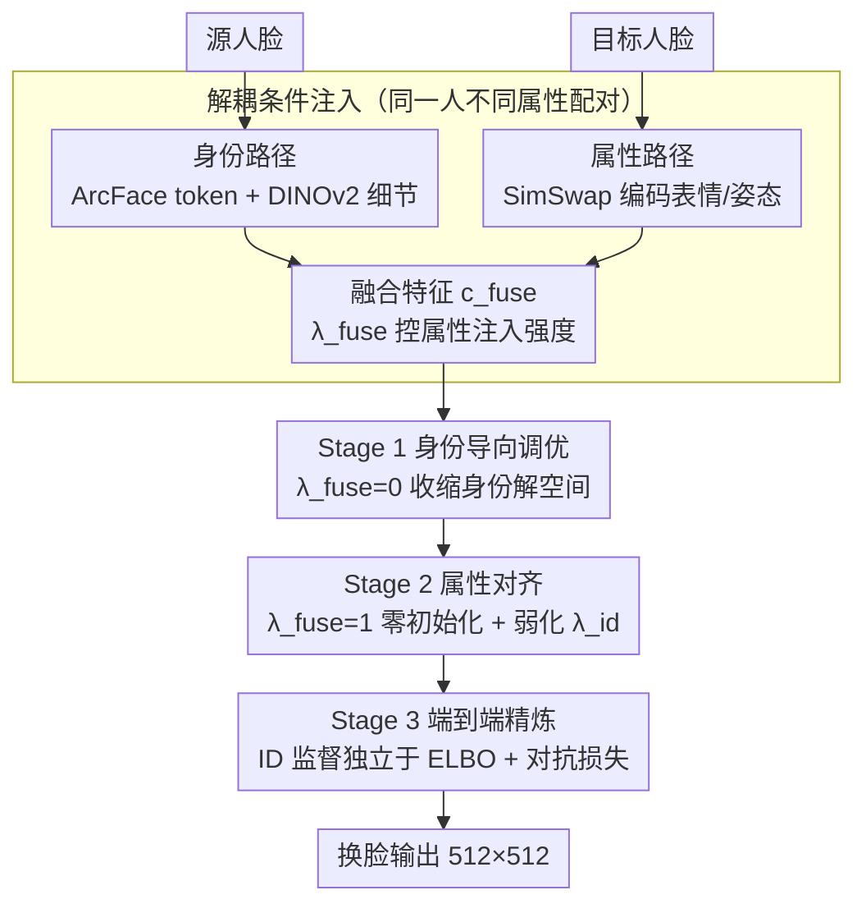

# High-Fidelity Diffusion Face Swapping with ID-Constrained Facial Conditioning

**会议**: CVPR 2026  
**arXiv**: [2503.22179](https://arxiv.org/abs/2503.22179)  
**代码**: 无  
**领域**: 扩散模型/图像生成  
**关键词**: 人脸替换, 扩散模型, 身份约束, 条件解耦, 多阶段训练

## 一句话总结

提出身份约束的属性调优框架用于扩散模型人脸替换：先约束身份解空间，再注入属性条件，最后端到端精炼身份损失和对抗损失，结合解耦条件注入设计，在 FFHQ 上实现 SOTA 的 FID（3.61）和身份检索准确率（97.9% Top-1）。

## 研究背景与动机

人脸替换（Face Swapping）将源人脸的身份迁移到目标人脸上，同时保持目标的表情、姿态等属性。这在影视制作、游戏、数字孪生等领域有重要应用。

传统 GAN 方法（SimSwap、E4S、InfoSwap）受限于 GAN 本身的图像质量和模式崩塌问题。扩散模型凭借更强的生成能力成为新方向，但现有扩散方法（DiffFace、DiffSwap、REFace）面临两个核心挑战：

**身份与属性的优先级问题**：人脸替换中身份保持应优先于属性一致性——结果首先要"像"源人脸，其次才是跟目标表情/姿态对齐。但现有方法通常联合注入所有条件，缺乏优先级控制。

**身份-属性条件冲突**：身份条件驱动输出接近源人脸，属性条件驱动输出接近目标人脸，两者在训练中方向相反（见论文 Fig.3），联合训练容易陷入次优解。

## 方法详解

### 整体框架

这篇论文要解决的是扩散人脸替换里一个长期纠结的矛盾：身份条件想把脸拉向源人脸，属性条件想把表情姿态拉向目标人脸，两个条件在训练里方向相反、互相打架。作者的解法是给它们排个优先级——「先像，再准」。整套框架建在 Stable Diffusion 1.5 的条件修复上，输入源人脸和目标人脸，输出换了身份的目标图；训练分三阶段走，先把模型解空间收缩到身份一致的区域，再在这个子空间里对齐属性，最后端到端精炼真实感。

### 关键设计

**1. 解耦条件注入：从数据和特征两头把身份和属性拆开**

以往常拿同一张图做数据增强来凑条件对，结果身份和属性信息互相泄露，模型分不清谁是谁。本文从数据层面就解耦：用**同一人不同属性**的配对图像，天然把身份特征和属性特征分到两路。身份路径先用 ArcFace 提 $d$ 维特征、经 MLP 扩成 $n \times d$ 的 token 序列 $c_{\text{face}}$，再用 DINOv2 提空间细节 $c_{\text{dino}}$，交叉注意力融合成

$$c_{\text{id}} = c_{\text{face}} + \lambda_{\text{id}} \cdot \text{Attention}(c_{\text{face}}, c_{\text{dino}}, c_{\text{dino}})$$

属性路径则用 SimSwap 的 3 层下采样网络从目标脸抽表情特征 $c_{\text{attr}}$。最后让身份特征当 query、属性特征当 key-value，用融合因子 $\lambda_{\text{fuse}}$ 控制属性注入强度：

$$c_{\text{fuse}} = c_{\text{id}} + \lambda_{\text{fuse}} \cdot \text{Attention}(c_{\text{id}}, c_{\text{attr}}, c_{\text{attr}})$$

当 $\lambda_{\text{fuse}} = 0$ 就退化成纯身份条件，融合特征经 GLIGEN 适配器注入 UNet 的交叉注意力层——这个开关正好被下面的多阶段训练用来控制优先级。

**2. 身份约束的多阶段训练：先收身份解空间，再调属性，最后精炼**

把「先像再准」落到训练上就是三个阶段。Stage 1 是身份导向调优：扩展 UNet 输入层接收噪声隐变量 $x_t$、修复掩码 $m$ 和背景上下文 $(1-m) \odot x_t$，关掉属性条件（$\lambda_{\text{fuse}} = 0$），只让模型学身份，把解空间先压到身份一致的范围。Stage 2 打开属性条件（$\lambda_{\text{fuse}} = 1$），在身份约束之内对齐表情姿态，这里两个细节很关键：融合模块输出层零初始化，避免属性注入一上来就冲垮已学好的身份特征；同时把身份增强因子 $\lambda_{\text{id}}$ 降到 0.2，防止身份太强压过属性。Stage 3 是端到端精炼：把 50 步 DDIM 采样看成一个级联生成模型，在采样结果上加身份损失和对抗损失

$$\mathcal{L} = \lambda_{\text{adv}} \mathcal{L}_{\text{adv}} + \lambda_{\text{id}} \mathcal{L}_{\text{id}}$$

为了扛住反传的显存开销，每个 mini-batch 只从 50 步里随机抽 $k$ 步算梯度。

**3. 把 ID 监督独立成第三阶段：不污染扩散训练的 ELBO**

DiffSwap/DiffFace 直接把 ID loss 加到噪声预测损失上，这会放松扩散的 ELBO 理论界、拖累生成质量；REFace 虽然在多步 DDIM 结果上加 ID loss，但计算量很大。本文的做法是把 ID 监督整个抽出来放到 Stage 3，前两阶段的 ELBO 完全不受身份损失干扰，再借 SNGAN 判别器把真实感顶上去——既拿到身份监督的好处，又没破坏扩散训练本身。

### 损失函数 / 训练策略

- **Stage 1-2**：标准扩散噪声预测 MSE 损失 $\mathcal{L}_{\text{diff}} = \sum_t \lambda_t \|\epsilon_\theta(x_t; t) - \epsilon\|_2^2$
- **Stage 3**：SNGAN hinge loss $\mathcal{L}_{\text{adv}}$ + ArcFace 身份损失 $\mathcal{L}_{\text{id}}$，随机 $k$ 步梯度计算
- 训练数据：450 万张互联网配对人脸图像（同一人不同属性），BLIP-2 标注文本描述
- Stage 3 使用 LAION-5B 过滤的随机配对人脸数据
- 输出分辨率 $512 \times 512$

## 实验关键数据

### 主实验

在 FFHQ 验证集 1000 对上评估：

| 方法 | FID↓ | Pose↓ | Expr.↓ | ID Top-1↑(%) | ID Top-5↑(%) |
|------|------|-------|--------|-------------|-------------|
| SimSwap (GAN) | 13.74 | 2.62 | **0.95** | 93.37 | 97.29 |
| E4S (GAN) | 12.22 | 4.55 | 1.32 | 77.80 | 87.40 |
| InfoSwap (GAN) | 4.26 | 3.26 | 1.00 | 92.82 | 97.69 |
| DiffFace | 8.82 | 3.76 | 1.31 | 91.50 | 97.50 |
| DiffSwap | 5.80 | **2.43** | 1.01 | 67.00 | 81.90 |
| REFace | 5.62 | 3.75 | 1.04 | 89.10 | 96.10 |
| **Ours** | **3.61** | 3.69 | 0.97 | **97.90** | **99.70** |

FID 大幅领先（3.61 vs 次优 4.26），身份检索准确率远超所有方法（97.9% vs 93.4%），表情距离与最佳持平。

### 消融实验

| 配置 | 关键指标 | 说明 |
|------|---------|------|
| 非解耦条件注入 | 身份保持弱，过拟合于属性跟随 | 同一图像增强生成条件对导致 ID/属性泄露 |
| 仅 Stage 1 | 身份好，表情/姿态差 | 无属性条件引导 |
| Stage 1+2 | 身份好，表情/姿态/光照改善 | 属性调优有效，SimSwap 编码器还能捕获光照 |
| Stage 1+2+3 | 身份和真实感显著提升 | 端到端精炼的 GAN+ID loss 必要 |

### 关键发现

- **解耦注入是核心**：不解耦时模型过拟合于属性跟随，身份保持大幅下降
- **多阶段训练有效**：每个阶段都有明确可观察的提升，Stage 2 还意外带来光照对齐和脸型调整
- **端到端精炼提升真实感**：Stage 3 的 ID loss + GAN loss 显著增强身份相似度和生成保真度
- **扩散模型的独特优势**：预训练基础模型提供了开箱即用的泛化能力，对风格化图像（油画、卡通等 <1% 训练数据）也能稳健处理
- **用户研究**（39人）：在保真度维度获得 57.1% 选票（远超第二名 15.3%），属性一致性 33.2% 也排第一

## 亮点与洞察

- **身份优先的直觉简洁有力**：将"先像再准"的直觉形式化为约束优化——先收缩解空间到身份一致区域，再在该子空间内优化属性对齐，避免两个条件在全空间中互相拉扯
- **分阶段 loss 设计避免理论矛盾**：将 ID loss 分离到独立的 Stage 3，不污染 Stage 1-2 的 ELBO，是比 DiffSwap/DiffFace 更优雅的做法
- **零初始化 + 弱化身份因子**的 Stage 2 设计细节精妙，有效防止灾难性遗忘和条件失衡
- **SimSwap 编码器的意外收益**：不仅编码表情/姿态，还隐式捕获光照条件，是值得注意的副产品

## 局限与展望

- 基于 SD 1.5（$512 \times 512$），受限于基础模型分辨率，未使用更现代的 DiT/FLUX 架构
- Pose 距离（3.69）不如 DiffSwap（2.43），说明身份约束一定程度上牺牲了姿态对齐
- Stage 3 需要 50 步 DDIM 采样+反向传播，训练成本高（虽通过随机 $k$ 步缓解）
- 450 万训练数据来自互联网，数据质量和隐私问题未讨论
- 缺乏对跨种族、跨年龄等困难场景的系统评估

## 相关工作与启发

- **条件优先级**的思想可推广到其他多条件生成任务（如同时控制身份+风格+布局时，如何确定优先级）
- **分阶段条件注入**的范式适用于任何存在条件冲突的扩散模型微调场景
- 端到端 DDIM 精炼 + 随机步骤梯度计算是一种通用的后训练增强策略，可用于其他生成质量优化
- SimSwap 属性编码器在扩散框架中的复用，说明 GAN 时代的模块仍有迁移价值

## 评分

- 新颖性: ⭐⭐⭐⭐ 身份约束的多阶段训练范式和解耦条件注入设计新颖，直觉清晰
- 实验充分度: ⭐⭐⭐⭐ 6 个对比方法、定量+用户研究+充分的消融和可视化分析
- 写作质量: ⭐⭐⭐⭐ 动机阐述清楚，Fig.2/3 对条件冲突的可视化very直观
- 价值: ⭐⭐⭐⭐ 多条件解耦和优先级训练的思想具有通用性，超越人脸替换单一任务

<!-- RELATED:START -->

## 相关论文

- [\[CVPR 2026\] Preserving Source Video Realism: High-Fidelity Face Swapping for Cinematic Quality](preserving_source_video_realism_high-fidelity_face_swapping_for_cinematic_qualit.md)
- [\[CVPR 2026\] Attribute-Preserving Pseudo-Labeling for Diffusion-Based Face Swapping](attribute-preserving_pseudo-labeling_for_diffusion-based_face_swapping.md)
- [\[CVPR 2026\] MMFace-DiT: A Dual-Stream Diffusion Transformer for High-Fidelity Multimodal Face Generation](mmface-dit_a_dual-stream_diffusion_transformer_for_high-fidelity_multimodal_face.md)
- [\[CVPR 2026\] High-Fidelity Virtual Try-On beyond Paired Data Scarcity via Diffusion-based Cycle-Consistent Learning](high-fidelity_virtual_try-on_beyond_paired_data_scarcity_via_diffusion-based_cyc.md)
- [\[AAAI 2026\] Realistic Face Reconstruction from Facial Embeddings via Diffusion Models](../../AAAI2026/image_generation/realistic_face_reconstruction_from_facial_embeddings_via_diffusion_models.md)

<!-- RELATED:END -->
