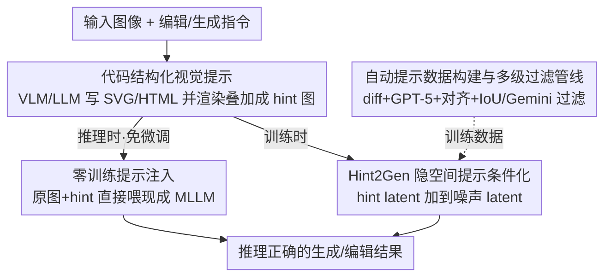

# Hint2Gen: Bridging Understanding and Generation via Code-structured Hints

**会议**: CVPR 2026  
**论文**: [CVF Open Access](https://openaccess.thecvf.com/content/CVPR2026/html/Tu_Hint2Gen_Bridging_Understanding_and_Generation_via_Code-structured_Hints_CVPR_2026_paper.html)  
**代码**: https://hint2gen.github.io  
**领域**: 图像生成 / 多模态推理  
**关键词**: 推理感知生成, 代码结构化提示, SVG/HTML, 统一模型, FLUX.1 Kontext

## 一句话总结
统一图文模型解不了走迷宫、拼七巧板这类推理任务，但 VLM/LLM 其实"会推理只是不会画"；本文把 VLM/LLM 的推理结果写成 SVG/HTML 代码、渲染成叠在图上的"提示图"，作为连接理解与生成的可执行桥梁，既能零训练地塞给现成模型涨点，也能微调出专门吃这种提示的 Hint2Gen 模型，并配套 Reason2Gen 基准（3300 样本 / 22 类 / 7 维度），在所有维度上超过 GPT-Image、Nano Banana Pro 等开闭源系统。

## 研究背景与动机
**领域现状**：以 FLUX、BAGEL、GPT-Image、Nano Banana 为代表的统一文生图（T2I）/图像编辑模型在"画得像不像"上已经很强，能从自然语言生成高保真图像。

**现有痛点**：可一旦任务需要显式的空间或关系推理——走迷宫、拼七巧板、下五子棋、看时钟、预测小球反弹轨迹——这些模型就会系统性翻车：要么绕错枢轴旋转物体，要么删掉物体却破坏周围背景，结果违反基本的逻辑/空间/规则约束。

**核心矛盾**：作者做了一个关键观察——同样这些推理任务，**VLM/LLM 用纯文本提示能准确解出来**（推理能力和空间定位都没问题），但它们的输出本质是文字，**根本没法渲染成图像**。于是出现一个清晰的二分：VLM/LLM 会推理但不会画，生成模型会画但不会推理。所以瓶颈不是"推理能力不足"，而是**缺一个把符号化推理翻译成精确像素输出的结构化接口**。

**本文目标**：补上这个缺失的接口，让生成模型也能可控、可解释地执行推理密集型的生成与编辑。

**切入角度**：分割掩码、检测框这类非结构化提示，丢失了几何关系和组合逻辑；而 SVG/HTML 这类**代码表示**天然保留几何关系、图层层级、组合逻辑，可以把抽象推理结论忠实地"接地"到像素空间。

**核心 idea**：用**代码结构化视觉提示**（SVG/HTML 叠加层）当桥梁——让 VLM/LLM 把推理步骤写成结构化程序、渲染叠到图像平面上，再喂给生成模型作为强空间先验。

## 方法详解

### 整体框架
Hint2Gen 的核心流程是：拿到「输入图像 + 编辑/生成指令」后，先让一个 VLM/LLM 把"该怎么改/怎么画"的推理结论写成一段 SVG/HTML 代码（箭头、标签、多边形、文字等），把这段代码**栅格化并叠加**到原图上，得到一张「提示图（hint image）」。这张提示图就是连接理解与生成的桥梁，之后有两条用法：① **零训练**——直接把「原图 + 提示图」一起喂给现成的强生成模型（GPT-Image、Qwen-Image 等），免微调就能涨点；② **训练**——在 FLUX.1 Kontext 上把提示图的隐变量注入扩散过程，训练出专门吃这种提示的 Hint2Gen。为了把模型练出来，作者还搭了一条自动数据管线批量造「指令 + 目标图 + SVG/HTML 提示」三元组，并建了 Reason2Gen 基准做评测。

### 关键设计

**1. 代码结构化视觉提示：用 SVG/HTML 当理解与生成之间的可执行桥梁**

针对"生成模型不会推理、VLM/LLM 不会画"这个二分，作者不去硬训一个"既会推理又会画"的大模型，而是插入一层中间表示：让 VLM/LLM 把空间布局、几何约束、编辑线索写成 SVG/HTML 片段（例如旋转箭头、删除掩码、连线、坐标对齐），再栅格化叠到原图上。为什么用代码而不是掩码/框？因为 SVG/HTML 用 `<polygon>`、`<polyline>`、`<rect>`、`<circle>`、`<text>` 这类原语，天然带几何关系、图层层级和组合逻辑，能把"1→4、2→3"这种映射、"沿曲线推进的弹珠链"这种动态结构精确编码下来，而掩码/框只能给出粗糙的区域。这层提示把高层符号推理"接地"成几何精确、语义明确的像素级指令，是全文一切收益的来源。

**2. 零训练提示注入：把 hint 当额外输入直接喂现成模型**

痛点是：现有 MLLM 没被训练过去"读懂"这种代码结构化提示，直接硬塞收益有限——但作者发现，对足够强的现成模型（GPT-Image、Qwen-Image、Nano Banana Pro 等），**只要把渲染好的 SVG/HTML 提示图当作额外输入图像一起喂进去，免任何重训就能让它们解出原本失败的任务**。表 1 里带 `*` 的行就是这种用法：例如 Nano Banana Pro 的总分从 17.96 涨到 22.77，GPT-Image 从 11.33 涨到 15.75。这说明提示本身就是一种通用接口——它把推理结果显式画在图上，模型只要"照着改"即可，不需要自己重新推理。这一设计也是论文"hints 跨任务、跨模型泛化"主张的直接证据。

**3. Hint2Gen：在 FLUX.1 Kontext 上做隐空间提示条件化**

零训练注入对弱模型收益有限，于是作者训练一个专门模型。底座选 FLUX.1 Kontext（面向统一生成+编辑的扩散 Transformer）：文本指令编码、图像隐变量经一个共享 VAE 提取，token 流拼接后过联合注意力。改动极小但关键——把栅格化的提示图用**同一个 VAE**编码，得到 hint latent，然后在**每一个扩散时间步**把它**直接加到带噪的输入隐变量上**作为条件信号。这个"latent 相加注入"几乎不改动底座结构，却给去噪过程注入了强空间先验，让模型能可靠执行"只删某物体且保留周边""绕正确枢轴旋转"这类推理密集编辑。训练上以 LoRA 适配，并把原 CLIP 编码器换成 Qwen2.5-VL-7B 来联合编码指令与图像，采用动态分辨率采样（约 512×512、保持原始长宽比）。⚠️ 论文图 2 提到文本由 T5 编码、正文实验设置又说把 CLIP 换成 Qwen2.5-VL，两处编码器描述略有出入，以原文为准。

**4. 自动提示数据构建与多级过滤管线：解决"没有提示标注数据"的训练瓶颈**

训练 Hint2Gen 最大的障碍是：没有现成数据集同时配齐「自然指令 + 目标图 + SVG/HTML 推理提示」。作者设计了一条全自动管线在规模上造这种标注，分三类来源：
- **自然图像编辑对**：在原图上叠一层细坐标网格做空间锚定；对「编辑图 vs 原图」算逐像素绝对差，经自适应阈值 + 形态学细化得到二值变化掩码，再用膨胀把邻近区域并成紧凑连通分量；把「带网格原图 + 编辑图 + 差异掩码 + 指令」一起喂给 GPT-5，让它输出一段在改动区域上精确渲染箭头/标签/框的 HTML 提示。
- **文生图样本**：GPT-5 拿到「输入提示词 + 目标图 + 边缘图（结构布局）」，输出编码空间/逻辑推理的 HTML 提示。
- **网页渲染数据**：为了显式注入"通用编辑里常缺的"强推理需求，作者在受控 HTML 环境里设计 10 类逻辑密集场景（五子棋、象棋、国际象棋、数独、祖玛等），让 GPT-5 直接在浏览器内原生渲染出**像素对齐的三元组**（问题图、提示图、答案图）。

随后两级精修+校验：① **零 token 后对齐**——稠密化 SVG/HTML 顶点、用差异掩码把顶点吸附到最近的变化像素、用质心对齐校正全局偏移；② **质量过滤**——算渲染提示前景掩码与真值 ROI 的 IoU，丢掉低 IoU（错位/无关）的样本，剩余样本再交给 Gemini-2.5 Pro 评判语义相关性、视觉清晰度与推理保真度。最终得到约 10 万自然图像样本 + 2 万网页渲染推理样本。

### 损失函数 / 训练策略
沿用 FLUX.1 Kontext 的扩散训练目标，以 LoRA 微调；唯一新增的条件信号是每个时间步把 hint latent 加到噪声隐变量上。完整超参在原文附录给出。

## 实验关键数据

### 主实验
在自建 Reason2Gen（3300 样本、7 维度）上用 GPT-5 做 LLM-as-judge（0/1 打分、跑 3 次取均值），报告各维度准确率（%）。Hint2Gen（Ours）在全部 7 个维度和总分上都领先；`*` 表示零训练注入提示图后的版本。

| 模型 | Path | Assembly | Pattern | Strategy | Overall |
|------|------|----------|---------|----------|---------|
| FLUX.1 Kontext（底座，无提示） | 0.40 | 7.67 | 10.33 | 6.23 | 3.85 |
| GPT-Image（最强无提示闭源） | 13.33 | 31.00 | 17.50 | 10.48 | 11.33 |
| Nano Banana Pro（无提示） | 15.47 | 40.33 | 34.67 | 22.22 | 17.96 |
| GPT-Image*（+提示，零训练） | 18.80 | 44.67 | 24.33 | 15.44 | 15.75 |
| Nano Banana Pro*（+提示，零训练） | 20.53 | 47.33 | 40.00 | 27.89 | 22.77 |
| **Hint2Gen（Ours）** | **29.64** | **55.82** | **48.93** | **37.84** | **31.04** |

可以看到两条结论：其一，给现成强模型零训练塞提示图，总分普遍大涨（Nano Banana Pro 17.96→22.77、GPT-Image 11.33→15.75）；其二，即便如此，专门训练的 Hint2Gen（31.04）仍显著高于最好的零训练版本（22.77）。注意所有方法总分都远低于 100%，说明该基准确实够难、还有很大提升空间。其中"策略规划（Strategy）"维度几乎所有无提示模型都是 0.00，Hint2Gen 做到 37.84，是提升最猛的维度之一。

### 消融实验
消融管线各组件（Overall 准确率）：

| 配置 | Overall | 说明 |
|------|---------|------|
| w/o Hint | 6.93 | 用本文数据训练但去掉提示图，只比裸 FLUX(3.85) 略高 |
| w/ Text & w/o Hint | 10.94 | 改用 GPT-5 生成的纯文本推理替代提示图 |
| w/o Preprocess | 22.50 | 去掉预处理（网格/差异掩码） |
| w/o Filtering | 25.94 | 去掉 IoU + Gemini 过滤 |
| w/o Postprocess | 28.63 | 去掉后对齐（顶点吸附/质心校正） |
| Gemini-2.5 Pro 当提示生成器 | 30.16 | 换更弱/不同的提示生成器仍接近 |
| **Ours（完整）** | **31.04** | 完整模型 |

此外在通用文生图基准 GenEval 上，Ours*（注入提示）总分 0.91，与最强的 BAGEL* 持平、超过 GPT-Image*（0.89），尤其在 Counting（0.93）、Position（0.91）这类需要空间精度的子项上领先，验证提示图作为"通用空间接地接口"也能迁移到普通生成任务。

### 关键发现
- **提示图是收益主因，不是数据本身**：把数据里的提示图去掉重训（w/o Hint，6.93）相比完整模型（31.04）暴跌，说明涨点来自"提示引导的生成机制"而非仅仅多了一批领域数据。
- **结构化代码格式比生成器强弱更重要**：换更弱的 VLM（Gemini-2.5 Pro / Qwen2.5-VL）来生成提示，总分只从 31.04 微降到 30.16 / 29.54——SVG/HTML 这种结构化格式本身才是关键。
- **训练数据比架构更重要**：开源模型用了扩散 Transformer、自回归、离散扩散等各种架构，但在 Reason2Gen 上谁也没拉开差距；真正决定成败的是是否在这类逻辑密集、游戏化的领域数据上训过。
- **过滤/对齐都有正贡献**：去掉过滤（25.94）、预处理（22.50）都掉点，后对齐（28.63）对提示精度有稳定增益。
- 人类偏好研究（Elo + Pearson 相关）显示 GPT-5 评判与人类判断高度一致，支撑 LLM-as-judge 协议的可靠性。

## 亮点与洞察
- **重新定义了瓶颈**：把"统一模型推理差"从"推理能力不足"重新诊断为"缺一个结构化输出接口"，这个 reframing 本身比方法更值钱——它解释了为什么 VLM 会解迷宫却画不出来。
- **用代码当中间表示很巧**：SVG/HTML 是可执行、可渲染、又天然带几何/层级语义的"视觉编程语言"，比掩码/框信息量大得多，而且现成 LLM 写代码的能力可以直接复用。
- **零训练就能涨点**：提示图作为额外输入即插即用，对任何接受多图输入的生成模型都适用，迁移成本极低——这条单独拎出来就很实用。
- **极简改动接入底座**：只在每个扩散步把 hint latent 加到噪声 latent，不改 FLUX 结构就注入了强空间先验，是个可复用的条件注入 trick。

## 局限与展望
- **强依赖外部强 LLM**：提示生成（GPT-5）、过滤（Gemini-2.5 Pro）、评测（GPT-5）整条链都挂在闭源大模型上，复现成本高，提示质量也受其上限约束。
- **天花板仍很低**：最好成绩 31.04%，离"解决任务"还很远；Comparison（14.26）、Commonsense（19.11）等维度依旧薄弱。
- **评测是 0/1 + LLM-as-judge**：粗粒度二值打分可能掩盖"接近正确"的细微差异，且评判模型自身偏差未完全排除（论文也观察到弱 VLM 当评判时分数虚高）。
- **提示生成对齐仍需后处理**：需要 IoU 过滤 + 顶点吸附 + 质心校正才稳，说明 LLM 直接产出的代码提示空间精度还不够，端到端方案有待探索。

## 相关工作与启发
- **vs 统一多模态生成模型（Chameleon / Show-o / Transfusion / BAGEL / MetaQuery）**: 它们追求在单一架构里联合做理解与生成，但偏重感知保真度、生成时不真正推理；本文不动架构，而是插入"代码提示"这层显式接口把推理结论搬进生成，思路是"解耦"而非"统一"。
- **vs 推理感知 T2I 基准（WISE / PhyBench / CommonsenseT2I / R2I-Bench / T2I-ReasonBench）**: 这些基准评测世界知识、物理合理性、常识逻辑，但都没把"代码结构化表示当推理脚手架"纳入考量；Reason2Gen 正是补上这块空白，且任务难度（22 类游戏化推理）远超以往 3×3 井字棋 / 简单迷宫。
- **vs 非结构化条件（掩码 / 框 / 边缘）**: 同为给生成模型加空间条件，本文用 SVG/HTML 保留了几何关系与组合逻辑，信息密度和可编程性都更高。

## 评分
- 新颖性: ⭐⭐⭐⭐⭐ "代码结构化提示当理解↔生成桥梁"是个干净又有解释力的新范式
- 实验充分度: ⭐⭐⭐⭐ 横扫 20+ 开闭源模型、3 个基准、完整消融，但天花板低、依赖闭源 LLM
- 写作质量: ⭐⭐⭐⭐⭐ 问题诊断清晰、动机叙事强，图表自洽
- 价值: ⭐⭐⭐⭐⭐ 提示零训练即插即用 + Reason2Gen 基准，对推理感知生成方向有实在推动

<!-- RELATED:START -->

## 相关论文

- [\[CVPR 2026\] Scone: Bridging Composition and Distinction in Subject-Driven Image Generation via Unified Understanding-Generation Modeling](scone_bridging_composition_and_distinction_in_subject-driven_image_generation_vi.md)
- [\[CVPR 2026\] A Style is Worth One Code: Unlocking Code-to-Style Image Generation with Discrete Style Space](a_style_is_worth_one_code_unlocking_code-to-style_image_generation_with_discrete.md)
- [\[CVPR 2026\] LumiX: Structured and Coherent Text-to-Intrinsic Generation](lumix_structured_and_coherent_text-to-intrinsic_generation.md)
- [\[CVPR 2026\] Evaluating Generative Models via One-Dimensional Code Distributions](evaluating_generative_models_via_one-dimensional_code_distributions.md)
- [\[CVPR 2026\] Re-Align: Structured Reasoning-guided Alignment for In-Context Image Generation and Editing](re-align_structured_reasoning-guided_alignment_for_in-context_image_generation_a.md)

<!-- RELATED:END -->
