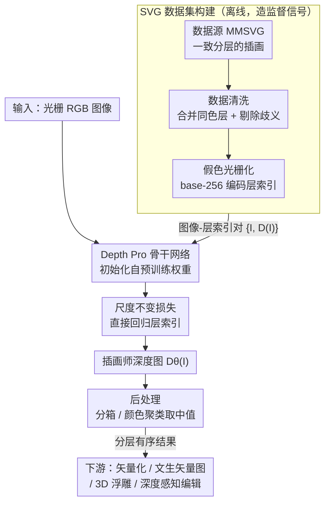

# Illustrator's Depth: Monocular Layer Index Prediction for Image Decomposition

**会议**: CVPR 2026  
**论文**: [CVF Open Access](https://openaccess.thecvf.com/content/CVPR2026/html/Maruani_Illustrators_Depth_Monocular_Layer_Index_Prediction_for_Image_Decomposition_CVPR_2026_paper.html)  
**代码**: 无  
**领域**: 图像生成 / 矢量图 / 图像分层分解  
**关键词**: Illustrator's Depth、图层索引预测、图像矢量化、可编辑分层、单目深度

## 一句话总结
本文提出"插画师深度"（Illustrator's Depth）——一种把每个像素映射到**图层索引**而非物理深度的新概念，用一个基于 Depth Pro 的网络从单张光栅图直接预测这种全局一致的分层排序，从而把平面图像分解成可编辑、有序的图层，并在图像矢量化上大幅超越 SOTA，同时解锁文生矢量图、自动 3D 浮雕、深度感知编辑等下游应用。

## 研究背景与动机
**领域现状**：图层（layer）是创意软件（Photoshop、Illustrator 等）的核心范式——把一幅作品组织成自底向上堆叠的若干图层，让每个构图元素可以独立编辑。这种分层天然和"物理深度"相关（近的元素遮挡远的），所以人们自然想到用单目深度估计（MDE，如 Depth Pro、Depth Anything）或全景分割来自动恢复图层。

**现有痛点**：但这两类方法都恢复不出"有用的、有序的图层"。MDE 模型预测的是真实世界几何深度，它们被**专门训练去忽略**印在平面媒介上的内容——海报上的图案、T 恤上的印花、投在物体上的阴影，这些没有真实体积的东西在 MDE 眼里是"平的"，可在插画里它们恰恰是要单独成层的关键元素。分割模型（实例/全景）能给出高质量掩码，但**完全不编码任何相对顺序**——它解决的是"这是什么"，而不是"谁压在谁上面"。

**核心矛盾**：插画的"图层深度"既不是纯物理深度，也不是纯语义分割，而是两者微妙的混合——它要求一个**离散、全局一致、可排序**的逐像素顺序。比如多米诺骨牌虽然物理深度连续重叠，却应被映射到离散可排序的图层；阴影虽无真实深度，却要放在所投物体之上。现有方法没有一个能给出这种贯穿全图、满足传递性的单一序关系。

**本文目标**：定义并预测一种新的"深度"，让它优先服务于**可编辑性**而非度量精度，从而把任意图像分解成自底（背景）向上（前景）的有序图层。

**切入角度**：作者观察到，矢量图（SVG）文件本身就是按 path 堆叠顺序天然分层的——这是一座现成的、带 ground-truth 图层结构的金矿。于是把"图层推断"重新表述为一个**有监督的单目稠密预测**任务：用大规模 SVG 数据集训练网络直接预测每个像素的图层索引。

**核心 idea**：把"深度"从物理量重新定义为创作抽象——**预测逐像素的图层索引** $i\in\{1\dots N\}$，并复用 MDE 强先验来泛化到训练集之外的复杂艺术图像。

## 方法详解

### 整体框架
给定一张光栅 RGB 图像 $I\in\mathbb{R}^{H\times W}$，目标是预测一张"插画师深度图" $D_\theta(I)\in\mathbb{R}^{H\times W}$，其中每个像素的值对应它在艺术家心目中所属的图层索引（连续值表示，保留相对顺序、需要时可二值化为离散层）。整条管线分三块：先从 SVG 数据源构造带 ground-truth 图层索引的训练对，再用一个以 Depth Pro 为骨干、配 scale-invariant 损失的网络直接回归层索引，最后用后处理把连续预测离散化并喂给各类下游任务（矢量化、文生矢量图、3D 浮雕、编辑）。

### 关键设计

**1. Illustrator's Depth：把深度重定义为逐像素图层索引**

针对"MDE 给物理深度、分割给无序掩码、两者都恢复不出可编辑图层"这个根本矛盾，作者提出一个全新的目标量：插画师深度，定义为从每个像素到其**图层索引** $i\in\{1\dots N\}$ 的映射，$N$ 是这幅作品被分解成的图层数，索引从 1（背景）单调递增到 $N$（前景）。它的关键性质是**全局一致的离散序**——任意两个像素之间都有明确的"谁在上、谁在下"，满足传递性，这正是分割（无序）和 MDE（连续物理量、且忽略平面元素）都给不出的。实现上网络输出连续值 $D_\theta(I)$ 而非硬离散，因为连续表示既保留相对排序、又能在需要时直接分箱成离散层，训练也更平滑。这一重定义是全文地基：它把一个含糊的"图层推断"问题变成了可监督、可评测的稠密回归问题。

**2. 从 SVG 蒸馏监督信号：数据源 + 清洗 + 假色光栅化**

插画师深度没有现成标注，本文的巧思是**SVG 文件天然带图层顺序**——每个 path 的堆叠次序就是 ground-truth 分层。但直接用会有噪声，作者用三步把它变成干净监督：（a）数据源选 MMSVG-Illustration，因为它的图层组织一致且符合直觉（背景低索引、前景高索引、描边总在对应填充之上）；（b）数据清洗去歧义——合并 RGB 颜色相同的连续图层以简化结构，并剔除"同色非相邻层在渲染图中重叠"这类病态样本，显著提升训练稳定性；（c）假色光栅化生成监督图——把每层的原色替换成编码其索引 $i$ 的唯一颜色，用 base-256 把索引摊进 RGB 三通道：

$$\big(\, i \bmod 256,\ \lfloor i/256\rfloor \bmod 256,\ \lfloor i/256^2\rfloor \bmod 256 \,\big)$$

再光栅化、用 $D(I)=R+256\cdot G+256^2\cdot B$ 解回逐像素整数深度。这套编码几乎零额外加载开销就能表示极多图层。最终约 10 万张一致分层的 SVG 图像（清洗+光栅化到 $1536\times1536$）构成训练集。

**3. 复用 Depth Pro 先验 + 尺度不变直接回归层索引**

网络要同时推理物体边界、遮挡和分组——这恰是 MDE 模型已经学得很好的能力。作者用 **Depth Pro**（基于 DINO-v2、带多尺度编码器）作骨干并**用其预训练权重初始化**，把它对几何/遮挡的理解当作关键先验，这也是模型能从"简单矢量图训练集"泛化到"复杂艺术图像"的主要原因。损失上有个反直觉但关键的选择：MDE 通常在**视差空间** $1/d$ 学习（前景近、值大，优先保前景精度），但插画是按图层从背景到前景结构化排布的，**背景层并不比前景层更难估**，所以作者**直接回归离散层索引** $(1\dots N)$ 而非视差，给所有图层平等权重。又因为真正要的是相对顺序而非绝对索引值、且 $N$ 可能很大，借鉴 MiDaS 做尺度不变归一化：对深度图算中位数 $m$ 和平均绝对偏差 $s$，把每个值归一化为 $\hat d:=(d-m)/s$，再在归一化图上用 MAE 损失：

$$\mathcal{L}_{\text{MAE}}\big(D(I), D_\theta(I)\big) = \big|\,\hat D(I) - \hat D_\theta(I)\,\big|$$

消融证实"直接索引训练"虽然全局排序分数和视差训练相当，却带来前景-背景更均衡的优化和明显更好的 MAE/MSE。

**4. 后处理离散化 + 无缝嵌入传统矢量化管线**

网络输出的是逐像素连续插画师深度，下游需要离散图层，作者按任务选两种后处理：（1）对深度值直接分箱/阈值分割（适合光栅图像编辑）；（2）先在 RGB 空间聚类、再给每个簇赋其深度中位数（适合矢量化，因输入常是色块一致的区域，相近色+相近深度的簇还能进一步合并简化 path）。在矢量化里，本文的杀手锏是**把预测的层索引替换掉传统管线里脆弱的启发式排序**：以 VTracer 为例，先算颜色簇，用插画师深度给簇排序，再 inpaint 补洞、最后用 Potrace 逐层矢量化——整套（含深度预测）只要几秒。正是这一步让"传统矢量器的重建保真度"和"数据驱动的层序质量"两个长处第一次同时拿到。

### 损失函数 / 训练策略
主损失为尺度不变归一化后的 MAE（式见上）。训练 40 epoch，8 张 A100，cosine 学习率（峰值 $5\times10^{-6}$），batch size 8；数据增强含 color jitter、随机反色、随机模糊；沿用 Depth Pro 对编码器（DINO-v2）和 CNN 解码器用两套不同学习率。

## 实验关键数据

### 主实验
**插画师深度本身的预测质量（MMSVG 测试集）**：用从 GT SVG 渲染的层索引图评测，Order 是随机采样像素对、看相对顺序是否保持的比例。

| 方法 | Order ↑ | MAE ↓ | MSE ↓ |
|------|--------|-------|-------|
| Depth Pro（物理深度） | 0.636 | 1.44 | 4.76 |
| Depth Anything-v2（物理深度） | 0.791 | 1.16 | 3.58 |
| **本文** | **0.987** | **0.12** | **0.26** |

物理深度模型在层序上大幅落后，本文近乎完美的层排序（0.987）印证了"物理深度 ≠ 插画师深度"。

**矢量化质量（MMSVG 验证集，按分层策略分组）**：

| 方法 | 分层先验 | Order ↑ | MAE ↓ | Path 数误差 ↓ | RGB MSE(×10⁻²) ↓ | SSIM ↑ | LPIPS ↓ |
|------|---------|--------|-------|------|------|------|------|
| VTracer+Potrace | 启发式 | 0.694 | 1.67 | 0.83 | 0.019 | 0.997 | 0.005 |
| Less Is More | 启发式 | 0.746 | 2.43 | 5.54 | 0.663 | 0.961 | 0.043 |
| LIVE | 优化 | 0.838 | 4.88 | 8.62 | 0.297 | 0.946 | 0.053 |
| Starvector | 数据驱动 | 0.918 | 1.52 | 0.53 | 9.123 | 0.858 | 0.302 |
| OmniSVG | 数据驱动 | 0.925 | 1.31 | 0.54 | 9.997 | 0.830 | 0.317 |
| **Ours + [VTracer,Potrace]** | 数据驱动 | **0.987** | **0.46** | **0.16** | **0.018** | **0.997** | **0.005** |

本文在层序精度、path 紧凑度上全面领先，同时把重建保真度（SSIM 0.997、LPIPS 0.005）维持在 VTracer 同等顶级水平——别的方法要么重建好但层序差（VTracer、Less is More），要么层序好但重建差（StarVector、OmniSVG），本文兼得两端。

### 消融实验

| 配置 | Order ↑ | MAE ↓ | MSE ↓ | 说明 |
|------|--------|-------|-------|------|
| w/o 深度先验初始化 | 0.903 | 0.51 | 1.17 | 不用 Depth Pro 权重，层序明显掉 |
| w/o 数据清洗 | 0.905 | 0.53 | 1.21 | 不去歧义，层序掉得相近 |
| 视差空间训练（非直接索引） | 0.980 | 0.50 | 1.88 | Order 接近但 MAE/MSE 显著更差 |
| **完整模型** | **0.981** | **0.16** | **0.29** | 三者齐备 |

### 关键发现
- **深度先验初始化和数据清洗**两者都把层序一致性（Order）从 ~0.90 拉到 0.98，是泛化能力的主要来源——尤其 Depth Pro 在百万级真实图上学到的遮挡/几何先验，让只在简单矢量图上训练的模型能迁移到复杂艺术图像。
- **直接回归层索引 vs 视差空间训练**：两者全局 Order 几乎一样（0.980 vs 0.981），但直接索引训练让前景-背景优化更均衡，MAE 从 0.50 降到 0.16、MSE 从 1.88 降到 0.29，深度过渡更干净——这是"插画各层同等重要、不该像物理深度那样偏袒前景"这一洞察的直接收益。
- 泛化是惊喜：模型仅在简单 SVG 上训练，却能对复杂插画、油画甚至部分真实照片输出合理图层，归功于预训练先验。

## 亮点与洞察
- **重定义问题比设计新网络更有杠杆**：本文几乎没改网络结构（直接用 Depth Pro），最大创新是把"图层推断"重新表述为一个可监督的稠密回归任务，并指出 SVG 文件就是天然的 ground-truth 来源——这种"换个量来预测"的思路非常可迁移。
- **base-256 假色编码**：用 RGB 三通道编码任意大的图层索引、再用一个线性公式解回整数，零额外开销地把"多达上百层"塞进标准图像 IO，是个值得复用的工程小技巧。
- **"插画各层同等重要"推翻 MDE 的视差惯例**：MDE 在 $1/d$ 空间训练是为了偏袒前景精度，但插画语境下背景层和前景层一样重要，所以直接在索引空间训练——这个领域差异分析很到位，消融也证明了它对 MAE/MSE 的实质提升。
- **即插即用**：层索引只是替换掉传统矢量化管线里的启发式排序，不需要重训矢量器就能让 VTracer 这类成熟工具拿到 SOTA 层序，落地成本极低。

## 局限与展望
- **训练分布偏窄**：只在简单矢量图（MMSVG）上训练，对复杂真实照片的泛化虽有惊喜但缺乏定量评测（无 GT 分层），失败案例放在补充材料，稳健性边界不清晰。
- **分层本身的主观性**：不同艺术家的分层习惯不同，作者靠"合并同色层、剔除歧义样本"来归一化训练信号，但这也意味着模型学到的是某种"平均/规范化"的分层观，对刻意打破常规的艺术分层可能失配。
- **依赖后处理把连续预测离散化**：分箱阈值、聚类合并这些后处理的参数选择会影响最终图层数和质量，论文按任务手选策略，自动化程度和鲁棒性有提升空间。
- **未给绝对图层数的可靠性保证**：网络回归相对顺序，$N$ 的确定和层边界对齐仍依赖后处理，复杂场景下离散化误差可能传播到下游矢量化/浮雕。

## 相关工作与启发
- **vs 单目深度估计（Depth Pro / Depth Anything-v2）**：它们预测物理几何深度、且被训练去忽略平面印刷内容；本文预测图层索引、优先可编辑性。借用其骨干和先验，但目标量完全不同，层序上大幅反超（Order 0.987 vs 0.636/0.791）。
- **vs 实例/全景/非模态分割**：分割给高质量掩码但不编码任何全局序；本文给的是贯穿全图、满足传递性的单一序关系，正是分割缺失的部分。
- **vs 生成式分层（人像抠图、RGBA 图层生成、视频图集）**：那些方法产出的是相互独立的对象级 RGBA 层，不受全局逐像素深度序约束；本文追求的是一张连贯排序所有像素的"插画师深度"图。
- **vs 矢量化方法（VTracer/Potrace 启发式、LIVE 优化、StarVector/OmniSVG 数据驱动）**：启发式重建好但层序乱、LLM 方法层序好但常重建失败；本文用层索引预测把两边长处合一，path 数更紧凑、保真与层序双 SOTA。

## 评分
- 新颖性: ⭐⭐⭐⭐⭐ 把"深度"从物理量重定义为创作抽象（图层索引），并指出 SVG 是天然监督源，问题表述层面的原创性很高
- 实验充分度: ⭐⭐⭐⭐ 主结果+消融扎实，矢量化对比全面；但对真实图像的泛化主要靠定性展示，缺定量评测
- 写作质量: ⭐⭐⭐⭐⭐ 动机推导清晰（三类方法为何都不行讲得很透），图示和应用展示丰富
- 价值: ⭐⭐⭐⭐⭐ 即插即用提升矢量化、解锁文生矢量图/3D 浮雕/深度感知编辑多个下游，落地价值大

<!-- RELATED:START -->

## 相关论文

- [\[CVPR 2026\] From Inpainting to Layer Decomposition: Repurposing Generative Inpainting Models for Image Layer Decomposition](from_inpainting_to_layer_decomposition_repurposing_generative_inpainting_models_.md)
- [\[CVPR 2026\] Qwen-Image-Layered: Towards Inherent Editability via Layer Decomposition](qwen-image-layered_towards_inherent_editability_via_layer_decomposition.md)
- [\[ICLR 2026\] Referring Layer Decomposition](../../ICLR2026/image_generation/referring_layer_decomposition.md)
- [\[CVPR 2026\] Cycle-Consistent Tuning for Layered Image Decomposition](cycle-consistent_tuning_for_layered_image_decomposition.md)
- [\[CVPR 2026\] Towards Robust Sequential Decomposition for Complex Image Editing](towards_robust_sequential_decomposition_for_complex_image_editing.md)

<!-- RELATED:END -->
