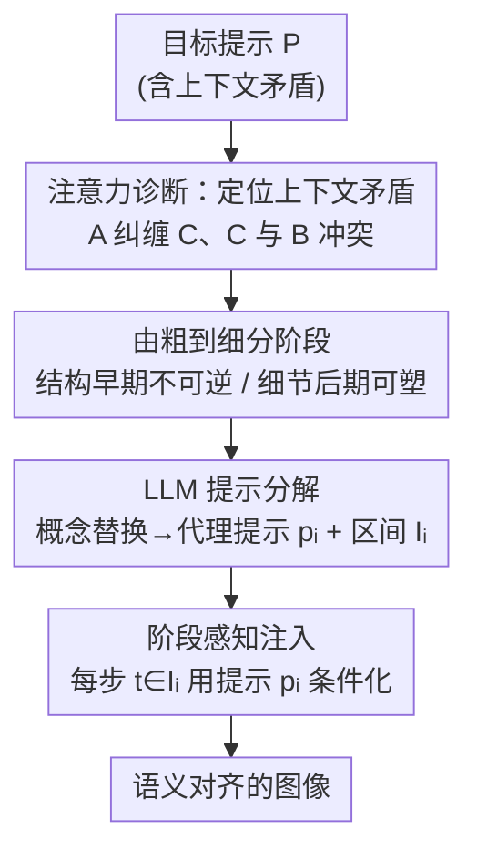

# Image Generation from Contextually-Contradictory Prompts

**会议**: CVPR 2026  
**论文**: [CVF Open Access](https://openaccess.thecvf.com/content/CVPR2026/html/Huberman_Image_Generation_from_Contextually-Contradictory_Prompts_CVPR_2026_paper.html)  
**代码**: 项目页 https://tdpc2025.github.io/SAP/（未见公开代码）  
**领域**: 图像生成 / 扩散模型  
**关键词**: 文生图、上下文矛盾、阶段感知提示、提示分解、LLM 引导扩散

## 一句话总结
文生图扩散模型在遇到"上下文矛盾"提示（如"蝴蝶在蜂巢里"，蝴蝶被模型与花强绑定从而与蜂巢冲突）时常常画错，本文提出免训练的 Stage-Aware Prompting（SAP）：用 LLM 把目标提示分解成一串"代理提示 + 时间步区间"，按扩散去噪"由粗到细"的进程在不同阶段注入不同提示，从而在不重训的情况下显著提升语义对齐。

## 研究背景与动机

**领域现状**：FLUX、SD3 等文生图扩散模型已能从自然语言生成高质量、多样的图像，但要让生成图和提示词在语义上精确对齐仍是难题，尤其当提示落在模型训练分布之外——即把两个各自合理、但组合起来罕见或不寻常的概念拼在一起时。

**现有痛点**：作者发现一类特定且被忽视的失败模式——给"一只蝴蝶在蜂巢里"，模型往往画成蝴蝶停在花上。问题不在于两个概念直接对立，而在于模型把"蝴蝶"和"花"在训练时学成了强关联，这个隐含的"花"与提示里的"蜂巢"冲突，于是模型悄悄忽略或扭曲了部分语义。现有改进（增强文本嵌入、改注意力、注意力图引导损失、退火 CFG）大多没专门处理这种由先验关联引发的矛盾。

**核心矛盾**：作者把它命名为**上下文矛盾（Contextual Contradiction）**：概念 A 与概念 B 矛盾，不是因为 A、B 语义直接相反，而是因为模型先验把 A 和某个 C 纠缠在一起，而 B 与 C 冲突（如"会喷东西的龙"被先验纠缠到"火"，与提示里的"水"冲突）。这本质上是深度模型"虚假相关 / 走捷径"在生成模型里的体现——模型依赖训练数据里统计强但语义误导的相关，而非稳健的组合推理。

**本文目标**：在不重训、不微调基座模型的前提下，让扩散模型能忠实生成这类"看似合理却违背模型隐藏偏见"的提示。

**切入角度**：作者抓住扩散去噪的一个已知性质——**由粗到细**：早期步确定低频结构（布局、姿态、形状），后期步才长出高频细节（纹理、身份）。既然不同概念在不同细节层次涌现，那矛盾的概念就可以**沿去噪阶段拆开**，在每个阶段只喂当前最相关、且不引发矛盾的信息。

**核心 idea**：用 LLM 把矛盾提示**分解成一序列代理提示**，每个代理提示匹配某个去噪阶段该涌现的属性、并刻意规避该阶段会出现的矛盾，再把它们按时间步区间逐段注入扩散过程——用"换皮"的方式先锁住正确的结构、再换回真实身份。

## 方法详解

### 整体框架
SAP（Stage-Aware Prompting）是一个免训练框架，由两部分组成：**(i) 提示分解**——用 LLM（GPT-4o）读目标提示 $P$，识别其中的上下文矛盾，输出一串代理提示 $\{p_1,\dots,p_n\}$ 和对应的时间步区间 $\{I_1,\dots,I_n\}$；**(ii) 阶段感知注入**——在去噪的每个时间步 $t$，用满足 $t\in I_i$ 的提示 $p_i$ 来条件化扩散模型。整套机制不改架构、不重训，直接嵌进现有推理流程，且兼容多种预训练扩散模型（论文在 FLUX.1[dev] 和 SD3.0 上都验证了）。

整个 pipeline 的灵魂在于"先用一个结构上合适、但不矛盾的代理把早期的不可逆结构定下来，再在后期换回真实概念去改可塑的细节"。以"一只狮子在倒立"为例，LLM 会输出：第 1–4 步用"一个人在公园倒立"（先把"倒立"这个姿态/布局结构定死，人天然会倒立，无矛盾），第 5–6 步过渡为"一个穿狮子服的人在公园倒立"，第 7–50 步才换成"一只狮子在公园倒立"（此时布局已锁定，只需把身份细节改成狮子）。

### 关键设计

**1. 上下文矛盾：用注意力图把"隐藏冲突"诊断出来**

要解决问题先得说清问题在哪。作者形式化定义：若模型先验把概念 A 与 C 纠缠，而 B 与 C 矛盾，则称 A 与 B **上下文矛盾**——区别于"直接矛盾"（一个女孩不能同时笑和哭）。这种冲突不写在提示字面上，而藏在模型学到的分布偏置里："鸭子"几乎总配水、"北极熊"总配雪。作者通过分析交叉注意力图来坐实这一点：文本 token 不仅注意到它字面对应的区域，还注意到上下文关联的元素——"howling（嚎叫）"这个 token 会同时点亮嘴和月亮，"dragon"即使没提火也会注意到火焰。更关键的是矛盾发生时的机制：给"a woman writing with a dart（用飞镖写字）"，'writing' 和 'dart' 都注意手/工具那块区域，但通过 log-ratio 图可见 'writing' 占主导、压制了 'dart'，于是飞镖被画成了笔。这条诊断既是问题定义，也是后续"为什么要分阶段换皮"的依据：根深蒂固的关联会盖过陌生的关联。

**2. 由粗到细的两个性质：不可逆的结构 + 可塑的细节**

这是整个方法成立的物理基础。扩散去噪是 coarse-to-fine 的：早期步定低频结构，后期步长高频细节。作者从中提炼两条观察——**(i) 细节的不可逆性**：随去噪推进，模型逐级"锁定"布局和整体形状，一旦定下就算和提示冲突也无法在后期翻盘；**(ii) 高频细节的可塑性**：早期高频细节尚不存在、不受提示影响，因此可以在早期灵活引导而不污染最终细节。论文用 $x_0$ 预测的可视化佐证（图 4）：直接用目标提示"嚎叫的狼和飞翔的蝙蝠在正午"，早期就锁死了夜晚和月亮的结构，与"正午"矛盾；而先用含"狗"和"鸟"的代理、再切回目标，既保住了正午布局（粗结构不可逆），又把身份适配成狼和蝙蝠（高频细节可塑）。这两条性质直接推出策略：**早期固定结构性决策，后期保留属性灵活性**。

**3. LLM 提示分解：概念替换 + 区间安排 + 显式推理**

针对"哪些概念矛盾、该在哪个阶段引入、用什么不冲突的替身"这些需要广泛世界知识的判断，作者交给 LLM（GPT-4o）来做。给定矛盾提示 $P$，LLM 输出代理提示序列及其时间步区间，每个代理 $p_i$ 要满足两点：(i) 保留 $P$ 中"在区间 $I_i$ 通常会成形的那些属性"的相关语义（因为细节不可逆，错过就补不回来）；(ii) 规避该阶段易出现的矛盾（利用高频细节的可塑性）。实现上用一个结构化提示模板，含指令文本、**20 个 in-context 示例**（既有需要分解的、也有无需分解的，让 LLM 学会泛化）、以及上下文矛盾的解释。最常用的策略是**概念替换（Concept Substitution）**：把冲突概念暂时换成一个结构上合适的代理，而不是简单省略——因为只在后期凭空引入一个没有占位的物体，会让它尺寸失真甚至被整个丢掉（图 6：雪人在第 5 步才引入就会变小）。此外，论文强制 LLM 先给一段简短**解释/推理**再产出分解，消融显示这一步对连贯的语义决策很关键（去掉掉点明显）。

**4. 阶段感知提示注入：把代理提示按区间喂进去噪**

有了 $\{p_1,\dots,p_n\}$ 和区间 $\{I_1,\dots,I_n\}$，注入就很直接：在每个时间步 $t$，选用满足 $t\in I_i$ 的提示 $p_i$ 去条件化 T2I 模型。这样去噪每一步看到的都是"与当前正在成形的细节层次相匹配、且不与模型先验冲突"的概念，从而逐步搭建图像、避开矛盾。这一步无需改架构、无缝接进现有推理。区间的选择很要紧（图 7）：太早把完整提示放进去会来不及解耦矛盾，太晚放又只改到细枝末节；不过实验也表明只要落在正确的粗阶段内，方法对区间边界的小幅扰动相当鲁棒。

### 一个例子：从"狮子倒立"到正确画面
目标提示"A lion is doing a handstand（一只狮子在倒立）"。狮子被先验绑定到"四脚着地/直立"等姿态，与"倒立"矛盾，直接生成往往画不出倒立。SAP 走一遍：
- **第 1–4 步**："A man is doing a handstand in the park"——用"人"作代理，人天然会倒立，早期把倒立的布局/姿态结构牢牢定下（不可逆阶段）。
- **第 5–6 步**："A man in a lion costume is doing a handstand in the park"——过渡，开始往身份上注入狮子的元素，但仍保住倒立结构。
- **第 7–50 步**："A lion is doing a handstand in the park"——结构已锁，此时换回真实目标，只改高频身份细节（把人变成狮子）。
最终得到一只真正在倒立的狮子，而非一只四脚着地的狮子被强行加了倒立标签。

## 实验关键数据

**实现**：基座 T2I 用 FLUX.1[dev]，提示分解用 GPT-4o，推理 $T=50$ 步，每条提示最多 3 个代理；另外用相同的 LLM 生成的代理/区间在 SD3.0 上复现以验证鲁棒性。
**基线**：FLUX、SD3.0、R2F（含 SD3.0 原版 / FLUX-schnell 官方 / 在 FLUX 上的复现三种设定）、Annealing Guidance、Ella、VL-DNP。
**数据集**：Whoops!（500 条反常识提示）、Whoops-Hard（作者从 Whoops! 里挑出的 100 条更难子集）、ContraBench（作者新建的 40 条专门刻画上下文矛盾的提示，ChatGPT 生成候选 + 人工筛选）。
**指标**：用 GPT-4o（VLM）给生成图打 1–5 分的提示对齐度，3 个固定种子平均，缩放到 20–100。

### 主实验

| 方法 | Whoops | Whoops-Hard | ContraBench |
|------|--------|-------------|-------------|
| SD3.0 | 82.63 | 55.73 | 57.5 |
| FLUX | 78.85 | 44.3 | 57.16 |
| Ella | 69.09 | 45.19 | 55.16 |
| Annealing | 79.59 | 59.06 | 58.33 |
| VL-DNP | 82.79 | 56.26 | 58.83 |
| R2F | 83.50 | 57.06 | 59.16 |
| R2F (schnell) | 79.58 | 54.80 | 59.33 |
| R2F (FLUX) | 48.68 | 32.80 | 25.33 |
| **SAP (SD3.0)** | **85.87** | **64.40** | 65.33 |
| **SAP (FLUX)** | 85.10 | 62.13 | **66.16** |

SAP 在三个基准上都优于所有基线。值得注意的是基座本身：SD3.0 在矛盾下对齐更强，FLUX 视觉质量更高，而 SAP 对两个基座都能提升——在 Whoops-Hard 上把 FLUX 从 44.3 抬到 62.13、把 SD3.0 从 55.73 抬到 64.40，提升幅度最大，正说明它专治"硬"矛盾。R2F 在 FLUX 上复现（R2F_FLUX）严重崩坏（25.33），印证其交替提示策略是为属性绑定设计、并不适配上下文矛盾。

**用户研究**：随机取 24 条提示，61 名用户、共 1464 次评估，SAP 对各基线的胜率（对齐 / 质量）：

| 对比 | 对齐胜率 | 质量胜率 |
|------|---------|---------|
| vs SD3 | 70% | 72% |
| vs FLUX | 81% | 63% |
| vs Ella | 81% | 74% |
| vs Annealing | 73% | 79% |
| vs R2F | 75% | 68% |

人类评估在对齐和质量两个维度都判 SAP 占优，补足了 VLM 指标对细微语义不一致和画质不敏感的短板。

### 消融实验

在 Whoops-Hard 上对提示分解的各设计逐一拆解（对齐分）：

| 配置 | 对齐 | 说明 |
|------|------|------|
| static | 44.3 | 退化为固定/不分解（≈ 基座 FLUX） |
| w/o in-context | 48.0 | 去掉 20 个 in-context 示例 |
| w/o reasoning | 46.46 | 去掉强制解释/推理 |
| 2 proxy | 60.26 | 限制最多 2 个代理 |
| **Full** | **62.13** | 完整方法（≤3 代理） |

**区间扰动鲁棒性**（保持代理提示不变，把区间边界在窗口 $w$ 内均匀平移）：

| 配置 | Whoops | Whoops-Hard | ContraBench |
|------|--------|-------------|-------------|
| FLUX | 78.85 | 44.3 | 57.16 |
| SAP | 85.10 | 62.13 | 66.16 |
| SAP (w=3, ±1 步) | 84.18 | 62.06 | 65.5 |
| SAP (w=5, ±2 步) | 81.46 | 58.46 | 62.5 |

### 关键发现
- **in-context 示例贡献最大**：去掉后 Whoops-Hard 从 62.13 暴跌到 48.0，几乎退回基座水平——LLM 没见过示例就不太会分解矛盾提示。强制推理同样关键（掉到 46.46），说明"先解释为什么矛盾再分解"能逼出更连贯的替换。
- **代理数 2→3 仍有收益**：限制 2 个代理已能拿到 60.26，但放开到 3 个对更难的情形多了一点灵活度，进一步到 62.13。
- **对区间边界不敏感、对阶段敏感**：±1 步几乎无影响，±2 步只轻微掉点（即便相对有效区间约 12 步已是不小扰动）。但把代理放错粗阶段（太早/太晚，见图 7）就会显著伤对齐——印证"信息引入的阶段"才是关键，而非精确步号。

## 亮点与洞察
- **把"虚假相关/走捷径"引到生成模型并给出可操作定义**：上下文矛盾这个概念（A 纠缠 C、C 与 B 冲突）既解释了一类常见生成失败，又用注意力 log-ratio 图给出了可视化证据，问题定义本身就很有价值。
- **用去噪的"时间轴"当解耦维度**：别人多在空间（区域分配）或注意力上做文章，本文巧在利用"粗结构不可逆、细节可塑"沿时间步把矛盾概念拆开——先用无矛盾的代理把结构钉死，再换回真身，思路干净且免训练。
- **LLM 当"导演"而非"画师"**：让 LLM 只负责识别矛盾、产出代理提示和时间区间，把生成交给扩散模型，分工清晰、即插即用，可迁移到任何带交叉注意力的 T2I 模型。
- **概念替换优于概念省略**：用结构合适的占位代理（人→穿狮子服的人→狮子）比"后期凭空插入"更稳，避免物体尺寸失真或被丢——这个"占位"细节对复用很有启发。

## 局限与展望
- **受限于基座能力**：方法只通过文本引导，无法控制基座本身就画不好的属性，如精确数量（六指手套）、精确朝向（猫影子反向）、上下颠倒的花束等（图 10 失败案例）。
- **依赖 LLM 的世界知识与分解质量**：识别矛盾、选替身、定区间全靠 LLM，若 LLM 误判矛盾或给出不合适的代理，整条链就会偏；in-context 示例（20 个、人工构造）也带有作者的策略偏置。
- **代理数被限到 ≤3**：对含多重叠矛盾的复杂提示，三个阶段可能不够细，论文未深入探讨更多代理或自适应代理数的情形。
- **展望**：作者提出下一步走向 VLM 与生成模型更紧耦合的复合架构，直接在生成过程中用 VLM 的世界知识解冲突，而非现在的"LLM 先规划、扩散后执行"两段式。

## 相关工作与启发
- **vs R2F**: R2F 也在时间步上交替提示，但它是为"属性绑定/强化罕见概念"设计，按预定义时间步切换，并不把提示与"语义特征在去噪中涌现的阶段"对齐，结果常产生融合了冲突元素的混合体；SAP 则显式按由粗到细阶段安排代理，专治上下文矛盾。
- **vs Annealing Guidance**: 它训练一个小 MLP 预测每步的 CFG 尺度做动态引导，需训练且非为矛盾设计；SAP 免训练，且针对的是先验关联引发的矛盾。
- **vs Ella / VL-DNP**: Ella 在 SD1.5 上微调增强文本表征、VL-DNP 用 VLM 引导的负向提示，两者都不专门处理"组合后才冲突"的上下文矛盾，在 Whoops-Hard 等硬基准上明显落后。
- **vs 多提示/区域条件化方法**: 既有工作多把子提示分配到不同空间区域或不同层的学习 token（个性化方向）；SAP 的区别是用多提示去**化解概念组合产生的内部语义张力**，且沿时间而非空间分配。

## 评分
- 新颖性: ⭐⭐⭐⭐⭐ "上下文矛盾"的定义 + 用去噪时间轴解耦矛盾的视角都很新，且有注意力证据支撑。
- 实验充分度: ⭐⭐⭐⭐ 三基准 + 多基线 + 用户研究 + 消融 + 区间鲁棒性，较全面；但代理数/复杂多矛盾的探索有限。
- 写作质量: ⭐⭐⭐⭐⭐ 从问题定义到机制分析（图 3/4）再到方法，逻辑链清晰、图示有力。
- 价值: ⭐⭐⭐⭐ 免训练、即插即用、可迁移到多种 T2I 模型，对实际提示对齐有直接帮助；上限受基座能力限制。

<!-- RELATED:START -->

## 相关论文

- [\[CVPR 2026\] Beyond Text Prompts: Precise Concept Erasure through Text–Image Collaboration](beyond_text_prompts_precise_concept_erasure_through_text-image_collaboration.md)
- [\[CVPR 2026\] Interpretable Prompts made Edit-Friendly: Token-to-Token Similarity Reduction in dLLMs for Edit-Friendly Hard Prompt Inversion](interpretable_prompts_made_edit-friendly_token-to-token_similarity_reduction_in_.md)
- [\[CVPR 2025\] Learning to Sample Effective and Diverse Prompts for Text-to-Image Generation](../../CVPR2025/image_generation/learning_to_sample_effective_and_diverse_prompts_for_text-to-image_generation.md)
- [\[ECCV 2024\] MultiGen: Zero-Shot Image Generation from Multi-modal Prompts](../../ECCV2024/image_generation/multigen_zero-shot_image_generation_from_multi-modal_prompts.md)
- [\[CVPR 2026\] The Image as Its Own Reward: Reinforcement Learning with Adversarial Reward for Image Generation](the_image_as_its_own_reward_reinforcement_learning_with_adversarial_reward_for_i.md)

<!-- RELATED:END -->
