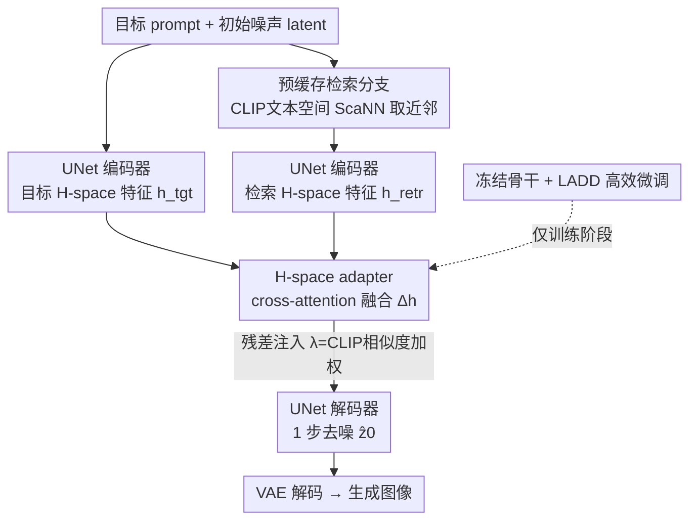

# ImageRAGTurbo: Towards One-step Text-to-Image Generation with Retrieval-Augmented Diffusion Models

**会议**: CVPR 2026  
**论文**: [CVF Open Access](https://openaccess.thecvf.com/content/CVPR2026/html/Qiu_ImageRAGTurbo_Towards_One-step_Text-to-Image_Generation_with_Retrieval-Augmented_Diffusion_Models_CVPR_2026_paper.html)  
**代码**: 待确认  
**领域**: 扩散模型 / 图像生成  
**关键词**: 检索增强生成, 少步扩散, 一步文生图, H-space, 对抗蒸馏

## 一句话总结
ImageRAGTurbo 把"检索增强生成（RAG）"搬进**一步扩散模型**：给定文本 prompt，先从数据库检索相关的"文本-图像对"，再用一个轻量的 H-space cross-attention adapter 把检索内容融进 UNet 去噪器的深层特征空间，从而在**几乎不增加延迟**（116.7ms vs 113.8ms）的前提下，把一步生成的文本对齐度（TIFA 0.779→0.801、CLIP +1.37%）拉到接近 50 步教师模型的水平。

## 研究背景与动机

**领域现状**：扩散模型是当前文生图的主流，但它"从随机噪声逐步去噪成图"的迭代采样天然慢——标准扩散通常要 25–50 步去噪，每一步都要跑一次昂贵的去噪网络前向，延迟高到没法用在实时/交互场景。为了加速，社区做了一致性模型（consistency models）、对抗蒸馏（adversarial distillation）等**少步模型**，把完整采样轨迹蒸馏到 1–4 步，极端情况下一步就把噪声直接映射成图。

**现有痛点**：少步蒸馏（尤其是一步）会**牺牲图像质量和 prompt 对齐**。论文举的例子很直观：prompt 是"水面上有艘船，背景有灯塔"，一步蒸馏模型常常**根本画不出"船"这个视觉概念**。此外，把少步模型从教师模型蒸馏出来本身就极其耗算力（动辄几百卡天），门槛很高。

**核心矛盾**：少步生成把"噪声→目标分布"这个映射压缩得太狠，模型没有足够的"中间步"去逐步把语义细节渲染清楚，于是质量与速度此消彼长。提升 prompt 对齐的常规思路是训练偏好模型（preference model），但要人工标注偏好数据，成本高。

**本文目标**：在**不牺牲少步模型速度**的前提下，提升其生成质量与文本对齐，并且让微调本身也足够廉价。

**切入角度**：作者借鉴 LLM 里的 RAG——既然"把语义相关的外部信息注入模型"能帮 LLM 答得更准，那把"检索到的相关图像"注入扩散去噪器，应该能**简化"噪声→目标分布"的映射难度**。关键观察是：UNet 去噪器最深层的 **H-space** 已经编码了"图像类别、物体是否存在及其属性"这类高层语义，直接在这里动刀，正好对症"少步模型画不出某个物体"的毛病。已有的检索增强图像生成（RAIG，如 RDM / ImageRAG / FineRAG）要么没针对少步、要么靠反复调用多模态 LLM 迭代精修（反而更慢），都没解决"快"这个核心诉求。

**核心 idea**：检索相关"文本-图像对"，把它们的 H-space 特征通过一个轻量 cross-attention adapter 融进目标去噪分支，用**检索内容补齐一步模型缺失的语义**，换来对齐度提升而几乎零延迟代价。

## 方法详解

### 整体框架
ImageRAGTurbo 在一个**冻结的一步扩散去噪器**上，挂一条"检索分支"和一个可训练的 H-space adapter，让检索到的参考图把缺失语义"喂"给主去噪分支。整个 pipeline 有两条并行分支（见原文 Fig. 2）：

- **去噪分支（标准）**：目标 prompt $p^{tgt}$ 经文本编码器 $\tau_\phi(\cdot)$ 得文本嵌入，连同初始 latent $z_t$ 一起送进 UNet 编码器 $f_\theta^{enc}$，得到目标 H-space 特征 $h_t^{tgt}$。
- **检索分支（预缓存）**：用目标文本嵌入去数据库查最近邻，拿回检索到的"文本-图像对" $(p^{retr}, x^{retr})$；图像经 VAE 编码成 $z_0^{retr}=\mathcal{E}(x^{retr})$，再连同 $\tau_\phi(p^{retr})$ 送进同一个 UNet 编码器（取 $t=0$，因为检索图是干净无噪的），得到检索 H-space 特征 $h_t^{retr}$。

两支的 H-space 特征在 adapter 里融合（cross-attention），产物 $\Delta h$ 以残差形式加回目标分支，再经 UNet 解码器 $f_\theta^{dec}$ 一步去噪出 $\hat{z}_0$，最后 VAE 解码成图像 $\hat{x}$。论文先用一个**免训练的直接注入**版本（Sec 3.2）验证"H-space 注入有效"这个假设，再把它升级成**可学习的 adapter**（Sec 3.3）作为最终方案；训练用**潜空间对抗蒸馏（LADD）**，骨干全冻结、只训 adapter + 解码器 LoRA。

### 关键设计

**1. 预缓存检索分支：用现成 CLIP 文本特征零额外成本地找参考图**

少步模型缺的是"具体该画什么"的语义线索。本设计在 **CLIP 文本特征空间**用 ScaNN 近似最近邻搜索，给目标 prompt 找回若干相关"文本-图像对"。妙处在于它**复用了 Stable Diffusion 本来就要算的 OpenCLIP-ViT-H-14 文本特征**做检索 key，所以检索不引入额外文本编码开销；实测检索只花 1.9ms/图。检索库是 OpenImage 的 0.63M 文本-图像对。检索到的图先用 VAE 编码、再过 UNet 编码器抽 H-space 特征，这一步可**预缓存**（图像库是离线固定的），推理时省掉重复编码。这样"找参考"这件事被压到几乎零延迟，为后面"用参考补语义"打底。

**2. H-space 直接注入：用球面插值验证"注入即有效"，但暴露了调参难题**

这是论文的可行性验证（motivation），也解释了为什么最终要换成 adapter。把检索特征 $h_t^{retr}$ 和目标特征 $h_t^{tgt}$ 沿**球面归一化插值（slerp）**混合：

$$h_t^{blend}=\frac{\sin[(1-w)\Omega_t]}{\sin\Omega_t}\,h_t^{retr}+\frac{\sin[w\Omega_t]}{\sin\Omega_t}\,h_t^{tgt}$$

其中 $\Omega_t=\arccos(\langle h_t^{tgt}, h_t^{retr}\rangle)$ 是两特征夹角，$w\in(0,1)$ 控制混合强度。用 slerp 而非线性插值，是因为测地线路径给出更平滑的语义过渡，能避免"相变（phase transition）"式的突变。验证结果很有说服力：固定 $w=0.8$ 时 TIFA 从 0.779 微升到 0.781；若对**每个 prompt**在 $\{0.1,0.2,\dots,0.9\}$ 里暴力搜出最优 $w^*$，TIFA 直接冲到 0.816，**反超 50 步无检索的 SD**。但这条路有致命缺陷——每个 prompt 的最优混合强度依赖检索相关度、prompt 语义、生成难度等隐因子，是个**病态（ill-posed）问题**，推理时逐 prompt 暴搜彻底抵消了少步模型的速度优势。这正是要把"手动调 $w$"换成"自动学融合"的动机。

**3. H-space adapter：用 cross-attention 自动学融合，并按 CLIP 相似度自适应加权**

针对设计 2 的"暴搜 $w$ 不可行"，本设计引入一个可训练 adapter $g_\varphi(\cdot,\cdot)$，用 **cross-attention** 自动学习检索特征与目标特征之间的相关性：

$$g_\varphi(h_t^{tgt}, h_t^{retr})=\mathrm{softmax}\!\left(\frac{QK^\top}{\sqrt{d_k}}\right)V,\quad Q=W_Q h_t^{tgt},\; K=W_K h_t^{retr},\; V=W_V h_t^{retr}$$

即**目标特征当 query、检索特征当 key/value**——让"我想画什么"去检索特征里挑"该借鉴什么"。adapter 输出以残差形式加回目标特征：

$$h_t^{retr}=h_t^{tgt}+\lambda\,\underbrace{g_\varphi(h_t^{tgt}, h_t^{retr})}_{\Delta h_t}$$

其中加权系数 $\lambda$ 不是固定超参，而是**取检索文本与目标文本 CLIP 嵌入的余弦相似度**——直觉是检索内容越贴合目标 prompt，就该贡献越多；不相关的检索就自动被压低，避免"乱借参考"污染生成。adapter 仅 36M 参数（占总模型 4%），推理只多 1ms 去噪延迟，把设计 2 的"逐 prompt 暴搜"彻底替换成"一次前向自动融合"。

**4. 冻结骨干 + 潜空间对抗蒸馏：只训 adapter 与解码器 LoRA 的廉价微调**

为了让微调本身也廉价，本设计**冻结教师 $f_{\theta^*}$ 与少步学生 $f_\theta$ 的全部骨干**，可训练的只有 H-space adapter，外加用 **LoRA** 轻量微调学生解码器（帮助把融合后的特征翻译成最终图像）。训练采用**潜空间对抗蒸馏（LADD）**而非自一致性训练，因为前者在一步场景下经验表现更好，且在 latent $\mathcal{Z}$ 空间做对抗比像素空间更省。判别器 $D$ 由**冻结的教师 UNet 编码器** + 若干可训练投影层构成，借鉴 DiffusionGAN 的思路去区分一对加噪 latent $(\hat{z}_s, z_s)$（学生输出 vs 教师输出），且判别用的时间步从完整 $N$ 步里均匀采样，让它能跨各噪声级别判别。判别器投影层用**谱归一化（spectral normalization）**稳定训练——相比梯度惩罚不需要二次反传，更省算力。这套设计让整套微调只需训练极小一部分参数。

### 损失函数 / 训练策略
对抗目标用 hinge loss。判别器目标 $\mathcal{L}_{adv}^D$ 把教师样本判为真、学生样本判为假；生成器（学生）目标 $\mathcal{L}_{adv}^G=-\sum_k \mathbb{E}_{z_0}[D_k(\hat{z}_s, \tau_\phi(p^{tgt}))]$ 反向骗判别器。在对抗损失之外加两个辅助损失稳训练、提质量：**score distillation 损失**（$\hat{z}_0$ 与 $z_0$ 间的 smooth L1）与**latent LPIPS 损失**（在随机可微增广下、用 VGG16 嵌入网络算的潜空间感知损失）。总目标为

$$\mathcal{L}=\mathcal{L}_{adv}+\alpha\mathcal{L}_{distill}+\beta\mathcal{L}_{latentLPIPS},\quad \alpha=2.5,\;\beta=1.0$$

训练数据是合成+真实混合：用教师 SD v2-1-base（CFG 7.5）在 LAION-Aesthetic 6.25+ 的约 300 万 prompt 上生成合成图，再加 LAION-Aesthetic 5.5+ 里筛出的 50 万张真实图（过滤掉分辨率 <1024×1024），统一缩到 512×512 经 VAE 编成 64×64 latent。在 **64× NVIDIA L40S**、总 batch 2048、AdamW（lr $1\times10^{-5}$）下，对 1 步 SD Turbo 微调 20K 次迭代，约耗时一周。

## 实验关键数据

### 主实验

MS-COCO 基准（5000 文本-图像对，FID 测真实感、CLIP 测对齐，NFE = 去噪网络前向次数）：

| 模型 | NFE | FID↓ | CLIP↑ |
|------|-----|------|-------|
| Stable Diffusion v1-5 | 50 | 24.38 | 0.319 |
| Stable Diffusion v2-1（教师） | 50 | 25.33 | 0.330 |
| Latent Consistency Model | 4 | 36.52 | 0.307 |
| Stable Diffusion Turbo v2-1（基线） | 1 | 26.04 | 0.319 |
| RDM（检索增强） | 50 | 27.60 | 0.293 |
| **ImageRAGTurbo（本文）** | **1** | **25.59** | **0.323** |

一步 ImageRAGTurbo 相比同为一步的 SD Turbo，CLIP 高 1.37%、FID 更低；大幅超过 4 步 LCM；逼近 50 步教师（FID 仅差 1.03%、CLIP 差 2.1%）；相比同样检索增强但 50 步的 RDM，CLIP 高出约 10%。

TIFA 基准（4081 prompt、12 类元素，TIFA 用 VQA 测忠实度、AES 测美学）：

| 模型 | NFE | AES↑ | TIFA↑ |
|------|-----|------|-------|
| Stable Diffusion v1-5 | 50 | 5.79 | 0.768 |
| Stable Diffusion v2-1（教师） | 50 | 6.04 | 0.811 |
| Latent Consistency Model | 4 | 5.80 | 0.764 |
| Stable Diffusion Turbo v2-1（基线） | 1 | 5.85 | 0.779 |
| RDM（检索增强） | 50 | 5.40 | 0.725 |
| **ImageRAGTurbo（本文）** | **1** | **5.88** | **0.801** |

一步 ImageRAGTurbo 比一步 SD Turbo 的 TIFA 高 2.2%、美学略升；比 4 步 LCM 高 3.7%；比 50 步教师整体仅低约 1.2%，且在 object、location、activity、material 等部分类别上**追平甚至略超**教师（见原文 Fig. 5）；比 RDM 的 TIFA 高 7.6%、美学也明显更好（5.88 vs 5.40）。

### 消融 / 分析实验

H-space 直接注入（免训练，Sec 3.2）与效率分解，可视为对"注入策略"与"延迟代价"的分析：

| 配置 | 关键指标 | 说明 |
|------|---------|------|
| 无检索基线（一步 SD Turbo） | TIFA 0.779 | 起点 |
| 直接注入，固定 $w=0.8$ | TIFA 0.781 | 免训练即有微弱提升，验证 H-space 注入有效 |
| 直接注入，逐 prompt 最优 $w^*$ | TIFA 0.816 | 反超 50 步 SD，但需推理时暴搜，不可行 |
| H-space adapter（本文最终） | TIFA 0.801 | 一次前向自动融合，无需暴搜 |
| 延迟分解（adapter 版） | 116.7ms = 检索 1.9ms + 去噪 114.8ms | adapter 36M 参数（占 4%），仅多 1ms 去噪 |

### 关键发现
- **H-space 注入的天花板很高但难落地**：逐 prompt 暴搜 $w^*$ 能把 TIFA 推到 0.816（超 50 步教师），说明"检索内容里确实藏着补齐语义的有效信号"；但最优混合强度是病态问题，只能靠可学习 adapter 把这部分潜力以"一次前向"的代价兑现（落到 0.801）。
- **几乎零延迟代价是核心卖点**：总推理 116.7ms 与 SD Turbo 的 113.8ms 基本持平（仅 +2.5% 开销），却换来约 3% 的 TIFA 提升；相比 50 步教师（2960ms）约 **25× 加速**而 TIFA 仅降 1.2%；相比 4 步 LCM（220.6ms）则又快又好（TIFA 高 3.7%、延迟少约 47%）。
- **加权系数 $\lambda$ 用 CLIP 相似度而非固定值**很关键：让相关检索多贡献、不相关检索少干扰，是 adapter 稳定起效的设计点之一。

## 亮点与洞察
- **把 RAG 真正带进"一步"扩散**：此前 RAIG（RDM/ImageRAG/FineRAG）要么不针对少步、要么靠反复调多模态 LLM 迭代精修反而更慢；本文是首个面向少步、且训练与推理都讲究效率的检索增强方案，思路上"用外部检索补齐被蒸馏掉的语义"很顺。
- **先免训练验证、再可学习落地**的研究节奏值得借鉴：Sec 3.2 用 slerp 直接注入证明"H-space 注入有效且天花板高"，Sec 3.3 再用 cross-attention adapter 解决"暴搜 $w$ 不可行"，动机链条干净，读者能清楚看到"为什么要 adapter"。
- **在哪儿动刀很讲究**：选 UNet 最深层 H-space（决定物体存在/属性等高层语义），正好对症"一步模型画不出某物体"的毛病；而不是去改低层细节特征。这个"按语义层级选注入点"的思路可迁移到其他需要语义可控的生成任务。
- **工程上的省钱细节**：复用 SD 自带 CLIP 文本特征做检索 key（零额外编码）、检索 H-space 特征可预缓存、判别器用谱归一化省掉二次反传、解码器只用 LoRA——一连串"省算力"设计让"周级单次微调"成为可能。

## 局限与展望
- **检索方式较粗**：当前用 CLIP 文本相似度检索，作者也承认更细粒度的组合式检索（compositional retrieval）是值得探索的方向；CLIP 检索对"计数、空间关系"这类组合语义未必能取回最合适的参考。
- **只验证了 UNet 架构**：方法绑定在 UNet 的 H-space 上，是否能迁移到 Diffusion Transformer（DiT）尚未验证——作者指出 DiT 深层 patch/attention 也有结构化语义，理论上可类比，但需实验确认。
- **绝对质量仍略逊教师**：一步模型 TIFA 0.801 仍低于 50 步教师 0.811，且 FID/CLIP 也有小幅差距；它换来的是 25× 速度，本质是"质量-速度"权衡而非全面超越。
- **训练成本并非真"轻"**：虽然只训 adapter+LoRA，但仍需 64× L40S 跑约一周、依赖 ~350 万合成+真实图，复现门槛不低。⚠️ 文中正文一处提到美学 "5.88 vs 5.83"、与 Table 2 的基线 5.85 略有出入，以表格数值为准。

## 相关工作与启发
- **vs 少步蒸馏（LCM / SD Turbo / ADD-LADD）**：它们靠自一致性或对抗蒸馏把轨迹压到 1–4 步，但常画不全 prompt 里的物体；本文不改蒸馏本身，而是**外挂检索分支补语义**，在一步基线上把对齐度顶上去，几乎不加延迟。
- **vs RDM（检索增强扩散）**：RDM 把检索到的 CLIP 邻居嵌入作为 50 步 LDM 的条件；本文把检索特征注入 H-space 并用 adapter 自动融合，且专为**一步**优化——TIFA 高 7.6%、CLIP 高约 10%，且只需 1 步而非 50 步。
- **vs ImageRAG / FineRAG（MLLM 动态检索精修）**：它们靠多模态 LLM 反复评估、迭代精修，质量好但慢，违背"快"的初衷；本文用预缓存检索 + 轻量 adapter，把检索增强压进单步前向。
- **可迁移启发**："在语义最集中的深层特征空间做 cross-attention 融合外部知识、并按相似度自适应加权"这一范式，可迁移到可控生成、个性化生成、风格迁移等需要"按需借鉴外部参考"的任务。

## 评分
- 新颖性: ⭐⭐⭐⭐ 首个面向一步扩散、且训练/推理都讲效率的检索增强方案，H-space adapter 思路清晰
- 实验充分度: ⭐⭐⭐⭐ 两大基准+效率分析+免训练消融齐全，但缺更系统的 adapter 内部消融与更多架构验证
- 写作质量: ⭐⭐⭐⭐ "先免训练验证、再可学习落地"的动机链很顺，公式与图配合好
- 价值: ⭐⭐⭐⭐ 在几乎零延迟代价下显著提升一步生成对齐度，对实时文生图部署有实用价值

<!-- RELATED:START -->

## 相关论文

- [\[CVPR 2026\] InverFill: One-Step Inversion for Enhanced Few-Step Diffusion Inpainting](inverfill_one-step_inversion_for_enhanced_few-step_diffusion_inpainting.md)
- [\[CVPR 2026\] PixelRush: Ultra-Fast, Training-Free High-Resolution Image Generation via One-step Diffusion](pixelrush_ultrafast_trainingfree_highresolution_im.md)
- [\[CVPR 2026\] Extending One-Step Image Generation from Class Labels to Text via Discriminative Text Representation](emf_meanflow_text_to_image.md)
- [\[AAAI 2026\] TruthfulRAG: Resolving Factual-level Conflicts in Retrieval-Augmented Generation with Knowledge Graphs](../../AAAI2026/image_generation/truthfulrag_resolving_factual-level_conflicts_in_retrieval-augmented_generation_.md)
- [\[CVPR 2026\] Bridging Fidelity-Reality with Controllable One-Step Diffusion for Image Super-Resolution](bridging_fidelity-reality_with_controllable_one-step_diffusion_for_image_super-r.md)

<!-- RELATED:END -->
