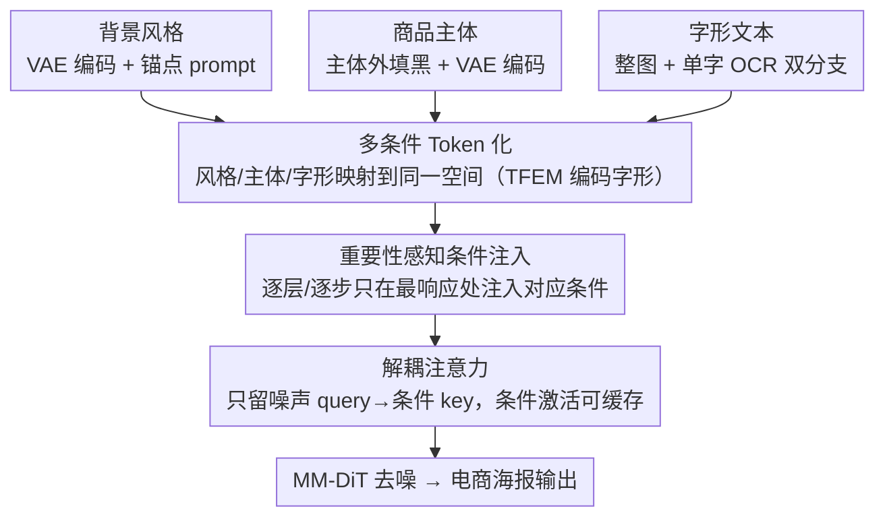

# InnoAds-Composer: Efficient Condition Composition for E-Commerce Poster Generation

**会议**: CVPR 2026  
**arXiv**: [2603.05898](https://arxiv.org/abs/2603.05898)  
**代码**: 无  
**领域**: 图像生成 / 可控生成  
**关键词**: 电商海报生成, 多条件合成, MM-DiT, 文字渲染, 条件重要性分析

## 一句话总结

提出 InnoAds-Composer，一个基于 MM-DiT 的单阶段电商海报生成框架，通过统一 token 化将商品主体、字形文本和背景风格三类条件映射到同一空间，结合文本特征增强模块（TFEM）和重要性感知条件注入策略，在保持高质量生成的同时显著降低推理开销。

## 研究背景与动机

电商海报生成需要同时满足**商品保真度、文字准确性和风格一致性**三个目标，但现有方法存在明显不足：

**多阶段流水线不可靠**：先合成场景再渲染文字的方案导致风格不一致和主体保真度下降

**中文文字渲染困难**：单阶段方法难以准确渲染复杂脚本和小字形

**风格控制依赖 prompt**：容易偏离全局风格或语义约束

**训练数据稀缺**：缺乏包含主体+文字+风格联合标注的数据集

**核心 gap**：现有方法无法在单模型中端到端地联合控制背景风格、商品主体和文字三类条件，且多条件 token 拼接引发注意力的二次方复杂度膨胀。

## 方法详解

### 整体框架

电商海报要同时管好商品保真、文字准确和风格统一三件事，过去要么拆成「先画场景再渲染文字」的多阶段流水线（风格容易脱节），要么硬塞进单阶段又渲染不好中文小字。InnoAds-Composer 走单阶段路线，建在 MM-DiT 骨干上，把商品主体、字形文本、背景风格三类条件统一 token 化后一起送进同一个模型；再借「不同条件在不同层/时间步重要性不同」这一观察做选择性注入，并裁掉冗余的注意力路径，从而在不掉质量的前提下把推理开销压下来。

### 关键设计

**1. 多条件 Token 化：把风格、主体、字形映射到同一空间**

三类条件形态差别很大，要让单模型统一处理就得先统一表示。背景风格走 VAE 编码 + patchify 得到视觉 token $h^i$，或用纯文本 token $h^p$，再以固定锚点 prompt $h^{p_0}$ 组合成 $h^b = \mathcal{C}(h^i, h^{p_0})$；商品主体则把主体外区域填黑形成 mask，VAE 编码后得 $h^s$，从源头抑制背景泄漏。字形最难，作者上了 TFEM 双分支：分支 1 把整图字形 VAE 编码得 $h^{c1}$，分支 2 把单字裁出来过 OCR backbone，并叠加绝对位置、字号、局部位置三重位置编码得 $h^{c2}$，最后用轻量字符编码器融合 $h^c = \mathbf{GlyphEnc}(h^{c1}, h^{c2})$——正是这个对小字形和复杂脚本敏感的分支让中文渲染稳住。

**2. 重要性感知条件注入：只在条件最被需要的地方注入它**

把三类条件 token 全程拼在序列里，注意力是二次方膨胀，纯属浪费。作者先对预训练全条件模型做诊断，逐层 $b$、逐时间步 $t$ 量化每类条件的重要性：

$$S_{ci}(b,t) = \mathbf{Mean}(A^{b,t,c} \odot mask_{ci})$$

结果三类条件呈明显的非均匀互补：背景风格主导早期层/早期步，主体在中深层形成高强度带，字形在中层到后期步渐增。据此只在最响应的位置注入对应条件 token（默认保留风格 40%、主体 50%、字形 20%），有效序列大幅缩短。

**3. 解耦注意力：砍掉条件→噪声这条冗余路径**

条件 token 在去噪过程中演化很慢，让条件 query 反过来去看噪声 key 基本是白算。于是只保留噪声 query→条件 key 的路径：

$$O_n = \mathbf{Attn}(Q_n, [K_n; K_{ci}], [V_n; V_{ci}])$$
$$O_{ci} = \mathbf{Attn}(Q_c, K_{ci}, V_{ci})$$

这样条件分支不再依赖时间步，激活可以预计算并缓存复用，每步推理只多出主流 attention 的开销。

### 损失函数 / 训练策略

**两阶段训练**：Stage I 保留全部条件 token 训练完整海报生成器；Stage II 按重要性裁剪 token 并微调，且时间步采样按全局重要性图的质量分布加权，缓解裁剪带来的性能下降。

## 实验关键数据

### 主实验

InnoComposer-Bench 评测（300样本）：

| 方法 | Sen. Acc↑ | NED↑ | DINO↑ | IoU↑ | CSD↑ | FID↓ |
|------|----------|------|-------|------|------|------|
| Flux-Kontext | - | - | 0.831 | 0.793 | 0.573 | 76.76 |
| PosterMaker | 0.765 | 0.848 | 0.916 | 0.954 | - | 60.55 |
| Qwen-Image-Edit | 0.831 | 0.960 | 0.922 | 0.903 | 0.722 | 69.86 |
| Seedream 4.0 | 0.865 | 0.972 | 0.864 | 0.837 | 0.700 | 64.21 |
| **Ours (Stage I)** | **0.857** | **0.976** | **0.923** | **0.972** | **0.729** | **54.39** |
| Ours (Stage II) | 0.847 | 0.969 | 0.914 | 0.960 | 0.727 | 55.24 |

效率对比：

| 方法 | Latency(s) | FLOPs(T) | Memory(G) |
|------|-----------|----------|-----------|
| Flux-Kontext | 76.02 | 218.45 | 55.29 |
| Ours (Stage I) | 55.87 | 165.56 | 39.71 |
| **Ours (Stage II)** | **47.32** | **135.25** | **39.41** |

### 消融实验

| 配置 | 关键指标 | 说明 |
|------|---------|------|
| w/o TFEM | Sen. Acc 下降约5% | 文字渲染质量明显退化 |
| 随机裁剪 vs 均匀裁剪 vs 重要性裁剪 | 重要性裁剪远优于前两者 | 字形可承受80%裁剪，主体~50%，风格~60% |
| Stage I vs Stage II | 质量微降但效率大增 | Latency 降低37.8%，FLOPs 降低38.1% |

### 关键发现

- Stage I 在几乎所有指标上取得最佳，FID 54.39 大幅领先所有开源和商业竞品
- Stage II 牺牲极少质量换取近40%推理加速，体现了选择性注入的高效性
- TFEM 的双分支字形编码对中文渲染尤为关键

## 亮点与洞察

- **条件重要性可视化**：首次系统分析 MM-DiT 中不同条件在层/时间步上的重要性分布，揭示非均匀互补模式
- **解耦注意力+条件缓存**：条件分支不依赖时间步，可预计算并缓存，推理开销仅增加主流 attention
- **配套数据集 InnoComposer-80K**：首个包含主体+文字+风格联合标注的电商海报数据集

## 局限与展望

- 训练数据由合成管线构建，背景风格的多样性可能受限于生成模型质量
- 重要性分析基于全条件预训练模型的固定 attention pattern，是否可学习动态路由值得探索
- 缺乏对视频海报或动态内容的扩展

## 相关工作与启发

- **Flux 系列**：基础模型提供 text-to-image 能力，本文在其上构建多条件控制
- **PosterMaker**：先前海报生成方法，可生成主体+文字但风格一致性差
- **Seedream 4.0**：闭源商业模型，文字能力强但"复制粘贴"式风格迁移

## 评分

- **新颖性**: ★★★★☆ — 重要性感知注入和解耦注意力的组合设计有创新
- **技术深度**: ★★★★☆ — 条件分析系统、TFEM 设计完善
- **实验充分度**: ★★★★☆ — 多维度指标+效率分析+消融，但测试集仅300样本
- **实用性**: ★★★★★ — 电商场景直接可用，效率提升显著

<!-- RELATED:START -->

## 相关论文

- [\[CVPR 2026\] SimplePoster: A Simple Baseline for Product Poster Generation](simpleposter_a_simple_baseline_for_product_poster_generation.md)
- [\[CVPR 2026\] DynFusion: Rethinking Condition Fusion for Adaptive Multi-Conditional Text-to-Image Generation](dynfusion_rethinking_condition_fusion_for_adaptive_multi-conditional_text-to-ima.md)
- [\[CVPR 2026\] Scone: Bridging Composition and Distinction in Subject-Driven Image Generation via Unified Understanding-Generation Modeling](scone_bridging_composition_and_distinction_in_subject-driven_image_generation_vi.md)
- [\[CVPR 2026\] SkyReels-Text: Fine-Grained Font-Controllable Text Editing for Poster Design](skyreels-text_fine-grained_font-controllable_text_editing_for_poster_design.md)
- [\[CVPR 2026\] PosterOmni: Generalized Artistic Poster Creation via Task Distillation and Unified Reward Feedback](posteromni_generalized_artistic_poster_creation_via_task_distillation_and_unifie.md)

<!-- RELATED:END -->
