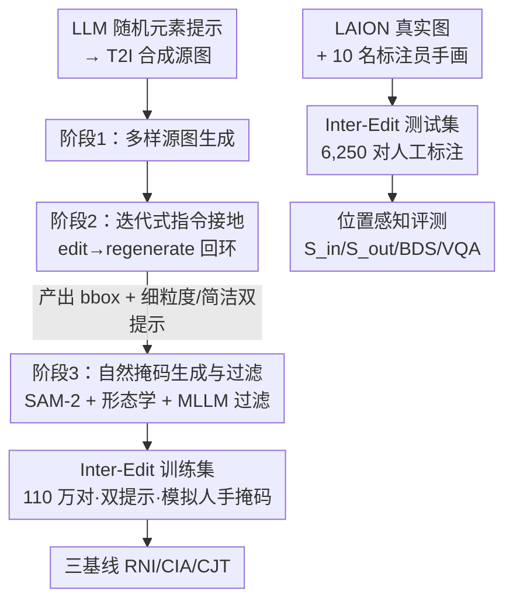

# Inter-Edit: First Benchmark for Interactive Instruction-Based Image Editing

**会议**: CVPR 2026  
**论文**: [CVF Open Access](https://openaccess.thecvf.com/content/CVPR2026/html/Liu_Inter-Edit_First_Benchmark_for_Interactive_Instruction-Based_Image_Editing_CVPR_2026_paper.html)  
**代码**: https://github.com/Delong-liu-bupt/Inter-Edit  
**领域**: 图像编辑 / 扩散模型 / 数据集与基准  
**关键词**: 交互式图像编辑, 指令编辑, 涂鸦引导, 数据生成 pipeline, 位置感知评测

## 一句话总结
针对"纯文本说不准位置、精确 mask 又太累"的图像编辑困境，本文提出 I3E 任务（简洁指令 + 不精确空间涂鸦），构建了百万级自动合成训练集 Inter-Edit、6,250 条人工标注测试集和一套位置感知评测指标，并给出 RNI/CIA/CJT 三个基线，在交互式编辑上大幅超越现有 SOTA（含闭源系统）。

## 研究背景与动机

**领域现状**：可控图像编辑目前有三大范式——指令驱动（InstructPix2Pix 一系，用自然语言描述要改什么）、拖拽操控（在物体上拖点改变形状/姿态）、mask 重绘（用户画掩码框定编辑区做 inpainting）。

**现有痛点**：三条路各有死穴。**指令法**直观但语言天生不擅长描述空间位置，"把书加在第二个苹果下面"这种定位经常失败；**拖拽法**只能形变已有内容，做不了"增删物体"这类语义编辑；**mask 重绘**虽然能精确控区，但结果质量对 mask 几何形状极度敏感——要想边界自然融合，用户画的 mask 往往得比目标物体大一圈，既费力又容易丢原图细节、留下生硬边界。

**核心矛盾**：语义灵活性、精确空间控制、自然直观的用户体验三者无法兼得。指令法牺牲了控制、mask 法牺牲了易用性和自然度。更深一层，现有大规模数据集为了拿到 mask 普遍直接用分割模型，而分割输出是像素级、碎片化的，和"用户心里那个大致区域"并不一致——数据集实际上是为分割而非为编辑优化，偏离了以用户为中心的初衷。

**本文目标**：定义一个新任务，让用户只需给一句简短指令 + 一笔粗糙涂鸦就能完成精确语义编辑；并解决配套缺失——没有合适训练数据、没有能反映"模糊 mask"的评测基准、没有位置感知的指标。

**切入角度**：既然真实用户画的从来不是像素对齐的精确 mask，那训练数据就不该用分割对齐的 mask；要刻意模拟"不精确、人手画"的掩码，让模型学会从模糊空间意图里推断并把编辑无缝融进背景。

**核心 idea**：用"简洁文本 + 不精确空间引导"替代"精确文本"或"精确 mask"，并造一条全自动 pipeline 量产这种带模拟人工掩码的训练对，配上人工测试集和位置感知指标，把整个新任务做成可复现的基准。

## 方法详解

### 整体框架
本文严格说不是"提出一个新模型"，而是把一个新任务（I3E）连同它的数据、基准、指标、基线一整套搭起来。三大支柱：(1) 一条三阶段全自动 pipeline 合成 110 万训练对；(2) 一套以"模拟真实用户标注"为目标的掩码生成与过滤策略；(3) 一组位置感知评测指标 + 三个基线模型把任务跑通。

数据 pipeline 的关键不是"会调用 T2I/MLLM"，而是它特意制造**双提示（dual-prompt）**和**非分割对齐的自然掩码**——这是 I3E 区别于以往编辑数据集的命门，所以适合用一张流程图把三阶段串清楚。

### 关键设计

**1. I3E 任务定义：用"简洁指令 + 不精确涂鸦"取代精确文本或精确 mask**

I3E（Interactive Instruction-based Image Editing）是本文一切的根基。它要求模型从一句简短指令（如 "Put a bird here"）和一笔粗糙的手画区域里，推断用户的模糊空间意图，并把编辑结果与背景无缝调和。这直接打中前述核心矛盾：指令法定位不准、mask 法负担过重——I3E 把"定位"交给一笔随手涂鸦（不必像素对齐），把"改什么"交给简短文本，让用户既省力又能精确控区。与 inpainting 的本质区别在于：I3E 做**全图生成**而非只重绘掩码内像素，因此能自然传播光照、阴影、反射等掩码外的连带变化，而不是在 mask 边界硬接出一圈伪影。

**2. 三阶段"edit-then-regenerate"数据 pipeline：把模糊定位变成可监督的 bbox + 双提示**

要训 I3E 模型，需要海量"(源图, 简洁指令, 粗糙区域, 编辑图)"四元组，但人工根本造不出百万级。本文设计全自动三阶段流水线（图 2a）：

- **阶段 1·多样源图生成**：用 LLM 配多种随机元素生成多样化合成提示，喂给 T2I 模型产出初始源图，保证题材足够杂。
- **阶段 2·迭代式指令接地（核心创新）**：MLLM 先针对源图、从 Local/Remove/Add/Texture 四类编辑里随机选一类生成编辑提示，交给 Qwen-Image-Edit-2509（Q-Edit）执行。作者观察到一个关键不对称——**编辑模型成功执行的成功率，低于 MLLM 事后准确描述一张"已完成编辑"的能力**。于是引入 "Regenerate" 步骤：把 (源图, 编辑图) 这一对**回喂** MLLM，让它重新审视这次编辑，先定位变化区域的精确 bounding box，再同时产出两版提示——一版细粒度（给纯指令编辑用）、一版简洁（给 I3E 配区域信息用）。这一步把"模型自己也说不准的模糊定位"变成了有监督信号的 bbox + 双提示。
- **阶段 3·自然掩码生成与过滤**：用阶段 2 的 bbox 引导 SAM-2 分割编辑区，但原始像素级 mask 碎且不符合人手习惯，于是用形态学操作（腐蚀/膨胀）、膨胀、高斯模糊等多步后处理，把它"磨"成平滑、像人随手画的掩码。注意这里生成的 mask 只覆盖主编辑主体、不含主体在别处引发的连带变化，正好贴合真实用户标注习惯。最后用一个强 MLLM 做评估器，以 CoT 先详细分析再判成败，成功样本还要再输出一个 bbox 以压低误判。

**双提示系统**是这条 pipeline 最终交付的价值：每条样本既有 17 词左右的细粒度提示（纯文本编辑场景用），又有约 8 词的简洁提示（配掩码做 I3E 用），同一份数据服务两种范式。

**3. 用户中心的人工测试集：让"模糊 mask"被真实建模，而非用模型 mask 自评**

作者明确指出，模型生成的 mask 未必符合用户真实标注习惯，所以测试集（图 2b）改为**全人工**。源图主要采自 LAION，并刻意设计四类挑战子集：艺术风格图、低分辨率图（<480px）、低美学分图、歧义编辑（图里有多个同类物体，定位天然有歧义）。10 名不同性别年龄的标注员先判断 Q-Edit 生成的编辑图是否符合预期，理解意图后**凭直觉手画掩码**并据此写编辑指令——刻意把"人会怎么粗略标"这件事保留进基准，避免用模型自产 mask 自评带来的循环偏差。

**4. 位置感知评测指标：把"区内改对 + 区外保住 + 边界自然"拆成可量化分数**

传统指标（L1/SSIM/CLIP score）要么和人类感知弱相关，要么在空间推理上已被证明有缺陷，无法刻画 I3E 的双目标（区内忠实执行编辑、区外保留并自然传播连带变化）。本文设一套指标，记源图 $I_s$、编辑图 $I_e$、GT 图 $I_{gt}$、二值掩码 $M$：

- **区内忠实度 $S_{in}$ 与区外保持度 $S_{out}$**：借助 Alpha-CLIP（其视觉编码器 $E_\alpha(I,A)$ 在编码时强调掩码区），算余弦相似度：

$$S_{in} = S_{\cos}\big(E_\alpha(I_e, M),\, E_\alpha(I_{gt}, M)\big), \qquad S_{out} = S_{\cos}\big(E_\alpha(I_e, 1-M),\, E_\alpha(I_s, 1-M)\big)$$

$S_{in}$ 在掩码内比编辑图与 GT，衡量"该改的地方改对了没"；$S_{out}$ 在掩码外比编辑图与源图，衡量"不该动的地方保住了没"，越高越好。

- **边界不连续分 BDS（Boundary Discontinuity Score）**：mask 法的典型败因是掩码边缘出现生硬过渡。先用形态学切出内/外两条不相交的过渡带 $T_{in} = M \setminus \text{Erode}(M,k)$、$T_{out} = \text{Dilate}(M,k) \setminus M$，再用 Sobel 梯度幅值 $\mathcal{G}(I)=|\nabla I|$ 当局部锐度代理，取内外带平均梯度幅值之差的绝对值：

$$\text{BDS} = \left| \frac{\| \mathcal{G}(I_{out}) \odot T_{in} \|_1}{\|T_{in}\|_1} - \frac{\| \mathcal{G}(I_{out}) \odot T_{out} \|_1}{\|T_{out}\|_1} \right|$$

BDS 越接近 0 越好，说明边界内外锐度连续、过渡自然；偏大则边界要么太糊要么太硬，即有可见伪影。

- **VQA Score**：用强 MLLM（Claude Sonnet 4.5）做整体打分 $\{S_{edit}, S_{nat}, S_{aes}, S_{align}\} = \Phi_{VQA}(I_s, I_e, M, P_{vqa})$，分别评编辑成功度、自然度、美学、对齐度，$S_{VQA}$ 取四者均值。作者另用人类评测验证 VQA 分与人类偏好高度一致。

### 一个完整示例
以图 2 的 "Add a lit desk lamp on the gray sofa near the left armrest" 为例走一遍 pipeline：阶段 1 LLM 造出一张含沙发的源图；阶段 2 MLLM 选 "Add" 类生成编辑提示交 Q-Edit 执行，再把（原图, 加了台灯的图）回喂 MLLM，MLLM 框出台灯所在 bbox，并产出细粒度提示（17 词，含完整方位描述）和简洁提示 "Add a lit lamp"（8 词）；阶段 3 SAM-2 按 bbox 切出台灯掩码，经膨胀+高斯模糊磨成一块像人随手圈的柔和区域，MLLM 过滤器 CoT 判定编辑成功并复核 bbox，样本入库。测试时同一思路改为人工：标注员看懂"要加台灯"后，自己在沙发上手画一块粗糙区域并写下简洁指令，模型据此全图生成、自然融合光影。

## 实验关键数据

### 主实验
在 Inter-Edit 测试集上把三基线（RNI/CIA/CJT）与指令法、mask 法 SOTA 对比（↑ 越高越好，↓ 越低越好；$S_{VQA}$ 为四项自动分均值，Eval. 为人类评测）：

| 类别 | 方法 | LPIPS ↓ | BDS ↓ | $S_{in}$ ↑ | $S_{out}$ ↑ | $S_{VQA}$ ↑ | 人类评测 ↑ |
|------|------|---------|-------|-----------|------------|------------|-----------|
| 指令 | Flux Kontext | 0.407 | 11.207 | 0.958 | 0.957 | 5.314 | 4.558 |
| 指令 | Q-Edit | 0.262 | 5.329 | 0.962 | 0.963 | 5.695 | 5.016 |
| Mask | Flux-Fill | 0.197 | 15.969 | 0.941 | 0.970 | 4.287 | 3.826 |
| Mask | PowerPaint | 0.209 | 49.518 | 0.929 | 0.963 | 3.859 | 3.510 |
| **I3E** | **Ours (RNI)** | **0.191** | 10.485 | **0.976** | **0.974** | **6.431** | 6.672 |
| **I3E** | **Ours (CIA)** | 0.259 | 5.534 | 0.966 | 0.950 | 5.979 | 6.156 |
| **I3E** | **Ours (CJT)** | 0.242 | 5.435 | 0.976 | 0.961 | 6.333 | **6.720** |

I3E 三法在 $S_{in}$、$S_{out}$、$S_{VQA}$、人类评测上几乎包揽前三。RNI 在 LPIPS 和区内/区外忠实度、EditSuccess/Alignment 上最强（最贴合"精改+背景不变"的任务目标），但 ControlNet 严格贴合 mask 边界反而让过渡略显不自然、偶尔在编辑区外留下错位阴影，BDS 因此高于另两法；CJT 在自然度/美学上领先、人类评测最高，代价是偶尔影响过渡边界处部分重叠的邻近物体；CIA 整体中庸。

### 消融实验

| 方法 | 配置 | LPIPS ↓ | BDS ↓ | $S_{in}$ ↑ | $S_{out}$ ↑ | $S_{VQA}$ ↑ |
|------|------|---------|-------|-----------|------------|------------|
| RNI | Full | 0.191 | 10.485 | 0.976 | 0.974 | 6.431 |
| RNI | w/o MLLM 过滤 | 0.202 | 10.669 | 0.968 | 0.967 | 6.189 |
| RNI | w/o 掩码后处理 | 0.198 | 12.239 | 0.969 | 0.965 | 6.234 |
| CIA | Full | 0.259 | 5.534 | 0.966 | 0.950 | 5.979 |
| CIA | w/o 微调 | 0.286 | 5.624 | 0.960 | 0.942 | 5.477 |
| CIA | LoRA Rank=16 | 0.265 | 5.545 | 0.963 | 0.950 | 5.906 |
| CIA | LoRA Rank=64 | 0.261 | 5.526 | 0.964 | 0.952 | 5.964 |
| CJT | Full (Rank=32) | 0.242 | 5.435 | 0.976 | 0.961 | 6.333 |
| CJT | LoRA Rank=64 | 0.249 | 5.451 | 0.972 | 0.962 | 6.346 |

### 关键发现
- **数据质量两道闸门都关键**：去掉 MLLM 过滤会引入噪声样本，三法 $S_{VQA}$ 普遍掉 0.2~0.3；去掉掩码后处理则削弱模型在真实数据上的泛化（BDS 明显变差，如 RNI 从 10.485 升到 12.239），印证"模拟人手掩码"不是花架子。
- **预训练编辑模型有 I3E 雏形但需微调**：CIA 去掉微调后 LPIPS 从 0.259 退到 0.286、$S_{VQA}$ 从 5.979 跌到 5.477，说明 Q-Edit 裸跑能做基本交互编辑但远不够。
- **LoRA rank=32 是甜点**：rank<32 性能下降，rank>32 不再稳定提升甚至因过拟合数据集特性而损泛化，故默认 32。
- **可控文字生成**是意外亮点：图 5 最后一行里，几乎所有先进模型都失败，本文方法不仅能清晰渲染 "Welcome to Garden"，还能按给定 mask 精确调整文字形状。

## 亮点与洞察
- **抓住了"用户真实标注是模糊的"这个被忽视的事实**：以往大规模数据集用分割 mask，等于为分割优化而非为编辑优化；本文反其道刻意把 mask 磨糊、再让测试集全人工手画，让任务设定贴近真实交互——这是数据层面的"对齐人类"。
- **"edit-then-regenerate"利用了一个微妙不对称**：编辑模型"做对"的概率 < MLLM"事后描述对"的概率，于是先让弱的执行、再让强的回看并产出 bbox+双提示，把不可控的生成过程蒸馏成可监督信号，这个技巧可迁移到任何"生成难、判别易"的数据合成场景。
- **BDS 指标独立可复用**：用内外过渡带的 Sobel 梯度差量化"边界自不自然"，无需 GT、纯几何，能直接拿去评测任意 inpainting/编辑方法的边界伪影。
- **三基线对应三种集成控制条件的通法**（旁路分支 / 改输入图 / 多图联合输入），给后来者提供了清晰的设计空间起点。

## 局限与展望
- **基线而非终极方法**：RNI/CJT/CIA 都是为"把任务跑通、鼓励社区参与"而设的基线，各有短板（RNI 阴影错位、CJT 影响邻近重叠物体、CIA 平庸），并未给出一个无明显缺陷的统一方案。
- **依赖闭源大模型当评测器**：VQA Score 用 Claude Sonnet 4.5、过滤用强 MLLM，评测和数据生产都绑定专有模型，复现成本与稳定性存疑（虽有人类评测做交叉验证）。
- **训练集是合成的**：源图由 T2I 生成、编辑由 Q-Edit 执行，可能带模型偏置；测试集虽人工标注但源图采样自 LAION，分布是否覆盖真实编辑需求仍待验证。
- **作者列出的延伸方向**：引入可调因子控制区域贴合程度、用 GT 编辑区做参考引导的精修、加入"负向涂鸦"做选择性抑制——都指向更细粒度的交互控制。

## 相关工作与启发
- **vs InstructPix2Pix / ICEdit / Flux Kontext（指令法）**：它们靠纯文本，空间定位天生不准，常误改非目标区域；本文加一笔粗糙涂鸦补上定位，$S_{in}$、人类评测大幅领先。
- **vs Flux-Fill / BrushNet / PowerPaint（mask 法）**：它们靠精确 mask 做 inpainting，背景 LPIPS 好看但边界生硬（PowerPaint BDS 高达 49.5）、且改不了掩码外光影；本文做全图生成，BDS 和自然度更优，且只需粗糙涂鸦不需精确 mask。
- **vs 拖拽法（DragGAN 一系）**：拖拽只能形变已有内容、做不了增删物体，本文支持 Add/Remove/Local/Texture 全类语义编辑。
- **vs MagicBrush（小而精的人工编辑集）**：它仅万级、规模受限；本文用自动 pipeline 上到 110 万，又用 6,250 人工集补质量，兼顾规模与真实性。

## 评分
- 新颖性: ⭐⭐⭐⭐⭐ 提出全新 I3E 任务并配齐数据/基准/指标/基线，"模糊涂鸦+简洁指令"是切实的范式补位
- 实验充分度: ⭐⭐⭐⭐ 主表对比充分、消融覆盖过滤/后处理/微调/rank，但缺跨数据集泛化与更多骨干网络验证
- 写作质量: ⭐⭐⭐⭐⭐ 动机层层递进、pipeline 与指标讲得清楚，图表自洽
- 价值: ⭐⭐⭐⭐⭐ 数据集+代码开源、指标可独立复用，对交互式编辑社区是高复用的基础设施

<!-- RELATED:START -->

## 相关论文

- [\[CVPR 2026\] HP-Edit: A Human-Preference Post-Training Framework for Image Editing](hp-edit_a_human-preference_post-training_framework_for_image_editing.md)
- [\[CVPR 2026\] CompBench: Benchmarking Complex Instruction-guided Image Editing](compbench_benchmarking_complex_instruction-guided_image_editing.md)
- [\[CVPR 2026\] Group Editing: Edit Multiple Images in One Go](group_editing_edit_multiple_images_in_one_go.md)
- [\[CVPR 2026\] DreamOmni2: Multimodal Instruction-based Generation and Editing](dreamomni2_multimodal_instruction-based_generation_and_editing.md)
- [\[CVPR 2026\] SliderEdit: Continuous Image Editing with Fine-Grained Instruction Control](slideredit_continuous_image_editing_with_fine-grained_instruction_control.md)

<!-- RELATED:END -->
