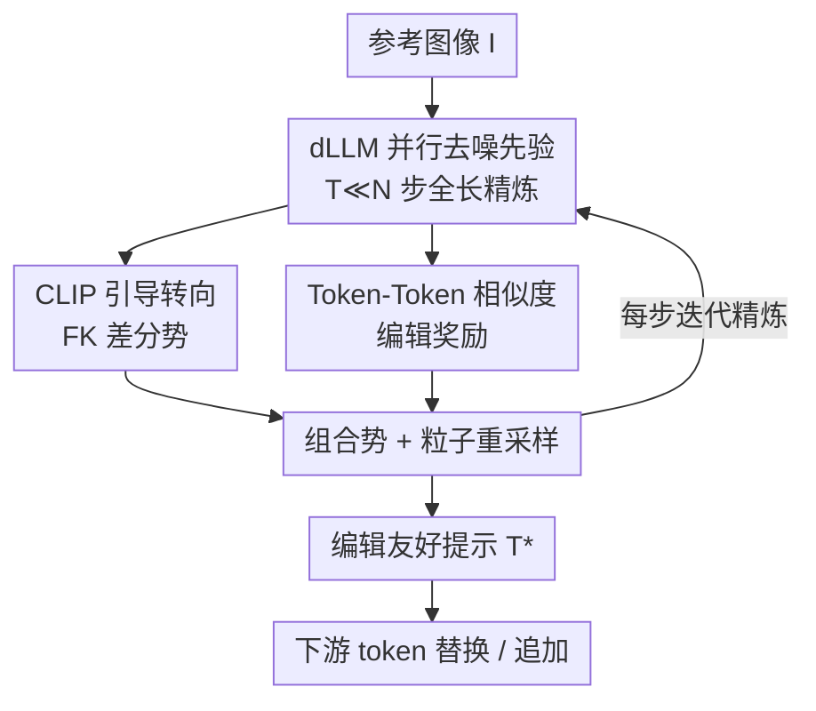

# Interpretable Prompts made Edit-Friendly: Token-to-Token Similarity Reduction in dLLMs for Edit-Friendly Hard Prompt Inversion

**会议**: CVPR 2026  
**论文**: [CVF Open Access](https://openaccess.thecvf.com/content/CVPR2026/html/Devulapally_Interpretable_Prompts_made_Edit-Friendly_Token-to-Token_Similarity_Reduction_in_dLLMs_for_CVPR_2026_paper.html)  
**代码**: 无  
**领域**: 扩散模型 / 图像生成  
**关键词**: 硬提示反演, 离散扩散语言模型, CLIP 引导, 可编辑提示, 文生图

## 一句话总结
针对"从参考图像反推出文生图提示词"这一任务，本文用离散扩散语言模型（dLLM）替换自回归束搜索做提示生成，再在采样过程里同时注入 CLIP 对齐奖励和一个全新的 **token-token 相似度（解耦）奖励**，让反演出来的提示既可读、又对齐参考图、还能在"换词/加词"这类局部编辑下稳定地只改对应内容，速度比硬提示反演基线快约 10×。

## 研究背景与动机

**领域现状**：文生图（T2I）扩散模型已经能从自然语言生成高质量图像，但写好一条提示词仍然靠反复试错。**提示反演（prompt inversion）** 把这件事自动化：给一张参考图 $I$，反推出一条文本提示 $T$，使 T2I 模型能重建出 $I$ 的内容与风格。反演方法分两类——软反演（Textual Inversion、DreamBooth）学连续 embedding，重建逼真但不可读、不可编辑；硬反演（PEZ、VGD 等）直接搜离散 token 序列，得到的是真正的人话提示。

**现有痛点**：硬反演里梯度方法（PEZ）常搜出语义混乱、几乎不通顺的字符串；近期梯度无关 / 自回归方法（如 VGD）通顺度上来了，但 **对下游 token 级编辑极其脆弱**——你把提示里的 "horse" 换成 "zebra"，生成图往往不只换了主体，连背景、姿态、衣着都跟着乱变。也就是说，提示"能读"但"不能改"。而过去的评测又只盯着重建保真度（CLIP / captioning 指标），几乎不衡量编辑鲁棒性。

**核心矛盾**：提示里的 token 之间是 **纠缠耦合** 的——多个位置预测出高度相似的 token 分布，意味着它们的语义角色绑在一起，动一个就牵连一片。重建得好不等于编辑得好，这两个目标在现有解码里没有被显式分开优化。

**本文目标**：从"编辑友好（edit-friendly）"的角度重新做硬提示反演，让反演提示同时满足三点：(i) 和参考图高度对齐；(ii) 通顺可读；(iii) 在 token 替换（swap）/ 追加（append）下产生 **局部、可预测** 的图像变化，不污染无关内容。

**切入角度**：作者把可编辑性归因于 **token 之间的解耦程度**，并提出可以直接从语言模型的预测分布里读出"耦合"信号——无需把 T2I 模型放进反演循环里算昂贵的 cross-attention。同时用离散扩散语言模型并行精炼整条序列，既加速又自带全局一致性。

**核心 idea**：在 dLLM 解码里，用 **CLIP 奖励管对齐 + token-token 相似度奖励管解耦**，两路奖励通过 Feynman-Kac 转向同时引导采样，产出"可读、对齐、可编辑"的硬提示。全程即插即用，不微调 T2I 模型也不微调 dLLM。

## 方法详解

### 整体框架
给定参考图 $I$，目标是反演出提示 $T^*$，在标准梯度无关目标 $p_{\text{LLM}}(T)\,p_{\text{CLIP}}(I\mid T)$ 之上显式乘进一个可编辑性项 $p_{\text{edit}}(T)$：

$$T^* = \arg\max_{T}\; p_{\text{LLM}}(T)\, p_{\text{CLIP}}(I\mid T)\, p_{\text{edit}}(T)$$

其中 $p_{\text{LLM}}$ 由 dLLM 提供（管通顺），$p_{\text{CLIP}}$ 管图文对齐，$p_{\text{edit}}$ 管编辑友好。整条管线是一个 **粒子化的扩散转向采样循环**：dLLM 从全噪声序列出发，每一步并行精炼全长序列得到候选提示；每个候选都被解码成文本，算 CLIP 奖励和 token-token 相似度（编辑）奖励，两路奖励合成一个"差分势"，据此对 $K$ 个粒子重采样、保留高分轨迹，迭代到 $t=0$ 输出最终提示。得到的提示可直接拿去做下游的 token 替换 / 追加，驱动 T2I 模型生成编辑后的图。

### 关键设计

**1. dLLM 并行去噪先验：用扩散语言模型替掉自回归束搜索**

过去的梯度无关硬反演（如 VGD）靠自回归 LLM 逐 token 束搜索，每加一个 token 都要对所有前缀重复打分，CLIP 还得反复作用在部分前缀上，复杂度随提示长度 $N$ 线性膨胀（$O(BN\,E_{\text{LM}} + BN\,C_{\text{align}})$）。本文换成 **离散扩散语言模型（dLLM）**：从全噪声序列 $x_T$ 出发，定义一条反向马尔可夫链

$$p_{\text{dLLM}}(x_T,\dots,x_0) = \pi_{\text{prior}}(x_T)\prod_{t=T-1}^{0} p(x_t\mid x_{t+1})$$

每一步 **并行更新所有位置**，把 $x_t$ 解码成文本 $\tilde T_t = \text{decode}(x_t)$。因为精炼步数 $T \ll N$，复杂度降到 $O(T\,E_{\text{dLLM}} + T\,C_{\text{align}})$，把"很多次串行扩展"换成"少数几次并行精炼"，这正是约 10× 提速的来源；同时整条序列一起精炼天然保证全局一致性，dLLM 在这里就充当通顺先验，负责提出全局连贯的候选提示，再交给后面两路奖励去掰对齐和编辑性。

**2. CLIP 引导转向：用 Feynman-Kac 差分势把采样偏向对齐参考图**

光有通顺先验还不够对齐参考图。本文把 CLIP 引导直接做进 dLLM 采样器里。记 $r_{\text{CLIP}}(T;I) = \cos\big(f_I(I), f_T(T)\big)$ 为图文 CLIP 相似度（编码器固定）。采用 **Feynman-Kac（FK）转向** 给每个反向步重新加权，定义差分势

$$G_t(x_{T:t}) = \exp\!\Big(\lambda_{\text{CLIP}}\big[r_{\text{CLIP}}(\tilde T_t;I) - r_{\text{CLIP}}(\tilde T_{t+1};I)\big]\Big)$$

这个"伸缩（telescoping）"形式很巧：所有步连乘后中间项全抵消，$\prod_{t=0}^{T-1} G_t = \exp\big(\lambda_{\text{CLIP}}\, r_{\text{CLIP}}(\tilde T_0;I)\big)$，于是 **只有最终提示的 CLIP 相似度决定整条轨迹的权重**。实操上每步从 $p(x_t\mid x_{t+1})$ 抽候选、解码成文本、算 $r_{\text{CLIP}}$、再按 $G_t$ 重采样，既保留 dLLM 并行解码的效率，又把采样持续推向更对齐参考图的提示。

**3. Token-Token 相似度编辑奖励：从预测分布直接读出"耦合"并惩罚它**

这是本文最核心的创新。要让提示编辑友好，等价于让 token 之间 **解耦**——动一个 token 只改对应语义。一个自然但昂贵的做法是把 T2I 模型留在循环里优化 cross-attention（PH2P、PRISM 那类），但要反复查询模型、依赖高维 attention 张量、且和具体架构 / tokenizer 强耦合，开销大，attention 本身也只是 token 重要性的不完美代理。

本文改用一个 **轻量、模型无关** 的信号，直接从 dLLM 的预测分布里算。第 $t$ 步，位置 $i$ 的词表 logits 为 $z_i^{(t)}\in\mathbb{R}^V$，先做均值中心化再 softmax：

$$\tilde z_i^{(t)} = z_i^{(t)} - \tfrac{1}{V}\sum_{v} z_i^{(t)}(v),\quad \hat p_i^{(t)} = \text{softmax}(\tilde z_i^{(t)})$$

把各位置的 $\hat p_i^{(t)}$ 按行堆成 $\hat P^{(t)}\in\mathbb{R}^{N\times V}$，算行 Gram 矩阵 $S^{(t)} = \hat P^{(t)}\hat P^{(t)\top}$，其元素 $S^{(t)}_{ij} = \langle \hat p_i^{(t)}, \hat p_j^{(t)}\rangle$ 就是位置 $i,j$ 预测分布的相似度。**off-diagonal（非对角）越大，说明两个位置预测的 token 越像、角色越绑定、越难编辑**。取非对角部分 $\text{Off}(S^{(t)}) = S^{(t)} - I_N$，用它的均值和方差刻画耦合：

$$\mu_{\text{off}}^{(t)} = \mathbb{E}_{i\neq j}\big[\text{Off}(S^{(t)})_{ij}\big],\quad \sigma_{\text{off}}^{2(t)} = \text{Var}_{i\neq j}\big[\text{Off}(S^{(t)})_{ij}\big]$$

$\mu_{\text{off}}$ 高代表全局纠缠，$\sigma_{\text{off}}$ 高代表存在少数强耦合离群对。于是定义有界的逐步编辑奖励

$$r_{\text{edit}}^{(t)} = 1 - \big(\mu_{\text{off}}^{(t)} + \sigma_{\text{off}}^{(t)}\big)$$

只有当 **平均耦合和耦合波动同时下降** 时奖励才升高。它同样以伸缩势 $G_t^{\text{edit}} = \exp\big(\lambda_{\text{edit}}[r_{\text{edit}}^{(t)} - r_{\text{edit}}^{(t+1)}]\big)$ 注入解码。最终 CLIP 与编辑两路奖励合成一个组合势

$$G_t = \exp\!\Big(\lambda_{\text{CLIP}}\big[r_{\text{CLIP}}(\tilde T_t;I) - r_{\text{CLIP}}(\tilde T_{t+1};I)\big] + \lambda_{\text{edit}}\big[r_{\text{edit}}^{(t)} - r_{\text{edit}}^{(t+1)}\big]\Big)$$

导出被转向后的终态分布

$$p_{\text{final}}(x_0\mid I) \propto p_{\text{dLLM}}(x_0\mid I)\,\exp\!\big(\lambda_{\text{CLIP}}\, r_{\text{CLIP}}(x_0;I) + \lambda_{\text{edit}}\, r_{\text{edit}}(x_0)\big)$$

恰好对应 Eq.3 的目标：dLLM 给通顺、CLIP 给对齐、编辑奖励给解耦。可视化上，VGD 的 token-token 热图有很强的非对角结构（耦合），本文的近似对角（解耦），这正是它能做局部编辑的直接证据。

### 损失函数 / 训练策略
本方法 **无训练**、即插即用：不微调 T2I 模型也不微调 dLLM，所有引导都发生在推理期的采样转向里。核心是 Algorithm 1 的粒子滤波式转向——维护 $K$ 个粒子，每步按当前势 $\{G_t^i\}$ 多项式重采样祖先、各自走一步反向扩散提议 $x_{t-1}^i\sim\tau(x_{t-1}\mid x_t^i,c)$、再用 $\frac{p(x_{t-1}^i\mid x_t^i,c)}{\tau(x_{t-1}^i\mid x_t^i,c)}G_{t-1}$ 重新加权，迭代到 $t=0$ 输出一组解码提示并选出 $T^*$。关键超参是两路 tilt 强度 $\lambda_{\text{CLIP}},\lambda_{\text{edit}}\ge 0$。引导用 CLIP-ViT-H-14、评测用 CLIP-ViT-G-14（分开以保证公平）。

## 实验关键数据

### 主实验
三个数据集 MS COCO / Flickr8K / JourneyDB，各均匀采样 200 张图、跑 5 次取均值；提示长度预算 16 / 32 / 64 / ~77 tokens。文本质量用 BERTScore（P/R/F1）、可读性用 GPT-2 困惑度 PPL、对齐用 CLIP-Text（CL-T）与 CLIP-Image（CL-I）。下表取 MS COCO、~77 tokens 这一档代表性结果：

| 方法 | F1 ↑ | PPL ↓（可读性）| CL-T ↑ | CL-I ↑ |
|------|------|------|--------|--------|
| Captioning [Florence-2] | 0.83 | 22.08 | 0.49 | 0.49 |
| CLIP Interrogator 2.1 | 0.83 | 108.15 | 0.50 | 0.53 |
| PEZ | 0.76 | 1879.27 | 0.15 | 0.66 |
| VGD（最强可读基线）| 0.86 | 21.79 | 0.51 | 0.68 |
| **Ours** | **0.87** | **17.10** | **0.56** | **0.74** |

要点：本文在保持/略升提示准确度的同时，**PPL 显著下降（可读性最好）**，且 CL-T、CL-I 全面领先；随 token 变长 PPL 持续下降而 CL-I 上升，说明更具描述性的提示能生成更对齐参考图的图像，且这一优势跨三个数据集一致。PEZ 虽 CL-I 不低，但 PPL 高达上千、几乎不可读。

### 效率（Table 2，单卡 A6000）

| 方法 | 16 tok 时间 ↓ | 77 tok 时间 ↓ | 77 tok CL-I ↑ |
|------|------|------|------|
| BLIP-2 | 0.80s | 4.80s | 0.53 |
| PEZ | 191.03s | 194.40s | 0.68 |
| VGD | 18.70s | 104.20s | 0.68 |
| **Ours** | 2.43s | **10.50s** | **0.74** |

相比最强硬反演基线，本文约 **10× 快于 VGD、95× 快于 PEZ**，同时 CL-I 更高——速度与质量兼得，主要归功于 dLLM 的并行精炼把 $O(BN)$ 降到 $O(T)$。

### 消融实验（Table 3，32 tokens）

| 配置 | F1 ↑ | PPL ↓ | CLIP-I ↑ | TIFA ↑ | 时间 ↓ |
|------|------|-------|----------|--------|--------|
| No Guide（纯 dLLM）| 0.80 | 36.91 | 0.62 | 0.74 | 2.12 |
| CLIP Guide | 0.82 | **28.84** | 0.68 | 0.81 | 3.42 |
| Sim. Guide（仅相似度）| 0.79 | 45.93 | 0.64 | **0.92** | 4.98 |
| **Ours（CLIP+Sim）** | **0.89** | 33.16 | **0.71** | 0.89 | 5.60 |

### 关键发现
- **两路奖励互补、缺一不可**：只加 CLIP 引导 PPL 最低（28.84）但文本语义分（F1=0.82）和 CLIP-I（0.68）一般；只加相似度引导 TIFA 飙到 0.92（细粒度属性最忠实）但 PPL 反而恶化到 45.93、F1 最低。两者合起来才同时拿到最高 F1（0.89）和最高 CLIP-I（0.71），整体对齐最好。
- **编辑友好性是核心卖点**：在下游 token 替换 / 追加任务上，本文的 TIFA 和 GPT-4V 分数都明显超过 captioning、BLIP-2 和 VGD，且 token-token 热图近似对角，定性上"把 horse 换成 zebra"只换主体、背景与属性保持不变。
- **代价**：引导带来时间开销（Ours 5.60s vs No Guide 2.12s），但相对硬反演基线仍快约 10×，整体划算。

## 亮点与洞察
- **"可编辑性"被还原成一个可微的、模型无关的解耦信号**：把 token 间耦合直接定义为预测分布 Gram 矩阵的非对角能量 $\mu_{\text{off}}+\sigma_{\text{off}}$，绕开了昂贵且架构相关的 cross-attention 优化——这个"从 logits 读耦合"的思路可迁移到任何需要 token 解耦/可控编辑的离散生成场景。
- **Feynman-Kac 伸缩势的用法很优雅**：差分势连乘后中间项抵消，等价于"只用最终样本的奖励"加权整条轨迹，既能逐步引导又不会重复计奖励，CLIP 与编辑奖励能干净地叠加进同一个势里。
- **dLLM 当反演骨干是个被低估的方向**：并行精炼天然带来全局一致性 + 近线性提速，作者用实验证明它可作为硬提示反演的高效准确骨干。
- **评测维度补齐**：把评测从"只看重建"扩展到"看编辑后是否局部、是否忠实"（TIFA + GPT-4V + 用户研究），更贴近用户真实使用提示的方式。

## 局限与展望
- **依赖外部打分器**：CLIP 用于对齐、GPT-2 用于困惑度、TIFA/GPT-4V 用于评测，方法质量受这些代理模型偏差影响；CLIP 相似度本身对细粒度语义不敏感这一已知问题仍可能传导进引导。
- **解耦是分布层面的代理**：token-token 相似度低只是"可编辑"的间接证据，并不直接保证任意一次具体编辑都成功；对高度组合化或风格强耦合的提示，解耦惩罚与对齐目标之间可能存在张力（消融里 Sim. Guide 单用就伤了 PPL）。
- **引导有时间开销且需调 $\lambda$**：两个 tilt 强度需要权衡，粒子数 $K$ 也影响成本；论文未充分给出 $\lambda_{\text{CLIP}}/\lambda_{\text{edit}}$ 的敏感性。
- **评测规模**：每数据集仅 200 图，编辑成功与否在很大程度上靠用户研究与 GPT-4V 判定，主观性较高。

## 相关工作与启发
- **vs 软反演（Textual Inversion / DreamBooth）**：它们学连续 embedding，重建逼真但不可读、不可编辑、易过拟合外观细节；本文产出离散人话提示，牺牲一点重建极致保真换来可读性与可编辑性。
- **vs PEZ / PH2P（梯度硬反演）**：梯度法在 embedding 空间优化再投回词表，匹配参考图但常出脆弱/不通顺串；本文梯度无关，通过 dLLM 先验保证通顺、显式奖励保证编辑友好。
- **vs VGD（梯度无关硬反演，最强可读基线）**：VGD 用自回归 LLM 束搜索平衡视觉对齐与流畅度，但 token 高度耦合、编辑脆弱且慢；本文换 dLLM 并行解码 + token 解耦奖励，约 10× 提速且把"不可改"变"可改"。
- **vs 基于 cross-attention 的可控编辑（PH2P / PRISM 等）**：它们把 T2I 模型留在循环里优化注意力，开销大且架构相关；本文用轻量、模型无关的 dLLM 预测分布信号替代。

## 评分
- 新颖性: ⭐⭐⭐⭐⭐ 把"提示可编辑性"形式化为可微的 token-token 解耦信号，并用 FK 转向同时融合 CLIP 与编辑奖励，角度新颖
- 实验充分度: ⭐⭐⭐⭐ 三数据集 × 四长度 × 多指标 + 消融 + 用户研究较完整，但每集仅 200 图、编辑评测偏主观
- 写作质量: ⭐⭐⭐⭐ 动机清晰、公式自洽，FK 与解耦奖励推导讲得明白
- 价值: ⭐⭐⭐⭐ 即插即用、~10× 提速且让硬提示真正可交互编辑，对提示工程与 T2I 创作工作流实用

<!-- RELATED:START -->

## 相关论文

- [\[CVPR 2026\] Guiding Token-Sparse Diffusion Models](guiding_token-sparse_diffusion_models.md)
- [\[CVPR 2026\] Group Editing: Edit Multiple Images in One Go](group_editing_edit_multiple_images_in_one_go.md)
- [\[CVPR 2026\] Inter-Edit: First Benchmark for Interactive Instruction-Based Image Editing](inter-edit_first_benchmark_for_interactive_instruction-based_image_editing.md)
- [\[CVPR 2026\] HP-Edit: A Human-Preference Post-Training Framework for Image Editing](hp-edit_a_human-preference_post-training_framework_for_image_editing.md)
- [\[CVPR 2026\] Image Generation from Contextually-Contradictory Prompts](image_generation_from_contextually-contradictory_prompts.md)

<!-- RELATED:END -->
