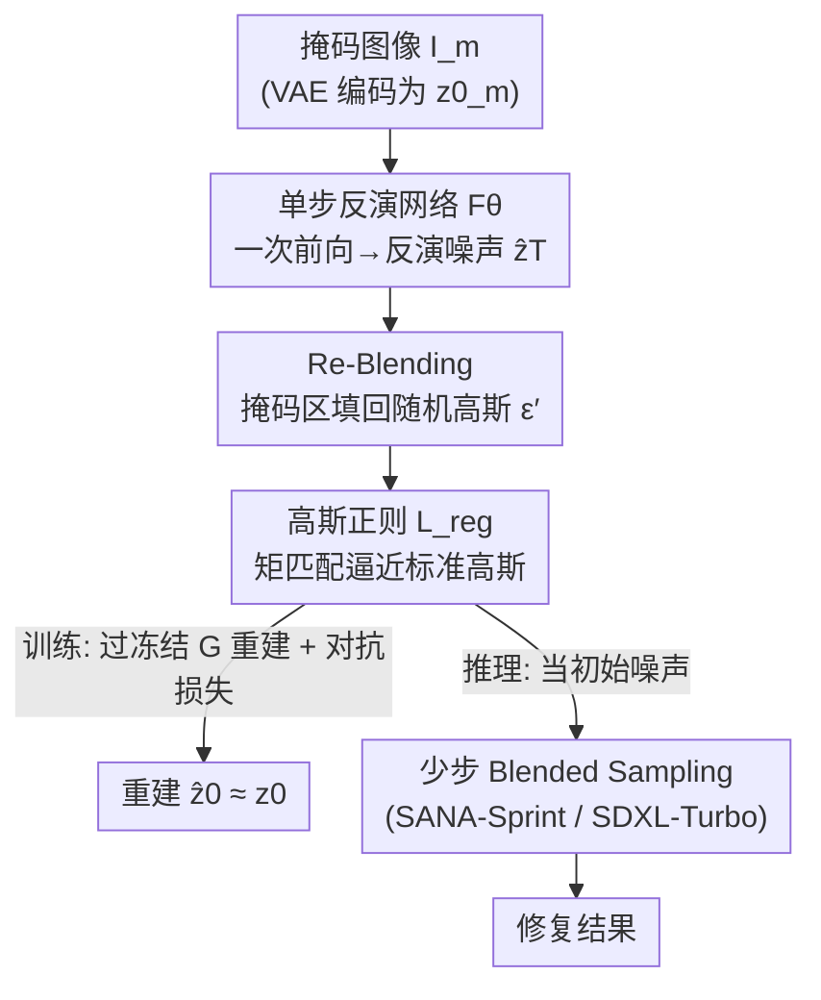

# InverFill: One-Step Inversion for Enhanced Few-Step Diffusion Inpainting

**会议**: CVPR 2026  
**论文**: [CVF Open Access](https://openaccess.thecvf.com/content/CVPR2026/html/Vu_InverFill_One-Step_Inversion_for_Enhanced_Few-Step_Diffusion_Inpainting_CVPR_2026_paper.html)  
**代码**: 无  
**领域**: 扩散模型 / 图像生成  
**关键词**: 少步扩散、图像修复(inpainting)、单步反演、噪声初始化、blended sampling

## 一句话总结
针对"少步扩散模型做 inpainting 时随机高斯噪声初始化导致语义错位、修复区域与背景不协调"的问题，InverFill 训练一个**单步反演网络**把已知的掩码图像映射成一个"语义对齐"的噪声潜变量来替换随机噪声，再喂进现成的 blended sampling 管线，在仅 2–4 步、几乎零额外开销（+0.06s）下显著提升少步 inpainting 质量，甚至追平需要真实图像监督的专用 inpainting 模型。

## 研究背景与动机

**领域现状**：文本引导图像修复（text-guided inpainting）的主流是借力大规模文生图扩散模型的先验，做法分两类——一类是 BrushNet/SDXL-Inpainting 这种**微调**（给冻结骨干加可训练分支或全量微调 U-Net 加 mask 条件），另一类是 Blended Latent Diffusion（BLD）这种**训练自由**：在多步去噪的每一步把"已知区域加噪后的潜变量"和"模型预测的潜变量"按掩码混合，让生成内容逐步和背景对齐。这两类都能出高质量结果，但**都依赖几十到上百步采样**，延迟高、难以实时部署。

**现有痛点**：把成熟的少步文生图模型（4–8 步乃至 1 步，如 SANA-Sprint、SDXL-Turbo）直接拿来做 inpainting 并不 work。BLD 这套混合策略在**多步**模型上有效是因为每步去噪更新很小，可以平滑地把生成内容融入上下文；但在**少步**模型上，每一步是一次"大跨度 ODE 更新"，几乎没有缓冲——一旦初始噪声和已知区域语义离得远，几次粗更新根本纠正不回来，于是出现修复区模糊、风格/语义和背景割裂的伪影。目前唯一成功的少步专用方案 TurboFill 用 3 步对抗训练在蒸馏模型上训一个 inpainting adapter，但它**设计复杂、要真实图像监督、计算重**，且只验证过 U-Net。

**核心矛盾**：标准扩散流程**永远从纯高斯噪声起步**，这个起点对"已知区域的语义和结构"一无所知，本质上给模型注入了一个和上下文无关的随机初始化。多步模型靠大量去噪步慢慢把这个 mismatch 修正掉；少步/单步模型没有这个"修正预算"，初始随机性带来的语义错位会一路保留到输出。所以问题根因不在采样策略本身，而在**初始噪声的语义**。

**本文目标**：在不重新训练 inpainting 模型、不引入明显延迟的前提下，给少步 inpainting 一个**语义对齐的初始噪声**，让"几步大更新"从一开始就站在和背景一致的起点上。

**切入角度**：扩散反演（diffusion inversion）正好做"图像 → 噪声潜变量"的逆映射，能给出语义相关的初始化。但传统反演（DDIM Inversion、Null-text、Renoise、GNRI）都是迭代式、开销大，和少步的效率诉求矛盾。最近 SwiftEdit 提出**单步**反演网络（一次前向把图像映射到噪声），效率达标——但它是为图像**编辑**设计的，直接搬到 inpainting 会失败：(1) 它不处理掩码输入，训练时可见区域的信息会**泄漏**进反演噪声；(2) 它的重建目标不约束反演噪声服从高斯先验，导致分布失配、重建崩坏。

**核心 idea**：做一个**专为 inpainting 定制的单步反演网络**——只吃掩码图像、输出语义对齐的噪声潜变量，并用两个针对性设计堵住 SwiftEdit 的两个漏洞：**Re-Blending** 防止可见区域信息泄漏、**高斯正则损失**强制反演噪声贴合高斯先验。整套训练**无需真实图像、无需 image–mask–text 三元组**（用单步生成器在线合成训练数据），即插即用地增强任意少步 blended sampling 管线。

## 方法详解

### 整体框架

InverFill 不去训练新的 inpainting 模型，而是训练一个轻量的**单步反演网络 $F_\theta$**，作为"噪声初始化器"插在现成少步 inpainting 管线的最前面。它分**训练**和**推理**两条流程：

- **训练（图 2）**：完全 image-free。给定文本 prompt $c$ 和随机噪声 $\epsilon$，先用冻结的单步生成器 $G$ 合成一张 GT 图像 $I_{gt}$；随机采一个多形状/多笔刷的掩码 $M$ 得到掩码图像 $I_m$。把 $I_m$ 的潜变量 $z_0^m$ 喂进 $F_\theta$，预测反演噪声 $\hat z_T$；经 **Re-Blending** 在掩码区填回随机高斯噪声得到 $\hat z_T^{blend}$，再过冻结生成器 $G$ 重建出 $\hat z_0$。优化目标是让 $\hat z_0$ 还原 $z_0$、背景保真且掩码区与上下文协调，受**重建损失 + 高斯正则 + 对抗损失**联合监督。
- **推理（图 3）**：拿真实掩码图像，$F_\theta$ 一次前向得到 $\hat z_T$，Re-Blending 成 $\hat z_T^{blend}$，把它**当作初始噪声**喂进标准少步 blended sampling——其余流程和 BLD 完全一样，只是把"随机高斯起点"换成了"语义对齐起点"。

### 关键设计

**1. 单步掩码反演网络 $F_\theta$：用语义对齐噪声替换随机初始化**

这是整套方法要解决的根本痛点——少步模型从随机高斯噪声起步，对已知区域一无所知，几步大更新纠正不回来。$F_\theta$ 直接把掩码图像潜变量 $z_0^m$（和 prompt $c$）一次前向映射成反演噪声 $\hat z_T$，使得这个噪声"携带"了已知区域的语义结构。架构上沿用单步生成器 $G$ 的结构并继承其预训练权重做初始化（和 SwiftEdit 一致）。训练数据靠 $G$ 在线合成：$z_0 = G(\epsilon, c)$、$I_{gt}=D(z_0)$，随机掩码得到 $I_m$，于是无需任何真实图像或人工标注三元组。重建目标在噪声和图像两个空间施加，且**噪声损失只算未掩码区域**（掩码区的 $z_0^m$ 本就没有有效信息，惩罚它反而干扰训练）：

$$\mathcal{L}_{noise} = \|(1-m)\odot\hat z_T - (1-m)\odot\epsilon\|_2^2, \quad \mathcal{L}_{image} = \|\hat z_0 - z_0\|_2^2$$

之所以有效：单步反演把"昂贵的迭代反演"压成一次前向（推理仅 +0.06s），效率上满足少步诉求；同时把初始噪声的语义从"随机"变成"和背景一致"，给少步采样一个对的起点。

**2. Re-Blending 操作：堵住掩码训练带来的信息泄漏**

直接把 SwiftEdit 搬来会坏，第一个坑就在这。因为 $F_\theta$ 只看得到不完整的掩码图像 $I_m$，而 $\mathcal{L}_{noise}$ 只在未掩码区监督，训练会**偏向可见区域**：图像空间的结构模式从 $I_m$ 泄漏进 $\hat z_T$，而掩码对应区域则呈现低方差和伪影。结果 $\hat z_T$ 严重偏离扩散模型期望的高斯分布，$G(\hat z_T, c)$ 直接崩成一堆伪影（图 5）。

Re-Blending 的做法很直接：训练和推理时都把预测噪声 $\hat z_T$ 的**掩码区替换成新采的随机高斯 $\epsilon'$**，把潜变量部分拉回期望分布，同时保留未掩码区的关键语义特征：

$$\hat z_T^{blend} = \hat z_T \odot (1-m) + \epsilon' \odot m, \quad \hat z_0 = G(\hat z_T^{blend}, c)$$

其中 $m$ 是从 $M$ 下采样到潜空间的掩码。这样"已知区给语义、未知区给干净高斯噪声"，既防泄漏又保住了语义注入的好处——可见区域提供初始化线索，未知区域留给生成器自由发挥。

**3. 高斯正则损失 $\mathcal{L}_{reg}$：把 Re-Blending 没拉够的分布彻底矫正回高斯**

Re-Blending 只能**部分**修正分布。问题在于：$\mathcal{L}_{noise}$ 只监督未掩码区，掩码区填进去的 $\epsilon'$ 没有直接的高斯监督；图像损失 $\mathcal{L}_{image}$ 虽然间接鼓励 $\epsilon'$ 和 $\hat z_T$ 协调，但管不住高斯一致性。于是 $\hat z_T^{blend}$ 仍偏离标准高斯——表现为掩码区填入的噪声和背景反演噪声"看起来明显不一样"，重建背景丢失、掩码区模糊低细节（图 6）。

作者引入**矩匹配**正则：直接约束 $\hat z_T^{blend}$ 的统计矩贴近标准高斯的理论矩。设 $\mu_n$ 为标准高斯第 $n$ 阶理论矩，$D = c\times h\times w$ 为像素总数，第 $n$ 阶矩匹配损失为：

$$\mathcal{L}_n = \left(\frac{1}{D}\sum_{k=1}^{D}\big(\hat z_T^{blend}\big)^n\right)^{\frac{1}{n}} - \mu_n^{\frac{1}{n}}$$

最终 $\mathcal{L}_{reg} = \sum_{n\in\{1,2\}}\mathcal{L}_n$，即匹配高斯的**一阶矩（均值）和二阶矩（方差）**。⚠️ 公式 (9) 在原文 PDF 抽取中略有 OCR 噪声，绝对值/求和细节以原文为准。加上这项后 $\hat z_T^{blend}$ 才真正贴合高斯先验，背景得以保真、细节得以恢复（消融表 2 证实）。

**4. 对抗损失提升视觉质量（LADD 式蒸馏）**

少步模型容易丢细节，作者沿用 LADD 的做法补一个对抗项。用冻结的多步教师模型 $G_{pre}$ 提供潜特征空间，在其中间层挂多个判别头 $D_{\psi,k}$ 做稳定高效的对抗监督：把原图潜变量 $z_0$ 当真、预测 $\hat z_0$ 当假来训反演网络与判别器：

$$\mathcal{L}^G_{adv}(\theta) = -\mathbb{E}_{\hat z_0, t}\Big[\sum_k D_{\psi,k}(G_{pre}(\hat z_t, t, c))\Big]$$

判别器侧用 hinge 形式（ReLU(1∓·)）。它不改变前三个设计的语义对齐主线，只作为质量增强项。最终目标是三者加权：$\mathcal{L}_{final} = \lambda_{recons}\mathcal{L}_{recons} + \lambda_{reg}\mathcal{L}_{reg} + \lambda_{adv}\mathcal{L}_{adv}$。

### 损失函数 / 训练策略
- 总损失：$\mathcal{L}_{final} = \lambda_{recons}\mathcal{L}_{recons} + \lambda_{reg}\mathcal{L}_{reg} + \lambda_{adv}\mathcal{L}_{adv}$，其中 $\mathcal{L}_{recons} = \lambda_{noise}\mathcal{L}_{noise} + \lambda_{image}\mathcal{L}_{image}$。
- 训练数据：完全 image-free——prompt 从 BrushData 和 MSCOCO 采样，图像由单步生成器在线合成，掩码随机采多形状/多笔刷。
- 配置：在 SANA-Sprint 0.6B（DiT）和 SDXL-Turbo（U-Net）两种架构上各训一版；4×A100 40GB、8–10 小时；batch size 32、学习率 $1\times10^{-5}$、AdamW；分辨率 $1024^2$。

## 实验关键数据

### 主实验
评测基准为 inpainting 的 BrushBench（600 图）和改编自 MagicBrush 的 535 图测试集；指标全是人类对齐的质量分（ImageReward IR、HPS v2、Aesthetic Score AS）+ 文本对齐（CLIP）。核心结论：InverFill **即插即用地稳定提升所有少步基线**，并以 2–4 步追平 20–30 步的多步方法，开销仅 +0.04～0.06s。

| 设置 | NFEs | BrushBench IR×10 | BrushBench HPS×10² | MagicBrush IR×10 | Runtime(s) |
|------|------|------|------|------|------|
| SANA-Sprint 0.6B | 2 | 11.02 | 26.21 | 2.55 | 0.37 |
| **+ InverFill** | 2 | **11.65** | **27.93** | **3.04** | 0.43 (+0.06) |
| SANA-Sprint 0.6B | 4 | 10.82 | 26.34 | 2.56 | 0.45 |
| **+ InverFill** | 4 | **11.76** | **27.83** | **3.14** | 0.51 (+0.06) |
| SDXL-Turbo | 4 | 11.42 | 28.20 | 3.51 | 0.66 |
| **+ InverFill** | 4 | **12.38** | **28.44** | **3.75** | 0.70 (+0.04) |
| SDXL-Turbo + BrushNet | 4 | 12.56 | 28.26 | 4.20 | 0.70 |
| **+ InverFill** | 4 | **12.63** | **28.43** | 4.15 | 0.74 (+0.04) |
| HD-Painter（多步参考） | 30 | 12.82 | 28.17 | — | 23.45 |
| SDXL-Inpainting（多步参考） | 30 | 13.16 | 28.92 | — | 3.35 |

注：SDXL-Turbo + InverFill（4 步）在关键指标上**超过 HD-Painter（30 步）**，而后者慢 30 倍以上；InverFill 加在专用模型 BrushNet 上也仍有增益，说明它对 blended sampling 和专用 inpainting 两条路线都管用。

### 消融实验

| 配置 | IR×10↑ | HPS×10²↑ | AS↑ | CLIP↑ | 说明 |
|------|------|------|------|------|------|
| w/o $\mathcal{L}_{reg}$ | 11.11 | 26.69 | 6.08 | 27.13 | 仅 Re-Blending，背景丢失、掩码区模糊 |
| w/ $\mathcal{L}_{reg}$ | **11.40** | **27.22** | **6.12** | 27.15 | 加高斯正则后背景保真、细节恢复 |

（SANA-Sprint 0.6B、2 NFEs、BrushBench、5000 迭代）。另有定性消融（图 5/6）：去掉 Re-Blending 时 $G$ 直接崩出伪影；只有 Re-Blending 无 $\mathcal{L}_{reg}$ 时背景仍丢失、输出模糊——两个设计缺一不可。

### 增强 caption 评测
作者还指出 BrushBench 原始 prompt 太短、测不出文本理解，用 Qwen3 扩写出含前景/背景细节的复杂 prompt 重测（表 3）。结论：InverFill 在文本密集设置下依然全面提升所有基线，且 SANA-Sprint 的 CLIP 增益比简单 prompt 时更大，说明语义对齐初始化能更好地利用 Gemma-2 这类大文本编码器。

### 关键发现
- **两个设计互补且都必需**：Re-Blending 解决"泄漏导致 $G$ 崩"，高斯正则解决"分布残差导致背景丢失/模糊"，单用任一个都不够。
- **几乎零开销**：单步反演只加 0.04–0.06s，却把 2–4 步结果拉到多步水平，性价比极高。
- **跨架构泛化**：在 DiT（SANA-Sprint）和 U-Net（SDXL-Turbo）上都生效，不像 TurboFill 只验证过 U-Net。

## 亮点与洞察
- **把"问题定位到初始噪声"是最妙的一刀**：少步 inpainting 坏在哪？作者不去改采样器、不训新模型，而是诊断出"随机高斯起点 + 无修正预算"才是根因，于是只换初始化就解决——四两拨千斤。
- **image-free 训练管线**：靠单步生成器在线合成 image–mask–prompt，绕开了 TurboFill 那种昂贵的真实图像三元组监督，却追平了它的效果，这是工程上极有吸引力的点。
- **矩匹配做高斯正则**：用一阶/二阶矩匹配把"反演出来的噪声"硬拉回标准高斯先验，是个可迁移的 trick——任何"反演网络输出需要服从噪声分布"的场景（编辑、风格迁移、超分的扩散先验）都能借用。
- **即插即用**：InverFill 是个前置噪声初始化器，对下游管线零侵入，既能配 blended sampling，也能叠在 BrushNet 这种专用模型上再加一截，复用面广。

## 局限与展望
- **依赖现成少步文生图模型的质量**：InverFill 只换初始化，生成质量天花板仍由底层少步生成器决定；底模差时增益有限。
- **掩码区仍靠随机噪声 + 生成器自由发挥**：Re-Blending 在掩码区填的是干净高斯，语义注入只覆盖已知区域，对"掩码区需要强结构约束"的场景（如精确补全特定物体）可能力不从心。
- **指标偏人类偏好分**：评测主要用 IR/HPS/AS/CLIP 等偏好/对齐型指标，缺少像素级保真（如 PSNR/LPIPS）或几何一致性的硬指标，部分结论（如和多步方法"追平"）需在更细粒度任务上再验证。
- **公式抽取存疑**：矩匹配损失公式 (9) 的 OCR 文本有噪声，复现时应以 CVF 原文为准。
- 改进方向：把语义注入也扩到掩码区（如基于 prompt 的结构先验）、探索与一致性模型等更激进少步方案的结合。

## 相关工作与启发
- **vs SwiftEdit**：同样是单步反演网络，但 SwiftEdit 为图像**编辑**设计、吃完整图像；InverFill 处理**掩码**输入做 inpainting，针对性补了 Re-Blending（防泄漏）和高斯正则（约束分布），这正是把单步反演从编辑迁到 inpainting 的两个必需修正。
- **vs TurboFill**：TurboFill 是另一条少步专用 inpainting 路线，用 3 步对抗训练 + 真实图像监督训 adapter，设计复杂、计算重、只验证 U-Net；InverFill image-free、零侵入、跨 DiT/U-Net，且能叠在专用模型上互补。
- **vs Blended Latent Diffusion (BLD)**：InverFill 不改 BLD 的混合采样逻辑，只把它的随机噪声起点换成语义对齐起点——本质是给 BLD 在少步 regime 失效的根因打了补丁。
- **vs Renoise / GNRI 等少步反演**：它们用 fixed-point 迭代或 Newton-Raphson 做反演，仍是迭代式有开销；InverFill 走单步前向网络，把反演开销压到可忽略，更契合少步的效率诉求。

## 评分
- 新颖性: ⭐⭐⭐⭐ 把少步 inpainting 失败归因到初始噪声、用定制单步反演 + Re-Blending + 高斯正则解决，角度精准且组合新颖。
- 实验充分度: ⭐⭐⭐⭐ 两架构、两基准、增强 caption、含运行时和消融，较全面；缺像素级保真硬指标略可惜。
- 写作质量: ⭐⭐⭐⭐ 动机—诊断—设计链条清晰，图 2/3 把训练/推理两条流程讲得明白。
- 价值: ⭐⭐⭐⭐ 即插即用、近零开销把少步 inpainting 拉到多步水平，实用性强，trick 可迁移。

<!-- RELATED:START -->

## 相关论文

- [\[CVPR 2026\] ImageRAGTurbo: Towards One-step Text-to-Image Generation with Retrieval-Augmented Diffusion Models](imageragturbo_towards_one-step_text-to-image_generation_with_retrieval-augmented.md)
- [\[CVPR 2026\] Few-Step Diffusion Sampling Through Instance-Aware Discretizations](few-step_diffusion_sampling_through_instance-aware_discretizations.md)
- [\[CVPR 2026\] PixelRush: Ultra-Fast, Training-Free High-Resolution Image Generation via One-step Diffusion](pixelrush_ultrafast_trainingfree_highresolution_im.md)
- [\[CVPR 2026\] Uni-DAD: Unified Distillation and Adaptation of Diffusion Models for Few-step Few-shot Image Generation](uni-dad_unified_distillation_and_adaptation_of_diffusion_models_for_few-step_few.md)
- [\[CVPR 2026\] FlowSteer: Guiding Few-Step Image Synthesis with Authentic Trajectories](flowsteer_guiding_few-step_image_synthesis_with_authentic_trajectories.md)

<!-- RELATED:END -->
