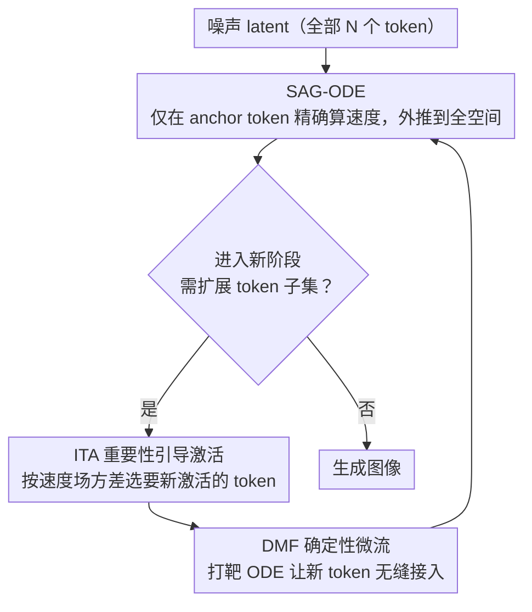

# Just-in-Time: Training-Free Spatial Acceleration for Diffusion Transformers

**会议**: CVPR2026  
**arXiv**: [2603.10744](https://arxiv.org/abs/2603.10744)  
**代码**: [项目主页](https://wenhao-sun77.github.io/JiT/)  
**领域**: 图像生成 / 扩散模型加速  
**关键词**: 扩散 Transformer, 空间加速, training-free, Flow Matching, token稀疏化, ODE求解

## 一句话总结

提出 Just-in-Time (JiT) 框架，通过在空间域动态选择稀疏 anchor token 驱动生成 ODE 演化，并设计确定性 micro-flow 保证新 token 无缝激活，在 FLUX.1-dev 上实现最高 7× 加速且几乎无损。

## 背景与动机

1. **DiT 计算瓶颈**：Diffusion Transformer 的 self-attention 复杂度为 $\mathcal{O}(N^2)$，高分辨率图像/视频生成时推理延迟极高，严重制约实时交互和消费级部署
2. **时域加速的局限**：现有加速方法主要关注时域（高阶求解器、蒸馏少步模型），但在超低步数时质量显著下降，且蒸馏需要大量重训练资源
3. **缓存方法的天花板**：特征缓存（TeaCache、TaylorSeer）复用中间激活来减少计算，但其质量上界受限于对应 NFE 的基线表现，存在特征陈旧问题
4. **空间冗余被忽视**：扩散生成过程具有从低频全局结构到高频细节的渐进特性，但现有方法对所有空间区域统一计算——这是不必要的浪费
5. **现有空间方法的缺陷**：已有的金字塔/层级式空间加速方法依赖显式上采样和分布校正，容易引入混叠伪影和信息损失
6. **核心洞察**：生成早期阶段全局结构已形成，只需在少量关键区域计算即可驱动完整潜在状态演化，细节区域可延迟处理

## 方法详解

### 整体框架

JiT 想省的是 DiT 在空间上的冗余算力：扩散生成是从低频全局结构逐步走到高频细节的，早期阶段其实只要在少数关键区域算速度场，就能驱动整张图的潜在状态演化，没必要对所有 token 一视同仁地全算。它是个完全免训练的框架，由三个组件协同：SAG-ODE 在稀疏的 anchor token 上精确算速度、再外推到全空间，驱动整张图的潜在状态演化；这些 anchor token 选哪些，由 ITA（重要性引导的 token 激活）按速度场方差决定，把算力投到最活跃的区域；当生成进入新阶段、需要激活更多 token 时，DMF（确定性微流）用一段打靶 ODE 把新 token 平滑接进来，避免突变。

### 关键设计

**1. SAG-ODE：只在 anchor token 上精确计算，再外推到全空间**

对所有空间区域统一计算是主要浪费来源。SAG-ODE 构建一条嵌套的 token 子集链 $\Omega_K \subset \Omega_{K-1} \subset \cdots \subset \Omega_0 = \{1,...,N\}$，从最小子集逐步往外扩，生成 ODE 写成

$$\frac{d\mathbf{y}(t)}{dt} = \mathbf{\Pi}_k \, \boldsymbol{u}_\theta(\mathbf{S}_k^\top \mathbf{y}(t), t)$$

增广提升算子 $\mathbf{\Pi}_k$ 干两件事：嵌入映射 $\mathbf{S}_k \boldsymbol{u}_\theta$ 把 anchor token 的精确速度放回全空间对应位置，插值算子 $\mathcal{I}_k(\boldsymbol{u}_\theta)$ 给非活跃 token 做空间插值近似。关键是它满足一致性 $\mathbf{S}_k^\top(\mathbf{\Pi}_k \boldsymbol{u}_\theta) = \boldsymbol{u}_\theta$——anchor token 的动力学始终由 Transformer 精确控制，所以加速不会牺牲关键区域的质量。

**2. 重要性引导的 token 激活（ITA）：按速度场方差把算力投到最活跃的区域**

SAG-ODE 要在 anchor token 上算速度，但固定网格式地选 anchor 并不知道哪里更需要算。ITA 改用速度场的局部方差来衡量每个区域有多「活跃」：

$$\mathbf{I}(t) = \mathbb{E}_\mathcal{W}[\boldsymbol{u}_\theta \odot \boldsymbol{u}_\theta] - (\mathbb{E}_\mathcal{W}[\boldsymbol{u}_\theta])^{\odot 2}$$

方差大说明该处生成过程最活跃（多为高频细节），就优先激活这些 token，把算力精准投到刀刃上，比固定模式更省也更准。

**3. DMF（确定性微流）：让新激活的 token 无缝接入而不引入跳变**

子集每扩展一次就有一批新 token 被激活，如果直接用插值状态顶上去，统计分布会和真实轨迹对不齐。DMF 先给新 token 构造一个统计正确的目标状态

$$\mathbf{y}_k^\star = \mathbf{Q}_k \left( T_k \Phi_k(\mathbf{S}_k^\top \hat{\mathbf{y}}(1)) + (1-T_k)\epsilon \right)$$

这里用 Tweedie 公式预测干净数据、再结合结构先验插值和正确噪声水平拼出目标；随后用一段有限时间的打靶 ODE 在极短区间里把新 token 精确收敛到这个目标，于是阶段转换处不会出现噪声或断层。

## 实验关键数据

### 主实验（FLUX.1-dev，Tab.1）

| 方法 | NFE | 延迟(s) | TFLOPs | 加速比 | CLIP-IQA↑ | ImageReward↑ | HPSv2.1↑ | GenEval↑ | T2I-Comp↑ |
|------|-----|---------|--------|--------|-----------|-------------|----------|----------|-----------|
| FLUX.1-dev | 50 | 25.25 | 2991 | 1.0× | 0.6139 | 1.004 | 30.39 | 0.6565 | 0.4836 |
| TeaCache | 28 | 6.98 | 729 | 4.1× | 0.6003 | 0.964 | 29.68 | 0.6493 | 0.4849 |
| **JiT (Ours)** | 18 | **6.02** | **706** | **4.24×** | **0.6166** | **1.017** | 29.77 | **0.6540** | **0.4991** |
| TeaCache | 28 | 4.53 | 432 | 6.9× | 0.5183 | 0.773 | 27.86 | 0.5837 | 0.4625 |
| **JiT (Ours)** | 11 | **3.67** | **423** | **7.07×** | **0.5397** | **0.975** | **29.02** | **0.6457** | **0.4961** |

- 4× 加速时：JiT 在 CLIP-IQA、ImageReward、GenEval、T2I-Comp 均为最优，接近 50-NFE 基线
- 7× 加速时：JiT 大幅超越所有竞品，ImageReward 从 0.773 提升到 0.975

### 用户研究

| 对比方法 | JiT 偏好率 |
|----------|-----------|
| vs FLUX.1-dev (12 NFE) | 85.6% |
| vs Bottleneck (14 NFE) | 90.3% |
| vs FLUX.1-dev (7 NFE) | 93.1% |
| vs TaylorSeer (28 NFE) | 89.5% |

20位参与者在1000次盲测中显著偏好 JiT 生成结果。

### 消融实验（T2I-CompBench complex compositions）

| 变体 | HPSv2.1↑ | T2I-Comp↑ |
|------|----------|-----------|
| 完整 JiT | **26.90** | **0.3727** |
| 去除 SAG-ODE 插值 | 24.18 | 0.3414 |
| 去除 ITA（用固定网格） | 26.51 | 0.3670 |
| 去除 DMF 目标构建 | 26.04 | 0.3602 |

去除空间插值导致灾难性下降（非活跃区域退化为噪声），验证了各组件的必要性。

## 亮点

- **完全免训练**：无需重训练或微调，直接应用于预训练 DiT 模型
- **无上采样设计**：摆脱了传统空间加速方法对显式上采样/下采样的依赖，从根源避免伪影
- **数学优雅**：SAG-ODE 具有一致性证明（anchor token 无损），DMF 有严格的打靶 ODE 收敛保证
- **动态资源分配**：ITA 基于速度场方差的 content-aware 策略，比固定模式更高效
- **极端加速下仍保持质量**：7× 加速时仍能正确渲染文字等高频细节，优势在极限场景更突出

## 局限与展望

- 仅在 FLUX.1-dev 一个模型上验证，未展示对其他 DiT（SD3、PixArt 等）的泛化性
- 阶段调度（$\{T_k, m_k\}$）需要手动设计，缺乏自适应调度机制
- 插值算子 $\mathcal{I}_k$ 的设计较简单（空间平滑插值），对纹理丰富区域可能不够精确
- 仅验证图像生成，未扩展到视频生成场景（token 数更多，空间冗余可能更显著）
- 与时域加速方法（步数蒸馏）的组合潜力未探索，理论上两者正交可叠加
- DMF 中的噪声 $\epsilon$ 每次阶段转换重新采样，可能引入微小随机性

## 与相关工作的对比

| 类别 | 方法 | 对比 |
|------|------|------|
| 空间加速 | RALU、Bottleneck Sampling | 依赖显式上采样+分布校正，易引入伪影；JiT 无上采样设计 |
| 缓存加速 | TeaCache、TaylorSeer | 质量上界受低 NFE 基线限制；JiT 不受此约束 |
| 子空间扩散 | Subspace Diffusion | 概念启发但限于低维子空间；JiT 动态操作 token 子集更灵活 |
| 金字塔方法 | Pyramidal Flow | 逐级上采样+校正；JiT 通过 DMF 实现无损维度转换 |

## 评分

- 新颖性: ⭐⭐⭐⭐ 空间域稀疏 token 加速 + 微流转换的组合设计新颖，数学框架清晰
- 实验充分度: ⭐⭐⭐⭐ 多指标定量+定性+用户研究+消融齐全，但只在单一模型验证
- 写作质量: ⭐⭐⭐⭐⭐ 问题动机清晰，数学推导严谨，图示直观
- 价值: ⭐⭐⭐⭐ 免训练7×加速实用价值高，但泛化性和视频扩展有待验证

<!-- RELATED:START -->

## 相关论文

- [\[CVPR 2026\] Training-free Mixed-Resolution Latent Upsampling for Spatially Accelerated Diffusion Transformers](training-free_mixed-resolution_latent_upsampling_for_spatially_accelerated_diffu.md)
- [\[CVPR 2026\] Denoising as Path Planning: Training-Free Acceleration of Diffusion Models with DPCache](dpcache_denoising_path_planning_diffusion_accel.md)
- [\[CVPR 2026\] TAP: A Token-Adaptive Predictor Framework for Training-Free Diffusion Acceleration](tap_a_token-adaptive_predictor_framework_for_training-free_diffusion_acceleratio.md)
- [\[CVPR 2026\] ResCa: Residual Caching for Diffusion Transformers Acceleration](resca_residual_caching_for_diffusion_transformers_acceleration.md)
- [\[CVPR 2026\] Circuit Mechanisms for Spatial Relation Generation in Diffusion Transformers](circuit_mechanisms_for_spatial_relation_generation_in_diffusion_models.md)

<!-- RELATED:END -->
