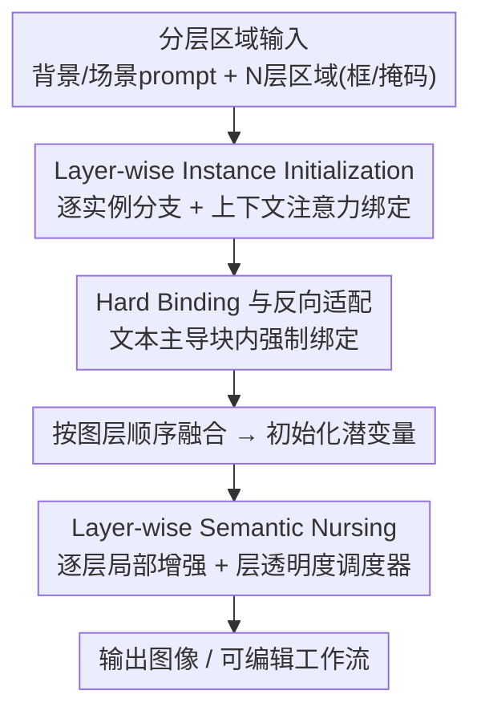

# Layer-wise Instance Binding for Regional and Occlusion Control in Text-to-Image Diffusion Transformers

**会议**: CVPR 2026  
**论文**: [CVF Open Access](https://openaccess.thecvf.com/content/CVPR2026/html/Chen_Layer-wise_Instance_Binding_for_Regional_and_Occlusion_Control_in_Text-to-Image_CVPR_2026_paper.html)  
**代码**: 项目页 https://littlefatshiba.github.io/layerbind-page  
**领域**: 扩散模型 / 文生图 / 区域布局控制  
**关键词**: 区域布局控制, 遮挡控制, Diffusion Transformer, 免训练, 联合注意力

## 一句话总结
LayerBind 提出一种**免训练、即插即用**的策略，把文生图 DiT（FLUX、SD3.5）的每个区域实例当作独立"图层"，先在去噪早期利用联合注意力的上下文共享机制并行初始化各实例分支、再按图层顺序融合确立布局与遮挡，随后用逐层注意力增强和"层透明度调度器"精修细节，从而在不损画质的前提下实现精确的区域控制和遮挡顺序控制，并天然支持可编辑生成。

## 研究背景与动机
**领域现状**：在文生图里，"区域指令布局控制"（region-instructed layout control）让用户用框/掩码加文字描述指定每个物体放在哪、长什么样，是把 LLM 解析出的版面规划落地成图像的实用工具。随着 Diffusion Transformer（DiT）凭借联合注意力（joint attention）成为主流架构，研究重点正从 U-Net 转向 DiT-native 的布局控制器。

**现有痛点**：现有 DiT 布局控制走两条路，各有硬伤。① **训练式**方法（微调 DiT 或加布局适配器，如 CreatiLayout）能精确控版面，但会引入训练数据偏置，明显**降低画质**；② **免训练**方法（区域提示注入语义，如 RAGD、LaRender）能保住原模型画质，却**管不了物体遮挡顺序**，而且常出现"概念混淆"（concept blending）——不同区域的语义错误地融合在一起。

**核心矛盾**：在 DiT 上**同时**做到「精确的区域布局 + 正确的遮挡关系 + 高保真画质」一直是个未解问题。两条已有路线都只能顾一头。更深一层，作者发现已有方法在**时间上与模型去噪动力学错位**——它们试图在不合适的去噪阶段去对抗模型的内在生成趋势。

**切入角度**：作者观察到一个关键现象（Fig. 2a/b）——图像的**布局与遮挡在去噪极早期就被刚性确立**了；只要在早期重排潜变量（latent）的结构，最终输出的版面和遮挡就会被直接改变，无需改 prompt。基于整流流（rectified flow）的 ODE 采样性质（每一步状态是后续所有更新的初始条件），早期的简单重排会**确定性地传播**到整条去噪轨迹。

**核心 idea**：有效的布局控制应当**顺应**模型固有的去噪动力学，而非逆着它在错位的阶段硬干。于是把任务解耦成两个串行阶段：先在早期 **Layer-wise Instance Initialization**（实例初始化）定下布局与遮挡，再在后续 **Layer-wise Semantic Nursing**（语义照护）精修细节并维持遮挡完整性。

## 方法详解

### 整体框架
LayerBind 把"区域指令的布局与遮挡控制"任务拆成两个**顺序阶段**，全程不训练、即插即用地挂在现成 DiT 上。输入是结构化的：一个背景 prompt $T_{bg}$（初始化阶段用）、一个整场景 prompt $T_{scene}$（照护阶段用），以及 $N$ 个分层区域输入——每层 $i$ 含区域 prompt $T_{reg}^{(i)}$ 和空间线索 $C^{(i)}$（框或掩码，对应 token 索引 $idx^{(i)}$）；图层索引 $i$ 显式编码遮挡顺序，从最远 $i=1$ 到最近 $i=N$。输出是一张严格满足空间布局、遮挡顺序、区域语义保真、且保住底模画质的图像。

第一阶段在去噪前 $\tau_1$ 比例的步数内（区间 $t\in[T,t_1)$）运行：从初始潜变量为每个区域拷贝出一条**实例分支**，各分支借助联合注意力的上下文共享机制**独立**生成自己的实例、同时锚定在共享背景上；到指定的早期步 $t_1$，按图层顺序把所有分支融合进全局潜变量，形成一个**布局已定**的初始化潜变量。第二阶段在 $t\in(t_1,t_2]$ 接管：每个注意力块里，标准的全局注意力照常跑，旁边再跑一条**逐层局部增强**路径，由"层透明度调度器"按遮挡顺序把各层增强合成进全局结果，从而维持遮挡、强化区域细节。

### 关键设计

**1. 早绑定洞察与两阶段解耦：顺着去噪动力学而非对抗它**

这一点针对的是"已有方法在时间上与模型去噪错位"的根因。作者先在 Fig. 2 验证：图像的空间布局和遮挡在去噪**极早期**（约前 10%–30% 步）就被刚性锁定，之后基本只在填细节。基于整流流的 Euler 采样轨迹 $x_{k-1}=x_k+(t_{k-1}-t_k)\,v_\omega(x_k,t_k\mid y)$，每个状态都是后续所有更新的初始条件，因此早期对潜变量结构的简单重排会沿整条轨迹**确定性地**传下去。这直接支撑了"早绑定"的合理性——与其在后期硬掰已经成型的版面，不如在早期就把布局/遮挡定好。于是方法被解耦为"先初始化定结构、再语义照护补细节"两个阶段，后面三个设计分别落实这两个阶段。

**2. Layer-wise Instance Initialization：用上下文共享让各实例分支并行成形又不脱离背景**

这是第一阶段的主体，解决"如何在不训练的情况下精确摆放多个实例"。在初始步 $t=T$，直接从全局潜变量按区域索引拷贝出每条分支 $B^{(i)}(t{=}T)\leftarrow I(t{=}T)[idx^{(i)}]$，并让分支继承对应位置的 RoPE 位置编码——这保证了全局潜变量 $I$ 和所有分支 $B^{(i)}$ 共享同一套底层噪声结构，天然促进全局一致性。每条分支用作者定义的"上下文注意力"（Contextual Attention, Eq. 3，本质等价于注意力掩码但更高效）更新：分支同时吸收**去掉自身区域的背景**上下文 $e_{Ibg}^{(i)}$ 和自己的区域文本 $e_{Treg}^{(i)}$，写作 $\hat e_B^{(i)}\leftarrow A_{update}(e_B^{(i)},[e_{Ibg}^{(i)},e_{Treg}^{(i)}])$；区域文本也对称地被分支视觉特征反过来更新（Eq. 6），形成一个局部反馈回环，让"实例语义"和"文本引导"同步精化。关键在于各分支**独立**算注意力，彼此互不干扰，因而能形成清晰、不混淆的实例，又因锚定共享背景而保持协调。

**3. Hard Binding 与反向适配：破解"模态竞争"导致的小物体被忽略**

这一点针对初始化阶段最常见的失败模式——"模态竞争"：强背景语义会盖过较弱的区域文本信号，导致小物体或与背景相似的物体被直接忽略（Fig. 7 的 clock / sofa 例子）。作者利用一个观察：某些 DiT 块对文本的响应显著更强（Fig. 4，如 layer 0 及文本响应强的层）。在这些"文本主导块"里启用**硬绑定**——强制实例分支**只**从自身和引导文本更新，切断与背景的链接：$\hat e_B^{(i)}\leftarrow A_{update}(e_B^{(i)},[e_{Treg}^{(i)}])$，确保小实例拿到足够的文本引导。同时配一个**反向适配**：强制背景区域去适应分支区域、为它"腾出空位"：$\hat e_{Ibg}^{(i)}\leftarrow A_{update}(e_{Ibg}^{(i)},[e_{Tbg},e_B^{(i)}])$（实现上用结构化注意力掩码做这种非对称更新），让实例与场景边界无缝融合。消融显示 HB 是遮挡成功率（VQAScore）的**决定性**因素。初始化末端，在指定融合步 $t_1$ 按遮挡顺序把 $N$ 条分支序贯融进全局潜变量：底层直接合并 $I[idx^{(i)}]\leftarrow B^{(i)}$，遮挡的上层则用可选前景 alpha 掩码 $\alpha_f^{(i)}$ 合成 $I[idx^{(i)}]\leftarrow \alpha_f^{(i)}\cdot B^{(i)}+(1-\alpha_f^{(i)})\cdot I[idx^{(i)}]$（Eq. 9），防背景干扰、改善边缘质量。

**4. Layer-wise Semantic Nursing 与层透明度调度器：维持遮挡顺序同时精修区域细节**

初始化定好结构后，第二阶段要在 $t\in(t_1,t_2]$ 里**既保住布局/遮挡、又把细节补足**。此阶段改用整场景 prompt $T_{scene}$ 当全局文本条件。每个注意力块内，标准全局注意力 $\hat e_I^{global}$ 照算；并行地为每层 $i$ 算一个局部增强 $\hat e_{local}^{(i)}\leftarrow A_{update}(e_{Ireg}^{(i)},[e_{Treg}^{(i)},e_I])$（Eq. 10），区域文本同步更新（Eq. 11）。核心是**层透明度调度器**把这些局部增强按遮挡顺序（底层 $i=1$ 到顶层 $N$）迭代合成到全局结果上：$\hat e_{comp}^{(i)}=(1-\alpha_o^{(i)})\cdot\hat e_{comp}^{(i-1)}+\alpha_o^{(i)}\cdot\hat e_{local}^{(i)}$（Eq. 12），其中 $\alpha_o^{(i)}=\eta\cdot M^{(i)}$，$\eta$ 是不透明度因子、$M^{(i)}$ 是区域二值掩码。这种"逐层叠加"保证了重叠区域里**上层语义稳健地覆盖下层**——正是遮挡顺序得以维持的机制；同时 LSN 还能在初始结构不完美时，把正确的颜色/属性细节注回各区域（Fig. 9）。

### 一个完整示例
以 "a bee in front of a mouse"（蜜蜂在老鼠前面）为例：输入两层区域，$i=1$ 为老鼠（更远）、$i=2$ 为蜜蜂（更近）。初始化阶段从初始潜变量拷出两条分支，蜜蜂分支锚定"去掉蜜蜂区域的背景"并吸收"glossy bee with detailed wings"文本；由于蜜蜂偏小，在文本主导块触发硬绑定，强制它只听自己的文本、避免被背景吞掉，同时背景反向腾位。到 $t_1$ 按 $i=1\to2$ 顺序融合，蜜蜂作为顶层用 alpha 掩码覆盖老鼠区域，于是早期潜变量里就已经定好"蜜蜂压住老鼠"的遮挡。语义照护阶段每个块里全局注意力照跑，再把老鼠、蜜蜂两层的局部增强按底到顶用透明度调度器叠加——重叠处蜜蜂语义覆盖老鼠，细节（翅膀纹理、毛色）被强化，最终得到遮挡正确且画质未降的图。

## 实验关键数据

### 主实验
两个主基准：T2I-CompBench-3D（双物体遮挡）和作者自建的 **BindBench**（3–5 物体复杂遮挡）。指标含 UniDet（深度/遮挡关系）、CLIP-G/L（场景/实例级文图一致）、OV QA（遮挡感知分）、LAcc/LV QA（布局保真）、HPS（画质）。下表节选 T2ICompBench-3D 与 BindBench 关键列（↑ 越高越好）：

| 方法 (基模) | 免训练 | UniDet↑(3D) | OV QA↑(3D) | HPS↑(3D) | BindBench LV QA↑ | BindBench HPS↑ |
|------|------|------|------|------|------|------|
| CreatiLayout* (FLUX) | ✗ | 39.37 | 57.03 | 27.38 | 40.99 | 28.73 |
| HybridLayout (FLUX) | ✗ | 41.33 | 47.55 | 26.43 | 43.45 | 29.20 |
| RAGD (FLUX) | ✓ | 30.13 | 31.22 | 26.64 | 20.81 | 22.80 |
| LaRender (IterComp) | ✓ | 37.52 | 35.96 | 27.37 | 42.62 | 26.27 |
| **LayerBind (SD3.5)** | ✓ | 41.37 | **65.78** | 28.36 | 59.73 | 29.03 |
| **LayerBind (FLUX)** | ✓ | **44.97** | 59.49 | **28.25** | **64.81** | **29.66** |

LayerBind 在 FLUX 上 UniDet 达 44.97，超过所有对手（最强训练式 HybridLayout 41.33），证明它生成的场景深度更自然；在 BindBench 的复杂遮挡上多数方法急剧退化，而 LayerBind 的 LV QA（64.81/59.73）和 HPS 仍稳健领先，说明它在难场景下可靠且不掉画质。推理开销也比 RAGD（+168%）、HybridLayout（+240%）这类区域分割生成法小得多（FLUX 上 +30%）。

通用 T2I 对齐（T2I-CompBench 子集，Table 2，↑ 越高越好）：

| 方法 | Color | Shape | Texture | Spatial | Numeracy | Complex |
|------|------|------|------|------|------|------|
| FLUX | 77.53 | 60.16 | 69.64 | 39.09 | 59.81 | 37.01 |
| CreatiLayout | 76.94 | 59.92 | 73.45 | 60.33 | 71.51 | 37.45 |
| HybridLayout | 84.15 | **68.82** | **77.31** | 63.39 | 64.57 | 40.15 |
| RAGD | 80.39 | 60.16 | 70.85 | 51.93 | 53.76 | 43.77 |
| **LayerBind+FLUX** | **84.80** | 66.48 | 75.69 | **70.63** | 70.93 | 41.43 |

作为即插即用控制器，LayerBind 在 Spatial（70.63）和 Numeracy/Complex 等难任务上明显领先，说明它不止能控遮挡，也能整体提升 T2I 对齐而不降质。

### 消融实验
在 BindBench 上消融两大组件 Hard Binding（HB）和 Layer-wise Semantic Nursing（LSN），$\tau_1=0.2$（Table 3，行序对应组件逐步开启，⚠️ 具体勾选组合以原文为准）：

| 配置 | CLIP-G↑ | CLIP-L↑ | VQAScore↑ | HPS↑ | 说明 |
|------|------|------|------|------|------|
| 基线（均关） | 34.95 | 26.82 | 38.36 | 28.27 | 既无 HB 也无 LSN |
| +HB | 34.73 | 26.90 | 43.65 | 28.64 | 遮挡成功率显著提升 |
| +LSN | 35.78 | 27.80 | 50.98 | 29.64 | 细节与画质改善 |
| Full（HB+LSN） | 35.72 | 27.86 | **52.55** | **29.66** | 完整模型 |

### 关键发现
- **HB 是遮挡成功率的决定性因素**：VQAScore 从 38.36 一路升到 52.55，HB 主要解决"模态竞争"导致的小物体/与背景相似物体被忽略（Fig. 7 时钟、沙发例子）。
- **LSN 主要精修细节与画质**：CLIP-L 从 ~26.8 升到 27.86、HPS 升到 29.66，且在初始结构不完美时仍能把正确颜色属性注回（Fig. 9）。
- **两阶段互补**：$\tau_1$ 控结构初始化，过高会导致实例-背景过度解耦；用中等 $\tau_1$ 定结构、再靠 LSN 补语义细节，整体更和谐。

## 亮点与洞察
- **把"图层"概念真正带进 DiT 的注意力机制**：不是训练 RGBA 透明图层，而是用联合注意力的上下文共享，让每个实例分支共享同一噪声结构和背景上下文——既独立成形又不脱节，这是它比 LaRender 更鲁棒、少漏物体的根因。
- **"早绑定"是个可迁移的洞察**：布局/遮挡早期锁定 + 整流流轨迹确定性传播，意味着很多"结构性"控制都可以挪到去噪早期做、后期只补细节，省时又稳。
- **region-branching 天然支持可编辑生成**：初始化阶段相当于一块"共享记忆"，换实例、改可见顺序、甚至把任意图当背景做合成编辑（Fig. 8）都只需改对应分支、不动无关区域，对交互式创作很实用。
- **层透明度调度器**用一个简单的 alpha 迭代叠加（Eq. 12）就把"上层覆盖下层"的遮挡语义稳稳落进注意力输出，思路干净可复用。

## 局限与展望
- 依赖**外部布局解析**：缺公开版面标注时用 GPT-5-mini 当 layout parser，最终质量受解析器影响。
- 存在若干**人工超参**：$\tau_1$（FLUX 0.2 / SD3.5 0.25）、$\tau_2$（0.7）、不透明度 $\eta$（0.7）以及"文本主导块"的选择都需经验设定，跨模型迁移时可能需重调。
- 硬绑定切断背景链接虽防忽略，但在**极度拥挤/强重叠**布局下，分支独立生成后融合仍可能有边界协调问题（前景 alpha 掩码只是缓解）。
- ⚠️ 消融表 Table 3 各行的 HB/LSN 具体勾选组合在缓存文本中不完全清晰，定量趋势可信但精确配置以原文为准。

## 相关工作与启发
- **vs CreatiLayout（训练式 DiT 布局适配）**：CreatiLayout 全量微调，空间布局最稳，但仍搞不定复杂遮挡且引入数据偏置降画质；LayerBind 免训练、画质（HPS）和遮挡（VQAScore）双优，且推理开销更可控。
- **vs LaRender（NeRF 式分层渲染遮挡）**：LaRender 用层序物体渲染显式建模遮挡，但对分层 prompt 要求苛刻、常漏物体；LayerBind 靠"共享背景上下文 + 硬绑定"让每层始终锚定全局，遮挡更鲁棒、漏物更少。
- **vs RAGD / 区域提示免训练法**：这类方法保画质但管不了遮挡、易概念混淆且区域分割生成慢；LayerBind 用上下文注意力（等价掩码但更高效），既控遮挡又显著更快（+30% vs RAGD +168%）。

## 评分
- 新颖性: ⭐⭐⭐⭐⭐ 把"图层 + 早绑定 + 上下文共享分支"组合成免训练遮挡控制器，角度新颖且洞察扎实。
- 实验充分度: ⭐⭐⭐⭐ 两基模、两基准（含自建 BindBench）、多指标对比 + HB/LSN 消融，较充分；个别消融配置标注略含糊。
- 写作质量: ⭐⭐⭐⭐ 动机-方法-公式链条清晰，图示到位；记号偏密集需细读。
- 价值: ⭐⭐⭐⭐⭐ 即插即用、不降画质、天然可编辑，对可控文生图与交互创作实用性强。

<!-- RELATED:START -->

## 相关论文

- [\[CVPR 2026\] Pluggable Pruning with Contiguous Layer Distillation for Diffusion Transformers](pluggable_pruning_with_contiguous_layer_distillation_for_diffusion_transformers.md)
- [\[CVPR 2026\] SeeThrough3D: Occlusion Aware 3D Control in Text-to-Image Generation](seethrough3d_occlusion_aware_3d_control_in_text-to-image_generation.md)
- [\[CVPR 2026\] Region-Adaptive Sampling for Diffusion Transformers](region-adaptive_sampling_for_diffusion_transformers.md)
- [\[CVPR 2026\] Training-free Mixed-Resolution Latent Upsampling for Spatially Accelerated Diffusion Transformers](training-free_mixed-resolution_latent_upsampling_for_spatially_accelerated_diffu.md)
- [\[ICCV 2025\] LaRender: Training-Free Occlusion Control in Image Generation via Latent Rendering](../../ICCV2025/image_generation/larender_training-free_occlusion_control_in_image_generation_via_latent_renderin.md)

<!-- RELATED:END -->
